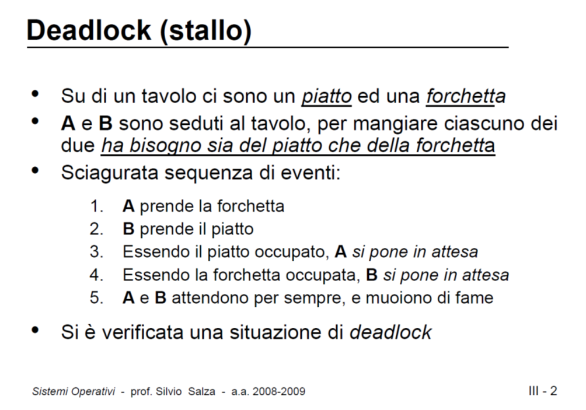
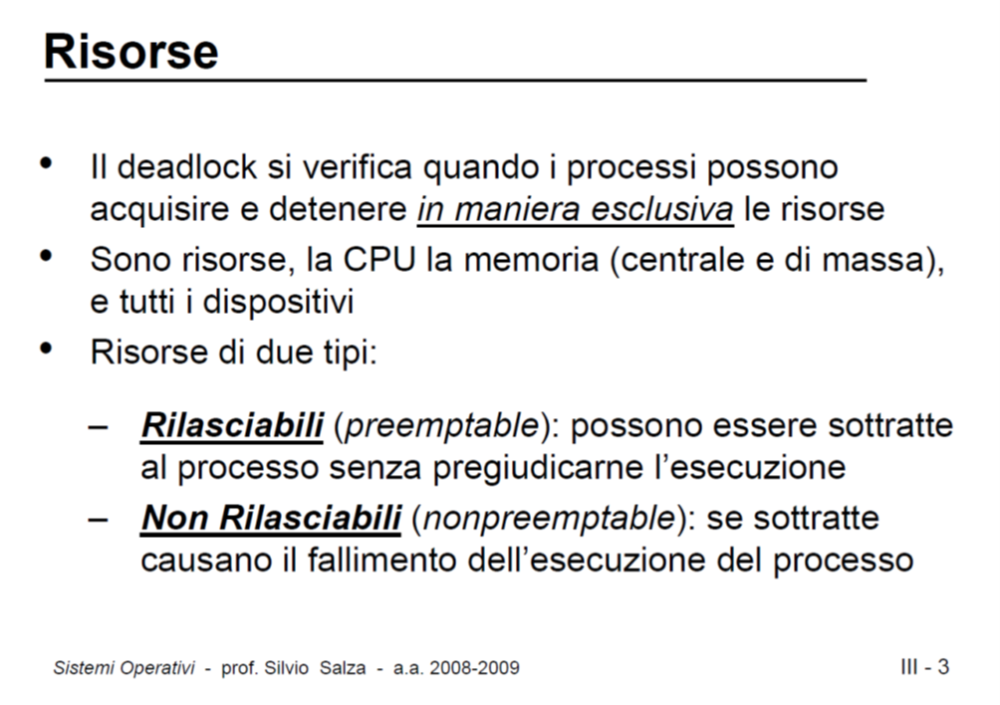
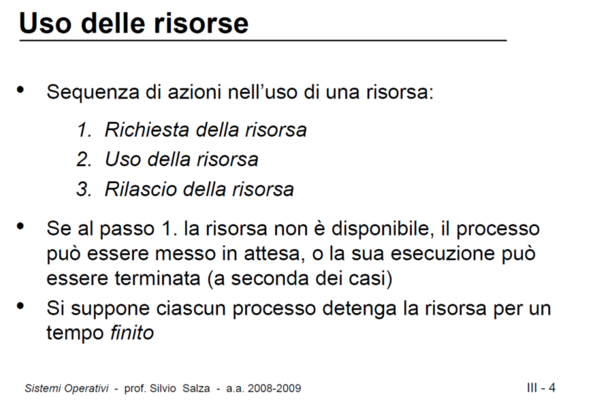
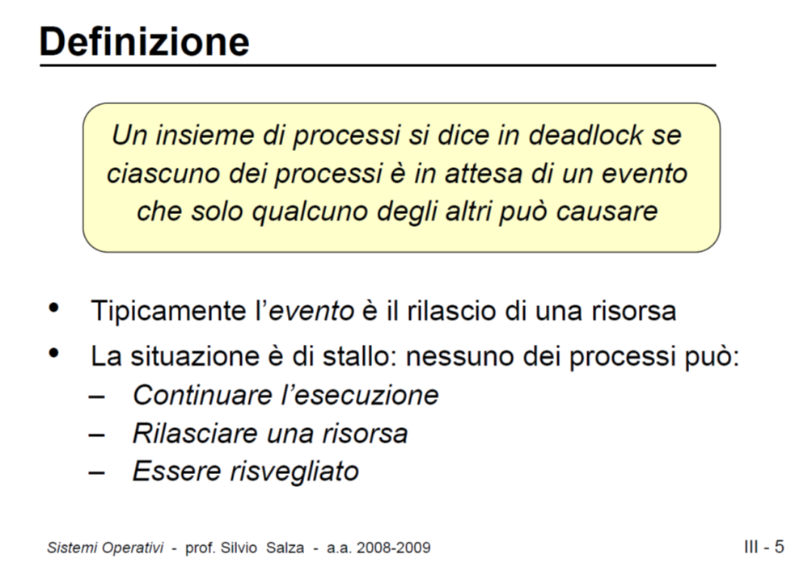
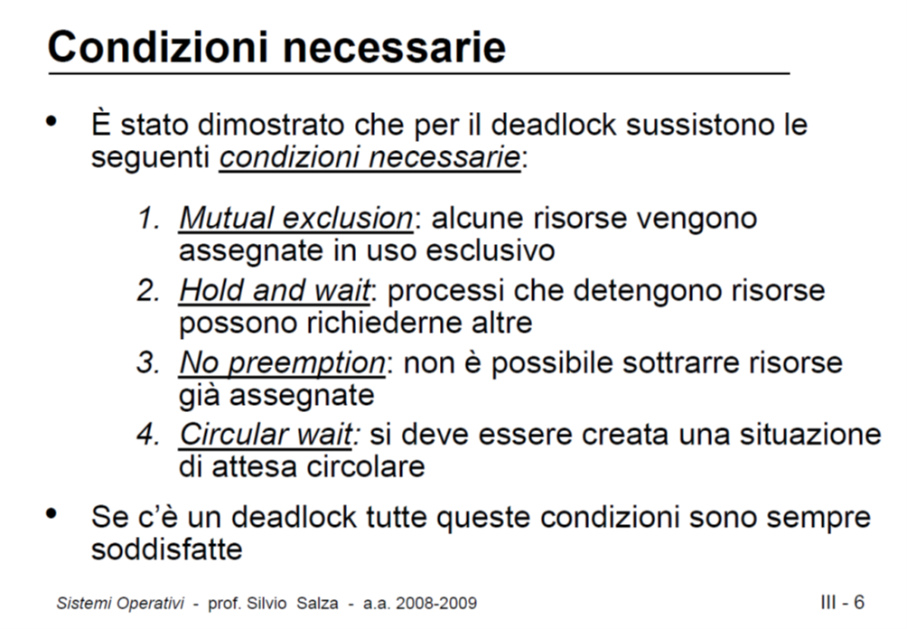
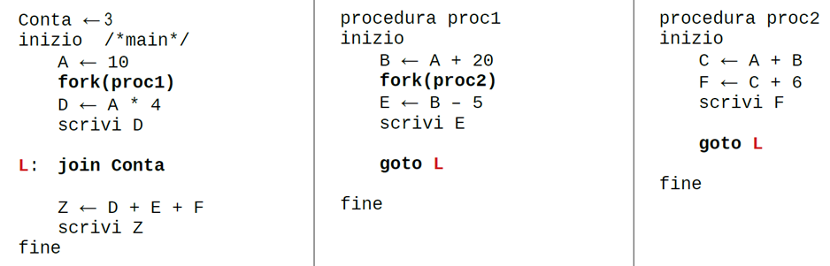
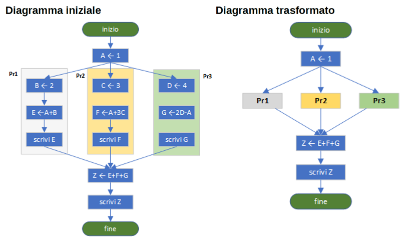
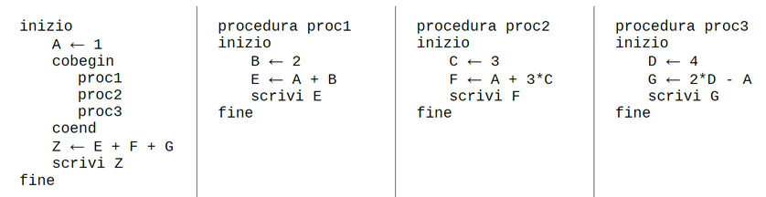

thread---
title: "Tecniche di sincronizzazione"
description: "Tecniche di sincronizzazione tra thread. Semafori. Concetto di deadlock. Costrutti per la programmazione concorrente"
sidebar:
  order: 30

---
import { Badge } from '@astrojs/starlight/components'

<style>{`
  img {display: block; margin: 0 auto;}
`}</style>

## Tecniche di sincronizzazione dei thread

**La sincronizzazione dei thread si riferisce all'azione di proteggersi da problemi di multithreading come race condition, deadlock e starvation**. Se più thread possono effettuare chiamate alle proprietà e ai metodi di un singolo oggetto, è essenziale che tali chiamate siano sincronizzate. Altrimenti un thread potrebbe interrompere le operazioni di un altro thread e l'oggetto potrebbe rimanere in uno stato non valido. Una classe i cui membri sono protetti da tali interruzioni è detta thread-safe. .NET offre diverse strategie per sincronizzare l'accesso a membri statici e di istanza:

* Aree di codice sincronizzate. È possibile usare la classe Monitor o il supporto del compilatore per questa classe per sincronizzare solo il codice critico necessario, migliorando le prestazioni.
* Sincronizzazione manuale. È possibile usare gli oggetti di sincronizzazione della libreria di classi .NET.

### C# Interlocked

Come visto nel capitolo precedente, l'incremento di una variabile scritto in una singola riga di C# viene effettivamente eseguito dal processore in tre passi (leggi, incrementa e scrivi). Un modo per affrontare questo problema consiste nell'eseguire queste tre operazioni come una singola operazione atomica. Ciò è possibile solo su dati di dimensione word (cioè valori che possono essere aggiornati con una singola istruzione di registro). I processori moderni forniscono istruzioni per aggiornamenti atomici sui dati word-sized; in C# la classe Interlocked è un wrapper per queste istruzioni a basso livello e consente di effettuare operazioni atomiche come increment e decrement su dati adeguati.

Di seguito una versione aggiornata del codice difettoso mostrato nel capitolo precedente:

```cs
using System;
using System.Collections.Generic;
using System.Linq;
using System.Text;
using System.Threading;

namespace AtomicUpdate01
{
    class Program
    {
        private static int sum;
        static void Main(string[] args)
        {

            //create thread t1 using anonymous method
            Thread t1 = new Thread(() =>
            {
                for (int i = 0; i < 10000000; i++)
                {
                    //use threading Interlocked class for atomic update
                    Interlocked.Increment(ref sum);
                }
            });

            //create thread t2 using anonymous method
            Thread t2 = new Thread(() =>
            {
                for (int i = 0; i < 10000000; i++)
                {
                    //use threading Interlocked class for atomic update
                    Interlocked.Increment(ref sum);
                }
            });


            //start thread t1 and t2
            t1.Start();
            t2.Start();

            //wait for thread t1 and t2 to finish their execution
            t1.Join();
            t2.Join();

            //write final sum on screen
            Console.WriteLine("sum: " + sum);

            Console.WriteLine("Press enter to terminate!");
            Console.ReadLine();
        }
    }
}

```

### Partizionamento dei dati

Il partizionamento dei dati è una strategia che consiste nel suddividere il dominio dei dati in porzioni assegnate a thread differenti (approccio "tu fai questa porzione, io faccio quella"). Per applicare il partizionamento è necessario disporre di conoscenze specifiche sul dominio dei dati (ad esempio nel caso di manipolazione di array o di più file), in modo da decidere quali slice possono essere elaborati indipendentemente. Esempio:

```cs
using System;
using System.Collections.Generic;
using System.Linq;
using System.Text;
using System.Threading;

namespace DataPartition01
{
    class Program
    {
        private static int[] array;
        private static int sum1;
        private static int sum2;

        static void Main(string[] args)
        {
            //set length for the array size
            int length = 1000000;
            //create new array of size length
            array = new int[length];

            //initialize array element with value of their respective index
            for (int i = 0; i < length; i++)
            {
                array[i] = i;
            }

            //index to split on
            int dataSplitAt = length / 2;

            //create thread t1 using anonymous method
            Thread t1 = new Thread(() =>
            {
                //calculate sum1
                for (int i = 0; i < dataSplitAt; i++)
                {
                    sum1 = sum1 + array[i];
                }
            });


            //create thread t2 using anonymous method
            Thread t2 = new Thread(() =>
            {
                //calculate sum2
                for (int i = dataSplitAt; i < length; i++)
                {
                    sum2 = sum2 + array[i];
                }
            });


            //start thread t1 and t2
            t1.Start();
            t2.Start();

            //wait for thread t1 and t2 to finish their execution
            t1.Join();
            t2.Join();

            //calculate final sum
            int sum = sum1 + sum2;

            //write final sum on screen
            Console.WriteLine("Sum:" + sum);

            Console.WriteLine("Press enter to terminate!");
            Console.ReadLine();
        }
    }
}

```

Questa tecnica non è sempre applicabile: ad esempio per serie in cui un elemento dipende dal precedente (come Fibonacci) non è adottabile facilmente.

### Sincronizzazione basata su attesa (Wait-Based Synchronization)

La tecnica basata su attesa è un modo sofisticato per gestire race condition, utilizzata quando le due tecniche precedenti non sono applicabili. In questa tecnica, un thread rimane bloccato finché non è sicuro procedere.

Supponiamo due thread X e Y che vogliono accedere a una risorsa R. Si sceglie una primitiva di lock LR (ad esempio un oggetto). Quando X vuole accedere a R acquisisce l'ownership di LR; finché X detiene LR nessun altro thread può accedervi. Se Y tenta di acquisire LR mentre X lo possiede, Y verrà bloccato finché X non rilascia LR.

#### Panoramica delle primitive di sincronizzazione in .NET

[https://docs.microsoft.com/en-us/dotnet/standard/threading/overview-of-synchronization-primitives](https://docs.microsoft.com/en-us/dotnet/standard/threading/overview-of-synchronization-primitives)

.NET offre vari tipi per sincronizzare l'accesso a risorse condivise o coordinare l'interazione tra thread.

- Classe WaitHandle e primitive di sincronizzazione basate su **handle del sistema operativo**:
  - `System.Threading.Mutex`: concede accesso esclusivo a una risorsa. Lo stato è segnalato se nessun thread lo possiede.
  - `System.Threading.Semaphore`: limita il numero di thread che possono accedere simultaneamente a una risorsa o a un pool di risorse.

I tipi **"lightweight"** non si basano su handle del kernel e generalmente offrono prestazioni migliori, ma non supportano la sincronizzazione interprocesso. Usarli per sincronizzare thread all'interno della stessa applicazione.

I tipi leggeri illustrati in questa guida sono:

- `SemaphoreSlim`: alternativa leggera a Semaphore.
- `System.Threading.Monitor`: fornisce esclusione reciproca tramite lock sull'oggetto identificativo della risorsa; include metodi Enter, TryEnter, Exit, Wait, Pulse, PulseAll.

#### Analisi Comparata: Monitor, Mutex e SemaphoreSlim in .NET

Nel contesto del framework .NET, la gestione della concorrenza richiede la selezione accurata della primitiva di sincronizzazione più idonea. Sebbene `Monitor`, `Mutex` e `SemaphoreSlim` condividano l'obiettivo di coordinare l'accesso alle risorse condivise, essi differiscono sostanzialmente per implementazione interna, ambito di visibilità e supporto ai pattern asincroni.

##### 1. System.Threading.Monitor

Il **Monitor** rappresenta la primitiva di sincronizzazione fondamentale per le applicazioni gestite (managed). Esso implementa un meccanismo di esclusione reciproca (Mutual Exclusion) ibrido ed esclusivo per il processo corrente.

- **Implementazione Tecnica:** Il Monitor in C# non è un oggetto del kernel puro. Esso sfrutta l'**Object Header** (nello specifico il *SyncBlock Index*) presente in ogni oggetto allocato sull'heap gestito. L'implementazione è definita "ibrida" poiché inizia con uno *spin-wait* (ciclo di attesa attiva in user-mode) per operazioni brevi, scalando a un'attesa basata sul kernel solo in caso di contesa prolungata.

- **Sintassi:** Il linguaggio C# astrae l'utilizzo delle chiamate `Monitor.Enter` e `Monitor.Exit` attraverso la parola chiave `lock`. Questo garantisce che il blocco venga rilasciato anche in presenza di eccezioni, grazie a un blocco `try-finally` implicito generato dal compilatore.

- **Limitazioni:**

    - **Ambito:** Visibile solo all'interno dell'`AppDomain` (non può sincronizzare processi diversi).

    - **Thread Affinity:** Il thread che acquisisce il lock deve essere necessariamente lo stesso che lo rilascia.

    - **Sincronia:** Non supporta l'attesa asincrona (non è compatibile con `await` all'interno del blocco critico).

##### 2. System.Threading.Mutex

La classe **Mutex** (Mutual Exclusion) è un wrapper gestito che incapsula un oggetto di sincronizzazione del kernel di Windows (Win32 Kernel Object).

- **Implementazione Tecnica:** A differenza del Monitor, il Mutex richiede sempre una transizione in **Kernel Mode** per ogni operazione di acquisizione o rilascio, comportando un overhead computazionale significativamente maggiore (nell'ordine di grandezza dei microsecondi rispetto ai nanosecondi del Monitor).

- **Identità di Sistema (IPC):** La caratteristica distintiva del Mutex è la possibilità di essere identificato da un nome univoco a livello di Sistema Operativo (es. `Global\MyMutex`). Ciò abilita la comunicazione tra processi (**IPC - Inter-Process Communication**), permettendo di sincronizzare thread appartenenti ad applicazioni distinte.

- **Thread Affinity:** Analogamente al Monitor, possiede affinità di thread: solo il thread proprietario può rilasciarlo.

##### 3. System.Threading.SemaphoreSlim

Il **SemaphoreSlim** è una versione "leggera" e moderna del classico `Semaphore`. Mentre il `Semaphore` tradizionale è un wrapper del kernel (come il Mutex), il `SemaphoreSlim` è implementato interamente in codice gestito (user-mode), ottimizzato per l'attesa breve.

- **Funzionamento:** A differenza di Mutex e Monitor che sono binari (locked/unlocked), il semaforo gestisce un contatore numerico che permette l'accesso concorrente a un numero $N$ di thread.

    - Se inizializzato con `maxCount = 1`, il `SemaphoreSlim` si comporta funzionalmente come un **Mutex Asincrono**.

- **Supporto Asincrono (Key Feature):** Questa è la differenza critica nell'ecosistema .NET moderno. `SemaphoreSlim` espone il metodo `WaitAsync()`. Ciò permette al thread corrente di non bloccarsi fisicamente durante l'attesa della risorsa, ma di restituire il controllo al pool di thread, ottimizzando la scalabilità nelle applicazioni I/O bound o nelle UI.

- **Thread Affinity:** **Non possiede affinità di thread.** Un thread può acquisire il semaforo (decrementare il contatore) e un thread diverso può rilasciarlo (incrementare il contatore).

#### Tabella di Sintesi Tecnica

La seguente tabella riassume le differenze architetturali e funzionali per guidare la scelta implementativa.

| **Caratteristica**    | **Monitor (lock)**          | **Mutex**                              | **SemaphoreSlim**                        |
| --------------------- | --------------------------- | -------------------------------------- | ---------------------------------------- |
| **Tipo di Oggetto**   | Gestito (User-mode ibrido)  | Kernel Object (Win32 wrapper)          | Gestito (User-mode ibrido)               |
| **Ambito (Scope)**    | Intra-processo (AppDomain)  | **Inter-processo** (Sistema Operativo) | Intra-processo                           |
| **Performance**       | Molto Alta (ns)             | Bassa (µs - Kernel transition)         | Alta (ns)                                |
| **Pattern Asincrono** | **Non supportato**          | Non supportato nativamente             | **Pieno supporto (`WaitAsync`)**         |
| **Semantica**         | Mutua Esclusione (1 thread) | Mutua Esclusione (1 thread)            | Throttling (N thread) o Mutex (1 thread) |
| **Thread Affinity**   | Sì (Obbligatoria)           | Sì (Obbligatoria)                      | No (Opzionale)                           |

**Confronto tra costrutti di locking:**

| **Costrutto**                                 | **Scopo**                                                                                     | **Cross-process?** | **Overhead\*** |
| --------------------------------------------- | --------------------------------------------------------------------------------------------- | ------------------ | -------------- |
| [lock] (`Monitor.Enter` / `Monitor.Exit`)     | Garantisce che un solo thread possa accedere a una risorsa o sezione di codice alla volta     | -                  | 20ns           |
| [Mutex]                                       | Accesso esclusivo, utilizzabile cross-process                                                 | Sì                 | 1000ns         |
| [SemaphoreSlim] (introdotto in Framework 4.0) | Limita il numero di thread concorrenti che possono accedere a una risorsa o sezione di codice | -                  | 200ns          |
| [Semaphore]                                   | Versione utilizzabile cross-process                                                           | Sì                 | 1000ns         |

\*Tempo per acquisire e rilasciare il lock sullo stesso thread (assumendo nessun blocco), misurato su Intel Core i7 860.[^1]

[^1]: [http://www.albahari.com/threading/part2.aspx](http://www.albahari.com/threading/part2.aspx)

#### Scenario Pratico: Quando utilizzare cosa

Di seguito si delineano le linee guida per l'adozione delle primitive in scenari di produzione:

1. Scenario Standard (In-Process Safety):

    Si utilizzi Monitor (pattern lock) per proteggere l'accesso a strutture dati in memoria (es. `List<T>`, campi statici) quando il codice è sincrono e l'attesa è breve. È la scelta predefinita per prestazioni e sicurezza.

2. Scenario Single-Instance (Cross-Process):

    Si utilizzi Mutex esclusivamente quando è necessario garantire che una sola istanza dell'applicazione sia in esecuzione sull'intera macchina.

3. Scenario Asincrono o Throttling:

    Si utilizzi SemaphoreSlim in due casi specifici:

    - Quando il codice all'interno della sezione critica utilizza `await` (es. chiamate a database, API web). L'uso di `lock` con `await` è vietato dal compilatore.

    - Quando si desidera limitare il parallelismo (es. permettere massimo 5 download simultanei), impostando il contatore iniziale a 5.

#### Esempio di Codice Comparativo

```cs
public class EsempioSincronizzazione
{
    // 1. MONITOR: Oggetto semplice per il lock
    private readonly Lock _lockObj = new Lock();

    // 2. SEMAPHORESLIM: Inizializzato a 1 per comportarsi come un Mutex
    private readonly SemaphoreSlim _asyncLock = new SemaphoreSlim(1, 1);

    public void MetodoSincrono()
    {
        // Uso standard del Monitor tramite 'lock'
        lock (_lockObj)
        {
            // Sezione critica veloce e sincrona
            Console.WriteLine("Accesso esclusivo sincrono");
        }
    }

    public async Task MetodoAsincrono()
    {
        // Uso del SemaphoreSlim per attesa asincrona
        // Il thread non si blocca, ma libera risorse durante l'attesa
        await _asyncLock.WaitAsync();
        try
        {
            // Sezione critica che include operazioni I/O asincrone
            await Task.Delay(1000);
            Console.WriteLine("Accesso esclusivo asincrono");
        }
        finally
        {
            _asyncLock.Release();
        }
    }
}

```

#### C# Lock Keyword

Alcuni linguaggi di alto livello offrono una sintassi che riduce il codice necessario in situazioni comuni. C# fornisce la parola chiave lock per semplificare l'uso di Monitor. Si inserisce la sezione critica nel corpo di lock e il compilatore genera il codice Monitor appropriato.

```cs
using System;
using System.Collections.Generic;
using System.Linq;
using System.Text;
using System.Threading;

namespace LockKeyword
{
    class Program
    {
        private static int sum;
        private static readonly Lock _lock = new Lock();

        static void Main(string[] args)
        {

            //create thread t1 using anonymous method
            Thread t1 = new Thread(() => {
                for (int i = 0; i < 10000000; i++)
                {
                    lock (_lock)
                    {
                        //increment sum value
                        sum++;
                    }
                }
            });

            //create thread t2 using anonymous method
            Thread t2 = new Thread(() => {
                for (int i = 0; i < 10000000; i++)
                {
                    lock (_lock)
                    {
                        //increment sum value
                        sum++;
                    }
                }
            });


            //start thread t1 and t2
            t1.Start();
            t2.Start();

            //wait for thread t1 and t2 to finish their execution
            t1.Join();
            t2.Join();

            //write final sum on screen
            Console.WriteLine("sum: " + sum);

            Console.WriteLine("Press enter to terminate!");
            Console.ReadLine();
        }
    }
}

```

:::note
La classe `System.Threading.Lock` è stata introdotta in [**.NET 9 e C# 13**](https://learn.microsoft.com/en-us/dotnet/csharp/whats-new/csharp-13#new-lock-object) come tipo dedicato e ottimizzato per la sincronizzazione, offrendo **migliori prestazioni** e un'intenzione più chiara rispetto all'uso di un generico `object`.
:::

#### ReaderWriterLockSlim <Badge text="Approfondimento" variant="note" size="medium" />   

Quando si ha una risorsa che viene letta frequentemente ma scritta raramente, l'uso di un semplice `lock` (Monitor) può creare un collo di bottiglia, poiché blocca anche i lettori tra di loro. In questi scenari, la classe `ReaderWriterLockSlim` offre prestazioni migliori permettendo a più thread di leggere contemporaneamente, garantendo l'accesso esclusivo solo quando un thread deve scrivere.

**Caratteristiche principali:**
- **Modalità Lettura**: Più thread possono acquisire il lock in lettura (`EnterReadLock`).
- **Modalità Scrittura**: Solo un thread può acquisire il lock in scrittura (`EnterWriteLock`), bloccando tutti gli altri lettori e scrittori.
- **Prevenzione Deadlock**: Progettato per evitare i problemi di ricorsione della vecchia classe `ReaderWriterLock`.

Esempio di utilizzo:

```csharp
using System;
using System.Collections.Generic;
using System.Threading;

namespace ReaderWriterLockSlimExample
{
    public class Cache
    {
        private ReaderWriterLockSlim cacheLock = new ReaderWriterLockSlim();
        private Dictionary<int, string> innerCache = new Dictionary<int, string>();

        public string Read(int key)
        {
            cacheLock.EnterReadLock();
            try
            {
                // Simuliamo un'operazione di lettura che richiede tempo (es. 100ms)
                // In questo modo possiamo vedere che più lettori entrano contemporaneamente
                Console.WriteLine($"[Lettura] Thread {Thread.CurrentThread.ManagedThreadId} sta leggendo la chiave {key}...");
                Thread.Sleep(100); 
                
                if (innerCache.ContainsKey(key))
                {
                    string val = innerCache[key];
                    Console.WriteLine($"[Lettura] Thread {Thread.CurrentThread.ManagedThreadId} ha completato la lettura: {val}");
                    return val;
                }
                else
                {
                    Console.WriteLine($"[Lettura] Thread {Thread.CurrentThread.ManagedThreadId} non ha trovato la chiave {key}");
                    return null;
                }
            }
            finally
            {
                cacheLock.ExitReadLock();
            }
        }

        public void Add(int key, string value)
        {
            cacheLock.EnterWriteLock();
            try
            {
                // Simuliamo un'operazione di scrittura che richiede più tempo (es. 2s)
                // Durante questo tempo, NESSUN altro thread può leggere o scrivere
                Console.WriteLine($"[SCRITTURA] Thread {Thread.CurrentThread.ManagedThreadId} ha acquisito il lock in SCRITTURA per la chiave {key}...");
                Thread.Sleep(2000); 
                innerCache[key] = value;
                Console.WriteLine($"[SCRITTURA] Thread {Thread.CurrentThread.ManagedThreadId} ha completato la scrittura.");
            }
            finally
            {
                cacheLock.ExitWriteLock();
            }
        }

        public void Dispose()
        {
            if (cacheLock != null) cacheLock.Dispose();
        }
    }

    class Program
    {
        static void Main(string[] args)
        {
            var cache = new Cache();
            var random = new Random();

            // Popoliamo inizialmente la cache
            cache.Add(1, "Dato Iniziale 1");
            cache.Add(2, "Dato Iniziale 2");
            cache.Add(3, "Dato Iniziale 3");

            Console.WriteLine("Avvio simulazione: 5 lettori e 2 scrittori...");
            Console.WriteLine("Si osservi come le letture si sovrappongono, mentre le scritture sono esclusive.");
            Console.WriteLine("----------------------------------------------------------------------------");

            // Avviamo 5 thread lettori
            for (int i = 0; i < 5; i++)
            {
                int readerId = i;
                Thread t = new Thread(() =>
                {
                    while (true)
                    {
                        int key = random.Next(1, 5);
                        cache.Read(key);
                        Thread.Sleep(random.Next(50, 200)); // Pausa casuale tra le letture
                    }
                });
                t.Start();
            }

            // Avviamo 2 thread scrittori
            for (int i = 0; i < 2; i++)
            {
                int writerId = i;
                Thread t = new Thread(() =>
                {
                    while (true)
                    {
                        int key = random.Next(1, 5);
                        string val = $"Aggiornamento da Writer {writerId} ore {DateTime.Now.Second}";
                        cache.Add(key, val);
                        Thread.Sleep(random.Next(2000, 4000)); // Scritture meno frequenti
                    }
                });
                t.Start();
            }

            // Attendiamo input per terminare
            Console.ReadLine();
        }
    }
}
```

Per approfondire: [ReaderWriterLockSlim Class (Microsoft Docs)](https://learn.microsoft.com/en-us/dotnet/api/system.threading.readerwriterlockslim?view=net-8.0)

#### Semafori

[https://docs.microsoft.com/en-us/dotnet/standard/threading/semaphore-and-semaphoreslim](https://docs.microsoft.com/en-us/dotnet/standard/threading/semaphore-and-semaphoreslim)

I semafori possono essere locali all'applicazione o denominati nel sistema (utili per sincronizzazione interprocesso). SemaphoreSlim è un'alternativa leggera a Semaphore che non usa i semafori del kernel di Windows; non supporta semafori denominati e quindi è utilizzabile solo localmente. È il semaforo raccomandato per la sincronizzazione all'interno di una singola app.

Un semaforo leggero controlla l'accesso a un pool di risorse locale all'applicazione. Si specificano il numero massimo di thread che possono entrare contemporaneamente e il numero iniziale.
- **Il conteggio viene decrementato a ogni entrata (metodo `Wait`) e incrementato a ogni rilascio (metodo `Release`).** 
- **Le chiamate `Wait`/`WaitAsync` bloccano lesecuzione del thread quando il conteggio è zero; Quando il conteggio raggiunge zero le chiamate successive attendono fino a che altri thread rilasciano il semaforo.**
- **`Release` incrementa il conteggio.**
- **Non è garantito l'ordine FIFO per i thread in attesa.**
Struttura di base per usare SemaphoreSlim:

```cs
// Enter semaphore by calling one of the Wait or WaitAsync methods.  
SemaphoreSlim.Wait()     
//Execute code protected by the semaphore.   
SemaphoreSlim.Release()
```

La proprietà CurrentCount riporta il valore attuale del contatore del semaforo.

| **COSTRUTTORI**             |                                                                                                          |
| --------------------------- | -------------------------------------------------------------------------------------------------------- |
| SemaphoreSlim(Int32)        | Inizializza un SemaphoreSlim specificando il numero iniziale di ingressi consentiti.                     |
| SemaphoreSlim(Int32, Int32) | Inizializza un SemaphoreSlim specificando il numero iniziale e il numero massimo di ingressi consentiti. |

Un thread può entrare più volte nel semaforo chiamando ripetutamente Wait; per rilasciarlo lo stesso thread deve chiamare Release lo stesso numero di volte o usare Release(Int32) per rilasciare più ingressi.

Esempio con thread:

```cs
using System;
using System.Threading;
using System.Threading.Tasks;

namespace ThreadGym
{
    class Program
    {
        private static SemaphoreSlim semaphore;
        // A padding interval to make the output more orderly.
        private static int padding;

        public static void Main()
            {
            // Create the semaphore.
            semaphore = new SemaphoreSlim(0, 3);
            Console.WriteLine("{0} Thread can enter the semaphore.",
                              semaphore.CurrentCount);
            Thread[] threads = new Thread[5];

            // Create and start five numbered tasks.
            for (int i = 0; i <= 4; i++)
            {
                threads[i] =  new Thread(() => {
                    // Each task begins by requesting the semaphore.
                    Console.WriteLine("Thread {0} begins and waits for the semaphore.",
                                      Thread.CurrentThread.ManagedThreadId);

                    //blocca il thread/task corrente in attesa di entrare nel semaforo
                    semaphore.Wait();
                    //https://docs.microsoft.com/en-us/dotnet/api/system.threading.interlocked?view=netframework-4.8
                    //Adds two integers and replaces the first integer with the sum, as an atomic operation.
                    Interlocked.Add(ref padding, 100);

                    Console.WriteLine("Thread {0} enters the semaphore.", Thread.CurrentThread.ManagedThreadId);

                    // The task just sleeps for 1+ seconds.
                    Thread.Sleep(1000 + padding);
                    //rilascio il semaforo e incrementa il contatore
                    Console.WriteLine("Thread {0} releases the semaphore; previous count: {1}.",
                                      Thread.CurrentThread.ManagedThreadId, semaphore.Release());
                });
            }
            foreach (var thread in threads)
            {
                thread.Start();
            }
            // Wait for half a second, to allow all the tasks to start and block.
            Thread.Sleep(500);

            // Restore the semaphore count to its maximum value.
            Console.Write("Main thread calls Release(3) --> ");
            //rilascia il semaforo del numero specificato di valori
            semaphore.Release(3);
            Console.WriteLine("{0} Threads can enter the semaphore.",
                              semaphore.CurrentCount);
            // Main thread waits for the tasks to complete.
            foreach (var thread in threads)
            {
                thread.Join();
            }

            Console.WriteLine("Main thread exits.");
            Console.ReadLine();
        }

    }

}

```

[https://docs.microsoft.com/en-us/dotnet/standard/threading/semaphore-and-semaphoreslim](https://docs.microsoft.com/en-us/dotnet/standard/threading/semaphore-and-semaphoreslim)

#### Produttore-consumatore

Prima versione: buffer a gestione LIFO (Stack)

```cs
using System;
using System.Threading;

namespace ProducerConsumerLIFO
{
    class Program
    {
        static readonly Lock _lock = new ();
        static int BufferSize = 10;
        static SemaphoreSlim emptyPosCount = new (BufferSize,BufferSize);
        static SemaphoreSlim fillPosCount = new (0,BufferSize);
        static int firstEmptyPos = 0;
        static int[] buffer = new int[BufferSize];
        static void Main(string[] args)
        {
            Thread producer = new (ProducerWork) { Name = "Producer" };
            Thread consumer = new (ConsumerWork) { Name = "Consumer" };
            producer.Start();
            consumer.Start();

            //attendo la fine dei thread producer e consumer
            producer.Join();
            consumer.Join();

            Console.WriteLine("Fine");

        }

        private static void ConsumerWork()
        {
            while (true)
            {
                fillPosCount.Wait();//passo il semaforo - ci sono celle piene
                lock (_lock)
                {
                    buffer[--firstEmptyPos] = 0;//simulo la lettura del dato
                    Console.WriteLine("Consumato prodotto alla posizione {0} da thread id = {1}, thread name = {2}", 
                        firstEmptyPos,
                        Environment.CurrentManagedThreadId, 
                        Thread.CurrentThread.Name);
                    PrintArray(buffer);
                }
                emptyPosCount.Release();
                Thread.Sleep(2500);
            }
        }

        private static void ProducerWork()
        {
            while (true)
            {
                emptyPosCount.Wait();//passo il semaforo - ci sono celle vuote
                lock (_lock)//sezione critica
                {
                    buffer[firstEmptyPos] = 1;
                    Console.WriteLine("Aggiunto prodotto alla posizione {0} da thread id = {1}, thread name = {2}", 
                        firstEmptyPos,
                        Environment.CurrentManagedThreadId, 
                        Thread.CurrentThread.Name);
                    PrintArray(buffer);
                    firstEmptyPos++;
                }
                fillPosCount.Release();
                Thread.Sleep(1000);
            }
        }

        static void PrintArray(int[] array)
        {
            foreach (var item in array)
            {
                Console.Write(item + " ");
            }
            Console.WriteLine();
        }

    }
}

```

Seconda versione: buffer gestito con tecnica FIFO, con coda circolare

```cs
using System;
using System.Threading;

namespace ProducerConsumerFIFO
{
    class Program
    {
        static readonly Lock _lock = new ();
        static int bufferSize = 10;
        static int[] buffer = new int[bufferSize];
        static SemaphoreSlim emptyPosCount = new (bufferSize, bufferSize);
        static SemaphoreSlim fillPosCount = new (0, bufferSize);
        static int writePos = 0;
        static int readPos = 0;

        static void Main(string[] args)
        {
            Thread producer = new (ProducerWork) { Name = "Producer" };
            Thread consumer = new (ConsumerWork) { Name = "Consumer" };
            producer.Start();
            consumer.Start();

            //attendo la fine dei thread producer e consumer
            producer.Join();
            consumer.Join();

            Console.WriteLine("Fine");
        }

        private static void ConsumerWork()
        {
            while (true)
            {
                fillPosCount.Wait();//passo il semaforo - ci sono celle piene
                lock (_lock)
                {
                    buffer[readPos] = 0;
                    Console.WriteLine("Consumato prodotto alla posizione {0} da thread id = {1}, thread name = {2}", 
                        readPos,
                        Environment.CurrentManagedThreadId, 
                        Thread.CurrentThread.Name);
                    Console.WriteLine("Numero celle libere {0}", emptyPosCount.CurrentCount + 1);
                    PrintArray(buffer);
                    //incremento modulo BufferSize - coda circolare
                    readPos = (readPos + 1) % bufferSize;

                }
                emptyPosCount.Release();
                Thread.Sleep(2500);
            }
        }

        private static void ProducerWork()
        {
            while (true)
            {
                emptyPosCount.Wait();//passo il semaforo - ci sono celle vuote
                lock (_lock)//sezione critica
                {
                    buffer[writePos] = 1;
                    Console.WriteLine("Aggiunto prodotto alla posizione {0} da thread id = {1}, thread name = {2}", 
                        writePos,
                        Environment.CurrentManagedThreadId, 
                        Thread.CurrentThread.Name);
                    Console.WriteLine("Numero celle occupate {0}", fillPosCount.CurrentCount + 1);
                    PrintArray(buffer);
                    //incremento modulo BufferSize - coda circolare
                    writePos = (writePos+1)%bufferSize;
                }
                fillPosCount.Release();
                Thread.Sleep(1000);
            }
        }

        static void PrintArray(int[] array)
        {
            foreach (var item in array)
            {
                Console.Write(item + " ");
            }
            Console.WriteLine();
        }
    }
}

```

#### Algoritmo del barbiere

Concetti ed esempi fondamentali:

[https://en.wikipedia.org/wiki/Sleeping\_barber\_problem](https://en.wikipedia.org/wiki/Sleeping_barber_problem)

Si consideri un negozio di barbiere ipotetico con un solo barbiere, una sedia da barbiere e una sala d'attesa con n sedie (n può essere 0) per i clienti in attesa. Le regole sono:

- Se non ci sono clienti, il barbiere si addormenta sulla sedia.
- Un cliente deve svegliare il barbiere se è addormentato.
- Se un cliente arriva mentre il barbiere sta lavorando e tutte le sedie della sala d'attesa sono occupate, il cliente se ne va; altrimenti si siede su una sedia libera.
- Quando il barbiere termina un taglio, controlla la sala d'attesa: se non ci sono clienti si riaddormenta.

:::caution
Complicazioni principali:
1. **Deadlock**: Si verifica se il barbiere attende un cliente e il cliente attende il barbiere in modo circolare senza che nessuno dei due possa procedere. Ad esempio, se un cliente acquisisce un lock sulla sala d'attesa e poi attende che il barbiere sia libero, mentre il barbiere ha bisogno del lock sulla sala d'attesa per segnalare che è libero.
2. **Starvation (Inedia)**: Se non viene garantito un ordine equo (es. FIFO), alcuni clienti potrebbero attendere indefinitamente mentre altri appena arrivati vengono serviti prima.
3. **Race Conditions**: Se l'accesso al numero di sedie libere o allo stato del barbiere non è sincronizzato correttamente, due clienti potrebbero credere di aver trovato l'ultimo posto libero contemporaneamente, o il barbiere potrebbe addormentarsi mentre un cliente si sta sedendo.
4. **Busy Waiting**: Se implementato male (es. con cicli `while` che controllano continuamente una variabile), l'algoritmo può consumare inutilmente CPU. L'uso di semafori o monitor evita questo problema sospendendo i thread.

:::

Prima versione -- sezione critica gestita con semaforo:

```cs
using System;
using System.Threading;

namespace BarberShopV1
{
    class Program
    {
        //per la gestione della sezione critica si utilizza un semaforo
        const int numberOfSeats = 10;
        static int freeSeats = numberOfSeats;
        static readonly SemaphoreSlim seatAccess = new(1, 1);
        static readonly SemaphoreSlim barberReady = new(0, 1);
        static readonly SemaphoreSlim clientReady = new(0, numberOfSeats);
        static void Main(string[] args)
        {
            //Attivazione del thread del barbiere
            //il barbiere dorme sulla sua sedia da lavoro
            //quando arriva un cliente, il barbiere si sveglia e gli taglia i capelli
            //quando ha finito di tagliare i capelli, se c'è un altro cliente seduto
            //su una delle sedie del negozio, lo serve immediatamente, altrimenti ritorna a dormine
            //il barbiere si sveglia appena arriva un nuovo cliente
            Thread barber = new(Barber);
            barber.Start();

            //Attivazione dei thread dei clienti
            //un cliente arriva in un momento qualsiasi, se trova un posto libero nella
            //sala d'attesa si siede e aspetta fino a che non viene servito; se arriva e trova
            //tutte le sedie occupate, se ne va via
            int numberOfClients = 30;
            for (int i = 0; i < numberOfClients; i++)
            {
                new Thread(Client).Start();
                //i clienti arrivano con una certa frequenza al negozio
                Thread.Sleep(500);
            }
            barber.Join();
        }

        private static void Client()
        {
            //il cliente deve verificare se c'è posto
            //per farlo deve controllare il numero di posti liberi e quindi deve accedere alla
            //sezione critica
            seatAccess.Wait();
            if (freeSeats > 0)
            {
                //il cliente si siede ed occupa un posto
                freeSeats--;
                Console.WriteLine($"Il cliente con Thread Id = {Environment.CurrentManagedThreadId} trova posto e attende di essere servito; posti disponibili = {freeSeats}");
                seatAccess.Release();//esce dalla sezione critica
                clientReady.Release();//aumenta il numero di clienti disponibili
                barberReady.Wait();//attende che il barbiere sia disponibile
                //il cliente viene servito
                Console.WriteLine($"Sono il cliente con ThreadId = {Environment.CurrentManagedThreadId} " +
                    $". Il Barbiere ha finito di tagliarmi i capelli.");
            }
            else
            {
                //libero la sezione critica
                seatAccess.Release();
                //il cliente se ne va
                Console.WriteLine($"Il cliente con ThreadId = {Environment.CurrentManagedThreadId} non ha trovato posto e se ne va");
            }

        }

        private static void Barber()
        {
            while (true)
            {
                clientReady.Wait();//attendo che ci sia un cliente
                //il cliente si accomoda sulla sedia del barbiere e libera un posto
                seatAccess.Wait();//il barbiere deve accedere alla sezione critica
                freeSeats++;//il barbiere libera un posto
                Console.WriteLine("Il barbiere libera un posto");
                seatAccess.Release();//il barbiere esce dalla sezione critica
                Console.WriteLine($"Il Barbiere sta tagliando i capelli");
                Thread.Sleep(2000);//il barbiere sta tagliando in capelli; questo è il tempo impiegato per tagliare i capelli
                barberReady.Release(); //il barbiere è nuovamente disponibile
            }
        }
    }
}


```

Seconda versione -- sezione critica gestita con Monitor (lock):

```cs
using System;
using System.Threading;

namespace BarberShopV2
{
    class Program
    {
        //per la gestione della sezione critica si utilizza un Monitor (lock)
        const int numberOfSeats = 10;
        static int freeSeats = numberOfSeats;
        private static readonly Lock _lock = new();
        static readonly SemaphoreSlim barberReady = new(0, 1);
        static readonly SemaphoreSlim clientReady = new(0, numberOfSeats);

        static void Main(string[] args)
        {
            //Attivazione del thread del barbiere
            //il barbiere dorme sulla sua sedia da lavoro
            //quando arriva un cliente, il barbiere si sveglia e gli taglia i capelli
            //quando ha finito di tagliare i capelli, se c'è un altro cliente seduto 
            //su una delle sedie del negozio, lo serve immediatamente, altrimenti ritorna a dormine
            //il barbiere si sveglia appena arriva un nuovo cliente
            Thread barber = new Thread(Barber);
            barber.Start();

            //Attivazione dei thread dei clienti
            //un cliente arriva in un momento qualsiasi, se trova un posto libero nella
            //sala d'attesa si siede e aspetta fino a che non viene servito; se arriva e trova
            //tutte le sedie occupate, se ne va via
            int numberOfClients = 30;
            for (int i = 0; i < numberOfClients; i++)
            {
                new Thread(Client).Start();
                //i clienti arrivano con una certa frequenza al negozio
                Thread.Sleep(500);
            }
            barber.Join();
        }

        private static void Client()
        {
            //il cliente deve verificare se c'è posto
            //per farlo deve controllare il numero di posti liberi e quindi deve accedere alla
            bool clienteSiSiede = false;
            //sezione critica
            //le operazioni in sezione critica devono durare il minimo possibile
            lock (_lock)
            {
                if (freeSeats > 0)
                {
                    //il cliente si siede ed occupa un posto
                    freeSeats--;
                    Console.WriteLine($"Il cliente con Thread Id = {Environment.CurrentManagedThreadId} trova posto e attende di essere servito;" +
                        $" posti disponibili = {freeSeats}");
                    clienteSiSiede = true;
                }
            }
            if (clienteSiSiede)
            {
                clientReady.Release();//aumenta il numero di clienti disponibili
                barberReady.Wait();//attende che il barbiere sia disponibile
                                   //il cliente viene servito
                Console.WriteLine($"Sono il cliente con ThreadId = {Environment.CurrentManagedThreadId} " +
                    $". Il Barbiere ha finito di tagliarmi i capelli.");
            }
            else
            {
                //il cliente se ne va
                Console.WriteLine($"Il cliente con ThreadId = {Environment.CurrentManagedThreadId} non ha trovato posto e se ne va");
            }
        }


        private static void Barber()
        {
            while (true)
            {
                clientReady.Wait();//attendo che ci sia un cliente
                //il cliente si accomoda sulla sedia del barbiere e libera un posto
                lock (_lock)
                {
                    freeSeats++;//il barbiere libera un posto
                    Console.WriteLine("Il barbiere libera un posto");
                }//il barbiere deve accedere alla sezione critica
                Console.WriteLine($"Il Barbiere sta tagliando i capelli");
                Thread.Sleep(2000);//il barbiere sta tagliando in capelli; questo è il tempo impiegato per tagliare i capelli
                barberReady.Release(); //il barbiere è nuovamente disponibile
            }
        }
    }
}

```

Note e riferimenti:

[https://github.com/meysam81/Sleeping-Barber-Problem](https://github.com/meysam81/Sleeping-Barber-Problem)

[https://github.com/meysam81/Networked-Sleeping-Barber-Problem](https://github.com/meysam81/Networked-Sleeping-Barber-Problem)

### Deadlock

[http://www.diag.uniroma1.it/~salza/SO/SO-III-2p.pdf](http://www.diag.uniroma1.it/~salza/SO/SO-III-2p.pdf)











#### Un esempio di deadlock: il barbiere sbagliato

La versione seguente dell'`Algoritmo del Barbiere` va in `deadlock`: è stato introdotto volontariamente un errore per mostrare il problema dell'attesa circolare.

```cs
using System;
using System.Threading;

namespace BarberShopDeadLock
{
    class Program
    {
        //per la gestione della sezione critica si utilizza un Monitor (lock)
        const int numberOfSeats = 10;
        static int freeSeats = numberOfSeats;
        private static readonly Lock _lock = new Lock();
        static SemaphoreSlim barberReady = new SemaphoreSlim(0, 1);
        static SemaphoreSlim clientReady = new SemaphoreSlim(0, numberOfSeats);

        static void Main(string[] args)
        {
            //Attivazione del thread del barbiere
            //il barbiere dorme sulla sua sedia da lavoro
            //quando arriva un cliente, il barbiere si sveglia e gli taglia i capelli
            //quando ha finito di tagliare i capelli, se c'è un altro cliente seduto 
            //su una delle sedie del negozio, lo serve immediatamente, altrimenti ritorna a dormine
            //il barbiere si sveglia appena arriva un nuovo cliente
            Thread barber = new Thread(Barber);
            barber.Start();

            //Attivazione dei thread dei clienti
            //un cliente arriva in un momento qualsiasi, se trova un posto libero nella
            //sala d'attesa si siede e aspetta fino a che non viene servito; se arriva e trova
            //tutte le sedie occupate, se ne va via
            int numberOfClients = 30;
            for (int i = 0; i < numberOfClients; i++)
            {
                new Thread(Client).Start();
                //i clienti arrivano con una certa frequenza al negozio
                Thread.Sleep(500);
            }
            barber.Join();
        }

        private static void Client(object obj)
        {
            //il cliente deve verificare se c'è posto
            //per farlo deve controllare il numero di posti liberi e quindi deve accedere alla

            //sezione critica
            //QUESTA VERSIONE VA IN DEADLOCK - QUESTO E' VOLUTO PER MOSTRARE IL PROBLEMA DELL'ATTESA CIRCOLARE
            //IL DEADLOCK E' DOVUTO AL FATTO CHE QUANDO IL CLIENT PRENDE IL LOCK RIMANE IN ATTESA CHE IL BARBIERE SIA DISPONIBILE
            //MA IL BARBIERE PER TAGLIARE I CAPELLI DEVE PRENDERE IL LOCK CHE NON ARRIVERA' MAI
            lock (_lock)
            {
                if (freeSeats > 0)
                {
                    //il cliente si siede ed occupa un posto
                    freeSeats--;
                    Console.WriteLine($"Il cliente con Thread Id = {Thread.CurrentThread.ManagedThreadId} trova posto e attende di essere servito;" +
                        $" posti disponibili = {freeSeats}");
                    clientReady.Release();//aumenta il numero di clienti disponibili
                    barberReady.Wait();//attende che il barbiere sia disponibile
                                       //il cliente viene servito
                    Console.WriteLine($"Sono il cliente con ThreadId = {Thread.CurrentThread.ManagedThreadId} " +
                        $". Il Barbiere mi sta tagliando i capelli. Posti disponibili = {freeSeats}");
                }
                else
                {
                    //il cliente se ne va
                    Console.WriteLine($"Il cliente con ThreadId = {Thread.CurrentThread.ManagedThreadId} non ha trovato posto e se ne va");
                }
            }
        }


        private static void Barber(object obj)
        {
            while (true)
            {
                clientReady.Wait();//attendo che ci sia un cliente
                //il cliente si accomoda sulla sedia del barbiere e libera un posto
                Console.WriteLine("Barbiere: Sono in attesa di entrare in sezione critica");
                lock (_lock)
                {
                    freeSeats++;//il barbiere libera un posto
                    Console.WriteLine("Il barbiere libera un posto");
                }//il barbiere deve accedere alla sezione critica
                Console.WriteLine($"Il Barbiere sta tagliando i capelli");
                Thread.Sleep(2000);//il barbiere sta tagliando in capelli; questo è il tempo impiegato per tagliare i capelli
                barberReady.Release(); //il barbiere è nuovamente disponibile
            }
        }
    }
}

```

## Costrutti per la programmazione concorrente -- uso di thread

Gli esempi in questa sezione sono tratti da: "ITT 'Giacomo Fauser' -- Novara Tecnologia e progettazione di sistemi informatici e di telecomunicazioni prof. R. Fuligni"

### Costrutto fork/join

Il costrutto fork permette a un processo/thread di creare un processo/thread figlio a cui assegnare un'attività. Il costrutto join permette a un processo/thread di attendere la fine di un processo/thread figlio.

#### Esempio fork/join 1

Scrivere un programma concorrente che, usando fork/join, esegua le operazioni indicate esprimendo il massimo grado di parallelismo.


Pseudocodifica


Codifica con l’uso dei Thread:

```cs
using System;
using System.Threading;

namespace CostruttiProgrammazioneConcorrente
{
    class Program
    {
        static int A, B, C, D, E, F, G, H;
        static void Main(string[] args)
        {
            Thread t1 = new Thread(Proc1);
            Thread t2 = new Thread(Proc2);
            t1.Start();
            t2.Start();
            A = 10;
            D = A + 5;
            Console.WriteLine("D: {0}", D);
            t1.Join(); // Il main thread attende prima la fine di t1...
            G = E - D;
            Console.WriteLine("G: {0}", G);
            t2.Join(); // ... e poi quella di t2.
            H = F + G;
            Console.WriteLine("H: {0}", H);
        }

        static void Proc1()
        {
            B = 20;
            E = B * 2;
            Console.WriteLine("E: {0}", E);
        }
        static void Proc2()
        {
            C = 30;
            F = C * C;
            Console.WriteLine("F: {0}", F);
        }
    }
}

```

### Costrutto join(count)

Riferimenti: J. Albahari, Threading in C# — Part 2: Basic Synchronization -- CountdownEvent

Il costrutto join(count) permette di attendere un numero prefissato di thread mediante un contatore speciale. In C# questo è realizzabile con CountdownEvent: inizializzato al valore count, viene decrementato (Signal) ogni volta che uno dei thread termina; quando il contatore raggiunge zero, chi attende prosegue.

#### Esempio join(count) 1

Scrivere, usando join(count), l'algoritmo concorrente per il diagramma delle precedenze.


Pseudocodifica:



Codifica in C# con i thread:

```cs
using System;
using System.Threading;

namespace JoinCountDemo
{
    class Program
    {
        static int A, B, C, D, E, F, Z;
        static CountdownEvent L = new CountdownEvent(3);
        static void Main(string[] args)
        {
            A = 10;
            Thread t = new Thread(Proc1);
            t.Start();
            D = A * 4;
            Console.WriteLine("D: {0}", D);
            L.Signal(); // Decrementa il contatore L
            L.Wait(); // Attende che il contatore L sia uguale a zero
            Z = D + E + F;
            Console.WriteLine("Z: {0}", Z);
        }
        static void Proc1()
        {
            Console.WriteLine("Procedura n. 1");
            B = A + 20;
            Thread t = new Thread(Proc2);
            t.Start();
            E = B - 5;
            Console.WriteLine("E: {0}", E);
            L.Signal(); // Decrementa il contatore L
        }
        static void Proc2()
        {
            Console.WriteLine("Procedura n. 2");
            C = A + B;
            F = C + 6;
            Console.WriteLine("F: {0}", F);
            L.Signal(); // Decrementa il contatore L
        }
    }
}

```

### Costrutto `cobegin`/`coend`

Il `cobegin` avvia in parallelo più flussi di esecuzione; il `coend` attende la loro conclusione. In C# si può realizzare con la classe Parallel.

#### Esempio `cobegin`/`coend` 1

Scrivere un programma concorrente a partire dal diagramma, usando `cobegin`/`coend`.



Pseudocodifica:



Codifica in C#:

```cs
using System;
using System.Threading.Tasks;

namespace ParallelDemo
{
    class Program
    {
        static int A, B, C, D, E, F, G, Z;
        static void Main(string[] args)
        {
            A = 1;
            // Esecuzione parallela delle tre procedure, equivalente a:
            // cobegin
            // Proc1();
            // Proc2();
            // Proc3();
            // coend
            // Il metodo Invoke esegue le tre procedure, normalmente in parallelo.
            // Il main thread attende il completamento di tutte le procedure indicate.
            Parallel.Invoke(Proc1, Proc2, Proc3);
            Z = E + F + G;
            Console.WriteLine("Z: {0}", Z);
        }

        static void Proc1()
        {
            B = 2;
            E = A + B;
            Console.WriteLine("E: {0}", E);
        }
        static void Proc2()
        {
            C = 3;
            F = A + 3 * C;
            Console.WriteLine("F: {0}", F);
        }
        static void Proc3()
        {
            D = 4;
            G = 2 * D - A;
            Console.WriteLine("G: {0}", G);
        }
    }
}

```
