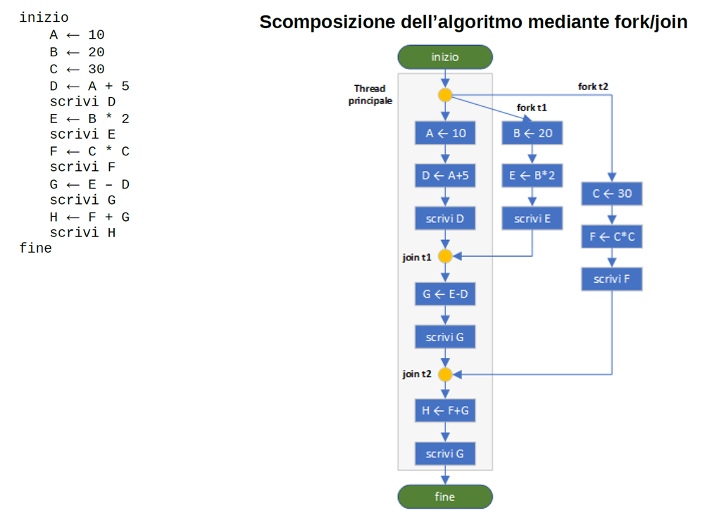
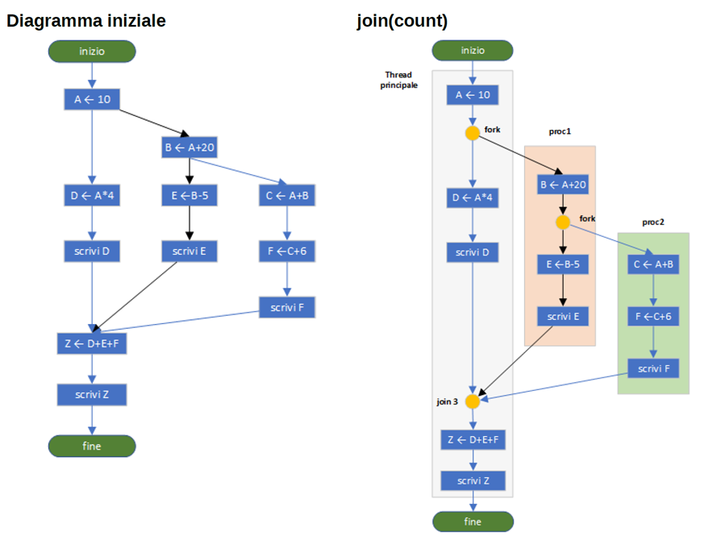
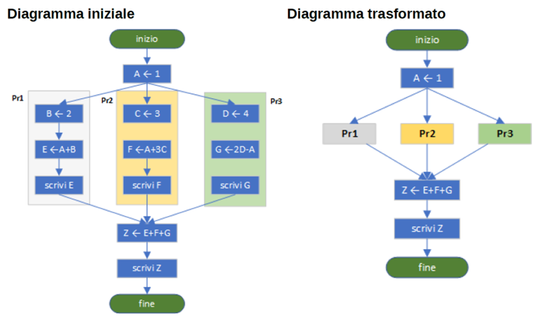

<style>
img {display: block; margin: 0 auto;}
</style>

## Task Parallel Library (TPL)

<https://docs.microsoft.com/en-us/dotnet/standard/parallel-programming/task-parallel-library-tpl>

La libreria Task Parallel Library (TPL) è un set di tipi e API pubblici negli spazi dei nomi [System.Threading](https://docs.microsoft.com/it-it/dotnet/api/system.threading) e [System.Threading.Tasks](https://docs.microsoft.com/it-it/dotnet/api/system.threading.tasks). Lo scopo di TPL è di rendere gli sviluppatori più produttivi mediante la semplificazione del processo di aggiunta di parallelismo e concorrenza alle applicazioni. La libreria TPL ridimensiona il grado di concorrenza dinamicamente per utilizzare in modo efficace tutti i processori disponibili. La libreria TPL gestisce inoltre il partizionamento del lavoro, la pianificazione dei thread in [ThreadPool](https://docs.microsoft.com/it-it/dotnet/api/system.threading.threadpool), il supporto per l'annullamento, la gestione dello stato e altri dettagli di basso livello. Quando si utilizza TPL, è possibile ottimizzare le prestazioni del codice concentrandosi sulle operazioni per cui il programma è stato progettato.

A partire da .NET Framework 4, TPL è la soluzione più adatta per scrivere codice multithreading e parallelo. Tuttavia, non tutto il codice è adatto per la parallelizzazione; ad esempio, se un ciclo esegue solo una piccola parte di lavoro in ciascuna iterazione o non viene eseguito per molte iterazioni, il sovraccarico della parallelizzazione potrebbe provocare un rallentamento dell'esecuzione del codice. Inoltre, la parallelizzazione come qualsiasi codice multithreading, aggiunge complessità all'esecuzione del programma. Benché la libreria TPL semplifichi gli scenari multithreading, è consigliabile avere una conoscenza di base dei concetti relativi all'utilizzo dei thread, ad esempio blocchi, deadlock e race condition. Infatti, ciò consentirà di utilizzare la libreria TPL in modo più efficace.

## C# Task

Task is one of the central elements of the task-based asynchronous pattern in the .NET. Task object typically executes asynchronously on a thread pool thread rather than synchronously on the main application thread.As we learned in the previous chapter we can offload the work to thread pool using the queue user work item method. However, this method has its weaknesses as we can't tell whether the operation has finished or what a return value is. This is where a Task can be helpful. The Task can tell you if the work is completed and if the operation returns a result. A Task is an object that represents some work that should be done.

Tasks provide a sophisticated way to handle async or parallel operation by providing various options like:

-         Ability to cancel an ongoing operation

-         Return resulting value from operation (like a method functions)

-         Easy Exception Handling

-         High-Level constructs like a parallel loop

-         Task continuation

Tasks can be used to make your application more responsive. If the thread that manages the user interface offloads work to another thread from the thread pool, it can keep processing user events and ensure that the application can still be used.

You can also parallelize your CPU bound operation on to multiple processors using task.

### C# Task: Programmazione asincrona e/o parallela basata su attività

<https://docs.microsoft.com/it-it/dotnet/standard/parallel-programming/task-based-asynchronous-programming>

La libreria Task Parallel Library (TPL) si basa sul concetto di *attività*, che rappresenta un'operazione asincrona. Per certi versi, un'attività è analoga a un thread o a un elemento di lavoro [ThreadPool](https://docs.microsoft.com/it-it/dotnet/api/system.threading.threadpool), ma a un livello più generale di astrazione. L'espressione *parallelismo delle attività* fa riferimento a una o più attività indipendenti eseguite contemporaneamente. Le attività forniscono due vantaggi principali:

-           di sistema.

Ai fini del funzionamento, le attività vengono accodate in un [ThreadPool](https://docs.microsoft.com/it-it/dotnet/api/system.threading.threadpool), che è stato migliorato con algoritmi che determinano e modificano il numero di thread e che ottimizzano la velocità effettiva grazie al bilanciamento del carico. In questo modo le attività diventano relativamente leggere ed è possibile crearne molte in modo da ottenere un parallelismo accurato.

-         Maggior controllo a livello di codice rispetto a quello ottenibile usando un thread o un elemento di lavoro.

Le attività e il framework in cui esse sono inserite forniscono un ampio set di API che supportano varie funzionalità tra cui attesa, annullamento, continuazioni, gestione affidabile delle eccezioni, stato dettagliato e pianificazione personalizzata.

Per entrambi questi motivi, in .NET TPL rappresenta l'API preferita per la scrittura di codice multithreading, asincrono e parallelo.

Il metodo [Parallel.Invoke](https://docs.microsoft.com/it-it/dotnet/api/system.threading.tasks.parallel.invoke) rappresenta un modo pratico per eseguire simultaneamente un numero qualsiasi di istruzioni arbitrarie. Basta passare un delegato [Action](https://docs.microsoft.com/it-it/dotnet/api/system.action) per ogni elemento di lavoro. Il modo più semplice per creare questi delegati è usare le espressioni lambda. L'espressione lambda può chiamare un metodo denominato o fornire il codice inline. Nell'esempio seguente viene mostrata una chiamata a [Invoke](https://docs.microsoft.com/it-it/dotnet/api/system.threading.tasks.parallel.invoke) di base che crea e avvia due attività in esecuzione simultanea. La prima attività è rappresentata da un'espressione lambda che chiama un metodo denominato `DoSomeWork` e la seconda attività è rappresentata da un'espressione lambda che chiama un metodo denominato `DoSomeOtherWork`.

```cs
Parallel.Invoke(() => DoSomeWork(), () => DoSomeOtherWork());
```

Un'attività che non restituisce un valore è rappresentata dalla classe:

 [System.Threading.Tasks.Task](https://docs.microsoft.com/it-it/dotnet/api/system.threading.tasks.task).

Un'attività che restituisce un valore viene rappresentata dalla classe:

 [System.Threading.Tasks.Task<TResult>](https://docs.microsoft.com/it-it/dotnet/api/system.threading.tasks.task-1) che eredita da [Task](https://docs.microsoft.com/it-it/dotnet/api/system.threading.tasks.task).

L'oggetto attività gestisce i dettagli dell'infrastruttura e fornisce metodi e proprietà accessibili dal thread chiamante per tutta la durata dell'attività. Ad esempio, è possibile accedere in qualsiasi momento alla proprietà [Status](https://docs.microsoft.com/it-it/dotnet/api/system.threading.tasks.task.status) di un'attività per determinare se è stata avviata, eseguita fino al completamento o annullata oppure se ha generato un'eccezione. Lo stato è rappresentato da un'enumerazione [TaskStatus](https://docs.microsoft.com/it-it/dotnet/api/system.threading.tasks.taskstatus).

Quando si crea un'attività si assegna ad essa un delegato dell'utente che incapsula il codice che verrà eseguito dall'attività. Il delegato può essere espresso come un delegato denominato, un metodo anonimo o un'espressione lambda. Le espressioni lambda possono contenere una chiamata a un metodo denominato, come mostrato nell'esempio seguente. Si noti che l'esempio include una chiamata al metodo [Task.Wait](https://docs.microsoft.com/it-it/dotnet/api/system.threading.tasks.task.wait) per garantire che l'attività venga completata prima che termini l'applicazione in modalità console.

```cs
using System;
using System.Threading;
using System.Threading.Tasks;

namespace TaskIntro
{
    class Program
    {
        static void Main(string[] args)
        {
            Thread.CurrentThread.Name = "Main";

            // Create a task and supply a user delegate by using a lambda expression. 
            Task taskA = new Task(() => Console.WriteLine("Hello from taskA."));
            // Start the task.
            taskA.Start();

            // Output a message from the calling thread.
            Console.WriteLine("Hello from thread '{0}'.",
                              Thread.CurrentThread.Name);
            taskA.Wait();

        }
    }
}
// The example displays output like the following:
//       Hello from thread 'Main'.
//       Hello from taskA.
```

È anche possibile usare i metodi [Task.Run](https://docs.microsoft.com/it-it/dotnet/api/system.threading.tasks.task.run) per creare e avviare un'attività in un'unica operazione. Per gestire l'attività, i metodi [Run](https://docs.microsoft.com/it-it/dotnet/api/system.threading.tasks.task.run) utilizzano l'utilità di pianificazione delle attività predefinita, indipendentemente dall'utilità di pianificazione associata al thread corrente. I metodi [Run](https://docs.microsoft.com/it-it/dotnet/api/system.threading.tasks.task.run) rappresentano il modo preferito per creare e avviare le attività nei casi in cui non occorre un maggiore controllo sulla creazione e la pianificazione di attività.

```cs
using System;
using System.Threading;
using System.Threading.Tasks;

namespace TaskRunDemo
{
    class Program
    {
        static void Main(string[] args)
        {
            Thread.CurrentThread.Name = "Main";

            // Define and run the task.
            Task taskA = Task.Run(() => Console.WriteLine("Hello from taskA."));

            // Output a message from the calling thread.
            Console.WriteLine("Hello from thread '{0}'.",
                                Thread.CurrentThread.Name);
            taskA.Wait();

        }
    }
}
// The example displays output like the following:
//       Hello from thread 'Main'.
//       Hello from taskA.

```

È anche possibile usare il metodo [TaskFactory.StartNew](https://docs.microsoft.com/it-it/dotnet/api/system.threading.tasks.taskfactory.startnew) per creare e avviare un'attività in un'unica operazione. Usare questo metodo quando non occorre separare la creazione e la pianificazione ed è necessario avvalersi di opzioni aggiuntive di creazione delle attività, o usare un'utilità di pianificazione specifica, oppure quando si deve passare uno stato aggiuntivo all'attività che è possibile recuperare tramite la proprietà [Task.AsyncState](https://docs.microsoft.com/it-it/dotnet/api/system.threading.tasks.task.asyncstate), come illustrato nell'esempio seguente.

```cs
using System;
using System.Threading;
using System.Threading.Tasks;

namespace TaskWithCustomData
{
    class CustomData
    {
        public long CreationTime;
        public int Name;
        public int ThreadNum;
    }

    class Program
    {
        public static void Main()
        {
            Task[] taskArray = new Task[10];
            for (int i = 0; i < taskArray.Length; i++)
            {
                taskArray[i] = Task.Factory.StartNew((object obj) =>
                {
                    CustomData data = obj as CustomData;
                    if (data == null)
                        return;

                    data.ThreadNum = Thread.CurrentThread.ManagedThreadId;
                },new CustomData() { Name = i, CreationTime = DateTime.Now.Ticks });
            }
            Task.WaitAll(taskArray);
            foreach (var task in taskArray)
            {
                //AsyncState restituisce l'oggetto che è stato passato quando il Task è stato creato, oppure null se non è stato passato nulla
                var data = task.AsyncState as CustomData;
                if (data != null)
                    Console.WriteLine($"Task Name = {data.Name}, Task Id = {task.Id}, Task status = {task.Status},  created at {data.CreationTime}, ran on Thread Id = {data.ThreadNum}.");
            }
        }

    }
}
// The example displays output like the following:
Task Name = 0, Task Id = 1, Task status = RanToCompletion,  created at 637737183135068576, ran on Thread Id = 5.
Task Name = 1, Task Id = 2, Task status = RanToCompletion,  created at 637737183135317927, ran on Thread Id = 6.
Task Name = 2, Task Id = 3, Task status = RanToCompletion,  created at 637737183135345356, ran on Thread Id = 4.
Task Name = 3, Task Id = 4, Task status = RanToCompletion,  created at 637737183135369204, ran on Thread Id = 7.
Task Name = 4, Task Id = 5, Task status = RanToCompletion,  created at 637737183135391197, ran on Thread Id = 11.
Task Name = 5, Task Id = 6, Task status = RanToCompletion,  created at 637737183135415846, ran on Thread Id = 13.
Task Name = 6, Task Id = 7, Task status = RanToCompletion,  created at 637737183135794745, ran on Thread Id = 8.
Task Name = 7, Task Id = 8, Task status = RanToCompletion,  created at 637737183135879399, ran on Thread Id = 10.
Task Name = 8, Task Id = 9, Task status = RanToCompletion,  created at 637737183135879724, ran on Thread Id = 12.
Task Name = 9, Task Id = 10, Task status = RanToCompletion,  created at 637737183135879799, ran on Thread Id = 9.

```

Ogni attività riceve un ID di tipo Integer con cui viene identificata in modo univoco in un dominio applicazione e a cui è possibile accedere tramite la proprietà [Task.Id](https://docs.microsoft.com/it-it/dotnet/api/system.threading.tasks.task.id).

Quando si usa un'espressione lambda per creare un delegato, si avrà accesso a tutte le variabili visibili in quel punto del codice sorgente. Tuttavia, in alcuni casi, in particolare all'interno dei cicli, un'espressione lambda non acquisisce la variabile come previsto. Acquisisce solo il valore finale, non il valore mentre viene modificato dopo ogni iterazione. Nell'esempio che segue viene illustrato il problema. Si passa un contatore di cicli a un'espressione lambda che crea un'istanza di un oggetto CustomData e usa il contatore di cicli come identificatore dell'oggetto. Come indica l'output dell'esempio, ogni oggetto CustomData dispone di un identificatore identico.

```cs
using System;
using System.Threading;
using System.Threading.Tasks;

namespace TaskWithCustomDataSbagliato
{
    class CustomData
    {
        public long CreationTime;
        public int Name;
        public int ThreadNum;
    }

    class Program
    {
        public static void Main()
        {
            Task[] taskArray = new Task[10];
            for (int i = 0; i < taskArray.Length; i++)
            {
                taskArray[i] = Task.Factory.StartNew((object obj) => {
                    var data = new CustomData() { Name = i, CreationTime = DateTime.Now.Ticks };
                    data.ThreadNum = Thread.CurrentThread.ManagedThreadId;
                    Console.WriteLine($"Task Name = {data.Name},  created at {data.CreationTime}, ran on Thread Id = {data.ThreadNum}.");

                }, i);

            }
            Task.WaitAll(taskArray);
            foreach (var task in taskArray)
            {
                //AsyncState restituisce l'oggetto che è stato passato quando il Task è stato creato, oppure null se non è stato passato nulla
                var data = task.AsyncState as int?;
                if (data != null)
                    Console.WriteLine($"Supplied object= {data}, Task Id = {task.Id}, Task status = {task.Status}.");
            }
        }

    }
}
// The example displays output like the following:
Task Name = 10,  created at 637738089310514965, ran on Thread Id = 5.
Task Name = 10,  created at 637738089310514608, ran on Thread Id = 11.
Task Name = 10,  created at 637738089310514702, ran on Thread Id = 4.
Task Name = 10,  created at 637738089310514798, ran on Thread Id = 6.
Task Name = 10,  created at 637738089310514412, ran on Thread Id = 7.
Task Name = 10,  created at 637738089310514896, ran on Thread Id = 8.
Task Name = 10,  created at 637738089310514197, ran on Thread Id = 9.
Task Name = 10,  created at 637738089310514323, ran on Thread Id = 10.
Task Name = 10,  created at 637738089310514505, ran on Thread Id = 12.
Task Name = 10,  created at 637738089310514224, ran on Thread Id = 13.
Supplied object = 0, Task Id = 1, Task status = RanToCompletion.
Supplied object = 1, Task Id = 2, Task status = RanToCompletion.
Supplied object = 2, Task Id = 3, Task status = RanToCompletion.
Supplied object = 3, Task Id = 4, Task status = RanToCompletion.
Supplied object = 4, Task Id = 5, Task status = RanToCompletion.
Supplied object = 5, Task Id = 6, Task status = RanToCompletion.
Supplied object = 6, Task Id = 7, Task status = RanToCompletion.
Supplied object = 7, Task Id = 8, Task status = RanToCompletion.
Supplied object = 8, Task Id = 9, Task status = RanToCompletion.
Supplied object = 9, Task Id = 10, Task status = RanToCompletion.
```

Come si vede dall'esempio sbagliato, nonostante il valore del *supplied object* passato al task sia quello corretto, la lambda espression accede al valore della variabile di conteggio *i* quando il suo valore è già arrivato al massimo.

La soluzione è in questo caso quella di passare l'oggetto CustomData e non l'intero i da cui viene creato CustomData.

### Execution Model Of A Task

Let's discuss the basic execution model of a task. In the example above, we created a task and provide a basic operation to be performed by the task. So this task operation is executed in a separate thread. Each task we create is executed within its own thread. In a single-core machine, this won't be efficient as there will be a lot of context switching between these threads and they will end up using the same single-core processor. However, in a multi-core processor, which is the case nowadays, this will be very efficient as this threads will get distributed within the multi-core machine (each thread executing in the separate processor) and thus will perform better than a sequential program.

Please note that:

//wait for task t to complete its execution

t.Wait();

**Calling Wait method of the task is equivalent to calling the Join method on a thread**. When the Wait method is called within the Main method the main thread pauses its execution until the task t completes its execution.

### C# Task That Returns A Result

The .NET also has the generic version of task Task<T> class that you can use if a Task should return a value. Here T is the data type you want to return as a result. Below code shows how this works.

```cs
using System;
using System.Collections.Generic;
using System.Linq;
using System.Text;
using System.Threading.Tasks;

namespace TaskReturnsValue01
{
    class Program
    {
        static void Main(string[] args)
        {
            //qui int è il tipo restituito dal Task
            //si noti che in questo caso si è usato il costrutto Task.Run(lambda) e non new Task(lambda)
             Task<int> t = Task.Run(() =>
            {
                return 32;
            });

            //qui leggiamo il valore restituito dal Task
            //è come fare una Join sul thread del Task oppure come invocare la Wait sul Task
            Console.WriteLine(t.Result); 

            Console.WriteLine();
            Console.WriteLine("Press Enter to terminate!");
            Console.ReadLine();
        }
    }
}
```

**Attempting to read the Result property on a Task will force the thread that's trying to read the result to wait until the task is finished**, which is equivalent to calling Join method on a thread and calling Wait method in the task as mentioned before.As long as the Task has not finished, it is impossible to give the result. If the task is not finished, this call will block the current thread.

### Adding continuation

Nella programmazione asincrona è comune che, dopo il completamento, un'operazione asincrona chiami una seconda operazione e passi i dati a tale operazione. Tradizionalmente le continuazioni venivano eseguite tramite metodi di callback. In Task Parallel Library la stessa funzionalità viene resa possibile dalle *attività di continuazione*. Un'attivazione di continuazione, chiamata anche semplicemente continuazione, è un'attività asincrona richiamata da un'altra attività, denominata *attività precedente*, al termine di quest'ultima.

Le continuazioni sono relativamente facili da usare, ma sono comunque potenti e flessibili. Ad esempio, è possibile eseguire queste operazioni:

-         Passare dati dall'attività precedente alla continuazione.

-         Specificare le condizioni esatte in cui la continuazione verrà richiamata o non richiamata.

-         Annullare una continuazione prima del suo avvio o cooperativamente durante la sua esecuzione.

-         Fornire suggerimenti sul modo in cui pianificare la continuazione.

-         Richiamare più continuazioni dalla stessa attività precedente.

-         Richiamare una continuazione al termine di tutte o una delle attività precedenti.

-         Concatenare continuazioni una dopo l'altra a qualsiasi lunghezza arbitraria.

-         Usare una continuazione per gestire le eccezioni generate dall'attività precedente.

Per creare una continuazione che viene eseguita una volta completata l'attività precedente, chiamare il metodo [Task.ContinueWith](https://docs.microsoft.com/it-it/dotnet/api/system.threading.tasks.task.continuewith) . L'esempio seguente mostra il modello di base. Per chiarezza, viene omessa la gestione delle eccezioni. Viene eseguita un'attività precedente, taskA, che restituisce un oggetto [DayOfWeek](https://docs.microsoft.com/it-it/dotnet/api/system.dayofweek) che indica il nome del giorno corrente della settimana. Al termine dell'attività precedente, all'attività di continuazione continuation viene passata l'attività precedente e viene visualizzata una stringa che ne include i risultati.

```cs
using System;
using System.Threading.Tasks;

namespace ContinuationDemo01
{
    class Program
    {
        static void Main(string[] args)
        {
            // Execute the antecedent.
            Task<DayOfWeek> taskA = Task.Run(() => DateTime.Today.DayOfWeek);

            // Execute the continuation when the antecedent finishes.
             taskA.ContinueWith(antecedent => Console.WriteLine("Today is {0}.", antecedent.Result));
            Console.ReadLine();
        }
    }
}
```

This method is similar to calling the callback method when a certain operation is finished. Below is an example of creating such a continuation.

```cs
using System;
using System.Threading.Tasks;

namespace TaskContinuation01
{
    class Program
    {
        static void Main(string[] args)
        {
            Task<int> t = Task.Run(() =>
            {
                return 32;
            }).ContinueWith((i) =>
            {
                return i.Result * 2;
            });

            t.ContinueWith((i) =>
            {
                Console.WriteLine(i.Result);
            });

            Console.WriteLine("Press Enter to terminate!");
            Console.ReadLine();
        }
    }
}
```

È anche possibile creare una continuazione che verrà eseguita al termine di una o tutte le attività di un gruppo di attività. Per eseguire una continuazione al termine di tutte le attività precedenti, chiamare il metodo statico [Task.WhenAll](https://docs.microsoft.com/it-it/dotnet/api/system.threading.tasks.task.whenall) o il metodo [TaskFactory.ContinueWhenAll](https://docs.microsoft.com/it-it/dotnet/api/system.threading.tasks.taskfactory.continuewhenall) dell'istanza. Per eseguire una continuazione al termine di almeno una delle attività precedenti, chiamare il metodo statico [Task.WhenAny](https://docs.microsoft.com/it-it/dotnet/api/system.threading.tasks.task.whenany) o il metodo [TaskFactory.ContinueWhenAny](https://docs.microsoft.com/it-it/dotnet/api/system.threading.tasks.taskfactory.continuewhenany) dell'istanza.

Nell'esempio seguente viene chiamato il metodo [Task.WhenAll(IEnumerable<Task>)](https://docs.microsoft.com/it-it/dotnet/api/system.threading.tasks.task.whenall#System_Threading_Tasks_Task_WhenAll_System_Collections_Generic_IEnumerable_System_Threading_Tasks_Task__) per creare un'attività di continuazione che riflette il risultato delle 10 attività precedenti. Ogni attività precedente eleva al quadrato un valore di indice compreso tra uno e 10. Se le attività precedenti vengono completate correttamente (ovvero la relativa proprietà [Task.Status](https://docs.microsoft.com/it-it/dotnet/api/system.threading.tasks.task.status) è [TaskStatus.RanToCompletion](https://docs.microsoft.com/it-it/dotnet/api/system.threading.tasks.taskstatus#System_Threading_Tasks_TaskStatus_RanToCompletion)), la proprietà [Task<TResult>.Result](https://docs.microsoft.com/it-it/dotnet/api/system.threading.tasks.task-1.result) della continuazione è una vettore dei valori [Task<TResult>.Result](https://docs.microsoft.com/it-it/dotnet/api/system.threading.tasks.task-1.result) restituiti da ogni attività precedente. L'esempio somma tali valori per calcolare la somma dei quadrati per tutti i numeri compresi tra uno e 10.

```cs
using System;
using System.Collections.Generic;
using System.Threading.Tasks;

namespace ContinuationAllDemo01
{
    class Program
    {
        static void Main(string[] args)
        {
            List<Task<int>> tasks = new List<Task<int>>();
            for (int ctr = 1; ctr <= 10; ctr++)
            {
                int baseValue = ctr;
                tasks.Add(Task.Factory.StartNew((b) => {
                    int i = (int)b;
                    return i * i;
                }, baseValue));
            }
            //continuation è di tipo Task<int[]>
            var continuation = Task.WhenAll(tasks);

            long sum = 0;
            for (int ctr = 0; ctr <= continuation.Result.Length - 1; ctr++)
            {
                Console.Write($"{continuation.Result[ctr]}{(ctr == continuation.Result.Length - 1 ? " = " : " + ")}");
                sum += continuation.Result[ctr];
            }
            Console.WriteLine(sum);
           
        }
    }
}
```

### Scheduling Different Continuation Tasks

The ContinueWith method has a couple of overloads that you can use to configure when the continuation will run. This way you can add different continuation methods that will run when an exception happens, the Task is canceled, or the Task completes successfully. Below code shows how to do this.

```cs
using System;
using System.Threading.Tasks;

namespace ContinuationWithExceptionHandling01
{
    class Program
    {
        static void Main(string[] args)
        {
            var t = Task.Run(() => {
                DateTime dat = DateTime.Now;
                if (dat == DateTime.MinValue)
                    throw new ArgumentException("The clock is not working.");

                if (dat.Hour > 17)
                    return "evening";
                else if (dat.Hour > 12)
                    return "afternoon";
                else
                    return "morning";
            });
            var c = t.ContinueWith((antecedent) => {
                if (antecedent.Status == TaskStatus.RanToCompletion)
                {
                    Console.WriteLine("Good {0}!",
                                      antecedent.Result);
                    Console.WriteLine("And how are you this fine {0}?",
                                   antecedent.Result);
                }
                else if (antecedent.Status == TaskStatus.Faulted)
                {
                    Console.WriteLine(t.Exception.GetBaseException().Message);
                }
            });
            c.Wait();
        }
    }
}
```

Altro esempio: continuazione condizionale.

```cs
using System;
using System.Collections.Generic;
using System.Linq;
using System.Text;
using System.Threading.Tasks;

namespace DifferentContinuationTasks
{
    class Program
    {
        static void Main(string[] args)
        {
            Task<int> t = Task.Run(() =>
            {
                //se il numero è messo a zero viene sollevata un'eccezione non gestita
                int numero = 1;
                if (numero==0) {
                    throw new Exception();
                }
                return 32;
            });
            t.ContinueWith((i) =>
            {
                Console.WriteLine("Faulted");
            }, TaskContinuationOptions.OnlyOnFaulted);
            t.ContinueWith((i) =>
            {
                Console.WriteLine("Canceled");
            },  TaskContinuationOptions.OnlyOnCanceled);

            var completedTask = t.ContinueWith((i) =>
            {
                Console.WriteLine(i.Result);
                Console.WriteLine("Completed");
            }, TaskContinuationOptions.OnlyOnRanToCompletion);

            Console.WriteLine("Press Enter to terminate!");
            Console.ReadLine();
        }
    }
}
```

Per l'esempio precedente, nel caso in cui viene sollevata un'eccezione Visual Studio blocca il programma nel punto in cui c'è l'eccezione non gestita. Se si fa partire l'applicazione direttamente dall'eseguibile il programma non si blocca e va direttamente nel continuation task che ha come impostazione TaskContinuationOptions.OnlyOnFaulted. Si può eventualmente andare nelle opzioni di gestione dell'eccezione di Visual Studio per modificarne il comportamento.

### Costrutti per la programmazione concorrente -- uso di Task

####  Costrutto fork/join

L'esempio di fork/join della sezione della guida dedicata ai thread può essere codificato in C# con l'utilizzo della libreria TPL, come mostrato nel seguente codice:



```cs
using System;
using System.Threading.Tasks;

namespace CostruttiProgrammazioneConcorrenteTask
{
    class Program
    {
        static int A, B, C, D, E, F, G, H;
        static void Main(string[] args)
        {
            // Metodo classico di avvio di un nuovo task
            Task tsk1 = Task.Factory.StartNew(Proc1);
            Task tsk2 = Task.Factory.StartNew(Proc2);
           
            A = 10;
            D = A + 5;
            Console.WriteLine("D: {0}", D);
            tsk1.Wait(); // Attende il completamento del task tsk1
            G = E - D;
            Console.WriteLine("G: {0}", G);
            tsk2.Wait(); // Attende il completamento del task tsk2
            H = F + G;
            Console.WriteLine("H: {0}", H);
        }

        static void Proc1()
        {
            B = 20;
            E = B * 2;
            Console.WriteLine("E: {0}", E);
        }
        static void Proc2()
        {
            C = 30;
            F = C * C;
            Console.WriteLine("F: {0}", F);
        }
    }
}

```

#### Costrutto join(count)

L'esempio di join(count) della sezione della guida dedicata ai thread  può essere codificato in C# con l'utilizzo della libreria TPL, come mostrato nel seguente codice:



```cs
using System;
using System.Threading;
using System.Threading.Tasks;

namespace JoinCountDemoTask
{
    class Program
    {
        static int A, B, C, D, E, F, Z;
        static CountdownEvent L = new CountdownEvent(3);
        static void Main(string[] args)
        {
            A = 10;
            Task t = Task.Factory.StartNew(Proc1);
            D = A * 4;
            Console.WriteLine("D: {0}", D);
            L.Signal(); // Decrementa il contatore L
            L.Wait(); // Attende che il contatore L sia uguale a zero
            Z = D + E + F;
            Console.WriteLine("Z: {0}", Z);
        }
        static void Proc1()
        {
            Console.WriteLine("Procedura n. 1");
            B = A + 20;
            Task t = Task.Factory.StartNew(Proc2);
            E = B - 5;
            Console.WriteLine("E: {0}", E);
            L.Signal(); // Decrementa il contatore L
        }
        static void Proc2()
        {
            Console.WriteLine("Procedura n. 2");
            C = A + B;
            F = C + 6;
            Console.WriteLine("F: {0}", F);
            L.Signal(); // Decrementa il contatore L
        }
    }
}
```

#### Costrutto cobegin/coend

L'esempio di cobegin/coend della sezione della guida dedicata ai thread può essere codificato in C# con l'utilizzo della libreria TPL, come mostrato nel seguente codice:



```cs
using System;
using System.Threading.Tasks;

namespace ParallelDemoTask
{
    class Program
    {
        static int A, B, C, D, E, F, G, Z;
        static void Main(string[] args)
        {
            A = 1;
            // Esecuzione parallela delle tre procedure, equivalente a:
            // cobegin
            // Proc1();
            // Proc2();
            // Proc3();
            // coend
            // Il metodo Invoke esegue le tre procedure, normalmente in parallelo.
            // Il main thread attende il completamento di tutte le procedure indicate.
            Task tsk1 = Task.Factory.StartNew(Proc1);
            Task tsk2 = Task.Factory.StartNew(Proc2);
            Task tsk3 = Task.Factory.StartNew(Proc3);
            // Il main thread attende il completamento di tutti i task
            Task.WaitAll(tsk1, tsk2, tsk3);
            Z = E + F + G;
            Console.WriteLine("Z: {0}", Z);
        }

        static void Proc1()
        {
            B = 2;
            E = A + B;
            Console.WriteLine("E: {0}", E);
        }
        static void Proc2()
        {
            C = 3;
            F = A + 3 * C;
            Console.WriteLine("F: {0}", F);
        }
        static void Proc3()
        {
            D = 4;
            G = 2 * D - A;
            Console.WriteLine("G: {0}", G);
        }
    }
}
```

### C# Task: Parallelismo dei dati (Task Parallel Library)

<https://learn.microsoft.com/en-us/dotnet/standard/parallel-programming/data-parallelism-task-parallel-library>

Con l'espressione *parallelismo dei dati* ci si riferisce a scenari in cui la stessa operazione viene eseguita contemporaneamente (ovvero in parallelo) sugli elementi di una matrice o una raccolta di origine. Nelle operazioni in parallelo su dati la raccolta di origine viene suddivisa in partizioni in modo che più thread possano agire simultaneamente su segmenti diversi.

La libreria Task Parallel Library (TPL) supporta il parallelismo dei dati tramite la classe [System.Threading.Tasks.Parallel](https://docs.microsoft.com/it-it/dotnet/api/system.threading.tasks.parallel). Questa classe fornisce le implementazioni in parallelo basate su metodo dei cicli [for](https://docs.microsoft.com/it-it/dotnet/csharp/language-reference/keywords/for) e [foreach](https://docs.microsoft.com/it-it/dotnet/csharp/language-reference/keywords/foreach-in) . La scrittura della logica di un ciclo [Parallel.For](https://docs.microsoft.com/it-it/dotnet/api/system.threading.tasks.parallel.for) o [Parallel.ForEach](https://docs.microsoft.com/it-it/dotnet/api/system.threading.tasks.parallel.foreach) è molto simile a quella della logica di un ciclo sequenziale. Non è necessario creare thread o accodare elementi di lavoro. Nei cicli di base non è necessario acquisire blocchi. La libreria TPL gestisce automaticamente tutto il lavoro di basso livello. Per informazioni dettagliate sull'uso di [Parallel.For](https://docs.microsoft.com/it-it/dotnet/api/system.threading.tasks.parallel.for) e [Parallel.ForEach](https://docs.microsoft.com/it-it/dotnet/api/system.threading.tasks.parallel.foreach), scaricare il documento [Patterns for Parallel Programming: Understanding and Applying Parallel Patterns with the .NET Framework 4](https://www.microsoft.com/download/details.aspx?id=19222) (Modelli per la programmazione parallela: informazioni sui modelli paralleli con .NET Framework 4 e su come applicarli).

#### Esempio 1 di Parallel.For

<https://docs.microsoft.com/it-it/dotnet/standard/parallel-programming/how-to-write-a-simple-parallel-for-loop>

```cs
using System;
using System.Collections.Generic;
using System.Linq;
using System.Text;
using System.Threading;
using System.Threading.Tasks;
using System.IO;

namespace ParallelForDemo
{
    class Program
    {
        public static void Main()
        {
            long totalSize = 0;

            String[] args = Environment.GetCommandLineArgs();
            if (args.Length == 1)
            {
                Console.WriteLine("There are no command line arguments.");
                return;
            }
            if (!Directory.Exists(args[1]))
            {
                Console.WriteLine("The directory does not exist.");
                return;
            }

            String[] files = Directory.GetFiles(args[1]);
            Parallel.For(0, files.Length,
                         (index) => {
                             FileInfo fi = new FileInfo(files[index]);
                             long size = fi.Length;
                             Interlocked.Add(ref totalSize, size);
                         });
            Console.WriteLine("Directory '{0}':", args[1]);
            Console.WriteLine("{0:N0} files, {1:N0} bytes", files.Length, totalSize);
        }
    }
}

```

#### Esempio 2 di Parallel.For

<https://docs.microsoft.com/it-it/dotnet/standard/parallel-programming/how-to-write-a-simple-parallel-for-loop>

```cs
using System;
using System.Diagnostics;
using System.Runtime.InteropServices;
using System.Threading.Tasks;

namespace ParallelMatricesMultiply
{
    class Program
    {
        #region Sequential_Loop
        static void MultiplyMatricesSequential(double[,] matA, double[,] matB,
                                                double[,] result)
        {
            int matACols = matA.GetLength(1);
            int matBCols = matB.GetLength(1);
            int matARows = matA.GetLength(0);

            for (int i = 0; i < matARows; i++)
            {
                for (int j = 0; j < matBCols; j++)
                {
                    double temp = 0;
                    for (int k = 0; k < matACols; k++)
                    {
                        temp += matA[i, k] * matB[k, j];
                    }
                    result[i, j] += temp;
                }
            }
        }
        #endregion

        #region Parallel_Loop
        static void MultiplyMatricesParallel(double[,] matA, double[,] matB, double[,] result)
        {
            int matACols = matA.GetLength(1);
            int matBCols = matB.GetLength(1);
            int matARows = matA.GetLength(0);

            // A basic matrix multiplication.
            // Parallelize the outer loop to partition the source array by rows.
            Parallel.For(0, matARows, i =>
            {
                for (int j = 0; j < matBCols; j++)
                {
                    double temp = 0;
                    for (int k = 0; k < matACols; k++)
                    {
                        temp += matA[i, k] * matB[k, j];
                    }
                    result[i, j] = temp;
                }
            }); // Parallel.For
        }
        #endregion


        #region Main
        static void Main(string[] args)
        {
            // Set up matrices. Use small values to better view 
            // result matrix. Increase the counts to see greater 
            // speedup in the parallel loop vs. the sequential loop.
            int colCount = 1800;
            int rowCount = 2000;
            int colCount2 = 270;
            double[,] m1 = InitializeMatrix(rowCount, colCount);
            double[,] m2 = InitializeMatrix(colCount, colCount2);
            double[,] result = new double[rowCount, colCount2];

            // First do the sequential version.
            Console.Error.WriteLine("Executing sequential loop...");
            Stopwatch stopwatch = new Stopwatch();
            stopwatch.Start();

            MultiplyMatricesSequential(m1, m2, result);
            stopwatch.Stop();
            long sequentialTime = stopwatch.ElapsedMilliseconds;
            Console.Error.WriteLine("Sequential loop time in milliseconds: {0}",
                                    sequentialTime);

            // For the skeptics.
            //OfferToPrint(rowCount, colCount2, result);

            // Reset timer and results matrix. 
            stopwatch.Reset();
            result = new double[rowCount, colCount2];

            // Do the parallel loop.
            Console.Error.WriteLine("Executing parallel loop...");
            stopwatch.Start();
            MultiplyMatricesParallel(m1, m2, result);
            stopwatch.Stop();
            long parallelTime = stopwatch.ElapsedMilliseconds;
            Console.Error.WriteLine("Parallel loop time in milliseconds: {0}",
                                    parallelTime);
            //OfferToPrint(rowCount, colCount2, result);
            //calculate speedup factor
            double speedup = (double)sequentialTime / parallelTime;
            Console.WriteLine($"Speedup = {speedup:F2}; il calcolo parallelo è {speedup:F2} volte più veloce di quello sequenziale");
            // Keep the console window open in debug mode.
            Console.Error.WriteLine("Press any key to exit.");
            Console.ReadKey();
        }
        #endregion

        #region Helper_Methods
        static double[,] InitializeMatrix(int rows, int cols)
        {
            double[,] matrix = new double[rows, cols];

            Random r = new Random();
            for (int i = 0; i < rows; i++)
            {
                for (int j = 0; j < cols; j++)
                {
                    matrix[i, j] = r.Next(100);
                }
            }
            return matrix;
        }

        private static void OfferToPrint(int rowCount, int colCount, double[,] matrix)
        {
            Console.Error.Write("Computation complete. Print results (y/n)? ");
            char c = Console.ReadKey(true).KeyChar;
            Console.Error.WriteLine(c);
            if (Char.ToUpperInvariant(c) == 'Y')
            {
                if (!Console.IsOutputRedirected && RuntimeInformation.IsOSPlatform(OSPlatform.Windows)) Console.WindowWidth = 180;
                Console.WriteLine();
                for (int x = 0; x < rowCount; x++)
                {
                    Console.WriteLine("ROW {0}: ", x);
                    for (int y = 0; y < colCount; y++)
                    {
                        Console.Write("{0:#.##} ", matrix[x, y]);
                    }
                    Console.WriteLine();
                }
            }
        }
        #endregion
    }

}

```

#### Esempio 1 Parallel.ForEach

<https://learn.microsoft.com/en-us/dotnet/standard/parallel-programming/how-to-write-a-simple-parallel-foreach-loop>

Ricerca dei numeri primi con il calcolo parallelo e confronto con il calcolo sequenziale:

```cs
using System.Collections.Concurrent;
using System.Diagnostics;

class Program
{
    //https://learn.microsoft.com/en-us/dotnet/standard/parallel-programming/how-to-write-a-simple-parallel-foreach-loop
    static void Main()
    {
        // 2 million
        var limit = 2_000_000;
        var numbers = Enumerable.Range(0, limit).ToList();//creo una lista con i valori da 0 a limit

        var watch = Stopwatch.StartNew();
        var primeNumbersFromForeach = GetPrimeList(numbers);//restituisco la lista con i numeri primi
        watch.Stop();

        var watchForParallel = Stopwatch.StartNew();
        var primeNumbersFromParallelForeach = GetPrimeListWithParallel(numbers);//restituisco la lista con i numeri primi con il calcolo parallelo
        watchForParallel.Stop();

        Console.WriteLine($"Classical foreach loop | Total prime numbers : {primeNumbersFromForeach.Count} | Time Taken : {watch.ElapsedMilliseconds} ms.");
        Console.WriteLine($"Parallel.ForEach loop  | Total prime numbers : {primeNumbersFromParallelForeach.Count} | Time Taken : {watchForParallel.ElapsedMilliseconds} ms.");
        //calcoliamo il fattore di speedup
        double speedup = (double)(watch.ElapsedMilliseconds)/watchForParallel.ElapsedMilliseconds;
        Console.WriteLine($"Il fattore di speedup è {speedup:F2}. Dunque Il calcolo parallelo è {speedup:F2} volte più veloce di quello sequenziale");
    }

    /// <summary>
    /// GetPrimeList returns Prime numbers by using sequential ForEach
    /// </summary>
    /// <param name="inputs"></param>
    /// <returns></returns>
    private static IList<int> GetPrimeList(IList<int> numbers) => numbers.Where(IsPrime).ToList();//filtro i numeri contenuti nella lista in base al metodo/predicato IsPrime

    /// <summary>
    /// GetPrimeListWithParallel returns Prime numbers by using Parallel.ForEach
    /// </summary>
    /// <param name="numbers"></param>
    /// <returns></returns>
    private static IList<int> GetPrimeListWithParallel(IList<int> numbers)
    {
        //https://learn.microsoft.com/en-us/dotnet/api/system.collections.concurrent.concurrentbag-1?view=net-7.0
        //Represents a thread-safe, unordered collection of objects.
        var primeNumbers = new ConcurrentBag<int>();

        Parallel.ForEach(numbers, number =>
        {
            if (IsPrime(number))
            {
                primeNumbers.Add(number);
            }
        });

        return primeNumbers.ToList();
    }

    /// <summary>
    /// IsPrime returns true if number is Prime, else false.(https://en.wikipedia.org/wiki/Prime_number)
    /// </summary>
    /// <param name="number"></param>
    /// <returns></returns>
    private static bool IsPrime(int number)
    {
        if (number <= 2)
        {
            return false;
        }

        for (var divisor = 2; divisor <= Math.Sqrt(number); divisor++)
        {
            if (number % divisor == 0)
            {
                return false;
            }
        }
        return true;
    }
}
```

#### Esempio 2 di Parallel.ForEach (con Partition-local data)

<https://learn.microsoft.com/en-us/dotnet/standard/parallel-programming/how-to-write-a-parallel-foreach-loop-with-partition-local-variables>

L'esempio seguente illustra come scrivere un metodo [ForEach](https://learn.microsoft.com/it-it/dotnet/api/system.threading.tasks.parallel.foreach) che usa variabili partition-local. Quando viene eseguito un ciclo [ForEach](https://learn.microsoft.com/it-it/dotnet/api/system.threading.tasks.parallel.foreach), la relativa raccolta di origine viene divisa in più partizioni. Ogni partizione ha la propria copia della variabile partition-local. Una variabile partition-local è simile a una [variabile thread-local](https://learn.microsoft.com/it-it/dotnet/api/system.threading.threadlocal-1), tranne per il fatto che in un singolo thread possono essere eseguite più partizioni.

Il codice e i parametri riportati in questo esempio, somigliano molto al metodo [For](https://learn.microsoft.com/it-it/dotnet/api/system.threading.tasks.parallel.for) corrispondente. Per altre informazioni, vedere [Procedura: scrivere un ciclo Parallel.For con variabili di thread locali](https://learn.microsoft.com/it-it/dotnet/standard/parallel-programming/how-to-write-a-parallel-for-loop-with-thread-local-variables).

Per usare una variabile partition-local in un ciclo [ForEach](https://learn.microsoft.com/it-it/dotnet/api/system.threading.tasks.parallel.foreach), è necessario chiamare uno degli overload del metodo che accetta due parametri di tipo. Il primo parametro di tipo, TSource, specifica il tipo di elemento di origine, mentre il secondo parametro di tipo, TLocal, specifica il tipo di variabile partition-local.

```cs
namespace ParallelForEachWithPartitionLocalVariabiles
{
    internal class Program
    {
        static void Main(string[] args)
        {
            const int Numbers = 1000000;
            int[] nums = Enumerable.Range(1, Numbers).ToArray();
            long total = 0;

            // First type parameter is the type of the source elements
            // Second type parameter is the type of the thread-local variable (partition subtotal), finalResult in questo esempio
            Parallel.ForEach<int, long>(nums, // source collection
                                        () => 0, // method to initialize the local variable, subtotal in questo caso
                                        (item, loopState, subtotal) => // method invoked by the loop on each iteration
                                        {
                                            subtotal += item; //modify local variable
                                            return subtotal; // value to be passed to next iteration
                                        },
                                        // Method to be executed when each partition has completed.
                                        // finalResult is the final value of subtotal for a particular partition.
                                        (finalResult) => Interlocked.Add(ref total, finalResult)
                                        );

            Console.WriteLine("The total from Parallel.ForEach is {0:N0}", total);
            //confrontiamo il risultato con la formula di Gauss
            long sommaGauss = (long)Numbers * (Numbers + 1) / 2;
            Console.WriteLine("Il totale con la formula di Gauss {0:N0}", sommaGauss);
        }
    }
}
```

####  Un esempio di confronto tra calcolo sequenziale e calcolo parallelo

```cs
using System.Diagnostics;

namespace ElaborazioneParallelaSuCollection1
{
    internal class Program
    {
        static void Main(string[] args)
        {
            //creare una collection di numeri e usare il Parallel.For per sfruttare il calcolo parallelo
            // 2 million
            var limit = 2_000_000;
            var numbers = Enumerable.Range(1, limit).ToList();//creo una lista con i valori da 1 a limit
            const int Numbers = 100000000;
            int[] nums = Enumerable.Range(1, Numbers).ToArray();
            long total = 0;
            Stopwatch stopwatch = Stopwatch.StartNew();
            //vogliamo calcolare la somma dei valori dell'array nums
            //nel caso sequenziale
            stopwatch.Start();
            for (int i = 0; i < nums.Length; i++)
            {
                total += nums[i];
            }
            stopwatch.Stop();
            Console.WriteLine($"Somma sequenziale = {total}. Tempo impiegato = {stopwatch.ElapsedMilliseconds} ms");
            total = 0;//riazzeriamo total
            stopwatch.Restart();//riazzeriamo il cronometro
            //nel caso parallelo, senza l'utilizzo di variabili thread-local
            Parallel.For(0, nums.Length, i => 
            { 
                //codice eseguito in maniera parallela
                Interlocked.Add(ref total, nums[i]);
            
            });
            stopwatch.Stop();
            Console.WriteLine($"Somma parallela = {total}. Tempo impiegato = {stopwatch.ElapsedMilliseconds} ms");

            //versione parallela con l'utilizzo di variabili thread local
            total = 0;//riazzeriamo total
            stopwatch.Restart();//riazzeriamo il cronometro
            Parallel.For<long>(0, nums.Length,()=>0, (i, loopState, subtotal) =>
            {
                subtotal +=nums[i];
                return subtotal;
            },
            //ogni volta che un Task finisce le sue iterazioni sulla collection passa il valore finale di subtotal all'action local final
            //la somma di tutti i valori di uscita dei thread restituisce il risultato finale
            (finalSubtotal) => Interlocked.Add(ref total, finalSubtotal)
            );
            stopwatch.Stop();
            Console.WriteLine($"Somma parallela ottimizzata con Paraller.For = {total}. Tempo impiegato = {stopwatch.ElapsedMilliseconds} ms");

            //versione parallela con l'utilizzo di variabili partition local
            total = 0;//riazzeriamo total
            stopwatch.Restart();//riazzeriamo il cronometro
            Parallel.ForEach<int, long>(nums,//source collection
                ()=>0,//method to initialize the local variable
                (item, loopState, subtotal) =>// method invoked by the loop on each iteration
                {
                subtotal += item;
                return subtotal;
            },
            // Method to be executed when each partition has completed.
            // finalResult is the final value of subtotal for a particular partition.
            (finalResult) => Interlocked.Add(ref total, finalResult)
            );
            stopwatch.Stop();
            Console.WriteLine($"Somma parallela ottimizzata con Parallel.ForEach = {total}. Tempo impiegato = {stopwatch.ElapsedMilliseconds} ms");
            //confrontiamo il risultato con la formula di Gauss
            long sommaGauss = (long)Numbers * (Numbers + 1) / 2;
            Console.WriteLine("Il totale con la formula di Gauss {0}", sommaGauss);

        }
    }
}
```

### Attached and Detached Child Tasks

<https://docs.microsoft.com/it-it/dotnet/standard/parallel-programming/attached-and-detached-child-tasks>

A *child task* (or *nested task*) is a [System.Threading.Tasks.Task](https://docs.microsoft.com/it-it/dotnet/api/system.threading.tasks.task) instance that is created in the user delegate of another task, which is known as the *parent task*. A child task can be either detached or attached. A *detached child task* is a task that executes independently of its parent. An *attached child task* is a nested task that is created with the [TaskCreationOptions.AttachedToParent](https://docs.microsoft.com/it-it/dotnet/api/system.threading.tasks.taskcreationoptions#System_Threading_Tasks_TaskCreationOptions_AttachedToParent) option whose parent does not explicitly or by default prohibit it from being attached. A task may create any number of attached and detached child tasks, limited only by system resources.

The following table lists the basic differences between the two kinds of child tasks.

| **Category** | **Detached child tasks** | **Attached child tasks** |
| --- |  --- |  --- |
| Parent waits for child tasks to complete. | No | Yes |
| --- |  --- |  --- |
| Parent propagates exceptions thrown by child tasks. | No | Yes |
| Status of parent depends on status of child. | No | Yes |

In most scenarios, we recommend that you use detached child tasks, because their relationships with other tasks are less complex. That is why tasks created inside parent tasks are detached by default, and you must explicitly specify the [TaskCreationOptions.AttachedToParent](https://docs.microsoft.com/it-it/dotnet/api/system.threading.tasks.taskcreationoptions#System_Threading_Tasks_TaskCreationOptions_AttachedToParent) option to create an attached child task.

#### Detached child tasks

Although a child task is created by a parent task, by default it is independent of the parent task. In the following example, a parent task creates one simple child task. If you run the example code multiple times, you may notice that the output from the example differs from that shown, and also that the output may change each time you run the code. This occurs because the parent task and child tasks execute independently of each other; the child is a detached task. The example waits only for the parent task to complete, and the child task may not execute or complete before the console app terminates.

```cs
using System;
using System.Threading;
using System.Threading.Tasks;

public class Example
{
   public static void Main()
   {
      var parent = Task.Factory.StartNew(() => {
         Console.WriteLine("Outer task executing.");

         var child = Task.Factory.StartNew(() => {
            Console.WriteLine("Nested task starting.");
            Thread.SpinWait(500000);
            Console.WriteLine("Nested task completing.");
         });
      });

      parent.Wait();
      Console.WriteLine("Outer has completed.");
   }
}
// The example produces output like the following:
//        Outer task executing.
//        Nested task starting.
//        Outer has completed.
//        Nested task completing.
```

If the child task is represented by a [Task<TResult>](https://docs.microsoft.com/it-it/dotnet/api/system.threading.tasks.task-1) object rather than a [Task](https://docs.microsoft.com/it-it/dotnet/api/system.threading.tasks.task) object, you can ensure that the parent task will wait for the child to complete by accessing the [Task<TResult>.Result](https://docs.microsoft.com/it-it/dotnet/api/system.threading.tasks.task-1.result) property of the child even if it is a detached child task. The [Result](https://docs.microsoft.com/it-it/dotnet/api/system.threading.tasks.task-1.result) property blocks until its task completes, as the following example shows.

```cs
using System;
using System.Threading;
using System.Threading.Tasks;

class Example
{
   static void Main()
   {
      var outer = Task<int>.Factory.StartNew(() => {
            Console.WriteLine("Outer task executing.");

            var nested = Task<int>.Factory.StartNew(() => {
                  Console.WriteLine("Nested task starting.");
                  Thread.SpinWait(5000000);
                  Console.WriteLine("Nested task completing.");
                  return 42;
            });

            // Parent will wait for this detached child.
            return nested.Result;
      });

      Console.WriteLine("Outer has returned {0}.", outer.Result);
   }
}
// The example displays the following output:
//       Outer task executing.
//       Nested task starting.
//       Nested task completing.
//       Outer has returned 42.
```

#### Attached child tasks

Unlike detached child tasks, attached child tasks are closely synchronized with the parent. You can change the detached child task in the previous example to an attached child task by using the [TaskCreationOptions.AttachedToParent](https://docs.microsoft.com/it-it/dotnet/api/system.threading.tasks.taskcreationoptions#System_Threading_Tasks_TaskCreationOptions_AttachedToParent) option in the task creation statement, as shown in the following example. In this code, the attached child task completes before its parent. As a result, the output from the example is the same each time you run the code.

```cs
using System;
using System.Threading;
using System.Threading.Tasks;

public class Example
{
   public static void Main()
   {
      var parent = Task.Factory.StartNew(() => {
            Console.WriteLine("Parent task executing.");
            var child = Task.Factory.StartNew(() => {
                  Console.WriteLine("Attached child starting.");
                  Thread.SpinWait(5000000);
                  Console.WriteLine("Attached child completing.");
            }, TaskCreationOptions.AttachedToParent);
      });
      parent.Wait();
      Console.WriteLine("Parent has completed.");
   }
}
// The example displays the following output:
//       Parent task executing.
//       Attached child starting.
//       Attached child completing.
//       Parent has completed.
```

You can use attached child tasks to create tightly synchronized graphs of asynchronous operations.

However, a child task can attach to its parent only if its parent does not prohibit attached child tasks. Parent tasks can explicitly prevent child tasks from attaching to them by specifying the [TaskCreationOptions.DenyChildAttach](https://docs.microsoft.com/it-it/dotnet/api/system.threading.tasks.taskcreationoptions#System_Threading_Tasks_TaskCreationOptions_DenyChildAttach) option in the parent task's class constructor or the [TaskFactory.StartNew](https://docs.microsoft.com/it-it/dotnet/api/system.threading.tasks.taskfactory.startnew) method. Parent tasks implicitly prevent child tasks from attaching to them if they are created by calling the [Task.Run](https://docs.microsoft.com/it-it/dotnet/api/system.threading.tasks.task.run) method. The following example illustrates this. It is identical to the previous example, except that the parent task is created by calling the [Task.Run(Action)](https://docs.microsoft.com/it-it/dotnet/api/system.threading.tasks.task.run#System_Threading_Tasks_Task_Run_System_Action_) method rather than the [TaskFactory.StartNew(Action)](https://docs.microsoft.com/it-it/dotnet/api/system.threading.tasks.taskfactory.startnew#System_Threading_Tasks_TaskFactory_StartNew_System_Action_) method. Because the child task is not able to attach to its parent, the output from the example is unpredictable. Because the default task creation options for the [Task.Run](https://docs.microsoft.com/it-it/dotnet/api/system.threading.tasks.task.run) overloads include [TaskCreationOptions.DenyChildAttach](https://docs.microsoft.com/it-it/dotnet/api/system.threading.tasks.taskcreationoptions#System_Threading_Tasks_TaskCreationOptions_DenyChildAttach), this example is functionally equivalent to the first example in the "Detached child tasks" section.

```cs
using System;
using System.Threading;
using System.Threading.Tasks;

public class Example
{
   public static void Main()
   {
      var parent = Task.Run(() => {
            Console.WriteLine("Parent task executing.");
            var child = Task.Factory.StartNew(() => {
                  Console.WriteLine("Child starting.");
                  Thread.SpinWait(5000000);
                  Console.WriteLine("Child completing.");
            }, TaskCreationOptions.AttachedToParent);
      });
      parent.Wait();
      Console.WriteLine("Parent has completed.");
   }
}
// The example displays output like the following:
//       Parent task executing
//       Parent has completed.
//       Attached child starting.
```

### Cancellazione di un'attività

<https://docs.microsoft.com/it-it/dotnet/standard/threading/cancellation-in-managed-threads>

A partire da .NET Framework 4, .NET Framework usa un modello unificato per l'annullamento cooperativo di operazioni asincrone o di operazioni sincrone a esecuzione prolungata. Questo modello è basato su un oggetto leggero chiamato token di annullamento. L'oggetto che richiama una o più operazioni annullabili, ad esempio tramite la creazione di nuovi thread o attività, passa il token a ogni operazione. Singole operazioni possono a loro volta passare copie del token ad altre operazioni. In un secondo momento, l'oggetto che ha creato il token può usarlo per richiedere che le operazioni arrestino le rispettive attività. Solo l'oggetto richiedente può inviare la richiesta di annullamento e ogni listener è responsabile del rilevamento della richiesta e della relativa risposta in modo appropriato e tempestivo.

Il criterio generale per implementare il modello di annullamento cooperativo è il seguente:

-         Creare un'istanza di un oggetto [CancellationTokenSource](https://docs.microsoft.com/it-it/dotnet/api/system.threading.cancellationtokensource), che gestisce e invia la notifica di annullamento ai singoli token di annullamento.

-         Passare il token restituito dalla proprietà [CancellationTokenSource.Token](https://docs.microsoft.com/it-it/dotnet/api/system.threading.cancellationtokensource.token) a ogni attività o thread in attesa di annullamento.

-         Specificare un meccanismo per ogni attività o thread per rispondere all'annullamento.

-         Chiamare il metodo [CancellationTokenSource.Cancel](https://docs.microsoft.com/it-it/dotnet/api/system.threading.cancellationtokensource.cancel) per fornire la notifica di annullamento.

#### Un esempio di cancellazione di attività

<https://docs.microsoft.com/it-it/dotnet/standard/parallel-programming/task-cancellation>

```cs
using System;
using System.Collections.Concurrent;
using System.Threading;
using System.Threading.Tasks;

namespace TaskCancellationDemo
{
    class Program
    {
//usare async Task al posto di void se si usa await task al posto di task.Wait()
        static async Task Main(string[] args)
        {
            var tokenSource = new CancellationTokenSource();
            CancellationToken ct = tokenSource.Token;

            var task = Task.Run(() =>
            {
                // Were we already canceled?
                ct.ThrowIfCancellationRequested();

                bool moreToDo = true;
                while (moreToDo)
                {
                    // Poll on this property if you have to do
                    // other cleanup before throwing.
                    if (ct.IsCancellationRequested)
                    {
                        // Clean up here, then...
                        ct.ThrowIfCancellationRequested();
                    }

                }
            }, ct); // Pass same token to Task.Run.
            Thread.Sleep(1000);
            tokenSource.Cancel();

            // Just continue on this thread, or await with try-catch:
            try
            {
                //https://stackoverflow.com/questions/13140523/await-vs-task-wait-deadlock
                //https://stackoverflow.com/questions/7340309/throw-exception-inside-a-task-await-vs-wait
                //task.Wait();
                await task;
            }
            catch (OperationCanceledException e)
            {
                Console.WriteLine($"{nameof(OperationCanceledException)} thrown with message: {e.Message}");
            }
            catch (AggregateException e)
            {
                Console.WriteLine($"{nameof(AggregateException)} thrown with message: {e.Message}");
            }
            finally
            {
                tokenSource.Dispose();
            }
        }


    }
}
```

:::note
Lanciare l'esempio precedente con CTRL+F5 (Avvia senza Debug), oppure se si lancia con F5 (Start Debug), Visual Studio si ferma sull'eccezione OperationCanceledException a meno che non si modifichi la configurazione di default di Visual Studio per le eccezioni.
:::

#### Cancellare un task e i suoi figli

<https://docs.microsoft.com/it-it/dotnet/standard/parallel-programming/how-to-cancel-a-task-and-its-children>

These examples show how to perform the following tasks:

1.      Create and start a cancelable task.

2.      Pass a cancellation token to your user delegate and optionally to the task instance.

3.      Notice and respond to the cancellation request in your user delegate.

4.      Optionally notice on the calling thread that the task was canceled.

The calling thread does not forcibly end the task; it only signals that cancellation is requested. If the task is already running, it is up to the user delegate to notice the request and respond appropriately. If cancellation is requested before the task runs, then the user delegate is never executed and the task object transitions into the Canceled state.

This example shows how to terminate a [Task](https://docs.microsoft.com/it-it/dotnet/api/system.threading.tasks.task) and its children in response to a cancellation request. It also shows that when a user delegate terminates by throwing a [TaskCanceledException](https://docs.microsoft.com/it-it/dotnet/api/system.threading.tasks.taskcanceledexception), the calling thread can optionally use the [Wait](https://docs.microsoft.com/it-it/dotnet/api/system.threading.tasks.task.wait) method or [WaitAll](https://docs.microsoft.com/it-it/dotnet/api/system.threading.tasks.task.waitall) method to wait for the tasks to finish. In this case, you must use a try/catch block to handle the exceptions on the calling thread.

```cs
using System.Collections.Concurrent;

namespace TaskAndSonsCancellationDemo
{
    public class Program
    {
        public static async Task Main()
        {
            var tokenSource = new CancellationTokenSource();
            var token = tokenSource.Token;

            // Store references to the tasks so that we can wait on them and
            // observe their status after cancellation.
            Task t;
            //https://docs.microsoft.com/en-us/dotnet/api/system.collections.concurrent.concurrentbag-1 
            var tasks = new ConcurrentBag<Task>();

            Console.WriteLine("Press any key to begin tasks...");
            Console.ReadKey(true);
            Console.WriteLine("To terminate the example, press 'c' to cancel and exit...");
            Console.WriteLine();

            // Request cancellation of a single task when the token source is canceled.
            // Pass the token to the user delegate, and also to the task so it can
            // handle the exception correctly.
            t = Task.Run(() => DoSomeWork(1, token), token);
            Console.WriteLine("Task {0} executing", t.Id);
            tasks.Add(t);

            // Request cancellation of a task and its children. Note the token is passed
            // to (1) the user delegate and (2) as the second argument to Task.Run, so
            // that the task instance can correctly handle the OperationCanceledException.
            t = Task.Run(() =>
            {
                // Create some cancelable child tasks.
                Task tc;
                for (int i = 3; i <= 10; i++)
                {
                    // For each child task, pass the same token
                    // to each user delegate and to Task.Run.
                    tc = Task.Run(() => DoSomeWork(i, token), token);
                    Console.WriteLine("Task {0} executing", tc.Id);
                    tasks.Add(tc);
                    // Pass the same token again to do work on the parent task.
                    // All will be signaled by the call to tokenSource.Cancel below.
                    //DoSomeWork(2, token);
                }
            }, token);

            Console.WriteLine("Task {0} executing", t.Id);
            tasks.Add(t);

            // Request cancellation from the UI thread. 
            char ch = Console.ReadKey().KeyChar;
            if (ch == 'c' || ch == 'C')
            {
                tokenSource.Cancel();
                Console.WriteLine("\nTask cancellation requested.");

                // Optional: Observe the change in the Status property on the task. 
                // It is not necessary to wait on tasks that have canceled. However, 
                // if you do wait, you must enclose the call in a try-catch block to 
                // catch the TaskCanceledExceptions that are thrown. If you do  
                // not wait, no exception is thrown if the token that was passed to the  
                // Task.Run method is the same token that requested the cancellation.
            }

            try
            {
                await Task.WhenAll(tasks.ToArray());
            }
            //in alternativa all’uso di await si può usare una Wait, ma in tal caso bisogna gestire l’AggregateException
            //try
            //{
            //    Task myTask = Task.WhenAll(tasks.ToArray());
            //    myTask.Wait();
            //}
            //catch (AggregateException ae)
            //{
            //    foreach (var e in ae.Flatten().InnerExceptions)
            //    {
            //        if (e is TaskCanceledException)
            //        {
            //            Console.WriteLine($"\n{nameof(TaskCanceledException)} thrown\n");
            //        }
            //        else
            //        {
            //            throw;
            //        }
            //    }
            //}
            catch (OperationCanceledException)
            {
                Console.WriteLine($"\n{nameof(OperationCanceledException)} thrown\n");
            }
            finally
            {
                tokenSource.Dispose();
            }

            // Display status of all tasks. 
            foreach (var task in tasks)
                Console.WriteLine("Task {0} status is now {1}", task.Id, task.Status);
        }

        static void DoSomeWork(int taskNum, CancellationToken ct)
        {
            // Was cancellation already requested?
            if (ct.IsCancellationRequested)
            {
                Console.WriteLine("Task {0} was cancelled before it got started.",
                                  taskNum);
                ct.ThrowIfCancellationRequested();
            }

            int maxIterations = 100;

            // NOTE!!! A "TaskCanceledException was unhandled
            // by user code" error will be raised here if "Just My Code"
            // is enabled on your computer. On Express editions JMC is
            // enabled and cannot be disabled. The exception is benign.
            // Just press F5 to continue executing your code.
            for (int i = 0; i <= maxIterations; i++)
            {
                // Do a bit of work. Not too much.
                var sw = new SpinWait();
                for (int j = 0; j <= 100; j++)
                    //https://stackoverflow.com/questions/1091135/whats-the-purpose-of-thread-spinwait-method
                    sw.SpinOnce();

                if (ct.IsCancellationRequested)
                {
                    Console.WriteLine("Task {0} cancelled", taskNum);
                    ct.ThrowIfCancellationRequested();
                }
            }
        }
    }

}
// The example displays output like the following:
//       Press any key to begin tasks...
//    To terminate the example, press 'c' to cancel and exit...
//    
//    Task 1 executing
//    Task 2 executing
//    Task 3 executing
//    Task 4 executing
//    Task 5 executing
//    Task 6 executing
//    Task 7 executing
//    Task 8 executing
//    c
//    Task cancellation requested.
//    Task 2 cancelled
//    Task 7 cancelled
//    
//    OperationCanceledException thrown
//    
//    Task 2 status is now Canceled
//    Task 1 status is now RanToCompletion
//    Task 8 status is now Canceled
//    Task 7 status is now Canceled
//    Task 6 status is now RanToCompletion
//    Task 5 status is now RanToCompletion
//    Task 4 status is now RanToCompletion
//    Task 3 status is now RanToCompletion
```

#### Un esempio di cancellazione di attività con il Parallel.ForEach

<https://docs.microsoft.com/it-it/dotnet/standard/parallel-programming/how-to-cancel-a-parallel-for-or-foreach-loop>

```cs
namespace CancelParallelLoops
{
    using System;
    using System.Linq;
    using System.Threading;
    using System.Threading.Tasks;

    class Program
    {
        static void Main()
        {
            int[] nums = Enumerable.Range(0, 10000000).ToArray();
            CancellationTokenSource cts = new CancellationTokenSource();

           // Use ParallelOptions instance to store the CancellationToken
            ParallelOptions po = new ParallelOptions();
            po.CancellationToken = cts.Token;
            po.MaxDegreeOfParallelism = System.Environment.ProcessorCount;
            Console.WriteLine("Press any key to start. Press 'c' to cancel.");
            Console.ReadKey();

            // Run a task so that we can cancel from another thread.
            Task.Factory.StartNew(() =>
            {
                if (Console.ReadKey().KeyChar == 'c')
                    cts.Cancel();
                Console.WriteLine("press any key to exit");
            });

            try
            {
                Parallel.ForEach(nums, po, (num) =>
                {
                    double d = Math.Sqrt(num);
                    Console.WriteLine("{0} on {1}", d, Thread.CurrentThread.ManagedThreadId);
                    po.CancellationToken.ThrowIfCancellationRequested();
                });
            }
            catch (OperationCanceledException e)
            {
                Console.WriteLine(e.Message);
            }
            finally
            {
                cts.Dispose();
            }

            Console.ReadKey();
        }
    }
}
```

#### Un esempio di uso di CancellationToken con i semafori

Se un Task/Thread è in wait su un semaforo e si vuole cancellare il Task/Thread, non è possibile utilizzare un approccio cooperativo nel quale il codice del Task/Thread verifica periodicamente se il CancellationToken ha invocato la cancellazione. Per questo motivo, esistono delle versioni di overload dei metodi Wait che accettano come parametro un CancellationToken e hanno la possibilità di osservarlo. Questo significa che non appena viene invocato il metodo Cancel sul CancellationTokenSource il Task/Thread esce dalla Wait e solleva l'eccezione OperationCanceledException.

Nel seguente esempio viene mostrata una simulazione di uno scenario che ricorda l'algoritmo del Barbiere, nel quale i serventi (più di uno) possono essere interrotti mentre stanno facendo il loro lavoro.

```cs
namespace AutolavaggioTasksWithCancellationToken
{
    //    Autolavaggio Concorrente - versione con CancellationToken
    //Prima parte: Scrivere un programma multithreading console C# che simuli il funzionamento di un autolavaggio mediante Task.
    //L’autolavaggio è costituito da un tunnel nel quale possono entrare le macchine una alla volta. Davanti al tunnel c’è un
    //parcheggio nel quale possono entrare al massimo 20 macchine. Se una macchina arriva e c’è posto nel parcheggio entra e
    //aspetta di entrare nel tunnel. Se una macchina arriva e l’autolavaggio è chiuso, oppure è aperto, ma non c’è posto nel parcheggio, va via.
    //Le macchine arrivano presso l’autolavaggio con un intervallo di tempo, tra l’una e l’altra, variabile in maniera random
    //e compreso tra 0,1 e 0,3 secondi.Quando una macchina entra nel tunnel, il programma stampa “la macchina con indice i
    //su Task id = TaskId entra nel tunnel di lavaggio, ho atteso x ms da quando sono entrata”. Il tempo di permanenza di una
    //macchina nel tunnel è di 0.4 secondi.Passato questo tempo, la macchina esce dal tunnel e il programma stampa
    //“la macchina i-ma esce dal tunnel pulita e va via”.
    //Se l’autolavaggio viene chiuso, ma ci sono ancora auto in attesa di essere lavate, il sistema lava tutte le auto nel
    //parcheggio di attesa.Quando non ci sono più macchine in attesa e il parcheggio è chiuso il sistema termina la sua attività.
    //Il Main program fa partire il Task che simula il tunnel di lavaggio e 50 Task che simulano le auto che arrivano
    //presso l’autolavaggio; quindi, va in Sleep per 10 secondi, poi chiude l’autolavaggio e aspetta che il sistema
    //di lavaggio finisca il suo lavoro.

    //Seconda parte: Modificare il programma in modo che ci siano due o più tunnel nello stesso autolavaggio.

    //in questa versione dell'autolavaggio viene utilizzato un CancellationToken per bloccare l'attività dei Task relativi ai Tunnel
    //e viene mostrato anche come utilizzare i semafori in combinazione ad un CancellationToken.
    class CarData
    {
        public int Id { get; set; }
        public long CreationTime { get; set; }
    }
    class TunnelData
    {
        public int Index { get; set; }
    }
    class Program
    {
        const int NumberOfPlaces = 20;
        const int NumberOfCars = 50;
        const int NumberOfTunnels = 2;
        static int freePlaces = NumberOfPlaces;
        static bool carWashOpen;
        const int TunnelWashingDurationMs = 400; //ms
        const int MinCarArrivalIntervalMs = 100;//ms
        const int MaxCarArrivalIntervalMs = 300;//ms
        //provare diversi valori di LifeTimeMs per osservare le diverse situazioni che si possono verificare
        //provare, ad esempio con 1000, o 5000
        const int LifeTimeMs = 11000;//ms 
        private static readonly object _lockFreePlaces = new();
        private static readonly object _lockCarWashOpen = new();
        static readonly SemaphoreSlim tunnelReady = new(NumberOfTunnels, NumberOfTunnels);//serventi
        static readonly SemaphoreSlim carInParkingLotReady = new(0, NumberOfPlaces);//utenti
        static void Main(string[] args)
        {
            lock (_lockCarWashOpen)
            {
                Console.WriteLine($"L'autolavaggio è aperto");
                carWashOpen = true;//apro l'autolavaggio
            }
            //creo un token di cancellazione
            var tokenSource = new CancellationTokenSource();
            CancellationToken ct = tokenSource.Token;

            //in questo caso, anziché aspettare che arrivino tutte le auto e poi, dopo un certo tempo, 
            //chiudere l'autolavaggio, si crea un task che chiuderà l'autolavaggio in un tempo prefissato,
            //che potrebbe anche accadere quando stanno ancora arrivando auto
            Task taskChiusura = Task.Factory.StartNew((object? obj) =>
            {
                int? time = obj as int?;
                if (time != null)
                {
                    Task.Delay((int)time).Wait();
                    lock (_lockCarWashOpen)
                    {
                        //chiudo l'autolavaggio
                        Console.WriteLine($"L'autolavaggio è chiuso");
                        carWashOpen = false;
                    }
                }
            }, LifeTimeMs);

            //creo i task per i tunnel
            Task[] tunnels = new Task[NumberOfTunnels];
            for (int i = 0; i < NumberOfTunnels; i++)
            {
                TunnelData tunnelData = new() { Index = i };
                tunnels[i] = Task.Factory.StartNew(() => TunnelAction(tunnelData, ct), ct);
            }
            //faccio partire il tunnel 1
            //Task tunnel1 = Task.Factory.StartNew((object? obj) =>TunnelAction(obj), 1);
            //faccio partire il tunnel 2
            //Task tunnel2 = Task.Factory.StartNew((object? obj) => TunnelAction(obj), 2);

            //faccio arrivare le auto, con intervalli di tempo random
            Random rand = new();
            Task[] cars = new Task[NumberOfCars];
            for (int i = 0; i < NumberOfCars; i++)
            {
                cars[i] = Task.Factory.StartNew((object? obj) => CarAction(obj), new CarData() { Id = i, CreationTime = DateTime.Now.Ticks });
                int timeInterval = rand.Next(MinCarArrivalIntervalMs, MaxCarArrivalIntervalMs + 1);//ms
                Task.Delay(timeInterval).Wait();
            }
            Console.WriteLine("Non arrivano più auto");
            ////aspetto 1 secondo
            //Task.Delay(1000).Wait();
            //lock (_lockCarWashOpen)
            //{
            //    //chiudo l'autolavaggio
            //    Console.WriteLine($"L'autolavaggio è chiuso");
            //    carWashOpen = false;
            //}
            //aspetto che il taskChiusura finisca
            taskChiusura.Wait();
            //richiedo la cacellazione dei task relativi ai tunnel
            tokenSource.Cancel();
            //attendo che il tunnel finisca il suo lavoro
            try
            {
                //WhenAll crea un task che termina quando tutti i task dell'array hanno completato il proprio compito
                Task allTunnelsTask = Task.WhenAll(tunnels.ToArray());
                //Unhandled exceptions that are thrown by user code that is running inside
                //a task are propagated back to the calling thread
                //Exceptions are propagated when you use one of the static or instance
                //Task.Wait methods, and you handle them by enclosing the call in a try/catch statement.
                //NOTE: When "Just My Code" is enabled, Visual Studio in some cases will break on the line that
                //throws the exception and display an error message that says "exception not handled by user code."
                //This error is benign
                allTunnelsTask.Wait();
            }
            catch (AggregateException ae)
            {
                //quando un Task genera un'eccezione e l'eccezione viene propagata al parent Task
                //l'eccezione viene imbustata (wrapped) all'interno di una AggregateException
                foreach (var e in ae.Flatten().InnerExceptions)
                {
                    if (e is TaskCanceledException)
                    {
                        Console.WriteLine($"\n{nameof(TaskCanceledException)} thrown\n");
                    }
                    else
                    {
                        throw;
                    }
                }
            }

            //catch (OperationCanceledException)
            //{
            //    Console.WriteLine($"\n{nameof(OperationCanceledException)} thrown\n");
            //}
            finally
            {
                tokenSource.Dispose();
            }
            //Task.WaitAll(tunnels);
            //Task.WaitAll(tunnel1,tunnel2);
        }

        private static void CarAction(object? obj)
        {
            CarData? data = obj as CarData;
            bool isCarWashOpen;
            lock (_lockCarWashOpen)
            {
                isCarWashOpen = carWashOpen;
            }
            if (isCarWashOpen)
            {
                bool carEntersParkingLot = false;
                lock (_lockFreePlaces)//accedo alla sezione critica
                {
                    if (freePlaces > 0)
                    {
                        freePlaces--;
                        carEntersParkingLot = true;
                    }
                }
                if (carEntersParkingLot)//se ci sono posti liberi entro e attendo
                {
                    Console.WriteLine($"L'auto con indice = {data?.Id} sul Task Id = {Task.CurrentId} trova posto e attende di essere lavata; posti liberi {freePlaces}");
                    //cose da fare per il cliente che trova posto:
                    carInParkingLotReady.Release();//aumento il numero di clienti in attesa
                    tunnelReady.Wait();//attendo che il tunnel sia disponibile
                                       //se arrivo qui, ho passato il semaforo, mi stanno lavando
                    double tempoDiAttesa = default;
                    if (data != null)
                    {
                        tempoDiAttesa = new TimeSpan(DateTime.Now.Ticks - data.CreationTime).TotalMilliseconds;
                    }
                    Console.WriteLine($"Sono l'auto con indice = {data?.Id} su Task Id = {Task.CurrentId}. " +
                        $"sono entrata nel tunnel di lavaggio dopo {tempoDiAttesa:F2} ms di attesa . Posti disponibili = {freePlaces}");
                }
                else //l'auto arriva e non trova posti liberi
                {
                    Console.WriteLine($"L'auto con indice = {data?.Id} sul Task Id = {Task.CurrentId} non ha trovato posto e se ne va");
                }
            }
            else
            {
                Console.WriteLine($"L'auto con indice = {data?.Id} sul Task Id = {Task.CurrentId} ha trovato l'autolavaggio chiuso");
            }
        }

        private static void TunnelAction(TunnelData? tunnelData, CancellationToken ct)
        {
            bool tunnelCanStillProcess;
            //controllo subito il cancellation token
            // Was cancellation already requested?
            if (ct.IsCancellationRequested)
            {
                Console.WriteLine("Task {0} was cancelled before it got started.",
                                  tunnelData?.Index);
                ct.ThrowIfCancellationRequested();
            }
            //controllo la condizione sulla chiusura/apertura dell'autolavaggio
            lock (_lockCarWashOpen)
            {
                tunnelCanStillProcess = carWashOpen;
            }
            while (tunnelCanStillProcess)
            {
                //attendo che ci sia un'auto in attesa
                //passo il cancellation token al metodo wait:
                //se dovesse essere richiesta la cancellazione, la wait verrebbe subito terminata
                //NOTA: nel caso in cui il cancellation token richiedesse la cancellazione mentre il task è
                //in wait sul semaforo, verrebbe sollevata l'eccezione OperationCanceledException
                carInParkingLotReady.Wait(ct);
                //l'auto entra nel tunnel
                //si libera un posto nel parcheggio
                lock (_lockFreePlaces)
                {
                    freePlaces++;
                    Console.WriteLine($"Il tunnel con indice {tunnelData?.Index} sta lavando un'auto. Si libera un posto nel parcheggio");
                }
                Task.Delay(TunnelWashingDurationMs, ct).Wait(ct);
                tunnelReady.Release();//il tunnel ha finito ed è nuovamente pronto
                //controllo se è stato invocata la cancellazione di questo task mediante cancellation token
                if (ct.IsCancellationRequested)
                {
                    Console.WriteLine("Task {0} cancelled", tunnelData?.Index);
                    ct.ThrowIfCancellationRequested();
                }
                //controllo nuovamente la condizione
                lock (_lockCarWashOpen)
                {
                    tunnelCanStillProcess = carWashOpen;
                }
            }
            //la riga seguente di codice non è eseguita se il task viene interrotto
            //mentre è in wait sul semaforo
            Console.WriteLine($"Il tunnel con indice {tunnelData?.Index} si spegne");
        }
    }

}
```

### Exception handling (Task Parallel Library)

<https://docs.microsoft.com/it-it/dotnet/standard/parallel-programming/exception-handling-task-parallel-library>

Unhandled exceptions that are thrown by user code that is running inside a task are propagated back to the calling thread, except in certain scenarios that are described later in this topic. Exceptions are propagated when you use one of the static or instance [Task.Wait](https://docs.microsoft.com/it-it/dotnet/api/system.threading.tasks.task.wait) methods, and you handle them by enclosing the call in a `try`/`catch` statement. If a task is the parent of attached child tasks, or if you are waiting on multiple tasks, multiple exceptions could be thrown.

To propagate all the exceptions back to the calling thread, the Task infrastructure wraps them in an [AggregateException](https://docs.microsoft.com/it-it/dotnet/api/system.aggregateexception) instance. The [AggregateException](https://docs.microsoft.com/it-it/dotnet/api/system.aggregateexception) exception has an [InnerExceptions](https://docs.microsoft.com/it-it/dotnet/api/system.aggregateexception.innerexceptions) property that can be enumerated to examine all the original exceptions that were thrown, and handle (or not handle) each one individually. You can also handle the original exceptions by using the [AggregateException.Handle](https://docs.microsoft.com/it-it/dotnet/api/system.aggregateexception.handle) method.

Even if only one exception is thrown, it is still wrapped in an [AggregateException](https://docs.microsoft.com/it-it/dotnet/api/system.aggregateexception) exception, as the following example shows.

```cs
using System;
using System.Threading.Tasks;

public class Program
{
   public static void Main()
   {
      var task1 = Task.Run( () => { throw new CustomException("This exception is expected!"); } );

      try
      {
          task1.Wait();
      }
      catch (AggregateException ae)
      {
          foreach (var e in ae.InnerExceptions) {
              // Handle the custom exception.
              if (e is CustomException) {
                  Console.WriteLine(e.Message);
              }
              // Rethrow any other exception.
              else {
                  throw;
              }
          }
      }
   }
}

public class CustomException : Exception
{
   public CustomException(String message) : base(message)
   {}
}
// The example displays the following output:
//        This exception is expected!
```

You could avoid an unhandled exception by just catching the [AggregateException](https://docs.microsoft.com/it-it/dotnet/api/system.aggregateexception) and not observing any of the inner exceptions. However, we recommend that you do not do this because it is analogous to catching the base [Exception](https://docs.microsoft.com/it-it/dotnet/api/system.exception) type in non-parallel scenarios. To catch an exception without taking specific actions to recover from it can leave your program in an indeterminate state.

If you do not want to call the [Task.Wait](https://docs.microsoft.com/it-it/dotnet/api/system.threading.tasks.task.wait) method to wait for a task's completion, you can also retrieve the [AggregateException](https://docs.microsoft.com/it-it/dotnet/api/system.aggregateexception) exception from the task's [Exception](https://docs.microsoft.com/it-it/dotnet/api/system.threading.tasks.task.exception) property, as the following example shows. For more information, see the [Observing exceptions by using the Task.Exception property](https://docs.microsoft.com/it-it/dotnet/standard/parallel-programming/exception-handling-task-parallel-library#observing-exceptions-by-using-the-taskexception-property) section in this topic.

```cs
using System;
using System.Threading.Tasks;

public class Example
{
   public static void Main()
   {
      var task1 = Task.Run( () => { throw new CustomException("This exception is expected!"); } );

      while(! task1.IsCompleted) {}

      if (task1.Status == TaskStatus.Faulted) {
          foreach (var e in task1.Exception.InnerExceptions) {
              // Handle the custom exception.
              if (e is CustomException) {
                  Console.WriteLine(e.Message);
              }
              // Rethrow any other exception.
              else {
                  throw e;
              }
          }
      }
   }
}

public class CustomException : Exception
{
   public CustomException(String message) : base(message)
   {}
}
// The example displays the following output:
//        This exception is expected!
```

:::note
**When "Just My Code" is enabled, Visual Studio in some cases will break on the line that throws the exception and display an error message that says "exception not handled by user code."** **This error is benign. You can press F5 to continue and see the exception-handling behavior that is demonstrated in these examples**. To prevent Visual Studio from breaking on the first error, just uncheck the **Enable Just My Code** checkbox under **Tools, Options, Debugging, General**.
:::

#### Attached child tasks and nested AggregateExceptions

If a task has an attached child task that throws an exception, that exception is wrapped in an [AggregateException](https://docs.microsoft.com/it-it/dotnet/api/system.aggregateexception) before it is propagated to the parent task, which wraps that exception in its own [AggregateException](https://docs.microsoft.com/it-it/dotnet/api/system.aggregateexception) before it propagates it back to the calling thread. In such cases, the [InnerExceptions](https://docs.microsoft.com/it-it/dotnet/api/system.aggregateexception.innerexceptions) property of the [AggregateException](https://docs.microsoft.com/it-it/dotnet/api/system.aggregateexception) exception that is caught at the [Task.Wait](https://docs.microsoft.com/it-it/dotnet/api/system.threading.tasks.task.wait), [WaitAny](https://docs.microsoft.com/it-it/dotnet/api/system.threading.tasks.task.waitany), or [WaitAll](https://docs.microsoft.com/it-it/dotnet/api/system.threading.tasks.task.waitall) method contains one or more [AggregateException](https://docs.microsoft.com/it-it/dotnet/api/system.aggregateexception) instances, not the original exceptions that caused the fault. To avoid having to iterate over nested [AggregateException](https://docs.microsoft.com/it-it/dotnet/api/system.aggregateexception) exceptions, you can use the [Flatten](https://docs.microsoft.com/it-it/dotnet/api/system.aggregateexception.flatten) method to remove all the nested [AggregateException](https://docs.microsoft.com/it-it/dotnet/api/system.aggregateexception) exceptions, so that the [AggregateException.InnerExceptions](https://docs.microsoft.com/it-it/dotnet/api/system.aggregateexception.innerexceptions) property contains the original exceptions. In the following example, nested [AggregateException](https://docs.microsoft.com/it-it/dotnet/api/system.aggregateexception) instances are flattened and handled in just one loop.

```cs
using System;
using System.Threading.Tasks;

public class Example
{
   public static void Main()
   {
      var task1 = Task.Factory.StartNew(() => {
                     var child1 = Task.Factory.StartNew(() => {
                        var child2 = Task.Factory.StartNew(() => {
                            // This exception is nested inside three AggregateExceptions.
                            throw new CustomException("Attached child2 faulted.");
                        }, TaskCreationOptions.AttachedToParent);

                        // This exception is nested inside two AggregateExceptions.
                        throw new CustomException("Attached child1 faulted.");
                     }, TaskCreationOptions.AttachedToParent);
      });

      try {
         task1.Wait();
      }
      catch (AggregateException ae) {
         foreach (var e in ae.Flatten().InnerExceptions) {
            if (e is CustomException) {
               Console.WriteLine(e.Message);
            }
            else {
               throw;
            }
         }
      }
   }
}

public class CustomException : Exception
{
   public CustomException(String message) : base(message)
   {}
}
// The example displays the following output:
//    Attached child1 faulted.
//    Attached child2 faulted.
```

Altro esempio:

```cs
namespace TaskExceptionsDemos
{
    internal class Program
    {
        static void Main(string[] args)
        {
            
            var task1 = Task.Factory.StartNew(() => { 
                var childTask1 = Task.Factory.StartNew(()=> { throw new CustomSonException("This son exception is expected!"); }, TaskCreationOptions.AttachedToParent);
                throw new CustomException("This exception is expected!");
            });

            try
            {
                task1.Wait();
            }
            catch (AggregateException ae)
            {
                foreach (var e in ae.Flatten().InnerExceptions)
                {
                    if (e is TaskCanceledException)
                    {
                        Console.WriteLine($"{nameof(TaskCanceledException)} thrown");
                        Console.WriteLine(e.Message);
                    }
                    else if (e is CustomException)
                    {
                        Console.WriteLine($"{nameof(CustomException)} thrown");
                        Console.WriteLine(e.Message);
                    }
                    else if (e is CustomSonException)
                    {
                        Console.WriteLine($"{nameof(CustomSonException)} thrown");
                        Console.WriteLine(e.Message);
                    }
                    else
                    {
                        throw;
                    }
                }
            }

        }
    }

  
    internal class CustomSonException : Exception
    {
        
        public CustomSonException(string? message) : base(message)
        {
        }

       
    }

    internal class CustomException : Exception
    {


        public CustomException(string? message) : base(message)
        {
        }

    }
}
```

#### Exceptions from detached child tasks

By default, child tasks are created as detached. Exceptions thrown from detached tasks must be handled or rethrown in the immediate parent task; they are not propagated back to the calling thread in the same way as attached child tasks propagated back. The topmost parent can manually rethrow an exception from a detached child to cause it to be wrapped in an [AggregateException](https://docs.microsoft.com/it-it/dotnet/api/system.aggregateexception) and propagated back to the calling thread.

```cs
using System;
using System.Threading.Tasks;

public class Example
{
   public static void Main()
   {
      var task1 = Task.Run(() => {
                       var nested1 = Task.Run(() => {
                                          throw new CustomException("Detached child task faulted.");
                                     });

          // Here the exception will be escalated back to the calling thread.
          // We could use try/catch here to prevent that.
          nested1.Wait();
      });

      try {
         task1.Wait();
      }
      catch (AggregateException ae) {
         foreach (var e in ae.Flatten().InnerExceptions) {
            if (e is CustomException) {
               Console.WriteLine(e.Message);
            }
         }
      }
   }
}

public class CustomException : Exception
{
   public CustomException(String message) : base(message)
   {}
}
// The example displays the following output:
//    Detached child task faulted.
```

