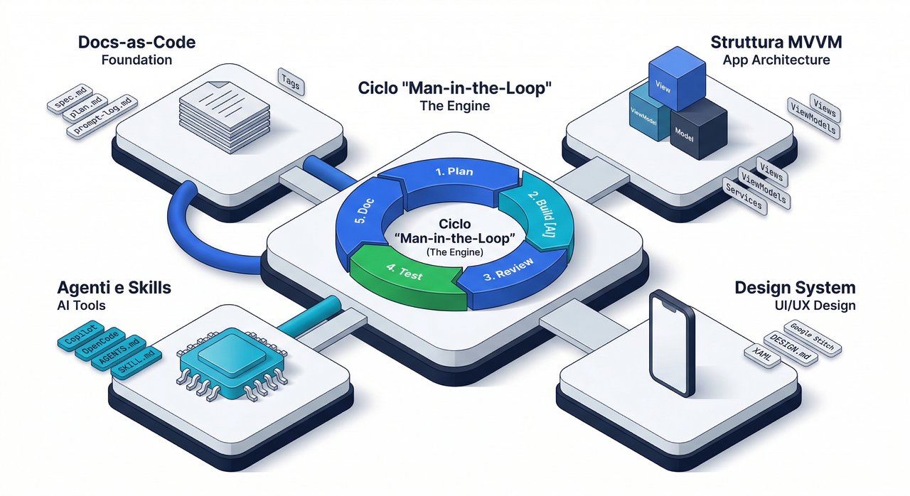
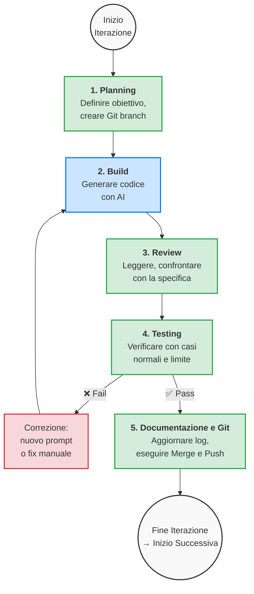
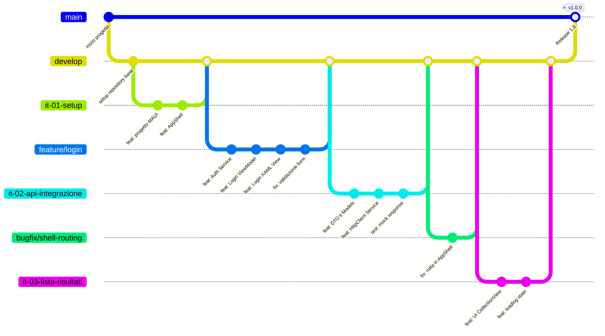
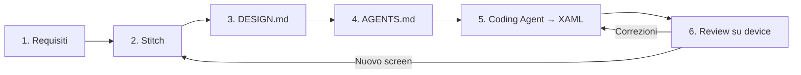

import { Badge } from '@astrojs/starlight/components';
import Accordion from "@components/Accordion.astro";

<style>{`
  img {display: block; margin: 0 auto;}
`}</style>



## 1. Introduzione

Questo modulo affronta lo sviluppo di una applicazione completa in .NET MAUI con il supporto di strumenti di Intelligenza Artificiale generativa e agentica.  
L'obiettivo non consiste nel delegare la realizzazione del progetto a un sistema automatico, ma nell'imparare a guidare l'AI in modo controllato, tracciabile e verificabile.

L'approccio adottato è di tipo **spec-driven**.  
Ciò significa che ogni iterazione di lavoro parte da specifiche esplicite, passa attraverso un piano operativo e produce modifiche limitate, controllate e testate.

### 1.1 Presupposti

Il percorso si inserisce dopo un corso introduttivo che ha già affrontato i fondamenti di .NET MAUI, l'uso di XAML, i layout, le risorse condivise, la navigazione con Shell, la persistenza locale, il data binding, i temi, i permessi e l'analisi di sample ufficiali Microsoft.  
Il nuovo modulo estende quindi un impianto già esistente e non sostituisce i fondamenti acquisiti.

### 1.2 Obiettivi del modulo

Al termine del modulo lo studente dovrebbe essere in grado di:

- definire specifiche realistiche per un progetto software;
- pianificare il lavoro in iterazioni brevi e verificabili;
- usare l'AI per generare e rivedere codice senza rinunciare al controllo umano;
- integrare API esterne, persistenza locale e navigazione in una applicazione MAUI completa;
- documentare il percorso di sviluppo in modo strutturato;
- preparare una versione finale installabile e dimostrabile;
- presentare il progetto in modo chiaro e motivato.

---

## 2. AI come supporto, non come sostituto

Uno strumento AI può produrre codice plausibile in pochi secondi, ma non garantisce automaticamente correttezza, coerenza architetturale, sicurezza, qualità della UX o affidabilità del risultato finale.  
Per questo motivo il ruolo umano rimane centrale in tutte le fasi: definizione del problema, controllo delle scelte, review del codice, validazione dei test e presentazione del progetto.

L'uso corretto dell'AI in questo modulo si basa su quattro principi:

- **contesto chiaro**: fornire sempre all'AI informazioni sufficienti sul progetto, sull'architettura e sui vincoli;
- **richieste precise**: evitare prompt generici e preferire richieste specifiche, limitate a una singola feature o classe;
- **iterazioni brevi**: non chiedere mai "tutta l'app", ma procedere per piccoli passi verificabili;
- **verifica continua**: ogni output dell'AI deve essere letto, compreso, testato e, se necessario, corretto.

### 2.1 Vibe Coding vs Sviluppo Spec-Driven

L'approccio più diffuso e più rischioso adottato da chi inizia a programmare con l'AI è il cosiddetto **Vibe Coding**.  
Questo metodo si caratterizza per una serie di comportamenti problematici:

- prompt vaghi e discorsivi, del tipo *"fammi un'app meteo completa"*;
- accettazione passiva di blocchi di codice molto grandi senza lettura critica;
- assenza di pianificazione architetturale;
- impossibilità di spiegare il funzionamento del codice prodotto;
- accumulo rapido di debito tecnico, codice duplicato e dipendenze inutili.

Il risultato è spesso una "scatola nera" apparentemente funzionante, in cui lo sviluppatore perde rapidamente la comprensione del flusso logico dell'applicazione.  
Quando qualcosa si rompe, o quando viene chiesto di modificare una feature, lo sviluppatore non sa dove intervenire.

Per ovviare a queste criticità, si introduce il paradigma dello **Sviluppo Spec-Driven**.  
Questo approccio richiede che la generazione del codice sia sempre guidata da specifiche tecniche rigorose prodotte preventivamente dallo sviluppatore.

Nell'approccio spec-driven si applicano le seguenti regole fondamentali:

1. **La specifica è il punto di origine**: prima di scrivere codice, si redige una documentazione che descrive requisiti, input/output attesi e criteri di accettazione.
2. **L'AI è esecutrice, non architetto**: il design del software, la scelta del pattern architetturale e l'organizzazione delle dipendenze rimangono responsabilità umana.
3. **Micro-iterazioni**: la generazione del codice avviene in segmenti modulari, focalizzati su una singola classe o metodo per volta.
4. **La Code Review è sistematica**: nessuna riga di codice viene integrata nel progetto senza prima essere stata compresa, analizzata e testata.

### 2.2 Vantaggi dello sviluppo spec-driven

Questo approccio offre diversi vantaggi concreti:

- riduce il rischio di modifiche casuali o incoerenti;
- facilita la revisione del lavoro da parte del docente;
- consente di documentare il processo in modo naturale;
- rende più facile il testing;
- aiuta a mantenere il controllo del progetto anche quando l'AI produce molto codice;
- prepara lo studente a pratiche professionali reali.

### 2.3 Rischi dello sviluppo non guidato

Lo sviluppo non guidato da specifiche può portare rapidamente a:

- file generati senza struttura logica;
- dipendenze NuGet inutili o incompatibili;
- naming incoerente tra classi, metodi e proprietà;
- logica applicativa dispersa tra View e code-behind invece che nei ViewModel;
- regressioni difficili da spiegare dopo ogni modifica;
- impossibilità di motivare le scelte in sede di valutazione finale.

---

## 3. Il modello operativo: Man-in-the-Loop

Il modello di lavoro adottato è di tipo **Man-in-the-Loop** (traducibile come "l'uomo nel ciclo di controllo").  
In questo schema l'AI non opera da sola, ma interviene dentro una pipeline controllata in cui l'essere umano agisce come decisore, validatore e regista dell'intero processo.

:::note[Scelta didattica e Pratiche Agentiche]
È importante chiarire che l'approccio "Man-in-the-Loop" applicato in questo corso è una **scelta puramente didattica** pensata per favorire la padronanza delle fasi di sviluppo, delle logiche architetturali e dei limiti dell'AI.
Nel panorama odierno esistono già pratiche agentiche avanzate (come [*Ralph Loop*](https://www.aihero.dev/getting-started-with-ralph), [*Ralph Loop Plugin*](https://github.com/Th0rgal/opencode-ralph-wiggum), framework [*GSD*](https://github.com/gsd-build/get-shit-done), [*BMAD*](https://docs.bmad-method.org/), ecc.) che abbattono drasticamente l'interazione umana, permettendo a un agente AI di pianificare, sviluppare, correggere e rilasciare un'intera applicazione in quasi totale autonomia. Nel nostro contesto, però, l'"imbrigliare" l'AI serve proprio ad evitare l'effetto scatola nera e garantire l'apprendimento consapevole dello studente.
:::

### 3.1 Panoramica del ciclo

Ogni iterazione di lavoro segue un ciclo a cinque fasi:



**Legenda**: le fasi in verde sono a prevalente responsabilità umana; la fase in azzurro è quella in cui l'AI produce il codice; la fase in rosso indica la correzione quando un test fallisce.

### 3.2 Fase 1: Planning

La fase di Planning precede qualsiasi attività di coding.  
Lo sviluppatore definisce chiaramente l'obiettivo della singola iterazione e viene richiesto all'AI un piano breve e motivato.

In questa fase lo sviluppatore deve:

- stabilire un obiettivo verificabile (es. "aggiungere la pagina di dettaglio di un libro");
- definire i file che verranno creati o modificati;
- identificare le dipendenze da altre parti del progetto;
- scrivere i criteri di accettazione ("la feature è completa quando…");
- stimare la complessità dell'iterazione;
- **creare un nuovo branch Git** dedicato all'iterazione o alla feature (es. `git checkout -b feature/book-detail` oppure `git checkout -b it-03-dettaglio`). Il branch isolerà le modifiche di questa feature fino al suo completamento;

**Esempio pratico di obiettivo ben formulato:**

> *"Implementare il file `BookDetailViewModel.cs` contenente le proprietà `Title`, `Author`, `Description`, `CoverUrl` e un `ICommand LoadBookCommand` che chiami il service `IBookService.GetBookByIdAsync(string id)`. Gestire le proprietà `IsBusy`, `ErrorMessage` e `HasData`. Non creare il file XAML in questa iterazione."*

**Esempio di obiettivo mal formulato:**

> *"Crea la pagina del dettaglio del libro"*

La differenza è evidente: il primo obiettivo è verificabile, limitato e preciso; il secondo è vago e potrebbe portare l'AI a generare contemporaneamente ViewModel, View, Service e Model senza controllo.

**Prompt esempio per il planning:**

```text
Analizzare l'idea di una app MAUI chiamata BookScout Mobile.
Restituire:
1) obiettivo dell'app,
2) utente target,
3) 5 user story principali,
4) requisiti non funzionali,
5) rischi principali.
Non generare codice.
```

### 3.3 Fase 2: Build

Nella fase di Build vengono implementate soltanto le modifiche necessarie per quella specifica iterazione.  
L'AI viene utilizzata per generare il codice, ma sempre partendo da un prompt strutturato che include contesto, obiettivo, vincoli e formato atteso.

**Regole operative per la fase di Build:**

- ogni prompt deve riguardare al massimo una feature;
- il contesto del progetto deve essere fornito esplicitamente (architettura, file esistenti, convenzioni);
- i vincoli tecnici devono essere dichiarati (es. "usa MVVM", "non aggiungere pacchetti NuGet");
- il formato della risposta deve essere specificato (es. "restituisci solo il codice C#, senza spiegazioni");
- se il codice generato è troppo lungo o tocca troppi file, è meglio dividere la richiesta in sotto-prompt.

**Prompt esempio per la build:**

```text
Scrivere solo il service REST per SearchBooksAsync.
Vincoli:
- usare HttpClient con chiamata asincrona;
- gestire timeout ed errori di connessione con try/catch;
- restituire una List<BookDto> o una lista vuota in caso di errore;
- non scrivere ancora la View o il ViewModel;
- separare il DTO dal service in file diversi;
- usare System.Text.Json per la deserializzazione.
```

**Altro esempio di prompt per la build:**

```text
Implementare soltanto l'iterazione 2 del piano:
- creare il file Services/BookService.cs;
- creare il file Models/BookDto.cs;
- creare il file ViewModels/SearchViewModel.cs;
- gestione base di IsBusy, ErrorMessage e lista risultati.
Vincoli:
- architettura MVVM;
- usare CommunityToolkit.Mvvm per ObservableProperty e RelayCommand;
- HttpClient iniettato tramite costruttore;
- non toccare i file XAML esistenti.
Aggiornare anche docs/iterations/it-02.md con il resoconto.
```

### 3.4 Fase 3: Review

Il codice generato dall'AI deve essere letto interamente, confrontato con la specifica e corretto se necessario.  
Questa fase è critica: saltarla equivale a fare Vibe Coding.

Durante la review lo sviluppatore deve verificare:

- che il codice rispetti l'architettura MVVM (logica nei ViewModel, non nel code-behind);
- che i nomi di classi, metodi e proprietà siano coerenti con le convenzioni del progetto;
- che non siano state introdotte dipendenze non richieste;
- che la gestione degli errori sia presente e corretta;
- che il codice sia leggibile e comprensibile;
- che non ci siano duplicazioni rispetto a codice già esistente.

**Prompt esempio per la review:**

```text
Revisionare il file seguente.
Indicare:
- problemi di naming,
- logica mal collocata (es. chiamate REST nel code-behind),
- nullability non gestita,
- possibili refactoring,
- test suggeriti.
Non riscrivere ancora il codice, solo elencare i problemi trovati.
```

### 3.5 Fase 4: Testing

La feature viene verificata con casi di test normali e casi limite.  
Una feature va considerata completata solo dopo una verifica concreta sul dispositivo o sull'emulatore.

**Matrice minima di test per ogni iterazione:**

| Area | Verifiche da eseguire |
| --- | --- |
| **Input** | campi vuoti, input non valido, input molto lungo, caratteri speciali |
| **API** | risposta corretta, errore HTTP (404, 500), timeout, JSON malformato, risposta vuota |
| **UI** | stato loading visibile, stato errore mostrato, lista vuota gestita, lista lunga scrollabile |
| **Navigazione** | apertura pagina corretta, ritorno alla pagina precedente, passaggio parametri |
| **Persistenza** | salvataggio corretto, riapertura dopo chiusura app, modifica di un dato salvato |
| **Device** | tema chiaro e scuro, rotazione schermo, permessi negati dall'utente |

**Prompt esempio per il testing:**

```text
Dato questo ViewModel, proporre:
- 8 casi di test manuale con passi precisi;
- 5 edge case (casi limite);
- eventuali test unitari utili per la logica non-UI.
Non generare ancora codice di test, solo la lista dei casi.
```

### 3.6 Fase 5: Documentazione e Git

Durante l'intero ciclo di sviluppo dell'iterazione, le migliori pratiche (sia tradizionali che AI-assisted) prevedono di effettuare **commit frequenti e atomici**. Ogni volta che l'AI (o lo sviluppatore) genera un blocco di codice coerente, testato e funzionante (es. un DTO, un Service API, o un fix mirato), si dovrebbe registrare un commit (es. `git commit -am "feat: aggiunto Service API"`). In questo modo, il branch temporaneo della iterazione conterrà una cronologia dettagliata di piccoli passi, rendendo facile tornare indietro in caso di errori senza perdere tutto il lavoro svolto.

Al termine dell'iterazione (o allo sviluppo dell'intera feature), la Fase 5 serve a fare il bilancio finale, completare la documentazione e chiudere il ciclo di lavoro:

- si aggiorna il log di iterazione (`docs/iterations/it-XX.md`) con obiettivo, piano, test ed esito;
- si aggiornano la specifica (`docs/spec.md`), il prompt log (`docs/prompt-log.md`) e la matrice di test (`docs/test-matrix.md`), laddove vi siano modifiche rilevanti;
- si esegue una eventuale commit finale relativa a queste integrazioni documentali;
- si effettua il **merge** del branch completato nel branch principale (es. `main` o `develop`), dopodiché si esegue il `git push` sul repository remoto.

Questa fase chiude formalmente il ciclo dell'iterazione e ne consolida le modifiche unificandole con il codice stabile, preparando un terreno pulito per avviare l'iterazione successiva.

:::note
**Richiamo sulle best practices in ambito Git**

1. **Il Branch (lo spazio di lavoro)**

    - **Scopo**: Un branch serve a creare un ambiente isolato in cui lavorare a una specifica "unità di lavoro" senza intaccare il ramo principale del progetto (main o master).
    - **Quando si crea**: Si divide il ramo iniziale (con `git checkout -b <nome>`) esattamente all'inizio dello sviluppo di una nuova funzionalità (Feature), di un'iterazione descritta nel nostro piano, o della correzione di un problema architetturale (Bugfix).
    - **Best Practice**: Un branch per una feature (feature/login, it-03-lista-meteo). Il branch vive tutto il tempo necessario per completare l'obiettivo, per poi essere "chiuso" e fuso alla fine.

2. **Le Commit (i salvataggi progressivi)**

    - **Scopo**: Una commit non è "la consegna finale" del lavoro, ma un fotogramma esatto (uno snapshot) dello stato del codice in un preciso momento.
    - **Quando si crea**: Ogni volta che si realizza un insieme significativo e coerente di codice, o quando un test passa dopo aver scritto una certa implementazione (oppure ogni volta l'AI fornisce una soluzione funzionante di un file e lo collaudiamo).
    - **Best Practice**: Sviluppo atomico e regola del *"Commit early, commit often"* (fai commit presto e spesso). Un singolo branch può contenere decine di commit o più. Si fa un commit quando si crea l'interfaccia Service ("feat: aggiunta interfaccia web"), un altro commit quando si correda la View XAML ("feat: aggiornata UI meteo"), un altro per un fix spontaneo ("fix: risolto errore di binding null").

3. **La Merge (la chiusura)**

    - **Scopo**: Riportare il lavoro ultimato, funzionante e testato nel ramo stabile principale.
    - **Quando si fa**: È la vera azione tecnica che si compie alla conclusione di ciascuna iterazione. Riporta all'ovile la miriade di commit che hai elaborato.



:::

### 3.7 Esempio completo di una iterazione

Di seguito si riporta un esempio completo di come dovrebbe apparire il file `docs/iterations/it-03.md` al termine di una iterazione:

<Accordion title="Esempio di file di iterazione" defaultOpen={false}>

```markdown
# Iterazione 03

## Obiettivo
Aggiungere la pagina di dettaglio del libro selezionato dalla lista dei risultati.

## Piano
- creare il file Views/BookDetailPage.xaml
- creare il file ViewModels/BookDetailViewModel.cs
- aggiungere la route "bookdetail" nella Shell (AppShell.xaml.cs)
- passare l'id del libro come parametro di navigazione
- caricare i dati dal service esistente BookService.GetBookByIdAsync
- gestire gli stati IsBusy, ErrorMessage e HasData

## File coinvolti nella specifica
- docs/spec.md (sezione "Pagina Dettaglio")
- docs/plan.md (iterazione 3)

## Prompt principali utilizzati
1. "Creare BookDetailViewModel con proprietà Title, Author, Description, 
   CoverUrl, IsBusy, ErrorMessage. Iniettare IBookService nel costruttore.
   Usare CommunityToolkit.Mvvm. Gestire il caricamento asincrono."
2. "Creare il file XAML BookDetailPage con layout ScrollView contenente
   immagine copertina, titolo, autore e descrizione. Binding al ViewModel.
   Gestire stato loading con ActivityIndicator e stato errore con Label."

## File creati
- Views/BookDetailPage.xaml
- Views/BookDetailPage.xaml.cs
- ViewModels/BookDetailViewModel.cs

## File modificati
- AppShell.xaml.cs (aggiunta route)
- MauiProgram.cs (registrazione DI)

## Test eseguiti
- [x] Apertura dettaglio da lista risultati: OK
- [x] Libro con id non valido: mostra messaggio errore
- [x] Errore API (rete disconnessa): mostra "Impossibile caricare i dati"
- [x] Ritorno alla pagina precedente con tasto back: OK
- [x] Immagine copertina non disponibile: placeholder mostrato
- [ ] Rotazione schermo: layout si adatta ma perde lo scroll position

## Problemi trovati
- Il ViewModel non gestiva il caso di risposta API con corpo vuoto (200 OK ma JSON null).
- L'immagine della copertina non aveva un placeholder per il caso di URL mancante.

## Correzioni effettuate
- Aggiunto controllo null dopo la deserializzazione nel service.
- Aggiunto placeholder image nel XAML con FallbackSource.
- Fix manuale: non è stato necessario un nuovo prompt, la correzione è stata fatta a mano.

## Esito
Completato con riserva: il layout in landscape necessita di rifinitura nell'iterazione successiva.
```

</Accordion>

---

## 4. Struttura documentale del progetto (Docs-as-Code)

Per mantenere il progetto ordinato e il processo tracciabile, si adotta l'approccio **Docs-as-Code**: i documenti di specifica, piano, test e log vivono all'interno del repository, accanto al codice sorgente, e vengono aggiornati iterazione dopo iterazione.

### 4.1 Struttura completa delle cartelle

La seguente struttura rappresenta il layout consigliato per ogni progetto MAUI AI-Assisted.  
Si dovrebbe copiare questa struttura all'inizio del progetto e popolare i file man mano che il lavoro procede.

<Accordion title="Struttura documentale del progetto" defaultOpen={false}>

```text
ProjectRoot/
├─ .git/                              # Tracking history per il repository
├─ .gitignore                         # Regole di esclusione per file compilati, chiavi e token sensibili
├─ AGENTS.md                          # Regole e contesto per agenti AI (OpenCode, Copilot)
├─ README.md                          # Descrizione del progetto, setup, istruzioni di build
├─ .github/
│  └─ copilot-instructions.md         # Istruzioni specifiche per GitHub Copilot
├─ docs/
│  ├─ spec.md                         # Specifica funzionale e non funzionale completa
│  ├─ plan.md                         # Piano di lavoro con iterazioni e rischi
│  ├─ architecture.md                 # Architettura tecnica, pattern, flusso dati
│  ├─ test-matrix.md                  # Matrice di test con casi, esiti e bug trovati
│  ├─ prompt-log.md                   # Registro ragionato dei prompt significativi
│  ├─ deployment.md                   # Note su packaging, firma, rilascio APK/AAB
│  ├─ demo-script.md                  # Scaletta per la presentazione finale
│  ├─ api-notes.md                    # Note sulle API esterne: endpoint, limiti, formati
│  └─ iterations/                     # Log delle singole iterazioni Man-in-the-Loop
│     ├─ it-01.md                     # Iterazione 1: setup progetto e Shell
│     ├─ it-02.md                     # Iterazione 2: primo service REST
│     ├─ it-03.md                     # Iterazione 3: UI e data binding
│     ├─ it-04.md                     # Iterazione 4: persistenza locale
│     ├─ it-05.md                     # Iterazione 5: gestione errori e stati UI
│     └─ it-06.md                     # Iterazione 6: rifinitura, test finali, packaging
├─ src/                               # Cartella principale del progetto .NET MAUI
│  ├─ App.xaml                        # Risorse globali dell'applicazione
│  ├─ App.xaml.cs                     # Punto di ingresso dell'applicazione
│  ├─ AppShell.xaml                   # Definizione della Shell e delle tab/flyout
│  ├─ AppShell.xaml.cs                # Registrazione delle route di navigazione
│  ├─ MauiProgram.cs                  # Configurazione DI, servizi e pagine
│  ├─ Models/                         # Classi di dominio e DTO
│  │  ├─ BookDto.cs                   # Data Transfer Object per i dati API
│  │  └─ FavoriteBook.cs              # Modello per la persistenza locale
│  ├─ Services/                       # Servizi per API REST, storage, utilità
│  │  ├─ IBookService.cs              # Interfaccia del servizio libri
│  │  ├─ BookService.cs               # Implementazione con HttpClient
│  │  ├─ IDatabaseService.cs          # Interfaccia per SQLite
│  │  └─ DatabaseService.cs           # Implementazione SQLite
│  ├─ ViewModels/                     # Logica di presentazione e stato
│  │  ├─ SearchViewModel.cs           # ViewModel per la ricerca
│  │  ├─ BookDetailViewModel.cs       # ViewModel per il dettaglio
│  │  └─ FavoritesViewModel.cs        # ViewModel per i preferiti
│  ├─ Views/                          # Pagine XAML dell'applicazione
│  │  ├─ SearchPage.xaml              # Pagina di ricerca
│  │  ├─ SearchPage.xaml.cs           # Code-behind (minimo)
│  │  ├─ BookDetailPage.xaml          # Pagina dettaglio libro
│  │  ├─ BookDetailPage.xaml.cs       # Code-behind (minimo)
│  │  ├─ FavoritesPage.xaml           # Pagina preferiti
│  │  └─ FavoritesPage.xaml.cs        # Code-behind (minimo)
│  ├─ Converters/                     # Converter per il data binding XAML
│  │  └─ BoolToVisibilityConverter.cs # Esempio: mostrare/nascondere elementi
│  ├─ Resources/                      # Risorse condivise
│  │  ├─ Fonts/                       # Font personalizzati
│  │  ├─ Images/                      # Icone e immagini
│  │  ├─ Styles/                      # Stili XAML condivisi
│  │  └─ Raw/                         # File raw (es. database precaricato)
│  └─ Platforms/                      # Codice specifico per piattaforma
│     ├─ Android/                     # Manifest, risorse Android
│     └─ iOS/                         # Info.plist, risorse iOS
└─ assets/                            # Materiale non-codice per la consegna
   ├─ mockups/                        # Bozzetti UI, wireframe, sketch iniziali
   ├─ screenshots/                    # Screenshot dell'app completata
   └─ store/                          # Icone, banner e materiale per eventuale store
```

</Accordion>

### 4.2 File AGENTS.md

Il file `AGENTS.md` è il file di configurazione principale per gli agenti AI come OpenCode. Deve essere posizionato nella radice del progetto e contiene le regole che l'agente deve seguire durante tutto lo sviluppo.
Per creare automaticamente il file `AGENTS.md` si può eseguire il comando `/init` in OpenCode, come specificato nella [documentazione di OpenCode]((https://opencode.ai/docs/rules/#initialize)). In Claude Code il comando `/init` crea il file `CLAUDE.md` che oltre a definire le regole ed i ruoli dell'agente AI, viene usato anche per memorizzare standard di codifica, decisioni architetturali, comandi di build e checklist di revisione specifici per quel repository. Ulteriori dettagli sull'uso di `CLAUDE.md` sono disponibili nella [documentazione di Claude Code](https://code.claude.com/docs/en/memory#claude-md-files).

Di seguito un esempio completo di `AGENTS.md`:

<Accordion title="AGENTS.md" defaultOpen={false}>

```markdown
# AGENTS.md

## Project context

Questo progetto è una applicazione .NET MAUI con target principale Android.
L'eventuale supporto iOS è opzionale e secondario.

L'obiettivo didattico non è la generazione rapida di codice, ma lo sviluppo
controllato e documentato di una applicazione completa.

## Technical preferences

- Framework UI: .NET MAUI
- Architettura preferita: MVVM
- Navigazione preferita: Shell
- Persistenza locale: Preferences e/o SQLite (sqlite-net-pcl)
- Chiamate remote: HttpClient (con gestione asincrona)
- Parsing dati: System.Text.Json
- MVVM toolkit: CommunityToolkit.Mvvm
- Focus: robustezza, leggibilità, coerenza del codice

## Rules

- Proporre sempre un piano prima di modifiche ampie.
- Limitare ogni iterazione a una feature ben definita.
- Non introdurre nuove librerie NuGet senza motivazione esplicita.
- Non spostare logica nei code-behind se può stare in un ViewModel o Service.
- Gestire sempre loading state, error state ed empty state.
- Non rimuovere codice esistente senza spiegazione.
- Evitare duplicazioni inutili.
- Preferire nomi chiari e coerenti (PascalCase per classi e proprietà,
  camelCase per variabili locali).
- Aggiornare la documentazione quando cambia il comportamento del progetto.
- Non generare grandi blocchi di codice non richiesti.
- Indicare sempre rischi, dipendenze e test suggeriti.
- Usa git per creare branch per ogni iterazione e genera commit semantici.

## Documentation policy

Quando viene implementata una feature significativa, aggiornare almeno uno tra:

- docs/spec.md
- docs/plan.md
- docs/iterations/it-xx.md
- docs/test-matrix.md

## Output format preferred

Per ogni richiesta importante restituire:

1. piano breve;
2. file da creare o modificare;
3. implementazione richiesta;
4. rischi o punti da controllare;
5. test manuali suggeriti.

## Coding style

- classi piccole e con responsabilità chiara;
- servizi separati dai ViewModel;
- ViewModel con proprietà di stato esplicite (IsBusy, ErrorMessage, HasData);
- metodi asincroni dove appropriato;
- gestione degli errori non silenziosa;
- commenti solo quando davvero utili, non per ripetere ciò che il codice dice.

## Anti-patterns to avoid

- logica REST dentro la View o il code-behind;
- gestione confusa della navigazione (mescolare Shell e non-Shell);
- campi e proprietà con naming incoerente;
- dipendenze NuGet aggiunte senza controllo;
- refactoring troppo ampi in una sola iterazione;
- codice non spiegabile dagli autori del progetto.
```

</Accordion>

### 4.3 File copilot-instructions.md

Il file `.github/copilot-instructions.md` contiene le istruzioni specifiche per GitHub Copilot quando viene utilizzato in Visual Studio o VS Code.  
Copilot legge automaticamente questo file per calibrare le sue risposte.

Di seguito un esempio completo:

<Accordion title="copilot-instructions.md" defaultOpen={false}>

```markdown
# Copilot Instructions

## Scopo

Questo repository è usato per un progetto didattico .NET MAUI con sviluppo
assistito da AI.
Le risposte devono supportare uno sviluppo spec-driven e documentato.

## Regole di comportamento

- Prima di generare codice, proporre un piano sintetico.
- Non implementare più di una feature significativa per volta.
- Rispettare l'architettura MVVM.
- Usare Shell per la navigazione, salvo esplicita richiesta diversa.
- Evitare di introdurre pacchetti o framework non richiesti.
- Tenere separati View, ViewModel, Model e Service.
- Gestire stati di caricamento (IsBusy), errore (ErrorMessage) e dati vuoti.
- Segnalare eventuali rischi di regressione.
- Suggerire e/o eseguire messaggi di commit basati sulle modifiche al momento opportuno.

## Formato preferito delle risposte

Per richieste tecniche importanti, restituire:

1. Obiettivo dell'intervento.
2. Piano sintetico.
3. File coinvolti.
4. Codice richiesto.
5. Test manuali da eseguire.
6. Possibili problemi o rischi.

## Limiti

- Non riscrivere l'intera applicazione se viene richiesto un intervento locale.
- Non aggiungere codice non necessario (no gold plating).
- Non rimuovere funzionalità esistenti senza motivazione.
- Non ignorare nullability, error handling e async/await.

## Convenzioni del progetto

- Target principale: Android.
- UI: XAML con data binding.
- Architettura: MVVM con CommunityToolkit.Mvvm.
- REST: HttpClient asincrono.
- Storage locale: Preferences e/o SQLite.
- Design: semplice, leggibile, mobile-first.

## Esempi di richieste ben formate

- "Proporre il piano per aggiungere la pagina dei preferiti."
- "Implementare solo il service REST per la ricerca libri."
- "Revisionare questo ViewModel senza riscriverlo."
- "Generare i casi di test manuali per questa feature."
- "Spiegare cosa fa questo metodo passo per passo."

## Esempi di richieste da evitare

- "Costruire tutta l'app completa."
- "Rifare tutto meglio."
- "Aggiungere qualsiasi libreria utile."
- "Sistemare tutto il progetto."
```

</Accordion>

### 4.4 Template per docs/spec.md

La specifica è il documento fondamentale del progetto.  
Deve essere compilata prima di scrivere qualsiasi riga di codice e deve essere aggiornata quando i requisiti cambiano.

<Accordion title="Template per docs/spec.md" defaultOpen={false}>

```markdown
# Specifica del progetto

## Titolo del progetto

Nome dell'applicazione.

## Descrizione sintetica

Descrizione breve del problema che l'app risolve e del valore che offre
all'utente finale.

## Utente target

Descrivere:
- chi usa l'app;
- in quale contesto (a casa, in viaggio, a scuola);
- con quale obiettivo principale.

## Problema affrontato

Spiegare il bisogno concreto a cui l'app risponde.
Perché un utente dovrebbe voler usare questa applicazione?

## Obiettivi del progetto

- O1: ...
- O2: ...
- O3: ...

## Funzionalità obbligatorie

- F1: ricerca tramite API esterna
- F2: visualizzazione lista risultati
- F3: pagina dettaglio con informazioni estese
- F4: salvataggio preferiti in locale
- F5: gestione stati UI (loading, errore, vuoto)

## Funzionalità opzionali

- FO1: filtri avanzati
- FO2: cronologia ricerche
- FO3: tema chiaro/scuro
- FO4: condivisione contenuti
- FO5: modalità offline con cache locale

## Requisiti non funzionali

- UI leggibile e coerente su schermi diversi
- Gestione errori chiara e non silenziosa
- Responsività (nessun blocco della UI durante le chiamate API)
- Persistenza locale minima (preferiti o impostazioni)
- Compatibilità Android (API level 24+)
- Codice ordinato, manutenibile e spiegabile

## Schermate principali

| Schermata | Scopo | Dati mostrati | Azioni possibili |
|---|---|---|---|
| Home | Pagina iniziale | Contenuti in evidenza | Navigare alle sezioni |
| Search | Ricerca | Lista risultati | Cercare, selezionare |
| Detail | Dettaglio | Info complete | Salvare, condividere |
| Favorites | Preferiti | Lista salvati | Rimuovere, aprire |
| Settings | Impostazioni | Preferenze | Cambiare tema, pulire cache |

## Navigazione prevista

Descrivere il flusso tra le schermate, indicando:
- la struttura della Shell (TabBar o FlyoutItem);
- quali schermate sono raggiungibili da quali altre;
- come vengono passati i parametri di navigazione.

## API esterne

| API | Scopo | Endpoint principali | Autenticazione | Limiti noti |
|---|---|---|---|---|
| ... | ... | GET /search?q=... | Nessuna / API Key | ... req/min |

## Dati locali

Indicare quali dati verranno salvati localmente:
- preferiti (SQLite);
- cronologia ricerche (Preferences o SQLite);
- impostazioni utente (Preferences);
- cache dei dati API (opzionale);
- note personali (opzionale).

## Permessi richiesti

- [x] Internet (ACCESS_NETWORK_STATE, INTERNET)
- [ ] Posizione (ACCESS_FINE_LOCATION)
- [ ] Fotocamera
- [ ] Storage esterno
- [ ] Altro: ...

## Vincoli

- tempo disponibile: circa X settimane;
- complessità massima: app single-user, no backend custom;
- target principale: Android;
- no librerie UI di terze parti non motivate.

## Criteri di accettazione

Per ogni funzionalità obbligatoria, definire un criterio:
- Dato [condizione iniziale]
- Quando [azione dell'utente]
- Allora [risultato atteso]

Esempio:
- Dato che l'utente ha digitato "Harry Potter" nella barra di ricerca
- Quando preme il pulsante "Cerca"
- Allora viene mostrata una lista di libri contenenti "Harry Potter" nel titolo

## Casi limite da considerare

- input vuoto nella ricerca;
- rete assente durante una chiamata API;
- risposta API con JSON incompleto o malformato;
- dati duplicati nella lista preferiti;
- permesso di rete negato dall'utente;
- device in modalità aereo.

## Rischi principali

- R1: API non disponibile durante lo sviluppo
- R2: rate limit troppo basso per i test
- R3: JSON con struttura diversa da quella attesa
- R4: tempi stretti per la rifinitura

## Versione MVP

Descrivere con precisione il prodotto minimo considerato sufficiente
per la consegna. Ad esempio:
"L'app deve permettere la ricerca, mostrare i risultati in una lista,
aprire il dettaglio e salvare un elemento tra i preferiti. La gestione
degli errori e lo stato di caricamento devono essere presenti."
```

</Accordion>

### 4.5 Template per docs/plan.md

Il piano di lavoro traduce la specifica in una sequenza di iterazioni concrete.  
Ogni iterazione ha un obiettivo verificabile, un elenco di file coinvolti e un risultato atteso.

<Accordion title="Template per docs/plan.md" defaultOpen={false}>

```markdown
# Piano di lavoro

## Titolo del progetto

Nome dell'applicazione.

## Obiettivo del piano

Descrivere come si intende trasformare la specifica in un progetto
sviluppabile attraverso iterazioni incrementali.

## Architettura prevista

- Pattern: MVVM
- Navigazione: Shell (TabBar o FlyoutItem)
- Services: separati per API REST e storage locale
- Models/DTO: separati dai Services
- Persistenza: Preferences e/o SQLite (sqlite-net-pcl)
- MVVM Toolkit: CommunityToolkit.Mvvm

## Struttura prevista delle cartelle (parziale, per l'esempio completo vedasi il template completo)


ProjectRoot/
├─ .git/                  ← Repository Git inizializzato
├─ .gitignore             ← Regole di esclusione (bin, obj, ecc.)
├─ src/
│  ├─ Models/
│  ├─ Services/
│  ├─ ViewModels/
│  ├─ Views/
│  ├─ Converters/
│  ├─ Resources/
│  └─ Platforms/
├─ docs/
│  ├─ plan.md             ← Questo file
│  └─ requirements.md     ← Specifiche iniziali
└─ README.md              ← Documentazione di progetto
​ 

## Dipendenze previste

| Dipendenza | Motivo | Obbligatoria / Opzionale |
|---|---|---|
| CommunityToolkit.Mvvm | MVVM: ObservableProperty, RelayCommand | Obbligatoria |
| sqlite-net-pcl | Persistenza locale con SQLite | Obbligatoria |
| System.Text.Json | Deserializzazione risposte API | Obbligatoria (built-in) |

## Iterazioni previste

### Iterazione 1 - Setup e struttura base
- **Obiettivo**: creare il progetto, configurare Shell, aggiungere le pagine vuote
- **File coinvolti**: AppShell.xaml, MauiProgram.cs, Views/*.xaml
- **Risultato atteso**: l'app si avvia e mostra la navigazione tra le tab

### Iterazione 2 - Primo service REST
- **Obiettivo**: implementare il service per la chiamata API principale
- **File coinvolti**: Services/IApiService.cs, Services/ApiService.cs, Models/Dto.cs
- **Risultato atteso**: il service restituisce dati corretti (verificabile da debug)

### Iterazione 3 - UI lista e data binding
- **Obiettivo**: mostrare i dati nella pagina principale con CollectionView
- **File coinvolti**: Views/MainPage.xaml, ViewModels/MainViewModel.cs
- **Risultato atteso**: la lista dei risultati è visibile e scrollabile

### Iterazione 4 - Pagina dettaglio
- **Obiettivo**: implementare navigazione e pagina dettaglio
- **File coinvolti**: Views/DetailPage.xaml, ViewModels/DetailViewModel.cs, AppShell.xaml.cs
- **Risultato atteso**: cliccando un elemento si apre il dettaglio completo

### Iterazione 5 - Persistenza e preferiti
- **Obiettivo**: salvare e recuperare i dati preferiti in SQLite
- **File coinvolti**: Services/DatabaseService.cs, ViewModels/FavoritesViewModel.cs
- **Risultato atteso**: i preferiti sopravvivono alla chiusura dell'app

### Iterazione 6 - Gestione errori, stati UI e rifinitura
- **Obiettivo**: gestire loading, errore, empty state; rifinire UI
- **File coinvolti**: tutti i ViewModel (proprietà IsBusy, ErrorMessage), Views (XAML)
- **Risultato atteso**: l'app gestisce correttamente rete assente, errori e liste vuote

## Rischi tecnici

| Rischio | Probabilità | Impatto | Mitigazione |
|---|---|---|---|
| API non disponibile | Bassa | Alto | Preparare dati mock locali |
| JSON inatteso | Media | Medio | Validare con Postman prima |
| UI troppo complessa | Media | Medio | Semplificare, usare template |
| Tempi stretti | Alta | Alto | Dare priorità al MVP |
| Problemi con permessi | Bassa | Basso | Testare su device reale |

## Strategia di testing

- test manuale su feature singole dopo ogni iterazione;
- casi limite documentati nella matrice di test;
- test finale end-to-end prima della consegna;
- eventuali test automatici su logica non-UI (service, parsing).

## Strategia di documentazione

Dopo ogni iterazione aggiornare:
- docs/iterations/it-xx.md
- docs/prompt-log.md (se sono stati usati prompt significativi)
- docs/test-matrix.md (se sono stati eseguiti nuovi test)

## Definition of Done

Una iterazione si considera conclusa quando:
- il codice compila senza errori;
- la feature è testata su emulatore o device;
- la documentazione minima è aggiornata;
- il codice è stato revisionato (letto e compreso);
- i prompt importanti sono stati tracciati nel prompt-log.
```

</Accordion>

### 4.6 Template per docs/architecture.md

Il documento di architettura descrive l'organizzazione tecnica dell'applicazione.  
È utile sia come riferimento durante lo sviluppo sia come materiale per la presentazione finale.

<Accordion title="Template per docs/architecture.md" defaultOpen={false}>

```markdown
# Architettura del progetto

## Obiettivo

Descrivere l'organizzazione tecnica dell'applicazione, i pattern adottati
e il flusso dei dati tra i componenti.

## Pattern architetturale

L'applicazione segue il pattern **MVVM** (Model-View-ViewModel).
Questo approccio separa nettamente:
- la presentazione (View/XAML);
- la logica di stato e i comandi (ViewModel);
- i dati e i servizi (Model/Service).

## Componenti principali

| Componente | Responsabilità |
|---|---|
| **Views/** | Pagine XAML, layout, visual tree, data binding |
| **ViewModels/** | Stato della UI, comandi, logica di presentazione |
| **Services/** | API REST, persistenza locale, sensori, utilità |
| **Models/DTO** | Strutture dati per API e per storage locale |
| **Converters/** | Converter per trasformazioni nel binding XAML |

## Navigazione

La navigazione è gestita tramite **.NET MAUI Shell**.

Struttura della Shell:
- TabBar con N tab principali (es. Home, Search, Favorites, Settings)
- Route registrate in AppShell.xaml.cs per le pagine di dettaglio
- Parametri di navigazione passati tramite query string o IQueryAttributable

Comportamento della back navigation:
- Il tasto back hardware torna alla pagina precedente nello stack
- Le tab mantengono il proprio stato indipendente

## Flusso dati tipico

Il flusso dati segue questo schema per ogni operazione:

​```mermaid
sequenceDiagram
    participant U as Utente
    participant V as View (XAML)
    participant VM as ViewModel
    participant S as Service
    participant API as API Esterna

    U->>V: Azione (es. tap su "Cerca")
    V->>VM: Comando (SearchCommand)
    VM->>VM: IsBusy = true
    VM->>S: SearchAsync(query)
    S->>API: GET /search?q=query
    API-->>S: JSON response
    S-->>VM: List<Dto>
    VM->>VM: Items = risultati, IsBusy = false
    VM-->>V: PropertyChanged
    V-->>U: UI aggiornata (lista risultati)
​```

## Gestione stato UI

Ogni ViewModel che carica dati remoti deve esporre almeno queste proprietà:

| Proprietà | Tipo | Scopo |
|---|---|---|
| `IsBusy` | bool | Indica se è in corso un caricamento |
| `ErrorMessage` | string | Messaggio di errore (vuoto se nessun errore) |
| `HasData` | bool | Indica se ci sono dati da mostrare |
| `IsEmptyState` | bool | Indica se la ricerca ha dato risultati vuoti |

La View deve gestire almeno questi stati visivi:
- **Loading**: ActivityIndicator visibile, contenuto nascosto
- **Errore**: messaggio di errore visibile, pulsante "Riprova"
- **Empty**: messaggio "Nessun risultato trovato"
- **Dati caricati**: contenuto principale visibile

## Gestione errori

- Errori di rete: catch di HttpRequestException, messaggio "Connessione assente"
- Errori HTTP (4xx, 5xx): verifica del StatusCode nella risposta
- Errori di parsing: catch di JsonException, messaggio "Dati non validi"
- Timeout: configurazione di HttpClient.Timeout, messaggio "Richiesta scaduta"
- Fallback: in caso di errore, mostrare l'ultimo dato disponibile se presente

## Persistenza locale

| Dato | Tecnologia | Struttura |
|---|---|---|
| Preferiti | SQLite | Tabella con campi id, titolo, immagine, data aggiunta |
| Impostazioni | Preferences | Coppie chiave-valore (tema, lingua, ecc.) |
| Cronologia | SQLite o Preferences | Lista degli ultimi N elementi cercati |
| Cache | File system o SQLite | Dati API salvati con timestamp di scadenza |

## Sicurezza

- Le API key non devono essere committate nel repository pubblico.
  Usare variabili d'ambiente o file .env escluso dal .gitignore.
- I dati locali non contengono informazioni sensibili.
- Gli input dell'utente devono essere validati prima di essere usati.

## Estendibilità

L'architettura MVVM con servizi separati consente di:
- aggiungere nuove pagine senza toccare le esistenti;
- sostituire il service REST con un mock per i test;
- aggiungere nuovi provider di dati (es. seconda API);
- cambiare la tecnologia di persistenza senza toccare i ViewModel.
```

</Accordion>

### 4.7 Template per docs/prompt-log.md

Il prompt log raccoglie i prompt realmente significativi usati durante il progetto.  
Non è una cronologia completa della chat, ma una selezione ragionata dei prompt che hanno influito su decisioni, codice, struttura o test.

<Accordion title="Template per docs/prompt-log.md" defaultOpen={false}>

```markdown
# Prompt log

## Scopo

Questo file raccoglie i prompt realmente significativi usati durante il
progetto. Non deve contenere tutto, ma solo gli scambi che hanno
influenzato decisioni, codice, struttura o test.

---

## Prompt 01

### Data
AAAA-MM-GG

### Strumento
- Copilot / OpenCode / altro

### Obiettivo
Descrivere lo scopo del prompt: cosa si voleva ottenere.

### Prompt
​```text
[Testo esatto del prompt inviato all'AI]
​```

### Output utile
Riassumere la parte davvero utile della risposta.
Non incollare l'intero output, solo le parti rilevanti.

### Decisione presa
Spiegare se il suggerimento è stato:
- accettato integralmente;
- accettato con modifiche (specificare quali);
- rifiutato (specificare perché).

### Motivazione
Spiegare il perché della decisione.
Questa è la parte più importante: dimostra la comprensione critica.

---

## Prompt 02

### Data
AAAA-MM-GG

### Strumento
- Copilot / OpenCode / altro

### Obiettivo
...

### Prompt
​```text
...
​```

### Output utile
...

### Decisione presa
...

### Motivazione
...

---

## Osservazioni finali

Al termine del progetto, riflettere su:
- Quali prompt si sono rivelati più efficaci e perché.
- Quali prompt hanno generato codice meno utile o fuorviante.
- In che modo l'AI ha migliorato il processo di sviluppo.
- In quali casi è stato necessario correggere o rifiutare l'output.
- Cosa si farebbe diversamente in un progetto futuro.
```

</Accordion>

### 4.8 Template per docs/test-matrix.md

La matrice di test documenta le verifiche eseguite sul progetto.  
Serve a dimostrare che il progetto non è stato soltanto costruito, ma anche verificato.

<Accordion title="Template per docs/test-matrix.md" defaultOpen={false}>

```markdown
# Matrice di test

## Obiettivo

Documentare le verifiche eseguite sul progetto in modo sistematico.
Ogni test ha un identificativo, un'area, una descrizione e un esito.

## Test funzionali

| ID | Area | Caso di test | Passi | Risultato atteso | Esito | Note |
|---|---|---|---|---|---|---|
| T01 | Input | Campo di ricerca vuoto | Premere "Cerca" senza testo | Messaggio "Inserire un termine" | ✅ / ❌ | |
| T02 | API | Richiesta con query valida | Cercare "pizza" | Lista di risultati non vuota | ✅ / ❌ | |
| T03 | API | Richiesta senza connessione | Disattivare WiFi, cercare | Messaggio "Connessione assente" | ✅ / ❌ | |
| T04 | API | Timeout della richiesta | Simulare timeout | Messaggio "Richiesta scaduta" | ✅ / ❌ | |
| T05 | UI | Stato loading durante ricerca | Avviare una ricerca | ActivityIndicator visibile | ✅ / ❌ | |
| T06 | UI | Stato errore mostrato | Provocare un errore | Label con messaggio visibile | ✅ / ❌ | |
| T07 | UI | Lista vuota gestita | Cercare termine senza risultati | Messaggio "Nessun risultato" | ✅ / ❌ | |
| T08 | Persistenza | Salvataggio preferito | Aggiungere un elemento | Elemento presente in Favorites | ✅ / ❌ | |
| T09 | Persistenza | Persistenza dopo riavvio | Chiudere e riaprire l'app | Preferiti ancora presenti | ✅ / ❌ | |
| T10 | Persistenza | Rimozione preferito | Eliminare un elemento | Elemento rimosso dalla lista | ✅ / ❌ | |
| T11 | Navigazione | Apertura dettaglio | Toccare un elemento della lista | Pagina dettaglio con dati corretti | ✅ / ❌ | |
| T12 | Navigazione | Ritorno alla lista | Premere back dal dettaglio | Lista precedente ancora visibile | ✅ / ❌ | |
| T13 | Device | Tema chiaro | Impostare tema chiaro | UI leggibile e coerente | ✅ / ❌ | |
| T14 | Device | Tema scuro | Impostare tema scuro | UI leggibile e coerente | ✅ / ❌ | |

## Casi limite aggiuntivi

| ID | Caso | Esito | Note |
|---|---|---|---|
| E01 | Input molto lungo (200+ caratteri) | ✅ / ❌ | |
| E02 | Caratteri speciali nell'input (@, #, emoji) | ✅ / ❌ | |
| E03 | Risposta JSON incompleta o malformata | ✅ / ❌ | |
| E04 | Permesso di rete negato dall'utente | ✅ / ❌ | |
| E05 | Doppio tap rapido su pulsante | ✅ / ❌ | |
| E06 | Lista con molti elementi (100+) | ✅ / ❌ | |
| E07 | Rotazione dello schermo durante caricamento | ✅ / ❌ | |

## Bug trovati

| ID bug | Descrizione | Gravità | Iterazione | Stato |
|---|---|---|---|---|
| B01 | ... | Alta/Media/Bassa | It-XX | Risolto/Aperto |

## Esito complessivo

Descrivere il livello di stabilità raggiunto prima della consegna.
Indicare quanti test sono passati su quanti totali e le problematiche
ancora aperte.
```

</Accordion>

### 4.9 Template per docs/iterations/it-template.md

Ogni iterazione deve avere il proprio file di log.  
Lo studente può copiare questo template e rinominarlo `it-01.md`, `it-02.md`, ecc.

<Accordion title="Template per docs/iterations/it-template.md" defaultOpen={false}>

```markdown
# Iterazione XX

## Obiettivo
Descrivere in una frase precisa l'obiettivo di questa iterazione.
L'obiettivo deve essere verificabile.

## Piano
- elenco dei file da creare;
- elenco dei file da modificare;
- eventuali dipendenze da iterazioni precedenti;
- eventuali rischi specifici.

## Prompt principali utilizzati
1. "[Testo sintetico del primo prompt significativo]"
2. "[Testo sintetico del secondo prompt significativo]"
3. "[Testo sintetico di eventuali altri prompt]"

## File creati
- percorso/NuovoFile.cs
- percorso/NuovoFile.xaml

## File modificati
- percorso/FileEsistente.cs (descrizione della modifica)

## Codice prodotto dall'AI e accettato
Indicare brevemente quali parti del codice sono state generate dall'AI
e accettate senza modifiche.

## Codice prodotto dall'AI e modificato manualmente
Indicare quali parti del codice generato dall'AI sono state corrette
o riscritte dallo sviluppatore, e perché.

## Test eseguiti
- [ ] Test 1: descrizione - esito
- [ ] Test 2: descrizione - esito
- [ ] Test 3: descrizione - esito

## Problemi trovati
- Problema 1: descrizione e causa.
- Problema 2: descrizione e causa.

## Correzioni effettuate
- Correzione 1: cosa è stato fatto e perché.
- Correzione 2: cosa è stato fatto e perché.

## Esito
Completato / Parziale (specificare cosa manca) / Da rifinire
```
</Accordion>

### 4.10 Template per docs/deployment.md

Il documento di deployment descrive la preparazione del progetto per la distribuzione finale.

<Accordion title="Template per docs/deployment.md" defaultOpen={false}>

```markdown
# Deployment

## Obiettivo

Documentare la preparazione del progetto per la distribuzione finale.

## Target previsti

- Android APK (installazione diretta)
- Android AAB (distribuzione tramite Google Play, opzionale)
- iOS (opzionale, richiede toolchain Apple)

## Configurazioni

| Piattaforma | Modalità | Framework | Note |
|---|---|---|---|
| Android | Release | net9.0-android | Target principale |
| iOS | Release | net9.0-ios | Facoltativa |

## Checklist pre-release

- [ ] Versione dell'app aggiornata (ApplicationDisplayVersion)
- [ ] Nome dell'app corretto (ApplicationTitle)
- [ ] Icona definitiva inserita
- [ ] Splash screen verificata
- [ ] Permessi nel Manifest controllati (solo quelli necessari)
- [ ] Build in modalità Release eseguita senza errori
- [ ] Test finale su device o emulatore in modalità Release
- [ ] Screenshot principali acquisiti
- [ ] README.md aggiornato con istruzioni di build
- [ ] Documentazione di progetto completa

## APK

### Scopo
Installazione diretta su dispositivi Android senza passare dallo store.

### Comando per la generazione
​```bash
dotnet publish -f net9.0-android -c Release
​```

### Note
Indicare:
- nome file APK generato;
- percorso nel progetto;
- versione;
- firma usata (debug o release keystore).

## AAB (opzionale)

### Scopo
Distribuzione tramite Google Play (formato richiesto da Google).

### Note
Indicare:
- nome file;
- versione;
- configurazione di firma (keystore dedicato).

## Keystore

Descrivere in modo sintetico:
- se è stato creato un keystore dedicato;
- dove viene gestito (NON committare nel repository);
- come viene protetto (password non nel codice).

## Permessi e privacy

Elencare i permessi usati dall'app e motivarne brevemente la presenza:

| Permesso | Motivo |
|---|---|
| INTERNET | Chiamate API REST |
| ACCESS_NETWORK_STATE | Verificare connettività |
| ... | ... |

## Risultato finale

Descrivere cosa è stato effettivamente consegnato:
- [ ] APK funzionante
- [ ] Screenshot principali (almeno 3)
- [ ] README con istruzioni
- [ ] Documentazione completa
- [ ] Video demo (opzionale)
- [ ] AAB per Google Play (opzionale)
```

</Accordion>

### 4.11 Template per docs/demo-script.md

La presentazione finale è parte della valutazione.  
Questo template aiuta a preparare una demo ordinata e di durata appropriata.

<Accordion title="Template per docs/demo-script.md" defaultOpen={false}>

```markdown
# Script demo finale

## Durata prevista

8-12 minuti

## Obiettivo

Guidare una presentazione tecnica ordinata, breve e chiara.
La demo non deve essere una lettura del codice, ma una dimostrazione
ragionata del progetto e del processo di sviluppo.

## Sequenza della demo

### 1. Introduzione (1 minuto)
- Nome del progetto
- Problema affrontato
- Utente target
- Valore principale dell'app

### 2. Specifica iniziale (1-2 minuti)
- Funzionalità principali implementate
- Vincoli rispettati
- Caratteristiche del MVP

### 3. Architettura (1-2 minuti)
- Pattern MVVM: spiegare con un esempio concreto
- Struttura Shell e navigazione
- Services e storage locale
- Mostrare la struttura delle cartelle

### 4. Uso dell'AI nel progetto (2-3 minuti)
- Strumenti usati (Copilot, OpenCode, altro)
- Un esempio di prompt efficace: mostrare il prompt e il risultato
- Un esempio di correzione: dove l'AI ha sbagliato e come è stato corretto
- Una decisione architetturale presa dallo sviluppatore, non dall'AI

### 5. Demo dell'applicazione (3-4 minuti)
- Avvio dell'app
- Ricerca o input principale
- Navigazione alla pagina dettaglio
- Salvataggio in locale (preferiti)
- Gestione di un caso di errore (rete assente)
- Gestione di un caso limite (ricerca vuota)

### 6. Testing (1 minuto)
- Due o tre casi di test significativi
- Un problema trovato durante il testing e come è stato risolto

### 7. Conclusione tecnica (1 minuto)
- Punti di forza del progetto
- Limiti residui conosciuti
- Possibili evoluzioni future
- Cosa si è imparato dal processo

## Note per il presentatore

- Non leggere il codice riga per riga: spiegare i concetti.
- Preparare l'app già avviata per evitare attese durante la demo.
- Avere screenshot pronti in caso di problemi tecnici.
- Cronometrare la presentazione almeno una volta prima della consegna.
```

</Accordion>

### 4.12 Template per docs/api-notes.md

Questo file è dedicato alle note sulle API esterne utilizzate nel progetto.  
È particolarmente utile per documentare i limiti, i formati e le particolarità di ciascuna API.

<Accordion title="Template per docs/api-notes.md" defaultOpen={false}>

```markdown
# Note sulle API esterne

## API principale

### Nome
[Nome della API]

### URL base
`https://api.example.com/v1`

### Documentazione ufficiale
[Link alla documentazione]

### Autenticazione
- Nessuna / API Key nell'header / API Key come parametro query

### Endpoint utilizzati

| Metodo | Endpoint | Scopo | Parametri |
|---|---|---|---|
| GET | /search?q={query} | Ricerca per testo | q: stringa di ricerca |
| GET | /item/{id} | Dettaglio singolo elemento | id: identificativo |
| GET | /popular | Lista elementi popolari | page: numero pagina |

### Formato risposta

​```json
{
  "results": [
    {
      "id": "abc123",
      "title": "Titolo esempio",
      "description": "Descrizione...",
      "image_url": "https://..."
    }
  ],
  "total_results": 42,
  "page": 1
}
​```

### Limiti noti

| Limite | Valore | Conseguenza |
|---|---|---|
| Rate limit | X richieste/minuto | Inserire delay tra le chiamate |
| Dimensione risposta | max N elementi | Implementare paginazione |
| Quota giornaliera | X richieste/giorno | Sufficiente per sviluppo |

### Problemi riscontrati

- Descrivere eventuali problemi incontrati con l'API durante lo sviluppo.
- Soluzioni adottate o workaround implementati.

### Dati mock per sviluppo offline

Per sviluppare senza connessione, è stato preparato un file JSON di mock:
- percorso: src/Resources/Raw/mock-data.json
- struttura: identica alla risposta API reale
```

</Accordion>

---

## 5. Strumenti AI disponibili e configurazione

L'ecosistema di strumenti di programmazione assistita da AI è vasto e in continua evoluzione.  
Questo modulo privilegia strumenti accessibili per studenti e integrabili direttamente nel flusso di sviluppo, riducendo l'attrito tra l'interazione con l'AI e l'applicazione del codice nel progetto.

### 5.1 GitHub Copilot Pro (Student)

[GitHub Copilot](https://github.com/features/copilot) è l'estensione di AI coding più diffusa.  
Nella versione per studenti, inclusa nel [GitHub Student Developer Pack](https://education.github.com/pack), la licenza Pro è gratuita e include l'accesso a modelli avanzati tramite Copilot Chat.

#### Inline Completions

Le inline completions sono i suggerimenti "fantasma" che compaiono mentre si scrive codice.  
Copilot analizza il contesto del file corrente e propone il completamento.

**Come usarle correttamente:**

- accettare il suggerimento con Tab solo dopo averlo letto;
- verificare che i nomi generati corrispondano alle convenzioni del progetto;
- non accettare blocchi troppo grandi senza review;
- se il suggerimento non è pertinente, continuare a digitare per riorientare Copilot.

**Quando sono più utili:**

- implementazione di pattern ripetitivi (costruttori, proprietà, dispose);
- scrittura di chiamate HttpClient con gestione errori;
- completamento di data binding nel code-behind;
- implementazione di interfacce note.

#### Copilot Chat e Slash Commands

La chat integrata nell'IDE (VS Code, Visual Studio, JetBrains IDE, etc.) permette conversazioni contestuali con l'AI.  
È particolarmente utile per:

- **`/explain`**: spiegare una porzione di codice selezionata;
- **`/fix`**: tentare di correggere un errore di compilazione;
- **`/test`**: suggerire test per un metodo o una classe;
- **`/doc`**: generare documentazione XML per un metodo.

**Esempio di uso efficace della chat:**

```text
@workspace Analizzare il progetto MAUI corrente e proporre un piano
per aggiungere la gestione dei preferiti.
Vincoli:
- usare MVVM con CommunityToolkit.Mvvm;
- usare SQLite per la persistenza;
- evitare nuove dipendenze NuGet;
- non cambiare la navigazione Shell esistente.
Restituire:
1) piano con file da creare/modificare,
2) rischi,
3) test manuali da eseguire dopo l'implementazione.
Non generare ancora il codice.
```

**Esempio di prompt per review:**

```text
Revisionare il ViewModel seguente.
Indicare:
- problemi di naming (convenzioni C# e MAUI);
- logica che dovrebbe stare in un Service;
- nullability non gestita;
- proprietà di stato mancanti (IsBusy, ErrorMessage);
- possibili miglioramenti;
- test suggeriti.
Non riscrivere il codice, solo elencare i problemi.
```

#### Copilot come agente (Agent Mode)

Nelle versioni più recenti, Copilot in VS Code supporta una modalità agente.  
In questa modalità Copilot può:

- leggere più file del progetto per costruire contesto;
- proporre un piano prima di implementare;
- creare o modificare più file in sequenza;
- eseguire comandi nel terminale integrato.

**Attenzione**: la modalità agente è potente ma rischiosa.  
Lo sviluppatore deve sempre:

- leggere il piano proposto prima di accettarlo;
- verificare ogni file modificato;
- non accettare modifiche su file che non capisce;
- usare il version control (git) per poter annullare le modifiche.

### 5.2 OpenCode (agente CLI)

[OpenCode](https://opencode.ai/) è un agente AI che lavora da riga di comando o integrato in un editor. Ad esempio VS Code ha un'estensione ufficiale per OpenCode che permette di interagire con l'agente direttamente dall'IDE. OpenCode si differenzia da Copilot Chat per la capacità di leggere l'intero filesystem del workspace.

OpenCode permette di accedere a moltissimi provider di modelli LLM (OpenAI, Ollama, Lollama Cloud, KiloCode, OpenCode Zen, OpenRouter, etc.) e di eseguire iterazioni di sviluppo del codice con agenti autonomi con funzionalità molto simili a quelle di [Claude Code](https://claude.com/product/claude-code) che attualmente è considerato il coding agent più avanzato.

#### Installazione di OpenCode

Per installare OpenCode, è possibile seguire le istruzioni ufficiali sul sito [https://opencode.ai/docs#install](https://opencode.ai/docs#install). L'installazione più semplice è quella basata sul package manager `npm`:

```bash
npm install -g opencode-ai
npm install -g opencode-windows-x64
```

A scuola occorre configurare il proxy per npm:

```bash
npm config set proxy http://proxy:3128
npm config set https-proxy http://proxy:3128
```

Per togliere il proxy di npm (non a scuola):

```bash
npm config rm proxy
npm config rm https-proxy
```

Se il comando `opencode` dopo l'installazione non venisse riconosciuto nella shell:
 
Aggiungere nel Path utente e di sistema il percorso: `C:\Users\<user-name>\AppData\Roaming\npm` dove `<user-name>` è il nome dell'utente Windows.

#### Plan Mode e Build Mode

OpenCode distingue tra due modalità operative:

- **Plan Mode**: l'agente analizza il progetto, legge i file markdown (in particolare `AGENTS.md`) e propone un piano delle modifiche da eseguire;
- **Build Mode**: l'agente esegue le modifiche secondo il piano approvato.

Il passaggio da Plan Mode a Build Mode può essere fatto il tasto `Tab`. 

[La guida ufficiale di OpenCode](https://opencode.ai/docs#usage) mostra i vari comandi che si possono usare.

Per implementare il controllo Man-in-the-Loop con OpenCode:

1. avviare sempre in Plan Mode;
2. leggere e validare il piano proposto;
3. se il piano è accettabile, passare a Build Mode per una singola iterazione;
4. dopo la build, verificare i file modificati;
5. tornare in Plan Mode per la prossima iterazione.

#### Prompt esempio per OpenCode

**Analisi iniziale del progetto:**

```text
Analizzare il progetto e proporre la struttura iniziale.
Obiettivo: app MAUI per Android.
Vincoli:
- usare Shell per la navigazione;
- usare MVVM con CommunityToolkit.Mvvm;
- niente librerie extra non motivate;
- restituire prima solo il piano, non il codice.
```

**Implementazione di una singola iterazione:**

```text
Implementare soltanto l'iterazione 2 del piano:
- creare Services/BookService.cs
- creare Models/BookDto.cs  
- creare ViewModels/SearchViewModel.cs
- gestione base di IsBusy, ErrorMessage e lista risultati.
Aggiornare anche docs/iterations/it-02.md con il resoconto.
Non toccare i file delle altre iterazioni.
```

**Review architetturale:**

```text
Eseguire una review architetturale del progetto.
Segnalare:
- duplicazioni di codice;
- code smell;
- responsabilità non separate (logica nel code-behind);
- punti fragili (error handling mancante);
- test mancanti.
Non applicare fix automatici, solo elencare i problemi.
```


### 5.3 Claude Code (Agent CLI di Anthropic)

[Claude Code](https://claude.com/product/claude-code) è un agente CLI assistito da intelligenza artificiale sviluppato da Anthropic che lavora direttamente nel terminale. Al momento in cui si scrivono queste note, Claude Code è il coding agent più usato dagli sviluppatori professionisti per la sua notevole capacità di comprendere il contesto dell'intero repository e per i modelli avanzati della famiglia Claude.

A differenza degli assistenti integrati nell'editor (come Copilot Chat) o degli agenti che operano in un'interfaccia grafica a sé stante, Claude Code si integra nativamente nell'ambiente iterativo su console, eccellendo nel manovrare codice sorgente, analizzare log d'errore ed eseguire comandi pre e post iterazione.

#### Installazione di Claude Code e Quickstart

Claude Code viene oggi distribuito e installato nativamente per i vari sistemi operativi. È possibile installarlo a livello di sistema operativo, come spiegato nella [documentazione ufficiale rapida di Claude Code](https://code.claude.com/docs/en/quickstart).

Ad esempio, su Windows si consiglia l'installazione tramite WinGet (eseguendo nel terminale):

```powershell
winget install Anthropic.ClaudeCode
```

In alternativa (sempre su Windows via PowerShell):

```powershell
irm https://claude.ai/install.ps1 | iex
```

Per macOS o Linux:

```bash
curl -fsSL https://claude.ai/install.sh | bash
```

Dopo l'installazione, navigando tramite console nella radice del proprio progetto, è sufficiente digitare il comando `claude` per instradare l'agente (la prima esecuzione richiederà il login e avvierà una procedura di autenticazione assistita tramite tab del browser).

:::note
In questo contesto didattico verrà usato principalmente OpenCode. Sebbene sia possibile usare Claude Code anche con provider di terze parti come ad esempio OpenRouter (come descritto nella [guida ufficiale di OpenRouter](https://openrouter.ai/docs/guides/coding-agents/claude-code-integration)), di solito gli step di configurazione possono risultare piuttosto complessi e per questo motivo non verranno approfonditi in questo documento.
:::

### 5.4 Provider di Modelli LLM Locali e Cloud (NVIDIA, Ollama, KiloCode, OpenCode Zen, OpenRouter, etc. )

Oltre a GitHub Copilot esistono alternative cloud e locali molto valide. Di seguito ne vengono presentate alcune.

#### Modelli Locali
##### Ollama

[Ollama](https://ollama.com/) è un framework essenziale e leggerissimo, utilizzabile prevalentemente da riga di comando (CLI-first), che permette di eseguire modelli linguistici in locale in totale privacy. È uno degli strumenti open source più diffusi e maturi per orchestrare l'intelligenza artificiale senza pesare sul cloud.

Vantaggi:

- il codice e i prompt non lasciano mai la macchina locale (privacy totale);
- assenza totale di limiti di *rate* o restrizioni dovute a licenze a pagamento;
- flessibilità estrema: leggero, si integra agilmente e si controlla programmaticamente in script e automazioni backend server;
- infrastruttura nativamente dotata di un'API di default compatibile con le più rilevanti direttive REST di OpenAI;
- vasto ecosistema di client di terze parti e WebUI sviluppate per agganciarsi al suo demone in locale.

Svantaggi:

- richiede hardware adeguato per garantire un'esperienza gratificante, preferendovi architetture a GPU dedicata (buon dislocamento di VRAM) o Apple Silicon se si fa girare i modelli più capaci;
- non è provvisto *out-of-the-box* di interfacce grafiche (*GUI*) ricche o complete da cui chattare interattivamente col mouse.

**Come avviare e usare Ollama in locale (Quickstart)**

Per iniziare a usare Ollama, è sufficiente scaricarlo dal sito ufficiale per il proprio OS e sfruttarlo richiamando il terminale (su Windows può posizionarsi attivamente nella tray di avvio o in servizi background):

1. **Avviare la chat interattiva nativa:** Digitando sul proprio prompt comandi `ollama run llama3` (oppure `gemma`, `phi3` o modelli specifici come `deepseek-coder`), il framework scaricherà automaticamente le dipendenze di sistema o i pesi se è avvio iniziale, per poi aprire sul momento un'interfaccia testuale a riga di terminale (*interactive chat*) per conversare.
2. **Chiudere il prompt:** Per chiudere il processo o terminare il dialogo testuale, è sufficiente scrivere `/bye` e battere Invio, oppure premere la combinazione rapida `Ctrl+D`.
3. **Gestire e interpellare le API:** Quando Ollama è avvitato nell'host a livello applicativo (app avviata e icona visibile), l'engine locale si manterrà tacitamente in ascolto e smisterà le API REST, solitamente situate presso l'indirizzo `11434`.

**Come utilizzare OpenCode con i modelli locali di Ollama**

Configurare OpenCode per connettersi a Ollama segue le orme tracciate per gli altri modelli locali sfruttando le regole OpenAI, basandosi anch'esso sulla direttiva del file JSON.

1. **Modificare il file di configurazione in OpenCode:** OpenCode consente l'uso di provider custom intervenendo con la configurazione JSON. Aggiungere la seguente parentesi *provider* nell'apposito file `config.json` (solitamente situato nella cartella utente sotto `~/.opencode/config.json` per Mac/Linux o `%USERPROFILE%\.opencode\config.json` su Windows, oppure generato localmente nel workspace di progetto) dichiarando di usare una dipendenza OpenAI-compatibile mirata sul local server Ollama.
    ```json
    {
      "$schema": "https://opencode.ai/config.json",
      "provider": {
        "ollama": {
          "npm": "@ai-sdk/openai-compatible",
          "name": "Ollama (local)",
          "options": {
            "baseURL": "http://localhost:11434/v1"
          },
          "models": {
            "llama3.1": {
              "name": "Llama 3.1"
            }
          }
        }
      }
    }
    ```
    *(Nota bene: assicurarsi che nello spazio dedicato ai `models`, l'ID impiegato come chiave JSON (es. `llama3.1`) incroci fedelmente il vero indicatore del modello presente nell'OS, di solito verificabile lanciando `ollama list` dal terminale).*
    *(Suggerimento aggiuntivo per Tool Calling: qualora riscontrassero problematiche di fallimento col tool execution nei task e agent, la documentazione ufficiale suppone di sovrascrivere o aumentare il parametro di output context size `num_ctx` dalle opzioni di default di Ollama per risolverle).*
2. **Selezionare il provider locale:** Una volta sovrascritti e aggiornati tali parametri JSON, riavviando l'agente OpenCode il nuovo provider emergerà nelle tendine sotto il nominativo di "Ollama (local)", offrendo libere iterazioni gratuite e computazioni assorbite dal proprio PC!

##### LM Studio

[LM Studio](https://lmstudio.ai/) è un'applicazione desktop (disponibile per Windows, Mac e Linux) che permette di scoprire, scaricare ed eseguire modelli linguistici in locale sulla propria macchina di sviluppo, offrendo nativamente un server web integrato e potenti strumenti per sviluppatori.

Vantaggi:

- interfaccia grafica (GUI) integrata e molto intuitiva per la ricerca e il download rapido dei modelli direttamente da Hugging Face;
- server locale out-of-the-box compatibile con lo standard API di OpenAI (Chat, Responses, Embeddings) e di Anthropic (Messages);
- supporto avanzato integrato per **Tool calling**, output strutturato (JSON schema) e funzionalità **MCP (Model Context Protocol)**;
- include SDK dedicati per sviluppatori ([lmstudio-js](https://lmstudio.ai/docs/typescript) per TypeScript/Node e [lmstudio-python](https://lmstudio.ai/docs/python) per Python);
- mette a disposizione sia la CLI standard (`lms`) sia un demone specializzato per deploy headless o in server di CI/CD (`llmster`);
- il codice e i dati non lasciano mai la macchina locale.

Svantaggi:

- l'interfaccia completa rende il pacchetto leggermente più "pesante" rispetto a soluzioni puramente da riga di comando;
- come tutti i modelli locali, richiede hardware adeguato con buona VRAM (GPU dedicata o architettura Apple Silicon) per modelli di grandi dimensioni.

**Come utilizzare OpenCode con i modelli locali di LM Studio**

Grazie al server nativo integrato in LM Studio, è immediato configurare l'agente OpenCode (o qualsiasi altra estensione compatibile) per fargli scrivere e analizzare codice attingendo al LLM caricato sul proprio computer, a costo zero e in totale privacy.

1. **Avviare il Server in LM Studio:** Nella barra di sinistra dell'applicazione, accedi alla tab "Local Server" (o "Developer"). Seleziona dalla libreria il modello linguistico desiderato (solitamente ottimizzato per il coding, come *Qwen 2.5 Coder* o *DeepSeek Coder*) e fai clic su *Start Server* (di default si attiverà sulla porta `1234`).
2. **Modificare il file di configurazione in OpenCode:** OpenCode gestisce l'aggiunta di modelli locali alterando il proprio file `config.json` (situato di default nella cartella utente, ad esempio in `~/.opencode/config.json` per Mac/Linux o `%USERPROFILE%\.opencode\config.json` su Windows). Aprire la configurazione globale o di workspace e aggiungere il blocco `provider` custom come segue:
    ```json
    {
      "$schema": "https://opencode.ai/config.json",
      "provider": {
        "lmstudio": {
          "npm": "@ai-sdk/openai-compatible",
          "name": "LM Studio (local)",
          "options": {
            "baseURL": "http://127.0.0.1:1234/v1"
          },
          "models": {
            "google/gemma-3n-e4b": {
              "name": "Gemma 3n-e4b (local)"
            }
          }
        }
      }
    }
    ```
    *(Nota: sostituire la dicitura `google/gemma-3n-e4b` in `models` con l'indicatore esatto del modello che si è effettivamente caricato nel server di LM Studio).*
3. **Selezionare il modello:** Una volta salvato il file json, avviare l'agente (o usare un apposito comando di switch modello). Si troverà nella tendina UI il provider "LM Studio (local)" e il relativo Modello, pronti a essere adoperati senza alcuna API Key a pagamento! D'ora in poi i Task di Build e Plan dell'agente verranno processati dal processore di casa propria!

##### Confronto: Ollama vs LM Studio

Sia Ollama che LM Studio sono strumenti eccellenti per eseguire e testare LLM in locale, ma si rivolgono a filosofie e flussi di lavoro leggermente diversi:

- **Approccio primario:** **Ollama** nasce come framework CLI-first (da riga di comando), essenziale e leggerissimo, risultando pervasivo negli ecosistemi terminal-based. L'interfaccia utente per chattare in Ollama è delegata a web-app esterne (come *Open WebUI* o *AnythingLLM*). **LM Studio**, invece, è un'applicazione Desktop-first: fornisce un'interfaccia grafica completa e autonoma immediatamente pronta all'uso per chattare con l'AI e gestire i modelli, aggiungendo gli strumenti CLI (`lms`, `llmster`) come estensioni facoltative.
- **Ricerca modelli:** LM Studio integra un browser interno per cercare e far scaricare con un click i vari file *.GGUF* creati dalla community direttamente da Hugging Face, rendendo l'esplorazione infinita. Ollama possiede un registro web curato (Ollama Library) simile al Docker Hub o richiede la scrittura esplicita di file di testo (`Modelfile`) per caricare pesi custom.
- **Sviluppo avanzato:** Entrambi offrono server REST compatibili con OpenAI. LM Studio si differenzia per la fornitura nativa degli endpoint Anthropic e per il rilascio di SDK ufficiali completi per integrarsi stabilmente dentro script Python o framework JS/TS.
- **Uso didattico:** Per studenti che si approcciano per la primissima volta ai Local LLM gradendo una vetrina confortevole, LM Studio è visivamente più amichevole e appagante. Per studenti che debbano invece orchestrare servizi background, container Docker, o sfruttare cli tools che di default puntano all'ecosistema di Ollama, quest'ultimo resta una scelta minimalista e universale.

##### NVIDIA NIM (modelli NIM in locale)

[NVIDIA NIM](https://docs.nvidia.com/nim/) (NVIDIA Inference Microservices) è una suite di microservizi pre-compilati e altamente ottimizzati, pensati per accelerare drasticamente il *deployment* di modelli linguistici fondanti (LLM) sfruttando al massimo le GPU NVIDIA. Offrendo container Docker nativamente provvisti di engine specializzati (come *TensorRT-LLM*), risulta la base enterprise per l'IA moderna.

Vantaggi:

- **Prestazioni estreme:** massimizza il *throughput* (token generati al secondo) e abbatte la latenza servendosi dell'accelerazione hardware dedicata e dei *preset* TensorRT precostituiti.
- **Portabilità e scalabilità assoluta:** il medesimo microservizio testato sulla propria workstation locale può essere trasferito su ecosistemi *cloud* o su cluster Kubernetes senza alterazioni.
- **Standardizzazione delle API:** espone endpoints completamente conformi allo standard OpenAI, fungendo da perfetto sostitutivo trasparente per tool nati nel cloud.
- **Sicurezza dati:** se adoperati *on-premise* o in locale, tutto il codice analizzato assicura rigorosa privacy aziendale.

Svantaggi:

- **Ecosistema chiuso e requisiti ferrei:** i NIM sono compilati univocamente per architetture NVIDIA; occorre obbligatoriamente possedere una GPU della famiglia RTX (o data center Ampere/Hopper/Blackwell) con quantitativi abbondanti di VRAM.
- **Architettura enterprise laboriosa:** per l'avvio locale necessita non solo del motore [Docker](https://www.docker.com/) pre-installato, ma anche della corretta configurazione su di esso del `NVIDIA Container Toolkit`, rendendone lo start-up decisamente più tecnico rispetto alla comoda interfaccia stand-alone di LM Studio.
- **Autenticazione richiesta:** al netto dell'eseguibilità gratuita locale, impone comunque la registrazione a NVIDIA Developer per ottenere da NGC una speciale *API Key* autorizzativa, indispensabile a scaricarne l'immagine.

**Come scaricare e avviare NVIDIA NIM in locale (Quickstart)**

Per istanziare il microservizio NIM, è necessario accertare che Docker e i driver NVIDIA siano operativi, e recuperare il *token* d'autenticazione.

1. **Ottenere e iniettare le credenziali:** Registrarsi al portale NGC e generare un'API Key personale. Effettuare successivamente l'accesso (*login*) Docker al registry NVIDIA digitando nel proprio terminale o powershell l'autenticazione: `echo $NGC_API_KEY | docker login nvcr.io -u '$oauthtoken' --password-stdin` (la variabile `$oauthtoken` resta letterale).
2. **Avviare il Microservizio:** Selezionato il modello aderente alle proprie disponibilità di VRAM dal catalogo NIM (es. variante a 8 miliardi di parametri di Llama 3), invocarne il download e l'accensione:
   ```bash
   docker run -it --rm --gpus all \
     -e NGC_API_KEY=$NGC_API_KEY \
     -p 8000:8000 \
     nvcr.io/nim/meta/llama3-8b-instruct:latest
   ```
3. **Endpoint vivo in ascolto:** Il container scaricherà prima i pesi ottimizzati necessari per profilare la specifica famiglia di GPU montata; poi si stabilizzerà. Da quell'istante, rimarrà servito regolarmente alla porta `8000`.

**Come utilizzare OpenCode appoggiandosi al container locale NIM**

Godendo del forte allineamento strutturale REST di NIM, agganciare un coding agent performante alla propria GPU NVIDIA è analogo all'operazione per Ollama.

1. **Modificare il file di configurazione in OpenCode:** Esaminare il `config.json` dell'agente OpenCode (solitamente reperibile all'indirizzo `~/.opencode/config.json` su Unix, o `%USERPROFILE%\.opencode\config.json` su Windows, oppure nel proprio spazio workspace) aggiungendo il seguente blocco per istruire l'impiego del gateway OpenAI-compatibile mirato su localhost.
    ```json
    {
      "$schema": "https://opencode.ai/config.json",
      "provider": {
        "nim-local": {
          "npm": "@ai-sdk/openai-compatible",
          "name": "NVIDIA NIM (local)",
          "options": {
            "baseURL": "http://localhost:8000/v1"
          },
          "models": {
            "meta/llama3-8b-instruct": {
              "name": "Llama 3 8B (NIM locale)"
            }
          }
        }
      }
    }
    ```
    *(Nota: assicurarsi che l'identificatore del campo modelli rispecchi accuratamente il target URL lanciato dentro il container Docker)*.
2. **Pronti alla Build:** Accendendo o rinfrescando OpenCode, scorrere la consueta selezione di modelli e preferire per le iterazioni di *Plan* e codice la neo-creata voce "Llama 3 8B (NIM locale)". OpenCode lavorerà da quel momento protetto dietro l'incredibile spinta elaborativa della propria GPU!

#### Modelli Cloud

##### NVIDIA Developer Inference Endpoints 

Il programma [NVIDIA Developer](https://developer.nvidia.com/) offre l'accesso a un vasto catalogo cloud di modelli di intelligenza artificiale accelerati tramite il portale **[build.nvidia.com](https://build.nvidia.com/)**. Questo servizio mette a disposizione degli sviluppatori una suite di *endpoint serverless* per interrogare i modelli NIM direttamente dall'infrastruttura NVIDIA.

**Vantaggi per la didattica e gli studenti:**

- **Catalogo all'avanguardia:** garantisce l'accesso gratuito (per rigorosi fini di sviluppo logico e non commerciali) a moltissimi dei migliori modelli *Open Weights* mondiali (quali *GLM*, *DeepSeek*, *Qwen*, *Llama*, *Gemma*, *MiniMax*, *Mistral*, *Nemotron*, *Phi* e molti altri).
- **Infrastruttura di altissimo livello:** l'elaborazione del codice (*inferenza*) è eseguita direttamente sui potentissimi cluster cloud NVIDIA, azzerando i tempi di risposta senza appesantire minimamente l'hardware domestico dello studente.
- **Quote generose:** l'account gratuito offre *rate limit* eccezionalmente agevolati per scopi educazionali (ad esempio 40 richieste per minuto - RPM - al momento della stesura del presente documento).
- **Estrema portabilità:** le API rispettano rigorosamente le specifiche standard OpenAI, rendendo semplice configurare estensioni REST o CLI (compreso OpenCode).

**Fasi di registrazione e accesso al servizio:**

L'iter di attivazione per generare credenziali e invocare le API nel cloud di NVIDIA richiede una precisa procedura di validazione:

1. **Iscrizione al programma Developer:** Visitare il portale istituzionale [NVIDIA Developer](https://developer.nvidia.com/) e creare un account gratuito. *(Nota bene d'impiego didattico: l'accettazione dei Termini di Servizio è vincolata alla maggiore età. Per gli studenti minorenni, l'iscrizione è subordinata al consenso espresso e alla supervisione di un genitore o di un tutore legale).*
2. **Accesso a NVIDIA Build:** Ultimata la validazione dell'account, eseguire regolarmente il login alla vetrina dei modelli interattivi raggiungibile su [build.nvidia.com](https://build.nvidia.com/).
3. **Verifica della sicurezza (2FA e Telefono):** Prima di poter rilasciare chiavi di sviluppo private, l'hub impone severe politiche di contrasto allo *spam*. Di norma risulterà indispensabile abilitare sul proprio account utente un'autenticazione a due fattori (2FA) e associare/verificare un numero di telefono cellulare autentico.
4. **Generazione della API Key:** Completati con successo i controlli anti-bot, navigando nella pagina di un qualsiasi specifico modello (ad esempio testando il prompt nell'anteprima gratuita) sarà reso disponibile il tasto *"Get API Key"*. La stringa generata (da conservare gelosamente) fungerà da chiave token universale per autenticare l'accesso a buona parte degli attuali *Inference Endpoints* erogati sulla piattaforma.

**Come collegare OpenCode agli Endpoints NVIDIA**

L'agente OpenCode dispone per NVIDIA di una comoda procedura guidata nativa, esonerando così lo sviluppatore o lo studente dalla scrittura manuale dei file JSON.

1. Avviare regolarmente OpenCode dal terminale o dall'apposita estensione nell'IDE.
2. Digitare il comando operativo `/connect` per invocare l'accoppiamento dei provider.
3. Cercare e selezionare **NVIDIA** (spesso etichettato proprio come provider cloud NIM/Build) dall'elenco delle opzioni.
4. Fornire incollando in *input* la preziosa **API Key** personale generata in precedenza al termine della registrazione su *build.nvidia.com*.

Ultimato questo breve setup, basterà lanciare l'istruzione `/models` per sfogliare comodamente il catalogo di intelligenze artificiali NVIDIA e instradarvi gratuitamene tutto il carico ingegneristico!


##### Ollama Cloud 

**[Ollama Cloud](https://ollama.com/pricing)** è l'infrastruttura ufficiale ospitata in rete dai creatori di Ollama. 
Questo servizio permette agli sviluppatori di accedere ed eseguire modelli linguistici open source molto potenti o esosi in termini di memoria (come ad esempio `gpt-oss:120b` e modelli affini) senza la necessità di disporre di macchine locali costose o dotate di GPU dedicate di fascia alta.

**Come utilizzare Ollama Cloud con il proprio Agente di Coding**

Ollama Cloud si comporta strutturalmente come un provider di intelligenza artificiale standard. Ogniqualvolta si vuole testare l'integrazione di un agent di AI coding (come OpenCode o Aider) con Ollama Cloud, è sufficiente seguire questi brevi passi formali:

1. **Registrazione:** Navigare sul sito ufficiale [ollama.com](https://ollama.com) ed effettuare l'iscrizione creando un account gratuito.
2. **Generazione API Key:** Una volta loggato e autenticato, visitare l'area *Keys* al percorso dedicato [ollama.com/settings/keys](https://ollama.com/settings/keys) per generare una propria API Key strettamente personale. Trattarla come una password e memorizzarla in un luogo sicuro.
3. **Configurazione dell'Ambiente (Opzionale):** La maggior parte dei tool da linea di comando ed agenti in locale leggerà in override automaticamente l'API Key se viene esportata come variabile ambientale di sistema temporanea o fissa:
   ```bash
   export OLLAMA_API_KEY="proprio_codice_api_key"
   ```
4. **Setup nell'Agent di Coding:** Quando si configura l'estensione o l'agente via CLI, di solito sarà richiesto di selezionare un fornitore custom **compatibile in API con OpenAI** (OpenAI-compatible endpoint). Impostare il Base URL dell'host cloud a `https://ollama.com` (inserendo ad esempio gli endpoints Chat `https://ollama.com/api/chat` se richiesto dalla documentazione specifica del tuo client CLI) e fornire l'**OLLAMA_API_KEY** generata in precedenza al posto del token OpenAI primario. Da quel momento in poi, specificando formalmente il corretto *model identifier*, si potrà interrogare direttamente tutti i grandi LLMs Cloud offerti dal servizio.

##### KiloCode e OpenCode Zen

**KiloCode** ([kilo.ai/docs](https://kilo.ai/docs/)) e **OpenCode Zen** ([opencode.ai/docs/zen/](https://opencode.ai/docs/zen/)) sono formidabili **AI Gateway** e marketplace cloud avanzati che forniscono accesso unificato a centinaia di modelli linguistici di svariati produttori (Anthropic, OpenAI, Google, Mistral, DeepSeek) tramite una singola API centralizzata. KiloCode, inoltre, produce estensioni dedicate e ufficiali (es. per VS Code e JetBrains) volte ad automatizzare il coding ai massimi livelli.

Entrambe le piattaforme supportano interfacce e connessioni completamente compatibili con lo standard API di OpenAI (i famosi "OpenAI-compatible endpoints"). Tale scelta tecnica le consacra come l'ecosistema alternativo "drop-in" perfetto: configurare  questi sistemi in un IDE presuppone semplicemente scambiare l'indirizzo base e fornire la chiave API generata sui rispettivi portali. 

**Il Vantaggio in Didattica: I modelli Gratuiti (Free Tier)**

Uno dei grandissimi vantaggi di KiloCode e OpenCode Zen, differenziandoli radicalmente da modelli puri *pay-as-you-go*, è l'enorme disponibilità di **potenti modelli linguistici da usarsi a costo zero (Free Tier)** soggetti a un margine di quote mensili molto alto (se non illimitato). Nel caso specifico, la piattaforma seleziona modelli in via promozionale (come *MiniMax M2.5 Free*, *MiMo V2 Omni Free*, *Nemotron* ecc.) eccellenti per la scrittura e il refactoring del codice sorgente. Sfruttando questi *layer gratuiti* ogni studente può sperimentare flussi di lavoro di ingegneria moderni senza il gravame di dover investire nell'hardware locale necessario per Ollama o pagare abbonamenti esosi periodici alle controparti big-tech. 

Pertanto, questi gateway possono essere configurati come flessibili backend didattici per:

- estensioni per workflow avanzati come KiloCode (VS Code, JetBrains);
- agenti CLI indipendenti e specializzati come OpenCode *Zen*;
- qualsiasi tool o plugin IDE che supporti flessibilmente il pattern host/endpoint generico di "OpenAI-compatible API".

##### OpenRouter

**OpenRouter** ([openrouter.ai](https://openrouter.ai/)) è in ambito storiografico l'AI Gateway e l'aggregatore di modelli di intelligenza artificiale di gran lunga più rinomato. 
Esattamente come le alternative sopra descritte, appronta un layer intermedio e fornisce un endpoint unificato e standard ("OpenAI-compatible endpoints") per dialogare sistematicamente con oltre trecento LLM di punta del panorama mondiale (producibili da Anthropic, DeepSeek, Google, OpenAI, Mistral, Meta e dalla scena open source).

**Modello "Pay-As-You-Go" rigoroso e libreria sterminata di Modelli Gratuiti**

Il pregio enorme di OpenRouter consiste nella flessibilità gestionale assoluta. La fatturazione avviene *esclusivamente al consumo puro* in ordini frazionari centesimali per i modelli closed, eliminando categoricamente l'imposizione di abbonamenti (come per GitHub Copilot, ChatGPT Plus ecc).

In aggiunta a ciò, OpenRouter sovvenziona e supporta costantemente una [raccolta di Modelli Gratuiti (Free Models)](https://openrouter.ai/models?max_price=0) che si aggiorna di riflesso al panorama scientifico. Molti modelli celebri e allo stato dell'arte offrono limitate sessioni di transizione gratis che consentono a studenti e professionisti di effettuare sperimentazioni o interrogazioni per laboratori prolungati senza dover associare carte di credito.

**Setup per OpenCode, Aider o altri Agenti IDE:**

Per agganciare in scioltezza la libreria offerta da OpenRouter all'interno del proprio agent CLI preferito:

- Ottenere una chiave registrando un profilo free via [openrouter.ai/keys](https://openrouter.ai/keys).
- Configurare l'agente o l'estensione indicando come provider custom un gateway **OpenAI-compatibile**.
- Quando richiesto, popola il campo *Base URL* (oppure *API Endpoint URL*) al valore standard `https://openrouter.ai/api/v1` (o varianti analoghe suggerite dalla specifica SDK in uso all'agent).
- Inserire nel placeholder dell'API KEY la propria stringa testuale autorizzativa OpenRouter per intercettare direttamente i LLMs gratuiti!

##### Antigravity e i modelli Cloud di Google Gemini

[Google Antigravity](https://antigravity.google/) rappresenta l'evoluzione dell'IDE tradizionale verso la nuova era *"Agent-First"*. Sviluppata da Google DeepMind, non è un semplice strumento di autocompletamento, ma una vera e propria **piattaforma di sviluppo agentica** pensata per dirigere e orchestrare AI autonome. 

Mentre i copilot tradizionali spesso si fermano a un framework conversazionale, in Antigravity l'intelligenza artificiale agisce come un attore autonomo in grado di **pianificare, eseguire, validare e iterare** su compiti ingegneristici complessi con un intervento umano ad alto livello direttivo (*Man-in-the-Loop*). 

Tra le sue caratteristiche avanzate per lo sviluppo di progetti moderni troviamo:
- **Agent Manager (Mission Control):** Un cruscotto che permette di lanciare, monitorare e orbitare multipli agenti su diversi workspace.
- **Planning Mode & Artifacts:** Prima di eseguire modifiche non banali, l'agente genera iterativamente documenti markdown strutturati e consultabili chiamati *Artifacts* (es. `implementation_plan.md`, `task.md`, `walkthrough.md`). Questa logica disinnesca radicalmente il problema del *Vibe Coding*, forzando la macchina (e mostrando allo studente) un ragionamento logico a priori.
- **Antigravity Browser:** Un sub-agente dinamico integrato capace di aprire un browser web, interagire con la pagina (cliccare, scrollare, digitare), leggere i log della console locale, scattare screenshot e registrare flussi video. È uno strumento inestimabile per il debug visivo e il testing di interfacce utente.

**Vantaggi per la didattica:** 
Antigravity è scaricabile e installabile in locale. È attualmente disponibile in **preview pubblica senza costi** (associata a un account Google standard, richiede solo Chrome e requisiti minimi di RAM/Disco). La piattaforma offre una flessibilità enorme garantendo l'accesso **anche a numerosi modelli di terze parti** creati da altri provider, come, ad esempio i modelli di Anthropic, **Claude Sonnet** e **Claude Opus**, oppure GPT OSS. Tuttavia, essendo nativamente integrata con la potentissima famiglia di modelli **Gemini 3 Pro** via Cloud, vanta su quest'ultimi rate limit gratuiti estremamente generosi, incarnando il candidato ideale per fornire a ogni studente il suo primo vero "Junior Developer" virtuale a costo zero.

La guida ufficiale di Antigravity è disponibile a questo link: [https://antigravity.google/docs/get-started](https://antigravity.google/docs/get-started).

### 5.5 L'agente AI e le operazioni Git (Commit e Push)

Una della funzionalità più impattanti nello sviluppo Man-in-the-Loop assistito prevede la delega delle operazioni di version control (soprattutto i branch creation, i `commit` e i `push`) direttamente all'agente AI, come Copilot in Agent Mode o OpenCode. Dato che gli studenti spesso trovano noioso o sinteticamente complesso produrre log e commit message esplicativi, formattati e formali, l'agente risulta uno strumento eccellente per automatizzare questo step alla perfezione.

Tuttavia, queste automazioni richiedono l'abilitazione di permessi sensibili nel proprio set di strumenti, e un elevato livello di accortezza.

#### Permessi e sicurezza dell'Agente

Per far sì che l'agente esegua dei commit ed effettui push, è necessario che il framework o l'IDE gli garantiscano la "**Terminal Command Execution**" (Esecuzione di comandi nel terminale, spesso richiesta da agenti come Claude Code o da VS Code per GitHub Copilot Workspace), o fornirgli autorizzazione via Source Control API.
In pratica, l'IDE vi chiederà regolarmente di approvare, confermare o negare l'esecuzione di comandi proposti nel terminale direttamente dall'agente.

- **Il potenziale dell'automazione**: Chiedere semplicemente *"Crea il branch it-04-persistenza e fai la commit delle modifiche che abbiamo appena testato con un messaggio convenzionale"* fa risparmiare tempo e migliora vertiginosamente la qualità del log di Git, che terrà esattamente traccia di ogni variazione del software.
- **I rischi da evitare**: Lasciare che l'agente esegua commit ed effettui operazioni nel terminale in *auto-approve* o senza aver letto le query generate comporta il rischio concreto di inquinare irreparabilmente la cronologia (`git log`) e caricare sul repository remoto codice *spaccato* e non testato. A tal punto che un ripristino o reset tramite Git potrebbe diventare impraticabile per lo studente in via autonoma.

#### Workflow corretto per affidare Git all'AI:

1. Fai sempre generare all'agente il diff delle modifiche in anteprima, chiedendo ad esempio: *"Cosa è cambiato in questa iterazione? Mostrami una lista sommaria o il git status prima di procedere al commit"*.
2. Verifica che i file non desiderati o non rilevanti (ad esempio chiavi API o connection string sensibili inserite temporaneamente, file spazzatura, build logs) non vengano inviati al version tracking chiudendoli nel `.gitignore`.
3. Chiedi al sistema di formulare un commit message convenzionale: *"Visto che le modifiche confermano quanto testato, aggiungi i file in staging e scrivi un messaggio di commit secondo lo standard dei conventional commits per riassumere l'aggiunta del Service, dopodiché esegui la commit."*
4. **Al momento del prompt del Terminale (Workspace Trust o Command Execution)**, rileggi sempre il comando in giallo o rosso (nel caso di blocchi avviso dell'IDE). **Non premere in alcun modo "Always Allow" (Consenti Sempre)**, ma limitati a consentire l'esecuzione in maniera granulare e selettiva per il comando e test specifici (spesso contrassegnato dal pulsante "Allow" in VS Code o Visual Studio). 
5. Assicurati alla fine di tutte le verifiche di eseguire il comando manuale `git push`, oppure chiedere palesemente all'agente di eseguirlo affinché i frutti digitali dell'iterazione e dei relativi branch atterrino al sicuro sul Remote Repository.

---

## 6. Fasi di sviluppo del progetto MAUI

Lo sviluppo di un progetto MAUI AI-Assisted può essere organizzato in nove fasi sequenziali.  
Ogni fase corrisponde a un periodo di lavoro con obiettivi specifici e deliverable definiti.

### 6.1 Fase 1 - Analisi e definizione delle specifiche

Prima di scrivere codice, occorre chiarire:

- il problema da risolvere;
- il profilo dell'utente target;
- le schermate necessarie;
- i flussi di navigazione;
- le API da utilizzare;
- i dati da salvare localmente;
- i possibili errori o vincoli.

**Domande guida per questa fase:**

1. Qual è il valore principale dell'app? Perché un utente la vorrebbe usare?
2. Quali sono le tre funzionalità senza le quali il progetto non avrebbe senso?
3. Quali dati arrivano dall'esterno (API)? In che formato?
4. Quali dati devono restare sul dispositivo? Come vengono salvati?
5. Quali permessi servono? Sono tutti giustificati?
6. L'app deve funzionare parzialmente anche offline?
7. Quale sarà la demo finale? Cosa verrà mostrato?

**Uso dell'AI in questa fase:**

L'AI può essere usata per:

- trasformare un'idea grezza in user stories strutturate;
- suggerire casi limite a cui non si aveva pensato;
- proporre la struttura iniziale delle cartelle;
- generare una bozza della specifica da rivedere;
- verificare la completezza di una checklist.

**Prompt esempio:**

```text
Analizzare l'idea di una app MAUI chiamata BookScout Mobile.
L'app permette di cercare libri, vedere i dettagli e salvare i preferiti.
Restituire:
1) obiettivo dell'app,
2) utente target,
3) 5 user story principali,
4) requisiti non funzionali,
5) rischi principali,
6) API suggerita.
Non generare codice.
```

### 6.2 Fase 2 - Design e mockup

La progettazione della UI dovrebbe precedere l'implementazione.  
Una schermata anche semplice deve essere pensata in termini di gerarchia visiva, leggibilità, spaziatura, stati e coerenza.

**Attività consigliate:**

- elenco delle schermate con il loro scopo;
- bozza della navigazione (TabBar o FlyoutItem);
- wireframe a bassa fedeltà (su carta,Google Stitch, Figma o Excalidraw);
- definizione della palette colori e dello stile base;
- scelta dei componenti MAUI realistici (CollectionView, Grid, ScrollView).

**Mini style guide consigliata:**

Ogni progetto dovrebbe definire almeno:

- un colore primario e un colore secondario;
- un set coerente di margini e padding;
- uno stile per i pulsanti principali;
- uno stile per le card (es. Frame con ombra e bordi arrotondati);
- supporto al tema chiaro e al tema scuro;
- un font leggibile e coerente.

**Uso di strumenti AI per il design:**

Possono essere usati strumenti generativi per creare bozze di interfaccia o mockup.  
Tuttavia il risultato deve essere poi reinterpretato in modo realistico per MAUI:

- un mockup non deve essere copiato ciecamente;
- deve essere tradotto in layout Grid, StackLayout, CollectionView, stili e risorse XAML;
- i componenti usati devono esistere in MAUI (non in altri framework).

### 6.3 Fase 3 - Pianificazione iterativa

Una volta definita la specifica, il lavoro deve essere diviso in iterazioni piccole.  
Ogni iterazione deve avere un obiettivo verificabile in modo netto.

**Esempio di roadmap tipica:**

| Iterazione | Obiettivo | Stima |
| --- | --- | --- |
| 1 | Setup progetto, cartelle, Shell e pagina iniziale | 1-2 ore |
| 2 | Integrazione della prima API (service e DTO) | 2-3 ore |
| 3 | Visualizzazione dei dati nella UI (CollectionView) | 2-3 ore |
| 4 | Pagina dettaglio e navigazione | 1-2 ore |
| 5 | Persistenza locale (SQLite, preferiti) | 2-3 ore |
| 6 | Gestione errori, stati UI e rifinitura | 2-3 ore |
| 7 | Test finali, packaging APK e preparazione demo | 2-3 ore |

**Definition of Done di una iterazione:**

Una iterazione può essere considerata completata quando:

- il codice compila senza errori;
- la feature prevista è disponibile e funzionante;
- la review del codice è stata eseguita (il codice è stato letto e compreso);
- i test minimi sono stati eseguiti;
- la documentazione dell'iterazione è stata aggiornata.

### 6.4 Fase 4 - Uso di GitHub Copilot durante lo sviluppo

GitHub Copilot non va usato solo come completamento automatico di singole righe.  
Può essere impiegato anche per pianificare, spiegare, rifattorizzare e verificare modifiche.

**Regole operative:**

- una chat per una feature (non mescolare argomenti nella stessa conversazione);
- richieste precise con contesto, vincoli e formato atteso;
- file o classi chiaramente indicati nel prompt;
- richiesta del piano prima dell'implementazione;
- review del diff dopo ogni proposta accettata.

**Cosa evitare assolutamente:**

- prompt del tipo *"costruisci tutta l'app completa"*;
- richieste prive di vincoli architetturali;
- accettazione immediata del codice proposto senza lettura;
- generazione di più feature insieme nella stessa richiesta;
- uso dell'AI senza documentazione del processo.

### 6.5 Fase 5 - Uso di OpenCode durante lo sviluppo

OpenCode può essere inizializzato con il file `AGENTS.md` nella root del progetto.  
Questo file fornisce regole permanenti all'agente per tutto il ciclo di sviluppo.

**Raccomandazioni:**

- usare istruzioni contestuali, esempi e richieste progressive;
- evitare prompt monolitici che chiedono troppe cose insieme;
- iniziare sempre in Plan Mode prima di passare a Build Mode;
- verificare ogni modifica proposta prima di accettarla.

### 6.6 Fase 6 - Implementazione del progetto MAUI

#### Struttura di base consigliata

Il progetto dovrebbe includere almeno:

- `AppShell.xaml` con la definizione della navigazione;
- una o più pagine principali (Views);
- relativi ViewModel con proprietà di stato;
- uno o più servizi dati (Services);
- modelli o DTO;
- risorse condivise (stili, colori, font);
- eventuale servizio locale per SQLite o Preferences.

#### Convenzioni utili

- nomi chiari e coerenti (PascalCase per classi e proprietà);
- una responsabilità principale per ogni classe;
- uso limitato del code-behind (solo inizializzazione e binding context);
- stato della UI esposto dal ViewModel, non calcolato nella View;
- servizi isolati dalla View e dal ViewModel (injection nel costruttore).

#### I Dati: Model vs DTO (Data Transfer Object)

Nei progetti reali, i dati viaggiano attraverso diversi strati (API, Database, Interfaccia Utente) ed assumono forme diverse. Un errore tipico è usare la medesima classe per mappare un JSON della rete e contemporaneamente effettuare calcoli per la visualizzazione. Questo causa codice fragile e accoppiamento elevato.

Per evitare questo, si adotta il pattern **DTO (Data Transfer Object)**:
- **Cos'è:** Si tratta di una classe "stupida" (senza logica di business o metodi complessi) il cui unico scopo è trasportare i dati da una parte all'altra dell'applicativo, tipicamente mappando *esattamente* la struttura del payload JSON inviato o ricevuto da un'API REST. Può avere attributi come `[JsonPropertyName]` per disaccoppiare la nomenclatura JSON dalla convenzione C# (es. `first_name` diventa `FirstName`).
- **Differenza con il Model (o Domain Model):** Il Model rappresenta le vere entità di business dell'app (es. `User`), con relative regole e validazioni. A volte nell'app MAUI coincide col DTO se l'app è molto semplice.
- **Differenza con il ViewModel:** Il ViewModel si occupa della presentazione dei dati (es. implementa formattazioni come stringhe valutarie, espone comandi, gestisce lo stato dei pulsanti `IsVisible` e l'interfaccia `INotifyPropertyChanged`). Spesso il ViewModel riceve una lista di (o avvolge internamente) `BookDto` dal `Service` e la riversa nella CollectionView.

#### Stato della UI

Ogni pagina che carica dati remoti dovrebbe prevedere almeno quattro proprietà nel ViewModel:

```csharp
// Esempio con CommunityToolkit.Mvvm
[ObservableProperty]
private bool _isBusy;

[ObservableProperty]
private string _errorMessage = string.Empty;

[ObservableProperty]
private bool _hasData;

[ObservableProperty]
private bool _isEmptyState;
```

Queste proprietà permettono alla View XAML di mostrare lo stato corretto:

```xml
<!-- ActivityIndicator durante il caricamento -->
<ActivityIndicator IsRunning="{Binding IsBusy}" 
                   IsVisible="{Binding IsBusy}" />

<!-- Messaggio di errore -->
<Label Text="{Binding ErrorMessage}" 
       IsVisible="{Binding ErrorMessage, Converter={StaticResource StringToBoolConverter}}"
       TextColor="Red" />

<!-- Messaggio lista vuota -->
<Label Text="Nessun risultato trovato" 
       IsVisible="{Binding IsEmptyState}" />

<!-- Contenuto principale -->
<CollectionView ItemsSource="{Binding Items}" 
                IsVisible="{Binding HasData}" />
```

#### Persistenza locale

Le opzioni di persistenza disponibili in MAUI sono:

| Tecnologia | Uso consigliato | Complessità |
| --- | --- | --- |
| **Preferences** | Impostazioni semplici (tema, lingua, ultimo valore) | Bassa |
| **SQLite** | Dati strutturati (preferiti, cronologia, statistiche) | Media |
| **File system** | File scaricati, cache immagini, export | Media |
| **SecureStorage** | API key, token (non per grandi quantità di dati) | Bassa |

### 6.7 Fase 7 - Testing

Il testing serve a dimostrare che il progetto è non solo compilabile, ma utilizzabile in modo credibile.  
Una feature va considerata completata solo dopo una verifica concreta.

L'AI può aiutare nella fase di testing per:

- generare checklist di test per una feature specifica;
- suggerire casi limite a cui non si aveva pensato;
- proporre test unitari per la logica non-UI;
- analizzare possibili regressioni dopo un refactoring.

**Prompt esempio per generare test:**

```text
Dato il ViewModel SearchViewModel che ha:
- un comando SearchCommand che chiama IBookService.SearchAsync(query)
- proprietà IsBusy, ErrorMessage, Items, IsEmptyState

Proporre:
- 8 casi di test manuale con passi precisi;
- 5 edge case (casi limite improbabili ma possibili);
- eventuali test unitari per la logica del ViewModel.
Non generare ancora codice, solo la lista dettagliata dei casi.
```

### 6.8 Fase 8 - Target Android e iOS

Il target principale del modulo è **Android**.  
Tuttavia il progetto può essere pensato per risultare adattabile anche ad iOS.

#### Android

Su Android è opportuno verificare sempre:

- i permessi effettivi richiesti nel `AndroidManifest.xml`;
- il comportamento in assenza di rete;
- la responsività della UI su diverse dimensioni di schermo;
- la qualità delle icone e delle immagini;
- il corretto funzionamento sia su emulatore sia su device reale;
- il consumo di batteria e le performance generali.

#### iOS (opzionale)

Per chi sviluppa anche per iOS, occorre:

- verificare i permessi specifici nell'`Info.plist`;
- controllare il layout su diverse dimensioni del dispositivo (iPhone, iPad);
- testare le differenze di comportamento dei servizi di piattaforma;
- adattare eventuali componenti sensibili alla piattaforma.

### 6.9 Fase 9 - Packaging e deployment

La documentazione ufficiale Microsoft specifica che:

- per Android il publishing di una app .NET MAUI produce APK o AAB;
- AAB è il formato richiesto per la distribuzione tramite Google Play;
- APK è il formato per l'installazione diretta (sideloading).

#### Consegna minima consigliata

- repository completo e ordinato (inclusa cartella `.git` e `.gitignore` configurato);
- APK installabile in modalità Release;
- README con istruzioni di build e installazione;
- screenshot principali dell'applicazione (almeno 3-5);
- documentazione di progetto completa (tutti i file in `docs/`).

#### Consegna avanzata (opzionale)

- AAB firmato per Google Play;
- icone e immagini in formato store;
- descrizione breve e lunga dell'app;
- note sui permessi utilizzati;
- video demo dell'applicazione;
- privacy note essenziali.

---

## 7. Sicurezza e uso responsabile dell'AI

Alcune regole devono essere sempre rispettate durante lo sviluppo AI-Assisted:

- **Non inserire chiavi API nel repository**: usare variabili d'ambiente, file `.env` esclusi dal `.gitignore`, o `SecureStorage` di MAUI;
- **Non accettare codice senza lettura critica**: ogni riga generata dall'AI deve essere compresa prima di essere integrata;
- **Non usare prompt con dati personali reali**: usare sempre dati fittizi o di esempio;
- **Non presentare come "compreso" codice che non si è in grado di spiegare**: durante il colloquio di valutazione, questa carenza emerge immediatamente;
- **Non confondere la rapidità di generazione con la qualità del software**: un codice prodotto in secondi può richiedere ore di debug se non è stato controllato.

---

## 8. Errori tipici da evitare

Di seguito un elenco degli errori più comuni nello sviluppo AI-Assisted, con la spiegazione del perché sono problematici:

| Errore | Perché è problematico |
| --- | --- |
| Partire dal codice invece che dalla specifica | Si perde il controllo dell'architettura fin dall'inizio |
| Chiedere all'AI di sviluppare troppe parti in una volta | Si ottiene codice incoerente e difficile da integrare |
| Mescolare logica, UI e chiamate REST nello stesso file | Viola il pattern MVVM e rende il codice non manutenibile |
| Non documentare i prompt rilevanti | Impossibile dimostrare il processo durante la valutazione |
| Testare solo il caso ideale (happy path) | I bug emergono nei casi limite, che sono quelli più frequenti |
| Trascurare stati di errore e stati vuoti | L'app sembra rotta quando succede qualcosa di imprevisto |
| Ignorare il packaging fino agli ultimi minuti | Il deployment può richiedere configurazioni non banali |
| Accettare il codice AI senza naming review | I nomi generati spesso non corrispondono alle convenzioni |
| Non usare git o usarlo senza branch | L'AI può generare refactoring distruttivi; senza branch si inquina irreparabilmente la main codebase |
| Cambiare architettura a metà progetto | Genera confusione e regressioni difficili da gestire |

---

## 9. Presentazione finale del progetto

La presentazione finale è parte integrante della valutazione.  
Non si limita a mostrare che "l'app funziona", ma deve spiegare **perché** il progetto è stato costruito in quel modo e **come** l'AI è stata utilizzata in modo consapevole.

La demo finale dovrebbe durare tra 8 e 12 minuti e mostrare:

1. **Problema affrontato**: quale bisogno risolve l'app.
2. **Specifica iniziale**: le funzionalità previste e i vincoli.
3. **Architettura**: pattern MVVM, Shell, servizi, persistenza.
4. **Uso dell'AI**: un esempio concreto di prompt efficace e una correzione ragionata.
5. **Demo dell'app**: navigazione completa con almeno un caso d'errore gestito.
6. **Limiti residui**: onestà riguardo a cosa non funziona o non è stato completato.
7. **Possibili evoluzioni**: cosa si potrebbe aggiungere in futuro.

Una buona presentazione non si limita a dire che "l'app funziona", ma spiega anche perché il progetto è stato costruito in quel modo e quali decisioni sono state prese durante il percorso.

---

## 10. Skills per agenti AI di coding

Gli agenti AI di coding (come OpenCode, GitHub Copilot Agent Mode, Claude Code, Gemini CLI) non lavorano nel vuoto.  
La loro efficacia dipende direttamente dalla qualità del contesto che ricevono.  
Le **Skills** sono documenti strutturati che forniscono all'agente conoscenze specializzate, regole operative e pattern di comportamento per un compito specifico.

Il concetto di skill è oggi uno degli elementi più importanti del workflow di sviluppo AI-Assisted: permette di **"programmare l'Intelligenza Artificiale"** stessa, definendo in modo permanente e riutilizzabile le regole, i pattern e le best practice che l'agente deve seguire ogni volta che lavora sul vostro progetto.  
In questa sezione analizzeremo in dettaglio che cosa sono le skills, come sono strutturate, come si installano, dove vivono nei diversi strumenti, e come sfruttarle al meglio nel contesto dello sviluppo .NET MAUI.

### 10.1 Che cosa sono le Skills

#### 10.1.1 Definizione secondo lo standard Agent Skills

Secondo la definizione ufficiale del progetto **Agent Skills** ([agentskills.io/what-are-skills](https://agentskills.io/what-are-skills)):

> Le **Agent Skills** sono un formato aperto e leggero per estendere le capacità degli agenti AI con conoscenze specializzate e workflow strutturati.

Una skill **non è semplicemente un file Markdown** contenente istruzioni testuali. È un'unità strutturata e completa di conoscenza che può includere molteplici componenti. Il suo cuore è il file `SKILL.md` (obbligatorio), ma una skill ben costruita può contenere anche script eseguibili, documentazione di riferimento, template e risorse aggiuntive.

#### 10.1.2 Struttura completa di una Skill

La struttura di una skill è organizzata come una cartella con una gerarchia precisa:

```text
my-skill/
├── SKILL.md        # Obbligatorio: istruzioni principali + metadati (frontmatter YAML)
├── scripts/        # Opzionale: codice eseguibile (script di supporto, automazione)
├── references/     # Opzionale: documentazione aggiuntiva, API docs, guide dettagliate
├── examples/       # Opzionale: snippet di codice di esempio, output atteso
└── assets/         # Opzionale: template, risorse, file di configurazione
```

Questa struttura va ben oltre un semplice file di testo. Vediamo ciascun componente:

| Componente | Scopo | Esempio |
| --- | --- | --- |
| `SKILL.md` | File principale con frontmatter YAML e istruzioni in Markdown | Regole MVVM, pattern per ViewModel, anti-pattern |
| `scripts/` | Script che l'agente può eseguire per automatizzare operazioni | Script di validazione, generazione di boilerplate, linting |
| `references/` | Documentazione dettagliata caricata on-demand | API reference, specifiche tecniche, guide di stile |
| `examples/` | Esempi concreti di codice e output atteso | ViewModel completo, Service REST, layout XAML |
| `assets/` | Template, risorse e file di configurazione riutilizzabili | Template per pagine XAML, file di configurazione base |

#### 10.1.3 Il file SKILL.md nel dettaglio

Il file `SKILL.md` è l'unico componente obbligatorio di ogni skill. Deve iniziare con un **frontmatter YAML** che contiene i metadati fondamentali, seguito dal contenuto in formato Markdown.

**Campi del frontmatter:**

| Campo | Obbligatorio | Descrizione |
| --- | --- | --- |
| `name` | Sì | Identificatore breve della skill (1-64 caratteri, lowercase con trattini) |
| `description` | Sì | Descrizione di quando usare la skill (1-1024 caratteri) |
| `license` | No | Licenza della skill (es. MIT, Apache-2.0) |
| `compatibility` | No | Compatibilità con specifici agenti (es. `opencode`, `claude`) |
| `metadata` | No | Mappa chiave-valore per metadati aggiuntivi |

**Regole di validazione per il `name`:**

- Deve contenere solo caratteri alfanumerici minuscoli e trattini singoli
- Non può iniziare o terminare con un trattino
- Non può contenere trattini consecutivi (`--`)
- Deve corrispondere al nome della cartella che contiene `SKILL.md`
- Regex equivalente: `^[a-z0-9]+(-[a-z0-9]+)*$`

**Esempio minimo di `SKILL.md`:**

```markdown
---
name: pdf-processing
description: Extract PDF text, fill forms, merge files. 
  Use when handling PDFs.
---

# PDF Processing

## When to use this skill
Use this skill when the user needs to work with PDF files...

## How to extract text
1. Use pdfplumber for text extraction...

## How to fill forms
...
```

#### 10.1.4 Come funzionano le Skills: Discovery, Activation, Execution

Il ciclo di vita di una skill segue tre fasi fondamentali:

1. **Discovery (Scoperta)**: all'avvio, l'agente carica **solo il nome e la descrizione** di ogni skill disponibile. Questo è sufficiente per sapere quando una skill potrebbe essere rilevante, senza appesantire il contesto con tutto il contenuto.

2. **Activation (Attivazione)**: quando un task corrisponde alla descrizione di una skill, l'agente legge le istruzioni complete dal file `SKILL.md` e le carica nel proprio contesto operativo.

3. **Execution (Esecuzione)**: l'agente segue le istruzioni della skill, caricando opzionalmente file di riferimento aggiuntivi (dalla cartella `references/` o `examples/`) ed eseguendo eventuali script dalla cartella `scripts/` quando necessario.

Questo meccanismo a tre fasi è essenziale perché:

- **Ottimizza l'uso del contesto**: le skills non consumano token preziosi finché non sono effettivamente necessarie;
- **Permette la specializzazione**: ogni skill può essere attivata solo quando il task lo richiede;
- **Scala con il progetto**: un progetto può avere decine di skills senza penalizzare le performance.

#### 10.1.5 Proprietà fondamentali delle Skills

Le skills sono progettate per essere:

- **Self-documenting (Auto-documentate)**: chiunque può leggere un file `SKILL.md` e comprenderne immediatamente lo scopo, rendendo le skills facili da verificare, migliorare e condividere con il team.
- **Extensible (Estensibili)**: una skill può variare in complessità, da semplici istruzioni testuali a un pacchetto completo con codice eseguibile, asset e template riutilizzabili.
- **Portable (Portabili)**: le skills sono semplici file su disco, quindi possono essere versionati con Git, condivisi tra progetti, pubblicati in repository open source e installati con un singolo comando.
- **Persistent (Persistenti)**: a differenza di un prompt che si perde al termine della conversazione, una skill resta nel progetto e viene letta dall'agente ogni volta che è rilevante, senza che lo sviluppatore debba ripetere le istruzioni.

#### 10.1.6 Come creare le proprie Skills

Per creare una nuova skill nel progetto, seguire questi passi:

1. **Identificare lo scopo**: per quale tipo di lavoro la skill è utile?
2. **Scrivere il frontmatter**: nome e descrizione con indicazione chiara di quando attivarla.
3. **Definire il contesto**: qual è la struttura del progetto? Quali tecnologie si usano?
4. **Elencare le regole**: cosa l'agente deve fare e cosa deve evitare.
5. **Includere pattern ed esempi**: codice corretto da usare come template.
6. **Specificare gli anti-pattern**: errori comuni e perché vanno evitati.
7. **Testare la skill**: verificare che l'agente produca output coerente con le regole.

**Tips per skills efficaci:**

- Essere specifici: una skill vaga produce output vago.
- Meglio più skills specializzate che una onnicomprensiva.
- Mantenere le skills aggiornate: se l'architettura del progetto cambia, aggiornare le skills.
- Usare esempi concreti con codice reale del progetto, non codice generico.
- Includere sempre la sezione degli anti-pattern: è la più utile per evitare errori ricorrenti.

:::note
Sebbene sia possibile scrivere manualmente un file `SKILL.md` con qualsiasi contenuto, è consigliabile utilizzare un agente AI per sviluppare la skill e seguire lo standard Agent Skills per garantire compatibilità e sfruttare al meglio le funzionalità avanzate offerte dagli agenti AI di coding più evoluti. Questo può essere ottenuto facilmente chiedendo all'agente di generare una skill usando una meta skill come [`skill-creator`](https://skills.sh/anthropics/skills/skill-creator).
:::

### 10.2 Skills nei diversi agenti AI

Ogni agente AI di coding gestisce le skills in modo leggermente diverso per quanto riguarda il posizionamento nel filesystem, le convenzioni di denominazione e le funzionalità avanzate.  
Di seguito analizziamo i tre principali ecosistemi.

#### Skills in OpenCode

OpenCode ([opencode.ai/docs/skills](https://opencode.ai/docs/skills/)) implementa le skills come strumenti nativi ricaricabili on-demand. L'agente vede le skills disponibili e può caricare il contenuto completo quando necessario attraverso la chiamata allo strumento interno `skill`.

**Percorsi di ricerca delle skills in OpenCode:**

OpenCode cerca le skills in molteplici posizioni, sia a livello di progetto sia a livello globale:

```text
# Percorsi a livello di PROGETTO (specifici per il repository corrente)
.opencode/skills/<nome>/SKILL.md      # Cartella nativa OpenCode
.claude/skills/<nome>/SKILL.md        # Compatibilità con Claude Code
.agents/skills/<nome>/SKILL.md        # Compatibilità con lo standard Agent Skills

# Percorsi a livello GLOBALE (condivisi tra tutti i progetti)
~/.config/opencode/skills/<nome>/SKILL.md    # Configurazione globale OpenCode
~/.claude/skills/<nome>/SKILL.md             # Compatibilità globale Claude
~/.agents/skills/<nome>/SKILL.md             # Compatibilità globale Agent Skills
```

**Scoperta automatica**: per i percorsi locali al progetto, OpenCode risale la struttura delle cartelle a partire dalla directory di lavoro corrente fino alla radice del worktree Git, caricando tutte le skills trovate nelle cartelle `.opencode/`, `.claude/skills/` e `.agents/skills/` lungo il percorso.

**Permessi per le skills in OpenCode:**

È possibile controllare quali skills gli agenti possono utilizzare tramite pattern nel file `opencode.json`:

```json
{
  "permission": {
    "skill": {
      "*": "allow",
      "pr-review": "allow",
      "internal-*": "deny",
      "experimental-*": "ask"
    }
  }
}
```

I valori disponibili sono:
- `allow`: la skill è sempre disponibile
- `deny`: la skill è nascosta all'agente
- `ask`: l'agente chiede conferma prima di usarla

#### Skills in Claude Code

Claude Code ([code.claude.com/docs/en/skills](https://code.claude.com/docs/en/skills)) utilizza una propria cartella dedicata `.claude/` per la gestione delle skills, con funzionalità avanzate come i comandi slash personalizzati, l'esecuzione in subagent e l'iniezione di contesto dinamico.

**Struttura delle cartelle per le skills in Claude Code:**

```text
# Skills personali (globali, per tutti i progetti)
~/.claude/skills/<nome-skill>/SKILL.md

# Skills di progetto (condivise con il team via Git)
.claude/skills/<nome-skill>/SKILL.md

# Skills da plugin
<plugin>/skills/<nome-skill>/SKILL.md
```

**Caratteristiche avanzate di Claude Code rispetto agli altri agenti:**

| Funzionalità | Descrizione |
| --- | --- |
| **Comandi slash** | Ogni skill può essere invocata manualmente con `/nome-skill` |
| **Skills bundled** | Claude Code include skills predefinite come `/batch`, `/debug`, `/loop`, `/simplify` |
| **Subagent execution** | Una skill può essere eseguita in un processo figlio isolato (`context: fork`) |
| **Contesto dinamico** | Le skills possono iniettare contesto variabile con `$ARGUMENTS` e `${CLAUDE_SESSION_ID}` |
| **Restrizione strumenti** | Si può limitare quali strumenti una skill può usare con `allowed-tools` |

**Esempio di skill in Claude Code con funzionalità avanzate:**

```markdown
---
name: deploy
description: Deploy the application to production
context: fork
disable-model-invocation: true
allowed-tools: Read, Grep
---

Deploy the application:
1. Run the test suite
2. Build the application
3. Push to the deployment target
```

**Struttura di una skill Claude Code con file di supporto:**

```text
my-skill/
├── SKILL.md          # Istruzioni principali (obbligatorio)
├── reference.md      # Documentazione API dettagliata (caricata on-demand)
├── examples.md       # Esempi di utilizzo (caricati on-demand)
├── template.md       # Template che Claude può compilare
└── scripts/
    └── helper.py     # Script eseguibile (eseguito, non caricato nel contesto)
```

Nel file `SKILL.md` si possono referenziare i file aggiuntivi che l'agente caricherà solo quando necessario:

```markdown
## Risorse aggiuntive
- Per i dettagli completi dell'API, vedi [reference.md](reference.md)
- Per esempi di utilizzo, vedi [examples.md](examples.md)
```

**Condivisione delle skills in Claude Code:**

Le skills possono essere condivise in tre modi:
- **Project skills**: mettere la cartella `.claude/skills/` sotto version control (Git) per condividerle con il team
- **Plugin skills**: creare una directory `skills/` all'interno di un plugin Claude Code
- **Managed skills**: distribuire le skills a livello organizzativo tramite le impostazioni gestite (managed settings)

### 10.3 L'ecosistema skills.sh: il registry delle skills

#### Che cos'è skills.sh

Il sito [skills.sh](https://skills.sh/) è il **registry pubblico** (directory) delle skills per agenti AI di coding. Funziona come un "App Store delle competenze AI": raccoglie, cataloga e permette l'installazione con un singolo comando di skills create dalla community e da organizzazioni come Vercel, Anthropic e altri.

Il sito presenta una **Skills Leaderboard** (classifica) delle skills più scaricate e utilizzate, suddivisa in categorie:

- **All Time**: le skills con il maggior numero di installazioni storiche
- **Trending (24h)**: le skills in crescita nelle ultime 24 ore
- **Hot**: le skills attualmente più popolari

#### Come installare una skill da skills.sh

L'installazione di una skill è estremamente semplice e avviene con un singolo comando nel terminale tramite `npx`:

```bash
npx skills add <owner/repo>
```

Dove `<owner/repo>` indica il repository GitHub che contiene le skills. Ad esempio, per installare una skill dal repository ufficiale di Vercel Labs:

```bash
npx skills add vercel-labs/skills --skill find-skills
```

Oppure dal repository ufficiale di Anthropic:

```bash
npx skills add https://github.com/anthropics/skills --skill skill-creator
```

Quando si esegue questo comando, il tool `skills`:
1. Scarica il contenuto della skill specificata dal repository GitHub indicato
2. Crea la cartella appropriata nel progetto (solitamente in `.agents/skills/<nome-skill>/` o `.cursor/skills/<nome-skill>/`)
3. Deposita il file `SKILL.md` e tutti i file di supporto (script, examples, references, assets) nella cartella creata
4. Da quel momento, l'agente AI del progetto ha accesso alla skill e la può utilizzare automaticamente

**Opzioni comuni del comando `npx skills add`:**

| Opzione | Descrizione |
| --- | --- |
| `<owner/repo>` | Repository GitHub da cui scaricare (es. `anthropics/skills`) |
| `--skill <nome>` | Nome specifico della skill da installare dal repository |
| URL completo | Si può usare anche l'URL completo del repository (es. `https://github.com/anthropics/skills`) |

#### Le skills più importanti nell'ecosistema

Tra le centinaia di skills disponibili su [skills.sh](https://skills.sh/), alcune sono particolarmente importanti e meritano una menzione speciale perché rappresentano le fondamenta dell'ecosistema.

##### find-skills: la skill per trovare altre skills

**`find-skills`** è attualmente la skill **più scaricata in assoluto** nella leaderboard di skills.sh (con oltre 31.900 installazioni all-time al momento della redazione). È mantenuta da Vercel Labs.

**Installazione:**

```bash
npx skills add vercel-labs/skills --skill find-skills
```

**A cosa serve:**

Questa skill insegna all'agente AI come cercare, valutare e installare automaticamente altre skills pertinenti al progetto su cui sta lavorando. È una skill "meta" che potenzia la capacità dell'agente di espandere autonomamente le proprie competenze.

Una volta installata, è possibile chiedere all'agente:

```text
Cerca nella directory skills.sh se esistono skill adatte 
al mio progetto .NET MAUI con architettura MVVM. 
Se ne trovi di pertinenti, installale.
```

L'agente utilizzerà la skill `find-skills` per navigare il registry, valutare la pertinenza delle skills disponibili e proporre (o installare direttamente, se autorizzato) quelle più adatte.

##### skill-creator: la meta-skill per creare nuove skills

**`skill-creator`** è una delle skills più strategiche dell'ecosistema. È mantenuta da Anthropic nel repository ufficiale [github.com/anthropics/skills](https://github.com/anthropics/skills).

**Installazione:**

```bash
npx skills add https://github.com/anthropics/skills --skill skill-creator
```

**A cosa serve:**

`skill-creator` **non è una skill per scrivere codice**, bensì una **"meta-skill"**: è un set di istruzioni specializzate progettate per insegnare all'Intelligenza Artificiale **come si crea una nuova skill**. Una volta eseguito il comando, nel progetto verrà creata una cartella (solitamente in `.agents/skills/skill-creator/` o `.cursor/skills/skill-creator/`). Da quel momento, l'AI del progetto saprà esattamente quali sono le **best practice, i formati** (come `SKILL.md`) e le **strutture di cartelle** necessarie per auto-scrivere nuove competenze.

Il vantaggio fondamentale è che si **standardizza il processo di creazione delle skills**: se si provasse a scrivere a mano le istruzioni o un semplice prompt da incollare ogni volta, si potrebbero commettere errori di sintassi nei file o dimenticare istruzioni fondamentali. Ereditando il "metodo ufficiale" di `skill-creator`, la skill che verrà prodotta sarà robusta e formattata chirurgicamente affinché l'agente AI la interpreti al 100% senza "dimenticarsi" le vostre regole durante lo sviluppo.

##### Altre skills rilevanti nella leaderboard

| Skill | Autore | Descrizione |
| --- | --- | --- |
| `vercel-react-best-practices` | Vercel Labs | Best practice per lo sviluppo React |
| `frontend-design` | Vercel Labs | Regole per il design frontend moderno |
| `web-design-guidelines` | Community | Linee guida per il web design |
| `systematic-debugging` | Community | Metodologia sistematica per il debugging |
| `test-driven-development` | Community | Pattern per lo sviluppo test-driven |
| `git-workflow` | Community | Best practice per il workflow Git |
| `shadcn-ui` | Community | Integrazione con la libreria UI shadcn/ui |
| `supabase-postgres-best-practices` | Community | Pattern per Supabase e PostgreSQL |
| `sleek-design-mobile-apps` | Community | Design elegante per app mobile |
| `building-native-ui` | Community | Pattern per la costruzione di interfacce native |

### 10.4 Formato di una Skill

Ogni file SKILL.md segue un formato con frontmatter YAML e contenuto Markdown:

<Accordion title="Esempio di Skill per lo sviluppo MAUI" defaultOpen={false}>

```markdown
---
name: maui-expert
description: Guida l'agente nello sviluppo di applicazioni .NET MAUI 
  con architettura MVVM, CommunityToolkit.Mvvm, Shell navigation 
  e gestione degli stati UI. Usare questa skill quando si lavora 
  su file .cs, .xaml, servizi REST o ViewModel del progetto MAUI.
---

## Contesto del progetto

Questo progetto è una app .NET MAUI con target principale Android.
L'architettura è MVVM con CommunityToolkit.Mvvm.
La navigazione usa Shell con TabBar.
La persistenza locale usa SQLite (sqlite-net-pcl) e Preferences.

## Regole architetturali obbligatorie

- Ogni pagina ha il proprio ViewModel dedicato.
- La logica NON va nel code-behind (.xaml.cs): il code-behind contiene
  solo l'inizializzazione e l'impostazione del BindingContext.
- I servizi (API REST, database) sono separati dai ViewModel.
- I servizi sono iniettati tramite costruttore (Dependency Injection).
- Ogni ViewModel che carica dati remoti deve esporre:
  - IsBusy (bool) - stato di caricamento
  - ErrorMessage (string) - messaggio di errore
  - HasData (bool) - indicatore di dati disponibili
  - IsEmptyState (bool) - indicatore di risultato vuoto

## Pattern per i ViewModel

Usare sempre CommunityToolkit.Mvvm con source generators:

- [ObservableProperty] per le proprietà di stato
- [RelayCommand] per i comandi
- ObservableCollection<T> per le liste
- Metodi asincroni (async Task) per le operazioni remote

Esempio di struttura ViewModel corretta:

​```csharp
public partial class SearchViewModel : ObservableObject
{
    private readonly IBookService _bookService;

    [ObservableProperty]
    private bool _isBusy;

    [ObservableProperty]
    private string _errorMessage = string.Empty;

    [ObservableProperty]
    private bool _isEmptyState;

    public ObservableCollection<BookDto> Results { get; } = new();

    public SearchViewModel(IBookService bookService)
    {
        _bookService = bookService;
    }

    [RelayCommand]
    private async Task SearchAsync(string query)
    {
        if (string.IsNullOrWhiteSpace(query)) return;
        try
        {
            IsBusy = true;
            ErrorMessage = string.Empty;
            Results.Clear();
            var results = await _bookService.SearchAsync(query);
            foreach (var item in results) Results.Add(item);
            IsEmptyState = Results.Count == 0;
        }
        catch (HttpRequestException)
        {
            ErrorMessage = "Connessione non disponibile.";
        }
        catch (Exception ex)
        {
            ErrorMessage = $"Errore: {ex.Message}";
        }
        finally
        {
            IsBusy = false;
        }
    }
}
​```

## Pattern per i Service REST

- Usare HttpClient iniettato dal costruttore.
- Usare System.Text.Json per la deserializzazione.
- Gestire: HttpRequestException, JsonException, TaskCanceledException.
- Restituire liste vuote o null in caso di errore, mai lanciare eccezioni non gestite.
- Configurare un timeout ragionevole (10-15 secondi).

## Pattern XAML

- Usare ContentPage con Shell.
- Usare Grid come layout principale della pagina.
- Usare CollectionView per le liste (non ListView).
- Usare DataTemplate per definire l'aspetto degli elementi.
- Gestire gli stati visivi con IsVisible binding:
  - ActivityIndicator per IsBusy
  - Label per ErrorMessage
  - Label per IsEmptyState
  - CollectionView per HasData

## Anti-pattern da evitare

- NON inserire chiamate HTTP nel code-behind.
- NON usare eventi Click nel XAML: usare Command binding.
- NON creare ViewModel senza proprietà di stato.
- NON ignorare la gestione degli errori.
- NON aggiungere pacchetti NuGet senza motivazione.
- NON mescolare navigazione Shell con Navigation.PushAsync.
```

</Accordion>

### 10.5 Installazione delle skills: livello di progetto e livello globale

Le skills possono essere installate in due ambiti distinti, ciascuno con vantaggi e casi d'uso specifici.

#### Installazione a livello di progetto (Project-level)

Quando si installa una skill a livello di progetto, i file vengono depositati all'interno della cartella del repository corrente. Questo è l'approccio più comune e consigliato perché:

- La skill è **versionata con Git** insieme al codice sorgente
- Ogni membro del team la riceve automaticamente con `git pull`
- Le regole sono **specifiche per quel progetto** e non interferiscono con altri

Il comando `npx skills add` installa automaticamente a livello di progetto:

```bash
# Dalla root del progetto
npx skills add https://github.com/anthropics/skills --skill skill-creator
```

La skill verrà installata in una delle seguenti cartelle (a seconda dell'agente e della configurazione):

```text
ProjectRoot/
├── .agents/skills/skill-creator/SKILL.md    # Standard Agent Skills
├── .claude/skills/skill-creator/SKILL.md    # Convenzione Claude Code
├── .opencode/skills/skill-creator/SKILL.md  # Convenzione OpenCode
└── .cursor/skills/skill-creator/SKILL.md    # Convenzione Cursor
```

#### Installazione a livello globale (User-level)

Le skills globali sono condivise tra **tutti i progetti** dell'utente. Sono utili per competenze trasversali che non dipendono da un singolo repository (ad esempio una skill per le convenzioni di commit Git, per la revisione del codice, o per le best practice generali).

Le cartelle globali differiscono significativamente tra i diversi agenti:

| Agente | Cartella globale per le skills |
| --- | --- |
| **OpenCode** | `~/.config/opencode/skills/<nome>/SKILL.md` |
| **Claude Code** | `~/.claude/skills/<nome>/SKILL.md` |
| **Standard Agent Skills** | `~/.agents/skills/<nome>/SKILL.md` |

Su **Windows**, il carattere `~` corrisponde alla cartella dell'utente (es. `C:\Users\NomeUtente\`).

Per installare una skill globalmente, è sufficiente creare manualmente la cartella nella posizione corretta:

```bash
# Esempio: installare una skill globale per Claude Code (Linux/macOS)
mkdir -p ~/.claude/skills/git-conventions
# poi creare il file SKILL.md nella cartella

# Esempio: installare una skill globale per OpenCode (Linux/macOS)
mkdir -p ~/.config/opencode/skills/git-conventions
# poi creare il file SKILL.md nella cartella
```

```powershell
# Esempio su Windows per Claude Code
New-Item -ItemType Directory -Force -Path "$HOME\.claude\skills\git-conventions"
# poi creare il file SKILL.md nella cartella

# Esempio su Windows per OpenCode
New-Item -ItemType Directory -Force -Path "$HOME\.config\opencode\skills\git-conventions"
# poi creare il file SKILL.md nella cartella
```

:::caution[Attenzione alle cartelle globali diverse]
È importante ricordare che **Claude Code e OpenCode usano cartelle globali diverse**.  
Se si vuole che una skill globale sia disponibile in entrambi gli agenti, è necessario copiarla (o creare un link simbolico) in entrambe le posizioni:
- `~/.claude/skills/<nome>/` per Claude Code  
- `~/.config/opencode/skills/<nome>/` per OpenCode  
- `~/.agents/skills/<nome>/` per la compatibilità con lo standard Agent Skills (letta da entrambi)
:::

#### Link simbolici per la compatibilità tra agenti a livello di progetto

Poiché diversi agenti cercano le skills in cartelle diverse all'interno del progetto, può essere utile creare dei **link simbolici** (symlink) per evitare di duplicare i file.

L'approccio consigliato è:

1. Mantenere le skills nella cartella **standard** `.agents/skills/` (che è il formato aperto e interoperabile)
2. Creare un link simbolico dalla cartella `.claude/skills/` che punta a `.agents/skills/`

**Su Linux/macOS:**

```bash
# Dalla root del progetto
# Creare la cartella .claude se non esiste
mkdir -p .claude

# Creare il link simbolico
ln -s ../.agents/skills .claude/skills
```

Così facendo, la cartella `.claude/skills/` punterà fisicamente a `.agents/skills/`, e qualsiasi skill aggiunta in `.agents/skills/` sarà automaticamente visibile anche agli agenti che cercano in `.claude/skills/`.

**Su Windows (PowerShell con privilegi di amministratore):**

```powershell
# Dalla root del progetto
# Creare la cartella .claude se non esiste
New-Item -ItemType Directory -Force -Path ".claude"

# Creare il link simbolico
New-Item -ItemType SymbolicLink -Path ".claude\skills" -Target ".agents\skills"
```

:::note[Perché usare i link simbolici]
I link simbolici evitano la duplicazione dei file e garantiscono che una modifica alla skill in `.agents/skills/` sia immediatamente riflessa anche in `.claude/skills/`. Questo è particolarmente utile in team dove alcuni sviluppatori usano Claude Code e altri usano OpenCode o Cursor: tutti leggono dalla stessa fonte di verità.
:::

**Schema riassuntivo dell'architettura con link simbolici:**

```text
ProjectRoot/
├── .agents/
│   └── skills/                          # ← Cartella SORGENTE (origine reale)
│       ├── maui-expert/SKILL.md
│       ├── skill-creator/SKILL.md
│       └── api-integration/SKILL.md
├── .claude/
│   └── skills -> ../.agents/skills/     # ← SYMLINK verso .agents/skills/
├── .opencode/
│   └── skills -> ../.agents/skills/     # ← SYMLINK verso .agents/skills/ (opzionale)
└── ...
```

Con questa configurazione:
- **OpenCode** trova le skills sia in `.agents/skills/` (direttamente) sia in `.opencode/skills/` (via symlink)
- **Claude Code** trova le skills in `.claude/skills/` (via symlink)
- **Cursor**, **Windsurf** e altri agenti compatibili trovano le skills in `.agents/skills/`
- Tutte le modifiche avvengono in un'unica posizione

### 10.6 Come le skills vengono utilizzate dall'agente AI

L'utilizzo di una skill (una volta creata o installata) da parte di un agente AI è un processo fluido e, nella maggior parte dei casi, del tutto automatico. Esistono **tre modalità** principali di attivazione.

#### Modalità 1: Uso Automatico (Trasparente e Predefinito)

Gli agenti AI avanzati (come Claude Code, OpenCode, Cursor, Windsurf) sono programmati per "leggere" e interiorizzare automaticamente il contenuto delle cartelle di skills all'avvio del progetto (cartelle come `.agents/skills/`, `.claude/skills/`, `.opencode/skills/`, `.cursor/rules/` o simili).

Quando lo sviluppatore fa una normale richiesta di programmazione, ad esempio:

```text
Aggiungi una pagina per le impostazioni dell'utente
```

L'AI analizza automaticamente il workspace, trova le skills installate (es. `maui-expert`) e **applica quelle regole di default**. Questo significa che scriverà automaticamente codice seguendo il pattern MVVM, usando il CommunityToolkit.Mvvm, la navigazione Shell e XAML pulito, **senza che lo sviluppatore debba ricordargli queste regole ogni volta**.

Questo è il meccanismo a tre fasi descritto precedentemente (Discovery → Activation → Execution): l'agente conosce la skill grazie al suo nome e alla sua descrizione (Discovery), la attiva quando il task corrisponde (Activation), e segue le istruzioni (Execution).

#### Modalità 2: Uso Esplicito (Nel Prompt)

Se l'agente dovesse trovarsi di fronte a un problema molto ambiguo, oppure se si vuole **forzare l'uso di una competenza specifica**, è sufficiente nominare la skill all'interno della richiesta conversazionale:

```text
Devo creare un Custom Handler per un bottone su Android. 
Per favore, usa la tua skill maui-expert per assicurarti 
di seguire le best practice architetturali più recenti per MAUI.
```

In questo modo si **costringe** l'agente a mettere quella specifica competenza in massima priorità prima di elaborare il codice. Questa modalità è utile quando:

- Il task è ambiguo e potrebbe essere interpretato in modi diversi
- Si vuole garantire che una skill specifica venga applicata
- Il task coinvolge un'area che potrebbe non matchare automaticamente con la descrizione della skill

#### Modalità 3: Uso tramite Tagging (Negli Editor Visivi)

Se si utilizza un IDE orientato all'AI come Cursor o la chat integrata in VS Code, i file descrittivi delle skill (i file `SKILL.md` generati) vengono spesso **indicizzati** dal sistema. In questi ambienti, è sufficiente usare il carattere `@` per selezionare la skill come fosse un file:

```text
Rifai l'interfaccia di questa pagina seguendo pedissequamente 
le regole in @maui-expert
```

Questo **allega con altissima precisione** l'intero documento delle regole alla conversazione corrente della chat. È il metodo più preciso e controllato, perché garantisce che il contenuto completo della skill sia nel contesto.

#### Confronto tra le tre modalità

| Modalità | Quando usarla | Precisione | Sforzo richiesto |
| --- | --- | --- | --- |
| **Automatica** | Task chiari che corrispondono alla skill | Media-Alta | Nessuno |
| **Esplicita** | Task ambigui o multi-skill | Alta | Minimo (nominare la skill) |
| **Tagging (@)** | Quando serve il contesto completo | Massima | Minimo (usare @nome) |

#### Il vantaggio strategico delle skills

Creare una skill significa essenzialmente **"programmare l'Intelligenza Artificiale"**. Una volta depositata nel progetto, agirà come una **direttiva mentale pervasiva** che correggerà e formatterà tutte le risposte future dell'AI per allinearle al personale stile di sviluppo dello studente.

I vantaggi sono molteplici:

- **Consistenza**: il codice generato segue sempre le stesse regole, indipendentemente dal giorno o dalla sessione
- **Velocità**: non serve ripetere vincoli e convenzioni ad ogni prompt
- **Qualità**: le regole sono state pensate una volta sola, con calma, e poi applicate automaticamente
- **Onboarding**: un nuovo membro del team riceve automaticamente tutte le convenzioni del progetto
- **Versionamento**: le skills sono file, quindi possono essere tracciate con Git e condivise con il team
- **Modularità**: si possono avere skills diverse per aspetti diversi del progetto (UI, API, test, deploy)

### 10.7 Riepilogo dei link di riferimento per le Skills

| Risorsa | URL | Descrizione |
| --- | --- | --- |
| Agent Skills (specifica) | [agentskills.io/what-are-skills](https://agentskills.io/what-are-skills) | Definizione ufficiale del formato Agent Skills |
| OpenCode Skills | [opencode.ai/docs/skills](https://opencode.ai/docs/skills/) | Documentazione delle skills in OpenCode |
| Claude Code Skills | [code.claude.com/docs/en/skills](https://code.claude.com/docs/en/skills) | Documentazione delle skills in Claude Code |
| Skills Directory | [skills.sh](https://skills.sh/) | Registry pubblico delle skills con leaderboard |
| Anthropic Skills (GitHub) | [github.com/anthropics/skills](https://github.com/anthropics/skills) | Repository ufficiale delle skills di Anthropic |
| Vercel Labs Skills | [github.com/vercel-labs/skills](https://github.com/vercel-labs/skills) | Repository ufficiale delle skills di Vercel |

### 10.8 Uso di skill-creator per creare la propria Skill

Una volta compreso il meccanismo delle skills, vediamo come usare in pratica `skill-creator` per creare una skill personalizzata per il proprio progetto .NET MAUI. Questo è il workflow che lo studente dovrebbe seguire.

#### Passo 1: Installare skill-creator nel progetto

Aprire il terminale alla root del progetto MAUI ed eseguire:

```bash
npx skills add https://github.com/anthropics/skills --skill skill-creator
```

Dopo l'esecuzione, verificare che sia stata creata la cartella con il file `SKILL.md` della skill-creator (ad esempio in `.agents/skills/skill-creator/SKILL.md`).

#### Passo 2: Chiedere all'agente di creare la skill personalizzata

Aprire la chat dell'agente AI (OpenCode, Claude Code, Cursor, o l'agente disponibile nel proprio IDE) e inviare un prompt come il seguente:

```text
Usa la skill skill-creator che hai appena installato per generare 
una nuova skill per il mio progetto chiamata maui-expert. 
Questa skill deve istruirti su come scrivere codice per .NET MAUI. 
Ecco le regole che devi includere:

- Usa sempre l'architettura MVVM appoggiandoti al pacchetto NuGet 
  CommunityToolkit.Mvvm (usando [ObservableProperty] e [RelayCommand]).
- Per l'interfaccia utente, scrivi sempre codice XAML pulito 
  utilizzando i binding compilati (x:DataType).
- Gestisci la navigazione utilizzando esclusivamente la Shell Navigation.
- Includi esempi di codice (nella cartella /examples della skill) 
  su come fare binding di collezioni con CollectionView o ListView.
- Gestisci sempre quattro stati nel ViewModel: IsBusy, ErrorMessage, 
  HasData, IsEmptyState.
- I servizi devono essere iniettati tramite costruttore (DI).
- Non inserire mai logica nel code-behind (.xaml.cs).
- Gestisci sempre gli errori HTTP: HttpRequestException, JsonException, 
  TaskCanceledException.
```

L'AI, sfruttando `skill-creator`, saprà già come formattare i file correttamente secondo lo standard, ma il contenuto specifico (le regole MAUI) viene fornito dallo sviluppatore nel prompt.

#### Passo 3: L'agente genera la skill

L'agente analizzerà la richiesta e si occuperà di generare una nuova directory per la skill (es. `.agents/skills/maui-expert/`). All'interno creerà:

```text
.agents/skills/maui-expert/
├── SKILL.md               # File principale con frontmatter e regole MVVM
├── examples/
│   ├── viewmodel.cs       # Esempio completo di ViewModel con stati
│   ├── service.cs         # Esempio di Service REST con gestione errori
│   ├── page.xaml          # Esempio di pagina XAML con binding
│   └── collectionview.xaml # Esempio di CollectionView con DataTemplate
└── references/
    └── maui-conventions.md # Convenzioni di naming e architettura
```

#### Passo 4: Verificare e raffinare

Dopo la generazione, è fondamentale:

1. **Leggere il file `SKILL.md` generato** e verificare che le regole corrispondano esattamente alle proprie aspettative
2. **Controllare gli esempi** nella cartella `examples/` per assicurarsi che siano corretti e compilabili
3. **Testare la skill** chiedendo all'agente di generare codice e verificando che rispetti le regole definite
4. **Iterare**: se qualche regola manca o è imprecisa, chiedere all'agente di aggiornare la skill

**Prompt di test dopo la creazione della skill:**

```text
Usando la tua skill maui-expert, crea un ViewModel per una pagina 
che mostra una lista di libri recuperandoli da una API REST. 
Il ViewModel deve chiamarsi BooksViewModel e usare un service 
IBookService con un metodo GetBooksAsync().
```

Se il codice generato rispetta tutte le regole definite nella skill (MVVM, CommunityToolkit, stati UI, gestione errori), allora la skill funziona correttamente.

#### Esempio pratico: creare una skill di pianificazione

Lo stesso approccio può essere usato per creare skills che non riguardano il codice, ma la **pianificazione del progetto**:

```text
Usa la skill skill-creator per generare una nuova skill 
chiamata project-planner. Questa skill deve istruirti su come 
creare un PRD (Product Requirements Document) per un progetto MAUI.
Deve includere:
- Template per le user stories
- Checklist per i requisiti non funzionali
- Schema per la roadmap iterativa
- Formato per la Definition of Done
```

#### Esempio pratico: creare una skill dal proprio workflow con skill-creator

Le skills più efficaci sono quelle che codificano le regole e i processi specifici del proprio progetto. Un esempio concreto: il workflow **Man-in-the-Loop** descritto nella sezione 3 di questa guida può essere trasformato in una skill permanente, in modo che l'agente AI segua automaticamente il ciclo a 5 fasi (Planning → Build → Review → Testing → Documentation & Git) senza doverlo riscrivere ad ogni conversazione.

**Prompt utilizzato (dopo aver installato skill-creator):**

```text
Vorrei che creassi una skill che aiuta l'agente AI ad usare 
il modello di lavoro e il project workflow che trovi descritto 
in man-in-the-loop.md
```

In questo caso, il file `man-in-the-loop.md` contiene la specifica del workflow Man-in-the-Loop descritta nella sezione 3 della pagina corrente. L'agente, sfruttando `skill-creator`, ha generato automaticamente la seguente skill completa:

<Accordion title="Skill generata: man-in-the-loop-workflow (SKILL.md completo)" defaultOpen={false}>

````markdown
  ---
name: man-in-the-loop-workflow
description: Enforces the Man-in-the-Loop iterative development workflow for AI-assisted .NET MAUI projects. Use this skill whenever starting a new project, beginning a new iteration, generating code, reviewing AI output, testing features, or managing project documentation and Git. It ensures the agent follows the 5-phase cycle (Planning → Build → Review → Testing → Documentation & Git) and maintains the docs-as-code structure with spec, plan, architecture, iterations, test-matrix, and prompt-log.
---

# Man-in-the-Loop Workflow

This skill defines the project workflow for AI-assisted .NET MAUI development. The human (developer/student) remains in control at every stage. The AI acts as assistant, not as autonomous builder. Every piece of code must be planned, reviewed, tested, and documented before being merged.

---

## Phase Detection

When a user sends a message, first determine which phase of the workflow they are in. Use these heuristics:

| User signal | Likely phase | Agent action |
|---|---|---|
| "I want to start…", "new feature", "next iteration" | **Phase 1 (Planning)** | Do NOT code. Define objective, plan, branch |
| "Here's the code", "I wrote this", "implement this" | **Phase 2 (Build)** | Verify a plan exists first, then proceed |
| "Review this", "check the code", "is this correct?" | **Phase 3 (Review)** | List issues, don't rewrite unless asked |
| "Does it work?", "test this", "what should I test?" | **Phase 4 (Testing)** | Propose test cases with precise steps |
| "Can I merge?", "it compiles", "I'm done" | **Phase 5 (Doc & Git)** | Check if all prior phases are complete first |
| Vague request ("create the page", "do everything") | **Phase 1 (Planning)** | Slow down, refine scope, propose iterations |

If in doubt, default to Phase 1. It is always safer to plan than to code prematurely.

---

## The 5-Phase Iteration Cycle

Every unit of work (feature, fix, improvement) follows a strict 5-phase cycle. Never skip a phase. Never merge code that has only been through the Build phase.

### Phase 1: Planning

Before writing any code, define the scope of this iteration precisely.

**What the developer must provide (ask if missing):**
- A verifiable objective (e.g., "implement BookDetailViewModel with Title, Author, IsBusy, LoadBookCommand")
- Files to be created or modified
- Dependencies on other parts of the project
- Acceptance criteria ("the feature is complete when…")
- Complexity estimate

**What the agent must do:**
- Help refine vague objectives into specific, verifiable ones
- Propose a short plan listing files, changes, and risks
- Suggest creating a new Git branch for this iteration (e.g., `feature/book-detail` or `it-03-detail`)
- Never start coding without an approved plan

**Handling vague requests:** If the user gives a broad request like "create the search page" or "build the whole feature", do not start implementing. Instead:
1. Acknowledge the goal
2. Explain that the workflow requires breaking work into small, verifiable iterations
3. Propose 2-3 sub-iterations ordered by dependency (typically: DTO/Model → Service → ViewModel → View)
4. Ask which sub-iteration to start with
5. Define the verifiable objective for that sub-iteration together

**Anti-pattern to catch:**
> ❌ "Create the book detail page" → too vague, could generate ViewModel + View + Service + Model without control
>
> ✅ "Implement BookDetailViewModel.cs with properties Title, Author, Description, CoverUrl and a LoadBookCommand that calls IBookService.GetBookByIdAsync. Handle IsBusy, ErrorMessage, HasData. Do not create the XAML in this iteration." → verifiable and scoped

### Phase 2: Build

Implement only the changes defined in the plan. Nothing more.

**Rules:**
- Each prompt should address at most one feature
- Provide project context explicitly (architecture, existing files, conventions)
- Declare technical constraints (e.g., "use MVVM", "no new NuGet packages")
- Specify the expected output format (e.g., "return only the C# code, no explanations")
- If the generated code touches too many files, split it into sub-prompts
- Follow the MVVM architecture: logic in ViewModels, HTTP calls in Services, UI in XAML

### Phase 3: Review

All AI-generated code must be read entirely and compared against the specification. Skipping this phase turns the process into "Vibe Coding".

**Checklist the agent should verify (and prompt the developer to verify):**
- Code respects the MVVM architecture (no logic in code-behind)
- Class, method, and property names follow project conventions
- No unwanted dependencies were introduced
- Error handling is present and correct
- Code is readable and understandable
- No duplication of existing code

**Agent behavior:** When asked to review, list the issues found without rewriting code unless explicitly asked.

### Phase 4: Testing

A feature is complete only after concrete verification on the device or emulator.

**Minimum test areas for every iteration:**

| Area           | What to verify                                                             |
|----------------|----------------------------------------------------------------------------|
| **Input**      | empty fields, invalid input, very long input, special characters           |
| **API**        | correct response, HTTP errors (404, 500), timeout, malformed JSON, empty   |
| **UI**         | loading state visible, error state shown, empty list handled, long list    |
| **Navigation** | correct page opens, back navigation works, parameters passed correctly     |
| **Persistence**| data saved correctly, survives app restart, edit of saved data works       |
| **Device**     | light/dark theme, screen rotation, permissions denied by user              |

**Agent behavior:** When asked, propose 8+ manual test cases with precise steps, plus 5+ edge cases.

### Phase 5: Documentation & Git

Throughout the iteration, commit early and often. Each coherent, tested piece of code gets its own atomic commit with a semantic message.

**Semantic commit format:**
```
<type>: <short description>
```
Common types:
- `feat:` — new feature (e.g., `feat: added WeatherService API client`)
- `fix:` — bug fix (e.g., `fix: null binding on DetailPage`)
- `docs:` — documentation only (e.g., `docs: updated iteration-03 log`)
- `refactor:` — code restructuring without behavior change
- `test:` — adding or modifying tests
- `chore:` — build config, dependencies, tooling

At the end of the iteration:

1. Update the iteration log (`docs/iterations/it-XX.md`) with objective, plan, tests, and outcome
2. Update affected documentation: `docs/spec.md`, `docs/prompt-log.md`, `docs/test-matrix.md`
3. Make a final commit for documentation changes: `docs: completed iteration XX documentation`
4. Merge the branch into the main branch (`main` or `develop`)
5. Push to the remote repository

**Agent behavior:** Proactively suggest commit messages based on the changes made. After each successful file creation or modification, propose a commit. Remind the developer to merge and push when the iteration is complete.

---

## Project Documentation Structure (Docs-as-Code)

Every project must maintain this folder structure. Documents live alongside the code in the repository.

```
ProjectRoot/
├─ .git/
├─ .gitignore
├─ AGENTS.md                    # Rules for AI agents
├─ README.md                    # Project description, setup, build instructions
├─ .github/
│  └─ copilot-instructions.md   # Instructions for GitHub Copilot
├─ docs/
│  ├─ spec.md                   # Functional and non-functional specification
│  ├─ plan.md                   # Work plan with iterations and risks
│  ├─ architecture.md           # Technical architecture, patterns, data flow
│  ├─ test-matrix.md            # Test matrix with cases, outcomes, bugs
│  ├─ prompt-log.md             # Curated log of significant prompts
│  ├─ deployment.md             # Packaging, signing, APK/AAB release notes
│  ├─ demo-script.md            # Script for the final presentation
│  ├─ api-notes.md              # External API notes: endpoints, limits, formats
│  └─ iterations/               # One file per iteration
│     ├─ it-01.md
│     ├─ it-02.md
│     └─ ...
├─ src/                         # .NET MAUI project
│  ├─ Models/
│  ├─ Services/
│  ├─ ViewModels/
│  ├─ Views/
│  ├─ Converters/
│  ├─ Resources/
│  └─ Platforms/
└─ assets/
   ├─ mockups/
   ├─ screenshots/
   └─ store/
```

---

## Iteration Log Template

When creating a new iteration log, use this structure:

```markdown
# Iteration XX

## Objective
One precise, verifiable sentence.

## Plan
- files to create
- files to modify
- dependencies on previous iterations
- specific risks

## Main Prompts Used
1. "[summary of prompt 1]"
2. "[summary of prompt 2]"

## Files Created
- path/NewFile.cs

## Files Modified
- path/ExistingFile.cs (description of change)

## AI Code Accepted
Which parts of AI-generated code were accepted without changes.

## AI Code Modified Manually
Which parts were corrected or rewritten by the developer, and why.

## Tests Executed
- [ ] Test 1: description - outcome
- [ ] Test 2: description - outcome

## Issues Found
- Issue 1: description and cause

## Corrections Made
- Correction 1: what was done and why

## Outcome
Completed / Partial (specify what's missing) / Needs refinement
```

---

## Definition of Done

An iteration is complete when:
- Code compiles without errors
- The feature is tested on emulator or device
- Minimum documentation is updated
- Code has been reviewed (read and understood)
- Important prompts are tracked in the prompt-log
- The branch is merged and pushed

---

## Agent Behavior Summary

Throughout the entire workflow, the agent must:

1. **Never generate large code blocks unprompted** — always wait for a scoped request
2. **Always propose a plan** before making broad changes
3. **Limit each iteration to one well-defined feature**
4. **Never introduce NuGet packages** without explicit justification
5. **Never place logic in code-behind** if it belongs in a ViewModel or Service
6. **Always handle loading, error, and empty states** in ViewModels
7. **Never remove existing code** without explanation
8. **Suggest commit messages** at appropriate moments
9. **Remind the developer** to review, test, and document before merging
10. **Track risks, dependencies, and suggested tests** in every response

````

</Accordion>

Questa skill dimostra un punto fondamentale: **qualsiasi processo documentato nel progetto può diventare una skill**. Il workflow Man-in-the-Loop descritto nella sezione 3, una volta trasformato in skill, non è più un documento statico che lo studente deve ricordare di consultare, ma diventa un **set di regole operative** che l'agente AI applica automaticamente ad ogni interazione. L'agente sa in quale fase del ciclo si trova, sa cosa chiedere, sa cosa verificare e sa quando ricordare allo studente di testare, documentare e fare commit.

#### Esempio pratico: creare una skill per lo sviluppo di applicazioni .NET MAUI secondo le best practices

Seguendo lo stesso processo, è possibile creare una skill chiamata `maui-mvvm-development` che codifica tutte le regole e le best practice per lo sviluppo di applicazioni .NET MAUI. In questo modo, ogni volta che si chiede all'agente di generare codice per MAUI, esso applicherà automaticamente le regole definite nella skill (MVVM, CommunityToolkit, gestione degli stati, error handling, ecc.) senza doverlo specificare ad ogni prompt.

Il promt per creare questa skill potrebbe essere:

```text wrap
Usa la skill skill-creator per generare una nuova skill chiamata maui-mvvm-development. Questa skill deve istruirti su come scrivere codice per .NET MAUI seguendo le best practice architetturali più recenti. Ecco le regole che devi includere:
- Usa sempre l'architettura MVVM appoggiandoti al pacchetto NuGet CommunityToolkit.Mvvm (usando [ObservableProperty] e [RelayCommand]).
- Per l'interfaccia utente, scrivi sempre codice XAML pulito utilizzando i binding compilati (x:DataType).
- Gestisci la navigazione utilizzando esclusivamente la Shell Navigation.
- Includi esempi di codice (nella cartella /examples della skill) su come fare binding di collezioni con CollectionView o ListView.
- Gestisci sempre quattro stati nel ViewModel: IsBusy, ErrorMessage, HasData, IsEmptyState.
- I servizi devono essere iniettati tramite costruttore (DI).
- Non inserire mai logica nel code-behind (.xaml.cs).
- Gestisci sempre gli errori HTTP: HttpRequestException, JsonException, TaskCanceledException.
```

L'output sarà una skill come la seguente:
<Accordion title="Esempio di skill generata: maui-mvvm-development (SKILL.md completa)" defaultOpen={false}>

````markdown
---
---
name: maui-mvvm-development
description: Guides the agent in developing .NET MAUI applications with MVVM architecture, CommunityToolkit.Mvvm, Shell navigation, and UI state management. Use this skill when working on .cs files, .xaml files, REST services, or ViewModels in a MAUI project.
---

# .NET MAUI — MVVM Development Guidelines

You are an expert .NET MAUI developer. Whenever you write, refactor, or review code for this project, follow these guidelines rigorously. The goal is to produce maintainable, performant, and testable mobile/desktop applications.

---

## 1. Project Structure

Organize every MAUI project with a clear separation of concerns:

```
ProjectRoot/
├── Models/          # Plain data classes (DTOs, entities)
├── ViewModels/      # One ViewModel per Page, inherits ObservableObject
├── Views/           # XAML Pages and ContentViews
├── Services/        # REST clients, local storage, platform services
├── Converters/      # IValueConverter implementations
├── Helpers/         # Extension methods, utility classes
├── Resources/       # Styles, colors, fonts, images
└── MauiProgram.cs   # DI registration entry point
```

Place each class in the matching folder. Never mix Views with ViewModels or business logic with UI code.

---

## 2. MVVM Architecture with CommunityToolkit.Mvvm

We use the **MVVM pattern** exclusively, powered by `CommunityToolkit.Mvvm` source generators. This eliminates boilerplate and catches errors at compile time.

### ViewModels

- Always inherit from `ObservableObject`.
- For ViewModels that require initialization from navigation parameters, also implement `IQueryAttributable`.
- Mark the class as `partial` (required by the source generators).

### Observable Properties

Use `[ObservableProperty]` on private fields. Never implement `INotifyPropertyChanged` manually.

```csharp
public partial class ProductViewModel : ObservableObject
{
    [ObservableProperty]
    private string _name;

    [ObservableProperty]
    private decimal _price;

    [ObservableProperty]
    [NotifyPropertyChangedFor(nameof(FullDescription))]
    private string _category;

    public string FullDescription => $"{Category}: {Name}";
}
```

Key patterns:
- Use `[NotifyPropertyChangedFor]` when a computed property depends on another property.
- Use `[NotifyCanExecuteChangedFor]` to re-evaluate command availability when a property changes.
- Prefer `ObservableCollection<T>` for lists bound to `CollectionView` or `ListView`.

### Commands

Use `[RelayCommand]` on methods. The generator creates the `ICommand` property automatically.

```csharp
[RelayCommand]
private async Task LoadDataAsync()
{
    // Async work here
}

// The generator creates: public IAsyncRelayCommand LoadDataCommand { get; }
```

For commands that depend on a condition to be executable:

```csharp
[RelayCommand(CanExecute = nameof(CanSave))]
private async Task SaveAsync() { ... }

private bool CanSave() => !string.IsNullOrWhiteSpace(Name) && !IsBusy;
```

---

## 3. XAML Best Practices

### Compiled Bindings (mandatory)

Always declare `x:DataType` on every `ContentPage`, `DataTemplate`, and `ContentView`. This enables compiled bindings, improving performance and catching binding errors at compile time.

```xml
<ContentPage xmlns="http://schemas.microsoft.com/dotnet/2021/maui"
             xmlns:x="http://schemas.microsoft.com/winfx/2009/xaml"
             xmlns:vm="clr-namespace:MyApp.ViewModels"
             x:DataType="vm:ProductViewModel"
             x:Class="MyApp.Views.ProductPage">
```

### Code-Behind

Keep `.xaml.cs` files minimal. They should contain only:
- `InitializeComponent()` call.
- Pure view logic (animations, focus management) that cannot be achieved via bindings.
- Never place business logic, HTTP calls, or data transformation here.

### Layout Guidelines

- Prefer `Grid` over nested `StackLayout`/`VerticalStackLayout` for complex layouts — it avoids excessive measure/arrange passes.
- Use `Border` instead of `Frame` (which is deprecated in .NET MAUI).
- Prefer `CollectionView` over `ListView` for better performance and flexibility.
- Use `StaticResource` for values defined in `ResourceDictionary`; use `DynamicResource` only when the value can change at runtime (e.g., theme switching).

### Styles and Theming

- Define reusable styles in `Resources/Styles/Styles.xaml`.
- Define color palettes in `Resources/Styles/Colors.xaml`.
- Use implicit styles (without `x:Key`) for app-wide defaults, and explicit styles (with `x:Key`) for specific overrides.
- Support light/dark themes using `AppThemeBinding`:

```xml
<Label TextColor="{AppThemeBinding Light={StaticResource Gray900},
                                    Dark={StaticResource White}}" />
```

---

## 4. Shell Navigation

### Routing

Always use Shell navigation. Register routes in `AppShell.xaml.cs`:

```csharp
Routing.RegisterRoute(nameof(ProductDetailPage), typeof(ProductDetailPage));
```

Navigate using:

```csharp
await Shell.Current.GoToAsync(nameof(ProductDetailPage));
```

### Parameter Passing

Pass parameters as a dictionary:

```csharp
await Shell.Current.GoToAsync(nameof(ProductDetailPage), new Dictionary<string, object>
{
    { "ProductId", product.Id }
});
```

Receive them with `[QueryProperty]` on the destination ViewModel:

```csharp
[QueryProperty(nameof(ProductId), "ProductId")]
public partial class ProductDetailViewModel : ObservableObject
{
    [ObservableProperty]
    private int _productId;

    partial void OnProductIdChanged(int value)
    {
        // React to the parameter being set — load data here
    }
}
```

### Navigation Rules

- Avoid `Navigation.PushAsync` or modal pages unless explicitly requested.
- For "go back", use `await Shell.Current.GoToAsync("..")`.
- Use `//` prefix for absolute routes (resetting the navigation stack).

---

## 5. Dependency Injection

### Registration

Register all services and ViewModels in `MauiProgram.cs`:

```csharp
builder.Services.AddSingleton<IApiService, ApiService>();
builder.Services.AddTransient<ProductViewModel>();
builder.Services.AddTransient<ProductPage>();
```

Guidelines:
- **Singleton**: Services that maintain state or are expensive to create (e.g., `HttpClient` wrappers, database connections, settings).
- **Transient**: ViewModels and Pages (a fresh instance for each navigation).
- Always program against interfaces (e.g., `IApiService`) to facilitate testing and swapping implementations.

### Constructor Injection

Inject dependencies via constructors. Never use `Application.Current.MainPage.Handler.MauiContext.Services` or service locator patterns.

```csharp
public partial class ProductViewModel : ObservableObject
{
    private readonly IApiService _apiService;

    public ProductViewModel(IApiService apiService)
    {
        _apiService = apiService;
    }
}
```

---

## 6. REST Services & HTTP

### Service Layer

Isolate all API communication in dedicated Service classes. ViewModels never create `HttpClient` directly.

```csharp
public interface IApiService
{
    Task<List<Product>> GetProductsAsync();
    Task<Product> GetProductByIdAsync(int id);
}

public class ApiService : IApiService
{
    private readonly HttpClient _httpClient;

    public ApiService(HttpClient httpClient)
    {
        _httpClient = httpClient;
    }

    public async Task<List<Product>> GetProductsAsync()
    {
        var response = await _httpClient.GetAsync("api/products");
        response.EnsureSuccessStatusCode();
        return await response.Content.ReadFromJsonAsync<List<Product>>();
    }
}
```

### HttpClient Configuration

Register `HttpClient` using `IHttpClientFactory` via typed clients in `MauiProgram.cs`:

```csharp
builder.Services.AddHttpClient<IApiService, ApiService>(client =>
{
    client.BaseAddress = new Uri("https://api.example.com/");
});
```

This ensures proper connection pooling and avoids socket exhaustion.

### Serialization

- Use `System.Text.Json` for JSON serialization (not Newtonsoft.Json, unless required for compatibility).
- Configure `JsonSerializerOptions` with `PropertyNameCaseInsensitive = true` and `CamelCase` naming policy when needed.

---

## 7. UI State Management

Every ViewModel that loads data should expose explicit state properties:

```csharp
[ObservableProperty]
private bool _isBusy;

[ObservableProperty]
private bool _hasError;

[ObservableProperty]
private string _errorMessage;

[ObservableProperty]
private bool _isEmpty;
```

### Loading Pattern

Always follow this pattern when calling async services:

```csharp
[RelayCommand]
private async Task LoadDataAsync()
{
    if (IsBusy) return;

    try
    {
        IsBusy = true;
        HasError = false;
        ErrorMessage = string.Empty;

        var items = await _apiService.GetProductsAsync();

        Products.Clear();
        foreach (var item in items)
            Products.Add(item);

        IsEmpty = Products.Count == 0;
    }
    catch (Exception ex)
    {
        HasError = true;
        ErrorMessage = ex.Message;
    }
    finally
    {
        IsBusy = false;
    }
}
```

In XAML, bind the visual states to these properties:

```xml
<ActivityIndicator IsRunning="{Binding IsBusy}" IsVisible="{Binding IsBusy}" />

<Label Text="{Binding ErrorMessage}"
       IsVisible="{Binding HasError}"
       TextColor="Red" />

<Label Text="No items found."
       IsVisible="{Binding IsEmpty}" />

<CollectionView ItemsSource="{Binding Products}"
                IsVisible="{Binding IsBusy, Converter={StaticResource InverseBoolConverter}}" />
```

---

## 8. Performance Best Practices

- **Startup**: Minimize work in `App.xaml.cs` and `MauiProgram.cs`. Defer heavy initialization.
- **Images**: Use SVG (via `MauiImage`) instead of PNG when possible. Reduce image resolution to what is actually displayed.
- **CollectionView**: Set `ItemSizingStrategy="MeasureFirstItem"` when items have a uniform size to avoid measuring every item.
- **Compiled Bindings**: Already covered above — never omit `x:DataType`.
- **Avoid boxing**: Prefer `bool` over `Visibility` enum to reduce allocations in bindings.
- **Shell Flyout**: Defer page creation with `ShellContent.ContentTemplate`:

```xml
<ShellContent Title="Products"
              ContentTemplate="{DataTemplate views:ProductPage}"
              Route="products" />
```

---

## 9. Error Handling & Resilience

- Wrap all async service calls in `try/catch` as shown in the Loading Pattern.
- For transient network errors, consider implementing retry with exponential backoff using **Polly** (if acceptable complexity).
- Show user-friendly messages; log technical details with a logging framework (e.g., `Microsoft.Extensions.Logging`).
- For connectivity checks, use `Connectivity.Current.NetworkAccess` before making network calls.

---

## 10. Platform-Specific Code

When you need platform-specific behavior:

1. **Prefer**: `#if ANDROID / IOS / WINDOWS` compiler directives for small snippets.
2. **For larger logic**: Use the `/Platforms/` folder structure or partial classes with platform-specific implementations.
3. **For abstraction**: Define an interface in the shared project and register platform-specific implementations via DI.

---

## 11. Testing Considerations

- ViewModels should be fully testable without any MAUI dependency, because all services are injected via interfaces.
- Name test projects `ProjectName.Tests` and mirror the folder structure.
- Test commands, state transitions (IsBusy, HasError), and service interactions.
- Mock services using interfaces (`IApiService`) and a mocking library (e.g., Moq, NSubstitute).


````

</Accordion>

### 10.9 Utilizzo di find-skills per scoprire skill utili

#### Esempio pratico: usare find-skill Esempio pratico: creare una skill di code reviews per scoprire skill utili per .NET MAUI

Una volta installata la skill `find-skills` (vedi sezione 10.3), è possibile chiedere all'agente di cercare automaticamente nel registry [skills.sh](https://skills.sh/) le skills più adatte al proprio progetto.

**Prompt di esempio:**

```text
Ho un progetto .NET MAUI con architettura MVVM, CommunityToolkit.Mvvm, 
Shell navigation e integrazione API REST. 
Usa la skill find-skills per cercare nel registry skills.sh 
le migliori skill disponibili che possano migliorare il mio workflow 
di sviluppo. Per ogni skill trovata, dimmi:
1. Nome e autore
2. A cosa serve
3. Se è rilevante per il mio stack tecnologico
4. Il comando per installarla
```

**Esempio di risposta reale dall'agente:**

L'agente, sfruttando `find-skills`, restituisce un elenco delle skills effettivamente disponibili per .NET MAUI nel registry. Di seguito un esempio reale di output (i numeri di installazione sono indicativi e cambiano nel tempo):

**🏆 Skill più raccomandate:**

| # | Skill | Installazioni | Comando |
| --- | --- | --- | --- |
| 1 | `novotnyllc/dotnet-artisan@dotnet-ui` | 65 | `npx skills add novotnyllc/dotnet-artisan --skill dotnet-ui` |
| 2 | `ibutters/claudecodeplugins@maui-blazor-development` | 51 | `npx skills add ibutters/claudecodeplugins --skill maui-blazor-development` |
| 3 | `davidortinau/maui-skills@maui-performance` | 41 | `npx skills add davidortinau/maui-skills --skill maui-performance` |
| 4 | `dotnet/skills@dotnet-maui-doctor` | 41 | `npx skills add dotnet/skills --skill dotnet-maui-doctor` |
| 5 | `davidortinau/maui-skills@maui-data-binding` | 26 | `npx skills add davidortinau/maui-skills --skill maui-data-binding` |
| 6 | `rimblehelm/.net-maui-skills@maui-ui-best-practices` | 23 | `npx skills add rimblehelm/.net-maui-skills --skill maui-ui-best-practices` |

**📦 Altre skill rilevanti:**

| # | Skill | Installazioni | Comando |
| --- | --- | --- | --- |
| 7 | `davidortinau/maui-skills@maui-dependency-injection` | 18 | `npx skills add davidortinau/maui-skills --skill maui-dependency-injection` |
| 8 | `davidortinau/maui-skills@maui-shell-navigation` | 15 | `npx skills add davidortinau/maui-skills --skill maui-shell-navigation` |
| 9 | `davidortinau/maui-skills@maui-unit-testing` | 13 | `npx skills add davidortinau/maui-skills --skill maui-unit-testing` |
| 10 | `davidortinau/maui-skills@maui-current-apis` | 9 | `npx skills add davidortinau/maui-skills --skill maui-current-apis` |
| 11 | `rimblehelm/.net-maui-skills@maui-project-setup` | 9 | `npx skills add rimblehelm/.net-maui-skills --skill maui-project-setup` |
| 12 | `wshaddix/dotnet-skills@dotnet-maui-testing` | 7 | `npx skills add wshaddix/dotnet-skills --skill dotnet-maui-testing` |
| 13 | `wshaddix/dotnet-skills@dotnet-maui-development` | 6 | `npx skills add wshaddix/dotnet-skills --skill dotnet-maui-development` |
| 14 | `novotnyllc/dotnet-artisan@dotnet-maui-aot` | 4 | `npx skills add novotnyllc/dotnet-artisan --skill dotnet-maui-aot` |
| 15 | `novotnyllc/dotnet-artisan@dotnet-maui-development` | 4 | `npx skills add novotnyllc/dotnet-artisan --skill dotnet-maui-development` |

**📝 Note sulla qualità delle skill:**

- **`davidortinau/maui-skills`** è la fonte più affidabile: David Ortinau è un **Principal Product Manager del team .NET MAUI in Microsoft**. Le sue skills riflettono le best practice ufficiali del framework.
- **`dotnet/skills`** è il repository ufficiale del team .NET Microsoft, quindi le skills che contiene hanno un livello di affidabilità molto elevato.
- Le skills con meno di 10 installazioni (come quelle di `wshaddix` e `novotnyllc`) vanno valutate con più cautela, ma possono comunque contenere spunti utili e pattern interessanti.

Questo esempio mostra come `find-skills` agisca da **motore di raccomandazione**: analizza il contesto del progetto (stack tecnologico, framework, pattern in uso) e suggerisce le skills più pertinenti dal registry pubblico, con il comando di installazione pronto all'uso.

#### Esempio pratico: usare find-skills per trovare skills di pianificazione (PRD)

Le skills non servono solo per scrivere codice. Sono estremamente utili anche per la fase di **pianificazione** del progetto. Usando `find-skills` con un prompt mirato, è possibile trovare skills che aiutano a creare PRD (Product Requirements Document) e piani iterativi strutturati.

**Prompt di esempio:**

```text
Usando la skill find-skills, aiutami a trovare le migliori skill 
che permettono di definire le fasi iterative che servono 
per sviluppare un progetto MAUI in un PRD.
```

**Risultati reali ottenuti:**

**🏆 Top Skill per PRD e Piano Iterativo:**

| # | Skill | Install. | Fonte | Comando |
| --- | --- | --- | --- | --- |
| 1 | `github/awesome-copilot@prd` | 11.9K | GitHub (ufficiale) | `npx skills add github/awesome-copilot --skill prd` |
| 2 | `github/awesome-copilot@breakdown-feature-prd` | 7.8K | GitHub (ufficiale) | `npx skills add github/awesome-copilot --skill breakdown-feature-prd` |
| 3 | `mattpocock/skills@write-a-prd` | 5.4K | Matt Pocock (noto educator TS) | `npx skills add mattpocock/skills --skill write-a-prd` |
| 4 | `mattpocock/skills@prd-to-issues` | 3.5K | Matt Pocock | `npx skills add mattpocock/skills --skill prd-to-issues` |
| 5 | `mattpocock/skills@prd-to-plan` | 1.9K | Matt Pocock | `npx skills add mattpocock/skills --skill prd-to-plan` |
| 6 | `refoundai/lenny-skills@writing-prds` | 1.2K | Refound AI | `npx skills add refoundai/lenny-skills --skill writing-prds` |

**📦 Skill per Esecuzione Piani e Workflow Iterativo:**

| # | Skill | Install. | Comando |
| --- | --- | --- | --- |
| 7 | `obra/superpowers@executing-plans` | 31.8K | `npx skills add obra/superpowers --skill executing-plans` |
| 8 | `tencentcloudbase/cloudbase-mcp@spec-workflow` | 43 | `npx skills add tencentcloudbase/cloudbase-mcp --skill spec-workflow` |
| 9 | `mikeyobrien/ralph-orchestrator@pdd` | 42 | `npx skills add mikeyobrien/ralph-orchestrator --skill pdd` |
| 10 | `adaptationio/skrillz@planning-workflow` | 16 | `npx skills add adaptationio/skrillz --skill planning-workflow` |
| 11 | `adaptationio/skrillz@task-development` | 16 | `npx skills add adaptationio/skrillz --skill task-development` |
| 12 | `oakoss/agent-skills@plan-first-development` | 15 | `npx skills add oakoss/agent-skills --skill plan-first-development` |

**💡 Combinazione consigliata per un flusso PRD → Piano iterativo → Esecuzione nel contesto MAUI:**

Per ottenere un flusso di lavoro completo che va dalla creazione del PRD all'esecuzione iterativa del progetto, il combo ideale di skills è il seguente:

1. **`github/awesome-copilot@prd`** (11.9K installazioni) — per creare il PRD iniziale con requisiti funzionali, non funzionali e architettura
2. **`github/awesome-copilot@breakdown-feature-prd`** (7.8K installazioni) — per spezzare il PRD in feature individuali (perfetto per le iterazioni del workflow Man-in-the-Loop descritto nella sezione 4!)
3. **`mattpocock/skills@prd-to-plan`** (1.9K installazioni) — per trasformare il PRD in un piano esecutivo con task e dipendenze
4. **`obra/superpowers@executing-plans`** (31.8K installazioni) — per guidare l'agente nell'esecuzione sistematica del piano, iterazione per iterazione

Installare tutte e quattro le skills in sequenza:

```bash
npx skills add github/awesome-copilot --skill prd
npx skills add github/awesome-copilot --skill breakdown-feature-prd
npx skills add mattpocock/skills --skill prd-to-plan
npx skills add obra/superpowers --skill executing-plans
```

Con queste quattro skills installate, il workflow diventa: creare il PRD con la prima skill, scomporlo in feature con la seconda, trasformarlo in piano esecutivo con la terza, e infine eseguire il piano iterativamente con la quarta, il tutto seguendo il paradigma **Man-in-the-Loop** (sezione 3) dove lo studente supervisiona ogni fase.

### 10.11 Creare skill personalizzate per il proprio progetto

#### Skill per la strategia di test

<Accordion title="Esempio di Skill per la strategia di test" defaultOpen={false}>

```markdown
---
name: testing-strategy
description: Guida l'agente nella generazione di test e nella 
  verifica della qualità del codice. Usare quando viene richiesto 
  di generare test, verificare una feature, o analizzare un ViewModel.
---

## Principi

- Ogni feature deve avere almeno 3 test manuali documentati.
- Ogni ViewModel con dati remoti deve avere test per:
  - caso normale (dati presenti)
  - caso vuoto (nessun risultato)
  - caso errore (rete assente o timeout)
- I casi limite devono essere esplicitamente identificati.
- I test devono essere scritti PRIMA dell'implementazione quando possibile.

## Formato output

Quando viene richiesto di generare test, restituire:
1. Lista numerata dei casi di test con passi precisi.
2. Risultato atteso per ogni caso.
3. Casi limite separati in una sezione dedicata.
4. Eventuali suggerimenti per test automatici.

## Anti-pattern

- NON testare solo il caso positivo (happy path).
- NON ignorare gli stati di errore della UI.
- NON generare test senza passi precisi e risultati attesi.
```
</Accordion>

#### Skill per l'integrazione API REST

Una skill specifica per le interazioni con API esterne:

<Accordion title="Esempio di Skill per l'integrazione API REST" defaultOpen={false}>

```markdown
---
name: api-integration
description: Guida l'agente nella creazione e manutenzione dei servizi 
  REST per le API esterne. Usare quando si creano o modificano file 
  nella cartella Services/ o Models/ del progetto.
---

## Struttura dei file

Ogni API esterna deve avere:
- Un'interfaccia (es. IBookService.cs) nella cartella Services/
- Un'implementazione (es. BookService.cs) nella cartella Services/
- Uno o più DTO (es. BookDto.cs) nella cartella Models/

## Convenzioni per i DTO

- I DTO devono mappare la struttura JSON dell'API.
- Usare [JsonPropertyName("...")] quando i nomi JSON differiscono
  dalle convenzioni C# PascalCase.
- Gestire esplicitamente i campi nullable con il tipo nullable (string?).
- Non includere logica nei DTO: sono solo contenitori di dati.

## Gestione degli errori

Ogni metodo del service deve gestire almeno:
- HttpRequestException → "Connessione non disponibile"
- JsonException → "Formato dati non valido"
- TaskCanceledException → "Richiesta scaduta (timeout)"
- HttpResponseMessage con StatusCode != 200 → "Errore del server"

Non lanciare mai eccezioni non gestite verso il ViewModel.

## Esempio di service corretto

​```csharp
public class BookService : IBookService
{
    private readonly HttpClient _httpClient;
    private const string BaseUrl = "https://www.googleapis.com/books/v1";

    public BookService(HttpClient httpClient)
    {
        _httpClient = httpClient;
        _httpClient.Timeout = TimeSpan.FromSeconds(15);
    }

    public async Task<List<BookDto>> SearchAsync(string query)
    {
        try
        {
            var url = $"{BaseUrl}/volumes?q={Uri.EscapeDataString(query)}&maxResults=20";
            var response = await _httpClient.GetAsync(url);
            if (!response.IsSuccessStatusCode) return new List<BookDto>();
            var json = await response.Content.ReadAsStringAsync();
            var result = JsonSerializer.Deserialize<BookSearchResult>(json);
            return result?.Items?.Select(i => i.ToBookDto()).ToList() 
                   ?? new List<BookDto>();
        }
        catch (HttpRequestException) { return new List<BookDto>(); }
        catch (JsonException) { return new List<BookDto>(); }
        catch (TaskCanceledException) { return new List<BookDto>(); }
    }
}
​```
```

</Accordion>

## 11. Progettazione UI/UX con il supporto dell'AI

La progettazione dell'interfaccia utente è una delle aree dove l'AI può offrire il contributo più significativo, sia in fase di ideazione sia in fase di implementazione.  
Tuttavia, anche in questo ambito, il ruolo dello sviluppatore rimane centrale: l'AI può suggerire, generare e velocizzare, ma le decisioni estetiche, funzionali e di usabilità restano responsabilità umana.

Questo capitolo presenta tre approcci complementari per la progettazione UI/UX assistita da AI:

1. **Approccio basato su prompt**: usare chat AI per generare mockup, palette, layout e codice XAML.
2. **Approccio basato su skills**: fornire all'agente regole estetiche strutturate tramite file SKILL.md.
3. **Approccio basato su strumenti dedicati**: usare tool come Google Stitch per generare interfacce complete a partire da descrizioni testuali o sketch.

### 11.1 Approccio basato su prompt per la UI/UX

L'approccio più immediato consiste nell'utilizzare prompt strutturati nella chat dell'AI per ottenere suggerimenti e codice relativi alla UI.

#### Prompt per la definizione della palette colori

```text
Proporre una palette colori per una applicazione MAUI mobile 
dedicata alla consultazione di libri.
Requisiti:
- tema chiaro e tema scuro;
- un colore primario che trasmetta affidabilità e lettura;
- un colore di accento per i pulsanti e le azioni principali;
- un colore di sfondo principale e uno secondario;
- un colore per il testo principale e uno per il testo secondario;
- un colore per gli stati di errore e uno per gli stati di successo.
Formato: restituire i colori in formato esadecimale, organizzati 
come risorse XAML per App.xaml.
```

**Esempio di risposta attesa e come integrarla:**

L'AI potrebbe restituire qualcosa come:

```xml
<!-- Tema chiaro -->
<Color x:Key="PrimaryColor">#1B4965</Color>
<Color x:Key="AccentColor">#5FA8D3</Color>
<Color x:Key="BackgroundPrimary">#F7F7F7</Color>
<Color x:Key="BackgroundSecondary">#FFFFFF</Color>
<Color x:Key="TextPrimary">#1A1A2E</Color>
<Color x:Key="TextSecondary">#6B7280</Color>
<Color x:Key="ErrorColor">#DC2626</Color>
<Color x:Key="SuccessColor">#16A34A</Color>

<!-- Tema scuro -->
<Color x:Key="PrimaryColorDark">#5FA8D3</Color>
<Color x:Key="AccentColorDark">#BEE3F8</Color>
<Color x:Key="BackgroundPrimaryDark">#0F172A</Color>
<Color x:Key="BackgroundSecondaryDark">#1E293B</Color>
<Color x:Key="TextPrimaryDark">#F1F5F9</Color>
<Color x:Key="TextSecondaryDark">#94A3B8</Color>
```

Lo sviluppatore deve sempre validare la palette su uno schermo reale, verificando contrasto e leggibilità.

#### Prompt per la generazione di layout XAML

```text
Creare il layout XAML per una pagina di ricerca libri in MAUI.
La pagina deve contenere:
- una SearchBar in alto;
- sotto, un testo "Risultati" come intestazione;
- una CollectionView con card orizzontali contenenti:
  - immagine copertina a sinistra (60x90);
  - titolo del libro (bold, max 2 righe);
  - autore (testo secondario);
  - anno di pubblicazione;
- un ActivityIndicator centrato per lo stato di caricamento;
- un messaggio centrato per lo stato "Nessun risultato trovato";
- un messaggio centrato per lo stato di errore.

Vincoli:
- usare Grid come layout principale;
- usare DataTemplate per gli elementi della collezione;
- applicare binding ai ViewModel (IsBusy, ErrorMessage, IsEmptyState, Items);
- usare le risorse colore definite in App.xaml;
- non usare StackLayout per il layout della pagina.
```

#### Prompt per la definizione degli stili XAML

```text
Creare un set di stili XAML condivisi per una applicazione MAUI. 
Includere:
- stile per i pulsanti principali (bordi arrotondati, colore primario,
  testo bianco, padding adeguato);
- stile per i pulsanti secondari (bordo, sfondo trasparente);
- stile per le card (Frame con ombra e bordi arrotondati);
- stile per i titoli di sezione (font bold, dimensione 18-20);
- stile per il testo del corpo (dimensione 14-16, interlinea adeguata);
- stile per le etichette secondarie (testo grigio, dimensione 12-14).

Formato: risorse XAML per App.xaml nella sezione <Application.Resources>.
```

#### Prompt per la revisione della UX

```text
Revisionare il seguente layout XAML dal punto di vista UX.
Indicare:
- problemi di leggibilità (contrasto, dimensione testo);
- problemi di spaziatura (margini troppo stretti o assenti);
- problemi di gerarchia visiva (cosa cattura l'attenzione prima?);
- problemi di accessibilità (target touch troppo piccoli, labels mancanti);
- suggerimenti per migliorare la navigabilità;
- suggerimenti per una migliore gestione degli stati vuoti/errore.
Non riscrivere il codice, solo elencare i problemi con spiegazione.
```

#### Workflow completo di progettazione UI con prompt

1. **Definire le schermate**: elencare tutte le pagine e il loro scopo.
2. **Definire la palette**: prompt per la palette colori con tema chiaro/scuro.
3. **Definire gli stili base**: prompt per stili pulsanti, card, testi.
4. **Generare il layout principale**: prompt per la schermata Home o principale.
5. **Revisionare la UX**: prompt per la revisione critica del layout generato.
6. **Iterare**: correggere i problemi trovati e rigenerare le parti necessarie.
7. **Testare su device**: verificare la resa su emulatore o dispositivo reale.

### 11.2 Approccio basato su Skills per la UI/UX

Un approccio più strutturato consiste nel creare una skill dedicata alla progettazione dell'interfaccia.  
In questo modo l'agente AI applica automaticamente le regole estetiche e di design ogni volta che lavora su file XAML o su componenti UI.

Questo approccio si ispira al modello della skill [**frontend-design**](https://skills.sh/anthropics/skills/frontend-design) di Anthropic, adattato al contesto .NET MAUI.

#### Skill frontend-design per MAUI

Di seguito un esempio completo di skill per la progettazione UI in MAUI:

<Accordion title="Skill frontend-design per MAUI" defaultOpen={false}>

````markdown
---
name: maui-ui-design
description: Guides creation of high-quality, aesthetically refined MAUI interfaces consistent with the project's design system. Use this skill when creating or modifying XAML files, styles, visual resources (Colors.xaml, Styles.xaml), layouts, templates, control templates, animations, or UI components. Invoke this skill for any work related to the visual appearance and user experience of the MAUI application.
---

# .NET MAUI — UI Design Excellence

This skill guides the creation of high-quality .NET MAUI user interfaces that reject generic aesthetics and prioritize distinctive, cohesive, and functional designs.

---

## Design Thinking

Before writing XAML, reflect on the context and define a **clear aesthetic direction**:

- **Purpose**: What problem does this interface solve? Who will use it?
- **Tone**: Choose a precise aesthetic — refined minimalist, bold/brutalist, organic/natural, luxury, playful, industrial, editorial, neumorphic, glassmorphism, modern flat, etc.
- **Constraints**: Technical requirements (platform, accessibility, performance)
- **Differentiation**: What makes this interface **unforgettable**? What's the one element users will remember?

**CRITICAL**: Choose a clear conceptual direction and execute it with precision. Bold maximalism and refined minimalism both work — the key is intentionality, not intensity.

---

## MAUI Aesthetic Principles

### Typography

- Choose distinctive fonts coherent with the chosen aesthetic
- Avoid generic defaults: Inter, Roboto, Arial, system-ui
- Define a clear typographic hierarchy in `Styles.xaml`
- Use `FontAttributes` and `FontFamily` to differentiate:
  - **Display/Headers**: Bold, large, distinctive font
  - **Body**: Readable font, comfortable size (14-16sp)
  - **Caption/Small**: Reduced font for metadata (12sp)

```xml
<Style x:Key="HeadingPrimary" TargetType="Label">
    <Setter Property="FontFamily" Value="OpenSansExtraBold"/>
    <Setter Property="FontSize" Value="28"/>
    <Setter Property="FontAttributes" Value="Bold"/>
    <Setter Property="TextColor" Value="{AppThemeBinding Light={StaticResource Primary}, Dark={StaticResource White}}"/>
</Style>
```

### Color and Theme

- Define a cohesive palette in `Colors.xaml`
- Dominant colors with sharp accents outperform timid palettes
- ALWAYS support `Light` and `Dark` theme with `AppThemeBinding`
- Use semantic colors: `Primary`, `Secondary`, `Accent`, `Surface`, `Background`, `OnError`, `OnSurface`

```xml
<Color x:Key="Primary">#6366F1</Color>
<Color x:Key="PrimaryDark">#4F46E5</Color>
<Color x:Key="Accent">#F59E0B</Color>
<Color x:Key="Surface">
    <AppThemeBinding Light="#FFFFFF" Dark="#1E1E1E"/>
</Color>
```

### Spacing and Composition

- Use generous spacing or controlled density based on the aesthetic
- Create visual rhythm with consistent margins and padding
- Define `Thickness` resources for consistency: `SmallMargin`, `MediumPadding`, `LargeSpacing`
- Avoid "ghost" layouts — every space has a purpose

```xml
<Thickness x:Key="SmallMargin">4</Thickness>
<Thickness x:Key="MediumPadding">16</Thickness>
<Thickness x:Key="LargeSpacing">24</Thickness>
```

### Layout and Structure

- Prefer `Grid` for complex layouts — more performant than nested StackLayouts
- Use `Border` for visual containers (replaces deprecated `Frame`)
- `CollectionView` always preferred over `ListView`
- Explore asymmetric layouts, overlaps, grid-breaking elements

```xml
<Border StrokeShape="RoundRectangle 16"
        StrokeThickness="0"
        BackgroundColor="{AppThemeBinding Light={StaticResource Surface}, Dark={StaticResource SurfaceDark}}">
    <Border.Shadow>
        <Shadow Brush="{StaticResource Primary}" Offset="0,4" Radius="12" Opacity="0.2"/>
    </Border.Shadow>
    <!-- Content -->
</Border>
```

### Visual Details and Texture

Create atmosphere and depth instead of defaulting to flat solids:

- **Shadows**: `Shadow` on Border for depth
- **Gradients**: `LinearGradientBrush`, `RadialGradientBrush`
- **Borders**: `StrokeShape` with `RoundRectangle` for smooth corners
- **Transparencies**: BackgroundColor with alpha for glassmorphism effects
- **Patterns**: Custom backgrounds with images or drawables

```xml
<Border.Background>
    <LinearGradientBrush StartPoint="0,0" EndPoint="1,1">
        <GradientStop Color="{StaticResource Primary}" Offset="0"/>
        <GradientStop Color="{StaticResource PrimaryDark}" Offset="1"/>
    </LinearGradientBrush>
</Border.Background>
```

### Animations and Micro-interactions

MAUI supports fluid animations — use them to enhance UX:

- **Transitions**: Fade, Scale, Rotation, Translation
- **Micro-feedback**: Hover states, tap feedback
- **Loading states**: Custom ActivityIndicator, animated progress bars
- **XAML Animations**: Use `VisualStateManager` for states

```xml
<VisualStateManager.VisualStateGroups>
    <VisualStateGroupList>
        <VisualStateGroup x:Name="CommonStates">
            <VisualState x:Name="Normal"/>
            <VisualState x:Name="Pressed">
                <VisualState.Setters>
                    <Setter Property="Scale" Value="0.95"/>
                    <Setter Property="Opacity" Value="0.8"/>
                </VisualState.Setters>
            </VisualState>
            <VisualState x:Name="PointerOver">
                <VisualState.Setters>
                    <Setter Property="Opacity" Value="0.9"/>
                </VisualState.Setters>
            </VisualState>
        </VisualStateGroup>
    </VisualStateGroupList>
</VisualStateManager.VisualStateGroups>
```

---

## Resource Structure

Organize visual resources modularly:

```
Resources/
├── Styles/
│   ├── Colors.xaml      # Color palette
│   ├── Styles.xaml      # Global styles
│   └── Fonts.xaml       # Font definitions (optional)
├── Templates/
│   └── ControlTemplates.xaml
└── Images/
    └── (images and SVG icons)
```

### Colors.xaml — Recommended Structure

```xml
<?xml version="1.0" encoding="UTF-8" ?>
<ResourceDictionary xmlns="http://schemas.microsoft.com/dotnet/2021/maui"
                    xmlns:x="http://schemas.microsoft.com/winfx/2009/xaml">

    <!-- Brand Colors -->
    <Color x:Key="Primary">#6366F1</Color>
    <Color x:Key="PrimaryDark">#4F46E5</Color>
    <Color x:Key="Secondary">#EC4899</Color>
    <Color x:Key="Accent">#F59E0B</Color>

    <!-- Semantic Colors -->
    <Color x:Key="Success">#10B981</Color>
    <Color x:Key="Warning">#F59E0B</Color>
    <Color x:Key="Error">#EF4444</Color>
    <Color x:Key="Info">#3B82F6</Color>

    <!-- Neutrals -->
    <Color x:Key="White">#FFFFFF</Color>
    <Color x:Key="Black">#000000</Color>
    <Color x:Key="Gray100">#F3F4F6</Color>
    <Color x:Key="Gray200">#E5E7EB</Color>
    <Color x:Key="Gray900">#111827</Color>

    <!-- Theme-aware -->
    <Color x:Key="Background">
        <AppThemeBinding Light="#FAFAFA" Dark="#121212"/>
    </Color>
    <Color x:Key="Surface">
        <AppThemeBinding Light="#FFFFFF" Dark="#1E1E1E"/>
    </Color>
    <Color x:Key="OnBackground">
        <AppThemeBinding Light="{StaticResource Gray900}" Dark="{StaticResource White}"/>
    </Color>
    <Color x:Key="OnSurface">
        <AppThemeBinding Light="{StaticResource Gray900}" Dark="{StaticResource White}"/>
    </Color>

</ResourceDictionary>
```

### Styles.xaml — Recommended Structure

```xml
<?xml version="1.0" encoding="UTF-8" ?>
<ResourceDictionary xmlns="http://schemas.microsoft.com/dotnet/2021/maui"
                    xmlns:x="http://schemas.microsoft.com/winfx/2009/xaml">

    <!-- Typography -->
    <Style x:Key="HeadingLarge" TargetType="Label">
        <Setter Property="FontSize" Value="32"/>
        <Setter Property="FontAttributes" Value="Bold"/>
        <Setter Property="TextColor" Value="{StaticResource OnBackground}"/>
    </Style>

    <Style x:Key="HeadingMedium" TargetType="Label">
        <Setter Property="FontSize" Value="24"/>
        <Setter Property="FontAttributes" Value="Bold"/>
        <Setter Property="TextColor" Value="{StaticResource OnBackground}"/>
    </Style>

    <Style x:Key="BodyText" TargetType="Label">
        <Setter Property="FontSize" Value="16"/>
        <Setter Property="TextColor" Value="{StaticResource OnBackground}"/>
    </Style>

    <Style x:Key="Caption" TargetType="Label">
        <Setter Property="FontSize" Value="12"/>
        <Setter Property="TextColor" Value="{StaticResource Gray500}"/>
    </Style>

    <!-- Buttons -->
    <Style x:Key="PrimaryButton" TargetType="Button">
        <Setter Property="BackgroundColor" Value="{StaticResource Primary}"/>
        <Setter Property="TextColor" Value="{StaticResource White}"/>
        <Setter Property="FontSize" Value="16"/>
        <Setter Property="FontAttributes" Value="Bold"/>
        <Setter Property="CornerRadius" Value="12"/>
        <Setter Property="Padding" Value="24,12"/>
    </Style>

    <Style x:Key="SecondaryButton" TargetType="Button">
        <Setter Property="BackgroundColor" Value="Transparent"/>
        <Setter Property="TextColor" Value="{StaticResource Primary}"/>
        <Setter Property="BorderColor" Value="{StaticResource Primary}"/>
        <Setter Property="BorderWidth" Value="2"/>
        <Setter Property="CornerRadius" Value="12"/>
        <Setter Property="Padding" Value="24,12"/>
    </Style>

    <!-- Cards/Containers -->
    <Style x:Key="Card" TargetType="Border">
        <Setter Property="BackgroundColor" Value="{StaticResource Surface}"/>
        <Setter Property="StrokeShape" Value="RoundRectangle 16"/>
        <Setter Property="StrokeThickness" Value="0"/>
        <Setter Property="Padding" Value="16"/>
        <Setter Property="Shadow">
            <Shadow Brush="#000000"
                    Offset="0,4"
                    Radius="12"
                    Opacity="0.1"/>
        </Setter>
    </Style>

    <!-- Implicit Styles (App-wide defaults) -->
    <Style TargetType="Label">
        <Setter Property="FontSize" Value="16"/>
        <Setter Property="TextColor" Value="{StaticResource OnBackground}"/>
    </Style>

    <Style TargetType="Button">
        <Setter Property="BackgroundColor" Value="{StaticResource Primary}"/>
        <Setter Property="TextColor" Value="{StaticResource White}"/>
        <Setter Property="CornerRadius" Value="8"/>
    </Style>

</ResourceDictionary>
```

---

## XAML Best Practices

### Compiled Bindings

ALWAYS declare `x:DataType` on every `ContentPage`, `DataTemplate`, and `ContentView`:

```xml
<ContentPage xmlns="http://schemas.microsoft.com/dotnet/2021/maui"
             xmlns:x="http://schemas.microsoft.com/winfx/2009/xaml"
             xmlns:vm="clr-namespace:MyApp.ViewModels"
             x:DataType="vm:HomeViewModel"
             x:Class="MyApp.Views.HomePage">
```

### Performance

- Use `Grid` instead of nested `StackLayout` for complex layouts
- `CollectionView` with `ItemSizingStrategy="MeasureFirstItem"` for uniform lists
- Avoid complex bindings and converters in `DataTemplate` repeated thousands of times
- SVG images with `MauiImage` — lighter and scalable

### Accessibility

- `AutomationId` for important interactive elements
- Adequate contrast ratio for text (minimum 4.5:1)
- Touch targets of at least 44x44 points for interactive elements
- Labels with `SemanticProperties` for screen readers

```xml
<Button Text="Submit"
        AutomationId="SubmitButton"
        SemanticProperties.Hint="Submit the form"/>
```

---

## Anti-Patterns to Avoid

- **Generic fonts**: Inter, Roboto, Arial as sole choices
- **Purple gradients on white**: AI aesthetic cliché
- **Predictable symmetric layouts**: Break the monotony
- **Inconsistent spacing**: Define and use standard spacing
- **Heavy shadows everywhere**: Use them with intention
- **Colors without semantics**: Primary/Secondary have meaning
- **Missing dark theme**: ALWAYS support both themes

---

## When to Create UI Components

Create reusable `ContentView` when:

- The same UI pattern repeats in 3+ places
- You have a card, chip, badge, or complex element
- You want to encapsulate complex visual logic

```xml
<!-- Components/Badge.xaml -->
<ContentView xmlns="http://schemas.microsoft.com/dotnet/2021/maui"
             x:Class="MyApp.Components.Badge"
             x:Name="This">
    <Border BindingContext="{x:Reference This}"
            StrokeShape="RoundRectangle 12"
            BackgroundColor="{Binding BadgeColor}"
            Padding="8,4">
        <Label Text="{Binding Text}"
               TextColor="White"
               FontSize="12"
               FontAttributes="Bold"/>
    </Border>
</ContentView>
```

---

## Control Templates

For pages with shared layout, use `ControlTemplate`:

```xml
<!-- In App.xaml or Templates/ -->
<ControlTemplate x:Key="PageTemplate">
    <Grid RowDefinitions="Auto, *, Auto">
        <Label Text="{TemplateBinding BindingContext.Title}"
               Style="{StaticResource HeadingLarge}"
               Margin="16"/>

        <ContentPresenter Grid.Row="1"/>

        <Button Text="Save"
                Grid.Row="2"
                Margin="16"
                Command="{TemplateBinding BindingContext.SaveCommand}"/>
    </Grid>
</ControlTemplate>
```

```xml
<!-- In Page -->
<ContentPage ControlTemplate="{StaticResource PageTemplate}">
    <!-- Page-specific content -->
</ContentPage>
```

---

## Quality UI Checklist

Before considering UI work complete:

- [ ] Clear and coherent aesthetic direction
- [ ] Color palette defined in `Colors.xaml`
- [ ] Styles centralized in `Styles.xaml`
- [ ] Light/Dark theme support (`AppThemeBinding`)
- [ ] `x:DataType` on every page and template
- [ ] Performance: Grid instead of nested StackLayout
- [ ] Accessibility: contrast, touch targets, automation
- [ ] Animations and feedback for interactions
- [ ] No hardcoded values for colors, fonts, margins
- [ ] Reusable components for repeated patterns

````
</Accordion>

#### Come usare la skill in pratica

Una volta creata la skill `maui-ui-design.md` nella cartella `.agents/skills/` del progetto:

1. L'agente la legge automaticamente quando lavora su file XAML.
2. Quando si chiede di creare una nuova pagina, l'agente applica le regole di layout, colori e stati.
3. Quando si chiede una review della UI, l'agente verifica la conformità alle regole della skill.

**Prompt esempio con skill attiva:**

```text
Creare la pagina FavoritesPage.xaml seguendo la skill maui-ui-design.
La pagina deve mostrare:
- una lista di libri preferiti con copertina, titolo e autore;
- swipe per eliminare un preferito;
- gestione stato vuoto ("Nessun libro nei preferiti");
- gestione stato loading;
- pulsante "Pulisci tutto" nel footer.
```

L'agente, avendo la skill attiva, produrrà XAML con Grid, colori da risorse, AppThemeBinding, card con Border e Shadow, e tutti e quattro gli stati visivi, senza che lo sviluppatore debba specificare ogni volta queste regole.

### 11.3 Google Stitch per la progettazione UI

**Google Stitch** è uno strumento sperimentale di Google Labs disponibile gratuitamente all'indirizzo [stitch.withgoogle.com](https://stitch.withgoogle.com/).  
Stitch utilizza i modelli Gemini di Google per trasformare input testuali, immagini o sketch manuali in interfacce utente ad alta fedeltà, complete di codice HTML/CSS/JavaScript esportabile.

#### Che cosa è Stitch

[Stitch](https://stitch.withgoogle.com/) è un tool di **Vibe Design**: si parte da una descrizione o un'ispirazione e l'AI genera proposte visive concrete.  
A differenza di un semplice prompt testuale, Stitch produce interfacce interattive visualizzabili in tempo reale nel browser.

Le caratteristiche principali di Stitch sono:

- **Input multimodale**: si può partire da testo, immagini, sketch a mano libera o combinazioni.
- **Generazione di varianti**: Stitch produce più proposte tra cui scegliere.
- **Prototyping interattivo**: è possibile connettere le schermate, definire transizioni e simulare percorsi utente completi.
- **Estrazione del design system**: Stitch può estrarre colori, tipografia, spaziature e componenti da un qualsiasi sito web esistente e salvarli come file `DESIGN.md`.
- **Export**: il risultato può essere esportato come file Figma (per la raffinazione) o come codice HTML/CSS/JS (per lo sviluppo).

#### Perché è utile in un progetto MAUI

Anche se Stitch genera codice web (HTML/CSS/JS) e non XAML, è molto utile per:

1. **Prototipare rapidamente le schermate**: generare varianti visive prima di scrivere XAML.
2. **Definire la palette e lo stile**: usare Stitch per esplorare combinazioni di colori e layout.
3. **Comunicare l'idea**: produrre mockup condivisibili prima dell'implementazione.
4. **Estrarre il design system**: generare un `DESIGN.md` che poi guida la creazione degli stili XAML.

Il workflow è: **Stitch genera il mockup → lo sviluppatore traduce il mockup in XAML MAUI**.

#### Workflow dettagliato con Google Stitch

##### Fase 1: Descrizione dell'idea

Accedere a [stitch.withgoogle.com](https://stitch.withgoogle.com/) e descrivere la schermata desiderata.

**Esempio di prompt in Stitch:**

```text
Design a mobile app screen for searching books.
The screen has:
- a search bar at the top with a magnifying glass icon
- below, a list of book cards showing:
  - book cover image on the left
  - book title (bold) on the right
  - author name below the title (gray text)
  - a small heart icon for favorites
- at the bottom, a tab bar with 3 tabs: Search, Favorites, Settings
- clean, modern design with a blue/white color scheme
- include a loading state with a spinner
```

Stitch genererà una o più proposte visive per questa schermata.

##### Fase 2: Raffinazione con input vocale o testuale

Una volta generata la prima versione, è possibile chiedere modifiche:

```text
Make the book cards more spacious with more padding.
Change the color scheme to a darker blue (#1B4965).
Add a subtle shadow to each card.
Show an empty state with a message "No books found" and an illustration.
```

##### Fase 3: Generazione di schermate multiple

Chiedere a Stitch di generare le schermate successive:

```text
Now create the book detail screen.
It should show:
- a large book cover image at the top (hero style)
- below, the title, author, publisher, year, page count
- a long description text (scrollable)
- a floating action button "Add to Favorites"
- back navigation in the top-left corner
```

##### Fase 4: Prototyping interattivo

In Stitch è possibile connettere le schermate create:

- dalla schermata di ricerca, toccando una card → si naviga al dettaglio;
- dal dettaglio, premendo "back" → si torna alla ricerca;
- dalla tab bar → si naviga tra Search, Favorites, Settings.

Questo permette di simulare l'intera esperienza utente prima di scrivere una riga di codice.

##### Fase 5: Estrazione del design system

Stitch può estrarre le regole di design dalle schermate generate e produrre un file strutturato con:

- palette colori primaria e secondaria;
- font principali e dimensioni;
- spaziature standard (margini, padding);
- forma dei componenti (bordi arrotondati, ombre);
- stili dei pulsanti e delle card.

Questo file può essere usato come riferimento per creare gli stili XAML corrispondenti in `App.xaml`.

##### Fase 6: Export e traduzione in XAML

Il codice HTML/CSS generato da Stitch non può essere usato direttamente in MAUI, ma fornisce un riferimento visivo preciso.

La traduzione segue queste corrispondenze:

| HTML/CSS (Stitch) | XAML (MAUI) |
| --- | --- |
| `<div>` con flexbox | `Grid` o `FlexLayout` |
| `<div>` con padding e border-radius | `Border` con `StrokeShape` |
| `` | `Image` con `Source` binding |
| `<input type="text">` | `Entry` o `SearchBar` |
| `<button>` | `Button` con `Command` binding |
| `<ul><li>` | `CollectionView` con `DataTemplate` |
| CSS `color`, `font-size` | Risorse XAML `Color`, `Style` |
| CSS `box-shadow` | `Shadow` element in XAML |
| CSS `border-radius` | `RoundRectangleGeometry` |
| CSS media queries (responsive) | `OnPlatform`, `OnIdiom` |

**Esempio di traduzione:**

Stitch genera:

```html
<div style="display: flex; padding: 12px; border-radius: 10px; 
            box-shadow: 0 2px 4px rgba(0,0,0,0.1); 
            background: white;">
  
  <div style="margin-left: 12px;">
    <h3 style="font-size: 16px; font-weight: bold;">Titolo Libro</h3>
    <p style="font-size: 14px; color: #6B7280;">Nome Autore</p>
  </div>
</div>
```

Traduzione MAUI equivalente:

```xml
<Border StrokeShape="RoundRectangle 10"
        Stroke="Transparent"
        BackgroundColor="{StaticResource BackgroundSecondary}"
        Padding="12">
  <Border.Shadow>
    <Shadow Brush="Black" Opacity="0.1" Radius="4" Offset="0,2" />
  </Border.Shadow>
  <Grid ColumnDefinitions="60,*" ColumnSpacing="12">
    <Image Grid.Column="0"
           Source="{Binding CoverUrl}"
           HeightRequest="90" WidthRequest="60"
           Aspect="AspectFill">
      <Image.Clip>
        <RoundRectangleGeometry CornerRadius="6" Rect="0,0,60,90" />
      </Image.Clip>
    </Image>
    <VerticalStackLayout Grid.Column="1" VerticalOptions="Center">
      <Label Text="{Binding Title}" 
             FontSize="16" FontAttributes="Bold"
             MaxLines="2" LineBreakMode="TailTruncation" />
      <Label Text="{Binding Author}" 
             FontSize="14" 
             TextColor="{StaticResource TextSecondary}" />
    </VerticalStackLayout>
  </Grid>
</Border>
```

#### Vantaggi e limiti di Stitch

**Vantaggi:**

- velocità estrema nella prototipazione visiva;
- esplorazione rapida di varianti estetiche;
- creazione di mockup professionali senza competenze di design;
- estrazione automatica di design system;
- export Figma per collaborazione con designer;
- gratuito e utilizzabile nel browser senza installazione.

**Limiti:**

- genera codice web (HTML/CSS/JS), non XAML: serve traduzione manuale;
- non conosce i componenti specifici di .NET MAUI;
- i mockup possono dare false aspettative su cosa è realizzabile in MAUI;
- la qualità del risultato dipende dalla qualità della descrizione;
- è uno strumento sperimentale e potrebbe cambiare nel tempo.

#### Quando usare Stitch nel progetto

| Fase del progetto | Uso di Stitch |
| --- | --- |
| Analisi e specifica | Generare mockup per validare l'idea con il docente |
| Design | Esplorare palette, layout e stili visivi |
| Pianificazione | Creare un prototipo navigabile per pianificare le iterazioni |
| Implementazione | Usare i mockup come riferimento per il codice XAML |
| Presentazione | Includere i mockup Stitch nel materiale di presentazione |

#### DESIGN.md: il design system portabile di Stitch

Una delle funzionalità più potenti di Google Stitch è la possibilità di estrarre e generare un file **DESIGN.md** che documenta l'intero design system del progetto in formato Markdown.

Il DESIGN.md è un file strutturato, leggibile sia dall'essere umano sia dall'AI, che funge da **unica fonte di verità** per tutti i token di design: colori, tipografia, spaziatura, componenti, stati visivi.

##### Come generare un DESIGN.md

Stitch offre due modalità:

1. **Estrazione da un sito web esistente**: Stitch analizza l'URL di un sito, identifica le regole di design sottostanti e costruisce un file DESIGN.md completo.
2. **Generazione dal progetto Stitch**: dopo aver creato le schermate nel proprio progetto, è possibile estrarre il design system come file DESIGN.md.

Esiste inoltre una skill dedicata (`stitch-design-md`) che automatizza la generazione del file analizzando metadata, screenshot e codice HTML/CSS dei progetti Stitch.

##### Struttura del DESIGN.md

Un DESIGN.md tipico contiene:

<Accordion title="Esempio di DESIGN.md" defaultOpen={false}>

```markdown
# DESIGN.md — Nome del Progetto

## Brand Identity
Personalità, tono, feeling dell'applicazione.

## Color System
### Primary Palette
| Name | Hex | Usage |
|---|---|---|
| Deep Blue | #1B4965 | Primary brand color |
| Sky Blue | #5FA8D3 | Secondary, active states |

### Background Colors
| Name | Hex | Theme | Usage |
|---|---|---|---|
| Night Sky | #0F172A | Dark | Main background |
| Cloud White | #F0F4F8 | Light | Main background |

### Semantic Colors
| Name | Hex | Usage |
|---|---|---|
| Error Red | #DC2626 | Error states |
| Success Green | #16A34A | Success states |

## Typography
| Level | Size | Weight | Usage |
|---|---|---|---|
| Display | 48pt | Bold | Temperature, hero numbers |
| H1 | 24pt | Bold | Page titles |
| Body | 14pt | Regular | General text |
| Caption | 12pt | Regular | Labels, timestamps |

## Spacing System
| Token | Value | Usage |
|---|---|---|
| space-sm | 8px | Tight spacing |
| space-md | 12px | Default spacing |
| space-lg | 16px | Page margins |

## Components
### Card
- Background: #1E293B
- Border Radius: 12px
- Padding: 14px
- Shadow: 0 2px 8px rgba(0,0,0,0.1)

### Search Bar
- Border Radius: 24px
- Height: 48px

## States
### Loading: ActivityIndicator centrato
### Error: icona warning + messaggio + pulsante Riprova
### Empty: icona + messaggio descrittivo
```

</Accordion>

##### Dove collocare il DESIGN.md nel progetto

```text
ProjectRoot/
├─ .git/              ← Repository versionato
├─ .gitignore         ← File di ignorazione Git
├─ DESIGN.md          ← Design system principale
├─ AGENTS.md          ← Regole progetto (riferisce DESIGN.md)
├─ docs/
├─ src/
└─ assets/
   └─ mockups/        ← Mockup Stitch esportati
```

Il file va posizionato nella **root del progetto**, accanto ad `AGENTS.md`.

##### Integrazione con AGENTS.md e coding agents

Per far sì che l'agente AI utilizzi il DESIGN.md automaticamente, aggiungere in `AGENTS.md`:

```markdown
## Design system

Il file DESIGN.md nella root del progetto descrive l'intero design system.
Quando si creano o modificano file XAML:
- leggere sempre DESIGN.md prima di scrivere codice UI;
- usare i colori, le dimensioni e le spaziature definiti nel file;
- rispettare i componenti documentati;
- gestire i 4 stati visivi come specificato nella sezione States.
```

A questo punto, ogni richiesta all'agente (come "Crea la pagina HomePage.xaml") produrrà XAML coerente con il design system documentato, senza che lo sviluppatore debba ripetere i valori ad ogni prompt.

##### Workflow completo: Stitch → DESIGN.md → Coding Agent



Il vantaggio di questo workflow è che il design system è **versionabile** (Git), **portabile** (leggibile da qualsiasi agente AI) e **manutenibile** (aggiornabile quando il design evolve).

### 11.4 Riepilogo dei quattro approcci

| Approccio | Quando usarlo | Output | Competenza richiesta |
| --- | --- | --- | --- |
| **Prompt-based** | Per generare singoli componenti XAML o palette | Codice XAML diretto | Conoscenza XAML base |
| **Skill-based** | Per applicare regole di design sistematiche su tutto il progetto | XAML coerente e di qualità | Configurazione iniziale della skill |
| **Google Stitch** | Per prototipare rapidamente e validare l'idea visiva | Mockup visivo + codice web | Traduzione HTML→XAML necessaria |
| **DESIGN.md** | Per documentare il design system e alimentare il coding agent | Token di design strutturati | Generazione da Stitch o manuale |

I quattro approcci non sono alternativi: possono essere combinati.  
Un workflow consigliato è:

1. **Stitch** per il prototipo visivo iniziale e la definizione dello stile;
2. **DESIGN.md** per estrarre e documentare il design system;
3. **Skill** per garantire coerenza estetica durante tutto lo sviluppo;
4. **Prompt** per generare singoli componenti quando serve.

---

## 12. Testing basato su AI

Il testing è una delle fasi dello sviluppo software in cui gli strumenti di intelligenza artificiale offrono il massimo ritorno sull'investimento (ROI). Scrivere test è spesso percepito come un'attività ripetitiva e time-consuming, ma è fondamentale per garantire la qualità dell'applicazione.

Nei progetti MAUI, gli studenti possono (e dovrebbero) utilizzare i coding agent per generare rapidamente test automatici, validare la logica di business e identificare casi limite (edge cases) a cui non avevano pensato.

### 12.1 Strumenti e Framework per il Testing in MAUI

Prima di usare l'AI, è importante conoscere l'ecosistema di testing per .NET MAUI:

1. **xUnit / NUnit / MSTest**: Framework per lo Unit Testing. In MAUI, si usano principalmente per testare **ViewModel**, **Service** e logica di business pura, disaccoppiata dall'interfaccia utente.
2. **Moq / NSubstitute**: Librerie per il Mocking. Indispensabili per simulare il comportamento di dipendenze esterne (es. API REST, database locali, sensori del dispositivo).
3. **Appium / MAUI UI Testing**: Framework per lo UI Testing (End-to-End). Permettono di simulare click e interazioni utente direttamente sull'emulatore o sul dispositivo fisico.

L'approccio raccomandato per un progetto didattico è concentrarsi fortemente sullo **Unit Testing dei ViewModel** (che contengono il grosso della logica grazie al pattern MVVM) usando xUnit e Moq.

### 12.2 Generazione di Unit Tests per i ViewModel

I ViewModel sono i candidati perfetti per i test generati dall'AI. L'approccio migliore è fornire all'agente il codice del ViewModel e chiedere di generare in automatico tutta la test suite.

#### Scenario: Test del LoginViewModel

Immaginiamo che lo studente abbia scritto un `LoginViewModel` che verifica email e password tramite un `IAuthService`.

**Prompt per l'agente (es. Copilot o OpenCode):**

```text
Leggi il file ViewModels/LoginViewModel.cs e l'interfaccia 
Services/IAuthService.cs.
Genera una classe di test xUnit chiamata LoginViewModelTests.cs.
Usa 'Moq' per mockare IAuthService.

Voglio che tu generi test per i seguenti scenari:
1. Login fallito perché l'email è vuota (verifica IsBusy e messaggio di errore).
2. Login fallito perché le credenziali sono errate (il servizio restituisce false).
3. Login con successo (il servizio restituisce true, naviga alla HomePage).

Usa il pattern Arrange-Act-Assert (AAA) con commenti espliciti.
```

**Output generato dall'agente (C# con xUnit e Moq):**

<Accordion title="LoginViewModelTests.cs" defaultOpen={false}>

```csharp
using Xunit;
using Moq;
using CityClimate.ViewModels;
using CityClimate.Services;
using System.Threading.Tasks;

public class LoginViewModelTests
{
    private readonly Mock<IAuthService> _mockAuthService;
    private readonly LoginViewModel _viewModel;

    public LoginViewModelTests()
    {
        // Arrange comune
        _mockAuthService = new Mock<IAuthService>();
        _viewModel = new LoginViewModel(_mockAuthService.Object);
    }

    [Fact]
    public async Task LoginCommand_EmptyEmail_SetsErrorMessage()
    {
        // Arrange
        _viewModel.Email = string.Empty;
        _viewModel.Password = "password123";

        // Act
        await _viewModel.LoginCommand.ExecuteAsync(null);

        // Assert
        Assert.False(_viewModel.IsBusy);
        Assert.Equal("L'email è obbligatoria", _viewModel.ErrorMessage);
        // Verifica che il servizio API non sia mai stato chiamato
        _mockAuthService.Verify(s => s.LoginAsync(It.IsAny<string>(), It.IsAny<string>()), Times.Never);
    }

    [Fact]
    public async Task LoginCommand_InvalidCredentials_ShowsError()
    {
        // Arrange
        _viewModel.Email = "test@test.com";
        _viewModel.Password = "wrong";
        _mockAuthService.Setup(s => s.LoginAsync("test@test.com", "wrong"))
                        .ReturnsAsync(false);

        // Act
        await _viewModel.LoginCommand.ExecuteAsync(null);

        // Assert
        Assert.False(_viewModel.IsBusy);
        Assert.Equal("Credenziali non valide", _viewModel.ErrorMessage);
    }

    [Fact]
    public async Task LoginCommand_ValidCredentials_NavigatesToHome()
    {
        // Arrange
        _viewModel.Email = "admin@app.com";
        _viewModel.Password = "admin123";
        _mockAuthService.Setup(s => s.LoginAsync("admin@app.com", "admin123"))
                        .ReturnsAsync(true);

        // Act
        await _viewModel.LoginCommand.ExecuteAsync(null);

        // Assert
        Assert.False(_viewModel.IsBusy);
        Assert.Empty(_viewModel.ErrorMessage);
        // Qui si dovrebbe idealmente mockare e verificare anche INavigationService
    }
}
```

</Accordion>

Procedendo nel modo indicato si ottiene una suite di test completa e formattata correttamente in pochi secondi, imparando contemporaneamente come si usa la libreria `Moq` per isolare le dipendenze.

### 12.3 Scoperta di Edge Cases (Casi Limite)

L'AI non serve solo a scrivere codice, ma a pensare a scenari che lo sviluppatore umano potrebbe aver trascurato.

**Prompt per identificare casi limite:**

```text
Analizza il mio WeatherService.cs che effettua le chiamate all'API REST 
di OpenMeteo tramite HttpClient.
Quali sono gli "edge cases" (casi limite o di errore) che non sto 
gestendo e per i quali dovrei scrivere un test?
Per ognuno, scrivimi il test xUnit corrispondente.
```

L'agente potrebbe suggerire (e generare) test critici come:

- **Timeout di rete** (Cosa succede se l'API impiega troppo tempo?)
- **JSON malformato** (Cosa succede se l'API restituisce HTML invece di JSON?)
- **Assenza di connessione Internet** (Eccezione `HttpRequestException`)
- **Status Code 429** (Too Many Requests / Rate Limiting)

Questo uso dell'AI agisce come un senior developer (Code Reviewer) che istruisce lo studente sulla robustezza del software.

### 12.4 Generazione di UI Tests con Appium

Lo UI Testing è storicamente complesso da configurare e scrivere da zero, poiché richiede di individuare gli elementi visivi sullo schermo e simulare tap.  
Fornendo all'agente il codice XAML della pagina, può generare la struttura del test End-to-End.

**Prompt per l'agente:**

```text
Ecco il file XAML della mia HomePage (Views/HomePage.xaml) che 
contiene un Entry con x:Name="SearchEntry" e un Button con 
x:Name="SearchButton".
Genera uno script di test UI basato su Appium / MAUI UI Testing 
che:
1. Aspetta che la pagina si carichi.
2. Inserisce il testo "Milano" nella SearchEntry.
3. Clicca il SearchButton.
4. Verifica che appaia un Label con x:Name="TemperatureLabel".
```

**Output parziale generato:**

```csharp
[Test]
public void SearchCity_ReturnsTemperature()
{
    // Arrange: Trova gli elementi UI (tramite AutomationId o XPath)
    var searchEntry = driver.FindElement(MobileBy.AccessibilityId("SearchEntry"));
    var searchButton = driver.FindElement(MobileBy.AccessibilityId("SearchButton"));

    // Act: Interagisci con gli elementi
    searchEntry.SendKeys("Milano");
    searchButton.Click();

    // Assert: Attendi e verifica il risultato
    var wait = new WebDriverWait(driver, TimeSpan.FromSeconds(5));
    var tempLabel = wait.Until(d => d.FindElement(MobileBy.AccessibilityId("TemperatureLabel")));
    
    Assert.IsNotNull(tempLabel);
    Assert.IsTrue(tempLabel.Text.Contains("°C"));
}
```

*Nota didattica per gli studenti:* Lo UI Testing generato dall'AI richiede spesso aggiustamenti manuali (es. configurazione del Driver, gestione dei tempi di attesa), ma avere lo scheletro generato automaticamente abbatte la barriera d'ingresso a questa pratica avanzata.

### 12.5 Documentare i Test

Come raccomandato nella struttura del progetto (Sezione 6), il lavoro di testing deve essere documentato nel file `docs/test-matrix.md`.

Lo studente può chiedere all'AI stessa di generare o aggiornare questa matrice partendo dal codice dei test:

**Prompt:**

```text
Leggi tutti i file nella cartella /Tests/. 
Genera o aggiorna il file docs/test-matrix.md creando una tabella Markdown 
con:
- Modulo testato
- Scenari coperti
- Tipo di test (Unit, Integration, UI)
- Stato (Pass/Fail)
```

Questo chiude il ciclo "Spec-Driven", dimostrando non solo che il software funziona, ma che c'è prova strutturata del suo funzionamento. Ultimata la fase di test con esito positivo, è caldamente raccomandato consolidare il lavoro eseguendo un **commit dedicato** sul branch corrente per tracciare storicamente l'aggiunta o il successo del tracciamento di test.

---

## 13. Conclusione

Lo sviluppo assistito da AI può migliorare in modo significativo la produttività, ma solo se inserito in un processo rigoroso e controllato.

Nel contesto di un progetto MAUI didattico, il vero obiettivo non è produrre più codice possibile nel minor tempo, ma costruire una applicazione:

- **comprensibile**: lo sviluppatore sa spiegare ogni parte del codice;
- **ordinata**: la struttura del progetto è chiara e le responsabilità ben separate;
- **verificata**: ogni funzionalità è stata testata con casi normali e casi limite;
- **documentata**: il processo è tracciabile attraverso i file in `docs/`;
- **presentabile**: la demo finale è preparata, chiara e convincente.

Il paradigma Man-in-the-Loop e l'approccio Spec-Driven non limitano la creatività dello sviluppatore: la incanalano verso un risultato di qualità superiore, preparando al contempo competenze professionali reali nell'uso responsabile dell'Intelligenza Artificiale per lo sviluppo software.