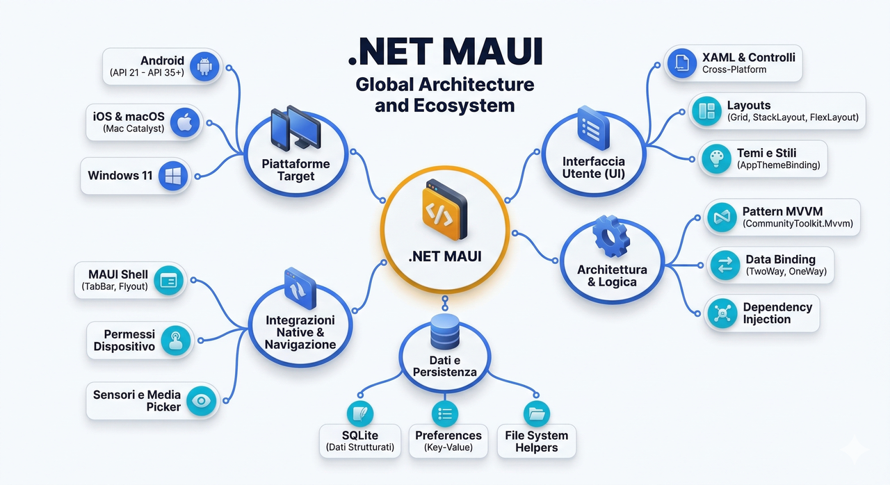
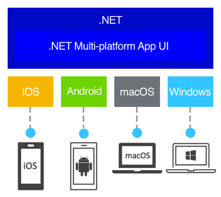
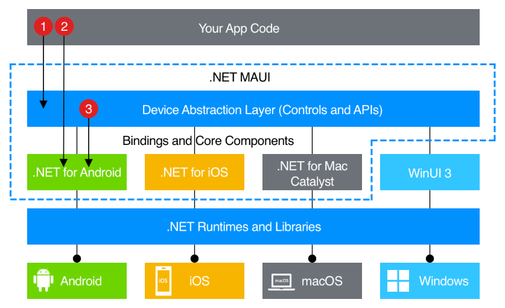

<style>
img {display: block; margin: 0 auto;}
</style>



## 1. Introduzione a .NET MAUI

### 1.1 Cos'è .NET MAUI



.NET MAUI (Multi-platform App UI) rappresenta l'evoluzione moderna del framework di sviluppo cross-platform di Microsoft, progettato per consentire la creazione di applicazioni native per Android, iOS, macOS e Windows utilizzando un singolo codebase condiviso. Questa piattaforma unifica le esperienze di sviluppo precedentemente separate di Xamarin.Forms, estendendole con miglioramenti significativi in termini di prestazioni, produttività e accessibilità alle API native. La filosofia alla base di MAUI è quella di massimizzare il riutilizzo del codice mantenendo al contempo la possibilità di accedere alle funzionalità specifiche di ogni piattaforma quando necessario.

L'architettura di .NET MAUI si basa su un singolo progetto condiviso che può essere compilato per diverse piattaforme target, eliminando la necessità di gestire progetti separati per ogni sistema operativo. Questo approccio semplifica notevolmente il ciclo di sviluppo e la manutenzione del software, riducendo i tempi di realizzazione e i costi associati. Inoltre, MAUI sfrutta le moderne funzionalità di .NET, inclusi i pattern asincroni, LINQ, e il supporto nativo per le architetture ARM64, garantendo prestazioni ottimali su tutti i dispositivi supportati.

### 1.2 Architettura e Principi Fondamentali



La struttura architetturale di .NET MAUI si articola su diversi livelli che separano le responsabilità e facilitano la manutenibilità del codice. Al livello inferiore si trovano i renderer specifici per piattaforma, che traducono i controlli astratti di MAUI nei controlli nativi corrispondenti su ogni sistema operativo. Questo meccanismo, noto come "controls mapping", garantisce che l'interfaccia utente abbia l'aspetto e il comportamento nativi attesi dagli utenti di ogni piattaforma.

Il livello intermedio contiene i controlli cross-platform, i layout e le pagine che costituiscono l'interfaccia utente condivisa. Questi elementi sono definiti in XAML o in codice C# e vengono istanziati in modo trasparente per lo sviluppatore. Il livello superiore ospita la logica applicativa, i servizi e i ViewModel secondo il pattern MVVM (Model-View-ViewModel), che costituisce il paradigma architetturale consigliato per le applicazioni MAUI.

Un aspetto fondamentale dell'architettura MAUI è il sistema di Dependency Injection integrato, che permette di registrare e risolvere servizi in modo trasparente e testabile. Questo facilita l'implementazione di architetture pulite e favorisce la separazione delle concerns, rendendo il codice più manutenibile e testabile.

### 1.3 Piattaforme Supportate

.NET MAUI supporta ufficialmente le seguenti piattaforme[^77]:

| Piattaforma | Versione Minima | Versione Target Consigliata | Note |
|-------------|-----------------|---------------------------|------|
| Android | API 21 (Android 5.0) | API 35 (Android 15) | Google Play richiede API 35+ dal 31/08/2025 |
| iOS | 12.2 | iOS 18 | Richiede macOS per compilazione |
| macOS | 12.0 (Monterey) | macOS 15 (Sequoia) | Supporto via Mac Catalyst |
| Windows | 10.0.17763.0 | Windows 11 | Windows 10 versione 1809+ |

**Nota importante su Android:** Google Play richiede che tutte le nuove app e gli aggiornamenti targettino almeno API level 35 (Android 15) dal 31 agosto 2025. Con .NET MAUI 9 e .NET MAUI 10 è possibile targettare API 35, mentre .NET MAUI 8 supporta fino a API 34. Per lo sviluppo di applicazioni destinate alla distribuzione su Google Play, è quindi consigliabile utilizzare .NET MAUI 10 con .NET 10 SDK.

Inoltre, dal 1° novembre 2025, Google Play richiede che tutte le app che targettano Android 15+ supportino la dimensione pagina di 16 KB sui dispositivi a 64-bit. .NET MAUI 10 include il supporto per questo requisito.

Per lo sviluppo di applicazioni Android, che costituisce il focus principale di questa guida, è necessario disporre del Android SDK e di un emulatore o dispositivo fisico per il testing. La configurazione di questi componenti viene gestita automaticamente dal processo di installazione di Visual Studio, semplificando notevolmente la fase iniziale di setup dell'ambiente.

**Video introduttivo consigliato:** [What is .NET MAUI?](https://youtu.be/Hh279ES_FNQ)[^1]

---

## 2. Installazione e Configurazione dell'Ambiente di Sviluppo

### 2.1 Requisiti di Sistema

Prima di procedere con l'installazione, è fondamentale verificare che il sistema in uso soddisfi i requisiti minimi richiesti per lo sviluppo con .NET MAUI. Per lo sviluppo su piattaforma Windows, è necessario disporre di Windows 10 versione 1809 o superiore (consigliato Windows 11), con almeno 8 GB di RAM (consigliati 16 GB per un'esperienza ottimale) e circa 25-30 GB di spazio disco disponibile per l'installazione completa di Visual Studio 2026 e dei relativi componenti.

Per lo sviluppo di applicazioni Android, requisito imprescindibile è il supporto alla virtualizzazione hardware, necessario per l'esecuzione dell'emulatore Android. È pertanto essenziale verificare che il processore supporti le estensioni di virtualizzazione (Intel VT-x o AMD-V) e che queste siano abilitate nel BIOS del sistema. In assenza di questa funzionalità, sarà comunque possibile sviluppare e testare le applicazioni utilizzando un dispositivo fisico Android connesso via USB.

**Requisiti per .NET MAUI 10 (.NET 10):**

| Componente | Requisito Minimo | Note |
|------------|------------------|------|
| .NET SDK | .NET 10.0 | Versione LTS fino a Novembre 2027 |
| Visual Studio | 2026 (17.14+) | Oppure VS Code con estensioni |
| Android SDK | API 35+ | Per targeting Android 15 |
| Xcode | 16+ (per iOS/macOS) | Solo su macOS |
| Windows SDK | 10.0.17763+ | Per sviluppo Windows |

### 2.2 Installazione con Visual Studio 2026

L'ambiente di sviluppo integrato consigliato per .NET MAUI su Windows è Visual Studio 2026, la versione più recente dell'IDE Microsoft che introduce un'integrazione profonda con l'AI tramite GitHub Copilot, prestazioni migliorate e un'interfaccia utente modernizzata. Visual Studio 2026 rappresenta un significativo salto in avanti rispetto alle versioni precedenti, con particolare attenzione allo sviluppo cross-platform.

**Documentazione ufficiale:** [Visual Studio 2026 Release Notes](https://learn.microsoft.com/en-us/visualstudio/releases/2026/release-notes)[^2]

**Tutorial ufficiale:** [.NET MAUI tutorial - Your first multi-platform app in C#](https://dotnet.microsoft.com/en-us/learn/maui/first-app-tutorial/intro)[^5]

Durante l'installazione, è necessario selezionare il workload denominato "Sviluppo di interfacce utente applicazioni multipiattaforma .NET" (in inglese ".NET Multi-platform App UI development"). Questo workload include automaticamente tutti i componenti necessari:

- .NET SDK 10 (versione LTS)
- Android SDK (API 35+)
- Android Emulator
- .NET MAUI templates
- XAML designer e Hot Reload
- GitHub Copilot integration (opzionale)

**Nota importante:** Visual Studio 2026 non include più la funzionalità Hot Restart per iOS, che permetteva di eseguire app iOS direttamente da Windows senza un Mac. Per lo sviluppo iOS è quindi necessario disporre di un Mac con Xcode installato per la compilazione e il testing, oppure utilizzare servizi di CI/CD cloud come GitHub Actions o Azure DevOps.

La fase di installazione può richiedere tempi significativi, tipicamente tra i 30 e i 90 minuti a seconda della velocità della connessione internet e delle prestazioni del sistema. Al termine dell'installazione, Visual Studio proporrà una verifica automatica dell'ambiente, segnalando eventuali problematiche o componenti mancanti.

### 2.3 Installazione con Visual Studio Code

Per gli sviluppatori che preferiscono un ambiente più leggero o che lavorano su macOS, è possibile utilizzare Visual Studio Code con l'estensione ufficiale .NET MAUI. Questa configurazione richiede un setup manuale più articolato rispetto a Visual Studio completo, ma offre maggiore flessibilità e minori requisiti di sistema.

**Documentazione ufficiale:** [Build your first .NET MAUI app - Visual Studio Code](https://learn.microsoft.com/en-us/dotnet/maui/get-started/first-app?tabs=visual-studio-code)[^3]

I passaggi fondamentali per la configurazione su Visual Studio Code includono:

1. Installazione di .NET SDK 10.0 (versione LTS)
2. Installazione di Visual Studio Code (versione più recente)
3. Installazione dell'estensione "C# Dev Kit"
4. Installazione dell'estensione ".NET MAUI" dal marketplace
5. Configurazione del Android SDK (per sviluppo Android)
6. Installazione di Xcode 16+ su macOS (per sviluppo iOS/macOS)

L'estensione .NET MAUI per VS Code richiede:

- L'ultima versione supportata del .NET SDK con il workload MAUI
- L'estensione C# Dev Kit attivata con una licenza Visual Studio o IntelliCode valida

Per macOS, è disponibile una guida specifica che illustra la configurazione completa dell'ambiente: [Visual Studio Code for Mac Setup](https://youtu.be/1t2zzoW4D98)[^4]

**Marketplace:** [.NET MAUI extension for VS Code](https://marketplace.visualstudio.com/items?itemName=ms-dotnettools.dotnet-maui)[^76]

### 2.4 Verifica dell'Installazione

Una volta completata l'installazione, è consigliabile verificare che tutti i componenti siano correttamente configurati creando un primo progetto di test. Da Visual Studio 2026, selezionare "Crea un nuovo progetto" e cercare il template ".NET MAUI App". La compilazione e l'esecuzione di questo progetto vuoto permetterà di verificare che l'emulatore Android sia funzionante e che tutti i componenti siano correttamente installati.

Da riga di comando, è possibile verificare l'installazione del .NET SDK e dei workload MAUI tramite i seguenti comandi:

```bash
# Verificare la versione del .NET SDK
dotnet --version

# Elencare i workload installati
dotnet workload list

# Verificare la versione di MAUI
dotnet workload maui --version
```

L'output dovrebbe mostrare la versione 10.x del SDK e l'elenco dei workload, tra cui deve comparire `maui` o `maui-android`. Per un progetto .NET MAUI 10, l'output di `dotnet --version` dovrebbe indicare una versione 10.x.x.

**Risoluzione problemi comuni:**

Se si riscontrano problemi con l'installazione dei workload MAUI, è possibile reinstallarli con:

```bash
# Installare il workload MAUI
dotnet workload install maui

# Aggiornare i workload esistenti
dotnet workload update

# Riparare l'installazione
dotnet workload repair
```

---

## 3. Creazione della Prima Applicazione

**Elenco completo di tutorial e risorse ufficiali per iniziare lo sviluppo di un'applicazione .NET MAUI:**
[Build mobile and desktop apps with .NET MAUI](https://learn.microsoft.com/en-us/training/paths/build-apps-with-dotnet-maui/)[^80]

### 3.1 Struttura di un Progetto MAUI

Un progetto .NET MAUI tipico presenta una struttura ben definita che separa chiaramente il codice condiviso dalle risorse specifiche per piattaforma. La cartella principale del progetto contiene i file di codice e le risorse condivise, mentre la sottocartella `Platforms` ospita il codice e le configurazioni specifiche per ogni sistema operativo target.

**Tutorial ufficiale:** [Build your first .NET MAUI app](https://dotnet.microsoft.com/it-it/learn/maui/first-app-tutorial/intro)[^5]

**Guida completa alla creazione di un progetto:** [Create your first .NET MAUI app](https://learn.microsoft.com/en-us/training/modules/build-mobile-and-desktop-apps/)[^79]

La struttura tipica di un progetto MAUI è la seguente:

```text
MyMauiApp/
├── Platforms/
│   ├── Android/
│   │   ├── AndroidManifest.xml
│   │   ├── MainApplication.cs
│   │   └── MainActivity.cs
│   ├── iOS/
│   │   ├── Info.plist
│   │   └── AppDelegate.cs
│   ├── MacCatalyst/
│   └── Windows/
├── Resources/
│   ├── AppIcon/
│   ├── Fonts/
│   ├── Images/
│   ├── Raw/
│   └── Styles/
├── MauiProgram.cs
├── App.xaml
├── App.xaml.cs
├── AppShell.xaml
├── AppShell.xaml.cs
├── MainPage.xaml
├── MainPage.xaml.cs
└── MyMauiApp.csproj
```

Il file `MauiProgram.cs` costituisce il punto di ingresso dell'applicazione e definisce la configurazione dei servizi tramite il pattern di Dependency Injection integrato.

### 3.2 Il File MauiProgram.cs

Il file `MauiProgram.cs` rappresenta il cuore della configurazione di un'applicazione MAUI. Al suo interno viene definito il contenitore dei servizi e vengono registrati tutti i componenti necessari al funzionamento dell'applicazione, inclusi i ViewModel, i servizi di persistenza, e le estensioni specifiche.

```csharp
namespace MyMauiApp;

public static class MauiProgram
{
    public static MauiApp CreateMauiApp()
    {
        var builder = MauiApp.CreateBuilder();
        builder
            .UseMauiApp<App>()
            .ConfigureFonts(fonts =>
            {
                fonts.AddFont("OpenSans-Regular.ttf", "OpenSansRegular");
                fonts.AddFont("OpenSans-Semibold.ttf", "OpenSansSemibold");
            });

        // Registrazione dei servizi
        // builder.Services.AddSingleton<IYourService, YourService>();

        return builder.Build();
    }
}
```

Il metodo `UseMauiApp<App>()` specifica la classe che rappresenta l'applicazione principale, derivata da `Application`. Il metodo `ConfigureFonts` permette di registrare i font personalizzati che verranno utilizzati nell'applicazione.

### 3.3 Il File App.xaml e App.xaml.cs

Il file `App.xaml` definisce le risorse globali dell'applicazione, inclusi gli stili, i colori e i template che verranno utilizzati in tutta l'interfaccia utente. Il code-behind `App.xaml.cs` contiene la logica di inizializzazione e definisce la pagina principale dell'applicazione.

```xml
<?xml version="1.0" encoding="UTF-8" ?>
<Application xmlns="http://schemas.microsoft.com/dotnet/2021/maui"
             xmlns:x="http://schemas.microsoft.com/winfx/2009/xaml"
             x:Class="MyMauiApp.App">
    <Application.Resources>
        <ResourceDictionary>
            <Color x:Key="Primary">#512BD4</Color>
            <Color x:Key="Secondary">#DFD8F7</Color>
            <Color x:Key="Tertiary">#2B0B98</Color>
        </ResourceDictionary>
    </Application.Resources>
</Application>
```

Il code-behind corrispondente:

```csharp
namespace MyMauiApp;

public partial class App : Application
{
    public App()
    {
        InitializeComponent();
    }

    protected override Window CreateWindow(IActivationState? activationState)
    {
        return new Window(new AppShell());
    }
}
```

### 3.4 Esecuzione dell'Applicazione

Per eseguire l'applicazione su un emulatore Android, è necessario selezionare il target appropriato dalla barra degli strumenti di Visual Studio e premere F5 o il pulsante di avvio debug. La prima esecuzione richiederà un tempo maggiore per l'avvio dell'emulatore e la distribuzione dell'applicazione, mentre le esecuzioni successive saranno significativamente più rapide grazie al meccanismo di Hot Reload.

**Video tutorial:** [.NET MAUI For Beginners - Video Series](https://youtube.com/playlist?list=PLdo4fOcmZ0oUBAdL2NwBpDs32zwGqb9DY)[^6]

L'Hot Reload permette di modificare il codice XAML e vedere le modifiche applicate in tempo reale sull'emulatore senza necessità di ricompilare l'intera applicazione. Questa funzionalità è particolarmente utile durante la fase di sviluppo dell'interfaccia utente, poiché consente iterazioni rapide e un feedback immediato sulle modifiche apportate.

---

## 4. XAML e Interfaccia Utente

### 4.1 Introduzione a XAML

XAML (eXtensible Application Markup Language) è un linguaggio di markup dichiarativo utilizzato in .NET MAUI per definire l'interfaccia utente delle applicazioni. Questo approccio separa chiaramente la definizione visiva dell'interfaccia dalla logica applicativa contenuta nel code-behind, facilitando la manutenibilità del codice e favorendo il lavoro collaborativo tra designer e sviluppatori.

**Documentazione ufficiale:** [Create a user interface in XAML](https://learn.microsoft.com/en-us/training/modules/create-user-interface-xaml/)[^7]

La sintassi XAML si basa su elementi XML che rappresentano controlli, layout e risorse. Ogni elemento XAML corrisponde a una classe .NET, e gli attributi XML vengono mappati sulle proprietà di tali classi. Il namespace principale per i controlli MAUI è `http://schemas.microsoft.com/dotnet/2021/maui`, che deve essere dichiarato come namespace predefinito in ogni file XAML.

Un esempio di pagina XAML semplice:

```xml
<?xml version="1.0" encoding="utf-8" ?>
<ContentPage xmlns="http://schemas.microsoft.com/dotnet/2021/maui"
             xmlns:x="http://schemas.microsoft.com/winfx/2009/xaml"
             x:Class="MyMauiApp.MainPage"
             Title="Home">
    <VerticalStackLayout>
        <Label Text="Benvenuto in .NET MAUI!"
               SemanticProperties.HeadingLevel="Level1"
               FontSize="18"
               HorizontalOptions="Center" />
        <Button Text="Clicca qui"
                HorizontalOptions="Center"
                Clicked="OnButtonClicked" />
    </VerticalStackLayout>
</ContentPage>
```

### 4.2 Proprietà e Eventi

In XAML, le proprietà dei controlli possono essere impostate tramite attributi o tramite sintassi di elemento proprietà. La scelta tra le due forme dipende dalla complessità del valore da assegnare e dalle preferenze stilistiche dello sviluppatore. Per i valori semplici come stringhe o numeri, la forma attributo è generalmente preferita per la sua concisione.

La sintassi di elemento proprietà viene utilizzata quando il valore di una proprietà è un oggetto complesso che richiede una definizione estesa. Ad esempio, per impostare una proprietà di tipo `Color` con valori RGBA specifici:

```xml
<Label>
    <Label.TextColor>
        <Color>
            <x:Arguments>
                <x:Double>0.5</x:Double>
                <x:Double>0.3</x:Double>
                <x:Double>0.8</x:Double>
                <x:Double>1.0</x:Double>
            </x:Arguments>
        </Color>
    </Label.TextColor>
</Label>
```

Gli eventi possono essere collegati a gestori di eventi definiti nel code-behind utilizzando la sintassi dell'attributo con il nome dell'evento:

```xml
<Button Text="Invia" Clicked="OnSendClicked" />
```

Nel file code-behind corrispondente:

```csharp
private void OnSendClicked(object sender, EventArgs e)
{
    // Logica di gestione dell'evento
}
```

### 4.3 Markup Extensions

Le markup extensions sono costrutti speciali che permettono di estendere le capacità di XAML oltre la semplice assegnazione di valori statici. Queste estensioni sono racchiuse tra parentesi graffe e permettono operazioni come il data binding, il riferimento a risorse, e la conversione di tipi.

Le markup extensions più comunemente utilizzate in MAUI includono:

- **StaticResource**: recupera un valore da un dizionario di risorse
- **DynamicResource**: simile a StaticResource ma risponde ai cambiamenti a runtime
- **Binding**: stabilisce un collegamento tra una proprietà del controllo e una proprietà di un oggetto dati
- **x:Static**: fa riferimento a una proprietà o campo statico
- **OnPlatform**: fornisce valori diversi in base alla piattaforma

Esempio di utilizzo di `StaticResource`:

```xml
<Label Text="Titolo"
       TextColor="{StaticResource Primary}"
       FontSize="{StaticResource TitleFontSize}" />
```

Esempio di utilizzo di `OnPlatform` per valori specifici per piattaforma:

```xml
<BoxView WidthRequest="{OnPlatform 300, iOS=250, Android=350}" />
```

**Documentazione di riferimento:** [Customize XAML pages and layout](https://learn.microsoft.com/en-us/training/modules/customize-xaml-pages-layout/)[^8]

### 4.4 Risorse e Dizionari di Risorse

Le risorse in MAUI sono oggetti riutilizzabili che vengono memorizzati in un dizionario e possono essere referenziati da qualsiasi elemento dell'interfaccia. L'utilizzo di risorse centralizzate promuove la coerenza visiva dell'applicazione e semplifica la manutenzione, poiché una modifica al valore della risorsa si propaga automaticamente a tutti i riferimenti.

Le risorse possono essere definite a diversi livelli della gerarchia di controlli:

1. **Risorse a livello di applicazione** (App.xaml): disponibili in tutta l'applicazione
2. **Risorse a livello di pagina**: disponibili solo nella pagina in cui sono definite
3. **Risorse a livello di controllo**: disponibili solo per il controllo e i suoi figli

Esempio di dizionario di risorse a livello di pagina:

```xml
<ContentPage.Resources>
    <ResourceDictionary>
        <Color x:Key="PageBackgroundColor">#FAFAFA</Color>
        <Color x:Key="TextColor">#1C1C1E</Color>
        <x:Double x:Key="DefaultFontSize">16</x:Double>
        
        <Style x:Key="BaseLabelStyle" TargetType="Label">
            <Setter Property="TextColor" Value="{StaticResource TextColor}"/>
            <Setter Property="FontSize" Value="{StaticResource DefaultFontSize}"/>
        </Style>
    </ResourceDictionary>
</ContentPage.Resources>
```

**Documentazione ufficiale:** [Use shared resources](https://learn.microsoft.com/en-us/training/modules/use-shared-resources/)[^9]

---

## 5. Layout e Controlli

### 5.1 Panoramica dei Layout

I layout in .NET MAUI sono contenitori specializzati che organizzano la posizione e le dimensioni dei controlli figli. La scelta del layout appropriato è fondamentale per creare interfacce utente responsive e adattabili a diverse dimensioni di schermo. MAUI offre diversi tipi di layout, ognuno ottimizzato per specifici scenari di disposizione degli elementi.

**Documentazione ufficiale:** [Layouts in .NET MAUI](https://learn.microsoft.com/en-us/dotnet/maui/user-interface/layouts)[^10]

I layout principali disponibili in MAUI sono:

| Layout | Descrizione | Caso d'uso tipico |
|--------|-------------|-------------------|
| `StackLayout` | Dispone gli elementi in una pila orizzontale o verticale | Liste di elementi sequenziali |
| `VerticalStackLayout` | Ottimizzato per pile verticali | Form, liste verticali |
| `HorizontalStackLayout` | Ottimizzato per pile orizzontali | Toolbar, menu orizzontali |
| `Grid` | Dispone gli elementi in righe e colonne | Layout complessi, form strutturati |
| `AbsoluteLayout` | Posiziona elementi con coordinate assolute | Overlay, elementi posizionati con precisione |
| `FlexLayout` | Layout flessibile simile a CSS Flexbox | Layout responsivi complessi |

### 5.2 StackLayout, VerticalStackLayout e HorizontalStackLayout

`StackLayout` è il layout più semplice e comunemente utilizzato, che dispone i figli in sequenza orizzontale o verticale in base alla proprietà `Orientation`. Le versioni specializzate `VerticalStackLayout` e `HorizontalStackLayout` offrono prestazioni migliori quando la direzione è nota a compile-time.

Esempio di `VerticalStackLayout`:

```xml
<VerticalStackLayout Spacing="10" Padding="20">
    <Label Text="Nome:" FontAttributes="Bold"/>
    <Entry Placeholder="Inserisci il nome" />
    <Label Text="Email:" FontAttributes="Bold"/>
    <Entry Placeholder="Inserisci l'email" Keyboard="Email" />
    <Button Text="Salva" HorizontalOptions="Center" />
</VerticalStackLayout>
```

La proprietà `Spacing` definisce la distanza tra gli elementi adiacenti, mentre `Padding` definisce la distanza tra i bordi del layout e i suoi contenuti. La proprietà `HorizontalOptions` controlla l'allineamento orizzontale dell'elemento all'interno dello spazio disponibile.

**Esempi completi:** [Layout samples on GitHub](https://github.com/dotnet/maui-samples/tree/main/10.0/UserInterface/Layouts)[^11]

### 5.3 Grid

Il layout `Grid` è il più versatile e permette di organizzare gli elementi in una struttura tabellare di righe e colonne. A differenza delle tabelle HTML, le celle di una Grid possono contenere più elementi e possono estendersi su più righe o colonne.

La definizione delle righe e delle colonne avviene tramite le proprietà `RowDefinitions` e `ColumnDefinitions`, che accettano una lista di valori di dimensione. I valori possono essere assoluti (in unità indipendenti dal dispositivo), automatici (si adattano al contenuto), o proporzionali (usando la notazione `*`).

```xml
<Grid RowDefinitions="Auto, *, Auto"
      ColumnDefinitions="*, *"
      RowSpacing="10"
      ColumnSpacing="10">
    <Label Grid.Row="0" Grid.Column="0" Grid.ColumnSpan="2"
           Text="Titolo dell'App"
           FontSize="24"
           HorizontalOptions="Center"/>
    
    <Entry Grid.Row="1" Grid.Column="0"
           Placeholder="Username"/>
    <Entry Grid.Row="1" Grid.Column="1"
           Placeholder="Password" IsPassword="True"/>
    
    <Button Grid.Row="2" Grid.Column="0" Grid.ColumnSpan="2"
            Text="Accedi"
            HorizontalOptions="Center"/>
</Grid>
```

Le proprietà associate `Grid.Row`, `Grid.Column`, `Grid.RowSpan`, e `Grid.ColumnSpan` permettono di posizionare gli elementi all'interno della griglia. L'indice di riga e colonna parte da 0.

**Documentazione ufficiale:** [Grid layout](https://learn.microsoft.com/en-us/dotnet/maui/user-interface/layouts/grid)[^12]

Un esempio pratico di utilizzo del Grid è rappresentato dalla calcolatrice standard, il cui layout è disponibile nel repository ufficiale: [Calculator Example](https://github.com/dotnet/maui-samples/blob/main/10.0/UserInterface/Layouts/GridDemos/GridDemos/Views/XAML/CalculatorPage.xaml)[^13]

### 5.4 AbsoluteLayout e FlexLayout

`AbsoluteLayout` posiziona gli elementi figli utilizzando coordinate assolute relative al contenitore. Questo layout è particolarmente utile per creare overlay, badge, o quando è necessario un controllo preciso sulla posizione degli elementi. La posizione e le dimensioni vengono specificate tramite le proprietà associate `LayoutBounds` e `LayoutFlags`.

```xml
<AbsoluteLayout>
    <BoxView Color="LightBlue"
             AbsoluteLayout.LayoutBounds="0,0,1,1"
             AbsoluteLayout.LayoutFlags="All" />
    <Label Text="Centrato"
           AbsoluteLayout.LayoutBounds="0.5,0.5,-1,-1"
           AbsoluteLayout.LayoutFlags="PositionProportional" />
</AbsoluteLayout>
```

`FlexLayout` offre un modello di layout simile a CSS Flexbox, con supporto per wrapping, allineamento complesso, e adattamento dinamico. Questo layout è ideale per interfacce responsive che devono adattarsi a diverse dimensioni di schermo.

```xml
<FlexLayout Direction="Row"
            Wrap="Wrap"
            JustifyContent="SpaceEvenly"
            AlignItems="Center">
    <Button Text="1" WidthRequest="80" />
    <Button Text="2" WidthRequest="80" />
    <Button Text="3" WidthRequest="80" />
    <Button Text="4" WidthRequest="80" />
    <Button Text="5" WidthRequest="80" />
</FlexLayout>
```

**Documentazione ufficiale:** [AbsoluteLayout](https://learn.microsoft.com/en-us/dotnet/maui/user-interface/layouts/absolutelayout)[^14] | [FlexLayout](https://learn.microsoft.com/en-us/dotnet/maui/user-interface/layouts/flexlayout)[^15]

### 5.5 Controlli Principali

.NET MAUI offre una vasta gamma di controlli per la costruzione dell'interfaccia utente. I controlli più comunemente utilizzati includono:

**Controlli di input:**
- `Entry`: campo di testo a riga singola
- `Editor`: campo di testo multilinea
- `Picker`: selezione da un elenco a discesa
- `DatePicker` e `TimePicker`: selezione di data e ora
- `CheckBox`: casella di controllo
- `RadioButton`: pulsante di opzione
- `Slider` e `Stepper`: input numerico mediante controlli

**Controlli di visualizzazione:**
- `Label`: visualizzazione di testo
- `Image`: visualizzazione di immagini
- `BoxView`: rettangolo colorato per decorazioni
- `WebView`: visualizzazione di contenuti web

**Controlli di azione:**
- `Button`: pulsante standard
- `ImageButton`: pulsante con immagine
- `SwipeView`: contenitore con azioni swipe

**Controlli di lista:**
- `CollectionView`: lista virtuale ad alte prestazioni
- `CarouselView`: lista a scorrimento orizzontale

---

## 6. Navigazione con Shell

### 6.1 Introduzione alla Shell

La Shell è un contenitore specializzato introdotto in .NET MAUI che semplifica significativamente la gestione della navigazione e della struttura visiva dell'applicazione. Fornisce un'architettura unificata per implementare pattern di navigazione comuni come tab bar, flyout menu (hamburger menu), e navigazione gerarchica, riducendo la complessità del codice necessario rispetto alle soluzioni precedenti.

**Documentazione ufficiale:** [Shell in .NET MAUI](https://learn.microsoft.com/en-us/dotnet/maui/fundamentals/shell)[^16]

L'utilizzo della Shell è fortemente consigliato per nuove applicazioni MAUI, in quanto offre diversi vantaggi:

- Navigazione basata su URI con supporto per parametri
- Gestione automatica della cronologia di navigazione
- Integrazione nativa con la barra di ricerca
- Supporto integrato per tab bar e flyout menu
- Ottimizzazione del consumo di memoria

### 6.2 Struttura della Shell

La definizione della struttura di navigazione avviene nel file `AppShell.xaml`. La Shell supporta due tipi principali di contenitore visivo: `FlyoutItem` per il menu laterale e `TabBar` per la barra delle tab inferiori. È possibile combinare entrambi gli approcci nella stessa applicazione.

Esempio di configurazione con `TabBar`:

```xml
<?xml version="1.0" encoding="UTF-8" ?>
<Shell x:Class="MyApp.AppShell"
       xmlns="http://schemas.microsoft.com/dotnet/2021/maui"
       xmlns:x="http://schemas.microsoft.com/winfx/2009/xaml"
       xmlns:local="clr-namespace:MyApp"
       Shell.FlyoutBehavior="Disabled">
    
    <Shell.Resources>
        <ResourceDictionary>
            <Style TargetType="TabBar" x:Key="CustomTabBarStyle">
                <Setter Property="Shell.TabBarBackgroundColor" Value="CornflowerBlue"/>
                <Setter Property="Shell.TabBarTitleColor" Value="White"/>
                <Setter Property="Shell.TabBarUnselectedColor" Value="LightGray"/>
            </Style>
        </ResourceDictionary>
    </Shell.Resources>
    
    <TabBar Style="{StaticResource CustomTabBarStyle}">
        <Tab Title="Home" Icon="home">
            <ShellContent Title="Home"
                          ContentTemplate="{DataTemplate local:HomePage}"
                          Route="HomePage"/>
        </Tab>
        <Tab Title="Impostazioni" Icon="settings">
            <ShellContent Title="Impostazioni"
                          ContentTemplate="{DataTemplate local:SettingsPage}"
                          Route="SettingsPage"/>
        </Tab>
    </TabBar>
</Shell>
```

### 6.3 Navigazione Programmatica

La navigazione tra le pagine avviene principalmente tramite il metodo `GoToAsync` della classe `Shell`. Questo metodo accetta una stringa di route o un URI e gestisce automaticamente la cronologia di navigazione. Le route devono essere registrate preventivamente tramite il metodo `Routing.RegisterRoute`.

```csharp
// Navigazione verso una pagina
await Shell.Current.GoToAsync("DetailsPage");

// Navigazione indietro
await Shell.Current.GoToAsync("..");

// Navigazione con parametri
await Shell.Current.GoToAsync($"DetailsPage?id={itemId}");

// Navigazione con query parameters
var navigationParameters = new Dictionary<string, object>
{
    { "id", itemId },
    { "name", itemName }
};
await Shell.Current.GoToAsync("DetailsPage", navigationParameters);
```

La registrazione delle route avviene tipicamente nel costruttore di `AppShell.xaml.cs`:

```csharp
public partial class AppShell : Shell
{
    public AppShell()
    {
        InitializeComponent();
        Routing.RegisterRoute("DetailsPage", typeof(DetailsPage));
        Routing.RegisterRoute("SettingsPage", typeof(SettingsPage));
    }
}
```

È importante notare che, come evidenziato nella documentazione ufficiale Microsoft, l'utilizzo di `Navigation.PushAsync` è derivato da Xamarin.Forms e non è il metodo consigliato in contesto Shell. La documentazione ufficiale raccomanda l'utilizzo di `GoToAsync` per tutte le operazioni di navigazione.

**Discussione tecnica:** [StackOverflow - GoToAsync vs PushAsync](https://stackoverflow.com/a/75026409)[^17]

### 6.4 Flyout Menu

Il flyout menu (o menu hamburger) fornisce accesso rapido a diverse sezioni dell'applicazione tramite un menu laterale che può essere aperto tramite un gesto di swipe o toccando l'icona del menu.

```xml
<Shell x:Class="MyApp.AppShell"
       xmlns="http://schemas.microsoft.com/dotnet/2021/maui"
       xmlns:x="http://schemas.microsoft.com/winfx/2009/xaml"
       xmlns:local="clr-namespace:MyApp">
    
    <FlyoutItem Title="Home" Icon="home.png">
        <ShellContent ContentTemplate="{DataTemplate local:HomePage}" />
    </FlyoutItem>
    
    <FlyoutItem Title="Profilo" Icon="user.png">
        <ShellContent ContentTemplate="{DataTemplate local:ProfilePage}" />
    </FlyoutItem>
    
    <FlyoutItem Title="Impostazioni" Icon="settings.png">
        <ShellContent ContentTemplate="{DataTemplate local:SettingsPage}" />
    </FlyoutItem>
    
</Shell>
```

**Esempio completo:** [ShellFlyoutSample on GitHub](https://github.com/GreppiDev/Info4IA2425MAUI/tree/main/Navigation/ShellFlyoutSample)[^18]

### 6.5 Combinazione di Flyout e Tab

È possibile combinare flyout menu e tab bar nella stessa applicazione per creare pattern di navigazione complessi. Ogni `FlyoutItem` può contenere una `TabBar` con multiple tab.

```xml
<Shell x:Class="MyApp.AppShell"
       xmlns="http://schemas.microsoft.com/dotnet/2021/maui"
       xmlns:x="http://schemas.microsoft.com/winfx/2009/xaml"
       xmlns:local="clr-namespace:MyApp">
    
    <FlyoutItem Title="Principale" Icon="main.png">
        <Tab Title="Home">
            <ShellContent ContentTemplate="{DataTemplate local:HomePage}" />
        </Tab>
        <Tab Title="Preferiti">
            <ShellContent ContentTemplate="{DataTemplate local:FavoritesPage}" />
        </Tab>
    </FlyoutItem>
    
    <FlyoutItem Title="Altro" Icon="more.png">
        <ShellContent ContentTemplate="{DataTemplate local:MorePage}" />
    </FlyoutItem>
    
</Shell>
```

**Esempio completo:** [ShellMixedSample on GitHub](https://github.com/GreppiDev/Info4IA2425MAUI/tree/main/Navigation/ShellMixedSample)[^19]

### 6.6 Personalizzazione dell'Aspetto

La Shell offre numerose proprietà per personalizzare l'aspetto della tab bar, del flyout menu e della barra di navigazione. Queste proprietà possono essere impostate come stili o direttamente sui singoli elementi.

```xml
<Shell.Resources>
    <ResourceDictionary>
        <Style TargetType="TabBar">
            <Setter Property="Shell.TabBarBackgroundColor" Value="#2196F3"/>
            <Setter Property="Shell.TabBarTitleColor" Value="White"/>
            <Setter Property="Shell.TabBarUnselectedColor" Value="#BBDEFB"/>
            <Setter Property="Shell.TabBarForegroundColor" Value="White"/>
        </Style>
        
        <Style TargetType="FlyoutItem">
            <Setter Property="Shell.FlyoutItemLabelColor" Value="#333333"/>
            <Setter Property="Shell.FlyoutItemIconColor" Value="#2196F3"/>
        </Style>
    </ResourceDictionary>
</Shell.Resources>
```

Per la personalizzazione della Title Bar su Windows, è disponibile una guida specifica: [Customize the Title Bar](https://blog.ewers-peters.de/customize-the-title-bar-of-a-maui-app-with-these-simple-steps)[^20]

**Documentazione ufficiale:** [Shell Flyout](https://learn.microsoft.com/en-us/dotnet/maui/fundamentals/shell/flyout)[^21]

---

## 7. Data Binding e Pattern MVVM

### 7.1 Concetti Fondamentali del Data Binding

Il data binding è il meccanismo che permette di collegare le proprietà dei controlli dell'interfaccia utente alle proprietà degli oggetti dati, in modo che le modifiche a una parte si riflettano automaticamente sull'altra. Questo meccanismo è fondamentale per implementare il pattern MVVM e per creare applicazioni con un'architettura pulita e manutenibile.

**Documentazione ufficiale:** [Data Binding Basics](https://learn.microsoft.com/en-us/dotnet/maui/xaml/fundamentals/data-binding-basics)[^22]

Il data binding in MAUI si basa sull'interfaccia `INotifyPropertyChanged`, che notifica ai listener quando il valore di una proprietà cambia. Quando una proprietà del ViewModel implementa questa interfaccia, il sistema di binding può aggiornare automaticamente i controlli associati.

La sintassi base per il data binding utilizza la markup extension `Binding`:

```xml
<Label Text="{Binding Title}" />
<Entry Text="{Binding Username, Mode=TwoWay}" />
<Image Source="{Binding ProfileImage}" />
```

### 7.2 Modalità di Binding

Il data binding supporta diverse modalità che determinano la direzione del flusso di dati:

| Modalità | Descrizione |
|----------|-------------|
| `OneWay` | Le modifiche alla proprietà sorgente aggiornano il target (default per la maggior parte delle proprietà) |
| `TwoWay` | Le modifiche viaggiano in entrambe le direzioni |
| `OneWayToSource` | Le modifiche al target aggiornano la sorgente |
| `OneTime` | Il binding avviene solo all'inizializzazione |

La scelta della modalità appropriata dipende dal contesto: per i controlli di input come `Entry`, la modalità `TwoWay` è tipicamente necessaria per permettere all'utente di modificare il valore.

### 7.3 Il Pattern MVVM

MVVM (Model-View-ViewModel) è il pattern architetturale consigliato per le applicazioni MAUI. Questo pattern separa chiaramente tre componenti:

- **Model**: rappresenta i dati e la logica di business
- **View**: l'interfaccia utente definita in XAML
- **ViewModel**: mediatore tra Model e View che espone proprietà e comandi

Questa separazione offre numerosi vantaggi, tra cui la testabilità del codice, la possibilità di lavorare parallelamente su UI e logica, e la facilità di manutenzione.

**Documentazione ufficiale:** [Data Binding and MVVM](https://learn.microsoft.com/en-us/dotnet/maui/xaml/fundamentals/mvvm)[^23]

Un ViewModel base implementa `INotifyPropertyChanged`:

```csharp
public class MainViewModel : INotifyPropertyChanged
{
    private string _title;
    public string Title
    {
        get => _title;
        set
        {
            if (_title != value)
            {
                _title = value;
                OnPropertyChanged();
            }
        }
    }

    public event PropertyChangedEventHandler PropertyChanged;

    protected virtual void OnPropertyChanged([CallerMemberName] string propertyName = null)
    {
        PropertyChanged?.Invoke(this, new PropertyChangedEventArgs(propertyName));
    }
}
```

### 7.4 CommunityToolkit.Mvvm

Il CommunityToolkit.Mvvm semplifica notevolmente l'implementazione del pattern MVVM fornendo attributi che generano automaticamente il codice boilerplate. Questo toolkit è diventato lo standard de facto per lo sviluppo MAUI grazie alla sua efficienza e semplicità d'uso.

**Documentazione ufficiale:** [MVVM Community Toolkit](https://learn.microsoft.com/en-us/dotnet/communitytoolkit/mvvm/)[^24]

Utilizzando il toolkit, un ViewModel diventa notevolmente più conciso:

```csharp
using CommunityToolkit.Mvvm.ComponentModel;
using CommunityToolkit.Mvvm.Input;

public partial class MainViewModel : ObservableObject
{
    [ObservableProperty]
    private string title = "Benvenuto";
    
    [ObservableProperty]
    private string username;
    
    [RelayCommand]
    private async Task SubmitAsync()
    {
        // Logica del comando
        await Task.Delay(1000);
        Title = $"Ciao, {Username}!";
    }
}
```

L'attributo `[ObservableProperty]` genera automaticamente la proprietà pubblica con la notifica di cambio, mentre `[RelayCommand]` genera un'implementazione di `ICommand` che può essere collegata ai controlli dell'interfaccia.

In XAML:

```xml
<ContentPage xmlns:vm="clr-namespace:MyApp.ViewModels"
             x:DataType="vm:MainViewModel">
    <VerticalStackLayout>
        <Label Text="{Binding Title}" FontSize="24"/>
        <Entry Text="{Binding Username, Mode=TwoWay}" Placeholder="Nome utente"/>
        <Button Text="Invia" Command="{Binding SubmitCommand}"/>
    </VerticalStackLayout>
</ContentPage>
```

**Esempi completi:** [CommunityToolkit MVVM Demos](https://github.com/GreppiDev/Info4IA2223MAUI/tree/main/DataBinding/CommunityTolkitMVVMDemos)[^25]

### 7.5 CollectionView e Data Binding

La `CollectionView` è il controllo ottimizzato per visualizzare liste di dati in MAUI. Supporta virtualizzazione, raggruppamento, e layout orizzontale o verticale.

```xml
<CollectionView ItemsSource="{Binding Items}"
                SelectionMode="Single"
                SelectedItem="{Binding SelectedItem, Mode=TwoWay}">
    <CollectionView.ItemTemplate>
        <DataTemplate x:DataType="model:Item">
            <Grid Padding="10">
                <Label Text="{Binding Name}" FontSize="16"/>
                <Label Text="{Binding Description}" FontSize="12" TextColor="Gray"/>
            </Grid>
        </DataTemplate>
    </CollectionView.ItemTemplate>
</CollectionView>
```

L'attributo `x:DataType` è importante per le performance: permette la compilazione dei binding a compile-time, rilevando errori prima dell'esecuzione e migliorando le prestazioni a runtime.

**Documentazione:** [CollectionView](https://learn.microsoft.com/en-us/dotnet/maui/user-interface/controls/collectionview)[^26]

---

## 8. Persistenza dei Dati

### 8.1 Opzioni di Persistenza in MAUI

Le applicazioni mobili hanno frequentemente la necessità di memorizzare dati in modo persistente sul dispositivo. .NET MAUI offre diverse opzioni per la persistenza dei dati, ognuna ottimizzata per specifici scenari d'uso.

**Documentazione ufficiale:** [Compare storage options](https://learn.microsoft.com/en-us/training/modules/store-local-data/2-compare-storage-options)[^27]

Le principali opzioni disponibili sono:

| Opzione | Caso d'uso | Persistenza |
|---------|------------|-------------|
| Preferences | Impostazioni utente, piccoli valori | Key-Value |
| File System | File generici, documenti | File |
| SQLite | Dati strutturati, relazioni | Database |
| LiteDB | Dati NoSQL, documenti | Database |

### 8.2 Preferences

Le Preferences permettono di memorizzare piccole quantità di dati in formato key-value. Questo meccanismo è ideale per impostazioni utente, preferenze dell'applicazione, e altri dati semplici che devono persistere tra le sessioni.

**Documentazione ufficiale:** [Preferences](https://learn.microsoft.com/en-us/dotnet/maui/platform-integration/storage/preferences)[^28]

```csharp
// Salvataggio di una preferenza
Preferences.Set("username", "mario_rossi");
Preferences.Set("notifications_enabled", true);
Preferences.Set("theme", "dark");

// Lettura di una preferenza
string username = Preferences.Get("username", "default_user");
bool notifications = Preferences.Get("notifications_enabled", true);
string theme = Preferences.Get("theme", "light");

// Verifica dell'esistenza di una chiave
bool hasUsername = Preferences.ContainsKey("username");

// Rimozione di una preferenza
Preferences.Remove("username");

// Rimozione di tutte le preferenze
Preferences.Clear();
```

### 8.3 File System Helpers

MAUI fornisce API cross-platform per accedere al file system del dispositivo in modo sicuro e portatile. Le directory principali disponibili sono la cache directory e l'app data directory, ognuna con caratteristiche specifiche.

**Documentazione ufficiale:** [File System Helpers](https://learn.microsoft.com/en-us/dotnet/maui/platform-integration/storage/file-system-helpers)[^29]

```csharp
// Cache directory - per file temporanei che possono essere ricreati
string cacheDir = FileSystem.Current.CacheDirectory;

// App data directory - per file persistenti dell'applicazione
string appDataDir = FileSystem.Current.AppDataDirectory;

// Lettura di un file bundled con l'applicazione
using Stream stream = await FileSystem.OpenAppPackageFileAsync("data.json");
using StreamReader reader = new StreamReader(stream);
string content = await reader.ReadToEndAsync();

// Scrittura di un file
string filePath = Path.Combine(appDataDir, "userdata.txt");
await File.WriteAllTextAsync(filePath, "Contenuto del file");
```

È importante distinguere tra cache directory e app data directory: la prima può essere cancellata dal sistema operativo quando necessario per liberare spazio, mentre la seconda è garantita persistente.

### 8.4 Database SQLite

Per dati strutturati con relazioni complesse, SQLite è la soluzione consigliata. MAUI si integra nativamente con la libreria `sqlite-net-pcl`, che fornisce un ORM leggero e intuitivo per operazioni database.

**Documentazione ufficiale:** [Local Database SQLite](https://learn.microsoft.com/en-us/dotnet/maui/data-cloud/database-sqlite?view=net-maui-10.0)[^30]

Installazione del pacchetto NuGet:

```bash
dotnet add package sqlite-net-pcl
```

Definizione di un modello:

```csharp
using SQLite;

public class TodoItem
{
    [PrimaryKey, AutoIncrement]
    public int ID { get; set; }
    
    [MaxLength(100)]
    public string Name { get; set; }
    
    public string Notes { get; set; }
    
    public bool Done { get; set; }
}
```

Implementazione del database:

```csharp
public class TodoItemDatabase
{
    private SQLiteAsyncConnection _database;
    
    public TodoItemDatabase(string dbPath)
    {
        _database = new SQLiteAsyncConnection(dbPath);
        _database.CreateTableAsync<TodoItem>().Wait();
    }
    
    public async Task<List<TodoItem>> GetItemsAsync()
    {
        return await _database.Table<TodoItem>().ToListAsync();
    }
    
    public async Task<int> SaveItemAsync(TodoItem item)
    {
        if (item.ID != 0)
            return await _database.UpdateAsync(item);
        else
            return await _database.InsertAsync(item);
    }
    
    public async Task<int> DeleteItemAsync(TodoItem item)
    {
        return await _database.DeleteAsync(item);
    }
}
```

Registrazione del servizio in `MauiProgram.cs`:

```csharp
string dbPath = Path.Combine(FileSystem.AppDataDirectory, "TodoSQLite.db3");
builder.Services.AddSingleton(new TodoItemDatabase(dbPath));
```

**Esempio completo:** [TodoSQLite Sample](https://github.com/dotnet/maui-samples/tree/main/10.0/Data/TodoSQLite)[^31]

### 8.5 Esempio Completo: App TodoSQLite

Il progetto TodoSQLite dei maui-samples ufficiali dimostra l'integrazione completa di SQLite in un'applicazione MAUI, includendo concetti avanzati come:

- Navigazione con passaggio di parametri
- Utilizzo di `MainThread.BeginInvokeOnMainThread` per aggiornamenti UI thread-safe
- Gestione del ciclo di vita della pagina con `OnNavigatedTo`

**Documentazione di riferimento:** [OnNavigatedTo](https://learn.microsoft.com/en-us/dotnet/api/microsoft.maui.controls.page.onnavigatedto)[^32] | [MainThread](https://learn.microsoft.com/en-us/dotnet/maui/platform-integration/appmodel/main-thread)[^33]

---

## 9. Gestione dei Temi e Stili

### 9.1 Stili in XAML

Gli stili in MAUI permettono di definire un insieme di proprietà che possono essere applicate a più controlli, promuovendo la coerenza visiva e semplificando la manutenzione. Uno stile definisce valori per proprietà specifiche di un tipo di controllo target.

**Documentazione ufficiale:** [XAML Styles](https://learn.microsoft.com/en-us/dotnet/maui/user-interface/styles/xaml)[^34]

```xml
<ContentPage.Resources>
    <ResourceDictionary>
        <Style x:Key="BaseButtonStyle" TargetType="Button">
            <Setter Property="BackgroundColor" Value="#2196F3"/>
            <Setter Property="TextColor" Value="White"/>
            <Setter Property="CornerRadius" Value="8"/>
            <Setter Property="FontSize" Value="16"/>
            <Setter Property="Padding" Value="12,8"/>
        </Style>
        
        <Style x:Key="PrimaryButtonStyle" TargetType="Button" BasedOn="{StaticResource BaseButtonStyle}">
            <Setter Property="BackgroundColor" Value="#1976D2"/>
        </Style>
        
        <Style x:Key="SecondaryButtonStyle" TargetType="Button" BasedOn="{StaticResource BaseButtonStyle}">
            <Setter Property="BackgroundColor" Value="#757575"/>
        </Style>
    </ResourceDictionary>
</ContentPage.Resources>

<VerticalStackLayout>
    <Button Text="Primario" Style="{StaticResource PrimaryButtonStyle}"/>
    <Button Text="Secondario" Style="{StaticResource SecondaryButtonStyle}"/>
</VerticalStackLayout>
```

Gli stili possono essere impliciti (senza `x:Key`) e vengono applicati automaticamente a tutti i controlli del tipo specificato nella pagina.

### 9.2 Tema Chiaro e Scuro

MAUI supporta nativamente la gestione dei temi chiaro e scuro attraverso l'estensione `AppThemeBinding`, che permette di specificare valori diversi in base al tema corrente del sistema operativo.

**Documentazione ufficiale:** [System Theme Changes](https://learn.microsoft.com/en-us/dotnet/maui/user-interface/system-theme-changes)[^35]

```xml
<ContentPage BackgroundColor="{AppThemeBinding Light={StaticResource LightBackground}, 
                                              Dark={StaticResource DarkBackground}}">
    <Label Text="Titolo"
           TextColor="{AppThemeBinding Light=Black, Dark=White}"/>
</ContentPage>
```

Per rispondere programmaticamente ai cambiamenti di tema:

```csharp
Application.Current.RequestedThemeChanged += (s, a) =>
{
    var theme = a.RequestedTheme;
    // Aggiornare l'interfaccia in base al nuovo tema
};
```

Per impostare il tema preferito dall'utente:

```csharp
// Tema scuro
Application.Current.UserAppTheme = AppTheme.Dark;

// Tema chiaro
Application.Current.UserAppTheme = AppTheme.Light;

// Segui il sistema (default)
Application.Current.UserAppTheme = AppTheme.Unspecified;
```

### 9.3 Esempio Avanzato: ThemingDemo

Il progetto ThemingDemo nei maui-samples ufficiali dimostra un'implementazione completa di temi personalizzati con supporto per il cambio runtime.

**Repository:** [ThemingDemo](https://github.com/dotnet/maui-samples/tree/main/10.0/UserInterface/ThemingDemo)[^36]

L'approccio utilizza ResourceDictionary separati per ogni tema:

```csharp
public enum Theme
{
    Light,
    Dark
}

void OnPickerSelectionChanged(object sender, EventArgs e)
{
    Theme theme = (Theme)picker.SelectedItem;
    ICollection<ResourceDictionary> mergedDictionaries = 
        Application.Current.Resources.MergedDictionaries;
    
    if (mergedDictionaries != null)
    {
        mergedDictionaries.Clear();
        
        switch (theme)
        {
            case Theme.Dark:
                mergedDictionaries.Add(new DarkTheme());
                break;
            case Theme.Light:
            default:
                mergedDictionaries.Add(new LightTheme());
                break;
        }
    }
}
```

**Esempio con tema di sistema:** [SystemThemesDemo](https://github.com/dotnet/maui-samples/tree/main/10.0/UserInterface/SystemThemesDemo)[^37]

---

## 10. Integrazione con Funzionalità Native

### 10.1 Panoramica della Platform Integration

MAUI fornisce un'ampia gamma di API cross-platform per accedere alle funzionalità native dei dispositivi, come fotocamera, GPS, sensore di movimento, e molto altro. Queste API sono accessibili tramite lo spazio dei nomi `Microsoft.Maui.Devices` e correlate.

**Documentazione ufficiale:** [Platform Integration](https://learn.microsoft.com/en-us/dotnet/maui/platform-integration)[^38]

### 10.2 Gestione dei Permessi

L'accesso a molte funzionalità native richiede permessi espliciti da parte dell'utente. MAUI fornisce un'API unificata per verificare e richiedere i permessi necessari.

**Documentazione ufficiale:** [Permissions](https://learn.microsoft.com/en-us/dotnet/maui/platform-integration/appmodel/permissions)[^39]

**Video tutorial:** [Check and Request Permissions in .NET MAUI](https://youtu.be/9GljgwfpiiE)[^40]

```csharp
public partial class MainViewModel : ObservableObject
{
    [RelayCommand]
    private async Task RequestCameraPermissionAsync()
    {
        var status = await Permissions.CheckStatusAsync<Permissions.Camera>();
        
        if (status != PermissionStatus.Granted)
        {
            status = await Permissions.RequestAsync<Permissions.Camera>();
        }
        
        if (status == PermissionStatus.Granted)
        {
            // Permesso concesso, procedere con l'uso della fotocamera
        }
        else
        {
            // Permesso negato, informare l'utente
        }
    }
}
```

Per Android, i permessi devono essere dichiarati anche nel file `AndroidManifest.xml`:

```xml
<uses-permission android:name="android.permission.CAMERA" />
<uses-feature android:name="android.hardware.camera" android:required="false" />
```

**Codice di esempio:** [MauiApp-DI Sample](https://github.com/jamesmontemagno/MauiApp-DI)[^41]

### 10.3 Text-to-Speech e Speech-to-Text

MAUI include API native per la sintesi vocale e, tramite il Community Toolkit, per il riconoscimento vocale.

**Text-to-Speech:**

```csharp
using Microsoft.Maui.Media;

public async Task SpeakAsync(string text)
{
    var locales = await TextToSpeech.GetLocalesAsync();
    var locale = locales.FirstOrDefault(l => l.Language == "it-IT");
    
    var options = new SpeechOptions
    {
        Pitch = 1.0f,
        Volume = 1.0f,
        Locale = locale
    };
    
    await TextToSpeech.SpeakAsync(text, options);
}
```

**Documentazione:** [Text-to-Speech](https://learn.microsoft.com/en-us/dotnet/maui/platform-integration/device-media/text-to-speech)[^42]

**Speech-to-Text (Community Toolkit):**

```csharp
using CommunityToolkit.Maui.Alerts;

public async Task StartListeningAsync()
{
    var isSupported = SpeechToText.IsListeningSupported;
    
    if (isSupported)
    {
        var result = await SpeechToText.ListenAsync(
            CultureInfo.GetCultureInfo("it-IT"),
            new Progress<string>(partialText =>
            {
                // Aggiornare UI con testo parziale
            }));
        
        if (result.IsSuccessful)
        {
            string recognizedText = result.Text;
        }
    }
}
```

**Documentazione:** [Speech-to-Text](https://learn.microsoft.com/it-it/dotnet/communitytoolkit/maui/essentials/speech-to-text)[^43]

### 10.4 Media Picker

L'API Media Picker permette di accedere a fotocamera e galleria fotografica in modo cross-platform.

**Documentazione ufficiale:** [Media Picker](https://learn.microsoft.com/en-us/dotnet/maui/platform-integration/device-media/picker)[^44]

```csharp
public async Task<FileResult> PickPhotoAsync()
{
    var result = await MediaPicker.PickPhotoAsync(new MediaPickerOptions
    {
        Title = "Seleziona una foto"
    });
    
    return result;
}

public async Task<FileResult> CapturePhotoAsync()
{
    if (!MediaPicker.IsCaptureSupported)
        return null;
    
    var result = await MediaPicker.CapturePhotoAsync(new MediaPickerOptions
    {
        Title = "Scatta una foto"
    });
    
    return result;
}

public async Task<Stream> LoadPhotoAsync(FileResult photo)
{
    if (photo == null)
        return null;
    
    return await photo.OpenReadAsync();
}
```

### 10.5 NFC e Barcode Scanner

Per funzionalità specializzate come NFC o scansione di codici a barre, sono disponibili plugin specifici.

**NFC:** [Plugin.NFC](https://github.com/franckbour/Plugin.NFC)[^45]

**Barcode Scanner:**
- [Camera.MAUI](https://github.com/hjam40/Camera.MAUI)[^46] - Supporto fotocamera e barcode
- [ZXing.Net.Maui](https://github.com/Redth/ZXing.Net.Maui)[^47] - Scansione QR/barcode
- [BarcodeScanner.Mobile](https://github.com/JimmyPun610/BarcodeScanner.Mobile)[^48] - Google MLKit

---

## 11. Deploy di Applicazioni Android

### 11.1 Preparazione al Deploy

Il deployment di un'applicazione Android sviluppata con .NET MAUI richiede una serie di passaggi preparatori che assicurano la corretta firma e distribuzione del pacchetto. Prima di procedere con il deploy, è fondamentale configurare correttamente il file manifesto Android e preparare gli asset grafici necessari per le varie densità di schermo.

**Documentazione ufficiale:** [Publish a .NET MAUI Android app for Google Play distribution](https://learn.microsoft.com/en-us/dotnet/maui/android/deployment/publish-google-play)[^49]

### 11.2 Configurazione del Manifesto Android

Il file `AndroidManifest.xml`, situato nella cartella `Platforms/Android`, contiene informazioni essenziali sull'applicazione come il nome del pacchetto, la versione, i permessi richiesti e le attività supportate.

```xml
<?xml version="1.0" encoding="utf-8"?>
<manifest xmlns:android="http://schemas.android.com/apk/res/android">
    <application android:allowBackup="true" 
                 android:icon="@mipmap/appicon" 
                 android:roundIcon="@mipmap/appicon_round" 
                 android:supportsRtl="true"
                 android:label="My MAUI App">
    </application>
    
    <uses-permission android:name="android.permission.ACCESS_NETWORK_STATE" />
    <uses-permission android:name="android.permission.INTERNET" />
    
    <uses-sdk android:minSdkVersion="21" android:targetSdkVersion="34" />
</manifest>
```

È importante che il `targetSdkVersion` sia aggiornato per garantire la compatibilità con le versioni più recenti di Android e per soddisfare i requisiti del Google Play Store.

### 11.3 Firma dell'Applicazione

Tutte le applicazioni Android devono essere firmate digitalmente prima della distribuzione. MAUI supporta due modalità di firma: debug e release. Per la distribuzione su Google Play Store, è necessario creare un keystore di release.

**Documentazione ufficiale:** [Publish a .NET MAUI Android app for ad-hoc distribution](https://learn.microsoft.com/en-us/dotnet/maui/android/deployment/publish-ad-hoc)[^50]

Creazione del keystore tramite comando:

```bash
keytool -genkeypair -v -keystore myapp.keystore -alias myapp -keyalg RSA -keysize 2048 -validity 10000
```

Il keystore e le relative credenziali devono essere conservati con cura, poiché sono necessari per tutti gli aggiornamenti futuri dell'applicazione.

### 11.4 Build in Modalità Release

Per creare un pacchetto distribuibile, è necessario compilare l'applicazione in configurazione Release:

```bash
dotnet publish -f net8.0-android -c Release -p:AndroidPackageFormat=aab
```

Per distribuzione ad-hoc (APK):

```bash
dotnet publish -f net8.0-android -c Release -p:AndroidPackageFormat=apk
```

Il pacchetto risultante si troverà nella cartella `bin/Release/net8.0-android/publish/`.

### 11.5 Distribuzione su Google Play Store

La distribuzione su Google Play Store richiede la preparazione di un pacchetto in formato AAB (Android App Bundle), che è il formato richiesto da Google dal 2021.[^78]

**Passaggi principali:**

1. Creare un account sviluppatore su Google Play Console
2. Creare una nuova applicazione nel dashboard
3. Configurare le informazioni sullo store (descrizione, screenshot, categorie)
4. Caricare il pacchetto AAB firmato
5. Completare la revisione dei contenuti e delle privacy policy
6. Pubblicare l'applicazione

Google Play ora supporta ufficialmente i dispositivi con page size di 16 KB, facilitando la pubblicazione di app MAUI su hardware Android moderno.

### 11.6 Distribuzione Ad-Hoc e Sideloading

Per distribuzione diretta (ad-hoc) senza passare per lo store, è possibile generare un APK firmato che può essere installato direttamente sui dispositivi tramite download o trasferimento file.

```bash
dotnet publish -f net8.0-android -c Release \
    -p:AndroidPackageFormat=apk \
    -p:AndroidKeyStore=true \
    -p:AndroidSigningKeyStore=myapp.keystore \
    -p:AndroidSigningKeyAlias=myapp \
    -p:AndroidSigningKeyPass=password \
    -p:AndroidSigningStorePass=password
```

Il file APK risultante può essere condiviso e installato sui dispositivi che hanno abilitato l'opzione "Installazioni da fonti sconosciute".

### 11.7 Testing su Dispositivo Fisico

Per testare l'applicazione su un dispositivo Android fisico, è necessario:

1. Abilitare le Opzioni Sviluppatore sul dispositivo
2. Attivare il Debug USB
3. Connettere il dispositivo via USB al computer di sviluppo
4. Selezionare il dispositivo come target di deploy in Visual Studio

In alternativa, è possibile distribuire l'APK direttamente sul dispositivo tramite trasferimento file e installazione manuale.

---

## 12. Risorse e Approfondimenti

### 12.1 Documentazione Ufficiale

La documentazione ufficiale Microsoft rappresenta la fonte primaria e più aggiornata per lo sviluppo con .NET MAUI. Oltre alle pagine specifiche già citate nelle sezioni precedenti, si segnalano le seguenti risorse generali:

- [Pagina principale .NET MAUI](https://learn.microsoft.com/en-us/dotnet/maui/)[^51]
- [Repository GitHub ufficiale](https://github.com/dotnet/maui)[^52]
- [Esempi di codice ufficiali](https://github.com/dotnet/maui-samples)[^53]
- [Browse code samples](https://learn.microsoft.com/en-us/samples/browse/?products=dotnet-maui)[^54]

### 12.2 Percorsi di Apprendimento

Microsoft Learn offre percorsi strutturati per l'apprendimento di MAUI:

- [Build mobile and desktop apps with .NET MAUI](https://learn.microsoft.com/en-us/training/paths/build-apps-with-dotnet-maui/)[^55]
- [.NET MAUI For Beginners (Video Series)](https://youtube.com/playlist?list=PLdo4fOcmZ0oUBAdL2NwBpDs32zwGqb9DY)[^56]
- [Video Corso completo (4 ore)](https://youtu.be/DuNLR_NJv8U)[^57]

### 12.3 Risorse della Community

La community di sviluppatori MAUI offre numerose risorse aggiuntive:

**Repository di esempi:**
- [Awesome .NET MAUI](https://github.com/jsuarezruiz/awesome-dotnet-maui)[^58]
- [.NET MAUI Showcase](https://github.com/jsuarezruiz/dotnet-maui-showcase)[^59]
- [Learn .NET MAUI (Gerald Versluis)](https://github.com/jfversluis/learn-dotnet-maui)[^60]

**Blog e tutorial:**
- [Gerald Versluis - YouTube](https://www.youtube.com/@jfversluis)[^61]
- [Andreas Nesheim Blog](https://www.andreasnesheim.no/)[^62]
- [Julian Ewers-Peters Blog](https://blog.ewers-peters.de/)[^63]
- [David Britch Blog](https://www.davidbritch.com/)[^64]

**Community Toolkit:**
- [CommunityToolkit.Maui](https://github.com/CommunityToolkit/Maui)[^65]
- [Documentazione Community Toolkit](https://learn.microsoft.com/en-us/dotnet/communitytoolkit/maui/)[^66]

### 12.4 Librerie e Componenti Aggiuntivi

**Grafici e visualizzazione dati:**
- [LiveCharts2](https://livecharts.dev/docs/maui/2.0.0-rc2/gallery)[^67] - Grafici animati e interattivi
- [Microcharts](https://github.com/microcharts-dotnet/Microcharts)[^68] - Grafici semplici

**Media e UI:**
- [MediaElement](https://learn.microsoft.com/en-us/dotnet/communitytoolkit/maui/views/mediaelement)[^69] - Player video/audio
- [Mopups](https://github.com/LuckyDucko/Mopups)[^70] - Popup personalizzabili

**Utilità:**
- [Shiny.net](https://shinylib.net/)[^71] - Background tasks, BLE, e altro
- [MAUI App Accelerator](https://marketplace.visualstudio.com/items?itemName=MattLaceyLtd.MauiAppAccelerator)[^72]

### 12.5 Icone e Risorse Grafiche

Per l'interfaccia utente, è possibile utilizzare:

- [FontAwesome](https://fontawesome.com/)[^73] - Icone come font
- [SVG Repo](https://www.svgrepo.com/)[^74] - Immagini SVG gratuite
- [LineIcons](https://lineicons.com/download/)[^75] - Icone lineari

L'utilizzo di font icona come FontAwesome permette di creare icone vettoriali scalabili senza dover gestire multiple versioni bitmap per diverse densità di schermo.

---

## Note

[^1]: Video introduttivo "What is .NET MAUI?": https://youtu.be/Hh279ES_FNQ
[^2]: Visual Studio 2026 Release Notes: https://learn.microsoft.com/en-us/visualstudio/releases/2026/release-notes
[^3]: Build your first app - VS Code: https://learn.microsoft.com/en-us/dotnet/maui/get-started/first-app?tabs=visual-studio-code
[^4]: VS Code for Mac Setup: https://youtu.be/1t2zzoW4D98
[^5]: .NET MAUI tutorial - Your first multi-platform app: https://dotnet.microsoft.com/en-us/learn/maui/first-app-tutorial/intro
[^6]: .NET MAUI For Beginners: https://youtube.com/playlist?list=PLdo4fOcmZ0oUBAdL2NwBpDs32zwGqb9DY
[^7]: Create a user interface in XAML: https://learn.microsoft.com/en-us/training/modules/create-user-interface-xaml/
[^8]: Customize XAML pages and layout: https://learn.microsoft.com/en-us/training/modules/customize-xaml-pages-layout/
[^9]: Use shared resources: https://learn.microsoft.com/en-us/training/modules/use-shared-resources/
[^10]: Layouts in .NET MAUI: https://learn.microsoft.com/en-us/dotnet/maui/user-interface/layouts
[^11]: Layout samples: https://github.com/dotnet/maui-samples/tree/main/10.0/UserInterface/Layouts
[^12]: Grid layout: https://learn.microsoft.com/en-us/dotnet/maui/user-interface/layouts/grid
[^13]: Calculator Example: https://github.com/dotnet/maui-samples/blob/main/10.0/UserInterface/Layouts/GridDemos/GridDemos/Views/XAML/CalculatorPage.xaml
[^14]: AbsoluteLayout: https://learn.microsoft.com/en-us/dotnet/maui/user-interface/layouts/absolutelayout
[^15]: FlexLayout: https://learn.microsoft.com/en-us/dotnet/maui/user-interface/layouts/flexlayout
[^16]: Shell in .NET MAUI: https://learn.microsoft.com/en-us/dotnet/maui/fundamentals/shell
[^17]: StackOverflow - GoToAsync vs PushAsync: https://stackoverflow.com/a/75026409
[^18]: ShellFlyoutSample: https://github.com/GreppiDev/Info4IA2425MAUI/tree/main/Navigation/ShellFlyoutSample
[^19]: ShellMixedSample: https://github.com/GreppiDev/Info4IA2425MAUI/tree/main/Navigation/ShellMixedSample
[^20]: Customize the Title Bar: https://blog.ewers-peters.de/customize-the-title-bar-of-a-maui-app-with-these-simple-steps
[^21]: Shell Flyout: https://learn.microsoft.com/en-us/dotnet/maui/fundamentals/shell/flyout
[^22]: Data Binding Basics: https://learn.microsoft.com/en-us/dotnet/maui/xaml/fundamentals/data-binding-basics
[^23]: Data Binding and MVVM: https://learn.microsoft.com/en-us/dotnet/maui/xaml/fundamentals/mvvm
[^24]: MVVM Community Toolkit: https://learn.microsoft.com/en-us/dotnet/communitytoolkit/mvvm/
[^25]: CommunityToolkit MVVM Demos: https://github.com/GreppiDev/Info4IA2223MAUI/tree/main/DataBinding/CommunityTolkitMVVMDemos
[^26]: CollectionView: https://learn.microsoft.com/en-us/dotnet/maui/user-interface/controls/collectionview
[^27]: Compare storage options: https://learn.microsoft.com/en-us/training/modules/store-local-data/2-compare-storage-options
[^28]: Preferences: https://learn.microsoft.com/en-us/dotnet/maui/platform-integration/storage/preferences
[^29]: File System Helpers: https://learn.microsoft.com/en-us/dotnet/maui/platform-integration/storage/file-system-helpers
[^30]: Local Database SQLite: https://learn.microsoft.com/en-us/dotnet/maui/data-cloud/database-sqlite?view=net-maui-10.0
[^31]: TodoSQLite Sample: https://github.com/dotnet/maui-samples/tree/main/10.0/Data/TodoSQLite
[^32]: OnNavigatedTo: https://learn.microsoft.com/en-us/dotnet/api/microsoft.maui.controls.page.onnavigatedto
[^33]: MainThread: https://learn.microsoft.com/en-us/dotnet/maui/platform-integration/appmodel/main-thread
[^34]: XAML Styles: https://learn.microsoft.com/en-us/dotnet/maui/user-interface/styles/xaml
[^35]: System Theme Changes: https://learn.microsoft.com/en-us/dotnet/maui/user-interface/system-theme-changes
[^36]: ThemingDemo: https://github.com/dotnet/maui-samples/tree/main/10.0/UserInterface/ThemingDemo
[^37]: SystemThemesDemo: https://github.com/dotnet/maui-samples/tree/main/10.0/UserInterface/SystemThemesDemo
[^38]: Platform Integration: https://learn.microsoft.com/en-us/dotnet/maui/platform-integration
[^39]: Permissions: https://learn.microsoft.com/en-us/dotnet/maui/platform-integration/appmodel/permissions
[^40]: Check and Request Permissions: https://youtu.be/9GljgwfpiiE
[^41]: MauiApp-DI Sample: https://github.com/jamesmontemagno/MauiApp-DI
[^42]: Text-to-Speech: https://learn.microsoft.com/en-us/dotnet/maui/platform-integration/device-media/text-to-speech
[^43]: Speech-to-Text: https://learn.microsoft.com/it-it/dotnet/communitytoolkit/maui/essentials/speech-to-text
[^44]: Media Picker: https://learn.microsoft.com/en-us/dotnet/maui/platform-integration/device-media/picker
[^45]: Plugin.NFC: https://github.com/franckbour/Plugin.NFC
[^46]: Camera.MAUI: https://github.com/hjam40/Camera.MAUI
[^47]: ZXing.Net.Maui: https://github.com/Redth/ZXing.Net.Maui
[^48]: BarcodeScanner.Mobile: https://github.com/JimmyPun610/BarcodeScanner.Mobile
[^49]: Publish for Google Play: https://learn.microsoft.com/en-us/dotnet/maui/android/deployment/publish-google-play
[^50]: Publish for ad-hoc distribution: https://learn.microsoft.com/en-us/dotnet/maui/android/deployment/publish-ad-hoc
[^51]: Pagina principale .NET MAUI: https://learn.microsoft.com/en-us/dotnet/maui/
[^52]: Repository GitHub: https://github.com/dotnet/maui
[^53]: Esempi di codice: https://github.com/dotnet/maui-samples
[^54]: Browse code samples: https://learn.microsoft.com/en-us/samples/browse/?products=dotnet-maui
[^55]: Build mobile and desktop apps with .NET MAUI: https://learn.microsoft.com/en-us/training/paths/build-apps-with-dotnet-maui/
[^56]: .NET MAUI For Beginners: https://youtube.com/playlist?list=PLdo4fOcmZ0oUBAdL2NwBpDs32zwGqb9DY
[^57]: Video Corso completo: https://youtu.be/DuNLR_NJv8U
[^58]: Awesome .NET MAUI: https://github.com/jsuarezruiz/awesome-dotnet-maui
[^59]: .NET MAUI Showcase: https://github.com/jsuarezruiz/dotnet-maui-showcase
[^60]: Learn .NET MAUI: https://github.com/jfversluis/learn-dotnet-maui
[^61]: Gerald Versluis YouTube: https://www.youtube.com/@jfversluis
[^62]: Andreas Nesheim Blog: https://www.andreasnesheim.no/
[^63]: Julian Ewers-Peters Blog: https://blog.ewers-peters.de/
[^64]: David Britch Blog: https://www.davidbritch.com/
[^65]: CommunityToolkit.Maui: https://github.com/CommunityToolkit/Maui
[^66]: Documentazione Community Toolkit: https://learn.microsoft.com/en-us/dotnet/communitytoolkit/maui/
[^67]: LiveCharts2: https://livecharts.dev/docs/maui/2.0.0-rc2/gallery
[^68]: Microcharts: https://github.com/microcharts-dotnet/Microcharts
[^69]: MediaElement: https://learn.microsoft.com/en-us/dotnet/communitytoolkit/maui/views/mediaelement
[^70]: Mopups: https://github.com/LuckyDucko/Mopups
[^71]: Shiny.net: https://shinylib.net/
[^72]: MAUI App Accelerator: https://marketplace.visualstudio.com/items?itemName=MattLaceyLtd.MauiAppAccelerator
[^73]: FontAwesome: https://fontawesome.com/
[^74]: SVG Repo: https://www.svgrepo.com/
[^75]: LineIcons: https://lineicons.com/download/

[^76]: .NET MAUI extension for VS Code: https://marketplace.visualstudio.com/items?itemName=ms-dotnettools.dotnet-maui
[^77]: .NET MAUI Support Policy: https://dotnet.microsoft.com/en-us/platform/support/policy/maui
[^78]: Preparing Your .NET MAUI Apps for Google Play's 16 KB Page Size Requirement: https://devblogs.microsoft.com/dotnet/maui-google-play-16-kb-page-size-support

[^79]: Create a cross-platform app with .NET MAUI: https://learn.microsoft.com/en-us/training/modules/build-mobile-and-desktop-apps/
[^80]: Build mobile and desktop apps with .NET MAUI: https://learn.microsoft.com/en-us/training/paths/build-apps-with-dotnet-maui/
