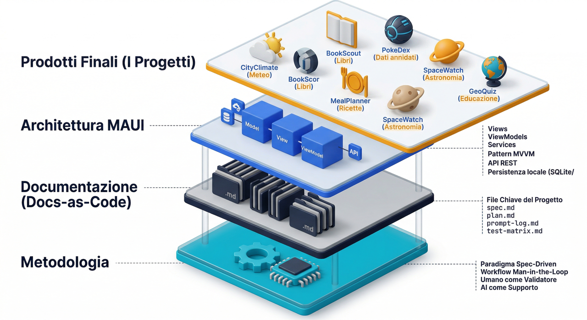
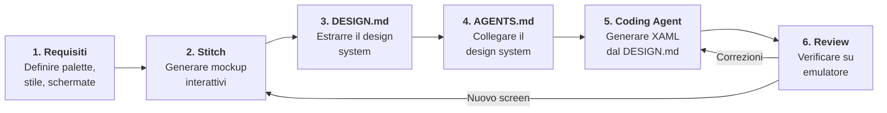

import { Badge } from '@astrojs/starlight/components';
import Accordion from "@components/Accordion.astro";

<style>{`
  img {display: block; margin: 0 auto;}
`}</style>



## 1. Introduzione ai progetti finali

Il modulo finale propone lo sviluppo di una applicazione completa in .NET MAUI con target principale Android e supporto opzionale a iOS.  
L'obiettivo non consiste nell'uso passivo di strumenti di generazione automatica del codice, ma nell'impiego consapevole di sistemi AI per supportare analisi, progettazione, implementazione, verifica e rifinitura del prodotto software.

Le proposte seguenti sono pensate per un contesto didattico introduttivo ma realistico.  
Ogni progetto consente di consolidare competenze già affrontate nel corso, come XAML, Shell, API REST, persistenza locale, gestione dei permessi, theming e organizzazione del codice.

### 1.1 Criteri di scelta del progetto

Un buon progetto finale dovrebbe soddisfare i seguenti requisiti:

- essere realizzabile nel tempo disponibile (indicativamente 4-6 settimane di lavoro);
- avere un'interfaccia sufficientemente ricca da richiedere una progettazione reale;
- usare almeno una API di terze parti documentata e utilizzabile gratuitamente per finalità didattiche;
- prevedere almeno una forma di persistenza locale (Preferences o SQLite);
- consentire iterazioni progressive e verificabili secondo il modello Man-in-the-Loop;
- prestarsi a una presentazione finale chiara e convincente.

### 1.2 Quale progetto scegliere

La scelta dovrebbe basarsi su tre fattori:

- **interesse personale** per il dominio del progetto (è più facile lavorare con entusiasmo su un tema che piace);
- **equilibrio** tra ambizione e tempo disponibile (meglio un progetto semplice e ben fatto che uno ambizioso e incompleto);
- **capacità di presentazione** del prodotto finale in modo chiaro e convincente durante la demo.

### 1.3 Requisiti minimi comuni

Indipendentemente dal progetto scelto, ogni applicazione deve includere almeno:

- gestione del versioning con **Git**, utilizzando branch dedicati per la singola iterazione o feature;
- una specifica iniziale documentata in `docs/spec.md`;
- una pianificazione in iterazioni documentata in `docs/plan.md`;
- una applicazione MAUI funzionante con architettura MVVM;
- navigazione tramite Shell (TabBar o FlyoutItem);
- almeno una API esterna con chiamate REST asincrone;
- almeno una forma di persistenza locale (preferiti, cronologia o impostazioni);
- gestione degli stati principali della UI (loading, errore, empty state, dati caricati);
- documentazione del processo (log delle iterazioni, prompt log);
- presentazione finale con demo dell'applicazione.

### 1.4 Estensioni opzionali comuni

Indipendentemente dal progetto scelto, possono essere introdotte alcune estensioni comuni:

- gestione del tema chiaro/scuro con switch nelle impostazioni;
- schermata impostazioni con personalizzazione utente;
- supporto a preferiti o cronologia con persistenza SQLite;
- cache locale dei dati API per uso offline parziale;
- indicatori di caricamento e stati di errore ben curati;
- validazione degli input dell'utente;
- screenshot e asset per una possibile pubblicazione store;
- condivisione di contenuti tramite funzionalità di sistema.

### 1.5 Nota sul Workflow Git per tutti i progetti

In tutte le guide passo-passo che seguono, si intende **sempre** applicato il seguente loop di lavoro con Git, allineato alle best practices dello sviluppo software:
1. **Plan & Branch**: all'inizio dello sviluppo di una nuova funzionalità o iterazione, richiedere la creazione di un **branch specifico** (es. `git checkout -b feature/ui-meteo-attuale`). Un branch rappresenta un ambiente di lavoro isolato, perfetto per sviluppare la feature senza intaccare il ramo principale del repository.
2. **Execute, Test & Commit (Frequenti)**: sviluppare e testare la feature procedendo a piccoli passi. Ogni volta che si raggiunge un traguardo significativo, coerente e funzionante (es. "creato il DTO", "implementato il Service", "corretto un bug"), si esegue un **commit atomico** (es. `git commit -am "feat: aggiunto DTO meteo"` o `fix: risolto crash UI`). Un singolo branch ben gestito conterrà sempre *numerosi* commit ravvicinati.
3. **Document & Merge**: alla fine dell'iterazione, dopo l'aggiornamento della documentazione e l'ultimo commit, si "chiude" il lavoro. Si esegue la **merge** del branch concluso nel ramo principale (es. main) e il branch può essere eliminato. L'agente AI può essere istruito ad eseguire queste automazioni tramite terminale a patto che gli si concedano i dovuti permessi controllati (vedi l'Esempio Completo in fondo a questo documento).

### 1.6 Approfondimento: I DTO (Data Transfer Object) nei progetti MAUI

Nelle indicazioni dei vari progetti (vedi Tabella Sintetica e guide di implementazione) si troverà la ricorrente richiesta di usare file con suffisso "Dto" (come `PokemonDto.cs`, `BookDto.cs` ecc.). 
Questa è una essenziale *best-practice* architetturale: **un DTO è un semplice contenitore di dati ("oggetto di trasferimento") senza alcun metodo logico o di calcolo al suo interno**. 

Nei nostri contesti didattici, i DTO servono primariamente a isolare l'applicazione nativa dalle imperfezioni o particolarità strutturali delle API Web. Grazie ad essi mappiamo *uno a uno* le chiavi JSON ricevute in proprietà in linguaggio C#. Facendo in modo che il Service Web (o il Model Repository) restituisca esclusivamente oggetti e array DTO "puliti" ai nostri layer superiori (i ViewModel), evitiamo di dover adattare l'Interfaccia Grafica XAML a fastidiosi nomi esterni fuori standard (come le banali chiavi in *snake_case* native di molti backend) o costringerla a gestire campi nullable e imprevisti direttamente nel binding UI.

---

## 2. Tabella sintetica dei progetti

| # | Progetto | Dominio | API esterna | Auth API | Persistenza | Complessità |
| --- | --- | --- | --- | --- | --- | --- |
| 1 | CityClimate Companion | Meteo e ambiente | Open-Meteo | Nessuna | Sì | Media |
| 2 | BookScout Mobile | Libri e lettura | Google Books / Open Library | Nessuna | Sì | Media |
| 3 | PokeDex MAUI | Pokémon | PokeAPI | Nessuna | Sì | Media |
| 4 | MealPlanner Recipes | Ricette e cucina | TheMealDB | Nessuna | Sì | Media |
| 5 | SpaceWatch Explorer | Astronomia e spazio | NASA APOD | API Key gratuita | Sì | Medio-bassa |
| 6 | GeoQuiz Nations | Educazione geografica | REST Countries | Nessuna | Sì | Medio-bassa |

Tutte le API indicate sono gratuite per uso didattico e non richiedono pagamento.  
Alcune richiedono una registrazione gratuita per ottenere una API key (NASA), le altre sono completamente aperte.

---

## 3. Progetto 1 - CityClimate Companion

### 3.1 Idea generale

**CityClimate Companion** è una applicazione che unisce previsioni meteo, qualità dell'aria, geolocalizzazione, località preferite e impostazioni utente.  
Il progetto rappresenta una naturale evoluzione del classico tema "app meteo", ma con una struttura più completa e moderna.

Questo progetto è particolarmente adatto perché estende una tipologia di esercizio già nota nel corso e permette di lavorare su dati remoti, navigazione, preferenze, UX e organizzazione architetturale.  
Risulta inoltre immediato da dimostrare durante la presentazione finale.

### 3.2 Funzionalità minime

- Ricerca di una città tramite nome (con geocoding).
- Visualizzazione del meteo attuale (temperatura, condizione, umidità, vento).
- Visualizzazione delle previsioni giornaliere per i prossimi 7 giorni.
- Visualizzazione delle previsioni orarie del giorno corrente.
- Gestione di almeno una località preferita salvata localmente.
- Supporto al tema chiaro e scuro.

### 3.3 Funzionalità avanzate

- Uso della posizione GPS corrente per determinare la località.
- Visualizzazione dell'indice di qualità dell'aria (AQI).
- Salvataggio di più città tra i preferiti con SQLite.
- Cache locale degli ultimi dati meteo ricevuti.
- Schermata di dettaglio per i singoli parametri atmosferici (pressione, UV, visibilità).
- Icone meteo dinamiche in base alla condizione (sole, pioggia, neve, nuvole).

### 3.4 API suggerite

**Open-Meteo** ([https://open-meteo.com/](https://open-meteo.com/))

- Gratuita per uso non commerciale, senza obbligo di registrazione.
- Nessuna API Key richiesta.
- Rate limit molto permissivo (fino a 10.000 chiamate al giorno).
- Include geocoding, meteo attuale, previsioni orarie e giornaliere, qualità dell'aria.

**Endpoint principali:**

| Endpoint | Scopo | Esempio |
| --- | --- | --- |
| `GET /v1/forecast` | Previsioni meteo | `?latitude=45.07&longitude=7.68&current_weather=true` |
| `GET /v1/search` | Geocoding (nome → coordinate) | `?name=Torino&count=5` |
| `GET /v1/air-quality` | Qualità dell'aria | `?latitude=45.07&longitude=7.68&current=european_aqi` |

**Esempio di risposta JSON (meteo attuale):**

```json
{
  "current_weather": {
    "temperature": 18.5,
    "winds_peed_10m": 12.3,
    "wind_direction_10m": 180,
    "weather_code": 3,
    "time": "2025-03-15T14:00"
  },
  "daily": {
    "time": ["2025-03-15", "2025-03-16", "2025-03-17"],
    "temperature_2m_max": [20.1, 18.3, 15.7],
    "temperature_2m_min": [8.2, 7.5, 6.1],
    "weather_code": [3, 61, 80]
  }
}
```

### 3.5 Schermate suggerite

| Schermata | Scopo | Componenti MAUI |
| --- | --- | --- |
| Home | Meteo attuale della località selezionata | Grid, Label, Image |
| Forecast | Previsioni 7 giorni + orarie | CollectionView, DataTemplate |
| Search | Ricerca città per nome | SearchBar, CollectionView |
| Favorites | Elenco località salvate | CollectionView, SwipeView |
| Settings | Tema, unità di misura, città predefinita | Switch, Picker, Preferences |

### 3.6 Competenze esercitate

- HttpClient e chiamate REST asincrone con gestione errori.
- Deserializzazione JSON complesso (risposte con array annidati).
- Preferences per impostazioni semplici e SQLite per i preferiti.
- Shell con TabBar e navigazione tra schermate.
- Gestione degli stati della UI: loading, errore, dati vuoti, dati caricati.
- Uso opzionale dei sensori di geolocalizzazione MAUI.

### 3.7 Guida passo per passo

#### Passo 1: Setup del progetto

Creare il progetto MAUI e impostare la navigazione Shell con le tab principali: Home, Forecast, Search, Favorites, Settings. Configurare `MauiProgram.cs` con la registrazione delle pagine e dei servizi. Aggiungere i pacchetti NuGet necessari (`CommunityToolkit.Mvvm`, `sqlite-net-pcl`).

**Prompt AI suggerito:**

```text
Creare la struttura iniziale di un progetto MAUI chiamato CityClimate.
Vincoli:
- architettura MVVM con CommunityToolkit.Mvvm;
- navigazione Shell con TabBar a 5 tab (Home, Forecast, Search, Favorites, Settings);
- registrazione DI in MauiProgram.cs;
- creare solo le pagine vuote con il BindingContext impostato.
Non implementare ancora la logica, solo la struttura.
```

#### Passo 2: Service REST per Geocoding e Meteo

Implementare `IWeatherService` e `WeatherService` con i metodi:

- `SearchCityAsync(string name)` → restituisce lista di città
- `GetCurrentWeatherAsync(double lat, double lon)` → restituisce meteo attuale
- `GetForecastAsync(double lat, double lon)` → restituisce previsioni 7 giorni

**Prompt AI suggerito:**

```text
Implementare il servizio WeatherService per l'API Open-Meteo.
Creare i file:
- Services/IWeatherService.cs (interfaccia)
- Services/WeatherService.cs (implementazione con HttpClient)
- Models/CityResult.cs (DTO per il geocoding)
- Models/WeatherData.cs (DTO per il meteo attuale)
- Models/ForecastData.cs (DTO per le previsioni)

Vincoli:
- usare HttpClient asincrono iniettato dal costruttore;
- gestire timeout, errori di rete e JSON non valido con try/catch;
- restituire null o lista vuota in caso di errore, mai lanciare eccezioni non gestite;
- usare System.Text.Json per la deserializzazione.
```

#### Passo 3: UI Meteo Attuale

Implementare la pagina Home con il meteo attuale della località selezionata. Mostrare temperatura, condizione meteo (come testo e icona), vento e umidità. Gestire lo stato loading con ActivityIndicator.

#### Passo 4: Previsioni Giornaliere e Orarie

Implementare la pagina Forecast con una CollectionView che mostra le previsioni dei prossimi 7 giorni. Aggiungere una sezione oraria per il giorno corrente.

#### Passo 5: Ricerca Città

Implementare la SearchPage con SearchBar e lista risultati. Al tocco su una città, navigare alla Home con i dati aggiornati.

#### Passo 6: Preferiti e Persistenza

Implementare il salvataggio delle città preferite in SQLite. Aggiungere la possibilità di impostare una città come predefinita tramite Preferences.

#### Passo 7: Tema e Gestione Errori

Aggiungere il supporto al tema chiaro/scuro. Gestire tutti gli stati di errore (rete assente, API non disponibile, ricerca vuota). Aggiungere feedback visivi coerenti.

#### Passo 8: Rifinitura e Packaging

Rifinire la UI, testare su emulatore e device, acquisire screenshot, generare l'APK in modalità Release. Preparare la documentazione finale e la demo.

---

## 4. Progetto 2 - BookScout Mobile

### 4.1 Idea generale

**BookScout Mobile** è una applicazione per la ricerca e la consultazione di libri, con dettaglio, copertina, informazioni editoriali, salvataggio dei preferiti e cronologia locale.  
Il progetto è adatto a chi desidera realizzare una applicazione informativa con interfaccia pulita e focus sulla qualità della navigazione.

### 4.2 Funzionalità minime

- Ricerca per titolo o autore.
- Elenco dei risultati con copertina, titolo e autore.
- Pagina dettaglio con informazioni estese (descrizione, editore, anno, pagine, categorie).
- Salvataggio dei preferiti in locale.
- Cronologia delle ricerche effettuate.

### 4.3 Funzionalità avanzate

- Filtri per lingua o categoria.
- Scansione ISBN tramite fotocamera (barcode scanner).
- Note personali associate ai libri salvati.
- Ordinamento dei risultati per rilevanza, data o autore.
- Modalità offline per i libri già memorizzati localmente.

### 4.4 API suggerite

**Google Books API** ([https://developers.google.com/books](https://developers.google.com/books))

- Gratuita, non richiede API Key per le ricerche base.
- Rate limit generoso per uso didattico.
- Restituisce titolo, autori, descrizione, copertina, ISBN, categorie.

In alternativa: **Open Library** ([https://openlibrary.org/developers/api](https://openlibrary.org/developers/api)) - completamente gratuita e open source.

**Endpoint principali Google Books:**

| Endpoint | Scopo | Esempio |
| --- | --- | --- |
| `GET /volumes?q={query}` | Ricerca libri | `?q=Pride+and+Prejudice` |
| `GET /volumes/{id}` | Dettaglio libro | `/volumes/s1gVAAAAYAAJ` |

**Esempio di risposta JSON:**


<Accordion title="Esempio JSON completo (Google Books API - dettaglio libro ricercato per id)"  defaultOpen={false}>

GET https://www.googleapis.com/books/v1/volumes/s1gVAAAAYAAJ

```json
{
  "kind": "books#volume",
  "id": "s1gVAAAAYAAJ",
  "etag": "kOAktg8JCHo",
  "selfLink": "https://www.googleapis.com/books/v1/volumes/s1gVAAAAYAAJ",
  "volumeInfo": {
    "title": "Pride and Prejudice",
    "authors": [
      "Jane Austen"
    ],
    "publisher": "C. Scribner's sons",
    "publishedDate": "1918",
    "description": "Austen’s most celebrated novel tells the story of Elizabeth Bennet, a bright, lively young woman with four sisters, and a mother determined to marry them to wealthy men. At a party near the Bennets’ home in the English countryside, Elizabeth meets the wealthy, proud Fitzwilliam Darcy. Elizabeth initially finds Darcy haughty and intolerable, but circumstances continue to unite the pair. Mr. Darcy finds himself captivated by Elizabeth’s wit and candor, while her reservations about his character slowly vanish. The story is as much a social critique as it is a love story, and the prose crackles with Austen’s wry wit.",
    "readingModes": {
      "text": true,
      "image": true
    },
    "pageCount": 401,
    "printedPageCount": 448,
    "dimensions": {
      "height": "18.00 cm"
    },
    "printType": "BOOK",
    "averageRating": 4,
    "ratingsCount": 360,
    "maturityRating": "NOT_MATURE",
    "allowAnonLogging": false,
    "contentVersion": "1.6.14.0.full.3",
    "panelizationSummary": {
      "containsEpubBubbles": false,
      "containsImageBubbles": false
    },
    "imageLinks": {
      "smallThumbnail": "http://books.google.com/books/content?id=s1gVAAAAYAAJ&printsec=frontcover&img=1&zoom=5&edge=curl&imgtk=AFLRE70qVGO4N0DVy91nTsonlVx_h3KrYJLVkgRWjQHjOvhQoAKqs0zWcCujRv7OF5QqT5C0kpk8sAT2sH6fuafr-fKSDjcXG5xrpnEFsVd67TdtWKnZnmQT7tqSxI9MNtHjZhWADEiM&source=gbs_api",
      "thumbnail": "http://books.google.com/books/content?id=s1gVAAAAYAAJ&printsec=frontcover&img=1&zoom=1&edge=curl&imgtk=AFLRE70LB3iYlaI6BP6SZ2zOvIM_qJGu3YL91S3GKfOBi0JXgEfw5jqPzMuAG9ysXCZvn5Y5g3Kd_9-3tgzG7Idm04ZgFRjZ76ZZnT3BkmpXzxIIURVUHv3jifBaxVe7jBZmdzRNge-1&source=gbs_api",
      "small": "http://books.google.com/books/content?id=s1gVAAAAYAAJ&printsec=frontcover&img=1&zoom=2&edge=curl&imgtk=AFLRE71C-vbDHx8JGtgVuplE5oyEA0HAZxrkbG-y9UXlRHk-FJ898j5dMvNxoO5mCOR6gX3lUByGaRwGJdJ94owHtDHBNGU4NhqnGz0PDt-k4ihwr12Y_3KKv-zsNCqNKCPWVMGFls-3&source=gbs_api",
      "medium": "http://books.google.com/books/content?id=s1gVAAAAYAAJ&printsec=frontcover&img=1&zoom=3&edge=curl&imgtk=AFLRE73g-QhLXz7HwcBBs1aALprne9qd1hBiHeSiGgPPBQucU67vWGrNOuNKw7RQqCf6QqV2zmqmSpAuBdNMa879pmwDnkNfulV1w4AQFpg_msw-FIcddjvh2YBzgfrXkZwEIyH_Q1X0&source=gbs_api",
      "large": "http://books.google.com/books/content?id=s1gVAAAAYAAJ&printsec=frontcover&img=1&zoom=4&edge=curl&imgtk=AFLRE73QBnBAQ6VCy26zueVwreq61eILBWKoKBBLUcgMm1ezK2Hqi6HswUA9jreHhhUxSHM8H_3nG4G7HM3zjLoYLYI9A-2K4w6L_VssrnbGkAJd7irt2t316azXflYODu4xaUKmELJG&source=gbs_api",
      "extraLarge": "http://books.google.com/books/content?id=s1gVAAAAYAAJ&printsec=frontcover&img=1&zoom=6&edge=curl&imgtk=AFLRE72SE6MR4KaH10qny0ZgqeU_MQwaNFDw9-qtg2KYUXxo7L9XstODyCvcSEe-Wa7071s6hKzoUu1qHWGSVSRww16uaMTP-r7SzqCFINF6q4dmTye1-48t8WZS_z6VVPvyMCG9B1ZT&source=gbs_api"
    },
    "language": "en",
    "previewLink": "http://books.google.it/books?id=s1gVAAAAYAAJ&hl=&source=gbs_api",
    "infoLink": "https://play.google.com/store/books/details?id=s1gVAAAAYAAJ&source=gbs_api",
    "canonicalVolumeLink": "https://play.google.com/store/books/details?id=s1gVAAAAYAAJ"
  },
  "layerInfo": {
    "layers": [
      {
        "layerId": "geo",
        "volumeAnnotationsVersion": "28"
      }
    ]
  },
  "saleInfo": {
    "country": "IT",
    "saleability": "FREE",
    "isEbook": true,
    "buyLink": "https://play.google.com/store/books/details?id=s1gVAAAAYAAJ&rdid=book-s1gVAAAAYAAJ&rdot=1&source=gbs_api"
  },
  "accessInfo": {
    "country": "IT",
    "viewability": "ALL_PAGES",
    "embeddable": true,
    "publicDomain": true,
    "textToSpeechPermission": "ALLOWED",
    "epub": {
      "isAvailable": true,
      "downloadLink": "http://books.google.it/books/download/Pride_and_Prejudice.epub?id=s1gVAAAAYAAJ&hl=&output=epub&source=gbs_api"
    },
    "pdf": {
      "isAvailable": true,
      "downloadLink": "http://books.google.it/books/download/Pride_and_Prejudice.pdf?id=s1gVAAAAYAAJ&hl=&output=pdf&sig=ACfU3U3dQw5JDWdbVgk2VRHyDjVMT4oIaA&source=gbs_api"
    },
    "webReaderLink": "http://play.google.com/books/reader?id=s1gVAAAAYAAJ&hl=&source=gbs_api",
    "accessViewStatus": "FULL_PUBLIC_DOMAIN",
    "quoteSharingAllowed": false
  }
}
```

</Accordion>

<Accordion title="Esempio JSON completo (Open Library API - dettaglio libro ricercato per query string)"  defaultOpen={false}>

In questo caso la ricerca può restituire più risultati, quindi si mostra un esempio di risposta per la ricerca con query string "Pride and Prejudice":

GET https://www.googleapis.com/books/v1/volumes/?q=Pride+and+Prejudice

```json
{
  "kind": "books#volumes",
  "totalItems": 1000000,
  "items": [
    {
      "kind": "books#volume",
      "id": "cUdSEQAAQBAJ",
      "etag": "wkGq5IK/YsM",
      "selfLink": "https://www.googleapis.com/books/v1/volumes/cUdSEQAAQBAJ",
      "volumeInfo": {
        "title": "Pride and Prejudice / Orgoglio e pregiudizio",
        "authors": [
          "Jane Austen"
        ],
        "publisher": "Edizioni Mondadori",
        "publishedDate": "2025-04-29",
        "description": "It is a truth universally acknowledged, that a single man in possession of a good fortune, must be in want of a wife. L'immaginazione di una donna corre sempre: dall'ammirazione passa all'amore, dall'amore al matrimonio, tutto in un istante. In vain have I struggled. It will not do. My feelings will not be repressed. You must allow me to tell you how ardently I admire and love you.",
        "industryIdentifiers": [
          {
            "type": "ISBN_13",
            "identifier": "9788835741978"
          },
          {
            "type": "ISBN_10",
            "identifier": "8835741971"
          }
        ],
        "readingModes": {
          "text": true,
          "image": true
        },
        "pageCount": 750,
        "printType": "BOOK",
        "categories": [
          "Fiction"
        ],
        "maturityRating": "NOT_MATURE",
        "allowAnonLogging": false,
        "contentVersion": "0.2.3.0.preview.3",
        "panelizationSummary": {
          "containsEpubBubbles": false,
          "containsImageBubbles": false
        },
        "imageLinks": {
          "smallThumbnail": "http://books.google.com/books/content?id=cUdSEQAAQBAJ&printsec=frontcover&img=1&zoom=5&edge=curl&source=gbs_api",
          "thumbnail": "http://books.google.com/books/content?id=cUdSEQAAQBAJ&printsec=frontcover&img=1&zoom=1&edge=curl&source=gbs_api"
        },
        "language": "it",
        "previewLink": "http://books.google.it/books?id=cUdSEQAAQBAJ&printsec=frontcover&dq=Pride+and+Prejudice&hl=&cd=1&source=gbs_api",
        "infoLink": "https://play.google.com/store/books/details?id=cUdSEQAAQBAJ&source=gbs_api",
        "canonicalVolumeLink": "https://play.google.com/store/books/details?id=cUdSEQAAQBAJ"
      },
      "saleInfo": {
        "country": "IT",
        "saleability": "FOR_SALE",
        "isEbook": true,
        "listPrice": {
          "amount": 9.99,
          "currencyCode": "EUR"
        },
        "retailPrice": {
          "amount": 9.99,
          "currencyCode": "EUR"
        },
        "buyLink": "https://play.google.com/store/books/details?id=cUdSEQAAQBAJ&rdid=book-cUdSEQAAQBAJ&rdot=1&source=gbs_api",
        "offers": [
          {
            "finskyOfferType": 1,
            "listPrice": {
              "amountInMicros": 9990000,
              "currencyCode": "EUR"
            },
            "retailPrice": {
              "amountInMicros": 9990000,
              "currencyCode": "EUR"
            }
          }
        ]
      },
      "accessInfo": {
        "country": "IT",
        "viewability": "PARTIAL",
        "embeddable": true,
        "publicDomain": false,
        "textToSpeechPermission": "ALLOWED",
        "epub": {
          "isAvailable": true,
          "acsTokenLink": "http://books.google.it/books/download/Pride_and_Prejudice_Orgoglio_e_pregiudiz-sample-epub.acsm?id=cUdSEQAAQBAJ&format=epub&output=acs4_fulfillment_token&dl_type=sample&source=gbs_api"
        },
        "pdf": {
          "isAvailable": true,
          "acsTokenLink": "http://books.google.it/books/download/Pride_and_Prejudice_Orgoglio_e_pregiudiz-sample-pdf.acsm?id=cUdSEQAAQBAJ&format=pdf&output=acs4_fulfillment_token&dl_type=sample&source=gbs_api"
        },
        "webReaderLink": "http://play.google.com/books/reader?id=cUdSEQAAQBAJ&hl=&source=gbs_api",
        "accessViewStatus": "SAMPLE",
        "quoteSharingAllowed": false
      },
      "searchInfo": {
        "textSnippet": "&quot;Orgoglio e pregiudizio&quot; è uno dei primi romanzi di Jane Austen."
      }
    },
    {
      "kind": "books#volume",
      "id": "s1gVAAAAYAAJ",
      "etag": "Xy69B9RLOIQ",
      "selfLink": "https://www.googleapis.com/books/v1/volumes/s1gVAAAAYAAJ",
      "volumeInfo": {
        "title": "Pride and Prejudice",
        "authors": [
          "Jane Austen"
        ],
        "publishedDate": "1918",
        "description": "Austen’s most celebrated novel tells the story of Elizabeth Bennet, a bright, lively young woman with four sisters, and a mother determined to marry them to wealthy men. At a party near the Bennets’ home in the English countryside, Elizabeth meets the wealthy, proud Fitzwilliam Darcy. Elizabeth initially finds Darcy haughty and intolerable, but circumstances continue to unite the pair. Mr. Darcy finds himself captivated by Elizabeth’s wit and candor, while her reservations about his character slowly vanish. The story is as much a social critique as it is a love story, and the prose crackles with Austen’s wry wit.",
        "industryIdentifiers": [
          {
            "type": "OTHER",
            "identifier": "HARVARD:32044086796588"
          }
        ],
        "readingModes": {
          "text": true,
          "image": true
        },
        "pageCount": 448,
        "printType": "BOOK",
        "categories": [
          "Courtship"
        ],
        "averageRating": 4,
        "ratingsCount": 360,
        "maturityRating": "NOT_MATURE",
        "allowAnonLogging": false,
        "contentVersion": "1.6.14.0.full.3",
        "panelizationSummary": {
          "containsEpubBubbles": false,
          "containsImageBubbles": false
        },
        "imageLinks": {
          "smallThumbnail": "http://books.google.com/books/content?id=s1gVAAAAYAAJ&printsec=frontcover&img=1&zoom=5&edge=curl&source=gbs_api",
          "thumbnail": "http://books.google.com/books/content?id=s1gVAAAAYAAJ&printsec=frontcover&img=1&zoom=1&edge=curl&source=gbs_api"
        },
        "language": "en",
        "previewLink": "http://books.google.it/books?id=s1gVAAAAYAAJ&pg=PR11&dq=Pride+and+Prejudice&hl=&cd=2&source=gbs_api",
        "infoLink": "https://play.google.com/store/books/details?id=s1gVAAAAYAAJ&source=gbs_api",
        "canonicalVolumeLink": "https://play.google.com/store/books/details?id=s1gVAAAAYAAJ"
      },
      "saleInfo": {
        "country": "IT",
        "saleability": "FREE",
        "isEbook": true,
        "buyLink": "https://play.google.com/store/books/details?id=s1gVAAAAYAAJ&rdid=book-s1gVAAAAYAAJ&rdot=1&source=gbs_api"
      },
      "accessInfo": {
        "country": "IT",
        "viewability": "ALL_PAGES",
        "embeddable": true,
        "publicDomain": true,
        "textToSpeechPermission": "ALLOWED",
        "epub": {
          "isAvailable": true,
          "downloadLink": "http://books.google.it/books/download/Pride_and_Prejudice.epub?id=s1gVAAAAYAAJ&hl=&output=epub&source=gbs_api"
        },
        "pdf": {
          "isAvailable": true,
          "downloadLink": "http://books.google.it/books/download/Pride_and_Prejudice.pdf?id=s1gVAAAAYAAJ&hl=&output=pdf&sig=ACfU3U3dQw5JDWdbVgk2VRHyDjVMT4oIaA&source=gbs_api"
        },
        "webReaderLink": "http://play.google.com/books/reader?id=s1gVAAAAYAAJ&hl=&source=gbs_api",
        "accessViewStatus": "FULL_PUBLIC_DOMAIN",
        "quoteSharingAllowed": false
      },
      "searchInfo": {
        "textSnippet": "... <b>Pride and Prejudice</b> the tenth or fifteenth time at the close of 1917 for the purposes of this Introduction , I found it as fresh as when I read it first in 1889 , after long shying off from it . I found it as fresh as at any earlier&nbsp;..."
      }
    },
    {
      "kind": "books#volume",
      "id": "EvqJCGeqKhsC",
      "etag": "V7jZMZtt0a4",
      "selfLink": "https://www.googleapis.com/books/v1/volumes/EvqJCGeqKhsC",
      "volumeInfo": {
        "title": "Pride and Prejudice",
        "authors": [
          "Jane Austen"
        ],
        "publisher": "Oxford University Press, USA",
        "publishedDate": "1980",
        "description": "The text of Pride and Prejudice is the 1813 first edition text.",
        "industryIdentifiers": [
          {
            "type": "ISBN_10",
            "identifier": "0192815032"
          },
          {
            "type": "ISBN_13",
            "identifier": "9780192815033"
          }
        ],
        "readingModes": {
          "text": false,
          "image": false
        },
        "pageCount": 388,
        "printType": "BOOK",
        "categories": [
          "Fiction"
        ],
        "maturityRating": "NOT_MATURE",
        "allowAnonLogging": false,
        "contentVersion": "0.4.1.0.preview.0",
        "panelizationSummary": {
          "containsEpubBubbles": false,
          "containsImageBubbles": false
        },
        "imageLinks": {
          "smallThumbnail": "http://books.google.com/books/content?id=EvqJCGeqKhsC&printsec=frontcover&img=1&zoom=5&source=gbs_api",
          "thumbnail": "http://books.google.com/books/content?id=EvqJCGeqKhsC&printsec=frontcover&img=1&zoom=1&source=gbs_api"
        },
        "language": "en",
        "previewLink": "http://books.google.it/books?id=EvqJCGeqKhsC&q=Pride+and+Prejudice&dq=Pride+and+Prejudice&hl=&cd=3&source=gbs_api",
        "infoLink": "http://books.google.it/books?id=EvqJCGeqKhsC&dq=Pride+and+Prejudice&hl=&source=gbs_api",
        "canonicalVolumeLink": "https://books.google.com/books/about/Pride_and_Prejudice.html?hl=&id=EvqJCGeqKhsC"
      },
      "saleInfo": {
        "country": "IT",
        "saleability": "NOT_FOR_SALE",
        "isEbook": false
      },
      "accessInfo": {
        "country": "IT",
        "viewability": "NO_PAGES",
        "embeddable": false,
        "publicDomain": false,
        "textToSpeechPermission": "ALLOWED",
        "epub": {
          "isAvailable": false
        },
        "pdf": {
          "isAvailable": false
        },
        "webReaderLink": "http://play.google.com/books/reader?id=EvqJCGeqKhsC&hl=&source=gbs_api",
        "accessViewStatus": "NONE",
        "quoteSharingAllowed": false
      },
      "searchInfo": {
        "textSnippet": "The text of Pride and Prejudice is the 1813 first edition text."
      }
    },
    {
      "kind": "books#volume",
      "id": "mdnrlnf9IGwC",
      "etag": "lv9yU+47VIo",
      "selfLink": "https://www.googleapis.com/books/v1/volumes/mdnrlnf9IGwC",
      "volumeInfo": {
        "title": "Pride and Prejudice",
        "authors": [
          "Jane Austen"
        ],
        "publishedDate": "1918",
        "industryIdentifiers": [
          {
            "type": "OTHER",
            "identifier": "UOM:39015007047361"
          }
        ],
        "readingModes": {
          "text": false,
          "image": false
        },
        "pageCount": 444,
        "printType": "BOOK",
        "maturityRating": "NOT_MATURE",
        "allowAnonLogging": false,
        "contentVersion": "0.1.6.0.preview.0",
        "panelizationSummary": {
          "containsEpubBubbles": false,
          "containsImageBubbles": false
        },
        "imageLinks": {
          "smallThumbnail": "http://books.google.com/books/content?id=mdnrlnf9IGwC&printsec=frontcover&img=1&zoom=5&source=gbs_api",
          "thumbnail": "http://books.google.com/books/content?id=mdnrlnf9IGwC&printsec=frontcover&img=1&zoom=1&source=gbs_api"
        },
        "language": "en",
        "previewLink": "http://books.google.it/books?id=mdnrlnf9IGwC&q=Pride+and+Prejudice&dq=Pride+and+Prejudice&hl=&cd=4&source=gbs_api",
        "infoLink": "http://books.google.it/books?id=mdnrlnf9IGwC&dq=Pride+and+Prejudice&hl=&source=gbs_api",
        "canonicalVolumeLink": "https://books.google.com/books/about/Pride_and_Prejudice.html?hl=&id=mdnrlnf9IGwC"
      },
      "saleInfo": {
        "country": "IT",
        "saleability": "NOT_FOR_SALE",
        "isEbook": false
      },
      "accessInfo": {
        "country": "IT",
        "viewability": "NO_PAGES",
        "embeddable": false,
        "publicDomain": false,
        "textToSpeechPermission": "ALLOWED",
        "epub": {
          "isAvailable": false
        },
        "pdf": {
          "isAvailable": false
        },
        "webReaderLink": "http://play.google.com/books/reader?id=mdnrlnf9IGwC&hl=&source=gbs_api",
        "accessViewStatus": "NONE",
        "quoteSharingAllowed": false
      }
    },
    {
      "kind": "books#volume",
      "id": "c91Vrl20Y4sC",
      "etag": "CuvhkMQtTeA",
      "selfLink": "https://www.googleapis.com/books/v1/volumes/c91Vrl20Y4sC",
      "volumeInfo": {
        "title": "Literary Afterlife",
        "subtitle": "The Posthumous Continuations of 325 Authors' Fictional Characters",
        "authors": [
          "Bernard A. Drew"
        ],
        "publisher": "McFarland",
        "publishedDate": "2010-03-08",
        "description": "This is an encyclopedic work, arranged by broad categories and then by original authors, of literary pastiches in which fictional characters have reappeared in new works after the deaths of the authors that created them. It includes book series that have continued under a deceased writer's real or pen name, undisguised offshoots issued under the new writer's name, posthumous collaborations in which a deceased author's unfinished manuscript is completed by another writer, unauthorized pastiches, and \"biographies\" of literary characters. The authors and works are entered under the following categories: Action and Adventure, Classics (18th Century and Earlier), Classics (19th Century), Classics (20th Century), Crime and Mystery, Espionage, Fantasy and Horror, Humor, Juveniles (19th Century), Juveniles (20th Century), Poets, Pulps, Romances, Science Fiction and Westerns. Each original author entry includes a short biography, a list of original works, and information on the pastiches based on the author's characters.",
        "industryIdentifiers": [
          {
            "type": "ISBN_13",
            "identifier": "9780786457212"
          },
          {
            "type": "ISBN_10",
            "identifier": "078645721X"
          }
        ],
        "readingModes": {
          "text": true,
          "image": true
        },
        "pageCount": 421,
        "printType": "BOOK",
        "categories": [
          "Literary Criticism"
        ],
        "maturityRating": "NOT_MATURE",
        "allowAnonLogging": false,
        "contentVersion": "2.4.6.0.preview.3",
        "panelizationSummary": {
          "containsEpubBubbles": false,
          "containsImageBubbles": false
        },
        "imageLinks": {
          "smallThumbnail": "http://books.google.com/books/content?id=c91Vrl20Y4sC&printsec=frontcover&img=1&zoom=5&edge=curl&source=gbs_api",
          "thumbnail": "http://books.google.com/books/content?id=c91Vrl20Y4sC&printsec=frontcover&img=1&zoom=1&edge=curl&source=gbs_api"
        },
        "language": "en",
        "previewLink": "http://books.google.it/books?id=c91Vrl20Y4sC&pg=PA269&dq=Pride+and+Prejudice&hl=&cd=5&source=gbs_api",
        "infoLink": "https://play.google.com/store/books/details?id=c91Vrl20Y4sC&source=gbs_api",
        "canonicalVolumeLink": "https://play.google.com/store/books/details?id=c91Vrl20Y4sC"
      },
      "saleInfo": {
        "country": "IT",
        "saleability": "FOR_SALE",
        "isEbook": true,
        "listPrice": {
          "amount": 26.56,
          "currencyCode": "EUR"
        },
        "retailPrice": {
          "amount": 26.56,
          "currencyCode": "EUR"
        },
        "buyLink": "https://play.google.com/store/books/details?id=c91Vrl20Y4sC&rdid=book-c91Vrl20Y4sC&rdot=1&source=gbs_api",
        "offers": [
          {
            "finskyOfferType": 1,
            "listPrice": {
              "amountInMicros": 26560000,
              "currencyCode": "EUR"
            },
            "retailPrice": {
              "amountInMicros": 26560000,
              "currencyCode": "EUR"
            }
          }
        ]
      },
      "accessInfo": {
        "country": "IT",
        "viewability": "PARTIAL",
        "embeddable": true,
        "publicDomain": false,
        "textToSpeechPermission": "ALLOWED",
        "epub": {
          "isAvailable": true,
          "acsTokenLink": "http://books.google.it/books/download/Literary_Afterlife-sample-epub.acsm?id=c91Vrl20Y4sC&format=epub&output=acs4_fulfillment_token&dl_type=sample&source=gbs_api"
        },
        "pdf": {
          "isAvailable": true,
          "acsTokenLink": "http://books.google.it/books/download/Literary_Afterlife-sample-pdf.acsm?id=c91Vrl20Y4sC&format=pdf&output=acs4_fulfillment_token&dl_type=sample&source=gbs_api"
        },
        "webReaderLink": "http://play.google.com/books/reader?id=c91Vrl20Y4sC&hl=&source=gbs_api",
        "accessViewStatus": "SAMPLE",
        "quoteSharingAllowed": false
      },
      "searchInfo": {
        "textSnippet": "... <b>Pride and Prejudice</b> (2004); Lions and Liquorice (1995) Phyllis Furley, The Darcys: Scenes from a Married Life (2004) Jane Gillespie, Teverton Hall (1984); Deborah (1995) Seth Grahame-Smith, <b>Pride and Prejudice</b> and Zombies (2009) Amanda&nbsp;..."
      }
    },
    {
      "kind": "books#volume",
      "id": "-1VHAAAAMAAJ",
      "etag": "tf6ufmFZY2w",
      "selfLink": "https://www.googleapis.com/books/v1/volumes/-1VHAAAAMAAJ",
      "volumeInfo": {
        "title": "Pride & Prejudice",
        "subtitle": "Working with Lesbian, Gay and Bisexual Youth",
        "authors": [
          "Central Toronto Youth Services"
        ],
        "publisher": "Horsdal & Schubart Publishers",
        "publishedDate": "1997",
        "description": "\"'Pride and prejudice' is a critical resource for professional who work with adolescents of all kinds. The book is a thorough course in lesbian, gay and bisexual youth issues, as well as a practical guide about how to help. It will be especially useful in working with youth with specific challenges: those dealing with HIV/AIDS, homelessness, and youth who are victimized by others as a result of their sexuality. Lesbian, gay and bisexual youth deserve informed and compassionate care, and this book will be a great asset toward that goal.\" -- from Tony D'Augelli's rear cover blurb.",
        "industryIdentifiers": [
          {
            "type": "OTHER",
            "identifier": "UOM:39015048948908"
          }
        ],
        "readingModes": {
          "text": false,
          "image": false
        },
        "pageCount": 272,
        "printType": "BOOK",
        "categories": [
          "Political Science"
        ],
        "maturityRating": "NOT_MATURE",
        "allowAnonLogging": false,
        "contentVersion": "0.5.2.0.preview.0",
        "panelizationSummary": {
          "containsEpubBubbles": false,
          "containsImageBubbles": false
        },
        "imageLinks": {
          "smallThumbnail": "http://books.google.com/books/content?id=-1VHAAAAMAAJ&printsec=frontcover&img=1&zoom=5&source=gbs_api",
          "thumbnail": "http://books.google.com/books/content?id=-1VHAAAAMAAJ&printsec=frontcover&img=1&zoom=1&source=gbs_api"
        },
        "language": "en",
        "previewLink": "http://books.google.it/books?id=-1VHAAAAMAAJ&q=Pride+and+Prejudice&dq=Pride+and+Prejudice&hl=&cd=6&source=gbs_api",
        "infoLink": "http://books.google.it/books?id=-1VHAAAAMAAJ&dq=Pride+and+Prejudice&hl=&source=gbs_api",
        "canonicalVolumeLink": "https://books.google.com/books/about/Pride_Prejudice.html?hl=&id=-1VHAAAAMAAJ"
      },
      "saleInfo": {
        "country": "IT",
        "saleability": "NOT_FOR_SALE",
        "isEbook": false
      },
      "accessInfo": {
        "country": "IT",
        "viewability": "NO_PAGES",
        "embeddable": false,
        "publicDomain": false,
        "textToSpeechPermission": "ALLOWED",
        "epub": {
          "isAvailable": false
        },
        "pdf": {
          "isAvailable": false
        },
        "webReaderLink": "http://play.google.com/books/reader?id=-1VHAAAAMAAJ&hl=&source=gbs_api",
        "accessViewStatus": "NONE",
        "quoteSharingAllowed": false
      },
      "searchInfo": {
        "textSnippet": "... Gay and Bisexual Youth &#39; 11 Chapter 1 12 easy one and cannot be travelled alone . At Pride &amp; Prejudice : working with lesbian , gay and bisexual GAY AND BISEXUAL YOUTH CHAPTER <b>Pride</b>, <b>Prejudice</b> and Lesbian, Gay and Bisexual Youth."
      }
    },
    {
      "kind": "books#volume",
      "id": "vlaPuAAACAAJ",
      "etag": "0tFgbOae3+Q",
      "selfLink": "https://www.googleapis.com/books/v1/volumes/vlaPuAAACAAJ",
      "volumeInfo": {
        "title": "Pride and Prejudice",
        "authors": [
          "Jane Austen",
          "Linda Marion Jennings"
        ],
        "publisher": "Puffin Books",
        "publishedDate": "1995",
        "description": "Mr and Mrs Bennet live with their five daughters. Jane, the eldest daughter, falls in love with Charles Bingley, a rich batchelor who takes a house nearby with his two sisters and friend, Fitzwilliam Darcy. Darcy is attracted to the second daugher, Elizabeth, but a bad account of him is given to Elizabeth. He and Bingley's effect the separation of Bingley and Jane. William Collins, cousin to the sisters and as only male, heir to the Bennet estate, proposes to Elizabeth but is rejected. Darcy proposes to Elizabeth but she refuses. When Elizabeth travels north she is invited with friends to Darcy's place in Berbyshire, and thinking Darcy is absent she goes. However, he is there and she is surprised by his much-improved manners. She hears news that her sister Lydia has eloped with Wickham, an unprincipled adventurer. With Darcy's help the fugitives are found. The attachment between Bingley and Jane is renewed and leads to an engagement. In spite of the insolent intervention of Lady Catherine, Darcy and Elizabeth become engaged.",
        "industryIdentifiers": [
          {
            "type": "ISBN_10",
            "identifier": "0140373373"
          },
          {
            "type": "ISBN_13",
            "identifier": "9780140373370"
          }
        ],
        "readingModes": {
          "text": false,
          "image": false
        },
        "pageCount": 0,
        "printType": "BOOK",
        "categories": [
          "COURTSHIP--FICTION."
        ],
        "maturityRating": "NOT_MATURE",
        "allowAnonLogging": false,
        "contentVersion": "preview-1.0.0",
        "panelizationSummary": {
          "containsEpubBubbles": false,
          "containsImageBubbles": false
        },
        "imageLinks": {
          "smallThumbnail": "http://books.google.com/books/content?id=vlaPuAAACAAJ&printsec=frontcover&img=1&zoom=5&source=gbs_api",
          "thumbnail": "http://books.google.com/books/content?id=vlaPuAAACAAJ&printsec=frontcover&img=1&zoom=1&source=gbs_api"
        },
        "language": "en",
        "previewLink": "http://books.google.it/books?id=vlaPuAAACAAJ&dq=Pride+and+Prejudice&hl=&cd=7&source=gbs_api",
        "infoLink": "http://books.google.it/books?id=vlaPuAAACAAJ&dq=Pride+and+Prejudice&hl=&source=gbs_api",
        "canonicalVolumeLink": "https://books.google.com/books/about/Pride_and_Prejudice.html?hl=&id=vlaPuAAACAAJ"
      },
      "saleInfo": {
        "country": "IT",
        "saleability": "NOT_FOR_SALE",
        "isEbook": false
      },
      "accessInfo": {
        "country": "IT",
        "viewability": "NO_PAGES",
        "embeddable": false,
        "publicDomain": false,
        "textToSpeechPermission": "ALLOWED",
        "epub": {
          "isAvailable": false
        },
        "pdf": {
          "isAvailable": false
        },
        "webReaderLink": "http://play.google.com/books/reader?id=vlaPuAAACAAJ&hl=&source=gbs_api",
        "accessViewStatus": "NONE",
        "quoteSharingAllowed": false
      },
      "searchInfo": {
        "textSnippet": "Mr and Mrs Bennet live with their five daughters. Jane, the eldest daughter, falls in love with Charles Bingley, a rich batchelor who takes a house nearby with his two sisters and friend, Fitzwilliam Darcy."
      }
    },
    {
      "kind": "books#volume",
      "id": "_BzNEAAAQBAJ",
      "etag": "Oynume6nHf0",
      "selfLink": "https://www.googleapis.com/books/v1/volumes/_BzNEAAAQBAJ",
      "volumeInfo": {
        "title": "Cataloging and Classification",
        "subtitle": "An Introduction",
        "authors": [
          "Athena Salaba",
          "Lois Mai Chan"
        ],
        "publisher": "Bloomsbury Publishing PLC",
        "publishedDate": "2023-07-24",
        "description": "\"The new edition of this essential work has raised the bar on an already excellent text about cataloguing.\" - Library Journal, Starred Review The fifth edition of the classic Cataloging and Classification covers the analysis and representation of methods used in describing, organizing, and providing access to resources made available in or through libraries. Since the last edition, there have new developments in cataloging, with the introduction of the IFLA Library Reference Model (LRM) and the new, official RDA, following the 3R Project. This text presents the essence of library cataloging and classification in terms of four basic functions: descriptive cataloging, authority work, subject access, and classification. Within this framework, content has been re-organized, all chapters have been rewritten, and new chapters have been introduced to incorporate the changes that have occurred during the interval between the four and fifth editions. In each part, the historical development and underlying principles of the retrieval mechanism at issue are treated first, because these are considered essential to an understanding of cataloging and classification. Discussion and examples of provisions in the standards and tools are then presented to illustrate the operations covered in each chapter. Divided into seven parts-a general overview; record production and structure, encoding formats, and metadata records; RDA (original and official); subject access and controlled vocabularies; the organization of library resources; encoding & records of bibliographic and authority data; and cataloging ethics--this book includes lists of the standards and tools used in the preparation and processing of cataloging records covered, lists of RDA elements, and sample records. Its companion website with interactive learning activities and supplementary materials located at catclassintro.org make it a true multimedia tool.",
        "industryIdentifiers": [
          {
            "type": "ISBN_13",
            "identifier": "9781538132937"
          },
          {
            "type": "ISBN_10",
            "identifier": "1538132931"
          }
        ],
        "readingModes": {
          "text": true,
          "image": true
        },
        "pageCount": 791,
        "printType": "BOOK",
        "categories": [
          "Language Arts & Disciplines"
        ],
        "maturityRating": "NOT_MATURE",
        "allowAnonLogging": true,
        "contentVersion": "0.18.3.0.preview.3",
        "panelizationSummary": {
          "containsEpubBubbles": false,
          "containsImageBubbles": false
        },
        "imageLinks": {
          "smallThumbnail": "http://books.google.com/books/content?id=_BzNEAAAQBAJ&printsec=frontcover&img=1&zoom=5&edge=curl&source=gbs_api",
          "thumbnail": "http://books.google.com/books/content?id=_BzNEAAAQBAJ&printsec=frontcover&img=1&zoom=1&edge=curl&source=gbs_api"
        },
        "language": "en",
        "previewLink": "http://books.google.it/books?id=_BzNEAAAQBAJ&pg=PA743&dq=Pride+and+Prejudice&hl=&cd=8&source=gbs_api",
        "infoLink": "https://play.google.com/store/books/details?id=_BzNEAAAQBAJ&source=gbs_api",
        "canonicalVolumeLink": "https://play.google.com/store/books/details?id=_BzNEAAAQBAJ"
      },
      "saleInfo": {
        "country": "IT",
        "saleability": "FOR_SALE",
        "isEbook": true,
        "listPrice": {
          "amount": 62.62,
          "currencyCode": "EUR"
        },
        "retailPrice": {
          "amount": 43.83,
          "currencyCode": "EUR"
        },
        "buyLink": "https://play.google.com/store/books/details?id=_BzNEAAAQBAJ&rdid=book-_BzNEAAAQBAJ&rdot=1&source=gbs_api",
        "offers": [
          {
            "finskyOfferType": 1,
            "listPrice": {
              "amountInMicros": 62620000,
              "currencyCode": "EUR"
            },
            "retailPrice": {
              "amountInMicros": 43830000,
              "currencyCode": "EUR"
            }
          }
        ]
      },
      "accessInfo": {
        "country": "IT",
        "viewability": "PARTIAL",
        "embeddable": true,
        "publicDomain": false,
        "textToSpeechPermission": "ALLOWED",
        "epub": {
          "isAvailable": true
        },
        "pdf": {
          "isAvailable": true
        },
        "webReaderLink": "http://play.google.com/books/reader?id=_BzNEAAAQBAJ&hl=&source=gbs_api",
        "accessViewStatus": "SAMPLE",
        "quoteSharingAllowed": false
      },
      "searchInfo": {
        "textSnippet": "... <b>Pride and prejudice</b> continued , 1993 . 670 $ a Tennant , Emma . An unequal marriage : <b>Pride and prejudice</b> continued , 1994 . 670 $ a Herendeen , Ann . <b>Pride</b> / <b>prejudice</b> , 2010 : $ b cover ( <b>Pride</b> / <b>prejudice</b> : a novel of Mr. Darcy&nbsp;..."
      }
    },
    {
      "kind": "books#volume",
      "id": "8Y08xwEACAAJ",
      "etag": "W40awH9SLLo",
      "selfLink": "https://www.googleapis.com/books/v1/volumes/8Y08xwEACAAJ",
      "volumeInfo": {
        "title": "Pride and Prejudice",
        "subtitle": "Over 30 Million Copies Sold",
        "authors": [
          "Jane Austen"
        ],
        "publishedDate": "2019-07-06",
        "description": "Pride and Prejudice is an 1813 romantic novel of manners written by Jane Austen. The novel follows the character development of Elizabeth Bennet, the dynamic protagonist of the book, who learns about the repercussions of hasty judgments and eventually comes to appreciate the difference between superficial goodness and actual goodness. A classic piece filled with comedy, its humor lies in its honest depiction of manners, education, marriage and money during the Regency era in Great Britain.Mr. Bennet of Longbourn estate has five daughters, but because his property is entailed it can only be passed from male heir to male heir. Consequently, Mr. Bennet's family will be destitute upon his death. Because his wife also lacks an inheritance, it is imperative that at least one of the girls marry well to support the others upon his death, which is a motivation that drives the plot. Jane Austen's opening line--\"It is a truth universally acknowledged, that a single man in possession of a good fortune, must be in want of a wife\"-- is a sentence filled with irony and sets the tone for the book. The novel revolves around the importance of marrying for love, not simply for economic gain or social prestige, despite the communal pressure to make a good (i.e., wealthy) match.Pride and Prejudice have delighted readers for years, consistently appearing near the top of lists of \"most-loved books\" among literary scholars and the reading public. It has become one of the most popular novels in English literature with over 20 million copies sold and has inspired many derivatives that abound in modern literature. For more than a century, amateur and professional dramatic adaptations, reprints, unofficial sequels, films, and TV versions of Pride and Prejudice have portrayed the memorable characters and themes of the novel, reaching mass audiences.",
        "industryIdentifiers": [
          {
            "type": "ISBN_10",
            "identifier": "1078390975"
          },
          {
            "type": "ISBN_13",
            "identifier": "9781078390972"
          }
        ],
        "readingModes": {
          "text": false,
          "image": false
        },
        "pageCount": 394,
        "printType": "BOOK",
        "maturityRating": "NOT_MATURE",
        "allowAnonLogging": false,
        "contentVersion": "preview-1.0.0",
        "panelizationSummary": {
          "containsEpubBubbles": false,
          "containsImageBubbles": false
        },
        "imageLinks": {
          "smallThumbnail": "http://books.google.com/books/content?id=8Y08xwEACAAJ&printsec=frontcover&img=1&zoom=5&source=gbs_api",
          "thumbnail": "http://books.google.com/books/content?id=8Y08xwEACAAJ&printsec=frontcover&img=1&zoom=1&source=gbs_api"
        },
        "language": "en",
        "previewLink": "http://books.google.it/books?id=8Y08xwEACAAJ&dq=Pride+and+Prejudice&hl=&cd=9&source=gbs_api",
        "infoLink": "http://books.google.it/books?id=8Y08xwEACAAJ&dq=Pride+and+Prejudice&hl=&source=gbs_api",
        "canonicalVolumeLink": "https://books.google.com/books/about/Pride_and_Prejudice.html?hl=&id=8Y08xwEACAAJ"
      },
      "saleInfo": {
        "country": "IT",
        "saleability": "NOT_FOR_SALE",
        "isEbook": false
      },
      "accessInfo": {
        "country": "IT",
        "viewability": "NO_PAGES",
        "embeddable": false,
        "publicDomain": false,
        "textToSpeechPermission": "ALLOWED",
        "epub": {
          "isAvailable": false
        },
        "pdf": {
          "isAvailable": false
        },
        "webReaderLink": "http://play.google.com/books/reader?id=8Y08xwEACAAJ&hl=&source=gbs_api",
        "accessViewStatus": "NONE",
        "quoteSharingAllowed": false
      },
      "searchInfo": {
        "textSnippet": "The novel revolves around the importance of marrying for love, not simply for economic gain or social prestige, despite the communal pressure to make a good (i.e., wealthy) match.Pride and Prejudice have delighted readers for years, ..."
      }
    },
    {
      "kind": "books#volume",
      "id": "QHySswEACAAJ",
      "etag": "1c1WNJfob5M",
      "selfLink": "https://www.googleapis.com/books/v1/volumes/QHySswEACAAJ",
      "volumeInfo": {
        "title": "Pride and Prejudice",
        "subtitle": "By Jane Austen - Illustrated",
        "authors": [
          "Jane Austen"
        ],
        "publishedDate": "2017-07-21",
        "description": "How is this book unique? Font adjustments & biography included Unabridged (100% Original content) Illustrated About Pride and Prejudice by Jane Austen Pride and Prejudice is a novel of manners by Jane Austen, first published in 1813. The story follows the main character, Elizabeth Bennet, as she deals with issues of manners, upbringing, morality, education, and marriage in the society of the landed gentry of the British Regency. Elizabeth is the second of five daughters of a country gentleman, Mr. Bennet living in Longbourn. Page 2 of a letter from Jane Austen to her sister Cassandra (11 June 1799) in which she first mentions Pride and Prejudice, using its working title First Impressions. Set in England in the early 19th century, Pride and Prejudice tells the story of Mr and Mrs Bennet's five unmarried daughters after the rich and eligible Mr Bingley and his status-conscious friend, Mr Darcy, have moved into their neighbourhood. While Bingley takes an immediate liking to the eldest Bennet daughter, Jane, Darcy has difficulty adapting to local society and repeatedly clashes with the second-eldest Bennet daughter, Elizabeth. Pride and Prejudice retains a fascination for modern readers, continuing near the top of lists of \"most loved books.\" It has become one of the most popular novels in English literature, selling over 20 million copies, and receives considerable attention from literary scholars. Modern interest in the book has resulted in a number of dramatic adaptations and an abundance of novels and stories imitating Austen's memorable characters or themes.",
        "industryIdentifiers": [
          {
            "type": "ISBN_10",
            "identifier": "1521900833"
          },
          {
            "type": "ISBN_13",
            "identifier": "9781521900833"
          }
        ],
        "readingModes": {
          "text": false,
          "image": false
        },
        "pageCount": 310,
        "printType": "BOOK",
        "maturityRating": "NOT_MATURE",
        "allowAnonLogging": false,
        "contentVersion": "preview-1.0.0",
        "panelizationSummary": {
          "containsEpubBubbles": false,
          "containsImageBubbles": false
        },
        "language": "en",
        "previewLink": "http://books.google.it/books?id=QHySswEACAAJ&dq=Pride+and+Prejudice&hl=&cd=10&source=gbs_api",
        "infoLink": "http://books.google.it/books?id=QHySswEACAAJ&dq=Pride+and+Prejudice&hl=&source=gbs_api",
        "canonicalVolumeLink": "https://books.google.com/books/about/Pride_and_Prejudice.html?hl=&id=QHySswEACAAJ"
      },
      "saleInfo": {
        "country": "IT",
        "saleability": "NOT_FOR_SALE",
        "isEbook": false
      },
      "accessInfo": {
        "country": "IT",
        "viewability": "NO_PAGES",
        "embeddable": false,
        "publicDomain": false,
        "textToSpeechPermission": "ALLOWED",
        "epub": {
          "isAvailable": false
        },
        "pdf": {
          "isAvailable": false
        },
        "webReaderLink": "http://play.google.com/books/reader?id=QHySswEACAAJ&hl=&source=gbs_api",
        "accessViewStatus": "NONE",
        "quoteSharingAllowed": false
      },
      "searchInfo": {
        "textSnippet": "How is this book unique? Font adjustments &amp; biography included Unabridged (100% Original content) Illustrated About Pride and Prejudice by Jane Austen Pride and Prejudice is a novel of manners by Jane Austen, first published in 1813."
      }
    }
  ]
}
```


</Accordion>

### 4.5 Schermate suggerite

| Schermata | Scopo | Componenti MAUI |
| --- | --- | --- |
| Search | Ricerca libri per testo | SearchBar, CollectionView |
| Results | Lista risultati con copertina | CollectionView, Image, DataTemplate |
| Detail | Dettaglio libro completo | ScrollView, Grid, Image, Label |
| Favorites | Libri salvati localmente | CollectionView, SwipeView |
| History | Cronologia ricerche | CollectionView, TapGestureRecognizer |

### 4.6 Competenze esercitate

- Liste con card contenenti immagini remote e testi.
- Gestione del caching base per le immagini.
- Persistenza locale strutturata con SQLite.
- Architettura MVVM con separazione netta tra Service e ViewModel.
- Navigazione Shell con passaggio parametri.

### 4.7 Guida passo per passo

#### Passo 1: Setup progetto

Creare il progetto e predisporre le pagine: SearchPage, BookDetailPage, FavoritesPage, HistoryPage. Configurare Shell con TabBar.

**Prompt AI suggerito:**

```text
Creare la struttura iniziale di un progetto MAUI chiamato BookScout.
Vincoli:
- MVVM con CommunityToolkit.Mvvm;
- Shell con TabBar a 4 tab (Search, Favorites, History, Settings);
- BookDetailPage come pagina di navigazione (non tab);
- registrazione DI: pagine, viewmodel, servizi.
Restituire solo la struttura, non la logica.
```

#### Passo 2: Service di ricerca libri

Implementare `IBookService` con:

- `SearchBooksAsync(string query)` → lista di risultati
- `GetBookByIdAsync(string id)` → dettaglio singolo libro

**Prompt AI suggerito:**

```text
Scrivere solo il service REST per la ricerca libri su Google Books API.
Creare:
- Services/IBookService.cs
- Services/BookService.cs
- Models/BookDto.cs
- Models/BookSearchResult.cs

Vincoli:
- HttpClient asincrono con try/catch;
- gestire timeout, errori di rete, JSON non valido;
- mappare la risposta Google Books nei DTO;
- restituire lista vuota in caso di errore;
- separare DTO da service in file diversi.
```

#### Passo 3: UI risultati con card

Visualizzare i risultati con CollectionView e DataTemplate contenenti copertina, titolo e autore. Implementare RefreshCommand e pull-to-refresh.

#### Passo 4: Pagina dettaglio

Creare BookDetailPage con informazioni estese. Navigare passando l'id del libro tramite route Shell. Caricare i dati dal service.

#### Passo 5: Preferiti e cronologia

Aggiungere il salvataggio dei preferiti e della cronologia delle ricerche in SQLite. Implementare le pagine FavoritesPage e HistoryPage.

#### Passo 6: Gestione stati e UX

Gestire loading, errore e ricerca vuota. Aggiungere placeholder per copertine mancanti. Rifinire il layout e la leggibilità.

#### Passo 7: Rifinitura e test

Ottimizzare la UI, testare casi limite, preparare la matrice di test.

#### Passo 8: Packaging e demo

Generare APK, acquisire screenshot, preparare la presentazione finale.

---

## 5. Progetto 3 - PokeDex MAUI

### 5.1 Idea generale

**PokeDex MAUI** è una enciclopedia Pokémon completa con elenchi paginati, statistiche dettagliate, tipi, abilità e funzionalità di preferiti.  
È un progetto molto popolare tra gli studenti per il suo dominio coinvolgente e la ricchezza dei dati disponibili.

### 5.2 Funzionalità minime

- Elenco dei Pokémon con caricamento progressivo (paginazione o infinite scroll).
- Ricerca per nome.
- Schermata di dettaglio con immagine (sprite), tipo, peso, altezza e statistiche base.
- Salvataggio dei Pokémon preferiti in locale.
- Navigazione fluida tra lista e dettaglio.

### 5.3 Funzionalità avanzate

- Filtri per tipo (Fuoco, Acqua, Erba, ecc.) o per generazione.
- Grafico radar per le statistiche base del Pokémon (HP, Attack, Defense, ecc.).
- Costruzione di un "Team" personale (6 Pokémon) con persistenza SQLite.
- Visualizzazione delle evoluzioni del Pokémon selezionato.
- Confronto tra due Pokémon selezionati.

### 5.4 API suggerite

**PokeAPI** ([https://pokeapi.co/](https://pokeapi.co/))

- Interamente gratuita, open source, senza registrazione.
- Nessuna API Key richiesta.
- Rate limit molto permissivo (di fatto illimitato per un singolo sviluppatore).
- Documentazione eccellente con esempi interattivi.

**Endpoint principali:**

| Endpoint | Scopo | Esempio |
| --- | --- | --- |
| `GET /api/v2/pokemon?limit=20&offset=0` | Lista paginata | Primi 20 Pokémon |
| `GET /api/v2/pokemon/{id o nome}` | Dettaglio Pokémon | `/api/v2/pokemon/pikachu` |
| `GET /api/v2/type/{id}` | Pokémon per tipo | `/api/v2/type/fire` |
| `GET /api/v2/pokemon-species/{id}` | Info specie ed evoluzioni | `/api/v2/pokemon-species/25` |

**Esempio di risposta JSON (dettaglio Pokémon sintetizzato: la risposta effettiva dell'API è molto più ricca):**

```json
{
  "id": 25,
  "name": "pikachu",
  "height": 4,
  "weight": 60,
  "types": [
    {"slot": 1, "type": {"name": "electric", "url": "..."}}
  ],
  "stats": [
    {"base_stat": 35, "stat": {"name": "hp"}},
    {"base_stat": 55, "stat": {"name": "attack"}},
    {"base_stat": 40, "stat": {"name": "defense"}},
    {"base_stat": 50, "stat": {"name": "special-attack"}},
    {"base_stat": 50, "stat": {"name": "special-defense"}},
    {"base_stat": 90, "stat": {"name": "speed"}}
  ],
  "sprites": {
    "front_default": "https://raw.githubusercontent.com/PokeAPI/sprites/master/sprites/pokemon/versions/generation-viii/brilliant-diamond-shining-pearl/25.png",
    "other": {
      "official-artwork": {
        "front_default": "https://raw.githubusercontent.com/PokeAPI/sprites/master/sprites/pokemon/other/official-artwork/25.png"
      }
    }
  },
  "abilities": [
    {"ability": {"name": "static"}, "is_hidden": false},
    {"ability": {"name": "lightning-rod"}, "is_hidden": true}
  ]
}
```

### 5.5 Schermate suggerite

| Schermata | Scopo | Componenti MAUI |
| --- | --- | --- |
| PokeDex (lista) | Elenco Pokémon con sprite e nome | CollectionView, Image, InfiniteScroll |
| Detail | Dettaglio con stats, tipo, abilità | ScrollView, Grid, ProgressBar |
| Search | Ricerca per nome | SearchBar, CollectionView |
| Favorites | Pokémon preferiti salvati | CollectionView, SwipeView |
| Team (opzionale) | Team di 6 Pokémon | CollectionView con max 6 elementi |

### 5.6 Competenze esercitate

- Paginazione (caricamento progressivo con offset e limit).
- Gestione di JSON complesso con array annidati.
- Immagini remote con caching.
- SQLite per preferiti e team.
- Binding avanzato (ProgressBar per le statistiche, colori per tipo).

### 5.7 Guida passo per passo

#### Passo 1: Setup e Shell

Creare il progetto con Shell e pagine base: PokedexPage (lista), DetailPage, SearchPage, FavoritesPage.

**Prompt AI suggerito:**

```text
Creare la struttura iniziale di un progetto MAUI chiamato PokeDex.
Vincoli:
- MVVM con CommunityToolkit.Mvvm;
- Shell con TabBar (Pokedex, Search, Favorites);
- PokemonDetailPage come pagina di navigazione (route);
- pagine vuote con BindingContext impostato;
- registrazione DI in MauiProgram.cs.
```

#### Passo 2: Service REST per PokeAPI

Implementare `IPokemonService` con:

- `GetPokemonListAsync(int offset, int limit)` → lista paginata
- `GetPokemonDetailAsync(int id)` → dettaglio Pokémon
- `SearchPokemonAsync(string name)` → ricerca per nome

**Prompt AI suggerito:**

```text
Implementare il servizio PokemonService per PokeAPI.
Creare:
- Services/IPokemonService.cs
- Services/PokemonService.cs
- Models/PokemonListItem.cs (id, name, sprite url)
- Models/PokemonDetail.cs (id, name, height, weight, types, stats, sprites)

Vincoli:
- HttpClient asincrono;
- paginazione con offset e limit;
- gestire il fatto che la lista base NON contiene i dettagli
  (serve una seconda chiamata per sprite e tipo);
- gestire errori di rete con try/catch;
- System.Text.Json per deserializzazione.
```

#### Passo 3: Lista con caricamento progressivo

Implementare la PokedexPage con CollectionView e caricamento incrementale.  
Al raggiungimento del fondo della lista, caricare i successivi 20 Pokémon.

#### Passo 4: Pagina dettaglio -Progetto PokeDex

Implementare PokemonDetailPage con sprite grande, tipo (con colore), statistiche base (come ProgressBar), peso e altezza.

#### Passo 5: Preferiti

Aggiungere pulsante "Salva nei preferiti" nel dettaglio. Implementare FavoritesPage con persistenza SQLite.

#### Passo 6: Ricerca e filtri

Implementare la SearchPage con ricerca per nome. Aggiungere eventualmente filtri per tipo.

#### Passo 7: Gestione errori e rifinitura

Gestire tutti gli stati di errore. Aggiungere colori per tipo (es. rosso per Fuoco, blu per Acqua). Rifinire la UI.

#### Passo 8: Test e packaging

Testare paginazione, ricerca, preferiti. Generare APK. Preparare demo.

---

## 6. Progetto 4 - MealPlanner Recipes

### 6.1 Idea generale

**MealPlanner Recipes** è una applicazione di ricette e pianificazione pasti.  
L'utente può cercare ricette per ingrediente, visualizzarne il dettaglio con istruzioni e immagini, salvarle tra i preferiti e costruire un piano settimanale con una lista della spesa locale.

### 6.2 Funzionalità minime

- Ricerca ricette per ingrediente o per categoria.
- Visualizzazione del dettaglio di una ricetta (immagine, ingredienti, istruzioni).
- Salvataggio delle ricette preferite in locale.
- Piano pasti settimanale (assegnare una ricetta a un giorno).
- Lista della spesa generata localmente dagli ingredienti delle ricette pianificate.

### 6.3 Funzionalità avanzate

- Filtri per area geografica o tipologia di piatto.
- Note personali per ciascuna ricetta.
- Pianificazione per singolo pasto (colazione, pranzo, cena).
- Cronologia delle ricette consultate.
- Esportazione testuale della lista della spesa (condivisione).

### 6.4 API suggerite

**TheMealDB** ([https://www.themealdb.com/api.php](https://www.themealdb.com/api.php))

- Gratuita per uso didattico (chiave di test `1` per l'accesso).
- Nessuna registrazione richiesta per la versione test.
- Restituisce ricette con immagini, ingredienti, istruzioni, categorie e area.

**Endpoint principali:**

| Endpoint | Scopo | Esempio |
| --- | --- | --- |
| `GET /search.php?s={nome}` | Ricerca per nome | `?s=pasta` |
| `GET /filter.php?i={ingrediente}` | Filtra per ingrediente | `?i=chicken` |
| `GET /lookup.php?i={id}` | Dettaglio ricetta per id | `?i=52772` |
| `GET /categories.php` | Lista categorie | Restituisce tutte le categorie |
| `GET /random.php` | Ricetta casuale | Una ricetta random |

**Esempio di risposta JSON:**

<Accordion title="Esempio di risposta JSON (ricetta dettagliata)" defaultOpen={false}>

GET https://www.themealdb.com/api/json/v1/1/lookup.php?i=52772

```json
{
  "meals": [
    {
      "idMeal": "52772",
      "strMeal": "Teriyaki Chicken Casserole",
      "strMealAlternate": null,
      "strCategory": "Chicken",
      "strArea": "Japanese",
      "strInstructions": "Preheat oven to 350° F. Spray a 9x13-inch baking pan with non-stick spray.\r\nCombine soy sauce, ½ cup water, brown sugar, ginger and garlic in a small saucepan and cover. Bring to a boil over medium heat. Remove lid and cook for one minute once boiling.\r\nMeanwhile, stir together the corn starch and 2 tablespoons of water in a separate dish until smooth. Once sauce is boiling, add mixture to the saucepan and stir to combine. Cook until the sauce starts to thicken then remove from heat.\r\nPlace the chicken breasts in the prepared pan. Pour one cup of the sauce over top of chicken. Place chicken in oven and bake 35 minutes or until cooked through. Remove from oven and shred chicken in the dish using two forks.\r\n*Meanwhile, steam or cook the vegetables according to package directions.\r\nAdd the cooked vegetables and rice to the casserole dish with the chicken. Add most of the remaining sauce, reserving a bit to drizzle over the top when serving. Gently toss everything together in the casserole dish until combined. Return to oven and cook 15 minutes. Remove from oven and let stand 5 minutes before serving. Drizzle each serving with remaining sauce. Enjoy!",
      "strMealThumb": "https://www.themealdb.com/images/media/meals/wvpsxx1468256321.jpg",
      "strTags": "Meat,Casserole",
      "strYoutube": "https://www.youtube.com/watch?v=4aZr5hZXP_s",
      "strIngredient1": "soy sauce",
      "strIngredient2": "water",
      "strIngredient3": "brown sugar",
      "strIngredient4": "ground ginger",
      "strIngredient5": "minced garlic",
      "strIngredient6": "cornstarch",
      "strIngredient7": "chicken breasts",
      "strIngredient8": "stir-fry vegetables",
      "strIngredient9": "brown rice",
      "strIngredient10": "",
      "strIngredient11": "",
      "strIngredient12": "",
      "strIngredient13": "",
      "strIngredient14": "",
      "strIngredient15": "",
      "strIngredient16": null,
      "strIngredient17": null,
      "strIngredient18": null,
      "strIngredient19": null,
      "strIngredient20": null,
      "strMeasure1": "3/4 cup",
      "strMeasure2": "1/2 cup",
      "strMeasure3": "1/4 cup",
      "strMeasure4": "1/2 teaspoon",
      "strMeasure5": "1/2 teaspoon",
      "strMeasure6": "4 Tablespoons",
      "strMeasure7": "2",
      "strMeasure8": "1 (12 oz.)",
      "strMeasure9": "3 cups",
      "strMeasure10": "",
      "strMeasure11": "",
      "strMeasure12": "",
      "strMeasure13": "",
      "strMeasure14": "",
      "strMeasure15": "",
      "strMeasure16": null,
      "strMeasure17": null,
      "strMeasure18": null,
      "strMeasure19": null,
      "strMeasure20": null,
      "strSource": null,
      "strImageSource": null,
      "strCreativeCommonsConfirmed": null,
      "dateModified": null
    }
  ]
}
```

</Accordion>

**Nota importante:** TheMealDB restituisce gli ingredienti e le misure come 20 coppie di campi separati (`strIngredient1`...`strIngredient20`, `strMeasure1`...`strMeasure20`). Il DTO deve gestire questa struttura e convertirla in una lista pulita.

### 6.5 Schermate suggerite

| Schermata | Scopo | Componenti MAUI |
| --- | --- | --- |
| Search | Ricerca ricette | SearchBar, CollectionView |
| RecipeDetail | Dettaglio con immagine, ingredienti, istruzioni | ScrollView, Grid, Image |
| Favorites | Ricette salvate | CollectionView, SwipeView |
| Planner | Piano settimanale | CollectionView con giorni |
| ShoppingList | Lista della spesa | CollectionView, CheckBox |

### 6.6 Guida passo per passo

#### Passo 1: Setup e Shell - Progetto MealPlanner

Creare il progetto con pagine: SearchPage, RecipeDetailPage, FavoritesPage, PlannerPage, ShoppingListPage.

#### Passo 2: Service REST

Implementare `IRecipeService` con ricerca, dettaglio e categorie.

**Prompt AI suggerito:**

```text
Implementare il servizio RecipeService per TheMealDB API.
Creare:
- Services/IRecipeService.cs
- Services/RecipeService.cs
- Models/RecipeDto.cs (gestire i 20 campi ingrediente/misura)
- Models/RecipeListItem.cs (id, nome, immagine)

Il DTO deve includere un metodo o proprietà per convertire
strIngredient1..20 e strMeasure1..20 in una List<Ingredient>
dove Ingredient ha Name e Measure.

Vincoli:
- HttpClient asincrono;
- gestione errori;
- API key "1" come parametro (chiave di test).
```

#### Passo 3: UI ricerca e lista

Mostrare i risultati come card con immagine e nome della ricetta.

#### Passo 4: Pagina dettaglio ricetta

Mostrare immagine grande, lista ingredienti con misure, istruzioni step by step.

#### Passo 5: Preferiti e piano pasti

Salvare ricette in SQLite. Implementare il piano settimanale con assegnazione giorno-ricetta.

#### Passo 6: Lista della spesa

Generare automaticamente la lista degli ingredienti dalle ricette pianificate. Aggiungere checkbox per spuntare gli elementi acquistati.

#### Passo 7: Gestione errori e rifinitura - progetto MealPlanner

Gestire tutti gli stati UI. Rifinire il layout.

#### Passo 8: Test e packaging - progetto MealPlanner

Testare, generare APK, preparare demo.

---

## 7. Progetto 5 - SpaceWatch Explorer

### 7.1 Idea generale

**SpaceWatch Explorer** è una applicazione divulgativa dedicata allo spazio e all'astronomia.  
Può mostrare l'immagine astronomica del giorno (APOD), contenuti informativi, archivio per data e schede di approfondimento.  
Questo progetto è consigliato a chi vuole curare particolarmente l'aspetto visivo dell'applicazione.

### 7.2 Funzionalità minime

- Home con il contenuto astronomico del giorno (immagine + testo descrittivo).
- Archivio per data (DatePicker per selezionare una data passata).
- Pagina dettaglio con immagine a schermo intero e descrizione completa.
- Preferiti locali (salvare le APOD preferite).
- Supporto a tema chiaro e scuro.

### 7.3 Funzionalità avanzate

- Download locale dell'immagine nel dispositivo.
- Sezione curiosità o approfondimenti (dati NASA supplementari).
- Confronto tra immagini di giorni diversi.
- Condivisione di un contenuto tramite funzionalità di sistema (Share API di MAUI).
- Visualizzazione degli asteroidi near-earth (NeoWs API).

### 7.4 API suggerite

**NASA Open APIs** ([https://api.nasa.gov/](https://api.nasa.gov/))

- Richiede registrazione gratuita per ottenere una API Key.
- Limite generoso: 1000 chiamate all'ora con la propria chiave.
- Per lo sviluppo è disponibile la chiave demo `DEMO_KEY` (30 req/ora, 50 req/giorno).
- API APOD estremamente stabile e ben documentata.

**Endpoint principali:**

| Endpoint | Scopo | Esempio |
| --- | --- | --- |
| `GET /planetary/apod` | Immagine del giorno | `?api_key=YOUR_KEY&date=2025-03-15` |
| `GET /planetary/apod` (range) | Archivio date | `?api_key=YOUR_KEY&start_date=2025-03-01&end_date=2025-03-07` |
| `GET /neo/rest/v1/feed` | Asteroidi near-earth | `?start_date=2025-03-15&api_key=YOUR_KEY` |

**Esempio di risposta JSON (APOD):**

GET https://api.nasa.gov/planetary/apod?api_key=DEMO_KEY

```json
{
  "copyright": "Jeff Dai\n(TWAN)",
  "date": "2026-03-23",
  "explanation": "What's happening at the end of that street?  Pictured here are not auroras but light pillars, a phenomenon typically much closer.  In most places on Earth, a lucky viewer can see a Sun pillar, a column of light appearing to extend up from the Sun caused by flat fluttering ice-crystals reflecting sunlight from the upper atmosphere.  Usually, these ice crystals evaporate before reaching the ground.  During freezing temperatures, however, flat fluttering ice crystals may form near the ground and are sometimes known as a crystal fog.  These small ice crystals may then reflect not the Sun but ground lights.  The featured image captured not only numerous light pillars but also the iconic constellation of Orion, and was taken in Mohe, the northernmost city in China.",
  "hdurl": "https://apod.nasa.gov/apod/image/2603/LightPillarsMohe_Dai_2000.jpg",
  "media_type": "image",
  "service_version": "v1",
  "title": "Light Pillars and Orion over Mohe",
  "url": "https://apod.nasa.gov/apod/image/2603/LightPillarsMohe_Dai_1080.jpg"
}
```

**Nota importante:** Il campo `media_type` può essere `"image"` o `"video"`. Nel caso di video, il campo `url` contiene un link a YouTube o Vimeo. La UI deve gestire entrambi i casi (mostrare l'immagine oppure un player/link video).

### 7.5 Schermate suggerite

| Schermata | Scopo | Componenti MAUI |
| --- | --- | --- |
| Home | APOD del giorno | Image, Label, ScrollView |
| Archive | Archivio per data | DatePicker, CollectionView |
| Detail | Immagine full-screen + testo | Image, ScrollView, Label |
| Favorites | Contenuti salvati | CollectionView, SwipeView |
| Settings | Tema, qualità immagini | Switch, Picker |

### 7.6 Competenze esercitate

- Layout visuali di qualità (immagini a schermo intero, testi sovrapposti).
- Gestione di immagini remote con caching.
- Persistenza locale (preferiti in SQLite, impostazioni in Preferences).
- DatePicker e navigazione tra schermate informative.
- Rifinitura estetica dell'applicazione (tema scuro spaziale, font, spaziatura).
- Gestione dell'API Key in modo sicuro (non hardcodare nel repository).

### 7.7 Guida passo per passo

#### Passo 1: Setup e Shell - progetto SpaceWatch

Creare il progetto con le pagine: HomePage, ArchivePage, ApodDetailPage, FavoritesPage.

**Prompt AI suggerito:**

```text
Creare la struttura iniziale di un progetto MAUI chiamato SpaceWatch.
Vincoli:
- MVVM con CommunityToolkit.Mvvm;
- Shell con TabBar (Home, Archive, Favorites);
- ApodDetailPage come pagina di navigazione (route);
- tema scuro come default.
```

#### Passo 2: Service REST per NASA APOD

Implementare `IApodService` con:

- `GetTodayApodAsync()` → APOD del giorno
- `GetApodByDateAsync(DateTime date)` → APOD per data specifica
- `GetApodRangeAsync(DateTime start, DateTime end)` → lista per archivio

**Prompt AI suggerito:**

```text
Implementare il servizio ApodService per NASA APOD API.
Creare:
- Services/IApodService.cs
- Services/ApodService.cs
- Models/ApodDto.cs (date, title, explanation, url, hdurl, media_type, copyright)

Vincoli:
- API Key come parametro configurabile (non hardcodare);
- HttpClient asincrono con timeout di 15 secondi;
- gestire il caso media_type = "video" (url → link YouTube);
- gestire errori di rete e risposte non 200;
- usare il formato data ISO 8601 (yyyy-MM-dd) per i parametri.
```

#### Passo 3: Home con APOD del giorno

Mostrare l'immagine astronomica del giorno con titolo e spiegazione. Gestire il caso video. Aggiungere ActivityIndicator durante il caricamento.

#### Passo 4: Archivio per data

Implementare un DatePicker per selezionare una data passata. Mostrare l'APOD corrispondente. Aggiungere eventualmente una lista scorrevole degli ultimi 7 giorni.

#### Passo 5: Preferiti e salvataggio locale

Salvare le APOD preferite in SQLite. Implementare FavoritesPage con lista delle APOD salvate.

#### Passo 6: Rifinitura visiva

Curare layout, colori (tema spaziale scuro), leggibilità. Gestire lo stato offline mostrando l'ultimo dato disponibile.

#### Passo 7: Test su dispositivi

Testare su diversi emulatori e device reali. Verificare il comportamento con chiave API valida e con DEMO_KEY.

#### Passo 8: Packaging e demo - progetto SpaceWatch

Generare APK, acquisire screenshot spettacolari, preparare la presentazione con enfasi sugli aspetti visivi.

---

## 8. Progetto 6 - GeoQuiz Nations

### 8.1 Idea generale

**GeoQuiz Nations** è una applicazione educativa che combina dati sui Paesi del mondo con modalità quiz.  
L'utente può cercare un Paese, studiarne le informazioni principali (bandiera, capitale, popolazione, lingue, fuso orario) e poi mettersi alla prova con domande a risposta multipla su capitali, bandiere, continenti e lingue.

Questo progetto è consigliato a chi preferisce una logica applicativa semplice ma ben strutturata, con un focus sulla qualità della UI e sulla meccanica di gioco.

### 8.2 Funzionalità minime

- Ricerca di un Paese per nome.
- Scheda informativa con bandiera, capitale, continente, popolazione, lingue.
- Quiz a risposta multipla (es. "Qual è la capitale della Francia?").
- Salvataggio del punteggio locale.
- Cronologia delle sessioni di quiz.

### 8.3 Funzionalità avanzate

- Modalità studio (consultazione) e modalità test (quiz cronometrato).
- Quiz filtrati per continente (Europa, Asia, Africa, ecc.).
- Statistiche locali dettagliate (percentuale risposte corrette, tempo medio).
- Paesi preferiti salvati in locale.
- Generazione casuale di serie di domande con shuffle delle risposte.
- Quiz sulle bandiere (mostrare la bandiera, indovinare il Paese).

### 8.4 API suggerite

**REST Countries** ([https://restcountries.com/](https://restcountries.com/))

- Totalmente gratuita, open source, senza API Key.
- Nessuna registrazione richiesta.
- Nessun rate limit significativo.
- Restituisce dati completi su tutti i Paesi del mondo.

**Endpoint principali:**

| Endpoint | Scopo | Esempio |
| --- | --- | --- |
| `GET /v3.1/all` | Tutti i Paesi | Restituisce ~250 Paesi |
| `GET /v3.1/name/{name}` | Ricerca per nome | `/v3.1/name/italy` |
| `GET /v3.1/region/{region}` | Paesi per continente | `/v3.1/region/europe` |
| `GET /v3.1/alpha/{code}` | Paese per codice ISO | `/v3.1/alpha/IT` |

**Esempio di risposta JSON:**

<Accordion title="Esempio di risposta JSON" defaultOpen={false}>

GET https://restcountries.com/v3.1/name/italy

```json
[
  {
    "tld": [
      ".it"
    ],
    "cca2": "IT",
    "ccn3": "380",
    "cca3": "ITA",
    "cioc": "ITA",
    "independent": true,
    "status": "officially-assigned",
    "unMember": true,
    "idd": {
      "root": "+3",
      "suffixes": [
        "9"
      ]
    },
    "capital": [
      "Rome"
    ],
    "altSpellings": [
      "IT",
      "Italian Republic",
      "Repubblica italiana"
    ],
    "region": "Europe",
    "subregion": "Southern Europe",
    "landlocked": false,
    "borders": [
      "AUT",
      "FRA",
      "SMR",
      "SVN",
      "CHE",
      "VAT"
    ],
    "area": 301336.0,
    "maps": {
      "googleMaps": "https://goo.gl/maps/8M1K27TDj7StTRTq8",
      "openStreetMaps": "https://www.openstreetmap.org/relation/365331"
    },
    "population": 58927633,
    "fifa": "ITA",
    "car": {
      "signs": [
        "I"
      ],
      "side": "right"
    },
    "timezones": [
      "UTC+01:00"
    ],
    "continents": [
      "Europe"
    ],
    "flag": "🇮🇹",
    "name": {
      "common": "Italy",
      "official": "Italian Republic",
      "nativeName": {
        "ita": {
          "official": "Repubblica italiana",
          "common": "Italia"
        }
      }
    },
    "currencies": {
      "EUR": {
        "symbol": "€",
        "name": "euro"
      }
    },
    "languages": {
      "ita": "Italian",
      "cat": "Catalan"
    },
    "latlng": [
      42.83333333,
      12.83333333
    ],
    "demonyms": {
      "eng": {
        "f": "Italian",
        "m": "Italian"
      },
      "fra": {
        "f": "Italienne",
        "m": "Italien"
      }
    },
    "translations": {
      "ara": {
        "official": "الجمهورية الإيطالية",
        "common": "إيطاليا"
      },
      "bre": {
        "official": "Republik Italia",
        "common": "Italia"
      },
      "ces": {
        "official": "Italská republika",
        "common": "Itálie"
      },
      "cym": {
        "official": "Italian Republic",
        "common": "Italy"
      },
      "deu": {
        "official": "Italienische Republik",
        "common": "Italien"
      },
      "est": {
        "official": "Itaalia Vabariik",
        "common": "Itaalia"
      },
      "fin": {
        "official": "Italian tasavalta",
        "common": "Italia"
      },
      "fra": {
        "official": "République italienne",
        "common": "Italie"
      },
      "hrv": {
        "official": "talijanska Republika",
        "common": "Italija"
      },
      "hun": {
        "official": "Olasz Köztársaság",
        "common": "Olaszország"
      },
      "ind": {
        "official": "Republik Italia",
        "common": "Italia"
      },
      "ita": {
        "official": "Repubblica italiana",
        "common": "Italia"
      },
      "jpn": {
        "official": "イタリア共和国",
        "common": "イタリア"
      },
      "kor": {
        "official": "이탈리아 공화국",
        "common": "이탈리아"
      },
      "nld": {
        "official": "Italiaanse Republiek",
        "common": "Italië"
      },
      "per": {
        "official": "جمهوری ایتالیا",
        "common": "ایتالیا"
      },
      "pol": {
        "official": "Republika Włoska",
        "common": "Włochy"
      },
      "por": {
        "official": "República Italiana",
        "common": "Itália"
      },
      "rus": {
        "official": "итальянская Республика",
        "common": "Италия"
      },
      "slk": {
        "official": "Talianska republika",
        "common": "Taliansko"
      },
      "spa": {
        "official": "República Italiana",
        "common": "Italia"
      },
      "srp": {
        "official": "Италијанска Република",
        "common": "Италија"
      },
      "swe": {
        "official": "Republiken Italien",
        "common": "Italien"
      },
      "tur": {
        "official": "İtalyan Cumhuriyeti",
        "common": "İtalya"
      },
      "urd": {
        "official": "جمہوریہ اطالیہ",
        "common": "اطالیہ"
      },
      "zho": {
        "official": "意大利共和国",
        "common": "意大利"
      }
    },
    "gini": {
      "2017": 35.9
    },
    "flags": {
      "png": "https://flagcdn.com/w320/it.png",
      "svg": "https://flagcdn.com/it.svg",
      "alt": "The flag of Italy is composed of three equal vertical bands of green, white and red."
    },
    "coatOfArms": {
      "png": "https://mainfacts.com/media/images/coats_of_arms/it.png",
      "svg": "https://mainfacts.com/media/images/coats_of_arms/it.svg"
    },
    "startOfWeek": "monday",
    "capitalInfo": {
      "latlng": [
        41.9,
        12.48
      ]
    },
    "postalCode": {
      "format": "#####",
      "regex": "^(\\d{5})$"
    }
  }
]
```

</Accordion>

### 8.5 Schermate suggerite

| Schermata | Scopo | Componenti MAUI |
| --- | --- | --- |
| Search | Ricerca Paesi | SearchBar, CollectionView |
| CountryDetail | Scheda informativa | ScrollView, Image (bandiera), Grid |
| Quiz | Quiz a risposta multipla | Button (4 opzioni), Label, ProgressBar |
| Stats | Statistiche e punteggi | CollectionView, Label |
| Settings | Filtri quiz, reset statistiche | Picker, Switch, Button |

### 8.6 Competenze esercitate

- Modellazione dati complessi (JSON con oggetti annidati).
- Logica di quiz (generazione domande, shuffle risposte, calcolo punteggio).
- Persistenza locale per punteggi e statistiche (SQLite).
- UI multi-schermata con navigazione chiara.
- Presentazione visiva del contenuto informativo (bandiere, mappe).
- Gestione dello stato del quiz (domanda corrente, risposte date, timer opzionale).

### 8.7 Guida passo per passo

#### Passo 1: Setup e  definizione Shell

Creare il progetto con le pagine: SearchPage, CountryDetailPage, QuizPage, StatsPage.

**Prompt AI suggerito:**

```text
Creare la struttura iniziale di un progetto MAUI chiamato GeoQuiz.
Vincoli:
- MVVM con CommunityToolkit.Mvvm;
- Shell con TabBar (Explore, Quiz, Stats);
- CountryDetailPage come pagina di navigazione (route);
- registrazione DI completa.
```

#### Passo 2: Service REST per REST Countries

Implementare `ICountryService` con:

- `GetAllCountriesAsync()` → tutti i Paesi (per il quiz)
- `SearchCountryAsync(string name)` → ricerca per nome
- `GetCountriesByRegionAsync(string region)` → filtro per continente

**Prompt AI suggerito:**

```text
Implementare il servizio CountryService per REST Countries API.
Creare:
- Services/ICountryService.cs
- Services/CountryService.cs
- Models/CountryDto.cs (name, capital, region, population, languages, flags, currencies)

Vincoli:
- HttpClient asincrono;
- gestire la struttura JSON annidata (name.common, languages.*, currencies.*);
- caching locale della lista completa dei Paesi (chiamare /all solo una volta);
- gestire errori di rete con fallback alla cache locale.
```

#### Passo 3: UI ricerca e schede informative

Mostrare la lista di Paesi filtrata per ricerca. Al tocco, navigare alla scheda informativa con bandiera, capitale, popolazione, lingue e valuta.

#### Passo 4: Quiz a risposta multipla

Implementare il `QuizViewModel` con generazione di domande random. Per ogni domanda:

1. scegliere un Paese come risposta corretta;
2. generare 3 risposte errate casuali tra gli altri Paesi;
3. mischiare le 4 opzioni;
4. mostrare la domanda e le 4 opzioni come pulsanti.

**Prompt AI suggerito:**

```text
Implementare il QuizViewModel per GeoQuiz.
Il quiz deve:
- caricare la lista completa dei Paesi dal service (con cache);
- generare una sessione di 10 domande casuali;
- per ogni domanda: scegliere un Paese (risposta corretta) e 3 distrattori;
- mostrare la domanda (es. "Qual è la capitale di X?");
- mostrare 4 opzioni come pulsanti;
- al tocco su una opzione: evidenziare verde (corretta) o rosso (errata);
- dopo 1 secondo, passare alla domanda successiva;
- al termine: mostrare il punteggio finale (X/10);
- salvare il punteggio in SQLite.

Vincoli:
- MVVM con RelayCommand per ogni opzione;
- gestire lo stato: CurrentQuestion, Score, IsQuizFinished;
- la lista di Paesi va caricata una sola volta (caching).
Non creare la View XAML, solo il ViewModel e il Model.
```

#### Passo 5: Statistiche e cronologia

Salvare punteggi e cronologia in SQLite. Mostrare statistiche aggregate (media, miglior punteggio, numero sessioni).

#### Passo 6: Filtri e preferiti

Aggiungere filtri per continente. Permettere di salvare Paesi preferiti per lo studio.

#### Passo 7: Rifinitura UX

Curare colori, leggibilità, animazioni dei pulsanti del quiz, feedback visivo.

#### Passo 8: Test e realizzazione packaging

Testare la logica del quiz (edge case: tutti corretti, tutti sbagliati, quiz interrotto). Generare APK. Preparare demo.

---

## 9. Esempio completo di workflow per un progetto

Per rendere concreto il processo Man-in-the-Loop, questa sezione presenta un esempio completo di workflow per il progetto **BookScout Mobile**, mostrando come dovrebbero apparire i file di documentazione nelle prime tre iterazioni.

### 9.1 Esempio di docs/spec.md compilato

<Accordion title="Esempio di spec.md" defaultOpen={false}>

```markdown
# Specifica del progetto

## Titolo del progetto
BookScout Mobile

## Descrizione sintetica
Applicazione mobile per cercare libri, consultarne i dettagli e salvare
i preferiti. Utilizza Google Books API per i dati e SQLite per la
persistenza locale.

## Utente target
- Studente o lettore occasionale
- Usa l'app per scoprire nuovi libri e tenere una lista di letture
- Contesto: uso personale, principalmente da smartphone Android

## Funzionalità obbligatorie
- F1: Ricerca libri per titolo o autore
- F2: Visualizzazione lista risultati con copertina e titolo
- F3: Pagina dettaglio con info estese (descrizione, editore, pagine)
- F4: Salvataggio preferiti in SQLite
- F5: Gestione stati UI (loading, errore, empty state)

## Funzionalità opzionali
- FO1: Cronologia delle ricerche
- FO2: Filtri per lingua
- FO3: Note personali sui libri
- FO4: Tema chiaro/scuro

## Requisiti non funzionali
- UI leggibile con font chiaro
- Tempo di risposta < 3 secondi per le ricerche
- Gestione offline dei preferiti salvati
- Codice MVVM ordinato

## API esterne

| API | Scopo | Endpoint | Auth | Limiti |
|---|---|---|---|---|
| Google Books | Ricerca e dettaglio | /volumes | Nessuna | 1000 req/giorno |

## Criteri di accettazione
- Dato che l'utente ha digitato "Python" nella barra di ricerca
- Quando preme "Cerca"
- Allora viene mostrata una lista di libri con "Python" nel titolo
```
</Accordion>

### 9.2 Esempio di docs/iterations/it-01.md compilato

<Accordion title="Esempio di file di iterazione" defaultOpen={false}>

```markdown
# Iterazione 01

## Obiettivo
Creare la struttura base del progetto: Shell, pagine vuote, registrazione DI.

## Piano
- Creare il progetto .NET MAUI
- Configurare AppShell con 3 tab (Search, Favorites, Settings)
- Creare le pagine vuote e i ViewModel vuoti
- Registrare tutto in MauiProgram.cs
- Aggiungere CommunityToolkit.Mvvm e sqlite-net-pcl

## Prompt principali utilizzati
1. "Creare la struttura iniziale del progetto BookScout con MVVM,
   Shell a 3 tab, pagine vuote e registrazione DI"

## File creati
- Views/SearchPage.xaml + .cs
- Views/FavoritesPage.xaml + .cs
- Views/SettingsPage.xaml + .cs
- ViewModels/SearchViewModel.cs
- ViewModels/FavoritesViewModel.cs

## File modificati
- AppShell.xaml (aggiunta TabBar)
- MauiProgram.cs (registrazione pagine e viewmodel)

## Test eseguiti
- [x] L'app si avvia senza crash
- [x] La navigazione tra le 3 tab funziona
- [x] Il BindingContext è impostato correttamente

## Problemi trovati
- Nessun problema significativo in questa iterazione.

## Operazioni Git
- Creato branch `it-01-setup`.
- File committati con il messaggio "chore: setup iniziale del progetto MAUI e Shell".

## Esito
Completato.
```

</Accordion>

### 9.3 Esempio di docs/iterations/it-02.md compilato

<Accordion title="Esempio di file di iterazione" defaultOpen={false}>

```markdown
# Iterazione 02

## Obiettivo
Implementare il service REST per la ricerca di libri su Google Books
e verificare che restituisca dati corretti.

## Piano
- Creare IBookService.cs e BookService.cs
- Creare BookDto.cs e BookSearchResult.cs
- Implementare SearchBooksAsync(string query)
- Testare con breakpoint nel debugger

## Prompt principali utilizzati
1. "Scrivere il service REST BookService per Google Books API.
   Vincoli: HttpClient asincrono, gestione errori, System.Text.Json,
   restituire List<BookDto> o lista vuota."

2. "Il JSON di Google Books ha una struttura con 'items[].volumeInfo'.
   Creare i DTO che mappano questa struttura. Gestire il caso in cui
   imageLinks sia null (alcuni libri non hanno copertina)."

## File creati
- Services/IBookService.cs
- Services/BookService.cs
- Models/BookDto.cs
- Models/BookSearchResult.cs

## File modificati
- MauiProgram.cs (registrazione IBookService → BookService con HttpClient)

## Codice prodotto dall'AI e modificato manualmente
- Il DTO generato dall'AI non gestiva il caso di imageLinks null.
  Ho aggiunto un controllo: CoverUrl = volumeInfo.imageLinks?.thumbnail ?? ""
- L'AI aveva usato Newtonsoft.Json. Ho sostituito con System.Text.Json
  come da convenzione del progetto.

## Test eseguiti
- [x] Ricerca "Harry Potter" restituisce risultati (debug breakpoint)
- [x] Ricerca stringa vuota restituisce lista vuota (non crash)
- [x] Rete disattivata: il service restituisce lista vuota senza crash
- [ ] Timeout: non testato (richiede simulazione rete lenta)

## Problemi trovati
- Il JSON di Google Books contiene campi nullable non gestiti dal DTO.
- Alcuni libri non hanno il campo 'description'.

## Correzioni effettuate
- Aggiunto '?' a tutte le stringhe nullable nel DTO (Description?, Publisher?).
- Aggiunto valore default per CoverUrl quando imageLinks è assente.

## Operazioni Git
- Eseguito checkout su nuovo branch `it-02-service-rest`.
- Richiesto all'Agente AI di analizzare il diff ed eseguire il commit.
- Eseguito `git push origin it-02-service-rest`.

## Esito
Completato. Il service funziona, gestisce i casi base e i file sono tracciati nel repository remoto.
```

</Accordion>

### 9.4 Esempio di docs/prompt-log.md compilato

<Accordion title="Esempio di file di prompt log" defaultOpen={false}>

```markdown
# Prompt log

## Prompt 01

### Data
2025-03-17

### Strumento
GitHub Copilot Chat

### Obiettivo
Generare la struttura iniziale del progetto con MVVM e Shell.

### Prompt
"Creare la struttura iniziale di un progetto MAUI chiamato BookScout
con MVVM, CommunityToolkit.Mvvm, Shell con 3 tab, pagine vuote
e registrazione DI. Non implementare logica."

### Output utile
Copilot ha generato correttamente AppShell.xaml, le 3 pagine e
MauiProgram.cs. Ha anche suggerito di aggiungere BookDetailPage
come route separata, cosa che avevo dimenticato.

### Decisione presa
Accettato con una modifica: ho rinominato "MainPage" in "SearchPage"
per coerenza con il naming del progetto.

### Motivazione
Il nome SearchPage è più descrittivo e coerente con la funzione
della pagina. MainPage è troppo generico.

---

## Prompt 02

### Data
2025-03-18

### Strumento
GitHub Copilot Chat

### Obiettivo
Creare il service REST per Google Books API.

### Prompt
"Scrivere BookService per Google Books API. HttpClient asincrono,
gestione errori, System.Text.Json, restituire List<BookDto> o vuota."

### Output utile
Il service era funzionante al primo tentativo. La struttura dei DTO
era corretta per la struttura JSON principale.

### Decisione presa
Accettato con modifiche: ho corretto la gestione di imageLinks null
e sostituito Newtonsoft.Json con System.Text.Json.

### Motivazione
Il progetto usa System.Text.Json come standard e non deve introdurre
dipendenze non necessarie. Il caso imageLinks null è frequente
nei libri meno noti.
```

</Accordion>

### 9.5 Delega delle operazioni Git all'Agente AI nell'Iterazione

Alla fine di ogni ciclo (come descritto nell'Iterazione 02 sopra), un momento formidabile e pratico consiste nell'incaricare l'agente AI di tracciare le variazioni al codice.

**Scenario Tipo:** Abbiamo terminato i test della pagina dettaglio e vogliamo fare commit delle modifiche. Piuttosto che scrivere log approssimativi, possiamo chiedere al nostro AI assistant (Copilot Chat in Agent Mode o OpenCode):

> **Studente**: *"La feature dettaglio è completata e testata. Scrivi un messaggio di commit che segua la convenzione (Conventional Commits) descrivendo cosa hai aggiunto in BookDetailPage e BookDetailViewModel e procedi al commit sul branch attuale."*

A questo punto, due cose cruciali avvengono:

1. **L'Agente analizza i file non tracciati e le modifiche (`git diff`)** e genera un messaggio autonomo. Ad esempio: `feat: aggiunta BookDetailPage e viewmodel per il dettaglio del libro`.
2. **L'Agente prova a eseguire il comando (`git commit -am ...`)**. 

**Permessi e Sicurezza:** 
- L'IDE intercetterà l'operazione richiedendoti di **approvare l'Esecuzione del Comando nel Terminale** o delegando l'avviso a moduli Source Control. 
- **Non cliccare su "Always Allow" (Consenti Sempre)**: se lo facessi, daresti all'AI il potere di committare qualsiasi esperimento andato male senza permetterti di fermarla o accorgertene. Clicca su **"Allow" (Consenti una singola volta)** solo ed esclusivamente dopo aver letto il messaggio di comando Git che sta per lanciare. In questo modo mantieni il pieno controllo sulla cronologia del progetto, pur sfruttando la velocità e l'accuratezza formale dei commit generati dalla macchina.

---

## 10. Griglia di valutazione

Trattandosi di un progetto sviluppato con il supporto dell'AI, i criteri di valutazione tengono conto non solo del prodotto finale, ma anche del **processo** e della **comprensione** dimostrata dallo studente.

### 10.1 Metodologia di determinazione del voto

Per valutare equamente e snellire il carico di lavoro del docente su un progetto assistito dall'Intelligenza Artificiale, il voto si determina seguendo due fasi operative sequenziali:

1. **Prima fase - Lo Sbarramento (I Requisiti Minimi):** Si inizia verificando i [Requisiti minimi](#102-requisiti-minimi-per-fasce-di-valutazione) per determinare la "fascia massima" a cui lo studente può ambire. Questo step funge da vero e proprio sbarramento (un cancello di ingresso). Ad esempio, se l'app è compilata perfettamente ma **non vi è traccia della cartella `.git`**, il progetto fallisce sul processo stabilito e viene *bloccato* alla fascia della sufficienza. I requisiti minimi indicano quindi il confine in cui si può muovere il voto.
2. **Seconda fase - Il Posizionamento Olistico (I Descrittori di Livello):** Accertata la fascia massima possibile al punto precedente, al termine del colloquio si leggono i [Descrittori di livello](#103-descrittori-di-livello) pertinenti. La determinazione del voto esatto (il decimale) all'interno della fascia sbloccata dipenderà da **quanto effettivamente gli indicatori descritti siano stati coperti pienamente** dallo studente. Se la copertura dei descrittori è totale e la padronanza architetturale è evidente, si assegna il massimo della fascia; se si denotano lacune o emergono pratiche di copia-incolla silenti (*Vibe Coding*), il voto viene tarato olisticamente verso il minimo della fascia.

### 10.2 Requisiti minimi per fasce di valutazione

#### Fascia 6–7 (Sufficiente)

- Specifica presente (`docs/spec.md`).
- Almeno 3 funzionalità core funzionanti.
- Persistenza locale minima (almeno Preferences).
- UI utilizzabile, anche se non rifinita.
- APK consegnato e installabile.
- Uso minimo di Git, con cartella `.git`, file `.gitignore` configurato e alcuni commit storici salvati.
- Almeno 2 iterazioni documentate.
- Lo studente sa spiegare la struttura generale del progetto.

#### Fascia 7–9 (Buono/Distinto)

- Buona copertura delle funzionalità previste nella specifica.
- Stati di errore e loading gestiti correttamente.
- Struttura del progetto ordinata con separazione MVVM.
- Test documentati nella matrice di test.
- Uso strutturato di Git con branch dedicati ad ogni singola iterazione o feature essenziale.
- Almeno 3 iterazioni documentate con qualità ragionevole.
- Prompt-log con almeno 3-5 prompt significativi.
- Presentazione tecnica solida.
- Lo studente sa spiegare le scelte architetturali.

#### Fascia 9–10 (Eccellente)

- Progetto molto completo con funzionalità base e avanzate.
- UX curata con attenzione ai dettagli (tema, font, spaziatura).
- Scelte tecniche ben motivate e documentate.
- Uso dell'AI maturo e trasparente (prompt-log ricco e ragionato).
- Manifattura e pulizia impeccabile del versioning (commit convenzionali, cronologia pulita su Git).
- Documentazione accurata e completa in tutti i file.
- Eventuali estensioni personali pertinenti.
- Testing approfondito con casi limite.
- Lo studente sa proporre miglioramenti e identificare limiti.

### 10.3 Descrittori di livello

#### Voto 9-10 (Eccellente)

- Progetto completo o quasi completo rispetto alla specifica.
- Ottima qualità del processo documentato: specifiche chiare, piano realistico, iterazioni ben tracciate.
- Version control impeccabile con l'uso regolare e descrittivo di Git, separato per branch e iterazioni.
- Uso maturo e consapevole dell'AI: prompt strutturati, review critica, correzioni motivate.
- Codice ordinato, architettura MVVM rispettata, naming coerente.
- Testing approfondito con casi limite documentati.
- Demo efficace e ben controllata, con capacità di spiegare il funzionamento in dettaglio.
- Eventuali estensioni personali pertinenti e ben integrate.

#### Voto 7–8 (Buono)

- Progetto valido con alcune mancanze non gravi.
- Documentazione presente e sufficientemente dettagliata.
- Tracciamento base con Git presente e coerente.
- Buon uso dell'AI, anche se non sempre con prompt strutturati o review approfondita.
- Architettura per lo più corretta con qualche imprecisione.
- Testing presente ma non sempre completo.
- Presentazione chiara con buona capacità di risposta alle domande.

#### Voto 6 (Sufficiente)

- MVP funzionante ma essenziale.
- Documentazione minima ma presente (specifica, almeno 2 iterazioni).
- Uso dell'AI accettabile, anche se poco documentato.
- Comprensione del progetto sufficiente: lo studente sa spiegare le parti principali.
- Testing basilare (solo happy path).
- Presentazione sufficiente.

#### Voto inferiore a 6 (Insufficiente)

- Funzionalità troppo incomplete o instabili (crash frequenti, feature mancanti).
- Documentazione assente o gravemente insufficiente.
- Processo non tracciabile: impossibile ricostruire come il progetto è stato sviluppato.
- Scarsa comprensione del codice: lo studente non sa spiegare il funzionamento.
- Assenza totale di tracking via Git, o presenza di un unico macro-commit di fine progetto.
- Evidenze di Vibe Coding: codice copiato dall'AI senza review.
- Struttura del progetto caotica e inconsistente.


### 10.5 Indicatori di buon uso dell'AI

Un uso corretto dell'AI si riconosce quando:

- il codice generato è coerente con la specifica e l'architettura;
- le modifiche sono piccole, controllate e limitate a una feature per volta;
- le scelte architetturali sono spiegabili dallo sviluppatore;
- gli errori individuati nel codice AI sono stati corretti con motivazione;
- il prompt-log documenta i prompt significativi con decisioni e motivazioni;
- il risultato finale è comprensibile dagli autori del progetto.

### 10.6 Indicatori di uso debole dell'AI (Vibe Coding)

Un uso debole dell'AI si riconosce quando:

- il codice viene accettato integralmente senza review;
- le classi risultano incoerenti, duplicate o con naming casuale;
- non esiste documentazione del processo (prompt-log vuoto);
- gli autori non sanno spiegare il funzionamento del proprio codice;
- la struttura dell'app cambia in modo casuale tra una iterazione e l'altra;
- ci sono dipendenze NuGet non utilizzate o non motivate;
- il code-behind contiene logica che dovrebbe stare nel ViewModel;
- non ci sono test documentati.

---

## 11. Struttura della consegna

La consegna finale deve comprendere:

### 11.1 Consegna minima obbligatoria

- Repository Git completo, con cartella `.git` e file `.gitignore` correttamente configurato.
- Molteplici commit descrittivi che documentino la storicità dello sviluppo e il branching.
- File `README.md` con descrizione del progetto e istruzioni di build.
- `AGENTS.md` con le regole del progetto.
- `docs/spec.md` compilato.
- `docs/plan.md` compilato.
- Almeno tre log di iterazione in `docs/iterations/`.
- `docs/test-matrix.md` con almeno 8-10 test.
- `docs/prompt-log.md` con almeno 3-5 prompt significativi.
- APK finale Android funzionante.
- Almeno 3 screenshot principali dell'applicazione.

### 11.2 Consegna avanzata (opzionale, per la fascia 9-10)

- `docs/architecture.md` compilato.
- `docs/deployment.md` compilato.
- `docs/demo-script.md` compilato.
- `docs/api-notes.md` compilato.
- AAB per Google Play (opzionale).
- Video demo dell'applicazione.
- Più di 5 iterazioni documentate.
- Note sulla privacy e sui permessi.

---

## 12. Presentazione finale del progetto

La presentazione finale dovrebbe durare indicativamente tra **8 e 12 minuti** e seguire questa scaletta:

### 12.1 Scaletta consigliata

1. **Introduzione** (1 minuto)
   - Nome del progetto e problema affrontato.
   - Utente target e valore dell'app.

2. **Specifica iniziale** (1-2 minuti)
   - Funzionalità principali previste.
   - Vincoli e caratteristiche del MVP.

3. **Architettura** (1-2 minuti)
   - Pattern MVVM con esempio concreto.
   - Struttura Shell e navigazione.
   - Servizi e persistenza locale.

4. **Uso dell'AI nel progetto** (2-3 minuti)
   - Strumenti usati (Copilot, OpenCode, altro).
   - Un esempio di prompt efficace: mostrare il prompt e il risultato.
   - Un esempio di correzione: dove l'AI ha sbagliato e come è stato corretto.
   - Una decisione architetturale presa dallo sviluppatore, non dall'AI.

5. **Demo dell'applicazione** (3-4 minuti)
   - Avvio dell'app e navigazione principale.
   - Ricerca o input principale con risultati.
   - Pagina dettaglio con informazioni estese.
   - Salvataggio in locale (preferiti).
   - Gestione di un caso di errore (es. rete assente).
   - Gestione di un caso limite (es. ricerca vuota).

6. **Conclusione** (1 minuto)
   - Punti di forza del progetto.
   - Limiti residui conosciuti.
   - Possibili evoluzioni future.
   - Cosa si è imparato dal processo.

### 12.2 Consigli per la presentazione

- Non leggere il codice riga per riga: spiegare i concetti.
- Preparare l'app già avviata sull'emulatore per evitare attese.
- Avere screenshot pronti in caso di problemi tecnici.
- Cronometrare la presentazione almeno una volta prima della consegna.
- Essere pronti a rispondere a domande sul codice: il colloquio è parte della valutazione.

---

## 13. Checklist finale prima della consegna

Prima di consegnare il progetto, verificare che tutti i seguenti punti siano soddisfatti:

### 13.1 Progetto

- [ ] Il progetto compila senza errori.
- [ ] L'app si avvia correttamente su emulatore o device.
- [ ] Le funzionalità obbligatorie della specifica sono implementate.
- [ ] Gli stati UI (loading, errore, empty) sono gestiti.
- [ ] La navigazione funziona correttamente (avanti e indietro).
- [ ] I preferiti sono salvati e sopravvivono al riavvio.

### 13.2 Documentazione

- [ ] README.md è presente e completo.
- [ ] AGENTS.md è presente con regole del progetto.
- [ ] docs/spec.md è compilato con funzionalità e criteri di accettazione.
- [ ] docs/plan.md è compilato con le iterazioni.
- [ ] Almeno 3 file docs/iterations/it-XX.md sono compilati.
- [ ] docs/test-matrix.md ha almeno 8-10 test.
- [ ] docs/prompt-log.md ha almeno 3-5 prompt con decisioni.

### 13.3 Consegna

- [ ] Il repository contiene la cartella `.git` ed il log documenta la cronologia di sviluppo.
- [ ] Esiste il file `.gitignore` configurato per bloccare build, bin, obj o token sensibili.
- [ ] Sono stati utilizzati regolarmente branch separati durante le iterazioni di prodotto.
- [ ] APK Android è generato in modalità Release.
- [ ] L'APK è installabile e funzionante.
- [ ] Almeno 3 screenshot dell'app sono presenti in assets/screenshots/.
- [ ] Il repository è ordinato (no file temporanei, no chiavi API committate).

### 13.4 Presentazione

- [ ] La demo è stata provata almeno una volta con cronometro.
- [ ] L'emulatore o il device è pronto con l'app installata.
- [ ] Gli screenshot di backup sono pronti.
- [ ] Lo studente sa spiegare il codice, l'architettura e i limiti del progetto.

---

## 14. Esempi di progettazione della UI/UX con strumenti AI

La progettazione dell'interfaccia utente è un aspetto cruciale di ogni progetto MAUI.  
In questa sezione vengono presentati strumenti e metodologie AI che lo studente può utilizzare per prototipare, definire e implementare l'interfaccia dell'applicazione in modo efficiente e professionale.

### 14.1 Skills per la progettazione UI nei progetti MAUI

Come descritto nella guida allo sviluppo AI-Assisted, le **Skills** sono file Markdown strutturati che forniscono regole permanenti all'agente AI.  
Per la progettazione UI, è possibile creare una skill dedicata che guida l'agente nella generazione di codice XAML coerente, esteticamente curato e conforme al design system del progetto.

#### Dove inserire la skill nel progetto studente

```text
ProjectRoot/
├─ .git/                      ← Cartella sorgente Git
├─ .gitignore                 ← File per ignorare asset compilati
├─ AGENTS.md
├─ .agent/
│  └─ skills/
│     └─ maui-ui-design.md    ← Skill per la UI/UX
├─ docs/
├─ src/
└─ assets/
   └─ mockups/                ← Mockup generati con Stitch o altri tool
```

#### Esempio di skill UI per un progetto CityClimate

<Accordion title="Esempio di skill per la progettazione UI" defaultOpen={false}>

```markdown
---
name: cityclimate-ui-design
description: Guida l'agente nella creazione di interfacce MAUI per 
  il progetto CityClimate Companion. Usare quando si creano o 
  modificano file XAML, stili, risorse visive o layout dell'app meteo.
---

## Design system del progetto

### Palette colori
- Primario: #1B4965 (blu profondo - cielo notturno)
- Secondario: #5FA8D3 (azzurro chiaro - cielo diurno)
- Accento: #F0A500 (arancione - sole)
- Sfondo chiaro: #F0F4F8
- Sfondo scuro: #0F172A
- Testo primario chiaro: #1A1A2E
- Testo primario scuro: #F1F5F9
- Errore: #DC2626
- Successo: #16A34A

### Tipografia
- Titoli: 20pt Bold
- Sottotitoli: 16pt SemiBold
- Corpo: 14pt Regular
- Etichette: 12pt Regular, colore secondario
- Temperatura (grande): 48pt Bold, colore primario

### Spaziatura
- Margine pagina: 16px
- Gap tra card: 12px
- Padding interno card: 14px
- Bordo arrotondato card: 12px

### Componenti specifici
- Card meteo: Border con ombra leggera, icona meteo a sinistra, 
  temperatura grande a destra, condizione sotto
- Card previsione giornaliera: layout orizzontale compatto, 
  giorno + icona + min/max
- SearchBar: bordi arrotondati, sfondo leggermente diverso
- Tab icons: icone Material Design (Home, Calendar, Search, Heart, Gear)

### Regole obbligatorie
- Gestire SEMPRE 4 stati: loading, errore, vuoto, dati
- Usare AppThemeBinding per tema chiaro/scuro
- Usare SOLO colori dalle risorse, mai hardcodati
- Grid come layout principale di ogni pagina
- CollectionView per tutte le liste
- Immagini con dimensioni esplicite e Clip arrotondato
```
</Accordion>

#### Come usare la skill durante lo sviluppo

Una volta creata la skill, lo studente può fare richieste come:

```text
Seguendo la skill cityclimate-ui-design, creare la pagina 
HomePage.xaml con:
- card grande per il meteo attuale (città, temperatura 48pt, 
  condizione, icona meteo, umidità e vento);
- sotto, una riga di 5 card orizzontali per la previsione 
  settimanale (giorno, icona, min/max);
- gestione dei 4 stati (loading, errore, vuoto, dati).
```

L'agente applicherà automaticamente i colori, le spaziature e i componenti definiti nella skill, producendo XAML coerente senza che lo studente debba ripetere le regole ad ogni richiesta.

### 14.2 Google Stitch: workflow completo per la UI di un progetto

**Google Stitch** ([stitch.withgoogle.com](https://stitch.withgoogle.com/)) è uno strumento AI gratuito di Google Labs che trasforma descrizioni testuali, sketch manuali o immagini in interfacce utente interattive ad alta fedeltà.

In un progetto MAUI studente, Stitch viene usato come **strumento di prototipazione**, non di implementazione diretta: il suo output visivo guida la successiva scrittura del codice XAML.

Di seguito un workflow completo, dalla definizione dei requisiti grafici alla traduzione in codice MAUI.

#### Fase 1: Definizione dei requisiti grafici

Prima di aprire Stitch, lo studente deve definire:

- la **palette colori** del progetto (colori primario, secondario, accento, sfondo, errore);
- lo **stile visivo** desiderato (minimale, colorato, scuro, luminoso, professionale);
- le **schermate principali** da prototipare;
- i **componenti ricorrenti** (card, liste, pulsanti, barre di ricerca);
- il **target device** (smartphone Android).

**Esempio di definizione per CityClimate Companion:**

```text
Progetto: CityClimate Companion
Stile: moderno, pulito, tema prevalentemente scuro con accenti blu e arancione
Palette:
- Primario: #1B4965
- Secondario: #5FA8D3
- Accento: #F0A500
- Sfondo: #0F172A (scuro), #F0F4F8 (chiaro)
Target: smartphone Android, orientamento portrait
Schermate da prototipare:
1. Home (meteo attuale + mini previsione)
2. Previsione 7 giorni
3. Ricerca città
4. Preferiti
5. Impostazioni
```

#### Fase 2: Creazione delle schermate in Stitch

Accedere a [stitch.withgoogle.com](https://stitch.withgoogle.com/) e creare un nuovo progetto.

**Prompt per la schermata Home:**

```text
Design a mobile weather app home screen.
Dark theme with deep blue background (#0F172A).
Show:
- City name at the top center ("Torino")
- Very large temperature display (48pt, white, bold): "18°C"
- Weather condition text below: "Partly Cloudy"
- A weather icon (cloud with sun)
- A row of small info cards: Humidity 65%, Wind 12 km/h, UV Index 3
- Below, a horizontal scrollable row of 7 small cards for the weekly forecast:
  each card shows day abbreviation, small weather icon, and min/max temp
- Bottom tab bar with 5 icons: Home, Forecast, Search, Favorites, Settings
- Primary accent color: #5FA8D3 for active tab and highlights
- Orange accent #F0A500 for the temperature display
Use clean, modern typography. No borders or heavy lines.
Make it feel premium and immersive, like a high-end weather app.
```

**Prompt per la schermata Ricerca:**

```text
Design a city search screen for the same weather app.
Dark theme, same color palette.
Show:
- A search bar at the top with rounded corners and a magnifying glass icon
- Below, a list of city results as cards:
  each card shows city name, country, and a small weather icon with current temp
- Include an empty state: when no results, show a globe illustration 
  and text "Search for a city to see the weather"
- Same bottom tab bar, with Search tab active
```

**Prompt per la schermata Preferiti:**

```text
Design a favorites screen for the same weather app.
Show saved cities as larger cards with:
- City name, current temperature, weather icon, condition text
- A small "remove" icon in the top-right corner of each card
- Include an empty state: "No favorite cities yet. Search and add one!"
- Same dark theme and bottom tab bar, Favorites tab active
```

Lo studente deve generare almeno le 3-4 schermate principali del proprio progetto.

#### Fase 3: Raffinazione del design in Stitch

Dopo la prima generazione, iterare con feedback:

```text
Adjust the home screen:
- Make the temperature even larger (60pt) and use the orange accent color
- Add a subtle gradient from #0F172A to #1B4965 as background
- Make the weekly forecast cards slightly larger with more padding
- Add a "Last updated: 14:30" text in small gray under the city name
```

```text
For the search screen:
- Add a loading state: show a spinner centered in the results area
- Add an error state: show a warning icon and "Connection error. Try again."
- Make the search bar background slightly lighter (#1E293B)
```

#### Fase 4: Prototyping interattivo in Stitch

Stitch permette di connettere le schermate in un prototipo navigabile:

- dalla **Home**, toccando la tab "Search" → si apre la schermata Ricerca;
- dalla **Ricerca**, toccando una card città → si torna alla Home con la nuova città;
- dalla **Home**, toccando la tab "Favorites" → si apre la schermata Preferiti;
- dalla tab bar di qualsiasi schermata → navigazione tra le 5 sezioni.

Questo prototipo può essere:

- **usato come riferimento** durante l'implementazione XAML;
- **mostrato al docente** per validare la direzione visiva;
- **incluso nella presentazione finale** come dimostrazione del processo di design.

#### Fase 5: Esportazione da Stitch

Stitch offre due modalità principali di esportazione:

1. **Export HTML/CSS/JS**: codice web funzionante che rappresenta fedelmente l'interfaccia progettata.
2. **Export Figma**: file apribile in Figma per eventuale raffinazione collaborativa.

Per il progetto MAUI, l'export più utile è l'**HTML/CSS**, che viene usato come:

- **riferimento visivo** per sapere esattamente come deve apparire la UI;
- **fonte dei valori di design** (colori esatti, dimensioni, spaziature, ombre);
- **input per il coding agent** che tradurrà i componenti in XAML.

**Come salvare l'export:**

```text
ProjectRoot/
└─ assets/
   └─ mockups/
      ├─ stitch-home.html          ← Export della Home
      ├─ stitch-search.html        ← Export della Ricerca
      ├─ stitch-favorites.html     ← Export dei Preferiti
      ├─ stitch-home-screenshot.png
      └─ stitch-search-screenshot.png
```

#### Fase 6: Traduzione dei mockup Stitch in XAML MAUI

Il codice HTML/CSS prodotto da Stitch non è utilizzabile direttamente in MAUI.  
Tuttavia fornisce un riferimento visivo e dimensionale preciso.

**Workflow per la traduzione:**

1. Aprire il file HTML esportato e identificare i componenti principali.
2. Per ogni componente, determinare il corrispondente XAML MAUI.
3. Estrarre i valori di design (colori, dimensioni, spaziature, ombre, bordi).
4. Creare le risorse XAML in `App.xaml` con i valori estratti.
5. Implementare il layout in XAML usando Grid, Border, CollectionView.

**Prompt per il coding agent con il mockup come riferimento:**

```text
Ho generato un mockup della Home page con Google Stitch.
Il file HTML è in assets/mockups/stitch-home.html.
Analizza il layout e i valori di design del mockup, poi crea la
pagina Views/HomePage.xaml per MAUI con:
- lo stesso layout e la stessa gerarchia visiva;
- gli stessi colori, dimensioni e spaziature;
- binding al HomeViewModel (City, Temperature, Condition, 
  WeatherIcon, Humidity, WindSpeed, ForecastItems);
- gestione dei 4 stati (IsBusy, ErrorMessage, IsEmptyState, HasData).
Traduci i componenti HTML in equivalenti MAUI:
- div con flexbox → Grid
- div con padding e border-radius → Border con StrokeShape
- img → Image con Source binding
- ul/li → CollectionView con DataTemplate
- button → Button con Command binding
Usa le risorse colore definite in App.xaml.
```

### 14.3 DESIGN.md: il design system portabile

Una delle funzionalità più potenti di Google Stitch è la capacità di estrarre e generare un file **DESIGN.md**.  
Il DESIGN.md è un file Markdown strutturato che documenta l'intero design system di un progetto in un formato leggibile sia dall'essere umano sia dall'AI.

#### Che cosa contiene un DESIGN.md

Un file DESIGN.md tipico include:

- **Palette colori** completa con valori esadecimali e nomi semantici;
- **Tipografia**: font, dimensioni, pesi per ogni livello gerarchico;
- **Spaziatura**: margini, padding e gap standardizzati;
- **Componenti**: stili per pulsanti, card, input, liste, barre di navigazione;
- **Ombre e bordi**: valori per border-radius, box-shadow, separatori;
- **Icone**: set di icone e stile preferito;
- **Stati**: come appaiono i componenti in hover, attivo, disabilitato, errore;
- **Responsive**: breakpoint e adattamenti per diverse dimensioni.

#### Come generare un DESIGN.md da Stitch

Esistono due modalità:

1. **Estrazione da un sito esistente**: Stitch può analizzare l'URL di un sito web e generare un DESIGN.md che ne cattura il design system (colori, font, spaziature, componenti).

2. **Generazione dal progetto Stitch**: dopo aver creato le schermate in Stitch, è possibile estrarre il design system del proprio progetto come file DESIGN.md.

#### Esempio completo di DESIGN.md per CityClimate

<Accordion title="Esempio di DESIGN.md" defaultOpen={false}>

```markdown
# DESIGN.md — CityClimate Companion

## Brand Identity

### Personality
Modern, immersive, premium weather experience.
The app should feel like looking through a window to the sky.

### Tone
Clean, informative, visually striking. Dark theme dominates
to create an immersive atmospheric experience.

## Color System

### Primary Palette
| Name | Hex | Usage |
|---|---|---|
| Deep Blue | #1B4965 | Primary brand color, headers |
| Sky Blue | #5FA8D3 | Secondary, active states, links |
| Sunset Orange | #F0A500 | Accent, temperature display |
| Pure White | #FFFFFF | Primary text on dark backgrounds |

### Background Colors
| Name | Hex | Theme | Usage |
|---|---|---|---|
| Night Sky | #0F172A | Dark | Main background |
| Deep Space | #1E293B | Dark | Card backgrounds, inputs |
| Cloud White | #F0F4F8 | Light | Main background |
| Snow White | #FFFFFF | Light | Card backgrounds |

### Semantic Colors
| Name | Hex | Usage |
|---|---|---|
| Error Red | #DC2626 | Error states, alerts |
| Success Green | #16A34A | Confirmation, success states |
| Muted Gray | #94A3B8 | Secondary text, labels |
| Border Dark | #334155 | Card borders in dark theme |
| Border Light | #E2E8F0 | Card borders in light theme |

## Typography

### Font Family
Google Sans or system default sans-serif.

### Scale
| Level | Size | Weight | Line Height | Usage |
|---|---|---|---|---|
| Display | 48-60pt | Bold | 1.1 | Temperature display |
| H1 | 24pt | Bold | 1.2 | City name |
| H2 | 20pt | SemiBold | 1.3 | Section titles |
| H3 | 16pt | SemiBold | 1.35 | Subsection titles |
| Body | 14pt | Regular | 1.5 | General text |
| Caption | 12pt | Regular | 1.4 | Labels, timestamps |
| Small | 10pt | Regular | 1.3 | Fine print, badges |

## Spacing System

### Base Unit
4px grid system.

### Standard Values
| Token | Value | Usage |
|---|---|---|
| space-xs | 4px | Minimal gap |
| space-sm | 8px | Tight spacing |
| space-md | 12px | Default spacing |
| space-lg | 16px | Page margins, card padding |
| space-xl | 24px | Section separators |
| space-2xl | 32px | Large section gaps |

## Components

### Weather Card (Large)
- Background: Deep Space (#1E293B)
- Border Radius: 16px
- Padding: 20px
- Shadow: 0 4px 12px rgba(0,0,0,0.3)
- Content: city name (H1), temperature (Display), condition (Body),
  icon (48x48), info row (humidity, wind, UV)

### Forecast Card (Small)
- Background: Deep Space (#1E293B)
- Border Radius: 12px
- Padding: 12px vertical, 8px horizontal
- Width: fixed 70px
- Content: day abbreviation (Caption), icon (32x32), 
  temp range (Body)

### Search Bar
- Background: Deep Space (#1E293B)
- Border: 1px Border Dark (#334155)
- Border Radius: 24px (fully rounded)
- Height: 48px
- Padding: 0 16px
- Icon: magnifying glass, Muted Gray
- Placeholder: Muted Gray, 14pt

### City Result Card
- Background: Deep Space (#1E293B)
- Border Radius: 12px
- Padding: 14px
- Content: city name (H3), country (Caption), 
  weather icon + temp on the right

### Tab Bar
- Background: Night Sky (#0F172A)
- Height: 56px
- Active icon: Sky Blue (#5FA8D3)
- Inactive icon: Muted Gray (#94A3B8)
- Icon size: 24x24
- Labels: 10pt

## States

### Loading
- Centered ActivityIndicator
- Color: Sky Blue (#5FA8D3)
- Background slightly dimmed

### Error
- Warning icon (⚠️) at 40pt
- Error message in Body size, centered
- "Retry" button in Sky Blue

### Empty
- Illustration or emoji at 40pt
- Descriptive message in Body size, centered
- Subtle suggestion text in Caption size

### Transitions
- Default animation duration: 200ms
- Easing: ease-in-out
- Page transitions: fade (300ms)
```

</Accordion>

#### Dove salvare il DESIGN.md nel progetto

```text
ProjectRoot/
├─ DESIGN.md                    ← Design system principale
├─ AGENTS.md
├─ docs/
│  └─ architecture.md
├─ src/
└─ assets/
   └─ mockups/
```

Il file `DESIGN.md` va posizionato nella **root del progetto**, accanto ad `AGENTS.md`.  
In questo modo sia l'agente di coding (OpenCode, Copilot Agent) sia lo sviluppatore possono leggerlo e utilizzarlo come riferimento.

### 14.4 Integrazione DESIGN.md con il coding agent

Il vero potere del DESIGN.md emerge quando viene combinato con un coding agent.  
L'agente può leggere il DESIGN.md e applicarne automaticamente le regole durante la generazione del codice XAML.

#### Aggiungere il riferimento al DESIGN.md in AGENTS.md

Nel file `AGENTS.md` del progetto, aggiungere una sezione che indica all'agente di usare il DESIGN.md:

```markdown
## Design system

Il file DESIGN.md nella root del progetto contiene l'intero design system.
Quando si creano o modificano file XAML:
- leggere sempre DESIGN.md prima di scrivere codice UI;
- usare i colori, le dimensioni e le spaziature definiti nel file;
- rispettare i componenti documentati (card, search bar, tab bar);
- gestire i 4 stati visivi come specificato nella sezione States;
- tradurre i token di spaziatura nei valori corrispondenti.
```

#### Prompt per generare risorse XAML dal DESIGN.md

```text
Leggere il file DESIGN.md e generare le risorse XAML per App.xaml.
Creare:
- tutte le Color con x:Key corrispondenti ai nomi nel DESIGN.md;
- supporto AppThemeBinding per tema chiaro e scuro;
- Style per Label (display, h1, h2, h3, body, caption);
- Style per Button (primario e secondario);
- Style per Border (card grande e card piccola);
- Style per SearchBar.

Rispettare esattamente i valori documentati nel DESIGN.md.
Non inventare valori non presenti nel file.
```

#### Prompt per generare una pagina XAML dal DESIGN.md

```text
Leggere DESIGN.md e creare Views/HomePage.xaml.
Usare:
- Weather Card (Large) per il meteo attuale;
- Forecast Card (Small) in una CollectionView orizzontale 
  per le previsioni settimanali;
- Tab Bar come definito nel DESIGN.md;
- gli stati Loading, Error, Empty come specificati nella sezione States;
- i token di spaziatura dalla sezione Spacing System.

Vincoli:
- Grid come layout principale;
- binding al HomeViewModel;
- AppThemeBinding per tutti i colori;
- risorse XAML per colori e stili, non valori hardcodati.
```

#### Workflow completo: Stitch → DESIGN.md → Coding Agent → XAML



**Passo 1 - Requisiti**: lo studente definisce palette colori, stile visivo, schermate.

**Passo 2 - Stitch**: le schermate vengono generate come prototipo interattivo. Lo studente itera fino a ottenere il risultato visivo desiderato.

**Passo 3 - DESIGN.md**: il design system viene estratto da Stitch (o redatto manualmente basandosi sui mockup) e salvato come `DESIGN.md` nella root del progetto.

**Passo 4 - AGENTS.md**: si aggiunge il riferimento al `DESIGN.md` nel file `AGENTS.md`, in modo che l'agente di coding lo legga automaticamente.

**Passo 5 - Coding Agent**: si chiede all'agente (OpenCode, Copilot Agent) di generare il codice XAML per ogni pagina, usando il `DESIGN.md` come riferimento. L'agente produce XAML coerente con il design system.

**Passo 6 - Review**: lo studente verifica il risultato su emulatore o device, confrontandolo con il mockup originale. Se necessario, corregge o richiede una nuova iterazione.

### 14.5 Esempio pratico: da Stitch a XAML per la pagina Home di PokeDex

Per rendere il workflow ancora più concreto, ecco un esempio per il progetto **PokeDex MAUI**.

#### Passo 1: Prompt Stitch per la Home del PokeDex

```text
Design a mobile Pokedex app home screen.
Light theme with a red and white color scheme inspired by the Pokeball.
Show:
- A header with "PokeDex" title and a Pokeball icon
- A search bar below the header
- A grid of Pokemon cards (2 columns), each card showing:
  - Pokemon sprite image (centered)
  - Pokemon name below (bold, capitalized)
  - Pokemon number (#025)
  - A colored type badge (e.g., "Electric" in yellow, "Fire" in red)
- The cards should have a very subtle background color matching the type
- Bottom tab bar: Pokedex, Search, Favorites
- Clean, playful, colorful design
```

#### Passo 2: DESIGN.md estratto

<Accordion title="Esempio di DESIGN.md" defaultOpen={false}>

```markdown
# DESIGN.md — PokeDex MAUI

## Color System

### Type Colors
| Type | Background | Badge |
|---|---|---|
| Normal | #F5F5F5 | #A8A878 |
| Fire | #FFF3E0 | #F08030 |
| Water | #E3F2FD | #6890F0 |
| Electric | #FFF9C4 | #F8D030 |
| Grass | #E8F5E9 | #78C850 |
| Ice | #E0F7FA | #98D8D8 |
| Fighting | #FFEBEE | #C03028 |
| Poison | #F3E5F5 | #A040A0 |
| Ground | #FFF8E1 | #E0C068 |
| Flying | #E8EAF6 | #A890F0 |
| Psychic | #FCE4EC | #F85888 |
| Bug | #F1F8E9 | #A8B820 |
| Rock | #EFEBE9 | #B8A038 |
| Ghost | #EDE7F6 | #705898 |
| Dragon | #EDE7F6 | #7038F8 |
| Fairy | #FCE4EC | #EE99AC |

### UI Colors
| Name | Hex | Usage |
|---|---|---|
| PokeDex Red | #DC2626 | Primary brand, header |
| Pure White | #FFFFFF | Background, card base |
| Light Gray | #F8F9FA | Page background |
| Dark Text | #1F2937 | Primary text |
| Gray Text | #6B7280 | Secondary text |
| Border | #E5E7EB | Card border |

## Components

### Pokemon Card
- Background: type-specific light color
- Border: 1px #E5E7EB
- Border Radius: 16px
- Padding: 12px
- Shadow: 0 2px 8px rgba(0,0,0,0.08)
- Width: (50% of screen - margins)
- Content: sprite (80x80), name (16pt Bold), 
  number (12pt Gray), type badge

### Type Badge
- Background: type-specific badge color
- Text: white, 10pt Bold
- Border Radius: 12px (pill shape)
- Padding: 4px 10px
```

</Accordion>

#### Passo 3: Prompt per il coding agent

```text
Leggere DESIGN.md del progetto PokeDex MAUI.
Creare Views/PokedexPage.xaml con:
- Grid principale con RowDefinitions="Auto,Auto,*"
- Riga 0: header rosso (#DC2626) con titolo "PokeDex" in bianco
- Riga 1: SearchBar con bordi arrotondati
- Riga 2: CollectionView con layout Grid a 2 colonne,
  ItemsSource="{Binding PokemonList}"
- DataTemplate con Border (card Pokemon):
  - sfondo dal colore del tipo (binding a TypeBackgroundColor)
  - Image sprite centrata (80x80)
  - Label nome (16pt Bold)
  - Label numero (#XXX, 12pt Gray)
  - Badge tipo (Border pill con sfondo TypeBadgeColor)
- Gestire stati loading, errore, vuoto.

Usare i colori e i componenti esattamente come documentati 
nel DESIGN.md. Usare risorse XAML, non valori hardcodati.
```

Il coding agent, leggendo il DESIGN.md, produrrà XAML preciso con i colori, le spaziature e i componenti corretti, senza che lo studente debba specificare ogni singolo valore ad ogni richiesta.

### 14.6 Quando e come usare ciascun approccio

| Fase del progetto | Strumento consigliato | Output |
| --- | --- | --- |
| **Ideazione iniziale** | Google Stitch | Mockup visivo esplorativo |
| **Definizione dello stile** | Stitch + DESIGN.md | Design system documentato |
| **Validazione con il docente** | Prototipo Stitch navigabile | Dimostrazione interattiva |
| **Implementazione XAML** | Coding Agent + Skill + DESIGN.md | Codice XAML coerente |
| **Iterazione sulla UI** | Prompt mirati al coding agent | Correzioni puntuali |
| **Presentazione finale** | Screenshot mockup + app reale | Documentazione processo |

### 14.7 Inserimento degli artefatti UI nella documentazione

Il processo di design deve essere documentato come parte del progetto:

**In docs/iterations/it-01.md o it-02.md:**

<Accordion title="Esempio di documentazione UI" defaultOpen={false}>


```markdown
## UI/UX Design

### Strumenti utilizzati
- Google Stitch per la prototipazione delle schermate principali
- DESIGN.md generato da Stitch per il design system
- Skill maui-ui-design per la generazione XAML

### Mockup generati
- assets/mockups/stitch-home.png
- assets/mockups/stitch-search.png
- assets/mockups/stitch-favorites.png

### Design system
- DESIGN.md nella root del progetto

### Prompt di design significativi
1. "[Prompt usato per generare la Home in Stitch]"
2. "[Prompt per la traduzione del mockup in XAML]"

### Decisioni di design
- Scelto il tema scuro per creare un'atmosfera immersiva
- Usato arancione per la temperatura per contrasto su sfondo blu
- Card previsioni piccole e orizzontali per risparmiare spazio
```

</Accordion>

La documentazione del processo di design contribuisce alla valutazione nella sezione "UX e design" (10% del voto) e nella sezione "Uso consapevole dell'AI" (15% del voto).

---

## 15. Esempi di Testing basato su AI nei Progetti

Come discusso nella guida generale allo sviluppo AI-Assisted, la scrittura di test è essenziale per dimostrare la solidità del software. Per capire come questo si applica in pratica a un progetto didattico, analizziamo un'implementazione completa di test assistito dall'AI sul progetto **BookScout Mobile**.

L'obiettivo dello studente in questa fase è generare test per due componenti critici senza dover scrivere manualmente il noioso codice di setup e i mock: il `SearchViewModel` (logica di prestazione) e il `BookService` (chiamate HTTP).

### 15.1 Testing del SearchViewModel (Logica di ricerca)

Il `SearchViewModel` è responsabile di chiamare l'API tramite un servizio, gestire lo stato di caricamento (`IsBusy`) e popolare la lista di libri (`ObservableCollection<Book>`).

Invece di scrivere i test da zero, lo studente fornisce il ViewModel e l'interfaccia all'agente AI.

**Prompt dello studente:**

```text
Sto lavorando al progetto BookScout Mobile.
Leggi i file `ViewModels/SearchViewModel.cs` e `Services/IBookService.cs`.
Generami la classe xUnit `SearchViewModelTests.cs`.
Devi usare `Moq` per creare un mock di `IBookService`.

Voglio 3 test specifici per il comando SearchCommand:
1. Se la stringa di ricerca è vuota, IsBusy deve rimanere false e deve 
   apparire un avviso (ErrorMessage = "Inserisci un titolo"). Non deve 
   chiamare il service.
2. Se la ricerca va a buon fine, il service restituisce una lista di 2 
   libri. IsBusy deve essere true durante la chiamata e false alla fine. 
   La lista Books deve contenere 2 elementi.
3. Se il service lancia un'eccezione, il ViewModel deve catturarla e 
   impostare ErrorMessage a "Errore di connessione".

Genera tutto in C# usando il pattern Arrange-Act-Assert.
```

**Output dell'Agente (Codice generato):**

<Accordion title="Esempio di SearchViewModelTests.cs" defaultOpen={false}>

```csharp
using Xunit;
using Moq;
using BookScout.ViewModels;
using BookScout.Services;
using BookScout.Models;
using System.Collections.Generic;
using System.Threading.Tasks;

public class SearchViewModelTests
{
    private readonly Mock<IBookService> _mockBookService;
    private readonly SearchViewModel _viewModel;

    public SearchViewModelTests()
    {
        // Arrange comune
        _mockBookService = new Mock<IBookService>();
        _viewModel = new SearchViewModel(_mockBookService.Object);
    }

    [Fact]
    public async Task SearchCommand_EmptyQuery_SetsErrorAndDoesNotCallService()
    {
        // Arrange
        _viewModel.SearchQuery = "";

        // Act
        await _viewModel.SearchCommand.ExecuteAsync(null);

        // Assert
        Assert.False(_viewModel.IsBusy);
        Assert.Equal("Inserisci un titolo", _viewModel.ErrorMessage);
        _mockBookService.Verify(s => s.SearchBooksAsync(It.IsAny<string>()), Times.Never);
    }

    [Fact]
    public async Task SearchCommand_ValidQuery_PopulatesBooksList()
    {
        // Arrange
        _viewModel.SearchQuery = "Harry Potter";
        var mockBooks = new List<Book> 
        { 
            new Book { Title = "Book 1", Author_Name = new List<string> { "Author 1" } },
            new Book { Title = "Book 2", Author_Name = new List<string> { "Author 2" } }
        };
        
        _mockBookService
            .Setup(s => s.SearchBooksAsync("Harry Potter"))
            .ReturnsAsync(mockBooks);

        // Act
        await _viewModel.SearchCommand.ExecuteAsync(null);

        // Assert
        Assert.False(_viewModel.IsBusy); // Alla fine del comando deve essere false
        Assert.Empty(_viewModel.ErrorMessage);
        Assert.Equal(2, _viewModel.Books.Count);
    }

    [Fact]
    public async Task SearchCommand_ServiceThrowsException_SetsErrorMessage()
    {
        // Arrange
        _viewModel.SearchQuery = "Lord of the Rings";
        _mockBookService
            .Setup(s => s.SearchBooksAsync(It.IsAny<string>()))
            .ThrowsAsync(new System.Exception("Network unavaliable"));

        // Act
        await _viewModel.SearchCommand.ExecuteAsync(null);

        // Assert
        Assert.False(_viewModel.IsBusy);
        Assert.Equal("Errore di connessione", _viewModel.ErrorMessage);
        Assert.Empty(_viewModel.Books);
    }
}
```

</Accordion>

Questo esempio dimostra allo studente come focalizzarsi sulla **specifica del comportamento** (cosa deve succedere) delegando all'AI i dettagli implementativi del framework di test.

### 15.2 Testing del BookService (Mocking di HttpClient)

Testare una classe che fa chiamate HTTP reali causa rallentamenti, richiede connessione e rende i test "flaky" (inaffidabili). La soluzione professionale in C# è testare il Service usando un mock di `HttpMessageHandler`, un'operazione tradizionalmente complessa a causa della struttura interna di `HttpClient`. L'AI semplifica enormemente questo traguardo avanzato.

**Prompt dello studente:**

```text
Devo testare `Services/BookService.cs` che usa `HttpClient` per chiamare 
l'API di Open Library. 
Crea la classe `BookServiceTests.cs`.
Non voglio che venga effettuata una vera chiamata di rete. 
Generami il codice per usare Moq e mockare un `HttpMessageHandler` da 
passare ad HttpClient.

Scrivi due test:
1. Ritorno 200 OK con un JSON hardcodato che simula 1 libro trovato.
   Verifica che il servizio ritorni una lista con 1 elemento e 
   che il titolo sia corretto.
2. Ritorno 500 Internal Server Error. 
   Verifica che il servizio lanci un'eccezione HttpRequestException.
```

**Output dell'Agente:**

<Accordion title="Esempio di BookServiceTests.cs" defaultOpen={false}>

```csharp
using Xunit;
using Moq;
using Moq.Protected;
using BookScout.Services;
using System.Net;
using System.Net.Http;
using System.Threading;
using System.Threading.Tasks;

public class BookServiceTests
{
    private Mock<HttpMessageHandler> GetMockMessageHandler(HttpStatusCode statusCode, string content)
    {
        var mockHandler = new Mock<HttpMessageHandler>();
        
        // "Protected()" serve per mockare il metodo interno SendAsync di HttpMessageHandler
        mockHandler.Protected()
            .Setup<Task<HttpResponseMessage>>(
                "SendAsync",
                ItExpr.IsAny<HttpRequestMessage>(),
                ItExpr.IsAny<CancellationToken>()
            )
            .ReturnsAsync(new HttpResponseMessage
            {
                StatusCode = statusCode,
                Content = new StringContent(content)
            });

        return mockHandler;
    }

    [Fact]
    public async Task SearchBooksAsync_ReturnsOk_ParsesBooksCorrectly()
    {
        // Arrange
        string fakeJson = @"{
            ""docs"": [
                {
                    ""key"": ""/works/OL123W"",
                    ""title"": ""Moby Dick"",
                    ""author_name"": [""Herman Melville""]
                }
            ]
        }";
        
        var mockHandler = GetMockMessageHandler(HttpStatusCode.OK, fakeJson);
        var httpClient = new HttpClient(mockHandler.Object);
        var service = new BookService(httpClient);

        // Act
        var result = await service.SearchBooksAsync("Moby Dick");

        // Assert
        Assert.NotNull(result);
        Assert.Single(result);
        Assert.Equal("Moby Dick", result[0].Title);
        Assert.Equal("Herman Melville", result[0].Author_Name[0]);
    }

    [Fact]
    public async Task SearchBooksAsync_Returns500_ThrowsHttpRequestException()
    {
        // Arrange
        var mockHandler = GetMockMessageHandler(HttpStatusCode.InternalServerError, "");
        var httpClient = new HttpClient(mockHandler.Object);
        var service = new BookService(httpClient);

        // Act & Assert
        await Assert.ThrowsAsync<HttpRequestException>(() => 
            service.SearchBooksAsync("ErrorTrigger")
        );
    }
}
```

</Accordion>

Questa astrazione del `HttpMessageHandler` sarebbe molto ostica da imparare manualmente al quarto anno. Usando l'AI per generare il "boilerplate" (il codice ripetitivo o di setup astruso), si impara un pattern architetturale avanzato senza farsi bloccare dalla sintassi di Moq `Protected()`.

### 15.3 Generazione automatica di Mocks a partire dai dati reali API

Un'altra fortissima applicazione dell'AI nei progetti che usano API REST pubbliche (come tutti quelli suggeriti in questa guida) consiste nel generare il codice per i Mock Data prendendo il vero output JSON dell'API.

**Prompt dello studente:**

```text
Sto testando PokeDex MAUI.
Questo è il JSON reale che l'API di PokeAPI mi ha restituito 
chiamando /pokemon/pikachu:

{
  "id": 25,
  "name": "pikachu",
  "base_experience": 112,
  "height": 4,
  "weight": 60,
  "types": [
    { "slot": 1, "type": { "name": "electric", "url": "..." } }
  ]
}

Generami una variabile in C# string `ApiMockPikachuJson` con questo 
json escaped. 
Poi generami un blocco di codice per deserializzarlo nel mio modello 
C# `PokemonDetail` e verifica che l'id sia 25, il nome "pikachu" 
e il tipo primario "electric".
```

Questo processo insegna agli studenti a **lavorare sui dati reali**, evitando il problema frequentissimo in cui un'app funziona con i finti dati locali dello studente ma crasha ai primi veri dati di produzione perché i JSON non coincidono. L'AI fa da ponte immediato tra l'API remota e il test locale.

---

## 16. Conclusione

Il progetto finale non deve essere inteso come semplice esercizio di programmazione, ma come lo sviluppo di un piccolo prodotto software completo.  
Per questo motivo la qualità della progettazione, del processo e della presentazione finale conta quanto il numero di funzionalità implementate.

L'uso dell'AI è un vantaggio concreto, ma solo se è inserito in un processo consapevole.  
Uno sviluppo assistito da AI di qualità si riconosce dalla presenza di specifiche chiare, iterazioni controllate, revisioni ragionate, test espliciti e capacità di spiegare il software realizzato.

Il vero obiettivo di questo modulo non è costruire l'app più completa possibile, ma dimostrare di essere consapevoli di ogni riga di codice presente nel progetto e di avere seguito un processo ordinato, documentato e professionale.
