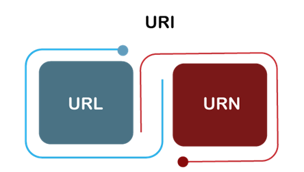
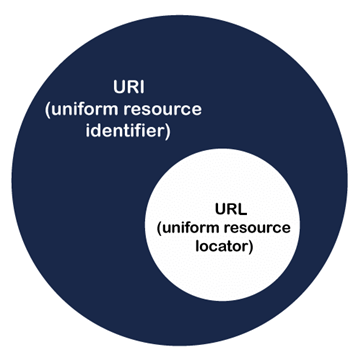
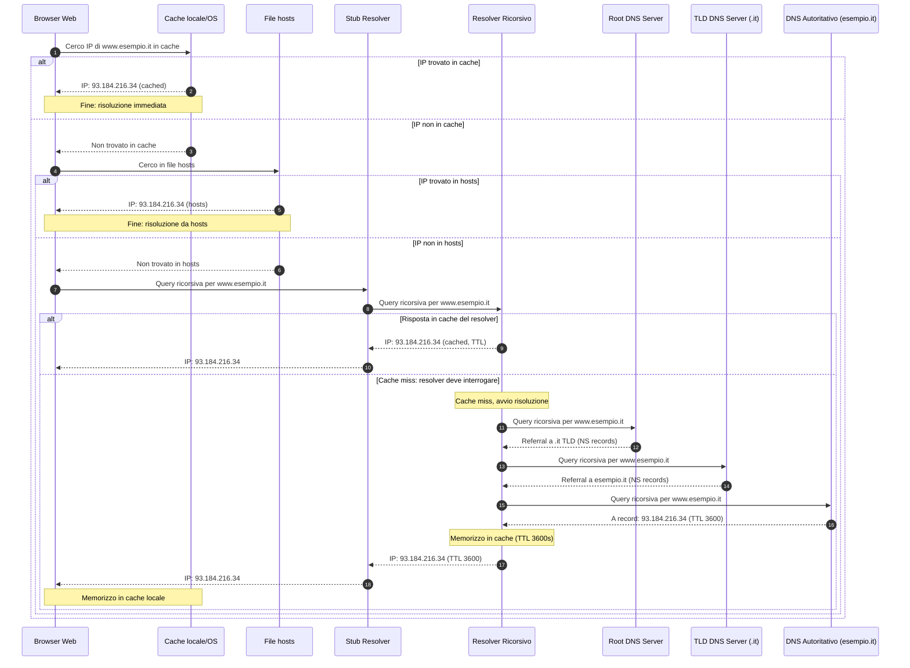
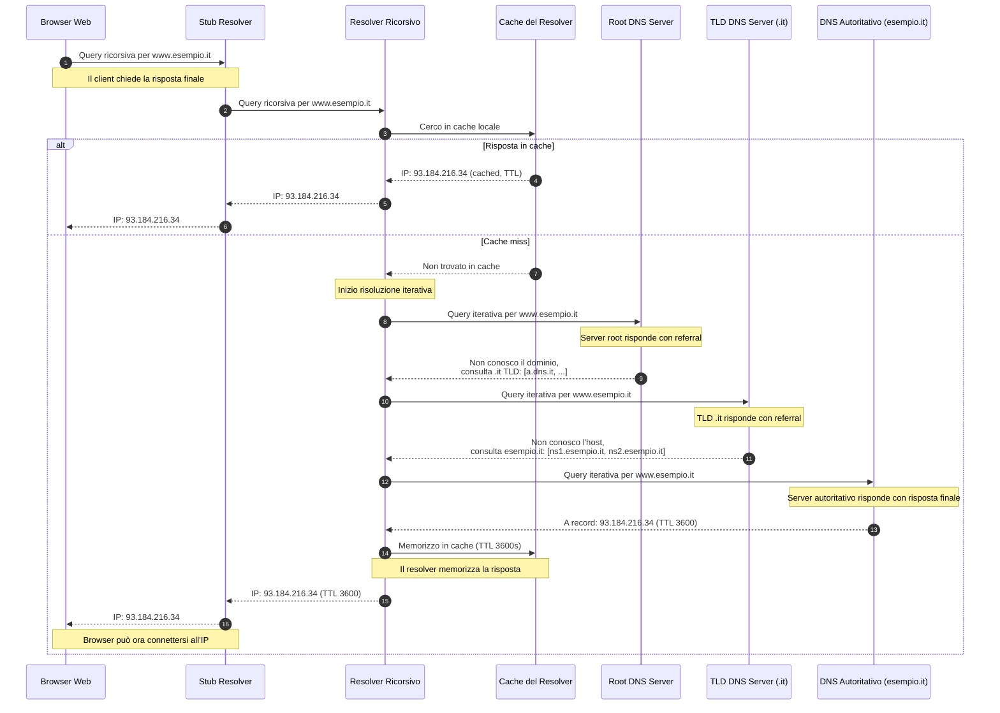
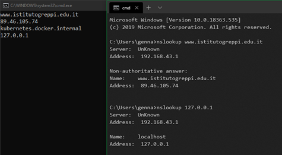
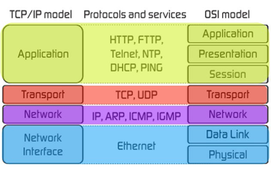

<style>
img {display: block; margin: 0 auto;}
</style>

## Introduzione alla programmazione di rete in .NET

### Introduzione

- [Network Programming](https://docs.microsoft.com/en-us/dotnet/framework/network-programming/)
- [HttpClient](https://docs.microsoft.com/en-us/dotnet/api/system.net.http.httpclient)

La piattaforma Microsoft .NET mette a disposizione un’implementazione a livelli, estendibile e gestita (managed) dei servizi Internet, integrabile in modo rapido nelle applicazioni. In particolare, le classi di accesso alla rete negli spazi dei nomi [`System.Net`](https://docs.microsoft.com/en-us/dotnet/api/system.net) e [`System.Net.Sockets`](https://docs.microsoft.com/en-us/dotnet/api/system.net.sockets) consentono di realizzare applicazioni Web e più in generale applicazioni basate su Internet.

### Applicazioni Internet

Le applicazioni Internet sono comunemente classificabili in due categorie generali:

- applicazioni **client**, che richiedono informazioni o servizi;
- applicazioni **server**, che rispondono alle richieste provenienti dai client.

Il caso classico di architettura client-server su Internet è il World Wide Web: gli utenti utilizzano un browser (client) per accedere a documenti e dati ospitati su server Web distribuiti.

Le applicazioni non si limitano necessariamente a uno solo di questi ruoli. Un tipico esempio è rappresentato da un server “intermedio” (middle-tier) che risponde alle richieste dei client interrogando a sua volta altri server: in tale scenario l’applicazione agisce sia da server (verso i client) sia da client (verso servizi a valle).

Un’applicazione client costruisce una richiesta identificando:

- la **risorsa** richiesta;
- il **protocollo** da utilizzare per richiesta e risposta.

Se necessario, il client include ulteriori informazioni (ad esempio configurazione del proxy o credenziali di autenticazione come nome utente e password). Una volta costruita, la richiesta può essere inviata al server.

### Identificazione delle risorse

Nel contesto della programmazione di rete, il .NET Framework utilizza un **URI** (*Uniform Resource Identifier*) per identificare una risorsa e, implicitamente o esplicitamente, il protocollo di comunicazione.

Riferimento introduttivo:

- [Uri vs Url](https://www.geeksforgeeks.org/computer-networks/difference-between-url-and-uri/)

#### Che cos’è un URI

Un **URI** (*Uniform Resource Identifier*) è una stringa che identifica una risorsa su una rete. L’identificazione può avvenire tramite **posizione**, **nome**, oppure entrambi.

Gli URI includono due sottoinsiemi concettuali:

- **URL** (*Uniform Resource Locator*), orientati alla localizzazione e al reperimento;
- **URN** (*Uniform Resource Name*), orientati all’identificazione per nome.

In pratica, nell’uso quotidiano si incontrano spesso URL e URN più che il termine “URI” in senso generico.



Un URI contiene tipicamente i seguenti elementi: **scheme**, **authority**, **path**, **query** e **fragment**. Alcuni scheme comuni sono HTTP/HTTPS, FTP, LDAP, Telnet e altri.

#### Sintassi di un URI

La sintassi generale di un URI è:

`scheme:[//authority]path[?query][#fragment]`

- **Scheme**: prima componente, indica il tipo di identificatore/protocollo. È una sequenza di caratteri (lettere, cifre, `+`, `-`, `_`) seguita da `:`. Esempi frequenti: `http`, `https`, `file`, `ftp`, `data`, `irc`.
- **Authority**: componente opzionale, preceduta da `//`. Include sottocomponenti quali:
  - **userinfo**: eventuale nome utente e password, separati da `:` e seguiti da `@`;
  - **host**: nome registrato o indirizzo IP (gli indirizzi IPv6 sono racchiusi tra `[]`);
  - **port**: opzionale.
- **Path**: sequenza di segmenti separati da `/`. Può anche essere vuoto.
- **Query**: opzionale, introdotta da `?`, contiene dati non gerarchici tipicamente in forma di coppie chiave/valore.
- **Fragment**: opzionale, introdotto da `#`, identifica una parte specifica della risorsa.

Esempi di URI:

1. `mailto:hey.Doe@example.com`
2. `news:comp.infosystems.www.servers.unix`
3. `urn:oasis:names:specification:docbook:dtd:xml:4.1.2`

#### Che cos’è un URL

Un **URL** (*Uniform Resource Locator*) è un tipo di URI utilizzato per individuare la **posizione** di una risorsa sul Web e il modo per accedervi. Un URL può riferirsi, ad esempio, a una pagina HTML, un documento CSS, un’immagine o altre risorse.

Un URL utilizza un protocollo (HTTP, HTTPS, FTP, …) per l’accesso. Nella pratica viene spesso chiamato “indirizzo del sito”, perché è quanto l’utente vede nella barra degli indirizzi del browser.

Esempio illustrativo:


Nota: **tutti gli URL sono URI**, ma **non tutti gli URI sono URL**, perché un URI può anche identificare una risorsa senza specificare un meccanismo di reperimento.



#### Sintassi di un URL

Ogni URL HTTP segue la sintassi generica dell’URI:

`scheme:[//authority]path[?query][#fragment]`

Componenti principali:

- **Scheme**: protocollo usato dal client (es. `http`, `https`).
- **Authority**: include tipicamente **nome di dominio** e (opzionalmente) **porta**, separati da `:`. Per convenzione: 80 per HTTP e 443 per HTTPS.
- **Path**: percorso della risorsa sul server (es. `/software/http/index.html`).
- **Query string**: opzionale, coppie chiave/valore dopo `?` (es. `?key1=value1&key2=value2`).
- **Fragment**: opzionale, dopo `#`, indica una porzione della risorsa.

#### Differenze principali tra URI e URL

- Un **URI** identifica una risorsa per **nome**, **posizione** o entrambi; un **URL** è un sottoinsieme di URI che identifica principalmente la **posizione** e il meccanismo di accesso.
- Un URI può essere usato anche in contesti non Web (XML, file locali, identificatori applicativi); un URL è tipicamente finalizzato alla localizzazione di risorse accessibili via rete.
- Ogni URL è un URI; non ogni URI è un URL.

Tabella riassuntiva:

| **URI** | **URL** |
| --- | --- |
| Acronimo di *Uniform Resource Identifier*. | Acronimo di *Uniform Resource Locator*. |
| Può identificare una risorsa per nome, posizione o entrambi (include URL e URN). | È un sottoinsieme degli URI che specifica la posizione e il protocollo di accesso. |
| Non tutti gli URI sono URL. | Tutti gli URL sono URI. |
| Obiettivo: identificare una risorsa e distinguerla univocamente. | Obiettivo: localizzare una risorsa e indicare come raggiungerla. |

Conclusione: un URI è un identificatore generale; un URL è un identificatore “localizzante”, orientato al reperimento.

#### Esempi e domande guidate su URI e URL

Di seguito sono riportate alcune risposte discorsive (in forma di esercizio) a domande tipiche sugli URI.

**Domanda:** «Fornire una descrizione esaustiva di URI e poi fare degli esempi di URI.»

Un **Uniform Resource Identifier (URI)** è una sequenza di caratteri che identifica in modo univoco una risorsa, sia astratta sia fisica, su una rete. Le risorse possono includere, a seconda del contesto, siti web, indirizzi e-mail, file o altri oggetti identificabili.

Componenti (richiamo):

1. **Schema (scheme)**: protocollo o tipo di identificatore (es. `https`, `mailto`).
2. **Autorità (authority)**: dominio/IP e, se presente, porta; può includere userinfo.
3. **Percorso (path)**: percorso verso la risorsa.
4. **Query**: parametri della richiesta.
5. **Frammento (fragment)**: porzione specifica della risorsa.

Esempi:

1. **URL (sottoinsieme di URI)**:
  
     - https://example.org/test/test1?search=test-question
     - Schema: `https`
     - Autorità: `example.org`
     - Percorso: `test/test1`
     - Query: `search=test-question`
  
2. **Indirizzo e-mail**:
  
     - `mailto:user@example.org`

3. **Identificatore di file**:

     - `file:///path/to/myfile.txt`

**Domanda:** «Qual è la differenza tra URL e URI?»

- Un **URI** identifica una risorsa, non necessariamente specificando come recuperarla.
- Un **URL** è un URI che specifica dove la risorsa è disponibile e come reperirla (protocollo + localizzazione).

In sintesi: tutti gli URL sono URI; non tutti gli URI sono URL.

**Domanda:** «Qual è un esempio di URI che non sia anche un URL?»

Esempi:

- **URN** (*Uniform Resource Name*): `urn:isbn:0451450523` identifica un libro tramite ISBN, ma non indica dove reperirlo.
- **Schemi applicativi**: `myapp:customer12345` può identificare un’entità interna a un’applicazione senza rappresentare un URL.

Ulteriori esempi (non esaustivi):

- `urn:uuid:f81d4fae-7dec-11d0-a765-00a0c91e6bf6`
- `mailto:info@example.com`
- `tel:+390212345678`

Riferimento tecnico (standard): [rfc3986](https://www.ietf.org/rfc/rfc3986.txt)

#### La classe System.Net.UriBuilder

Segue un esempio di creazione di URI in .NET:

```csharp
namespace UriTest;
public class Program
{
    public static Uri GetSimpleUri()
    {
        var builder = new UriBuilder
        {
            Scheme = "http",
            Host = "packt.com"
        };
        return builder.Uri;
    }
    public static Uri GetSimpleUri_Constructor()
    {
        var builder = new UriBuilder("http", "packt.com");
        return builder.Uri;
    }
    public static void Main(string[] args)
    {
        var simpleUri = GetSimpleUri();
        Console.WriteLine(simpleUri.ToString());
            // Expected output: http://packt.com
        var constructorUri = GetSimpleUri_Constructor();
        Console.WriteLine(constructorUri.ToString());
            // Expected output: http://packt.com
      
    }
}
```

#### Host: nomi di dominio e indirizzi IP

Un **indirizzo IP** è l’indirizzo numerico utilizzato dall’hardware e dal software di instradamento per raggiungere una risorsa in rete. È un identificatore univoco associato a una specifica interfaccia di rete in una specifica rete. Un **nome di dominio**, invece, è una stringa leggibile (composta da parole e caratteri alfanumerici) che rende l’indirizzamento più semplice, coerente e meno soggetto a errori rispetto a un IP “grezzo”.

Dal punto di vista funzionale, nome di dominio e indirizzo IP sono spesso intercambiabili: in molti contesti, dove è possibile utilizzare l’uno, è possibile utilizzare anche l’altro.

#### Il protocollo IP

IP (*Internet Protocol*) è il protocollo di rete che fornisce l’indirizzamento e l’instradamento dei pacchetti tra reti diverse.

- IP è **connectionless**: non stabilisce una sessione; ogni pacchetto è gestito in modo indipendente.
- Il servizio fornito è di tipo **best effort**: non garantisce consegna, ordine o assenza di duplicati.
- L’instradamento avviene tramite router che inoltrano i pacchetti in base all’**indirizzo IP di destinazione**.
- La frammentazione può avvenire (in IPv4) quando un pacchetto è più grande della MTU di un link; in IPv6 la frammentazione è demandata agli endpoint.

Rappresentazione ASCII (semplificata) di un pacchetto IPv4:

```text
+---------------------------------------------------------------------+
| IPv4 Header                                                         |
| Version | IHL | DSCP/ECN | Total Length                             |
| Identification | Flags | Fragment Offset                            |
| TTL | Protocol | Header Checksum                                    |
| Source Address (32)                                                 |
| Destination Address (32)                                            |
| Options (opzionale, variabile) ...                                  |
+---------------------------------------------------------------------+
| Payload (dati del livello superiore: TCP/UDP/ICMP/...) ...          |
+---------------------------------------------------------------------+
```

Rappresentazione ASCII (semplificata) di un pacchetto IPv6 (header base):

```text
+---------------------------------------------------------------------+
| IPv6 Base Header                                                    |
| Version | Traffic Class | Flow Label                                |
| Payload Length | Next Header | Hop Limit                            |
| Source Address (128)                                                |
| Destination Address (128)                                           |
+---------------------------------------------------------------------+
| Extension Headers (opzionali) ...                                   |
+---------------------------------------------------------------------+
| Payload (dati del livello superiore) ...                            |
+---------------------------------------------------------------------+
```

#### Indirizzi IPv4 e IPv6

- **IPv4** usa indirizzi a 32 bit, spesso rappresentati in formato decimale puntato (es. `192.168.1.10`). Lo spazio di indirizzamento limitato ha portato all’uso esteso di NAT e di subnet private.
- **IPv6** usa indirizzi a 128 bit, rappresentati in esadecimale con `:` (es. `2001:db8::1`). Offre uno spazio molto più ampio, supporta l’autoconfigurazione e riduce la necessità di NAT.
- In contesti moderni è comune la coesistenza tramite **dual stack**: la stessa macchina può usare IPv4 e IPv6; la risoluzione DNS può restituire record `A` (IPv4) e `AAAA` (IPv6).

#### DNS: risoluzione dei nomi

Il **DNS** (*Domain Name System*) è un sistema distribuito e gerarchico che associa nomi di dominio a informazioni, in particolare a indirizzi IP.

Dal punto di vista di un client, la risoluzione avviene tipicamente così:

- Il programma (browser/app) interroga uno **stub resolver** locale (sistema operativo o libreria). Lo stub resolver è un componente software leggero integrato nel sistema operativo o nell'applicazione stessa che non ha capacità di risoluzione completa: si limita a inoltrare le richieste a un resolver ricorsivo e a gestire la cache locale.
- Lo stub contatta un **resolver ricorsivo** (spesso quello del router o dell'ISP, o un resolver pubblico come 8.8.8.8 di Google o 1.1.1.1 di Cloudflare). Il resolver ricorsivo esegue la risoluzione "per conto" del client: è un server DNS completo con la capacità di interrogare l'intera gerarchia DNS.
- Se non ha risposta in cache, il resolver ricorsivo effettua query **iterative** seguendo la gerarchia: server **root** (punto `.`) → server **TLD** (es. `.it`, `.com`) → server **autoritativi** del dominio. In questo processo, ogni server consultato risponde con un "referral" (riferimento) al server successivo da interrogare, fino a raggiungere il server autoritativo che possiede la risposta definitiva.
- Il resolver ricorsivo restituisce al client il record richiesto (o un errore), e memorizza il risultato in **cache** secondo il TTL.

Per approfondimenti:

- [what is DNS?](https://aws.amazon.com/it/route53/what-is-dns/)
- [what is DNS? - video](https://youtu.be/e2xLV7pCOLI)
- [Comando `nslookup`](https://ss64.com/nt/nslookup.html)
- [Comando `ping`](https://ss64.com/nt/ping.html)
- Vedere anche il contenuto del file `hosts` in `C:\Windows\System32\Drivers\etc\hosts`.

Protocolli usati dal DNS:

- La forma tradizionale usa **UDP/53** per la maggior parte delle query.
- **TCP/53** viene usato in alcuni casi (risposte grandi, retry in fallback, trasferimenti di zona). In pratica molte implementazioni passano a TCP quando la risposta su UDP è troncata.
- Esistono varianti cifrate: **DoT** (*DNS over TLS*, tipicamente porta 853) e **DoH** (*DNS over HTTPS*, tipicamente porta 443), che incapsulano DNS in canali cifrati.

Tipi di query (concetti principali):

- **Ricorsiva**: il client chiede “dammi la risposta finale”; il resolver ricorsivo si occupa di consultare altri server.
- **Iterativa**: un server risponde con la “migliore informazione disponibile” (ad esempio un referral verso server più autoritativi) e chi interroga prosegue.
- Tipi di record più frequenti: `A` (IPv4), `AAAA` (IPv6), `CNAME` (alias), `NS` (nameserver), `MX` (mail), `TXT` (testo/metadata).

Meccanismi di cache (in sintesi):

- Cache a livello di applicazione/OS (dove presente) e soprattutto sul resolver ricorsivo.
- Ogni record DNS ha un **TTL** (*Time To Live*) che determina quanto tempo può restare in cache.
- È possibile anche la **negative caching** (memorizzazione temporanea di “nome inesistente” o errori), con durata controllata dalla configurazione della zona.

Gerarchia dei server DNS (vista logica, a partire dal root `.`):

```text
.
├─ Root name servers
│  ├─ (A-root, B-root, ...)
│  └─ (rispondono con referral ai TLD)
│
├─ TLD: .it
│  └─ Name servers autoritativi per .it (referral ai domini sotto .it)
│
├─ Dominio: esempio.it
│  └─ Name servers autoritativi di esempio.it
│     ├─ A / AAAA / CNAME / MX / TXT / ...
│     └─ (risposte finali per i nomi del dominio)
│
└─ Resolver ricorsivo (ISP / pubblico)
     ├─ riceve query ricorsive dai client
     ├─ consulta root/TLD/autoritativi con query iterative
     └─ cache delle risposte secondo TTL
```

##### Diagramma di sequenza: risoluzione DNS con query ricorsiva

Il seguente diagramma mostra il caso tipico di un browser web che risolve un nome di dominio utilizzando una **query ricorsiva**. Il browser delega completamente la risoluzione al resolver ricorsivo, che si occupa di consultare i server DNS necessari.



##### Diagramma di sequenza: risoluzione DNS con query iterativa

Il seguente diagramma mostra come funziona la risoluzione dal punto di vista del **resolver ricorsivo**, che utilizza **query iterative** per consultare i vari livelli della gerarchia DNS (root, TLD, autoritativo). Questo è il meccanismo interno con cui il resolver ricorsivo ottiene la risposta finale da restituire al client.



##### Spiegazione dettagliata dei diagrammi

**Differenza fondamentale tra query ricorsiva e iterativa:**

La distinzione tra query **ricorsiva** e **iterativa** è cruciale per comprendere il funzionamento del DNS:

- **Query ricorsiva**: il client (o stub resolver) chiede al resolver ricorsivo "dammi la risposta finale". Il resolver ricorsivo si assume la responsabilità completa di trovare la risposta, consultando tutti i server necessari, e restituisce solo il risultato finale al client. Il client non deve fare altro che attendere la risposta.

- **Query iterativa**: il resolver ricorsivo interroga i server DNS uno alla volta. Ogni server DNS consultato risponde con la "migliore informazione disponibile": se non conosce la risposta completa, fornisce un **referral** (riferimento) al server successivo da consultare. Il resolver ricorsivo segue questi referral fino a raggiungere il server autoritativo che possiede la risposta definitiva.

**Ruolo dello stub resolver:**

Lo **stub resolver** è un componente software leggero che:

- È integrato nel sistema operativo (Windows, Linux, macOS) o nell'applicazione stessa
- Non ha capacità di risoluzione completa: non può interrogare direttamente root, TLD o server autoritativi
- Si limita a:
  - Controllare la cache locale del sistema operativo
  - Consultare il file `hosts` locale (su Windows: `C:\Windows\System32\Drivers\etc\hosts`)
  - Inoltrare le richieste al resolver ricorsivo configurato (tipicamente tramite DHCP o configurazione manuale)
  - Gestire la cache locale delle risposte ricevute

Lo stub resolver invia sempre **query ricorsive** al resolver ricorsivo, delegando completamente il lavoro di risoluzione.

**Il resolver ricorsivo:**

Il **resolver ricorsivo** è un server DNS completo che:

- Riceve query ricorsive dai client (stub resolver)
- Gestisce una cache estesa e condivisa tra tutti i suoi client
- Quando necessario, esegue la risoluzione interrogando la gerarchia DNS mediante **query iterative**:
  1. Parte dai **root servers** (`.`)
  2. Segue i referral ai **TLD servers** (es. `.it`, `.com`)
  3. Segue i referral ai **server autoritativi** del dominio specifico (es. `esempio.it`)
  4. Riceve la risposta definitiva dal server autoritativo
- Memorizza le risposte in cache secondo il TTL di ciascun record
- Restituisce la risposta finale allo stub resolver (query ricorsiva completata)

**Meccanismi di cache (livelli multipli):**

La cache opera a diversi livelli per ottimizzare le prestazioni:

1. **Cache dell'applicazione**: alcune applicazioni (es. browser) mantengono una cache interna dei record DNS
2. **File hosts**: file locale che permette di definire associazioni nome-IP statiche, consultato prima di interrogare il DNS
3. **Cache del sistema operativo** (stub resolver): memorizza temporaneamente le risposte ricevute dal resolver ricorsivo
4. **Cache del resolver ricorsivo**: mantiene una cache più ampia e persistente, condivisa tra tutti i client che lo utilizzano

Ogni record DNS ha un **TTL** (*Time To Live*) che determina per quanto tempo può essere memorizzato in cache. Un TTL tipico può variare da pochi minuti (300s) a diverse ore (3600s o più).

**Esempio pratico del flusso completo:**

1. L'utente digita `www.esempio.it` nel browser
2. Il browser verifica la propria cache interna → cache miss
3. Il browser chiama l'API di sistema (stub resolver)
4. Lo stub resolver controlla:
   - Cache del sistema operativo → cache miss
   - File `hosts` → non presente
5. Lo stub resolver invia una **query ricorsiva** al resolver ricorsivo configurato (es. 8.8.8.8)
6. Il resolver ricorsivo controlla la propria cache → cache miss
7. Il resolver ricorsivo avvia il processo di risoluzione iterativa:
   - **Query iterativa** a un root server → risposta: "consulta il TLD .it"
   - **Query iterativa** al TLD .it → risposta: "consulta ns1.esempio.it"
   - **Query iterativa** a ns1.esempio.it → risposta: "A record: 93.184.216.34, TTL 3600"
8. Il resolver ricorsivo memorizza la risposta in cache (per 3600 secondi)
9. Il resolver ricorsivo restituisce la risposta allo stub resolver
10. Lo stub resolver memorizza la risposta nella cache di sistema
11. Il browser riceve l'IP e può stabilire la connessione

**Vantaggi di questo sistema a due livelli (ricorsivo + iterativo):**

- **Efficienza**: la cache del resolver ricorsivo serve molti client, riducendo drasticamente il carico sui server autoritativi
- **Separazione delle responsabilità**: i client (stub resolver) sono semplici e leggeri; la complessità della risoluzione è gestita dai resolver ricorsivi
- **Scalabilità**: i resolver ricorsivi possono essere distribuiti geograficamente (anycast) e gestire milioni di query
- **Resilienza**: se un server autoritativo è lento o non risponde, il resolver ricorsivo può ritentare o consultare server alternativi

In alcune situazioni è utile determinare programmaticamente gli IP associati a un nome di dominio. In .NET è disponibile la classe statica `Dns` nello spazio dei nomi `System.Net`, che consente di ottenere informazioni di directory (ad esempio un `IPHostEntry`) o l'elenco di indirizzi associati a un dominio.
Esempio:

```csharp
using System.Net;
namespace DnsTest;

internal class Program
{
    private static void Main(string[] args)
    {
        var domainEntry = Dns.GetHostEntry("google.com");
        Console.WriteLine(domainEntry.HostName);
        foreach (var ip in domainEntry.AddressList)
        {
            Console.WriteLine(ip);
        }
        var domainEntryByAddress = Dns.GetHostEntry("127.0.0.1");
        Console.WriteLine(domainEntryByAddress.HostName);
        foreach (var ip in domainEntryByAddress.AddressList)
        {
            Console.WriteLine(ip);
        }
    }
}
```

Oppure:

```csharp
using System.Net;
namespace DnsTest;

internal class Program
{
    private static void Main(string[] args)
    {
        var domainEntry = Dns.GetHostEntry("www.istitutogreppi.edu.it");
        Console.WriteLine(domainEntry.HostName);
        foreach (var ip in domainEntry.AddressList)
        {
            Console.WriteLine(ip);
        }
        var domainEntryByAddress = Dns.GetHostEntry("127.0.0.1");
        Console.WriteLine(domainEntryByAddress.HostName);
        foreach (var ip in domainEntryByAddress.AddressList)
        {
            Console.WriteLine(ip);
        }
    }
}
```

Si invita a confrontare il risultato con quanto ottenuto dal comando `nslookup` della shell di Windows.


#### Modelli di riferimento di rete

- [Suite di protocolli Internet](https://it.wikipedia.org/wiki/)Suite_di_protocolli_Internet
- [Standard HTTP](https://www.rfc-editor.org/rfc/rfc9110)



Lo strato **applicativo** è quello in cui, nella maggior parte dei casi, avviene la programmazione di rete “quotidiana”. Ciò è particolarmente vero nel contesto .NET, perché le librerie del framework forniscono astrazioni di livello alto e facilmente utilizzabili per molte responsabilità che, nei modelli a strati, ricadrebbero più in basso nello stack.

In altri termini: qualora sia necessario specificare un comportamento che si colloca al di sotto dello strato applicativo, nella pratica lo si fa spesso tramite proprietà, opzioni e classi esposte dalle librerie .NET, che incapsulano i dettagli implementativi dei livelli sottostanti.

### TCP

- [Transmission Control Protocol - TCP](https://it.wikipedia.org/wiki/Transmission_Control_Protocol)

TCP (*Transmission Control Protocol*) è un protocollo di trasporto **connection-oriented** e affidabile.

- Offre un flusso di byte ordinato, con **ritrasmissioni** e **controllo di congestione** per compensare perdite e congestione.
- Identifica gli endpoint con coppie (**IP**, **porta**) e multiplexa più conversazioni contemporanee.
- La connessione si instaura con un **three-way handshake** (SYN, SYN-ACK, ACK) e si chiude con scambio di FIN/ACK.
- L’affidabilità si basa su **numeri di sequenza** e **acknowledgment**, oltre a una finestra di ricezione (flow control).
- I segmenti TCP includono flag (SYN/ACK/FIN/RST) che descrivono lo stato della sessione e le intenzioni dei peer.
- TCP non preserva i “messaggi” applicativi: l’applicazione definisce come delimitare le unità logiche nel flusso.

Formato del segmento TCP (campi essenziali, vista semplificata):

```text
+---------------------------------------------------------------+
| TCP Segment Header (minimo 20 byte, semplificato)             |
| Source Port (16) | Destination Port (16)                      |
| Sequence Number (32)                                          |
| Acknowledgment Number (32)                                    |
| DataOffset | Flags (SYN ACK FIN RST PSH URG ...) | Window     |
| Checksum (16) | Urgent Pointer (16)                           |
| Options (0..40 byte) ...                                      |
+---------------------------------------------------------------+
```

Messaggi principali per l’instaurazione della connessione (three-way handshake):

```text
+---------------------------------------------------------------+
| Client -> Server : SYN                                        |
|   SrcPort, DstPort, Seq = x, Ack = 0, Flags = SYN             |
+---------------------------------------------------------------+
| Server -> Client : SYN-ACK                                    |
|   SrcPort, DstPort, Seq = y, Ack = x+1, Flags = SYN|ACK       |
+---------------------------------------------------------------+
| Client -> Server : ACK                                        |
|   SrcPort, DstPort, Seq = x+1, Ack = y+1, Flags = ACK         |
+---------------------------------------------------------------+
```

Messaggi principali per la chiusura ordinata (terminazione, caso comune):

```text
+---------------------------------------------------------------+
| Peer A -> Peer B : FIN, ACK                                   |
| Peer B -> Peer A : ACK                                        |
| Peer B -> Peer A : FIN, ACK                                   |
| Peer A -> Peer B : ACK                                        |
+---------------------------------------------------------------+
```

### UDP

- [User Datagram Protocol - UDP](https://it.wikipedia.org/wiki/User_Datagram_Protocol)

UDP (*User Datagram Protocol*) è un protocollo di trasporto **connectionless** e leggero.

- Non prevede handshake: l’invio è immediato e ogni datagramma è indipendente dagli altri.
- Non garantisce consegna, ordine o unicità: perdite, duplicati e riordino sono possibili.
- È adatto quando si preferisce latenza bassa e overhead minimo, oppure quando l’applicazione gestisce l’affidabilità.
- L’header è molto piccolo (8 byte) e include solo porte, lunghezza e checksum.
- Il checksum (quando usato) contribuisce a rilevare corruzione; la gestione dell’errore resta a carico dell’applicazione.
- Esempi tipici includono DNS, streaming/telemetria e protocolli real-time che tollerano perdite.

Formato del datagramma UDP (campi essenziali):

```text
+---------------------------------------------------------------+
| UDP Datagram Header (8 byte)                                  |
| Source Port (16) | Destination Port (16)                      |
| Length (16)      | Checksum (16)                              |
+---------------------------------------------------------------+
| Payload (dati applicativi) ...                                |
+---------------------------------------------------------------+
```

Messaggi principali (invio e ricezione: stessa struttura, cambia solo la direzione):

```text
+---------------------------------------------------------------+
| Sender -> Receiver : UDP Datagram                             |
|   SrcPort, DstPort, Length, Checksum, Payload                 |
|   es: 53000 -> 53, Payload = query DNS                        |
+---------------------------------------------------------------+
| Receiver -> Sender : UDP Datagram (risposta applicativa)      |
|   SrcPort, DstPort, Length, Checksum, Payload                 |
|   es: 53 -> 53000, Payload = risposta DNS                     |
+---------------------------------------------------------------+
```


### Elenco di porte “well-known”

I numeri di porta variano da 0 a 65535, ma solo le porte da 0 a 1023 sono riservate a servizi privilegiati e sono designate come **well-known ports**. La seguente tabella riporta alcune porte note e il servizio tipicamente associato.

| Port Number | Description |
| --- |  --- |
| 1 | [TCP](https://www.webopedia.com/TERM/T/TCP.html) Port Service Multiplexer (TCPMUX) |
| 5 | Remote Job Entry (RJE) |
| 7 | ECHO |
| 18 | Message Send Protocol (MSP) |
| 20 | [FTP](https://www.webopedia.com/TERM/F/ftp.html) -- Data |
| 21 | FTP -- Control |
| 22 | [SSH](https://www.webopedia.com/TERM/S/SSH.html) Remote Login Protocol |
| 23 | [Telnet](https://www.webopedia.com/TERM/S/Telnet.html) |
| 25 | [Simple Mail Transfer Protocol](https://www.webopedia.com/TERM/S/SMTP.html) (SMTP) |
| 29 | MSG ICP |
| 37 | Time |
| 42 | Host Name Server (Nameserv) |
| 43 | WhoIs |
| 49 | Login Host Protocol (Login) |
| 53 | [Domain Name System](https://www.webopedia.com/TERM/D/DNS.html) (DNS) |
| 69 | [Trivial File Transfer Protocol](https://www.webopedia.com/TERM/T/TFTP.html) (TFTP) |
| 70 | [Gopher](https://www.webopedia.com/TERM/G/gopher.html) Services |
| 79 | [Finger](https://www.webopedia.com/TERM/F/Finger.html) |
| 80 | [HTTP](https://www.webopedia.com/TERM/H/HTTP.html) |
| 103 | [X.400](https://www.webopedia.com/TERM/X/X_400.html) Standard |
| 108 | SNA Gateway Access Server |
| 109 | POP2 |
| 110 | [POP3](https://www.webopedia.com/TERM/P/POP2.html) |
| 115 | Simple File Transfer Protocol (SFTP) |
| 118 | SQL Services |
| 119 | Newsgroup ([NNTP](https://www.webopedia.com/TERM/N/NNTP.html)) |
| 137 | [NetBIOS](https://www.webopedia.com/TERM/N/NetBIOS.html) Name Service |
| 139 | NetBIOS Datagram Service |
| 143 | Interim Mail Access Protocol (IMAP) |
| 150 | NetBIOS Session Service |
| 156 | [SQL Server](https://www.webopedia.com/TERM/S/SQL_Server.html) |
| 161 | [SNMP](https://www.webopedia.com/TERM/S/SNMP.html) |
| 179 | [Border Gateway Protocol](https://www.webopedia.com/TERM/B/BGP.html) (BGP) |
| 190 | Gateway Access Control Protocol (GACP) |
| 194 | [Internet Relay Chat](https://www.webopedia.com/TERM/I/IRC.html) (IRC) |
| 197 | Directory Location Service (DLS) |
| 389 | [Lightweight Directory Access Protocol](https://www.webopedia.com/TERM/L/LDAP.html) (LDAP) |
| 396 | Novell Netware over IP |
| 443 | [HTTPS](https://www.webopedia.com/TERM/S/SSL.html) |
| 444 | Simple Network Paging Protocol (SNPP) |
| 445 | Microsoft-DS |
| 458 | Apple [QuickTime](https://www.webopedia.com/TERM/Q/QuickTime.html) |
| 546 | [DHCP](https://www.webopedia.com/TERM/D/DHCP.html) Client |
| 547 | DHCP Server |
| 563 | SNEWS |
| 569 | MSN |
| 1080 | Socks |

Classificazione delle porte:

- **Well-known ports**: 0–1023
- **Registered ports**: 1024–49151
- **Dynamic / private ports**: 49152–65535

Per ulteriori dettagli: [RFC 1700 (storico)](http://www.ietf.org/rfc/rfc1700.txt?number=1700)

### HTTP: comunicazione applicazione–applicazione

- [Standard HTTP](https://www.rfc-editor.org/rfc/rfc9110)
- [Guida introduttiva](https://developer.mozilla.org/en-US/docs/Web/HTTP)

HTTP è il protocollo applicativo più diffuso per l’interazione tra applicazioni in rete: è il protocollo con cui i browser richiedono pagine e risorse ai server Web e con cui molte applicazioni (anche mobile) consumano API esposte su Internet.

HTTP è un protocollo dello strato applicativo (nel modello OSI) progettato per il trasferimento di **ipermedia** su una rete. Il trasferimento avviene secondo il modello **request/response**, assumendo una relazione client-server.

#### Request/response

Quando un client invia una richiesta a un server, il server deve rispondere comunicando:

- l’esito della richiesta (successo/errore);
- eventuali dati richiesti.

In alcune situazioni, la soddisfazione completa di una richiesta può richiedere diversi scambi intermedi (ad esempio per stabilire connessioni o negoziare parametri). Dal punto di vista dell’applicazione, tale sequenza è comunque considerata un’unica sessione logica request/response.

#### Sessioni HTTP

Lo scambio request/response avviene tipicamente su una sessione sottostante. Storicamente la sessione è stata associata a una connessione TCP stabilita verso una porta del server. La porta può essere specificata nell’URI, ma spesso si usano porte di default (ad esempio 80 per HTTP o 443 per HTTPS; in alcuni contesti anche 8080).

#### Metodi di richiesta (HTTP verbs)

Quando un client invia una richiesta, deve specificare il metodo. I principali metodi standard sono:

- **OPTIONS**: restituisce l’elenco dei metodi supportati dal server per l’URL indicato.
- **TRACE**: effettua l’echo della richiesta come ricevuta dal server, utile per diagnosticare modifiche avvenute in transito.
- **CONNECT**: stabilisce un tunnel TCP/IP trasparente tra host originante e host remoto.
- **GET**: recupera una copia della risorsa identificata dall’URL. Per convenzione non produce effetti collaterali sullo stato server.
- **HEAD**: come GET, ma senza corpo della risposta (solo header).
- **POST**: trasmette dati nel corpo della richiesta e richiede al server di memorizzarli come nuova risorsa.
- **PUT**: richiede la memorizzazione del corpo; se la risorsa esiste già, viene aggiornata/sostituita.
- **PATCH**: aggiorna parzialmente una risorsa esistente usando il corpo della richiesta.
- **DELETE**: elimina la risorsa identificata dall’URL.

Un server risponde a un metodo solo se è configurato per farlo. Alcuni metodi possono modificare in modo permanente lo stato delle risorse e devono quindi essere gestiti in modo controllato. Per convenzione, alcuni metodi sono considerati “sicuri” (senza effetti collaterali): **HEAD**, **GET**, **OPTIONS** e **TRACE**.

#### Codici di stato (status codes)

Le risposte HTTP includono un codice di stato numerico a 3 cifre. La prima cifra identifica una categoria generale:

- **1XX**: informativi (richiesta ricevuta, elaborazione in corso).
- **2XX**: successo.
- **3XX**: redirezione.
- **4XX**: errore lato client (richiesta malformata, risorsa non accessibile, ecc.).
- **5XX**: errore lato server (il client ha inviato correttamente, ma il server non riesce a soddisfare la richiesta).

La corretta gestione dei codici di stato è essenziale per interoperabilità e robustezza delle applicazioni.

#### Formato dei messaggi HTTP

Richieste e risposte HTTP sono trasmesse come messaggi di testo strutturati.

Una richiesta contiene:

- **Request line**: metodo, path e versione del protocollo (es.: `GET /users/id/12 HTTP/1.1`).
- **Header**: coppie chiave/valore (es.: `Accept: application/json`).
- **Riga vuota**.
- **(Opzionale) Body**: intestazioni del contenuto + contenuto.

Rappresentazione grafica (puro testo) del formato di una richiesta HTTP:

```text
+---------------------------------------------------------------+
| Request-Line                                                  |
|   METHOD SP request-target SP HTTP-version                    |
|   es: GET /users/12 HTTP/1.1                                  |
+---------------------------------------------------------------+
| Headers (0..n righe)                                          |
|   Host: example.com                                           |
|   Accept: application/json                                    |
|   Content-Type: application/json                              |
|   Content-Length: 18                                          |
+---------------------------------------------------------------+
| Riga vuota (termina gli header)                               |
|   <CR><LF>                                                    |
+---------------------------------------------------------------+
| Body (opzionale)                                              |
|   {"id":12,"name":"Ada"}                                      |
+---------------------------------------------------------------+
Nota: `SP` indica un singolo carattere spazio (ASCII 0x20). Ogni riga (Request-Line e ciascun header) termina con `<CR><LF>`.
```

I segmenti sono delimitati dai caratteri di controllo `<CR>` (carriage return) e `<LF>` (line feed), secondo la codifica ASCII, così da essere parsabili in modo affidabile.

Una risposta contiene:

- **Status line**: versione, status code e reason phrase (es.: `HTTP/1.1 401 Bad Request`, `HTTP/2.0 201 Created`).
- **Header**.
- **Riga vuota**.
- **(Opzionale) Body**.

Rappresentazione grafica (puro testo) del formato di una risposta HTTP:

```text
+---------------------------------------------------------------+
| Status-Line                                                   |
|   HTTP-version SP status-code SP reason-phrase                |
|   es: HTTP/1.1 200 OK                                         |
+---------------------------------------------------------------+
| Headers (0..n righe)                                          |
|   Date: Tue, 06 Jan 2026 12:00:00 GMT                         |
|   Content-Type: application/json                              |
|   Content-Length: 18                                          |
+---------------------------------------------------------------+
| Riga vuota (termina gli header)                               |
|   <CR><LF>                                                    |
+---------------------------------------------------------------+
| Body (opzionale)                                              |
|   {"id":12,"name":"Ada"}                                      |
+---------------------------------------------------------------+
Nota: come per la richiesta, `SP` indica un singolo carattere spazio (ASCII 0x20) e ogni riga termina con `<CR><LF>`.
```

Questa struttura semplice è alla base di un volume enorme di scambi tra dispositivi in rete.

#### HTTP in `C#`

Sebbene sia possibile costruire messaggi HTTP “a mano”, in .NET lo spazio dei nomi `System.Net.Http` fornisce astrazioni e tipi pronti all’uso (metodi, header, codici di stato, gestione del ciclo di vita delle richieste) per lavorare con HTTP in modo sicuro ed efficace.

### Altri protocolli applicativi comuni

#### FTP e FTPS

- [File Transfer Protocol -FTP](https://it.wikipedia.org/wiki/File_Transfer_Pro Altri protocolli applicativi comunitocol)
- [FTP Secure - FTPS](https://it.wikipedia.org/wiki/FTPS)

FTP (*File Transfer Protocol*) è un protocollo applicativo orientato al trasferimento di file in architettura client/server.

- In FTP la comunicazione avviene tipicamente tramite un **canale di controllo** (comandi/risposte) e un **canale dati** (contenuto trasferito).
- Il canale di controllo usa messaggi testuali con terminazione `CRLF` e risposte con codice numerico a 3 cifre.
- Il canale dati può essere instaurato in **active mode** o **passive mode**, cambiando chi apre la connessione verso la porta dati.
- FTP in chiaro non protegge credenziali e contenuto: è adatto solo a reti fidate o a casi non sensibili.
- **FTPS** è FTP “incapsulato” in TLS: protegge autenticazione e dati tramite cifratura e integrità.
- FTPS può essere **esplicito** (upgrade con `AUTH TLS`) oppure **implicito** (TLS attivo fin dall’inizio della sessione).

Messaggi principali sul canale di controllo (FTP):

Legenda (diagrammi ASCII):

- **Client**: applicazione che avvia la connessione e invia i comandi.
- **Server**: servizio remoto che risponde ai comandi.
- **Peer A / Peer B**: due endpoint generici (quando non si vuole assumere un ruolo client/server).

```text
+---------------------------------------------------------------+
| Client -> Server : FTP Command                                |
|   command [SP argument] CRLF                                  |
|   es: USER mario CRLF                                         |
|       PASS ******** CRLF                                      |
|       RETR report.pdf CRLF                                    |
|       STOR upload.bin CRLF                                    |
+---------------------------------------------------------------+
| Server -> Client : FTP Reply                                  |
|   status-code SP text CRLF                                    |
|   es: 220 Service ready CRLF                                  |
|       331 User name ok, need password CRLF                    |
|       230 User logged in CRLF                                 |
|       150 File status ok; about to open data connection CRLF  |
|       226 Closing data connection CRLF                        |
+---------------------------------------------------------------+
```

Messaggi principali per l’avvio della cifratura (FTPS esplicito):

```text
+---------------------------------------------------------------+
| Client -> Server : AUTH TLS CRLF                              |
| Server -> Client : 234 AUTH command ok. Initializing TLS CRLF |
+---------------------------------------------------------------+
| TLS Handshake (sul canale di controllo, semplificato)         |
| Client -> Server : ClientHello                                |
| Server -> Client : ServerHello, Certificate, ...              |
| Client -> Server : Finished                                   |
| Server -> Client : Finished                                   |
+---------------------------------------------------------------+
| (Dopo TLS) comandi/risposte FTP viaggiano cifrati             |
+---------------------------------------------------------------+
```

#### SMTP

- [Simple Mail Transfer Protocol - SMTP](https://it.wikipedia.org/wiki/Simple_Mail_Transfer_Protocol)

SMTP (*Simple Mail Transfer Protocol*) è il protocollo applicativo usato per l’**invio** e l’inoltro delle e-mail tra client e server e tra server di posta.

- È tipicamente basato su **TCP** e su scambi testuali terminati da `CRLF`.
- È usato soprattutto per la consegna “in uscita” (submission/invio e relay); la lettura della posta è demandata ad altri protocolli (IMAP/POP3).
- Le risposte del server includono **codici a 3 cifre** (ad es. `220`, `250`, `354`, `550`) e un testo descrittivo.
- La sessione prevede una fase di saluto/capacità (`EHLO`) seguita dai comandi di invio (`MAIL FROM`, `RCPT TO`, `DATA`).
- La cifratura può avvenire con **STARTTLS** (upgrade della sessione) o tramite porte dedicate (SMTPS/submission TLS).

Messaggi principali per l’invio di un messaggio (SMTP, flusso tipico):

```text
+----------------------------------------------------------------+
| Server -> Client : 220 Service ready                           |
+----------------------------------------------------------------+
| Client -> Server : EHLO client.example                         |
| Server -> Client : 250- capabilities...                        |
| Server -> Client : 250 OK                                      |
+----------------------------------------------------------------+
| (Opzionale) upgrade TLS                                        |
| Client -> Server : STARTTLS                                    |
| Server -> Client : 220 Ready to start TLS                      |
| [TLS handshake]                                                |
| Client -> Server : EHLO client.example                         |
+----------------------------------------------------------------+
| Client -> Server : MAIL FROM:<mittente@example.com>            |
| Server -> Client : 250 OK                                      |
| Client -> Server : RCPT TO:<destinatario@example.com>          |
| Server -> Client : 250 OK                                      |
| Client -> Server : DATA                                        |
| Server -> Client : 354 End data with <CRLF>.<CRLF>             |
+----------------------------------------------------------------+
| Client -> Server : (headers + body)                            |
|   From: mittente@example.com                                   |
|   To: destinatario@example.com                                 |
|   Subject: Prova                                               |
|   <CRLF>                                                       |
|   Testo del messaggio...                                       |
|   <CRLF>.<CRLF>                                                |
| Server -> Client : 250 Message accepted for delivery           |
+----------------------------------------------------------------+
| Client -> Server : QUIT                                        |
| Server -> Client : 221 Bye                                     |
+----------------------------------------------------------------+
```

Nota: i messaggi SMTP sono “righe” testuali; per separare le parole nei comandi si usa lo spazio (come in HTTP). Nella fase `DATA` il terminatore `.<CRLF>` su una riga propria conclude il contenuto.

#### IMAP

- [Internet Message Access Protocol - IMAP](https://it.wikipedia.org/wiki/Internet_Message_Access_Protocol)

IMAP (*Internet Message Access Protocol*) è un protocollo applicativo per l’**accesso** alla posta sul server.

- È progettato per mantenere i messaggi sul server e sincronizzare cartelle (Inbox, Sent, ecc.).
- Supporta accesso concorrente e operazioni “remote”: ricerca, flag, fetch parziale, gestione cartelle.
- È basato su TCP e su comandi testuali; molte risposte includono righe “untagged” (`*`).
- I comandi del client hanno un **tag** (es. `A001`) usato dal server per correlare la risposta finale.
- La cifratura si usa tipicamente con **IMAPS** (porta 993) o con `STARTTLS` su porta 143.

Messaggi principali (IMAP, flusso tipico semplificato):

```text
+-----------------------------------------------------------------+
| Server -> Client : * OK IMAP4rev1 Service Ready                 |
+-----------------------------------------------------------------+
| Client -> Server : A001 LOGIN user@example.com ********         |
| Server -> Client : A001 OK LOGIN completed                      |
+-----------------------------------------------------------------+
| Client -> Server : A002 SELECT INBOX                            |
| Server -> Client : * FLAGS (\Seen \Answered \Flagged ...)       |
| Server -> Client : * 3 EXISTS                                   |
| Server -> Client : A002 OK [READ-WRITE] SELECT completed        |
+-----------------------------------------------------------------+
| Client -> Server : A003 FETCH 1 (FLAGS BODY.PEEK[HEADER])       |
| Server -> Client : * 1 FETCH (FLAGS (\Seen) BODY[HEADER] {...}) |
| Server -> Client : A003 OK FETCH completed                      |
+-----------------------------------------------------------------+
| Client -> Server : A004 LOGOUT                                  |
| Server -> Client : * BYE                                        |
| Server -> Client : A004 OK LOGOUT completed                     |
+-----------------------------------------------------------------+
```

#### POP3

- [Post Office Protocol - POP3](https://it.wikipedia.org/wiki/Post_Office_Protocol)

POP3 (*Post Office Protocol v3*) è un protocollo applicativo per il prelievo della posta, spesso in modalità “scarica e gestisci in locale”.

- È più semplice di IMAP: tipicamente elenca e scarica messaggi da una singola mailbox.
- Le risposte del server sono generalmente `+OK` (successo) o `-ERR` (errore).
- Alcuni comandi producono risposte multi-linea terminate da una riga contenente solo `.`.
- La cifratura si usa con **POP3S** (porta 995) o con `STLS` (STARTTLS) su porta 110.
- La gestione di cartelle e la sincronizzazione avanzata non sono obiettivi primari di POP3.

Messaggi principali (POP3, flusso tipico semplificato):

```text
+-----------------------------------------------------------------+
| Server -> Client : +OK POP3 server ready                        |
+-----------------------------------------------------------------+
| Client -> Server : USER user@example.com                        |
| Server -> Client : +OK                                          |
| Client -> Server : PASS ********                                |
| Server -> Client : +OK mailbox locked and ready                 |
+-----------------------------------------------------------------+
| Client -> Server : STAT                                         |
| Server -> Client : +OK 2 3200                                   |
+-----------------------------------------------------------------+
| Client -> Server : RETR 1                                       |
| Server -> Client : +OK 1200 octets                              |
| Server -> Client : (contenuto messaggio...)                     |
| Server -> Client : .                                            |
+-----------------------------------------------------------------+
| Client -> Server : QUIT                                         |
| Server -> Client : +OK bye                                      |
+-----------------------------------------------------------------+
```

#### SSH

- [Secure Shell - SSH](https://it.wikipedia.org/wiki/Secure_Shell)

SSH (*Secure Shell*) è un protocollo per accesso remoto sicuro e tunneling, costruito sopra TCP (tipicamente porta 22).

- Fornisce **cifratura**, **integrità** e **autenticazione** (password, chiavi pubbliche, ecc.).
- Il canale di trasporto negozia algoritmi (key exchange, cifrari, MAC) e stabilisce chiavi di sessione.
- Sopra il trasporto, SSH multiplexa **canali** logici (shell, exec, port forwarding, SFTP).
- A differenza di protocolli testuali “puri”, molti messaggi SSH sono binari; un diagramma utile è quello delle fasi principali.
- La sicurezza dipende anche dalla verifica dell’identità del server (host key) e dalla gestione delle chiavi client.

Messaggi principali (SSH, fasi di sessione semplificate):

```text
+----------------------------------------------------------------+
| Identificazione (stringhe in chiaro)                           |
| Client -> Server : SSH-2.0-client                              |
| Server -> Client : SSH-2.0-server                              |
+----------------------------------------------------------------+
| Negoziazione algoritmi e Key Exchange (binario, semplificato)  |
| Client -> Server : SSH_MSG_KEXINIT                             |
| Server -> Client : SSH_MSG_KEXINIT                             |
| Client -> Server : SSH_MSG_KEX_ECDH_INIT (o simile)            |
| Server -> Client : SSH_MSG_KEX_ECDH_REPLY + host key           |
| Client -> Server : SSH_MSG_NEWKEYS                             |
| Server -> Client : SSH_MSG_NEWKEYS                             |
+----------------------------------------------------------------+
| Autenticazione utente (binario, semplificato)                  |
| Client -> Server : SSH_MSG_SERVICE_REQUEST (ssh-userauth)      |
| Server -> Client : SSH_MSG_SERVICE_ACCEPT                      |
| Client -> Server : SSH_MSG_USERAUTH_REQUEST (password/key)     |
| Server -> Client : SSH_MSG_USERAUTH_SUCCESS (o FAILURE)        |
+----------------------------------------------------------------+
| Apertura canale (es. shell/exec)                               |
| Client -> Server : SSH_MSG_CHANNEL_OPEN (session)              |
| Server -> Client : SSH_MSG_CHANNEL_OPEN_CONFIRMATION           |
| Client <-> Server : SSH_MSG_CHANNEL_DATA / WINDOW_ADJUST ...   |
+----------------------------------------------------------------+
```
