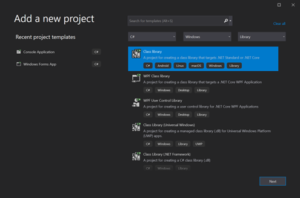
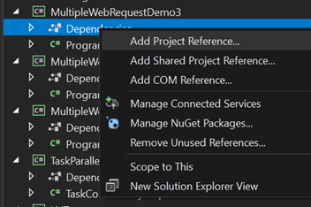
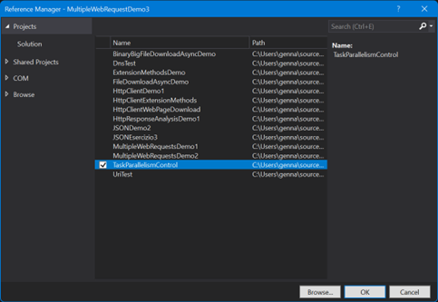
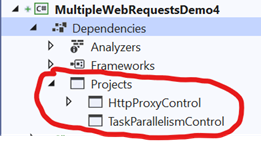
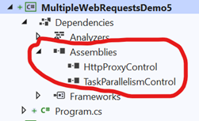
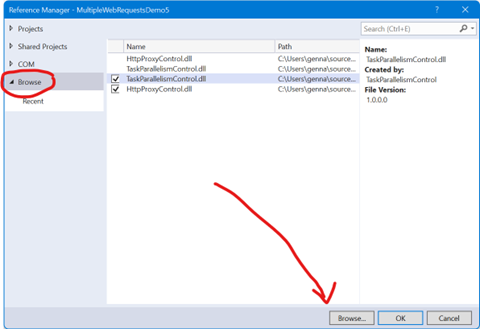

<style>
img {display: block; margin: 0 auto;}
</style>

## Richieste e risposte HTTP in .NET

[Network programming in .NET](https://learn.microsoft.com/en-us/dotnet/fundamentals/networking/overview)

### Generalità

#### Costruzione di un oggetto URI

```csharp
using System;
using System.Collections.Generic;
using System.Linq;
using System.Text;
using System.Threading.Tasks;
using System.Threading;
namespace UriTest
{
    public class UriTestProgram
    {
        public static Uri GetSimpleUri()
        {
            var builder = new UriBuilder();
            builder.Scheme = "http";
            builder.Host = "packt.com";
            return builder.Uri;
        }
        public static Uri GetSimpleUri_Constructor()
        {
            var builder = new UriBuilder("http", "packt.com");
            return builder.Uri;
        }
        public static void Main(string[] args)
        {
            var simpleUri = GetSimpleUri();
            Console.WriteLine(simpleUri.ToString());
            // Expected output: http://packt.com
            var constructorUri = GetSimpleUri_Constructor();
            Console.WriteLine(constructorUri.ToString());
            // Expected output: http://packt.com
        }
    }
}
```

#### Caricamento e download dei dati da un server Internet

### HttpClient

[Documentazione su HttpClient](https://learn.microsoft.com/en-us/dotnet/api/system.net.http.httpclient)

#### Scaricare del testo dalla rete

```csharp
using System.Runtime.InteropServices;
using Microsoft.Win32;
using System.Net;
namespace HttpClientDemo1
{
    class Program
    {
        // HttpClient is intended to be instantiated once per application, rather than per-use. See Remarks.
        static HttpClient? client;
        static async Task Main()
        {
            client = new HttpClient();
            // Call asynchronous network methods in a try/catch block to handle exceptions.
            try
            {
                HttpResponseMessage response = await client.GetAsync("https://www.istitutogreppi.edu.it/");
                response.EnsureSuccessStatusCode();
                string responseBody = await response.Content.ReadAsStringAsync();
                // Above three lines can be replaced with new helper method below
                // string responseBody = await client.GetStringAsync(uri);
                Console.WriteLine(responseBody);
            }
            catch (HttpRequestException e)
            {
                Console.WriteLine("\nException Caught!");
                Console.WriteLine("Message :{0} ", e.Message);
            }
        }
    }
}
```

Un’istanza della classe [HttpClient](https://learn.microsoft.com/en-us/dotnet/api/system.net.http.httpclient) rappresenta una sessione per l’invio di richieste HTTP. Essa incapsula una collezione di impostazioni che vengono applicate a tutte le richieste eseguite tramite quell’istanza. Inoltre, ogni `HttpClient` mantiene un proprio pool di connessioni, isolando le proprie richieste da quelle eseguite da altre istanze.

La classe `HttpClient` può essere anche una classe base per client HTTP più specifici (ad esempio un client dedicato a un particolare servizio). In tale caso, in genere non si sovrascrivono i metodi virtuali della classe base; si preferisce invece utilizzare un costruttore che accetti un [HttpMessageHandler](https://learn.microsoft.com/en-us/dotnet/api/system.net.http.httpmessagehandler) per configurare la pipeline di gestione delle richieste.

:::note
È prassi raccomandata istanziare `HttpClient` una sola volta e riutilizzarlo per tutta la vita dell’applicazione. La creazione di una nuova istanza per ogni richiesta può portare, sotto carico, all’esaurimento delle socket disponibili e a eccezioni di tipo `SocketException`.
:::

```csharp
public class GoodController : ApiController
{
    private static readonly HttpClient HttpClient;
    static GoodController()
    {
        HttpClient = new HttpClient();
    }
}
```

Di seguito è riportata una versione ottimizzata del precedente esempio che fa uso del costrutto `Task.WhenAll`.

```csharp
//https://docs.microsoft.com/en-us/dotnet/csharp/programming-guide/concepts/async/
using System.Diagnostics;
using Microsoft.Win32;
using System.Runtime.InteropServices;
using System.Net;
namespace   
{
    class Program
    {
        /// <summary>
        /// Scarica un file dalla rete e restituisce la lunghezza in byte
        /// </summary>
        /// <param name="url"></param>
        /// <param name="client"></param>
        /// <returns></returns>
        static async Task<int> ProcessURLAsync(string url, HttpClient client)
        {
            var sw = new Stopwatch();
            sw.Start();
            var byteArray = await client.GetByteArrayAsync(url);
            sw.Stop();
            DisplayResults(url, "https://docs.microsoft.com/en-us/", byteArray, sw.ElapsedMilliseconds);
            return byteArray.Length;
        }
        /// <summary>
        /// Stampa una parte dell'url, la dimensione in byte di una pagina e il tempo impiegato per il download
        /// </summary>
        /// <param name="url"></param>
        /// <param name="urlHeadingStrip"></param>
        /// <param name="content"></param>
        /// <param name="elapsedMillis"></param>
        static void DisplayResults(string url, string urlHeadingStrip, byte[] content, long elapsedMillis)
        {
            // Display the length of each website.
            var bytes = content.Length;
            // Strip off the "urlHeadingStrip" part from url
            var displayURL = url.Replace(urlHeadingStrip, "");
            Console.WriteLine($"\n{displayURL,-80} bytes: {bytes,-10} ms: {elapsedMillis,-10}");
        }
        /// <summary>
        /// Restituisce una lista di url
        /// </summary>
        /// <returns></returns>
        static List<string> SetUpURLList()
        {
            List<string> urls = new()
            {
                "https://docs.microsoft.com/en-us/welcome-to-docs",
                "https://docs.microsoft.com/en-us/dotnet/csharp/programming-guide/concepts/async/",
                "https://docs.microsoft.com/en-us/dotnet/csharp/programming-guide/concepts/linq/",
                "https://docs.microsoft.com/en-us/dotnet/csharp/programming-guide/concepts/linq/linq-to-objects",
                "https://docs.microsoft.com/en-us/dotnet/csharp/programming-guide/concepts/linq/linq-and-strings",
                "https://docs.microsoft.com/en-us/dotnet/csharp/programming-guide/concepts/linq/linq-to-xml-overview",
                "https://docs.microsoft.com/en-us/dotnet/csharp/programming-guide/concepts/async/async-return-types",
                "https://docs.microsoft.com/en-us/dotnet/csharp/programming-guide/concepts/linq/linq-to-xml-vs-dom",
                "https://docs.microsoft.com/en-us/dotnet/csharp/programming-guide/concepts/reflection"
            };
            return urls;
        }
        /// <summary>
        /// Effettua il setup di una lista di url e per ognuno di essi avvia un download asincrono su un task separato
        /// </summary>
        /// <returns></returns>
        static async Task SumPageSizesAsync()
        {
            // Make a list of web addresses.
            List<string> urlList = SetUpURLList();
            //setup del client con eventuale Proxy
            HttpClient client = new HttpClient();
            //// Create a query.
            //IEnumerable<Task<int>> downloadTasksQuery =
            //    from url in urlList select ProcessURLAsync(url, client);
            //misuriamo il tempo complessivo per scaricare tutte le pagine
            var swGlobal = new Stopwatch();
            swGlobal.Start();
            //processiamo in parallelo una lista di URL
            IEnumerable<Task<int>> downloadTasks = urlList.Select(u => ProcessURLAsync(u, client));
            ////altro modo per processare in parallelo più attività è il seguente:
            //var completedDownloads = new List<Task<int>>();
            //Parallel.For(0, urlList.Count, (index) =>
            //{
            //    completedDownloads.Add(ProcessURLAsync(urlList[index], client));
            //});
            //// You can do other work here before awaiting.
            //int[] lengthsParallel = await Task.WhenAll(completedDownloads);
            //int totalParallel = lengthsParallel.Sum();
            ////altro modo per processare in parallelo più attività è il seguente:
            //var completedDownloads2 = new List<Task<int>>();
            //Parallel.ForEach(urlList, url =>
            //{
            //    completedDownloads2.Add(ProcessURLAsync(url, client));
            //});
            //// You can do other work here before awaiting.
            //int[] lengthsParallelForEach = await Task.WhenAll(completedDownloads2);
            //int totalParallelForEach = lengthsParallelForEach.Sum();
            // Await the completion of all the running tasks.
            int[] lengths = await Task.WhenAll(downloadTasks);
            //// The previous line is equivalent to the following two statements.
            //Task<int[]> whenAllTask = Task.WhenAll(downloadTasks);
            //int[] lengths = await whenAllTask;
            swGlobal.Stop();
            long elapsedTotalMs = swGlobal.ElapsedMilliseconds;
            int total = lengths.Sum();
            // Display the total count for all of the web addresses.
            Console.WriteLine($"\r\n\r\nTotal bytes returned:  {total}\r\n");
            Console.WriteLine($"Tempo complessivo di scaricamento = {elapsedTotalMs}");
        }
        static async Task Main(string[] args)
        {
            //imposto la dimensione della console - vale solo per Windows
            if (RuntimeInformation.IsOSPlatform(OSPlatform.Windows))
            {
                Console.WindowWidth = 120;
            }
            await SumPageSizesAsync();
        }
    }
}
```

#### Analizzare la risposta di una richiesta HTTP GET mediante le proprietà della risposta

```csharp
using Microsoft.Win32;
using System.Net;
using System.Runtime.InteropServices;
namespace HttpResponseAnalysisDemo1
{
    class Program
    {
        /// <summary>
        /// Effettua il setup del client Http con l'eventuale proxy (se presente)
        /// Richiede:
        /// 1) using Microsoft.Win32;
        /// 2) using System.Runtime.InteropServices;
        /// 3) using System.Net;
        /// </summary>
        /// <param name="setProxy"></param>
        /// <returns>un oggetto HttpClient con eventuale proxy configurato</returns>
        public static HttpClient CreateHttpClient(bool setProxy)
        {
            if (setProxy)
            {
                Uri? proxy;
                //https://docs.microsoft.com/en-us/dotnet/api/system.net.http.httpclient.defaultproxy?view=net-6.0
                //https://medium.com/@sddkal/net-core-interaction-with-registry-4d7fcabc7a6b
                //https://www.shellhacks.com/windows-show-proxy-settings-cmd-powershell/
                //https://stackoverflow.com/a/63884955
                if (RuntimeInformation.IsOSPlatform(OSPlatform.Windows))
                {
                    //ottengo lo user specific proxy che si ottiene con il comando:
                    //C:\> reg query "HKEY_CURRENT_USER\Software\Microsoft\Windows\CurrentVersion\Internet Settings"
                    //leggiamo lo user specific proxy direttamente dal registro di sistema di Windows
                    RegistryKey? internetSettings = Registry.CurrentUser.OpenSubKey(@"Software\Microsoft\Windows\CurrentVersion\Internet Settings");
                    //il proxy viene abilitato mediante il valore della chiave di registro ProxyEnable
                    int? proxyEnable = internetSettings?.GetValue("ProxyEnable") as int?;
                    //impostiamo proxy
                    proxy = (proxyEnable > 0 && internetSettings?.GetValue("ProxyServer") is string userProxy) ? new Uri(userProxy) : null;
                }
                else //se il sistema operativo è diverso da Windows procediamo con la determinazione del system wide proxy (se impostato)
                {
                    //questa è la procedura per ottenere il system proxy
                    Uri destinationUri = new("https://www.google.it");
                    //Ottiene il default proxy quando si prova a contattare la destinationUri
                    //Se il proxy non è impostato si ottiene null
                    //Uri proxy = HttpClient.DefaultProxy.GetProxy(destinationUri);
                    //Con il proxy calcolato in automatico si crea l'handler da passare all'oggetto HttpClient e
                    //funziona sia che il proxy sia configurato sia che non lo sia
                    proxy = HttpClient.DefaultProxy.GetProxy(destinationUri);
                }
                //con il proxy ottenuto con il codice precedente
                HttpClientHandler httpHandler = new()
                {
                    Proxy = new WebProxy(proxy, true),
                    UseProxy = true,
                    PreAuthenticate = false,
                    UseDefaultCredentials = false,
                };
                return new HttpClient(httpHandler);
            }
            else
            {
                return new HttpClient();
            }
        }
        static async Task Main()
        {
            // HttpClient is intended to be instantiated once per application, rather than per-use. See Remarks.
            HttpClient client = CreateHttpClient(setProxy: true);
            // Call asynchronous network methods in a try/catch block to handle exceptions.
            try
            {
                //invio richiesta Get in modalità Async e ottengo la risposta
                HttpResponseMessage response = await client.GetAsync("http://www.istitutogreppi.edu.it");
                //stampo lo status code
                Console.WriteLine($"status code = {response.StatusCode}");
                //stampo gli headers http della risposta
                Console.WriteLine("\nstampa gli headers http della risposta\n");
                foreach (var header in response.Headers)
                {
                    Console.Write($"{header.Key} : ");
                    foreach (var val in header.Value)
                    {
                        Console.Write($"{val} ");
                    }
                    Console.WriteLine();
                }
                //stampo gli headers http della risposta usando il response.Headers.toString()
                //Console.WriteLine($"\nstampa di ToString() di response.Headers \n");
                //Console.WriteLine( $" { response.Headers.ToString()}\n");
                //stampo gli headers del content
                Console.WriteLine("\nstampa degli headers del content della risposta\n");
                foreach (var header in response.Content.Headers)
                {
                    Console.Write($"{header.Key} : ");
                    foreach (var val in header.Value)
                    {
                        Console.Write($"{val} ");
                    }
                    Console.WriteLine();
                }
                //ottenere il charset
                Console.Write("\nStampa del charset: ");
                Console.WriteLine(response.Content.Headers.ContentType?.CharSet);
                Console.Write("\nStampa del media type: ");
                Console.WriteLine(response.Content.Headers.ContentType?.MediaType);
                response.EnsureSuccessStatusCode();
                string responseBody = await response.Content.ReadAsStringAsync();
                // Above three lines can be replaced with new helper method below
                // string responseBody = await client.GetStringAsync(uri);
                Console.WriteLine("\nstampa del contenuto del body del messaggio http\n");
                Console.WriteLine(responseBody);
            }
            catch (HttpRequestException e)
            {
                Console.WriteLine("\nException Caught!");
                Console.WriteLine("Message :{0} ", e.Message);
            }
        }
    }
}
```

Confronto tra quanto stampato dal programma C# e quanto riportato da [WireShark](https://www.wireshark.org/).


La precedente cattura è stata ottenuta attivando l’analizzatore di rete WireShark mentre il programma demo in C# ha effettuato la richiesta HTTP per lo scaricamento della pagina.

#### Esempi di utilizzo di HttpClient

[C# HttpClient example on zetcode](http://zetcode.com/csharp/httpclient/)

[C# Read web page example on zetcode](http://zetcode.com/csharp/readwebpage/)

#### Scaricamento e salvataggio di una pagina web

Si modifica l’esempio precedente per salvare su file la pagina web scaricata.

Versione semplice, ma non ottimizzata:

```csharp
using Microsoft.Win32;
using System.Runtime.InteropServices;
using System.Net;
namespace HttpClientWebPageDownload
{
    class Program
    {
        /// <summary>
        /// Effettua il setup del client Http con l'eventuale proxy (se presente)
        /// Richiede:
        /// 1) using Microsoft.Win32;
        /// 2) using System.Runtime.InteropServices;
        /// 3) using System.Net;
        /// </summary>
        /// <param name="setProxy"></param>
        /// <returns>un oggetto HttpClient con eventuale proxy configurato</returns>
        public static HttpClient CreateHttpClient(bool setProxy)
        {
            if (setProxy)
            {
                Uri? proxy;
                //https://docs.microsoft.com/en-us/dotnet/api/system.net.http.httpclient.defaultproxy?view=net-6.0
                //https://medium.com/@sddkal/net-core-interaction-with-registry-4d7fcabc7a6b
                //https://www.shellhacks.com/windows-show-proxy-settings-cmd-powershell/
                //https://stackoverflow.com/a/63884955
                if (RuntimeInformation.IsOSPlatform(OSPlatform.Windows))
                {
                    //ottengo lo user specific proxy che si ottiene con il comando:
                    //C:\> reg query "HKEY_CURRENT_USER\Software\Microsoft\Windows\CurrentVersion\Internet Settings"
                    //leggiamo lo user specific proxy direttamente dal registro di sistema di Windows
                    RegistryKey? internetSettings = Registry.CurrentUser.OpenSubKey(@"Software\Microsoft\Windows\CurrentVersion\Internet Settings");
                    //il proxy viene abilitato mediante il valore della chiave di registro ProxyEnable
                    int? proxyEnable = internetSettings?.GetValue("ProxyEnable") as int?;
                    //impostiamo proxy
                    proxy = (proxyEnable > 0 && internetSettings?.GetValue("ProxyServer") is string userProxy) ? new Uri(userProxy) : null;
                }
                else //se il sistema operativo è diverso da Windows procediamo con la determinazione del system wide proxy (se impostato)
                {
                    //questa è la procedura per ottenere il system proxy
                    Uri destinationUri = new("https://www.google.it");
                    //Ottiene il default proxy quando si prova a contattare la destinationUri
                    //Se il proxy non è impostato si ottiene null
                    //Uri proxy = HttpClient.DefaultProxy.GetProxy(destinationUri);
                    //Con il proxy calcolato in automatico si crea l'handler da passare all'oggetto HttpClient e
                    //funziona sia che il proxy sia configurato sia che non lo sia
                    proxy = HttpClient.DefaultProxy.GetProxy(destinationUri);
                }
                //con il proxy ottenuto con il codice precedente
                HttpClientHandler httpHandler = new()
                {
                    Proxy = new WebProxy(proxy, true),
                    UseProxy = true,
                    PreAuthenticate = false,
                    UseDefaultCredentials = false,
                };
                return new HttpClient(httpHandler);
            }
            else
            {
                return new HttpClient();
            }
        }
        static async Task Main(string[] args)
        {
            HttpClient client = CreateHttpClient(setProxy: true);
            try
            {
                string responseBody = await client.GetStringAsync("http://www.istitutogreppi.edu.it/");
                //salvataggio su file
                string path = Environment.GetFolderPath(Environment.SpecialFolder.DesktopDirectory) + System.IO.Path.DirectorySeparatorChar + "pagina.html";
                File.WriteAllText(path, responseBody);
                Console.WriteLine("File scaricato, controlla la cartella Desktop");
            }
            catch (HttpRequestException e)
            {
                Console.WriteLine("\nException Caught!");
                Console.WriteLine("Message :{0} ", e.Message);
            }
        }
    }
}
```

Nell’esempio precedente la scrittura del file sul filesystem è sincrona e quindi bloccante. Si considerano di seguito lettura e scrittura su file usando metodi asincroni.

#### Lettura e scrittura di file scaricati da Internet con metodi asincroni

Nel seguente esempio si mostra come scaricare un file da Internet e poi salvarlo sul file system. Il file viene poi aperto e letto a console. Le operazioni di scrittura e lettura del file sono gestite mediante chiamate asincrone.

```csharp
//https://docs.microsoft.com/it-it/dotnet/csharp/programming-guide/concepts/async/using-async-for-file-access
using System;
using System.IO;
using System.Net.Http;
using System.Text;
using System.Threading.Tasks;
using Microsoft.Win32;
using System.Runtime.InteropServices;
using System.Net;
namespace FileDownloadAsyncDemo
{
    class Program
    {
        /// <summary>
        /// Effettua il setup del client Http con l'eventuale proxy (se presente)
        /// Richiede:
        /// 1) using Microsoft.Win32;
        /// 2) using System.Runtime.InteropServices;
        /// 3) using System.Net;
        /// </summary>
        /// <param name="setProxy"></param>
        /// <returns>un oggetto HttpClient con eventuale proxy configurato</returns>
        public static HttpClient CreateHttpClient(bool setProxy)
        {
            if (setProxy)
            {
                Uri? proxy;
                //https://docs.microsoft.com/en-us/dotnet/api/system.net.http.httpclient.defaultproxy?view=net-6.0
                //https://medium.com/@sddkal/net-core-interaction-with-registry-4d7fcabc7a6b
                //https://www.shellhacks.com/windows-show-proxy-settings-cmd-powershell/
                //https://stackoverflow.com/a/63884955
                if (RuntimeInformation.IsOSPlatform(OSPlatform.Windows))
                {
                    //ottengo lo user specific proxy che si ottiene con il comando:
                    //C:\> reg query "HKEY_CURRENT_USER\Software\Microsoft\Windows\CurrentVersion\Internet Settings"
                    //leggiamo lo user specific proxy direttamente dal registro di sistema di Windows
                    RegistryKey? internetSettings = Registry.CurrentUser.OpenSubKey(@"Software\Microsoft\Windows\CurrentVersion\Internet Settings");
                    //il proxy viene abilitato mediante il valore della chiave di registro ProxyEnable
                    int? proxyEnable = internetSettings?.GetValue("ProxyEnable") as int?;
                    //impostiamo proxy
                    proxy = (proxyEnable > 0 && internetSettings?.GetValue("ProxyServer") is string userProxy) ? new Uri(userProxy) : null;
                }
                else //se il sistema operativo è diverso da Windows procediamo con la determinazione del system wide proxy (se impostato)
                {
                    //questa è la procedura per ottenere il system proxy
                    Uri destinationUri = new("https://www.google.it");
                    //Ottiene il default proxy quando si prova a contattare la destinationUri
                    //Se il proxy non è impostato si ottiene null
                    //Uri proxy = HttpClient.DefaultProxy.GetProxy(destinationUri);
                    //Con il proxy calcolato in automatico si crea l'handler da passare all'oggetto HttpClient e
                    //funziona sia che il proxy sia configurato sia che non lo sia
                    proxy = HttpClient.DefaultProxy.GetProxy(destinationUri);
                }
                //con il proxy ottenuto con il codice precedente
                HttpClientHandler httpHandler = new()
                {
                    Proxy = new WebProxy(proxy, true),
                    UseProxy = true,
                    PreAuthenticate = false,
                    UseDefaultCredentials = false,
                };
                return new HttpClient(httpHandler);
            }
            else
            {
                return new HttpClient();
            }
        }
        /// <summary>
        /// Scrive del testo su un file usando la codifica specificata
        /// https://stackoverflow.com/questions/11774827/writing-to-a-file-asynchronously/
        /// https://stackoverflow.com/a/22617832
        /// </summary>
        /// <param name="filePath"></param>
        /// <param name="text"></param>
        /// <param name="encoding"></param>
        /// <returns></returns>
        static async Task WriteTextAsync(string filePath, string text, Encoding encoding, int writeBufferSize = 4096)
        {
            using FileStream sourceStream = new (filePath, FileMode.Create, FileAccess.Write, FileShare.None,
                bufferSize: writeBufferSize, useAsync: true);
            using StreamWriter sw = new (sourceStream, encoding);
            await sw.WriteAsync(text);
        }
        /// <summary>
        /// Legge un file di testo usando la codifica UTF8
        /// https://stackoverflow.com/questions/11774827/writing-to-a-file-asynchronously/
        /// https://stackoverflow.com/a/22617832
        /// </summary>
        /// <param name="filePath"></param>
        /// <returns></returns>
        static async Task<string> ReadTextUTF8Async(string filePath, int readBufferSize = 4096)
        {
            using FileStream sourceStream = new(filePath, FileMode.Open, FileAccess.Read, FileShare.Read, bufferSize: readBufferSize, useAsync: true);
            StringBuilder sb = new ();
            byte[] buffer = new byte[0x1000];
            int numRead;
            while ((numRead = await sourceStream.ReadAsync(buffer, 0, buffer.Length)) != 0)
            {
                string text = Encoding.UTF8.GetString(buffer, 0, numRead);
                sb.Append(text);
            }
            return sb.ToString();
        }
        /// <summary>
        /// Legge un file di testo usando la codifica specificata
        /// https://stackoverflow.com/questions/11774827/writing-to-a-file-asynchronously/
        /// https://stackoverflow.com/a/22617832
        /// </summary>
        /// <param name="filePath"></param>
        /// <param name="encoding"></param>
        /// <returns></returns>
        static async Task<string> ReadTextAsync(string filePath, Encoding encoding, int readBufferSize = 4096)
        {
            using FileStream sourceStream = new (filePath, FileMode.Open, FileAccess.Read, FileShare.Read, bufferSize: readBufferSize, useAsync: true);
            using StreamReader sr = new (sourceStream, encoding);
            //https://docs.microsoft.com/it-it/dotnet/standard/io/how-to-read-text-from-a-file
            return await sr.ReadToEndAsync();
        }
        /// <summary>
        /// Recupera il nome del file dall'url
        /// https://stackoverflow.com/a/40361205
        /// https://stackoverflow.com/questions/1105593/get-file-name-from-uri-string-in-c-sharp
        /// </summary>
        /// <param name="url"></param>
        /// <returns></returns>
        static string GetFileNameFromUrl(string url)
        {
            Uri SomeBaseUri = new("http://canbeanything");
            if (!Uri.TryCreate(url, UriKind.Absolute, out Uri? uri))
            {
                uri = new Uri(SomeBaseUri, url);
            }
            //Path.GetFileName funziona se ha in input un URL assoluto
            return Path.GetFileName(uri.LocalPath);
        }
        static async Task Main(string[] args)
        {
            HttpClient client = CreateHttpClient(setProxy: true);
            try
            {
                //https://www.gutenberg.org/files/1012/1012-0.txt - La Divina Commedia in txt
                string fileName = GetFileNameFromUrl("https://www.gutenberg.org/files/1012/1012-0.txt");
                HttpResponseMessage response = await client.GetAsync("https://www.gutenberg.org/files/1012/1012-0.txt");
                response.EnsureSuccessStatusCode();
                string responseBody = await response.Content.ReadAsStringAsync();
                //salvataggio su file
                string path = Environment.GetFolderPath(Environment.SpecialFolder.DesktopDirectory) + System.IO.Path.DirectorySeparatorChar + fileName;
                //File.WriteAllText(path, responseBody);
                // https://stackoverflow.com/questions/2223882/whats-the-difference-between-utf-8-and-utf-8-without-bom
                //encoding senza BOM - https://docs.microsoft.com/en-us/dotnet/api/system.text.encoding.utf8?view=netframework-4.8
                //BOM https://stackoverflow.com/a/2223926
                //BOM https://it.wikipedia.org/wiki/Byte_Order_Mark
                Console.WriteLine("Salvataggio su file in corso...");
                await WriteTextAsync(path, responseBody, new UTF8Encoding(false));
                Console.WriteLine("Lettura da file in corso... dei primi 10000 caratteri...tutto non entra nel buffer della console");
                string testoLettoDaFile = await ReadTextAsync(path, new UTF8Encoding(false));
                //string testoLettoDaFile = await ReadTextUTF8Async(path);
                Console.WriteLine(testoLettoDaFile.Substring(0, 10000));
            }
            catch (HttpRequestException e)
            {
                Console.WriteLine("\nException Caught!");
                Console.WriteLine("Message :{0} ", e.Message);
            }
        }
    }
}
```

##### Riportare lo stato di avanzamento del download di un file

Per approfondimenti su come riportare lo stato di avanzamento del download vedere anche [Progress bar with HttpClient - StackOverflow](https://stackoverflow.com/questions/20661652/progress-bar-with-httpclient)

```csharp
HttpClient client = //...
// Must use ResponseHeadersRead to avoid buffering of the content
using (var response = await client.GetAsync(uri, HttpCompletionOption.ResponseHeadersRead)){
    // You must use as stream to have control over buffering and number of bytes read/received
    using (var stream = await response.Content.ReadAsStreamAsync())
    {
        // Read/process bytes from stream as appropriate
        // Calculated by you based on how many bytes you have read.  Likely incremented within a loop.
        long bytesRecieved = //...
        long? totalBytes = response.Content.Headers.ContentLength;
        double? percentComplete = (double)bytesRecieved / totalBytes;
        // Do what you want with `percentComplete`
    }
}
```

##### Gestione di file di grandi dimensioni

Se un’applicazione che utilizza `HttpClient` e le classi correlate in `System.Net.Http` deve scaricare grandi quantità di dati (indicativamente 50 MB o più), è opportuno adottare un approccio a streaming e non affidarsi al buffering predefinito. In caso di buffering, l’utilizzo di memoria del client può diventare molto elevato, con conseguente degrado prestazionale.

Ad esempio, per effettuare il download di un file molto grande si può utilizzare l’approccio mostrato [qui](http://www.tugberkugurlu.com/archive/efficiently-streaming-large-http-responses-with-httpclient)

```csharp
static async Task HttpGetForLargeFileInRightWay()
{
    using (HttpClient client = new HttpClient())
    {
        const string url = "https://github.com/tugberkugurlu/ASPNETWebAPISamples/archive/master.zip";
        using (HttpResponseMessage response = await client.GetAsync(url, HttpCompletionOption.ResponseHeadersRead))
        using (Stream streamToReadFrom = await response.Content.ReadAsStreamAsync())
        {
            string fileToWriteTo = Path.GetTempFileName();
            using (Stream streamToWriteTo = File.Open(fileToWriteTo, FileMode.Create))
            {
                await streamToReadFrom.CopyToAsync(streamToWriteTo);
            }
        }
    }
}
```

Si osservi che viene invocato un overload di `GetAsync` passando `HttpCompletionOption.ResponseHeadersRead`: ciò indica a `HttpClient` di non bufferizzare il corpo della risposta (vengono letti solo gli header e il controllo ritorna subito). Successivamente si ottiene lo stream del contenuto e si copia in modo asincrono su un `FileStream` tramite `CopyToAsync`. In questo modo, il comportamento è significativamente migliore in termini di consumo di memoria.

##### Un esempio di scaricamento di file di grandi dimensioni

Nel seguente esempio viene scaricato un file binario di dimensione superiore a 100 MB.

Il metodo `WriteBinaryAsync` salva il file nel percorso specificato, mentre il metodo `WriteBinaryAsyncWithProgress` fa la stessa cosa, ma permette anche di stampare la percentuale di progresso di download.

```csharp
using System;
using System.Diagnostics;
using System.IO;
using System.Net.Http;
using System.Threading.Tasks;
using Microsoft.Win32;
using System.Runtime.InteropServices;
using System.Net;
namespace BinaryBigFileDownloadAsyncDemo
{
    class Program
    {
        /// <summary>
        /// Effettua il setup del client Http con l'eventuale proxy (se presente)
        /// Richiede:
        /// 1) using Microsoft.Win32;
        /// 2) using System.Runtime.InteropServices;
        /// 3) using System.Net;
        /// </summary>
        /// <param name\="setProxy"></param>
        /// <returns>un oggetto HttpClient con eventuale proxy configurato</returns>
        public static HttpClient CreateHttpClient(bool setProxy)
        {
            if (setProxy)
            {
                Uri? proxy;
                //https://docs.microsoft.com/en-us/dotnet/api/system.net.http.httpclient.defaultproxy?view=net-6.0
                //https://medium.com/@sddkal/net-core-interaction-with-registry-4d7fcabc7a6b
                //https://www.shellhacks.com/windows-show-proxy-settings-cmd-powershell/
                //https://stackoverflow.com/a/63884955
                if (RuntimeInformation.IsOSPlatform(OSPlatform.Windows))
                {
                    //ottengo lo user specific proxy che si ottiene con il comando:
                    //C:\> reg query "HKEY_CURRENT_USER\Software\Microsoft\Windows\CurrentVersion\Internet Settings"
                    //leggiamo lo user specific proxy direttamente dal registro di sistema di Windows
                    RegistryKey? internetSettings = Registry.CurrentUser.OpenSubKey(@"Software\Microsoft\Windows\CurrentVersion\Internet Settings");
                    //il proxy viene abilitato mediante il valore della chiave di registro ProxyEnable
                    int? proxyEnable = internetSettings?.GetValue("ProxyEnable") as int?;
                    //impostiamo proxy
                    proxy = (proxyEnable > 0 && internetSettings?.GetValue("ProxyServer") is string userProxy) ? new Uri(userProxy) : null;
                }
                else //se il sistema operativo è diverso da Windows procediamo con la determinazione del system wide proxy (se impostato)
                {
                    //questa è la procedura per ottenere il system proxy
                    Uri destinationUri = new("https://www.google.it");
                    //Ottiene il default proxy quando si prova a contattare la destinationUri
                    //Se il proxy non è impostato si ottiene null
                    //Uri proxy = HttpClient.DefaultProxy.GetProxy(destinationUri);
                    //Con il proxy calcolato in automatico si crea l'handler da passare all'oggetto HttpClient e
                    //funziona sia che il proxy sia configurato sia che non lo sia
                    proxy = HttpClient.DefaultProxy.GetProxy(destinationUri);
                }
                //con il proxy ottenuto con il codice precedente
                HttpClientHandler httpHandler = new()
                {
                    Proxy = new WebProxy(proxy, true),
                    UseProxy = true,
                    PreAuthenticate = false,
                    UseDefaultCredentials = false,
                };
                return new HttpClient(httpHandler);
            }
            else
            {
                return new HttpClient();
            }
        }
        static long bytesRecieved = 0;
        static long? totalBytes;
        static int left;
        static int top;
        /// <summary>
        /// Scrive un file nel percorso di destinazione a partire da uno stream di input
        /// </summary>
        /// <param name\="filePathDestination"></param>
        /// <param name\="inputStream"></param>
        /// <returns></returns>
        static async Task WriteBinaryAsync(string filePathDestination, Stream inputStream, int writeBufferSize = 4096)
        {
            using FileStream outputStream = new(filePathDestination, FileMode.Create, FileAccess.Write, FileShare.None, bufferSize: writeBufferSize, useAsync: true);
            await inputStream.CopyToAsync(outputStream);
        }
        /// <summary>
        /// Scrive un file nel percorso destinazione a partire da uno stream di input.
        /// Questa versione stampa a console la percentuale di progress.
        /// Utilizza le variabili totalBytes e butesReceived
        /// </summary>
        /// <param name\="filePathDestination"></param>
        /// <param name\="inputStream"></param>
        /// <returns></returns>
        static async Task WriteBinaryAsyncWithProgress(string filePathDestination, Stream inputStream)
        {
            if (RuntimeInformation.IsOSPlatform(OSPlatform.Windows))
            {
                Console.CursorVisible = false;
            }
            using FileStream outputStream = new(filePathDestination,
            FileMode.Create, FileAccess.Write, FileShare.None,
            bufferSize: 4096, useAsync: true);
            byte[] buffer = new byte[1_000_000];//1MB di buffer
            int numRead;
            while ((numRead = await inputStream.ReadAsync(buffer, 0, buffer.Length)) != 0)
            {
                await outputStream.WriteAsync(buffer, 0, numRead);
                bytesRecieved += numRead;
                double? percentComplete = (double)bytesRecieved / totalBytes;
                Console.SetCursorPosition(left, top);
                Console.WriteLine($"download al {percentComplete \* 100:F2}%");
            }
            if (RuntimeInformation.IsOSPlatform(OSPlatform.Windows))
            {
                Console.CursorVisible = true;
            }
        }
        /// <summary>
        /// Recupera il nome del file dall'url
        /// https://stackoverflow.com/a/40361205
        /// https://stackoverflow.com/questions/1105593/get-file-name-from-uri-string-in-c-sharp
        /// </summary>
        /// <param name\="url"></param>
        /// <returns></returns>
        static string GetFileNameFromUrl(string url)
        {
            Uri SomeBaseUri = new("http://canbeanything");
            if (!Uri.TryCreate(url, UriKind.Absolute, out Uri? uri))
                uri = new Uri(SomeBaseUri, url);
            //Path.GetFileName funziona se ha in input un URL assoluto
            return Path.GetFileName(uri.LocalPath);
        }
        static async Task Main(string[] args)
        {
            //const string url = "https://download.visualstudio.microsoft.com/download/pr/9e753d68-7701-4ddf-b358-79d64e776945/2a58564c6d0779a7b443a692c520782f/dotnet-sdk-8.0.203-win-x64.exe";
            const string url = "https://github.com/tugberkugurlu/ASPNETWebAPISamples/archive/master.zip";
            HttpClient client = CreateHttpClient(setProxy: true);
            try
            {
                //leggo solo l'header HTTP, il resto verrà scaricato successivamente in maniera asincrona
                HttpResponseMessage response = await client.GetAsync(url, HttpCompletionOption.ResponseHeadersRead);
                response.EnsureSuccessStatusCode();
                var sw = new Stopwatch();
                sw.Start();
                Console.WriteLine("Salvataggio su file in corso...");
                //ottengo il nome del file dall'url
                string fileName = GetFileNameFromUrl(url);
                //definisco il path complessivo del file
                string path = Environment.GetFolderPath(Environment.SpecialFolder.DesktopDirectory) + Path.DirectorySeparatorChar + fileName;
                using (Stream streamToReadFrom = await response.Content.ReadAsStreamAsync())
                {
                    //copio in modalità async il file
                    //await WriteBinaryAsync(path, streamToReadFrom);
                    totalBytes = response.Content.Headers.ContentLength;
                    left = Console.CursorLeft;
                    top = Console.CursorTop;
                    await WriteBinaryAsyncWithProgress(path, streamToReadFrom);
                }
                long elapsedMs = sw.ElapsedMilliseconds;
                Console.WriteLine($"Salvataggio terminato...in {elapsedMs} ms");
            }
            catch (HttpRequestException e)
            {
                Console.WriteLine("\nException Caught!");
                Console.WriteLine("Message :{0} ", e.Message);
            }
        }
    }
}
```

### Metodi di estensione e librerie

[Metodi di estensione in C#](https://docs.microsoft.com/en-us/dotnet/csharp/programming-guide/classes-and-structs/extension-methods)

[Come implementare e richiamare metodi di estensione](https://docs.microsoft.com/en-us/dotnet/csharp/programming-guide/classes-and-structs/how-to-implement-and-call-a-custom-extension-method)

I metodi di estensione consentono di “aggiungere” metodi a tipi esistenti senza creare un nuovo tipo derivato, senza ricompilare e senza modificare il tipo originale. Dal punto di vista tecnico sono metodi statici, ma vengono invocati come se fossero metodi di istanza sul tipo esteso. Per il codice client (C#, F#, Visual Basic) la differenza, nella chiamata, è di fatto trasparente.

I metodi di estensione più comuni sono gli operatori LINQ, che aggiungono funzionalità di interrogazione a `System.Collections.IEnumerable` e `System.Collections.Generic.IEnumerable<T>`.

Per utilizzare gli operatori standard di query, è necessario importarli con la direttiva `using System.Linq`. A quel punto qualsiasi tipo che implementi `IEnumerable<T>` espone, tramite IntelliSense, metodi come `GroupBy`, `OrderBy`, `Average`, ecc.

#### Come scrivere metodi di estensione personalizzati

Il codice client può utilizzare i metodi di estensione aggiungendo un riferimento alla DLL che li contiene e importando, tramite direttiva `using`, il namespace nel quale tali metodi sono definiti.

Per definire e utilizzare un metodo di estensione:

1. Si definisce una classe `static` che contenga i metodi di estensione.
2. Si implementa il metodo di estensione come metodo `static` con visibilità almeno pari a quella della classe contenitore.
3. Il primo parametro del metodo specifica il tipo su cui il metodo opera e deve essere preceduto dal modificatore `this`.
4. Nel codice chiamante si aggiunge la direttiva `using` che importa il namespace della classe di estensione.
5. Si invoca il metodo come se fosse un metodo di istanza del tipo.

Si noti che il primo parametro non viene fornito esplicitamente nel punto di chiamata, poiché rappresenta l’istanza del tipo esteso.

##### Esempio di Extension Method

Il seguente esempio implementa un metodo di estensione `WordCount` nella classe `CustomExtensions.StringExtension`. Il metodo opera sulla classe `String` e viene richiamato nel `Main` dopo l’importazione del namespace `CustomExtensions`.

```csharp
//file StringExtensions.cs
using System;
using System.Collections.Generic;
using System.Linq;
namespace CustomExtensions
{
    public static class StringExtension
    {
        // This is the extension method.
        // The first parameter takes the "this" modifier
        // and specifies the type for which the method is defined.
        public static int WordCount(this String str)
        {
            return str.Split(new char[] { ' ', '.', '?' }, StringSplitOptions.RemoveEmptyEntries).Length;
        }
    }
}
//file: Program.cs
using CustomExtensions;
namespace ExtensionMethodsDemo
{
    internal class Program
    {
        static void Main(string[] args)
        {
            string s = "The quick brown fox jumped over the lazy dog.";
            int i = s.WordCount();
            Console.WriteLine("Word count of s is {0}", i);
            int[] array = {1,2,3,4,5};
            int totale = array.Sum();
        }
    }
}
```

##### Creazione di una libreria con metodi di estensione per la gestione del grado di parallelismo dei Task che elaborano una collection di dati

Quando si invoca `Task.WhenAll(taskCollection)` tutti i task della `taskCollection` vengono avviati contemporaneamente:

```csharp
IEnumerable<Task<int>> downloadTasks = urlList.Select(u => ProcessURLAsync(u, client));
// Await the completion of all the running tasks.
in[] lengths = await Task.WhenAll(downloadTasks);
```

Per gestire il grado di parallelismo massimo dei task che sono eseguiti in parallelo su una collection di oggetti è possibile implementare un paio di semplici metodi che utilizzano una coda Thrade-safe per processare gli elementi della collection. Svilupperemo questo progetto come libreria con metodi di estensione per poter poi includere la libreria nei nostri progetti.

##### Step N1: creazione di un progetto di tipo libreria

In Visual Studio:



Creiamo un progetto chiamato TaskParallelismControl e al suo interno creiamo la classe TaskConcurrencyHelper.

```csharp
using System.Collections.Concurrent;
namespace TaskParallelismControl
{
    //Questa classe implementa metodi di estensione:
    //https://docs.microsoft.com/en-us/dotnet/csharp/programming-guide/classes-and-structs/how-to-implement-and-call-a-custom-extension-method
    //https://docs.microsoft.com/en-us/dotnet/csharp/programming-guide/classes-and-structs/extension-methods
    public static class TaskConcurrencyHelper
    {
        //esempio preso da
        //https://medium.com/@nirinchev/executing-a-collection-of-tasks-in-parallel-with-control-over-the-degree-of-parallelism-in-c-508d59ddffc6
        //con alcuni adattamenti
        /// <summary>
        /// Permette di eseguire in parallelo un metodo che restituisce un Task su una collection, specificando il numero massimo di task da impiegare
        /// </summary>
        /// <typeparam name="T">Tipo degli elementi della collection</typeparam>
        /// <param name="collection">Collection da processare</param>
        /// <param name="processor">metodo da eseguire su ciascun elemento della collection</param>
        /// <param name="degreeOfParallelism">Grado di parallelismo</param>
        /// <returns>Restituisce un task che termina quando tutti i task che processano la collection hanno terminato</returns>
        public static async Task ExecuteInParallel<T>(this IEnumerable<T> collection,
                                           Func<T, Task> processor,
                                           int degreeOfParallelism)
        {
            //creo una coda Thrade-safe a partire dalla collection
            var queue = new ConcurrentQueue<T>(collection);
            //creo tanti task (esecutori) quanto è il grado di parallelismo richiesto
            var tasks = Enumerable.Range(0, degreeOfParallelism).Select(async _ =>
            {
                //ogni task cerca di svuotare la coda, prelevando un elemento e processandolo
                while (queue.TryDequeue(out T? item))
                {
                    await processor(item);
                }
            });
            //attendo che tutti i task finiscano
            await Task.WhenAll(tasks);
        }
        public static async Task<ConcurrentBag<Tresult>> ExecuteInParallel<T, Tresult>(this IEnumerable<T> collection,
                                           Func<T, Task<Tresult>> processor,
                                           int degreeOfParallelism)
        {
            //creo una coda Thrade-safe a partire dalla collection
            var queue = new ConcurrentQueue<T>(collection);
            //creo una collection Thrade-safe dove inserire i risultati dell'elaborazione dei Task
            var results = new ConcurrentBag<Tresult>();
            var tasks = Enumerable.Range(0, degreeOfParallelism).Select(async _ =>
            {
                //ogni task cerca di svuotare la coda, prelevando un elemento e processandolo
                while (queue.TryDequeue(out T? item))
                {
                    results.Add(await processor(item));
                }
            });
            //attendo che tutti i task finiscano
            await Task.WhenAll(tasks);
            return results;
        }
    }
}
```

Compiliamo la libreria con il comando Build.

##### Step N2: utilizzo della libreria in un altro progetto di Visual Studio

Creiamo il progetto MultipleWebRequestDemo3 che utilizza la libreria TaskParallelismControl. Dopo aver creato un progetto Console chiamato MultipleWebRequestDemo3, aggiungiamo la dipendenza dal progetto libreria appena creato:



Quindi scegliamo il progetto TaskParallelismControl.



Nel caso di Visual Studio Code:

Da terminale eseguire:

dotnet add reference "C:\percorso\alla\libreria\MyLibrary\MyLibrary.csproj"

Per effetto del comando precedente il file `.csproj` dovrebbe contenere:

```xml
<ItemGroup>
    <ProjectReference Include="C:\percorso\alla\libreria\MyLibrary\MyLibrary.csproj" />
</ItemGroup>
```

Nel file della classe Program aggiungiamo il namespace della libreria TaskParallelismControl e scriviamo il codice della classe:

```csharp
using System.Diagnostics;
using System.Runtime.InteropServices;
using System.Collections.Concurrent;
using Microsoft.Win32;
using System.Net;
//namespace della libreria creata
using TaskParallelismControl;
namespace MultipleWebRequestsDemo3
{
    class Program
    {
        /// <summary>
        /// Effettua il setup del client Http con l'eventuale proxy (se presente)
        /// Richiede:
        /// 1) using Microsoft.Win32;
        /// 2) using System.Runtime.InteropServices;
        /// 3) using System.Net;
        /// </summary>
        /// <param name="setProxy"></param>
        /// <returns>un oggetto HttpClient con eventuale proxy configurato</returns>
        public static HttpClient CreateHttpClient(bool setProxy)
        {
            if (setProxy)
            {
                Uri? proxy;
                //https://docs.microsoft.com/en-us/dotnet/api/system.net.http.httpclient.defaultproxy?view=net-6.0
                //https://medium.com/@sddkal/net-core-interaction-with-registry-4d7fcabc7a6b
                //https://www.shellhacks.com/windows-show-proxy-settings-cmd-powershell/
                //https://stackoverflow.com/a/63884955
                if (RuntimeInformation.IsOSPlatform(OSPlatform.Windows))
                {
                    //ottengo lo user specific proxy che si ottiene con il comando:
                    //C:\> reg query "HKEY_CURRENT_USER\Software\Microsoft\Windows\CurrentVersion\Internet Settings"
                    //leggiamo lo user specific proxy direttamente dal registro di sistema di Windows
                    RegistryKey? internetSettings = Registry.CurrentUser.OpenSubKey(@"Software\Microsoft\Windows\CurrentVersion\Internet Settings");
                    //il proxy viene abilitato mediante il valore della chiave di registro ProxyEnable
                    int? proxyEnable = internetSettings?.GetValue("ProxyEnable") as int?;
                    //impostiamo proxy
                    proxy = (proxyEnable > 0 && internetSettings?.GetValue("ProxyServer") is string userProxy) ? new Uri(userProxy) : null;
                }
                else //se il sistema operativo è diverso da Windows procediamo con la determinazione del system wide proxy (se impostato)
                {
                    //questa è la procedura per ottenere il system proxy
                    Uri destinationUri = new("https://www.google.it");
                    //Ottiene il default proxy quando si prova a contattare la destinationUri
                    //Se il proxy non è impostato si ottiene null
                    //Uri proxy = HttpClient.DefaultProxy.GetProxy(destinationUri);
                    //Con il proxy calcolato in automatico si crea l'handler da passare all'oggetto HttpClient e
                    //funziona sia che il proxy sia configurato sia che non lo sia
                    proxy = HttpClient.DefaultProxy.GetProxy(destinationUri);
                }
                //con il proxy ottenuto con il codice precedente
                HttpClientHandler httpHandler = new()
                {
                    Proxy = new WebProxy(proxy, true),
                    UseProxy = true,
                    PreAuthenticate = false,
                    UseDefaultCredentials = false,
                };
                return new HttpClient(httpHandler);
            }
            else
            {
                return new HttpClient();
            }
        }
        /// <summary>
        /// Scarica un file dalla rete e restituisce la lunghezza in byte
        /// </summary>
        /// <param name="url"></param>
        /// <param name="client"></param>
        /// <returns></returns>
        static async Task<int> ProcessURLAsync(string url, HttpClient client)
        {
            var sw = new Stopwatch();
            sw.Start();
            var byteArray = await client.GetByteArrayAsync(url);
            sw.Stop();
            DisplayResults(url, "https://docs.microsoft.com/en-us/", byteArray, sw.ElapsedMilliseconds);
            return byteArray.Length;
        }
        /// <summary>
        /// Stampa una parte dell'url, la dimensione in byte di una pagina e il tempo impiegato per il download
        /// </summary>
        /// <param name="url"></param>
        /// <param name="urlHeadingStrip"></param>
        /// <param name="content"></param>
        /// <param name="elapsedMillis"></param>
        static void DisplayResults(string url, string urlHeadingStrip, byte[] content, long elapsedMillis)
        {
            // Display the length of each website.
            var bytes = content.Length;
            // Strip off the "urlHeadingStrip" part from url
            var displayURL = url.Replace(urlHeadingStrip, "");
            Console.WriteLine($"\n{displayURL,-80} bytes: {bytes,-10} ms: {elapsedMillis,-10}");
        }
        /// <summary>
        /// Restituisce una lista di url
        /// </summary>
        /// <returns></returns>
        static List<string> SetUpURLList()
        {
            List<string> urls = new ()
            {
                "https://docs.microsoft.com/en-us/welcome-to-docs",
                "https://docs.microsoft.com/en-us/dotnet/csharp/programming-guide/concepts/async/",
                "https://docs.microsoft.com/en-us/dotnet/csharp/programming-guide/concepts/linq/",
                "https://docs.microsoft.com/en-us/dotnet/csharp/programming-guide/concepts/linq/linq-to-objects",
                "https://docs.microsoft.com/en-us/dotnet/csharp/programming-guide/concepts/linq/linq-and-strings",
                "https://docs.microsoft.com/en-us/dotnet/csharp/programming-guide/concepts/linq/linq-to-xml-overview",
                "https://docs.microsoft.com/en-us/dotnet/csharp/programming-guide/concepts/async/async-return-types",
                "https://docs.microsoft.com/en-us/dotnet/csharp/programming-guide/concepts/linq/linq-to-xml-vs-dom",
                "https://docs.microsoft.com/en-us/dotnet/csharp/programming-guide/concepts/reflection"
            };
            return urls;
        }
        /// <summary>
        /// Effettua il setup di una lista di url e per ognuno di essi avvia un download asincrono su un task separato
        /// </summary>
        /// <returns></returns>
        static async Task SumPageSizesAsync()
        {
            // Make a list of web addresses.
            List<string> urlList = SetUpURLList();
            //setup del client con eventuale Proxy
            HttpClient client = CreateHttpClient(setProxy: true);
            //misuriamo il tempo complessivo per scaricare tutte le pagine
            var swGlobal = new Stopwatch();
            swGlobal.Start();
            //processiamo in parallelo una lista di URL
            //IEnumerable<Task<int>> downloadTasks = urlList.Select(u => ProcessURLAsync(u, client));
            //ConcurrentBag<int> bag = new ConcurrentBag<int>();
            //await urlList.ExecuteInParallel(async u => { bag.Add(await ProcessURLAsync(u, client)); }, 10);
            //var theTotal = bag.ToArray().Sum();
            //await urlList.ExecuteInParallel(async u => { await Task.Delay(10); }, 10);
            //definiamo il grado di parallelismo
            const int numberOfParallelThreads = 5;
            //processiamo tutti gli oggetti della collection con il grado di parallelismo massimo predefinito
            ConcurrentBag<int> concurrentBagOfResults = await urlList.ExecuteInParallel(u => ProcessURLAsync(u, client), numberOfParallelThreads);
            //sommiamo tutti i valori restituiti dai thread
            var theTotal = concurrentBagOfResults.ToArray().Sum();
            Console.WriteLine($"Somma = {theTotal}");
            swGlobal.Stop();
            long elapsedTotalMs = swGlobal.ElapsedMilliseconds;
            // Display the total count for all of the web addresses.
            Console.WriteLine($"\r\n\r\nTotal bytes returned:  {theTotal}\r\n");
            Console.WriteLine($"Tempo complessivo di scaricamento = {elapsedTotalMs}");
        }
        static async Task Main(string[] args)
        {
            //imposto la dimensione della console - vale solo per Windows
            if (RuntimeInformation.IsOSPlatform(OSPlatform.Windows))
            {
                Console.WindowWidth = 120;
            }
            await SumPageSizesAsync();
        }
    }
}
```

##### Libreria per la gestione del Proxy con l'oggetto HttpClient

Il codice per il setup del proxy e le relative dipendenze può utilmente essere inserito all'interno di una libreria richiamata in tutti i progetti che ne fanno uso.

Creiamo la libreria `HttpProxyControl` da usare per i futuri progetti.

```csharp
using Microsoft.Win32;
using System.Net;
using System.Runtime.InteropServices;
namespace HttpProxyControl
{
    public struct ProxyParams
    {
        public string ProxyAddress { get; set; }
        public int ProxyPort { get; set; }
    }
    public class ProxyHelperException : Exception
    {
        //https://docs.microsoft.com/en-us/dotnet/standard/exceptions/how-to-create-user-defined-exceptions
        public ProxyHelperException()
        {
        }
        public ProxyHelperException(string message)
            : base(message)
        {
        }
        public ProxyHelperException(string message, Exception inner)
            : base(message, inner)
        {
        }
    }
    /// Richiede:
    /// 1) using Microsoft.Win32;
    /// 2) using System.Runtime.InteropServices;
    /// 3) using System.Net;
    public static class HttpProxyHelper
    {
        /// <summary>
        ///  
        /// Restituisce il proxy attualmente in uso (se presente)
        /// Il proxy è un Uri nella forma proxy_address:proxy_port
        /// </summary>
        /// <returns>Il proxy attualmente in uso. Restituisce null se nessun proxy è in uso</returns>
        public static Uri? GetHttpClientProxy()
        {
            Uri? proxy;
            //https://docs.microsoft.com/en-us/dotnet/api/system.net.http.httpclient.defaultproxy?view=net-6.0
            //https://medium.com/@sddkal/net-core-interaction-with-registry-4d7fcabc7a6b
            //https://www.shellhacks.com/windows-show-proxy-settings-cmd-powershell/
            //https://stackoverflow.com/a/63884955
            if (RuntimeInformation.IsOSPlatform(OSPlatform.Windows))
            {
                //ottengo lo user specific proxy che si ottiene con il comando:
                //C:\> reg query "HKEY_CURRENT_USER\Software\Microsoft\Windows\CurrentVersion\Internet Settings"
                //leggiamo lo user specific proxy direttamente dal registro di sistema di Windows
                RegistryKey? internetSettings = Registry.CurrentUser.OpenSubKey(@"Software\Microsoft\Windows\CurrentVersion\Internet Settings");
                //il proxy viene abilitato mediante il valore della chiave di registro ProxyEnable
                int? proxyEnable = internetSettings?.GetValue("ProxyEnable") as int?;
                //impostiamo proxy
                proxy = (proxyEnable > 0 && internetSettings?.GetValue("ProxyServer") is string userProxy) ? new Uri(userProxy) : null;
            }
            else //se il sistema operativo è diverso da Windows procediamo con la determinazione del system wide proxy (se impostato)
            {
                //questa è la procedura per ottenere il system proxy
                Uri destinationUri = new ("https://www.google.it");
                //Ottiene il default proxy quando si prova a contattare la destinationUri
                //Se il proxy non è impostato si ottiene null
                //Uri proxy = HttpClient.DefaultProxy.GetProxy(destinationUri);
                //Con il proxy calcolato in automatico si crea l'handler da passare all'oggetto HttpClient e
                //funziona sia che il proxy sia configurato sia che non lo sia
                proxy = HttpClient.DefaultProxy.GetProxy(destinationUri);
            }
            return proxy;
        }
        ///// <summary>
        ///// Effettua il setup del client Http con l'eventuale proxy (se impostato)
        ///// </summary>
        ///// <param name="client"></param>
        //public static void HttpClientProxySetup(out HttpClient client)
        //{
        //    Uri? proxy = GetHttpClientProxy();
        //    if (proxy != null)
        //    {
        //        HttpClientHandler httpHandler = new HttpClientHandler()
        //        {
        //            Proxy = new WebProxy(proxy, true),
        //            UseProxy = true,
        //            PreAuthenticate = false,
        //            UseDefaultCredentials = false,
        //        };
        //        client = new HttpClient(httpHandler);
        //    }
        //    else
        //    {
        //        client = new HttpClient();
        //    }
        //}
      /// <summary>
      /// Restituisce un oggetto HttpClient con un handler per gestire il proxy, se impostato.
      /// Se il proxy non è impostato restituisce un HttpClient senza handler per proxy
      /// </summary>
      /// <param name="setProxy">true se si vuole impostare un handler per il proxy; false se si vuole un HttpClient senza handler per il proxy</param>
      /// <returns>un oggetto HttpProxy con handler per gestire il proxy</returns>
        public static HttpClient CreateHttpClient(bool setProxy)
        {
            if(setProxy)
            {
                Uri? proxy = GetHttpClientProxy();
                if (proxy != null)
                {
                    HttpClientHandler httpHandler = new ()
                    {
                        Proxy = new WebProxy(proxy, true),
                        UseProxy = true,
                        PreAuthenticate = false,
                        UseDefaultCredentials = false,
                    };
                    return new HttpClient(httpHandler);
                }
                else
                {
                    return new HttpClient();
                }
            }
            else
            {
                return new HttpClient();
            }
        }
        /// <summary>
        /// Restituisce i parametri del proxy attualmente in uso, altrimenti null
        /// </summary>
        /// <returns></returns>
        public static ProxyParams? GetHttpClientProxyParams()
        {
            Uri? proxy = GetHttpClientProxy();
            if (proxy != null)
            {
                string proxyString = proxy.ToString();
                //rimuovo eventuale slash finale
                int lastSlash = proxyString.LastIndexOf('/');
                //https://learn.microsoft.com/en-us/dotnet/csharp/tutorials/ranges-indexes
                //https://learn.microsoft.com/en-us/dotnet/csharp/language-reference/proposals/csharp-8.0/ranges
                proxyString = (lastSlash > -1) ? proxyString[..lastSlash] : proxyString;
                //rimuovo eventuale http:// oppure https:// iniziale
                List<string> protocolSchemas = new () { "http://", "https://" };
                protocolSchemas.ForEach( _ =>
                {
                    if (proxyString.StartsWith(_))
                    {
                        proxyString = proxyString[_.Length..];
                    }
                });
                //individuo la posizione del :
                int positionOfColons = proxyString.LastIndexOf(":");
                string proxyAddress = (positionOfColons != -1) ? proxyString[..positionOfColons] : proxyString;
                //estraggo il numero di porta proxyPort
                if (int.TryParse(proxyString[(positionOfColons + 1)..], out int proxyPort))
                {
                    return new ProxyParams() { ProxyAddress = proxyAddress, ProxyPort = proxyPort };
                }
                else
                {
                    //se non trovo il proxyPort c'è stato un errore nella ricerca del proxy
                    throw new ProxyHelperException("Could not retrieve proxy port");
                }
            }
            else
            {
                return null;
            }
        }
    }
}
```

Usiamo la libreria `HttpProxyControl` per una versione aggiornata del progetto precedente che, oltre ad utilizzare la libreria `TaskParallelismControl` utilizza anche la libreria `HttpProxyControl`.

Il programma seguente MultipleWebRequestsDemo4 scarica in parallelo le pagine di più URL, gestendo il proxy http e fissando il massimo grado di parallelismo dei Task, mediante l'utilizzo di due librerie specifiche.

```csharp
using System.Collections.Concurrent;
using System.Diagnostics;
using System.Runtime.InteropServices;
//using di librerie proprie
using TaskParallelismControl;
using HttpProxyControl;
namespace MultipleWebRequestsDemo4
{
    class Program
    {
        /// <summary>
        /// Scarica un file dalla rete e restituisce la lunghezza in byte
        /// </summary>
        /// <param name="url"></param>
        /// <param name="client"></param>
        /// <returns></returns>
        static async Task<int> ProcessURLAsync(string url, HttpClient client)
        {
            var sw = new Stopwatch();
            sw.Start();
            var byteArray = await client.GetByteArrayAsync(url);
            sw.Stop();
            DisplayResults(url, "https://docs.microsoft.com/en-us/", byteArray, sw.ElapsedMilliseconds);
            return byteArray.Length;
        }
        /// <summary>
        /// Stampa una parte dell'url, la dimensione in byte di una pagina e il tempo impiegato per il download
        /// </summary>
        /// <param name="url"></param>
        /// <param name="urlHeadingStrip"></param>
        /// <param name="content"></param>
        /// <param name="elapsedMillis"></param>
        static void DisplayResults(string url, string urlHeadingStrip, byte[] content, long elapsedMillis)
        {
            // Display the length of each website.
            var bytes = content.Length;
            // Strip off the "urlHeadingStrip" part from url
            var displayURL = url.Replace(urlHeadingStrip, "");
            Console.WriteLine($"\n{displayURL,-80} bytes: {bytes,-10} ms: {elapsedMillis,-10}");
        }
        /// <summary>
        /// Restituisce una lista di url
        /// </summary>
        /// <returns></returns>
        static List<string> SetUpURLList()
        {
            List<string> urls = new ()
            {
                "https://docs.microsoft.com/en-us/welcome-to-docs",
                "https://docs.microsoft.com/en-us/dotnet/csharp/programming-guide/concepts/async/",
                "https://docs.microsoft.com/en-us/dotnet/csharp/programming-guide/concepts/linq/",
                "https://docs.microsoft.com/en-us/dotnet/csharp/programming-guide/concepts/linq/linq-to-objects",
                "https://docs.microsoft.com/en-us/dotnet/csharp/programming-guide/concepts/linq/linq-and-strings",
                "https://docs.microsoft.com/en-us/dotnet/csharp/programming-guide/concepts/linq/linq-to-xml-overview",
                "https://docs.microsoft.com/en-us/dotnet/csharp/programming-guide/concepts/async/async-return-types",
                "https://docs.microsoft.com/en-us/dotnet/csharp/programming-guide/concepts/linq/linq-to-xml-vs-dom",
                "https://docs.microsoft.com/en-us/dotnet/csharp/programming-guide/concepts/reflection"
            };
            return urls;
        }
        /// <summary>
        /// Effettua il setup di una lista di url e per ognuno di essi avvia un download asincrono su un task separato
        /// </summary>
        /// <returns></returns>
        static async Task SumPageSizesAsync()
        {
            // Make a list of web addresses.
            List<string> urlList = SetUpURLList();
            //setup del client con eventuale Proxy
            HttpClient client = HttpProxyHelper.CreateHttpClient(setProxy: true);
            //misuriamo il tempo complessivo per scaricare tutte le pagine
            var swGlobal = new Stopwatch();
            swGlobal.Start();
            //processiamo in parallelo una lista di URL
            //IEnumerable<Task<int>> downloadTasks = urlList.Select(u => ProcessURLAsync(u, client));
            //ConcurrentBag<int> bag = new ConcurrentBag<int>();
            //await urlList.ExecuteInParallel(async u => { bag.Add(await ProcessURLAsync(u, client)); }, 10);
            //var theTotal = bag.ToArray().Sum();
            //await urlList.ExecuteInParallel(async u => { await Task.Delay(10); }, 10);
            //definiamo il grado di parallelismo
            const int numberOfParallelThreads = 5;
            //processiamo tutti gli oggetti della collection con il grado di parallelismo massimo predefinito
            ConcurrentBag<int> concurrentBagOfResults = await urlList.ExecuteInParallel(u => ProcessURLAsync(u, client), numberOfParallelThreads);
            //sommiamo tutti i valori restituiti dai thread
            var theTotal = concurrentBagOfResults.ToArray().Sum();
            Console.WriteLine($"Somma = {theTotal}");
            swGlobal.Stop();
            long elapsedTotalMs = swGlobal.ElapsedMilliseconds;
            // Display the total count for all of the web addresses.
            Console.WriteLine($"\r\n\r\nTotal bytes returned:  {theTotal}\r\n");
            Console.WriteLine($"Tempo complessivo di scaricamento = {elapsedTotalMs}");
        }
        static async Task Main(string[] args)
        {
            //imposto la dimensione della console - vale solo per Windows
            if (RuntimeInformation.IsOSPlatform(OSPlatform.Windows))
            {
                Console.WindowWidth = 120;
            }
            await SumPageSizesAsync();
        }
    }
}
```



Si osservi il file di configurazione di un progetto che utilizza i riferimenti a progetti di tipo libreria:

```xml
<Project Sdk="Microsoft.NET.Sdk">
  <PropertyGroup>
    <OutputType>Exe</OutputType>
    <TargetFramework>net9.0</TargetFramework>
    <ImplicitUsings>enable</ImplicitUsings>
    <Nullable>enable</Nullable>
  </PropertyGroup>
  <ItemGroup>
    <ProjectReference Include="..\HttpProxyControl\HttpProxyControl.csproj" />
    <ProjectReference Include="..\TaskParallelismControl\TaskParallelismControl.csproj" />
  </ItemGroup>
</Project>
```

##### Utilizzo di un Assembly compilato di una libreria

Quando si crea un progetto di tipo libreria (.NET Standard/.NET Core) e si effettua il Build del progetto, viene creato un file con estensione `.DLL` che contiene il codice compilato della libreria. Questo file può essere collegato direttamente a un progetto che usa tale libreria come assembly compilato.

Ad esempio, il progetto MultipleWebRequest5 utilizza direttamente i riferimenti alle DLL. Per aggiungere una DLL precompilata si può procedere come segue.

Per Visual Studio:





Si osservi che il file di configurazione di un progetto utilizza direttamente gli assembly precompilati di tipo DLL:

```xml
<Project Sdk="Microsoft.NET.Sdk">
  <PropertyGroup>
    <OutputType>Exe</OutputType>
    <TargetFramework>net9.0</TargetFramework>
    <ImplicitUsings>enable</ImplicitUsings>
    <Nullable>enable</Nullable>
  </PropertyGroup>
  <ItemGroup>
    <Reference Include="HttpProxyControl">
      <HintPath>..\HttpProxyControl\bin\Debug\net9.0\HttpProxyControl.dll</HintPath>
    </Reference>
    <Reference Include="TaskParallelismControl">
      <HintPath>..\TaskParallelismControl\bin\Debug\net9.0\TaskParallelismControl.dll</HintPath>
    </Reference>
  </ItemGroup>
</Project>
```

Per Visual Studio Code, eseguire da terminale:

```bash
dotnet add reference "C:\percorso\alla\mia\libreria\MyLibrary.dll"
```

Oppure, in alternativa, editare direttamente il file `.csproj` e aggiungere il seguente `ItemGroup`:

```xml
<ItemGroup>
    <Reference Include="MyLibrary">
        <HintPath>C:\percorso\alla\mia\libreria\MyLibrary.dll</HintPath>
    </Reference>
</ItemGroup>
```

##### Creazione di una libreria e pubblicazione su NuGet

[Creare e pubblicare un pacchetto Nuget con Visual Studio](https://docs.microsoft.com/en-us/nuget/quickstart/create-and-publish-a-package-using-visual-studio?tabs=netcore-cli)

[Creare e pubblicare una libreria di classi in NuGet](https://www.c-sharpcorner.com/article/create-and-publish-a-net-core-class-library-package-into-nuget-org/)

### JSON (JavaScript Object Notation)

#### Concetti di base

[Introduzione a JSON - Digital Ocean](https://www.digitalocean.com/community/tutorials/an-introduction-to-json)

[Introduzione a JSON - w3school](https://www.w3schools.com/js/js_json_intro.asp)

Un oggetto JSON è un formato di dati basato su coppie chiave-valore, solitamente rappresentato mediante parentesi graffe. In ambito applicativo, i dati JSON possono essere presenti in file con estensione `.json`, oppure essere rappresentati come stringhe o oggetti nel contesto di un programma.

Un oggetto JSON ha tipicamente una forma simile alla seguente:

```json
{
  "first_name" : "Sammy",
  "last_name" : "Shark",
  "location" : "Ocean",
  "online" : true,
  "followers" : 987
}
```

L’esempio precedente, pur essendo breve, evidenzia la struttura generale: parentesi graffe di apertura/chiusura e coppie chiave-valore separate da virgole. Ogni coppia utilizza i due punti come separatore (`"key" : "value"`).

Le chiavi JSON sono poste a sinistra dei due punti, sono racchiuse tra doppi apici e devono essere univoche all’interno dello stesso oggetto. È possibile includere spazi, ma per ragioni pratiche (accesso nel codice) è preferibile utilizzare underscore (ad esempio `first_name`).

I valori JSON si trovano a destra dei due punti e, a livello elementare, sono riconducibili a sei tipi:

- stringhe
- numeri
- oggetti
- array
- booleani (`true` o `false`)
- `null`

Ogni tipo mantiene la propria sintassi: ad esempio le stringhe sono tra apici, mentre i numeri no.

Scrivere JSON su più righe ne migliora la leggibilità; gli spazi bianchi tra gli elementi non alterano il significato del documento. Ad esempio:

```json
{
  "first_name"  :  "Sammy",
  "last_name"   :  "Shark",
  "online"      :  true
}
```

È opportuno distinguere tra “oggetto JSON” e “oggetto JavaScript”: sebbene la sintassi sia simile, JSON non ammette funzioni come valori e ha lo scopo principale di consentire interoperabilità e trasferimento di dati tra linguaggi differenti.

#### Tipi complessi in JSON

JSON può memorizzare oggetti annidati e array annidati. In tali casi, oggetti e array vengono associati come valori di specifiche chiavi.

##### Oggetti annidati

Nel file `users.json` seguente, per ciascun utente è presente un oggetto JSON annidato che descrive username e location. Il primo oggetto annidato è evidenziato di seguito.

```json
//Users.json
{
  "sammy" : {
    "username"  : "SammyShark",
    "location"  : "Indian Ocean",
    "online"    : true,
    "followers" : 987
  },
  "jesse" : {
    "username"  : "JesseOctopus",
    "location"  : "Pacific Ocean",
    "online"    : false,
    "followers" : 432
  },
  "drew" : {
    "username"  : "DrewSquid",
    "location"  : "Atlantic Ocean",
    "online"    : false,
    "followers" : 321
  },
  "jamie" : {
    "username"  : "JamieMantisShrimp",
    "location"  : "Pacific Ocean",
    "online"    : true,
    "followers" : 654
  }
}
```

In presenza di oggetti, le virgole separano gli elementi come per ogni altro tipo di valore.

##### Array annidati

In JSON è possibile annidare dati mediante array (in JavaScript: parentesi quadre). Gli array sono collezioni ordinate e possono contenere valori di tipi differenti.

Un caso d’uso tipico riguarda l’associazione, a un profilo utente, di molteplici siti web o profili social. Ad esempio:

```json
User_profile.json
{
  "first_name" : "Sammy",
  "last_name" : "Shark",
  "location" : "Ocean",
  "websites" : [
    {
      "description" : "work",
      "URL" : "https://www.digitalocean.com/"
    },
    {
      "desciption" : "tutorials",
      "URL" : "https://www.digitalocean.com/community/tutorials"
    }
  ],
  "social_media" : [
    {
      "description" : "twitter",
      "link" : "https://twitter.com/digitalocean"
    },
    {
      "description" : "facebook",
      "link" : "https://www.facebook.com/DigitalOceanCloudHosting"
    },
    {
      "description" : "github",
      "link" : "https://github.com/digitalocean"
    }
  ]
}
```

Le chiavi `websites` e `social_media` utilizzano array per annidare informazioni correlate a più risorse associate allo stesso utente.

#### Confronto con XML

XML (eXtensible Markup Language) è un formato testuale per la rappresentazione di dati leggibili da esseri umani e macchine ed è disponibile in molti linguaggi.

XML e JSON presentano analogie concettuali, ma XML richiede più testo, è generalmente più verboso, e necessita di un parser XML dedicato; JSON, invece, può essere elaborato con funzioni di parsing tipicamente più semplici. Inoltre, JSON supporta direttamente gli array, mentre in XML tale costrutto non è nativo.

Si riportano un esempio XML e lo stesso contenuto rappresentato in JSON.

users.xml

```xml
<users></users>
    <user>
        <username>SammyShark</username> 
        <location>Indian Ocean</location>
    </user>
    <user>
        <username>JesseOctopus</username> 
        <location>Pacific Ocean</location>
    </user>
    <user>
        <username>DrewSquir</username> 
        <location>Atlantic Ocean</location>
    </user>
    <user>
        <username>JamieMantisShrimp</username> 
        <location>Pacific Ocean</location>
    </user>
</users>
```

users.json

```json
{"users": [
  {"username" : "SammyShark", "location" : "Indian Ocean"},
  {"username" : "JesseOctopus", "location" : "Pacific Ocean"},
  {"username" : "DrewSquid", "location" : "Atlantic Ocean"},
  {"username" : "JamieMantisShrimp", "location" : "Pacific Ocean"}
] }
```

#### Utilità e risorse

È possibile convertire dati CSV o tabulati in JSON tramite lo strumento open-source [Mr. Data Converter](https://shancarter.github.io/mr-data-converter/).

È possibile convertire XML in JSON e viceversa con il sito (licenza Creative Commons) <http://www.utilities-online.info/xmltojson/>.

È possibile validare JSON con [JSONLint](http://jsonlint.com/) e fare prove in contesto web con [JSFiddle](https://jsfiddle.net/).

#### Serializzazione e deserializzazione di oggetti JSON in .NET con System.Text.Json (libreria di riferimento per i nuovi progetti)

[JSON serialization and deserialization in .NET - overview](https://learn.microsoft.com/en-us/dotnet/standard/serialization/system-text-json/overview)

[How to write .NET objects as JSON (serialize)](https://learn.microsoft.com/en-us/dotnet/standard/serialization/system-text-json/how-to)

[How to read JSON as .NET objects (deserialize)](https://learn.microsoft.com/en-us/dotnet/standard/serialization/system-text-json/deserialization)

```csharp
using System.Text.Json;
//esempio di serializzazione da oggetti .NET a oggetti JSON
// https://learn.microsoft.com/en-us/dotnet/standard/serialization/system-text-json/how-to
namespace JSONDemo1
{
    //il modello dei dati
    public class WeatherForecast
    {
        public DateTimeOffset Date { get; set; }
        public int TemperatureCelsius { get; set; }
        public string? Summary { get; set; }
    }
    class Program
    {
        static async Task Main(string[] args)
        {
            //versione sincrona
            //JSONDemoEsempio1();
            //Versione asincrona
            await JSONDemoAsyncEsempio1();
        }
        private static void JSONDemoEsempio1()
        {
            var weatherForecast = new WeatherForecast
            {
                Date = DateTime.Parse("2019-08-01"),
                TemperatureCelsius = 25,
                Summary = "Hot"
            };
            var weatherForecast2 = new WeatherForecast
            {
                Date = DateTime.Parse("2019-08-02"),
                TemperatureCelsius = 30,
                Summary = "Very Hot"
            };
            List<WeatherForecast> previsioni = new() { weatherForecast, weatherForecast2 };
            //serializzazione: da oggetto .NET a oggetto JSON
            var options = new JsonSerializerOptions { WriteIndented = true };
            string jsonString = JsonSerializer.Serialize(weatherForecast, options);
            Console.WriteLine(jsonString);
            //serializzazione di una collection in JSON
            Console.WriteLine("\n");
            string jsonCollectionString = JsonSerializer.Serialize(previsioni, options);
            Console.WriteLine(jsonCollectionString);
            //salviamo su file la collection
            string fileName = "WeatherForecasts.json";
            File.WriteAllText(fileName, jsonCollectionString);
            //leggo dal file e stampo a console
            Console.WriteLine("Lettura del JSON da file");
            Console.WriteLine(File.ReadAllText(fileName));
        }
        private static async Task JSONDemoAsyncEsempio1()
        {
            var weatherForecast = new WeatherForecast
            {
                Date = DateTime.Parse("2019-08-01"),
                TemperatureCelsius = 25,
                Summary = "Hot"
            };
            var weatherForecast2 = new WeatherForecast
            {
                Date = DateTime.Parse("2019-08-02"),
                TemperatureCelsius = 30,
                Summary = "Very Hot"
            };
            List<WeatherForecast> previsioni = new() { weatherForecast, weatherForecast2 };
            //serializzazione: da oggetto .NET a oggetto JSON
            var options = new JsonSerializerOptions { WriteIndented = true };
            string jsonString = JsonSerializer.Serialize(weatherForecast, options);
            Console.WriteLine(jsonString);
            //serializzazione di una collection in JSON
            Console.WriteLine("\n");
            string jsonCollectionString = JsonSerializer.Serialize(previsioni, options);
            Console.WriteLine(jsonCollectionString);
            //salviamo su file la collection
            string fileName = "WeatherForecasts.json";
            FileStream fileStream = File.Create(fileName);
            //Impostiamo il flusso di serializzazione JSON direttamente sullo stream che punta al file
            await JsonSerializer.SerializeAsync(fileStream, previsioni, options);
            await fileStream.DisposeAsync();
            //File.WriteAllText(fileName, jsonCollectionString);
            //leggo dal file e stampo a console
            Console.WriteLine("Lettura del JSON da file");
            Console.WriteLine(await File.ReadAllTextAsync(fileName));
        }
    }
}
```

Esempi di de-serializzazione in JSON

```csharp
using System.Diagnostics;
using System.Text.Json;
//esempio di deserializzazione da oggetti JSON a oggetti .NET
//<https://learn.microsoft.com/en-us/dotnet/standard/serialization/system-text-json/deserialization>
namespace JSONDemo2
{
    public class WeatherForecast
    {
        public DateTimeOffset Date { get; set; }
        public int TemperatureCelsius { get; set; }
        public string? Summary { get; set; }
        public string? SummaryField;
        public IList<DateTimeOffset>? DatesAvailable { get; set; }
        public Dictionary<string, HighLowTemps>? TemperatureRanges { get; set; }
        public string[]? SummaryWords { get; set; }
    }
    public class HighLowTemps
    {
        public int High { get; set; }
        public int Low { get; set; }
    }
    class Program
    {
        static async Task Main(string[] args)
        {
            //DeserializzazioneJSONEsempio1();
            //DeserializzazioneJSONDaFileEsempio1();
            await DeserializzazioneJSONDaFileAsyncEsempio1();
        }
        private static async Task DeserializzazioneJSONDaFileAsyncEsempio1()
        {
            //il file WeatherForecasts.json deve esistere e deve contenere un array di oggetti JSON di tipo WeatherForecasts
            try
            {
                string fileName = "WeatherForecasts.json";
                using FileStream fileStream = File.OpenRead(fileName);
                List<WeatherForecast>? weatherForecasts =
                    await JsonSerializer.DeserializeAsync<List<WeatherForecast>>(fileStream);
                //List<WeatherForecast>? weatherForecasts = JsonSerializer.Deserialize<List<WeatherForecast>>(jsonString);
                if(weatherForecasts != null)
                {
                    foreach (var weatherForecast in weatherForecasts)
                    {
                        Console.WriteLine($"Date: {weatherForecast.Date}");
                        Console.WriteLine($"TemperatureCelsius: {weatherForecast.TemperatureCelsius}");
                        Console.WriteLine($"Summary: {weatherForecast.Summary}");
                        Console.WriteLine("-----");
                    }
                }
            }
            catch (JsonException e)
            {
                Debug.WriteLine(e.Message);
            }
        }
        private static void DeserializzazioneJSONDaFileEsempio1()
        {
            //il file WeatherForecasts.json deve esistere e deve contenere un array di oggetti JSON di tipo WeatherForecasts
            try
            {
                string fileName = "WeatherForecasts.json";
                string jsonString = File.ReadAllText(fileName);
                List<WeatherForecast>? weatherForecasts = JsonSerializer.Deserialize<List<WeatherForecast>>(jsonString);
                if(weatherForecasts!= null)
                {
                    foreach (var weatherForecast in weatherForecasts)
                    {
                        Console.WriteLine($"Date: {weatherForecast.Date}");
                        Console.WriteLine($"TemperatureCelsius: {weatherForecast.TemperatureCelsius}");
                        Console.WriteLine($"Summary: {weatherForecast.Summary}");
                        Console.WriteLine("-----");
                    }
                }
            }
            catch (JsonException e)
            {
                Debug.WriteLine(e.Message);
            }
        }
        private static void DeserializzazioneJSONEsempio1()
        {
            string jsonString = """
            {
              "Date": "2019-08-01T00:00:00-07:00",
              "TemperatureCelsius": 25,
              "Summary": "Hot",
              "DatesAvailable": [
                      "2019-08-01T00:00:00-07:00",
                      "2019-08-02T00:00:00-07:00"
              ],
              "TemperatureRanges": {
                      "Cold": {
                              "High": 20,
                              "Low": -10
                      },
                      "Hot": {
                              "High": 60,
                              "Low": 20
                      }
              },
              "SummaryWords": [
                      "Cool",
                      "Windy",
                      "Humid"
              ]
            }
            """;

            WeatherForecast? weatherForecast =
                JsonSerializer.Deserialize<WeatherForecast>(jsonString);
            Console.WriteLine($"Date: {weatherForecast?.Date}");
            Console.WriteLine($"TemperatureCelsius: {weatherForecast?.TemperatureCelsius}");
            Console.WriteLine($"Summary: {weatherForecast?.Summary}");
        }
    }
}
```

##### Comportamento di deserializzazione

[Deserialization behavior](https://learn.microsoft.com/en-us/dotnet/standard/serialization/system-text-json/deserialization#deserialization-behavior)

Quando si deserializza JSON, si applicano i seguenti comportamenti:

- Per impostazione predefinita, il matching dei nomi delle proprietà è case-sensitive; è possibile configurare la non sensibilità al maiuscolo/minuscolo.
- Se JSON contiene un valore per una proprietà di sola lettura, tale valore viene ignorato senza generare eccezioni.
- I costruttori non pubblici vengono ignorati dal serializer.
- È supportata la deserializzazione verso oggetti immutabili o proprietà senza `set` pubblico.
- Gli enum sono supportati di default come numeri; è possibile serializzare i nomi degli enum come stringhe.
- I campi (fields) sono ignorati di default; è possibile includerli tramite opzioni.
- Commenti o trailing commas nel JSON generano eccezioni per impostazione predefinita; è possibile abilitarne la tolleranza.
- La profondità massima predefinita è 64.

Quando `System.Text.Json` è usato indirettamente in ASP.NET Core, alcune impostazioni predefinite differiscono. Per approfondire, vedere “Web defaults for JsonSerializerOptions”.

È inoltre possibile implementare converter personalizzati per supportare funzionalità non presenti nei converter integrati.

##### Serializzare JSON formattato

```csharp
using System.Text.Json;
namespace SerializeWriteIndented
{
    public class WeatherForecast
    {
        public DateTimeOffset Date { get; set; }
        public int TemperatureCelsius { get; set; }
        public string? Summary { get; set; }
    }
    public class Program
    {
        public static void Main()
        {
            var weatherForecast = new WeatherForecast
            {
                Date = DateTime.Parse("2019-08-01"),
                TemperatureCelsius = 25,
                Summary = "Hot"
            };
            var options = new JsonSerializerOptions { WriteIndented = true };
            string jsonString = JsonSerializer.Serialize(weatherForecast, options);
            Console.WriteLine(jsonString);
        }
    }
}
// output:
//{
//  "Date": "2019-08-01T00:00:00-07:00",
//  "TemperatureCelsius": 25,
//  "Summary": "Hot"
//}
```

##### Metodi di estensione di HttpClient e HttpContent

La serializzazione e deserializzazione di payload JSON provenienti dalla rete sono operazioni comuni. I metodi di estensione disponibili su `HttpClient` e `HttpContent` consentono di eseguire tali operazioni in una sola riga di codice. Questi metodi utilizzano i web defaults di `JsonSerializerOptions`.

Un esempio di Serializzazione e Deserializzazione con HttpClient:

```csharp
//https://learn.microsoft.com/en-us/dotnet/standard/serialization/system-text-json/how-to
using System.Net.Http.Json;
using HttpProxyControl;
namespace HttpClientExtensionMethods
{
    public class User
    {
        public int Id { get; set; }
        public string? Name { get; set; }
        public string? Username { get; set; }
        public string? Email { get; set; }
    }
    public class Program
    {
        public static async Task Main()
        {
            HttpClient client = HttpProxyHelper.CreateHttpClient(setProxy:true);
            client.BaseAddress = new Uri("https://jsonplaceholder.typicode.com");
            // Get the user information.
            User? user = await client.GetFromJsonAsync<User>("users/1");
            Console.WriteLine($"Id: {user?.Id}");
            Console.WriteLine($"Name: {user?.Name}");
            Console.WriteLine($"Username: {user?.Username}");
            Console.WriteLine($"Email: {user?.Email}");
            // Post a new user.
            HttpResponseMessage response = await client.PostAsJsonAsync("users", user);
            Console.WriteLine(
                $"{(response.IsSuccessStatusCode ? "Success" : "Error")} - {response.StatusCode}");
        }
    }
}
// Produces output like the following example but with different names:
//
//Id: 1
//Name: Tyler King
//Username: Tyler
//Email: Tyler @contoso.com
//Success - Created
```

##### Metodi di estensione per inviare e ricevere contenuto HTTP sotto forma di oggetti JSON

[HttpClient Json Extension Methods](https://docs.microsoft.com/en-us/dotnet/api/system.net.http.json.httpclientjsonextensions)

#### Serializzazione e deserializzazione con la libreria Newtonsoft.Json

[Json - www.newtonsoft.com](https://www.newtonsoft.com/json)

[Introduzione all'utilizzo della libreria Json - www.newtonsoft.com](https://www.newtonsoft.com/json/help/html/Introduction.htm)

#### Esercizi sulla serializzazione e de-serializzazione di oggetti JSON

Esercizio N. 1

Seguendo l'esempio riportato in [How to write .NET objects as JSON (serialize)](https://learn.microsoft.com/en-us/dotnet/standard/serialization/system-text-json/how-to)

Scrivere un programma C# che scarica dall'endpoint  [https://jsonplaceholder.typicode.com/todos](https://jsonplaceholder.typicode.com/todos) gli oggetti Todo e li inserisce nella lista **`List<Todo> todoList`**. Il programma stampa a console la lista ottenuta.

Esercizio N. 2

Il programma si comporta come nell'esercizio precedente, con la differenza che la lista **`List<Todo> todoList`** degli oggetti Todo, anziché essere stampata a console, è salvata (in modo asincrono) su un file di testo chiamato **`todos.json`**

Esercizio N.3

Scrivere un programma C# che scarica dall'endpoint [https://jsonplaceholder.typicode.com/photos](https://jsonplaceholder.typicode.com/photos) l'array JSON delle foto e di queste processa solo i primi 10 oggetti JSON deserializzandoli nella lista **`List<Photo> photos`**. Il programma crea anche la lista **`List<Photo> cachedPhotos`** che contiene per i campi url e thumbnailUrl degli URI che puntano a risorse locali anziché alle risorse web. Suggerimento: scaricare le immagini in una cartella cachedPhotos e le thumbnails in una cartella cachedThumbnails, conservando lo stesso nome del file. Ad esempio, la foto descritta dall'URI:  [https://via.placeholder.com/600/92c952](https://via.placeholder.com/600/92c952) viene mappata nel file locale descritto dall'URI: [file:///C:/ProgramWorkingDir/cachedPhotos/600/92c952.png](file:///C:/ProgramWorkingDir/cachedPhotos/600/92c952.png) .

Risorse per l'esercizio:

- [https://learn.microsoft.com/en-us/dotnet/api/system.uri](https://learn.microsoft.com/en-us/dotnet/api/system.uri)

- [https://stackoverflow.com/a/1546420](https://stackoverflow.com/a/1546420)

- [https://stackoverflow.com/questions/1546419/convert-file-path-to-a-file-uri](https://stackoverflow.com/questions/1546419/convert-file-path-to-a-file-uri)
- [https://zetcode.com/csharp/httpclient/](https://zetcode.com/csharp/httpclient/) (per l'esempio di download di un'immagine)