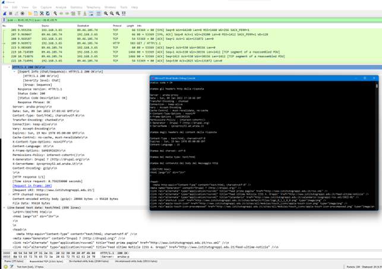

<style>
img {display: block; margin: 0 auto;}
</style>


## Applicazioni client in .NET che gestiscono richieste e risposte HTTP

[Network programming in .NET](https://learn.microsoft.com/en-us/dotnet/fundamentals/networking/overview)

### HttpClient

[Documentazione su HttpClient](https://learn.microsoft.com/en-us/dotnet/api/system.net.http.httpclient)

#### Scaricare del testo dalla rete

```csharp
namespace HttpClientDemo1
{
    class Program
    {
        // HttpClient is intended to be instantiated once per application, rather than per-use. See Remarks.
        static HttpClient? client;
        static async Task Main()
        {
            client = new HttpClient();
            // Call asynchronous network methods in a try/catch block to handle exceptions.
            try
            {
                HttpResponseMessage response = await client.GetAsync("https://learn.microsoft.com/en-us/dotnet/fundamentals/networking/overview");
                response.EnsureSuccessStatusCode();
                string responseBody = await response.Content.ReadAsStringAsync();
                var desktopPath = Environment.GetFolderPath(Environment.SpecialFolder.Desktop);
                await File.WriteAllTextAsync(Path.Combine(desktopPath, nameof(HttpClientDemo1) + ".html"), responseBody);
                // Above three lines can be replaced with new helper method below
                //string responseBody = await client.GetStringAsync(url);
                //Console.WriteLine(responseBody);
            }
            catch (HttpRequestException e)
            {
                Console.WriteLine($"{Environment.NewLine}Exception Caught!");
                Console.WriteLine("Message :{0} ", e.Message);
            }
        }
    }
}
```

Un’istanza della classe [HttpClient](https://learn.microsoft.com/en-us/dotnet/api/system.net.http.httpclient) rappresenta una sessione per l’invio di richieste HTTP. Essa incapsula una collezione di impostazioni che vengono applicate a tutte le richieste eseguite tramite quell’istanza. Inoltre, ogni `HttpClient` mantiene un proprio pool di connessioni, isolando le proprie richieste da quelle eseguite da altre istanze.

La classe `HttpClient` può essere anche una classe base per client HTTP più specifici (ad esempio un client dedicato a un particolare servizio). In tale caso, in genere non si sovrascrivono i metodi virtuali della classe base; si preferisce invece utilizzare un costruttore che accetti un [HttpMessageHandler](https://learn.microsoft.com/en-us/dotnet/api/system.net.http.httpmessagehandler) per configurare la pipeline di gestione delle richieste.

:::note
È prassi raccomandata istanziare `HttpClient` una sola volta e riutilizzarlo per tutta la vita dell’applicazione. La creazione di una nuova istanza per ogni richiesta può portare, sotto carico, all’esaurimento delle socket disponibili e a eccezioni di tipo `SocketException`.
:::

```csharp
public class GoodController : ApiController
{
    private static readonly HttpClient HttpClient;
    static GoodController()
    {
        HttpClient = new HttpClient();
    }
}
```

#### Scaricare più pagine in parallelo

Di seguito un esempio di programma C# che scarica in parallelo più pagine web e ne misura il tempo di scaricamento complessivo.

```csharp
//https://docs.microsoft.com/en-us/dotnet/csharp/programming-guide/concepts/async/
using System.Diagnostics;
using System.Runtime.InteropServices;

namespace HttpClientDemo2;

class Program
{
    /// <summary>
    /// Scarica un file dalla rete e restituisce la lunghezza in byte
    /// </summary>
    /// <param name="url"></param>
    /// <param name="client"></param>
    /// <returns></returns>
    static async Task<int> ProcessURLAsync(string url, HttpClient client)
    {
        var sw = new Stopwatch();
        sw.Start();
        var byteArray = await client.GetByteArrayAsync(url);
        sw.Stop();
        DisplayResults(url, "https://docs.microsoft.com/en-us/", byteArray, sw.ElapsedMilliseconds);
        return byteArray.Length;
    }
    /// <summary>
    /// Stampa una parte dell'url, la dimensione in byte di una pagina e il tempo impiegato per il download
    /// </summary>
    /// <param name="url"></param>
    /// <param name="urlHeadingStrip"></param>
    /// <param name="content"></param>
    /// <param name="elapsedMillis"></param>
    static void DisplayResults(string url, string urlHeadingStrip, byte[] content, long elapsedMillis)
    {
        // Display the length of each website.
        var bytes = content.Length;
        // Strip off the "urlHeadingStrip" part from url
        var displayURL = url.Replace(urlHeadingStrip, "");
        Console.WriteLine($"{Environment.NewLine}{displayURL,-80} bytes: {bytes,-10} ms: {elapsedMillis,-10}");
    }
    /// <summary>
    /// Restituisce una lista di url
    /// </summary>
    /// <returns></returns>
    static List<string> SetUpURLList()
    {
        List<string> urls =
            [
                "https://docs.microsoft.com/en-us/welcome-to-docs",
                "https://docs.microsoft.com/en-us/dotnet/csharp/programming-guide/concepts/async/",
                "https://docs.microsoft.com/en-us/dotnet/csharp/programming-guide/concepts/linq/",
                "https://docs.microsoft.com/en-us/dotnet/csharp/programming-guide/concepts/linq/linq-to-objects",
                "https://docs.microsoft.com/en-us/dotnet/csharp/programming-guide/concepts/linq/linq-and-strings",
                "https://docs.microsoft.com/en-us/dotnet/csharp/programming-guide/concepts/linq/linq-to-xml-overview",
                "https://docs.microsoft.com/en-us/dotnet/csharp/programming-guide/concepts/async/async-return-types",
                "https://docs.microsoft.com/en-us/dotnet/csharp/programming-guide/concepts/linq/linq-to-xml-vs-dom",
                "https://docs.microsoft.com/en-us/dotnet/csharp/programming-guide/concepts/reflection"
            ];
        return urls;
    }
    /// <summary>
    /// Effettua il setup di una lista di url e per ognuno di essi avvia un download asincrono su un task separato
    /// </summary>
    /// <returns></returns>
    static async Task SumPageSizesAsync()
    {
        // Make a list of web addresses.
        List<string> urlList = SetUpURLList();
        //setup del client con eventuale Proxy
        HttpClient client = new();

        //misuriamo il tempo complessivo per scaricare tutte le pagine
        var swGlobal = new Stopwatch();
        swGlobal.Start();
        //processiamo in parallelo una lista di URL
        // IMPORTANTE: materializziamo la query LINQ in un array concreto.
        // ProcessURLAsync restituisce un Task<int> per ogni URL della lista.
        // La materializzazione evita che la query venga rieseguita ad ogni enumerazione,
        // prevenendo download duplicati.
        Task<int>[] downloadTasks = [.. urlList.Select(u => ProcessURLAsync(u, client))];

        //*****************************************************************************
        // NOTA IMPORTANTE: Il codice commentato sotto è un ANTI-PATTERN!
        // Parallel.For e Parallel.ForEach sono progettati per operazioni CPU-intensive SINCRONE,
        // NON per operazioni I/O-bound asincrone come i download HTTP.
        // Usarli con metodi async causa:
        // 1. Spreco di thread del ThreadPool che rimangono bloccati ad aspettare
        // 2. Nessun beneficio reale rispetto a Task.WhenAll
        // 3. Maggiore complessità e overhead
        // 
        // Per operazioni async I/O-bound, il pattern corretto è:
        // - Creare tutti i task con Select (come fatto sopra)
        // - Attendere il completamento con Task.WhenAll
        // Questo permette al runtime di gestire efficientemente le operazioni asincrone
        // senza bloccare thread.
        //*****************************************************************************
        // CODICE COMMENTATO (ANTI-PATTERN - NON USARE):
        //*****************************************************************************
        // var completedDownloads = new Task<int>[urlList.Count];
        // Parallel.For(0, urlList.Count, index =>
        // {
        //     completedDownloads[index] = ProcessURLAsync(urlList[index], client);
        // });
        // int[] lengthsParallel = await Task.WhenAll(completedDownloads);
        // int totalParallel = lengthsParallel.Sum();
        // Console.WriteLine($"{Environment.NewLine}Total bytes returned (Parallel.For): {totalParallel}{Environment.NewLine}");
        // 
        // var completedDownloads2 = new Task<int>[urlList.Count];
        // Parallel.ForEach(urlList, (url, _, index) =>
        // {
        //     completedDownloads2[(int)index] = ProcessURLAsync(url, client);
        // });
        // int[] lengthsParallelForEach = await Task.WhenAll(completedDownloads2);
        // int totalParallelForEach = lengthsParallelForEach.Sum();
        // Console.WriteLine($"{Environment.NewLine}Total bytes returned (Parallel.ForEach): {totalParallelForEach}{Environment.NewLine}");
        //*****************************************************************************

        int[] lengths = await Task.WhenAll(downloadTasks);
        //// The previous line is equivalent to the following two statements.
        //Task<int[]> whenAllTask = Task.WhenAll(downloadTasks);
        //int[] lengths = await whenAllTask;
        swGlobal.Stop();
        long elapsedTotalMs = swGlobal.ElapsedMilliseconds;
        int total = lengths.Sum();
        // Display the total count for all of the web addresses.
        Console.WriteLine($"{Environment.NewLine}Total bytes returned: {total}{Environment.NewLine}");
        Console.WriteLine($"Tempo complessivo di scaricamento = {elapsedTotalMs} ms");
    }
    static async Task Main(string[] args)
    {
        //imposto la dimensione della console - vale solo per Windows
        if (RuntimeInformation.IsOSPlatform(OSPlatform.Windows))
        {
            Console.WindowWidth = 120;
        }
        await SumPageSizesAsync();
    }
}

```

#### Analizzare la risposta di una richiesta HTTP GET mediante le proprietà della risposta

```csharp
namespace HttpResponseAnalysisDemo1
{
    class Program
    {
        
        static async Task Main()
        {
            // HttpClient is intended to be instantiated once per application, rather than per-use.
            HttpClient client = new();
            // Call asynchronous network methods in a try/catch block to handle exceptions.
            try
            {
                //invio richiesta Get in modalità Async e ottengo la risposta
                HttpResponseMessage response = await client.GetAsync("https://learn.microsoft.com/en-us/dotnet/fundamentals/networking/overview");
                //stampo lo status code
                Console.WriteLine($"status code = {response.StatusCode}");
                //stampo gli headers http della risposta
                Console.WriteLine($"{Environment.NewLine}stampa gli headers http della risposta{Environment.NewLine}");
                foreach (var header in response.Headers)
                {
                    Console.Write($"{header.Key} : ");
                    foreach (var val in header.Value)
                    {
                        Console.Write($"{val} ");
                    }
                    Console.WriteLine();
                }
                //stampo gli headers http della risposta usando il response.Headers.toString()
                //Console.WriteLine($"{Environment.NewLine}stampa di ToString() di response.Headers{Environment.NewLine}");
                //Console.WriteLine(response.Headers.ToString());
                //stampo gli headers del content
                Console.WriteLine($"{Environment.NewLine}stampa degli headers del content della risposta{Environment.NewLine}");
                foreach (var header in response.Content.Headers)
                {
                    Console.Write($"{header.Key} : ");
                    foreach (var val in header.Value)
                    {
                        Console.Write($"{val} ");
                    }
                    Console.WriteLine();
                }
                //ottenere il charset
                Console.Write($"{Environment.NewLine}Stampa del charset: ");
                Console.WriteLine(response.Content.Headers.ContentType?.CharSet);
                Console.Write($"{Environment.NewLine}Stampa del media type: ");
                Console.WriteLine(response.Content.Headers.ContentType?.MediaType);
                response.EnsureSuccessStatusCode();
                string responseBody = await response.Content.ReadAsStringAsync();
                // il contenuto di una pagina web può essere ottenuto anche con la seguente istruzione
                // string responseBody = await client.GetStringAsync(uri);
                // Console.WriteLine($"{Environment.NewLine}stampa del contenuto del body del messaggio http{Environment.NewLine}");
                // Console.WriteLine(responseBody);
                var desktopPath = Environment.GetFolderPath(Environment.SpecialFolder.Desktop);
                await File.WriteAllTextAsync(Path.Combine(desktopPath, nameof(HttpResponseAnalysisDemo1) + ".html"), responseBody);
            }
            catch (HttpRequestException e)
            {
                Console.WriteLine($"{Environment.NewLine}Exception Caught!");
                Console.WriteLine("Message :{0} ", e.Message);
            }
        }
    }
}

```

Confronto tra quanto stampato dal programma C# e quanto riportato da [WireShark](https://www.wireshark.org/).



La precedente cattura è stata ottenuta attivando l’analizzatore di rete WireShark mentre il programma demo in C# ha effettuato la richiesta HTTP per lo scaricamento della pagina.

#### Esempi di utilizzo di HttpClient

[C# HttpClient example on zetcode](http://zetcode.com/csharp/httpclient/)

[C# Read web page example on zetcode](http://zetcode.com/csharp/readwebpage/)

#### Lettura e scrittura di file scaricati da Internet con metodi asincroni

Nel seguente esempio si mostra come scaricare un file da Internet e poi salvarlo sul file system. Il file viene poi aperto e letto a console. Le operazioni di scrittura e lettura del file sono gestite mediante chiamate asincrone.

```csharp
//https://docs.microsoft.com/it-it/dotnet/csharp/programming-guide/concepts/async/using-async-for-file-access

//https://docs.microsoft.com/it-it/dotnet/csharp/programming-guide/concepts/async/using-async-for-file-access

using System.Text;
namespace FileDownloadAsyncDemo
{
    class Program
    {
        /// <summary>
        /// Scrive del testo su un file usando la codifica specificata
        /// https://stackoverflow.com/questions/11774827/writing-to-a-file-asynchronously/
        /// https://stackoverflow.com/a/22617832
        /// </summary>
        /// <param name="filePath"></param>
        /// <param name="text"></param>
        /// <param name="encoding"></param>
        /// <returns></returns>
        static async Task WriteTextAsync(string filePath, string text, Encoding encoding, int writeBufferSize = 4096)
        {
            using FileStream sourceStream = new(filePath, FileMode.Create, FileAccess.Write, FileShare.None,
            bufferSize: writeBufferSize, useAsync: true);
            using StreamWriter sw = new(sourceStream, encoding);
            await sw.WriteAsync(text);
        }
        /// <summary>
        /// Legge un file di testo usando la codifica specificata
        /// </summary>
        /// <param name="filePath"></param>
        /// <param name="encoding"></param>
        /// <param name="readBufferSize"></param>
        /// <returns></returns>        
        static async Task<string> ReadTextAsync2(string filePath, Encoding? encoding = null, int readBufferSize = 4096)
        {
            encoding ??= new UTF8Encoding(false);
            using FileStream sourceStream = new(filePath, FileMode.Open, FileAccess.Read, FileShare.Read, bufferSize: readBufferSize, useAsync: true);
            StringBuilder sb = new();
            byte[] buffer = new byte[0x1000];
            int numRead;
            while ((numRead = await sourceStream.ReadAsync(buffer.AsMemory(0, buffer.Length))) != 0)
            {
                string text = encoding.GetString(buffer, 0, numRead);
                sb.Append(text);
            }
            return sb.ToString();
        }
        /// <summary>
        /// Legge un file di testo usando la codifica specificata
        /// </summary>
        /// <param name="filePath"></param>
        /// <param name="encoding"></param>
        /// <returns></returns>
        static async Task<string> ReadTextAsync(string filePath, Encoding encoding, int readBufferSize = 4096)
        {
            using FileStream sourceStream = new(filePath, FileMode.Open, FileAccess.Read, FileShare.Read, bufferSize: readBufferSize, useAsync: true);
            using StreamReader sr = new(sourceStream, encoding);
            //https://docs.microsoft.com/it-it/dotnet/standard/io/how-to-read-text-from-a-file
            return await sr.ReadToEndAsync();
        }
        /// <summary>
        /// Recupera il nome del file dall'url
        /// https://stackoverflow.com/a/40361205
        /// https://stackoverflow.com/questions/1105593/get-file-name-from-uri-string-in-c-sharp
        /// </summary>
        /// <param name="url"></param>
        /// <returns></returns>
        static string GetFileNameFromUrl(string url)
        {
            Uri SomeBaseUri = new("http://canbeanything");
            if (!Uri.TryCreate(url, UriKind.Absolute, out Uri? uri))
            {
                uri = new Uri(SomeBaseUri, url);
            }
            //Path.GetFileName funziona se ha in input un URL assoluto
            return Path.GetFileName(uri.LocalPath);
        }
        static async Task Main(string[] args)
        {
            HttpClient client = new();
            try
            {
                //https://www.gutenberg.org/files/1012/1012-0.txt - La Divina Commedia in txt
                string fileName = GetFileNameFromUrl("https://www.gutenberg.org/files/1012/1012-0.txt");
                HttpResponseMessage response = await client.GetAsync("https://www.gutenberg.org/files/1012/1012-0.txt");
                response.EnsureSuccessStatusCode();
                string responseBody = await response.Content.ReadAsStringAsync();
                //salvataggio su file
                string path = Environment.GetFolderPath(Environment.SpecialFolder.DesktopDirectory) + Path.DirectorySeparatorChar + fileName;
                //uso diversi modi per salvare su file
                //metodo sincrono
                //File.WriteAllText(path, responseBody);
                //oppure, metodo asincrono
                //await File.WriteAllTextAsync(path, responseBody);
                //metodo sincrono con encoding specificato
                //File.WriteAllText(path, responseBody, new UTF8Encoding(false));
                //oppure, metodo asincrono con encoding specificato
                //await File.WriteAllTextAsync(path, responseBody, new UTF8Encoding(false));
                
                // https://stackoverflow.com/questions/2223882/whats-the-difference-between-utf-8-and-utf-8-without-bom
                //encoding senza BOM - https://docs.microsoft.com/en-us/dotnet/api/system.text.encoding.utf8?view=netframework-4.8
                //BOM https://stackoverflow.com/a/2223926
                //BOM https://it.wikipedia.org/wiki/Byte_Order_Mark
                
                //Oppure uso le funzioni di lettura/scrittura asincrona definite sopra
                Console.WriteLine("Salvataggio su file in corso...");
                await WriteTextAsync(path, responseBody, new UTF8Encoding(false));
                Console.WriteLine("Lettura da file in corso... dei primi 10000 caratteri...tutto non entra nel buffer della console");
                string testoLettoDaFile = await ReadTextAsync(path, new UTF8Encoding(false));
                //oppure usando i metodi di File
                //string testoLettoDaFile2 = await File.ReadAllTextAsync( path, new UTF8Encoding(false));
                //oppure usando la seconda versione di ReadTextAsync
                //string testoLettoDaFile3 = await File.ReadAllTextAsync(path);
                Console.WriteLine(testoLettoDaFile[..10000]);
            }
            catch (HttpRequestException e)
            {
                Console.WriteLine($"{Environment.NewLine}Exception Caught!");
                Console.WriteLine("Message :{0} ", e.Message);
            }
        }
    }
}

```

Seconda versione che mette a confronto diversi modi per scaricare e salvare un file di testo da Internet:

```csharp
using System.Text;
namespace FileDownloadAsyncDemo2
{
    class Program
    {
        static readonly Encoding Utf8NoBom = new UTF8Encoding(false);

        /// <summary>
        /// Recupera il nome del file dall'url
        /// https://stackoverflow.com/a/40361205
        /// https://stackoverflow.com/questions/1105593/get-file-name-from-uri-string-in-c-sharp
        /// </summary>
        /// <param name="url"></param>
        /// <returns></returns>
        static string GetFileNameFromUrl(string url)
        {
            Uri SomeBaseUri = new("http://canbeanything");
            if (!Uri.TryCreate(url, UriKind.Absolute, out Uri? uri))
            {
                uri = new Uri(SomeBaseUri, url);
            }
            //Path.GetFileName funziona se ha in input un URL assoluto
            return Path.GetFileName(uri.LocalPath);
        }

        static string GetDesktopPathForUrl(string url)
        {
            string fileName = GetFileNameFromUrl(url);
            return Path.Combine(Environment.GetFolderPath(Environment.SpecialFolder.DesktopDirectory), fileName);
        }

        static async Task WriteTextToFileAsync(string path, string text, CancellationToken cancellationToken = default)
        {
            try
            {
                await File.WriteAllTextAsync(path, text, Utf8NoBom, cancellationToken);
                Console.WriteLine("File salvato in: {0}", path);
            }
            catch (OperationCanceledException e) when (cancellationToken.IsCancellationRequested)
            {
                Console.WriteLine("Scrittura file annullata o timeout!");
                Console.WriteLine("Message :{0} ", e.Message);
            }
            catch (UnauthorizedAccessException e)
            {
                Console.WriteLine("Errore file: accesso negato (permessi)!");
                Console.WriteLine("Message :{0} ", e.Message);
            }
            catch (DirectoryNotFoundException e)
            {
                Console.WriteLine("Errore file: cartella non trovata!");
                Console.WriteLine("Message :{0} ", e.Message);
            }
            catch (IOException e)
            {
                Console.WriteLine("Errore I/O durante la scrittura del file!");
                Console.WriteLine("Message :{0} ", e.Message);
            }
        }

        static async Task DownloadAndSaveWithGetAsync(HttpClient client, string url)
        {
            string path = GetDesktopPathForUrl(url);
            Console.WriteLine("Metodo 1: HttpClient.GetAsync + ReadAsStringAsync");
            Console.WriteLine("Download in corso...");

            try
            {
                using HttpResponseMessage response = await client.GetAsync(url);
                response.EnsureSuccessStatusCode();
                string responseBody = await response.Content.ReadAsStringAsync();
                Console.WriteLine("Scrittura su file in corso...");
                await WriteTextToFileAsync(path, responseBody);
            }
            catch (HttpRequestException e)
            {
                Console.WriteLine("Errore di rete durante il download!");
                Console.WriteLine("Message :{0} ", e.Message);
            }
        }

        static async Task DownloadAndSaveWithGetStringAsync(HttpClient client, string url, TimeSpan timeout)
        {
            string path = GetDesktopPathForUrl(url);
            Console.WriteLine("Metodo 2: HttpClient.GetStringAsync + CancellationToken (timeout)");
            Console.WriteLine("Download in corso...");

            using CancellationTokenSource cts = new(timeout);
            try
            {
                string downloadedText = await client.GetStringAsync(url, cts.Token);
                Console.WriteLine("Scrittura su file in corso...");
                await WriteTextToFileAsync(path, downloadedText, cts.Token);
            }
            catch (HttpRequestException e)
            {
                Console.WriteLine("Errore di rete durante il download!");
                Console.WriteLine("Message :{0} ", e.Message);
            }
            catch (OperationCanceledException e) when (cts.IsCancellationRequested)
            {
                Console.WriteLine("Download annullato o timeout!");
                Console.WriteLine("Message :{0} ", e.Message);
            }
        }

        static async Task Main(string[] args)
        {
            const string url = "https://www.gutenberg.org/files/1012/1012-0.txt";
            using HttpClient client = new();

            Console.WriteLine("Scegli il metodo di scaricamento:");
            Console.WriteLine("1) HttpClient.GetAsync + ReadAsStringAsync");
            Console.WriteLine("2) HttpClient.GetStringAsync + CancellationToken (timeout)");
            Console.Write("Scelta (1/2): ");
            string? choice = Console.ReadLine();

            switch (choice)
            {
                case "1":
                    await DownloadAndSaveWithGetAsync(client, url);
                    break;
                case "2":
                    await DownloadAndSaveWithGetStringAsync(client, url, TimeSpan.FromSeconds(10));
                    break;
                default:
                    Console.WriteLine("Scelta non valida.");
                    break;
            }
        }
    }
}

```

##### Riportare lo stato di avanzamento del download di un file

Per approfondimenti su come riportare lo stato di avanzamento del download vedere anche [Progress bar with HttpClient - StackOverflow](https://stackoverflow.com/questions/20661652/progress-bar-with-httpclient)

```csharp
HttpClient client = //...
// Must use ResponseHeadersRead to avoid buffering of the content
using (var response = await client.GetAsync(uri, HttpCompletionOption.ResponseHeadersRead)){
    // You must use as stream to have control over buffering and number of bytes read/received
    using (var stream = await response.Content.ReadAsStreamAsync())
    {
        // Read/process bytes from stream as appropriate
        // Calculated by you based on how many bytes you have read.  Likely incremented within a loop.
        long bytesRecieved = //...
        long? totalBytes = response.Content.Headers.ContentLength;
        double? percentComplete = (double)bytesRecieved / totalBytes;
        // Do what you want with `percentComplete`
    }
}
```

##### Gestione di file di grandi dimensioni

Se un’applicazione che utilizza `HttpClient` e le classi correlate in `System.Net.Http` deve scaricare grandi quantità di dati (indicativamente 50 MB o più), è opportuno adottare un approccio a streaming e non affidarsi al buffering predefinito. In caso di buffering, l’utilizzo di memoria del client può diventare molto elevato, con conseguente degrado prestazionale.

Ad esempio, per effettuare il download di un file molto grande si può utilizzare il seguente metodo:

```csharp
static async Task HttpGetForLargeFileInRightWay()
{
    using (HttpClient client = new HttpClient())
    {
        const string url = "https://github.com/tugberkugurlu/ASPNETWebAPISamples/archive/master.zip";
        using (HttpResponseMessage response = await client.GetAsync(url, HttpCompletionOption.ResponseHeadersRead))
        using (Stream streamToReadFrom = await response.Content.ReadAsStreamAsync())
        {
            string fileToWriteTo = Path.GetTempFileName();
            using (Stream streamToWriteTo = File.Open(fileToWriteTo, FileMode.Create))
            {
                await streamToReadFrom.CopyToAsync(streamToWriteTo);
            }
        }
    }
}
```

Si osservi che viene invocato un overload di `GetAsync` passando `HttpCompletionOption.ResponseHeadersRead`: ciò indica a `HttpClient` di non bufferizzare il corpo della risposta (vengono letti solo gli header e il controllo ritorna subito). Successivamente si ottiene lo stream del contenuto e si copia in modo asincrono su un `FileStream` tramite `CopyToAsync`. In questo modo, il comportamento è significativamente migliore in termini di consumo di memoria.

##### Un esempio di scaricamento di file di grandi dimensioni

Nel seguente esempio viene scaricato un file binario di dimensione superiore a 100 MB.

Il metodo `WriteBinaryAsync` salva il file nel percorso specificato, mentre il metodo `WriteBinaryAsyncWithProgress` fa la stessa cosa, ma permette anche di stampare la percentuale di progresso di download.

```csharp showLineNumbers {138-141, 204, 212, 267, 272}


using System.Diagnostics;
using System.Net.Http.Headers;
using System.Runtime.InteropServices;
using System.Net;
namespace BinaryBigFileDownloadAsyncDemo
{
    class Program
    {

        const int DefaultCopyBufferSize = 128 * 1024; // 128 KB: buon compromesso per rete+disco
        const int DefaultMaxRetries = 3;

        static string FormatBytes(long bytes)
        {
            string[] suffixes = ["B", "KB", "MB", "GB", "TB"];
            double value = bytes;
            int order = 0;
            while (value >= 1024 && order < suffixes.Length - 1)
            {
                order++;
                value /= 1024;
            }
            return $"{value:0.##} {suffixes[order]}";
        }

        static string? TryFormatSpeed(double? bytesPerSecond)
        {
            if (bytesPerSecond is null)
                return null;
            if (double.IsNaN(bytesPerSecond.Value) || double.IsInfinity(bytesPerSecond.Value) || bytesPerSecond.Value <= 0)
                return null;
            return $"{FormatBytes((long)bytesPerSecond.Value)}/s";
        }

        static string? TryFormatTime(TimeSpan? time)
        {
            if (time is null)
                return null;
            if (time.Value.TotalHours >= 1)
                return time.Value.ToString(@"hh\:mm\:ss");
            return time.Value.ToString(@"mm\:ss");
        }

        static void RenderProgressLine(long bytesReceived, long? totalBytes, double? bytesPerSecond, TimeSpan? eta)
        {
            string line;

            string? speedText = TryFormatSpeed(bytesPerSecond);
            string? etaText = TryFormatTime(eta);

            if (totalBytes is > 0)
            {
                double percent = Math.Clamp(bytesReceived / (double)totalBytes.Value, 0, 1);
                const int barWidth = 30;
                int filled = (int)Math.Round(percent * barWidth);
                string bar = new string('#', filled).PadRight(barWidth, '-');

                line = $"[{bar}] {percent * 100,6:0.00}%  {FormatBytes(bytesReceived),10}/{FormatBytes(totalBytes.Value),10}";
                if (speedText is not null)
                    line += $"  {speedText,10}";
                if (etaText is not null && speedText is not null)
                    line += $"  ETA {etaText}";
            }
            else
            {
                line = $"Scaricati {FormatBytes(bytesReceived)}";
                if (speedText is not null)
                    line += $"  {speedText}";
            }

            if (Console.IsOutputRedirected)
            {
                Console.WriteLine(line);
                return;
            }

            int width;
            try
            {
                width = Console.WindowWidth;
            }
            catch
            {
                width = 120;
            }

            // \r per restare sulla stessa riga; PadRight per pulire residui di output precedente.
            Console.Write("\r" + line.PadRight(Math.Max(0, width - 1)));
        }
        /// <summary>
        /// Scrive un file nel percorso di destinazione a partire da uno stream di input
        /// </summary>
        /// <param name\="filePathDestination"></param>
        /// <param name\="inputStream"></param>
        /// <returns></returns>
        static async Task WriteBinaryAsync(string filePathDestination, Stream inputStream, int writeBufferSize = 4096)
        {
            using FileStream outputStream = new(filePathDestination, FileMode.Create, FileAccess.Write, FileShare.None, bufferSize: writeBufferSize, useAsync: true);
            await inputStream.CopyToAsync(outputStream);
        }
        /// <summary>
        /// Scrive un file nel percorso destinazione a partire da uno stream di input.
        /// Questa versione stampa a console la percentuale di progress.
        /// Utilizza le variabili totalBytes e butesReceived
        /// </summary>
        /// <param name\="filePathDestination"></param>
        /// <param name\="inputStream"></param>
        /// <returns></returns>
        static async Task WriteBinaryAsyncWithProgress(
            string filePathDestination,
            Stream inputStream,
            long? totalBytes,
            long initialBytesReceived = 0,
            FileMode fileMode = FileMode.Create,
            int bufferSize = DefaultCopyBufferSize,
            CancellationToken cancellationToken = default)
        {
            long bytesReceived = initialBytesReceived;
            if (RuntimeInformation.IsOSPlatform(OSPlatform.Windows))
            {
                Console.CursorVisible = false;
            }
            using FileStream outputStream = new(filePathDestination,
            fileMode, FileAccess.Write, FileShare.None,
            bufferSize: bufferSize, useAsync: true);

            byte[] buffer = new byte[bufferSize];
            int numRead;

            var sw = Stopwatch.StartNew();
            var lastRender = Stopwatch.StartNew();
            long lastBytes = 0;
            TimeSpan lastTime = TimeSpan.Zero;

            // Prima stampa, così si vede subito il formato.
            RenderProgressLine(bytesReceived, totalBytes, bytesPerSecond: null, eta: null);

            while ((numRead = await inputStream.ReadAsync(buffer, 0, buffer.Length, cancellationToken)) != 0)
            {
                await outputStream.WriteAsync(buffer, 0, numRead, cancellationToken);
                bytesReceived += numRead;

                // Aggiorna la console al massimo ~5 volte al secondo.
                if (lastRender.ElapsedMilliseconds >= 200)
                {
                    TimeSpan now = sw.Elapsed;
                    double deltaSeconds = (now - lastTime).TotalSeconds;
                    double? speed = null;
                    TimeSpan? eta = null;

                    if (deltaSeconds > 0)
                    {
                        speed = (bytesReceived - lastBytes) / deltaSeconds;
                        if (totalBytes is > 0 && speed > 1)
                        {
                            double remainingBytes = totalBytes.Value - bytesReceived;
                            eta = TimeSpan.FromSeconds(Math.Max(0, remainingBytes / speed.Value));
                        }
                    }

                    RenderProgressLine(bytesReceived, totalBytes, speed, eta);
                    lastBytes = bytesReceived;
                    lastTime = now;
                    lastRender.Restart();
                }
            }

            // Ultimo refresh + newline.
            RenderProgressLine(bytesReceived, totalBytes, bytesPerSecond: null, eta: TimeSpan.Zero);
            if (!Console.IsOutputRedirected)
            {
                Console.WriteLine();
            }
            if (RuntimeInformation.IsOSPlatform(OSPlatform.Windows))
            {
                Console.CursorVisible = true;
            }
        }

        static async Task DownloadWithRetryAndResumeAsync(
            HttpClient client,
            string url,
            string destinationPath,
            int maxRetries = DefaultMaxRetries,
            int bufferSize = DefaultCopyBufferSize,
            CancellationToken cancellationToken = default)
        {
            // Nota: non tutti i server supportano Range. Se Range viene ignorato, ripartiamo da zero.
            for (int attempt = 0; attempt <= maxRetries; attempt++)
            {
                cancellationToken.ThrowIfCancellationRequested();

                long existingLength = 0;
                if (File.Exists(destinationPath))
                {
                    existingLength = new FileInfo(destinationPath).Length;
                }

                if (existingLength > 0)
                {
                    Console.WriteLine($"Resume: file parziale trovato ({FormatBytes(existingLength)}). Riprendo da lì...");
                }

                using var request = new HttpRequestMessage(HttpMethod.Get, url);
                if (existingLength > 0)
                {
                    request.Headers.Range = new RangeHeaderValue(existingLength, null);
                }

                try
                {
                    using HttpResponseMessage response = await client.SendAsync(request, HttpCompletionOption.ResponseHeadersRead, cancellationToken);

                    // 416: Range non valido (es. file già completo). Consideriamo finito.
                    if (response.StatusCode == HttpStatusCode.RequestedRangeNotSatisfiable)
                    {
                        Console.WriteLine();
                        Console.WriteLine("Download già completo (server ha risposto 416 Range Not Satisfiable).");
                        return;
                    }

                    if (response.StatusCode != HttpStatusCode.OK && response.StatusCode != HttpStatusCode.PartialContent)
                    {
                        response.EnsureSuccessStatusCode();
                    }

                    bool isPartial = response.StatusCode == HttpStatusCode.PartialContent;

                    if (existingLength > 0)
                    {
                        if (isPartial)
                        {
                            long? serverFrom = response.Content.Headers.ContentRange?.From;
                            if (serverFrom is not null)
                            {
                                Console.WriteLine($"Server ha accettato Range: ripartenza da {FormatBytes(serverFrom.Value)} (HTTP 206).");
                            }
                            else
                            {
                                Console.WriteLine("Server ha accettato Range (HTTP 206).");
                            }
                        }
                        else
                        {
                            Console.WriteLine("Server ha ignorato Range (HTTP 200): ricomincio da zero.");
                        }
                    }

                    // Se avevamo un file parziale ma il server NON risponde 206, ha ignorato Range: ricominciamo.
                    if (existingLength > 0 && !isPartial)
                    {
                        existingLength = 0;
                        try { File.Delete(destinationPath); } catch { /* ignore */ }
                    }

                    long? totalBytes = null;
                    if (response.Content.Headers.ContentRange?.Length is long totalFromRange && totalFromRange > 0)
                    {
                        totalBytes = totalFromRange;
                    }
                    else if (response.Content.Headers.ContentLength is long contentLen && contentLen > 0)
                    {
                        // Se stiamo riprendendo, Content-Length è la parte rimanente.
                        totalBytes = existingLength > 0 ? existingLength + contentLen : contentLen;
                    }

                    await using Stream streamToReadFrom = await response.Content.ReadAsStreamAsync(cancellationToken);

                    FileMode fileMode = existingLength > 0 ? FileMode.Append : FileMode.Create;
                    await WriteBinaryAsyncWithProgress(
                        destinationPath,
                        streamToReadFrom,
                        totalBytes,
                        initialBytesReceived: existingLength,
                        fileMode: fileMode,
                        bufferSize: bufferSize,
                        cancellationToken: cancellationToken);

                    return; // completato
                }
                catch (OperationCanceledException)
                {
                    throw;
                }
                catch (Exception ex) when (attempt < maxRetries)
                {
                    // Eccezioni tipiche: HttpIOException(ResponseEnded), HttpRequestException, IOException.
                    Console.WriteLine();
                    Console.WriteLine($"Tentativo {attempt + 1}/{maxRetries} fallito: {ex.GetType().Name}: {ex.Message}");
                    int backoffMs = 500 * (attempt + 1);
                    Console.WriteLine($"Riprovo tra {backoffMs} ms...");
                    await Task.Delay(backoffMs, cancellationToken);
                }
            }

            throw new Exception($"Download fallito dopo {maxRetries + 1} tentativi.");
        }
        /// <summary>
        /// Recupera il nome del file dall'url
        /// https://stackoverflow.com/a/40361205
        /// https://stackoverflow.com/questions/1105593/get-file-name-from-uri-string-in-c-sharp
        /// </summary>
        /// <param name\="url"></param>
        /// <returns></returns>
        static string GetFileNameFromUrl(string url)
        {
            Uri SomeBaseUri = new("http://canbeanything");
            if (!Uri.TryCreate(url, UriKind.Absolute, out Uri? uri))
                uri = new Uri(SomeBaseUri, url);
            //Path.GetFileName funziona se ha in input un URL assoluto
            return Path.GetFileName(uri.LocalPath);
        }
        static async Task Main(string[] args)
        {
            const string url = "https://builds.dotnet.microsoft.com/dotnet/Sdk/9.0.310/dotnet-sdk-9.0.310-win-x64.exe";
            //const string url = "https://github.com/tugberkugurlu/ASPNETWebAPISamples/archive/master.zip";
            using var cts = new CancellationTokenSource();
            Console.CancelKeyPress += (_, e) =>
            {
                e.Cancel = true;
                cts.Cancel();
            };

            using HttpClient client = new();
            client.Timeout = Timeout.InfiniteTimeSpan;
            try
            {
                var sw = new Stopwatch();
                sw.Start();
                Console.WriteLine("Salvataggio su file in corso...");
                //ottengo il nome del file dall'url
                string fileName = GetFileNameFromUrl(url);
                //definisco il path complessivo del file
                string path = Environment.GetFolderPath(Environment.SpecialFolder.DesktopDirectory) + Path.DirectorySeparatorChar + fileName;

                await DownloadWithRetryAndResumeAsync(
                    client,
                    url,
                    path,
                    maxRetries: DefaultMaxRetries,
                    bufferSize: DefaultCopyBufferSize,
                    cancellationToken: cts.Token);

                long elapsedMs = sw.ElapsedMilliseconds;
                Console.WriteLine($"Salvataggio terminato...in {elapsedMs} ms");
            }
            catch (HttpRequestException e)
            {
                Console.WriteLine($"{Environment.NewLine}Exception Caught!");
                Console.WriteLine("Message :{0} ", e.Message);
            }
            catch (OperationCanceledException)
            {
                Console.WriteLine($"{Environment.NewLine}Operazione annullata.");
            }
        }
    }
}
```

###### Spiegazione del codice di download con ripresa (resume) e progress in console

Il programma scarica un file binario via HTTP in modalità “streaming” (senza caricare tutto in memoria), lo salva su disco e mostra l’avanzamento in console. Inoltre, in caso di interruzioni di rete o chiusure premature della risposta, tenta automaticamente di riprendere il download dal punto in cui si era fermato, usando le richieste HTTP con header `Range` (quando supportate dal server).

Di seguito sono spiegati i punti chiave del codice:

1) **Download “streaming” e perché si usa `ResponseHeadersRead`**

    Il download viene avviato con una richiesta HTTP che legge immediatamente solo gli header della risposta, lasciando che il contenuto venga letto gradualmente:

    - `HttpCompletionOption.ResponseHeadersRead` evita di bufferizzare l’intero body in memoria.
    - Lo stream ottenuto da `response.Content.ReadAsStreamAsync(...)` viene letto a blocchi (chunk) e scritto su `FileStream` in modo asincrono.

    Questa impostazione è corretta per file grandi perché:

    - riduce l’uso di RAM;
    - consente di aggiornare l’avanzamento mentre i dati arrivano;
    - permette di gestire meglio errori e riprese.

    ---

2) **Scelta del buffer: perché 128 KB**

    Il codice usa un buffer costante, ad esempio `128 KB`, sia per la lettura dallo stream di rete sia per la scrittura sul file. La dimensione del buffer influenza il comportamento:

    - Un buffer troppo piccolo (es. 4 KB) può aumentare overhead e chiamate di I/O, peggiorando le prestazioni.
    - Un buffer eccessivamente grande (es. 1 MB) non è “sbagliato”, ma può produrre un andamento più “a scatti” e non sempre porta benefici proporzionali; inoltre aumenta la quantità di dati “in volo” per singola operazione.

    Un valore intermedio (64–256 KB) è spesso un buon compromesso tra efficienza e stabilità. Nel codice è stato adottato `128 KB`.

    ---

3) **Progress in console: percentuale, velocità, ETA (Estimated Time of Arrival)**

    La funzione di scrittura:

    - legge e scrive a chunk in un ciclo,
    - aggiorna i byte scaricati,
    - stampa una singola riga di progress nella console (usando `\r` per restare sulla stessa riga),
    - limita la frequenza di aggiornamento (throttling) a circa 5 volte al secondo per evitare flickering e overhead.

    La percentuale si può calcolare solo se è nota la dimensione totale del file. Questa informazione può arrivare da:

    - `Content-Length` (dimensione del contenuto trasferito),
    - oppure `Content-Range` (quando si usa `Range`, contiene anche la dimensione totale).

    Se la velocità non è ancora stimabile (tipicamente all’inizio), il codice non la mostra: viene visualizzata solo quando esiste un valore significativo.

    ---

4) **Perché può verificarsi l’eccezione “Response ended prematurely”**

    L’eccezione:

    `The response ended prematurely ... additional bytes expected`

    si verifica quando:
    - il server ha indicato un `Content-Length` (quindi ci si aspetta un certo numero di byte),
    - ma la connessione viene chiusa prima che tutti i byte dichiarati arrivino (rete instabile, reset, timeout intermedi, CDN, ecc.).

    In questi casi lo stream termina “troppo presto”, e la lettura fallisce. Il comportamento è coerente con il protocollo: non essendo arrivati tutti i byte promessi, il client deve considerare il trasferimento incompleto.

    ---

5) **Meccanismo di retry e resume: come funziona la ripresa**

    La logica di ripresa è implementata in una routine dedicata che:

    1. Controlla se esiste già un file di destinazione.
    2. Se esiste, calcola la sua dimensione in byte (quanto è già stato scaricato).
    3. Invia una nuova richiesta HTTP includendo l’header `Range`, chiedendo i byte rimanenti a partire dall’offset già presente su disco.
    4. Se il server accetta la richiesta (risposta `206 Partial Content`), il programma apre il file in append e continua a scrivere in coda.
    5. Se il server non supporta `Range` e risponde `200 OK` (contenuto completo), la ripresa non è possibile: il programma elimina il file parziale e ricomincia da zero.

    In caso di errore (es. risposta interrotta), il programma effettua alcuni tentativi (`maxRetries`) con un breve backoff (ritardo crescente) tra un tentativo e il successivo.

    In console vengono stampati messaggi espliciti, ad esempio:
    - quando viene trovato un file parziale e si tenta la ripresa;
    - quando il server accetta `Range` (HTTP 206);
    - quando il server ignora `Range` e si ricomincia (HTTP 200);
    - quando un tentativo fallisce e viene pianificato un retry.

    ---

6) **HTTP Range: spiegazione formale**

    L’header HTTP `Range` permette al client di richiedere solo una porzione di risorsa, invece dell’intero contenuto. È particolarmente utile per:

    - riprendere download interrotti (resume),
    - scaricare parti specifiche di un file.

    **Formato tipico:**
    - `Range: bytes=START-`
    - richiede i byte da `START` fino alla fine.
    - `Range: bytes=START-END`
    - richiede un intervallo specifico.

    **Risposte possibili:**
    - `206 Partial Content`: il server ha accettato la richiesta parziale e invia solo la porzione richiesta.
    - In questo caso il server include spesso `Content-Range`, ad esempio:
        - `Content-Range: bytes 1000-1999/5000`
        - che indica: “sto inviando i byte 1000–1999, su un totale di 5000 byte”.
    - `200 OK`: il server ignora `Range` e invia l’intero file.
    - In questo caso la ripresa non può essere effettuata in modo sicuro tramite append, perché si rischierebbe di duplicare dati.
    - `416 Requested Range Not Satisfiable`: l’intervallo richiesto non è valido.
    - Può accadere se il client chiede di riprendere oltre la fine del file (per esempio file già completo, oppure risorsa diversa da quella attesa).

    **Implicazione pratica nel programma:**
    - Se è presente un file parziale, il client prova `Range`.
    - Se la risposta è `206`, il file viene aperto in append e il download continua.
    - Se la risposta è `200`, il file parziale viene scartato e il download ricomincia.
    - Se la risposta è `416`, il programma conclude che (per quella risorsa) non ha senso riprendere con quel range; spesso significa che il file locale è già completo rispetto alla dimensione riconosciuta dal server.

    ---

7) **Gestione dell’annullamento (Ctrl+C)**

    Il programma collega `Console.CancelKeyPress` a un `CancellationTokenSource`. In questo modo:
    - premendo `Ctrl+C` l’operazione viene annullata in modo controllato;
    - il file rimane “parziale” su disco e può essere ripreso al successivo avvio tramite `Range` (se supportato).

    ---

:::note
Non tutti i server supportano `Range`, e la ripresa “affidabile” dipende dal supporto del server e dalla stabilità dell’URL (la risorsa deve restare la stessa tra un tentativo e l’altro).
:::

### Metodi di estensione e librerie

[Metodi di estensione in C#](https://docs.microsoft.com/en-us/dotnet/csharp/programming-guide/classes-and-structs/extension-methods)

[Come implementare e richiamare metodi di estensione](https://docs.microsoft.com/en-us/dotnet/csharp/programming-guide/classes-and-structs/how-to-implement-and-call-a-custom-extension-method)

I metodi di estensione consentono di “aggiungere” metodi a tipi esistenti senza creare un nuovo tipo derivato, senza ricompilare e senza modificare il tipo originale. Dal punto di vista tecnico sono metodi statici, ma vengono invocati come se fossero metodi di istanza sul tipo esteso. Per il codice client (C#, F#, Visual Basic) la differenza, nella chiamata, è di fatto trasparente.

I metodi di estensione più comuni sono gli operatori LINQ, che aggiungono funzionalità di interrogazione a `System.Collections.IEnumerable` e `System.Collections.Generic.IEnumerable<T>`.

Per utilizzare gli operatori standard di query, è necessario importarli con la direttiva `using System.Linq`. A quel punto qualsiasi tipo che implementi `IEnumerable<T>` espone, tramite IntelliSense, metodi come `GroupBy`, `OrderBy`, `Average`, ecc.

#### Come scrivere metodi di estensione personalizzati

Il codice client può utilizzare i metodi di estensione aggiungendo un riferimento alla DLL che li contiene e importando, tramite direttiva `using`, il namespace nel quale tali metodi sono definiti.

Per definire e utilizzare un metodo di estensione:

1. Si definisce una classe `static` che contenga i metodi di estensione.
2. Si implementa il metodo di estensione come metodo `static` con visibilità almeno pari a quella della classe contenitore.
3. Il primo parametro del metodo specifica il tipo su cui il metodo opera e deve essere preceduto dal modificatore `this`.
4. Nel codice chiamante si aggiunge la direttiva `using` che importa il namespace della classe di estensione.
5. Si invoca il metodo come se fosse un metodo di istanza del tipo.

Si noti che il primo parametro non viene fornito esplicitamente nel punto di chiamata, poiché rappresenta l’istanza del tipo esteso.

##### Esempio di Extension Method

Il seguente esempio implementa un metodo di estensione `WordCount` nella classe `CustomExtensions.StringExtension`. Il metodo opera sulla classe `string` e viene richiamato nel `Main` dopo l’importazione del namespace `CustomExtensions`.

```csharp
//file StringExtensions.cs

namespace CustomExtensions;

public static class StringExtension
{
   /// <summary>
   /// Conta il numero di parole nella stringa str
   /// </summary>
   /// <param name="str">La stringa di cui si vuole conoscere il numero di parole</param>
   /// <returns>Il numero di parole contenute nella stringa str</returns>
    public static int WordCount(this string str)
    {
        return str.Split([' ', '.', '?','!',';',',',':'], StringSplitOptions.RemoveEmptyEntries).Length;
    }

}

//file: Program.cs
using CustomExtensions;
namespace ExtensionMethodsDemo
{
    internal class Program
    {
        static void Main(string[] args)
        {
            string s = "The quick brown fox jumped over the lazy dog.";
            int i = s.WordCount();
            Console.WriteLine("Word count of s is {0}", i);
            int[] array = [1, 2, 3, 4, 5];
            int totale = array.Sum();
        }
    }
}
```

##### Creazione di una libreria con metodi di estensione per la gestione del grado di parallelismo dei Task che elaborano una collection di dati

Quando si invoca `Task.WhenAll(taskCollection)` tutti i task della `taskCollection` vengono avviati contemporaneamente:

```csharp
IEnumerable<Task<int>> downloadTasks = urlList.Select(u => ProcessURLAsync(u, client));
// Await the completion of all the running tasks.
in[] lengths = await Task.WhenAll(downloadTasks);
```

Per gestire il grado di parallelismo massimo dei task che sono eseguiti in parallelo su una collection di oggetti è possibile implementare un paio di semplici metodi che utilizzano una coda Thread-safe per processare gli elementi della collection. Svilupperemo questo progetto come libreria con metodi di estensione per poter poi includere la libreria nei nostri progetti.

##### Step N1: creazione di un progetto di tipo libreria

In Visual Studio Code:

Creiamo un progetto di tipo `Class Library` chiamato `TaskParallelismControl` e al suo interno creiamo la classe `TaskConcurrencyHelper`.

```csharp
namespace TaskParallelismControl;

using System.Collections.Concurrent;

/// <summary>
/// Provides extension methods for executing asynchronous operations in parallel with controlled degree of parallelism.
/// Useful for throttling concurrent operations to avoid resource saturation (network, CPU, memory).
/// </summary>
/// <remarks>
/// Based on the pattern described at:
/// https://medium.com/@nirinchev/executing-a-collection-of-tasks-in-parallel-with-control-over-the-degree-of-parallelism-in-c-508d59ddffc6
/// </remarks>
public static class TaskConcurrencyHelper
{
    /// <summary>
    /// Executes an asynchronous operation on each element of a collection in parallel,
    /// with a controlled maximum degree of parallelism.
    /// </summary>
    /// <typeparam name="T">The type of elements in the collection.</typeparam>
    /// <param name="collection">The collection to process.</param>
    /// <param name="processor">The asynchronous operation to execute on each element.</param>
    /// <param name="degreeOfParallelism">The maximum number of concurrent tasks to use.</param>
    /// <returns>A task that completes when all elements have been processed.</returns>
    /// <exception cref="ArgumentNullException">Thrown when <paramref name="collection"/> or <paramref name="processor"/> is null.</exception>
    /// <exception cref="ArgumentOutOfRangeException">Thrown when <paramref name="degreeOfParallelism"/> is less than 1.</exception>
    /// <example>
    /// <code>
    /// var urls = new[] { "https://example.com", "https://example.org" };
    /// await urls.ExecuteInParallel(
    ///     async url => await DownloadAsync(url),
    ///     degreeOfParallelism: 5);
    /// </code>
    /// </example>
    public static async Task ExecuteInParallel<T>(
        this IEnumerable<T> collection,
        Func<T, Task> processor,
        int degreeOfParallelism)
    {
        // Create a thread-safe queue from the input collection
        var queue = new ConcurrentQueue<T>(collection);

        // Create worker tasks equal to the degree of parallelism
        // Each worker will compete to dequeue and process items
        var tasks = Enumerable.Range(0, degreeOfParallelism).Select(async _ =>
                {
                    // Each worker continuously dequeues and processes items until the queue is empty
                    while (queue.TryDequeue(out T? item))
                    {
                        await processor(item);
                    }
                });

        // Wait for all worker tasks to complete
        await Task.WhenAll(tasks);
    }

    /// <summary>
    /// Executes an asynchronous operation on each element of a collection in parallel,
    /// with a controlled maximum degree of parallelism, and collects the results.
    /// </summary>
    /// <typeparam name="T">The type of elements in the collection.</typeparam>
    /// <typeparam name="TResult">The type of result produced by processing each element.</typeparam>
    /// <param name="collection">The collection to process.</param>
    /// <param name="processor">The asynchronous operation to execute on each element that returns a result.</param>
    /// <param name="degreeOfParallelism">The maximum number of concurrent tasks to use.</param>
    /// <returns>
    /// A task that completes when all elements have been processed,
    /// containing a <see cref="ConcurrentBag{T}"/> with all the results.
    /// </returns>
    /// <exception cref="ArgumentNullException">Thrown when <paramref name="collection"/> or <paramref name="processor"/> is null.</exception>
    /// <exception cref="ArgumentOutOfRangeException">Thrown when <paramref name="degreeOfParallelism"/> is less than 1.</exception>
    /// <example>
    /// <code>
    /// var urls = new[] { "https://example.com", "https://example.org" };
    /// var results = await urls.ExecuteInParallel(
    ///     async url => await client.GetByteArrayAsync(url),
    ///     degreeOfParallelism: 5);
    /// Console.WriteLine($"Total bytes: {results.Sum(r => r.Length)}");
    /// </code>
    /// </example>
    public static async Task<ConcurrentBag<TResult>> ExecuteInParallel<T, TResult>(
        this IEnumerable<T> collection,
        Func<T, Task<TResult>> processor,
        int degreeOfParallelism)
    {
        // Create a thread-safe queue from the input collection
        var queue = new ConcurrentQueue<T>(collection);

        // Create a thread-safe bag to collect results from all workers
        var results = new ConcurrentBag<TResult>();

        // Create worker tasks equal to the degree of parallelism
        // Each worker will compete to dequeue and process items
        var tasks = Enumerable.Range(0, degreeOfParallelism).Select(async _ =>
        {
            // Each worker continuously dequeues, processes items, and adds results until the queue is empty
            while (queue.TryDequeue(out T? item))
            {
                results.Add(await processor(item));
            }
        });

        // Wait for all worker tasks to complete
        await Task.WhenAll(tasks);
        return results;
    }
}


```

Compiliamo la libreria con il comando:

```ps1
dotnet build .\TaskParallelismControl\TaskParallelismControl.csproj
```

##### Step N2: utilizzo della libreria in un altro progetto di Visual Studio Code

Creiamo il progetto Console HttpClientDemo3 che utilizza la libreria TaskParallelismControl. Dopo aver creato un progetto Console chiamato HttpClientDemo3, aggiungiamo la dipendenza dal progetto libreria appena creato:

In Visual Studio Code è possibile aggiungere il riferimento alla libreria anche da terminale, posizionandosi nella cartella del progetto Console HttpClientDemo3 e lanciando il comando `dotnet add reference` seguito dal percorso completo del file `.csproj` della libreria TaskParallelismControl:

```ps1
dotnet add reference ..\TaskParallelismControl\TaskParallelismControl.csproj
```

In alternativa è possibile usare i comandi dell'interfaccia grafica, selezionando il progetto Console e scegliendo "Add Project Reference".

Per effetto del comando precedente il file `.csproj` dovrebbe contenere:

```xml
  <ItemGroup>
    <ProjectReference Include="..\TaskParallelismControl\TaskParallelismControl.csproj" />
  </ItemGroup>
```

Nel file della classe Program si aggiunga il namespace della libreria TaskParallelismControl e si scriva il codice della classe:

```csharp
using System.Diagnostics;
using System.Runtime.InteropServices;
using System.Collections.Concurrent;
//namespace della libreria creata
using TaskParallelismControl;
namespace HttpClientDemo3;

class Program
{

    /// <summary>
    /// Scarica un file dalla rete e restituisce la lunghezza in byte
    /// </summary>
    /// <param name="url"></param>
    /// <param name="client"></param>
    /// <returns></returns>
    static async Task<int> ProcessURLAsync(string url, HttpClient client)
    {
        var sw = new Stopwatch();
        sw.Start();
        var byteArray = await client.GetByteArrayAsync(url);
        sw.Stop();
        DisplayResults(url, "https://docs.microsoft.com/en-us/", byteArray, sw.ElapsedMilliseconds);
        return byteArray.Length;
    }
    /// <summary>
    /// Stampa una parte dell'url, la dimensione in byte di una pagina e il tempo impiegato per il download
    /// </summary>
    /// <param name="url"></param>
    /// <param name="urlHeadingStrip"></param>
    /// <param name="content"></param>
    /// <param name="elapsedMillis"></param>
    static void DisplayResults(string url, string urlHeadingStrip, byte[] content, long elapsedMillis)
    {
        // Display the length of each website.
        var bytes = content.Length;
        // Strip off the "urlHeadingStrip" part from url
        var displayURL = url.Replace(urlHeadingStrip, "");
        Console.WriteLine($"{Environment.NewLine}{displayURL,-80} bytes: {bytes,-10} ms: {elapsedMillis,-10}");
    }
    /// <summary>
    /// Restituisce una lista di url
    /// </summary>
    /// <returns></returns>
    static List<string> SetUpURLList()
    {
        List<string> urls =
        [
        "https://docs.microsoft.com/en-us/welcome-to-docs",
        "https://docs.microsoft.com/en-us/dotnet/csharp/programming-guide/concepts/async/",
        "https://docs.microsoft.com/en-us/dotnet/csharp/programming-guide/concepts/linq/",
        "https://docs.microsoft.com/en-us/dotnet/csharp/programming-guide/concepts/linq/linq-to-objects",
        "https://docs.microsoft.com/en-us/dotnet/csharp/programming-guide/concepts/linq/linq-and-strings",
        "https://docs.microsoft.com/en-us/dotnet/csharp/programming-guide/concepts/linq/linq-to-xml-overview",
        "https://docs.microsoft.com/en-us/dotnet/csharp/programming-guide/concepts/async/async-return-types",
        "https://docs.microsoft.com/en-us/dotnet/csharp/programming-guide/concepts/linq/linq-to-xml-vs-dom",
        "https://docs.microsoft.com/en-us/dotnet/csharp/programming-guide/concepts/reflection"
        ];
        return urls;
    }
    /// <summary>
    /// Effettua il setup di una lista di url e per ognuno di essi avvia un download asincrono su un task separato
    /// </summary>
    /// <returns></returns>
    static async Task SumPageSizesAsync()
    {
        // Make a list of web addresses.
        List<string> urlList = SetUpURLList();
        HttpClient client = new();
        //misuriamo il tempo complessivo per scaricare tutte le pagine
        var swGlobal = new Stopwatch();
        swGlobal.Start();
        //processiamo in parallelo una lista di URL
        // IMPORTANTE: materializziamo la query LINQ in un array concreto.
        // Senza materializzazione (usando IEnumerable<Task<int>>), la query lazy verrebbe
        // rieseguita ogni volta che la enumeriamo (sia con Task.WhenAll che con Sum),
        // causando il download duplicato di tutti i file!
        //Task<int>[] downloadTasks = urlList.Select(u => ProcessURLAsync(u, client)).ToArray();
        Task<int>[] downloadTasks = [.. urlList.Select(u => ProcessURLAsync(u, client))];

        //attendiamo il completamento di tutti i download

        await Task.WhenAll(downloadTasks);
        //sommiamo i risultati
        int total = downloadTasks.Sum(t => t.Result);
        Console.WriteLine($"{Environment.NewLine}Total bytes returned: {total}{Environment.NewLine}");
        swGlobal.Stop();
        long elapsedTotalMs = swGlobal.ElapsedMilliseconds;
        Console.WriteLine($"Tempo complessivo di scaricamento = {elapsedTotalMs}");
        //ora facciamo la stessa cosa ma limitando il grado di parallelismo
        Console.WriteLine($"{Environment.NewLine}Esecuzione con grado di parallelismo limitato:");
        swGlobal.Restart();

        //ConcurrentBag<int> bag = [];
        //await urlList.ExecuteInParallel(async u => { bag.Add(await ProcessURLAsync(u, client)); }, 10);
        //var theTotal = bag.ToArray().Sum();
        //await urlList.ExecuteInParallel(async u => { await Task.Delay(10); }, 10);
        //definiamo il grado di parallelismo
        const int numberOfParallelThreads = 5;
        //processiamo tutti gli oggetti della collection con il grado di parallelismo massimo predefinito
        ConcurrentBag<int> concurrentBagOfResults = await urlList.ExecuteInParallel(u => ProcessURLAsync(u, client), numberOfParallelThreads);
        //sommiamo tutti i valori restituiti dai thread
        var theTotal = concurrentBagOfResults.ToArray().Sum();
        Console.WriteLine($"Somma = {theTotal}");
        swGlobal.Stop();
        elapsedTotalMs = swGlobal.ElapsedMilliseconds;
        // Display the total count for all of the web addresses.
        Console.WriteLine($"{Environment.NewLine}Total bytes returned: {theTotal}{Environment.NewLine}");
        Console.WriteLine($"Tempo complessivo di scaricamento = {elapsedTotalMs}");
    }
    static async Task Main(string[] args)
    {
        //imposto la dimensione della console - vale solo per Windows
        if (RuntimeInformation.IsOSPlatform(OSPlatform.Windows))
        {
            Console.WindowWidth = 120;
        }
        await SumPageSizesAsync();
    }
}


```

##### Libreria per la gestione del Proxy con l'oggetto HttpClient

In alcune circostanze è necessario configurare il proxy per le richieste HTTP nell'oggetto HttpClient. Il codice per il setup del proxy e le relative dipendenze può utilmente essere inserito all'interno di una libreria richiamata in tutti i progetti che ne fanno uso.

Creiamo la libreria `HttpProxyControl` da usare per i futuri progetti. Creiamo un progetto di tipo Class Library chiamato `HttpProxyControl`.

```csharp
namespace HttpProxyControl;

using Microsoft.Win32;
using System.Net;
using System.Runtime.InteropServices;
using System.Runtime.Versioning;

/// <summary>
/// Parametri del proxy HTTP (indirizzo e porta).
/// </summary>
public struct ProxyParams
{
    /// <summary>
    /// Inizializza i parametri con valori di default.
    /// </summary>
    public ProxyParams()
    {
        ProxyAddress = string.Empty;
        ProxyPort = 0;
    }

    /// <summary>
    /// Indirizzo (host o IP) del proxy.
    /// </summary>
    public string ProxyAddress { get; set; } = string.Empty;

    /// <summary>
    /// Porta TCP del proxy.
    /// </summary>
    public int ProxyPort { get; set; }
}
/// <summary>
/// Eccezione specifica per errori nella gestione/determinazione del proxy.
/// </summary>
public class ProxyHelperException : Exception
{
    /// <summary>
    /// Crea una nuova eccezione per errori legati alla gestione del proxy.
    /// </summary>
    public ProxyHelperException()
    {
    }

    /// <summary>
    /// Crea una nuova eccezione per errori legati alla gestione del proxy.
    /// </summary>
    /// <param name="message">Messaggio descrittivo dell'errore.</param>
    public ProxyHelperException(string message)
    : base(message)
    {
    }

    /// <summary>
    /// Crea una nuova eccezione per errori legati alla gestione del proxy.
    /// </summary>
    /// <param name="message">Messaggio descrittivo dell'errore.</param>
    /// <param name="inner">Eccezione originale che ha causato l'errore.</param>
    public ProxyHelperException(string message, Exception inner)
    : base(message, inner)
    {
    }
}

/// <summary>
/// Metodi di utilità per determinare e usare il proxy di sistema con <see cref="HttpClient"/>.
/// </summary>
/// <remarks>
/// Richiede:
/// 1) <c>using Microsoft.Win32;</c>
/// 2) <c>using System.Runtime.InteropServices;</c>
/// 3) <c>using System.Net;</c>
/// </remarks>
public static class HttpProxyHelper
{
    // Uri “fittizia” usata solo per interrogare il proxy di sistema.
    // Non viene effettuata alcuna richiesta HTTP: serve esclusivamente come input a IsBypassed/GetProxy.
    private static readonly Uri ProxyDetectionUri = new("http://example.com");

    /// <summary>
    /// Restituisce il proxy attualmente in uso (se presente).
    /// </summary>
    /// <remarks>
    /// Su Windows la determinazione prova prima a leggere l'impostazione utente dal registro.
    /// In fallback (e su Linux/macOS) usa <see cref="HttpClient.DefaultProxy"/>, che tipicamente deriva
    /// da variabili d'ambiente (es. <c>HTTP_PROXY</c>/<c>HTTPS_PROXY</c>/<c>ALL_PROXY</c> e <c>NO_PROXY</c>).
    /// </remarks>
    /// <returns>
    /// Il proxy attualmente in uso; <see langword="null"/> se nessun proxy è in uso.
    /// </returns>
    public static Uri? GetHttpClientProxy()
    {
        // Windows: prima proviamo a leggere le impostazioni dell'utente dal registro (Internet Options).
        // Se non troviamo nulla/è disabilitato, facciamo fallback al meccanismo cross-platform (DefaultProxy).
        if (RuntimeInformation.IsOSPlatform(OSPlatform.Windows))
        {
            Uri? proxyFromRegistry = GetWindowsUserProxyFromRegistry();
            if (proxyFromRegistry is not null)
            {
                return proxyFromRegistry;
            }
        }

        // Linux/macOS (e fallback su Windows): DefaultProxy è la fonte “standard” per .NET.
        // Tipicamente è configurato via variabili d'ambiente (HTTP(S)_PROXY/ALL_PROXY/NO_PROXY).
        return GetProxyFromDefaultProxy();
    }

    [SupportedOSPlatform("windows")]
    private static Uri? GetWindowsUserProxyFromRegistry()
    {
        if (!OperatingSystem.IsWindows())
        {
            return null;
        }

        try
        {
            // C:\> reg query "HKEY_CURRENT_USER\Software\Microsoft\Windows\CurrentVersion\Internet Settings"
            using RegistryKey? internetSettings = Registry.CurrentUser.OpenSubKey(@"Software\Microsoft\Windows\CurrentVersion\Internet Settings");

            // ProxyEnable: 0 = disabilitato, 1 = abilitato (valore intero nel registro).
            int proxyEnable = internetSettings?.GetValue("ProxyEnable") as int? ?? 0;
            if (proxyEnable <= 0)
            {
                return null;
            }

            // ProxyServer contiene la configurazione del proxy.
            // Può essere un singolo valore "host:port" oppure una lista per schema "http=...;https=...".
            if (internetSettings?.GetValue("ProxyServer") is not string proxyServerValue)
            {
                return null;
            }

            return TryParseProxyServerValue(proxyServerValue);
        }
        catch
        {
            // In caso di errori (permessi, chiavi mancanti, formati inattesi), meglio non bloccare:
            // l'utente può comunque usare DefaultProxy.
            return null;
        }
    }

    private static Uri? GetProxyFromDefaultProxy()
    {
        IWebProxy systemProxy = HttpClient.DefaultProxy;

        // NO_PROXY (o regole equivalenti) può indicare che la destinazione vada bypassata.
        // In tal caso, per il nostro “probe” consideriamo che non c'è un proxy applicabile.
        if (systemProxy.IsBypassed(ProxyDetectionUri))
        {
            return null;
        }

        // Attenzione: per molte implementazioni, GetProxy(uri) restituisce la stessa uri di input
        // quando NON c'è un proxy configurato (è un “sentinella”, non un vero proxy).
        Uri? proxyUri = systemProxy.GetProxy(ProxyDetectionUri);
        return proxyUri is null || proxyUri == ProxyDetectionUri ? null : proxyUri;
    }

    private static Uri? TryParseProxyServerValue(string proxyServerValue)
    {
        // Formati tipici su Windows:
        // - "host:port"
        // - "http=host:port;https=host:port" (o anche con URI completi)
        // - "http://host:port"

        if (string.IsNullOrWhiteSpace(proxyServerValue))
        {
            return null;
        }

        string trimmed = proxyServerValue.Trim();

        // Scelta del candidato:
        // 1) se presente un proxy esplicito per http
        // 2) altrimenti se presente un proxy esplicito per https
        // 3) altrimenti prendiamo la prima entry (best-effort)
        string? candidate = ExtractProxyCandidate(trimmed, "http")
                            ?? ExtractProxyCandidate(trimmed, "https")
                            ?? trimmed.Split(';', StringSplitOptions.RemoveEmptyEntries | StringSplitOptions.TrimEntries).FirstOrDefault();

        if (string.IsNullOrWhiteSpace(candidate))
        {
            return null;
        }

        // Se manca lo schema, aggiungiamo "http://" per rendere la Uri assoluta.
        // (Uri richiede uno schema per poter valorizzare correttamente Host/Port.)
        if (!candidate.Contains("://", StringComparison.Ordinal))
        {
            candidate = $"http://{candidate}";
        }

        return Uri.TryCreate(candidate, UriKind.Absolute, out Uri? proxyUri) ? proxyUri : null;
    }

    private static string? ExtractProxyCandidate(string proxyServerValue, string protocolKey)
    {
        // Estrae la parte "protocol=value" (es. "http=proxy:3128").
        foreach (string part in proxyServerValue.Split(';', StringSplitOptions.RemoveEmptyEntries | StringSplitOptions.TrimEntries))
        {
            int eq = part.IndexOf('=');
            if (eq <= 0)
            {
                continue;
            }

            string key = part[..eq].Trim();
            if (!key.Equals(protocolKey, StringComparison.OrdinalIgnoreCase))
            {
                continue;
            }

            string value = part[(eq + 1)..].Trim();
            return string.IsNullOrWhiteSpace(value) ? null : value;
        }

        return null;
    }

    /// <summary>
    /// Crea un <see cref="HttpClient"/> configurato per usare il proxy (se presente).
    /// </summary>
    /// <param name="setProxy">
    /// <see langword="true"/> per creare un client con handler proxy; <see langword="false"/> per creare un client senza proxy.
    /// </param>
    /// <returns>Un <see cref="HttpClient"/> pronto all'uso.</returns>
    public static HttpClient CreateHttpClient(bool setProxy)
    {
        if (setProxy)
        {
            Uri? proxy = GetHttpClientProxy();
            if (proxy != null)
            {
                // Configura HttpClientHandler con un WebProxy esplicito.
                // Nota: qui non usiamo DefaultCredentials per mantenere comportamento prevedibile.
                HttpClientHandler httpHandler = new()
                {
                    Proxy = new WebProxy(proxy, true),
                    UseProxy = true,
                    PreAuthenticate = false,
                    UseDefaultCredentials = false,
                };
                return new HttpClient(httpHandler);
            }
            else
            {
                return new HttpClient();
            }
        }
        else
        {
            return new HttpClient();
        }
    }
    /// <summary>
    /// Restituisce i parametri del proxy attualmente in uso.
    /// </summary>
    /// <returns>
    /// I parametri del proxy; <see langword="null"/> se nessun proxy è in uso.
    /// </returns>
    public static ProxyParams? GetHttpClientProxyParams()
    {
        Uri? proxy = GetHttpClientProxy();
        if (proxy is null)
        {
            return null;
        }

        // Manteniamo un controllo esplicito: ci aspettiamo una Uri assoluta (con schema) per poter usare Host/Port.
        if (!proxy.IsAbsoluteUri)
        {
            throw new ProxyHelperException("Proxy URI must be absolute");
        }

        // Port: se non è valorizzata, non possiamo restituire parametri utili.
        if (proxy.Port <= 0)
        {
            throw new ProxyHelperException("Could not retrieve proxy port");
        }

        // Usiamo i componenti della Uri invece di fare parsing manuale su stringhe.
        return new ProxyParams { ProxyAddress = proxy.Host, ProxyPort = proxy.Port };
    }
}


```

Usiamo la libreria `HttpProxyControl` per una versione aggiornata del progetto precedente che, oltre ad utilizzare la libreria `TaskParallelismControl` utilizza anche la libreria `HttpProxyControl`.

Il programma seguente HttpClientDemo4 scarica in parallelo le pagine di più URL, gestendo il proxy http e fissando il massimo grado di parallelismo dei Task, mediante l'utilizzo di due librerie specifiche.

```csharp
using System.Diagnostics;
using System.Runtime.InteropServices;
using System.Collections.Concurrent;
//namespace della libreria creata
using TaskParallelismControl;
using HttpProxyControl;
namespace HttpClientDemo4;

class Program
{

    /// <summary>
    /// Scarica un file dalla rete e restituisce la lunghezza in byte
    /// </summary>
    /// <param name="url"></param>
    /// <param name="client"></param>
    /// <returns></returns>
    static async Task<int> ProcessURLAsync(string url, HttpClient client)
    {
        var sw = new Stopwatch();
        sw.Start();
        var byteArray = await client.GetByteArrayAsync(url);
        sw.Stop();
        DisplayResults(url, "https://docs.microsoft.com/en-us/", byteArray, sw.ElapsedMilliseconds);
        return byteArray.Length;
    }
    /// <summary>
    /// Stampa una parte dell'url, la dimensione in byte di una pagina e il tempo impiegato per il download
    /// </summary>
    /// <param name="url"></param>
    /// <param name="urlHeadingStrip"></param>
    /// <param name="content"></param>
    /// <param name="elapsedMillis"></param>
    static void DisplayResults(string url, string urlHeadingStrip, byte[] content, long elapsedMillis)
    {
        // Display the length of each website.
        var bytes = content.Length;
        // Strip off the "urlHeadingStrip" part from url
        var displayURL = url.Replace(urlHeadingStrip, "");
        Console.WriteLine($"{Environment.NewLine}{displayURL,-80} bytes: {bytes,-10} ms: {elapsedMillis,-10}");
    }
    /// <summary>
    /// Restituisce una lista di url
    /// </summary>
    /// <returns></returns>
    static List<string> SetUpURLList()
    {
        List<string> urls =
        [
        "https://docs.microsoft.com/en-us/welcome-to-docs",
        "https://docs.microsoft.com/en-us/dotnet/csharp/programming-guide/concepts/async/",
        "https://docs.microsoft.com/en-us/dotnet/csharp/programming-guide/concepts/linq/",
        "https://docs.microsoft.com/en-us/dotnet/csharp/programming-guide/concepts/linq/linq-to-objects",
        "https://docs.microsoft.com/en-us/dotnet/csharp/programming-guide/concepts/linq/linq-and-strings",
        "https://docs.microsoft.com/en-us/dotnet/csharp/programming-guide/concepts/linq/linq-to-xml-overview",
        "https://docs.microsoft.com/en-us/dotnet/csharp/programming-guide/concepts/async/async-return-types",
        "https://docs.microsoft.com/en-us/dotnet/csharp/programming-guide/concepts/linq/linq-to-xml-vs-dom",
        "https://docs.microsoft.com/en-us/dotnet/csharp/programming-guide/concepts/reflection"
        ];
        return urls;
    }
    /// <summary>
    /// Effettua il setup di una lista di url e per ognuno di essi avvia un download asincrono su un task separato
    /// </summary>
    /// <returns></returns>
    static async Task SumPageSizesAsync()
    {
        // Make a list of web addresses.
        List<string> urlList = SetUpURLList();
        HttpClient client = HttpProxyHelper.CreateHttpClient(setProxy: true);
        //misuriamo il tempo complessivo per scaricare tutte le pagine
        var swGlobal = new Stopwatch();
        swGlobal.Start();
        //processiamo in parallelo una lista di URL
        // IMPORTANTE: materializziamo la query LINQ in un array concreto.
        // Senza materializzazione (usando IEnumerable<Task<int>>), la query lazy verrebbe
        // rieseguita ogni volta che la enumeriamo (sia con Task.WhenAll che con Sum),
        // causando il download duplicato di tutti i file!
        //Task<int>[] downloadTasks = urlList.Select(u => ProcessURLAsync(u, client)).ToArray();
        Task<int>[] downloadTasks = [.. urlList.Select(u => ProcessURLAsync(u, client))];

        //attendiamo il completamento di tutti i download

        await Task.WhenAll(downloadTasks);
        //sommiamo i risultati
        int total = downloadTasks.Sum(t => t.Result);
        Console.WriteLine($"{Environment.NewLine}Total bytes returned: {total}{Environment.NewLine}");
        swGlobal.Stop();
        long elapsedTotalMs = swGlobal.ElapsedMilliseconds;
        Console.WriteLine($"Tempo complessivo di scaricamento = {elapsedTotalMs}");
        //ora facciamo la stessa cosa ma limitando il grado di parallelismo
        Console.WriteLine($"{Environment.NewLine}Esecuzione con grado di parallelismo limitato:");
        swGlobal.Restart();

        //ConcurrentBag<int> bag = [];
        //await urlList.ExecuteInParallel(async u => { bag.Add(await ProcessURLAsync(u, client)); }, 10);
        //var theTotal = bag.ToArray().Sum();
        //await urlList.ExecuteInParallel(async u => { await Task.Delay(10); }, 10);
        //definiamo il grado di parallelismo
        const int numberOfParallelThreads = 5;
        //processiamo tutti gli oggetti della collection con il grado di parallelismo massimo predefinito
        ConcurrentBag<int> concurrentBagOfResults = await urlList.ExecuteInParallel(u => ProcessURLAsync(u, client), numberOfParallelThreads);
        //sommiamo tutti i valori restituiti dai thread
        var theTotal = concurrentBagOfResults.ToArray().Sum();
        Console.WriteLine($"Somma = {theTotal}");
        swGlobal.Stop();
        elapsedTotalMs = swGlobal.ElapsedMilliseconds;
        // Display the total count for all of the web addresses.
        Console.WriteLine($"{Environment.NewLine}Total bytes returned: {theTotal}{Environment.NewLine}");
        Console.WriteLine($"Tempo complessivo di scaricamento = {elapsedTotalMs}");
    }
    static async Task Main(string[] args)
    {
        //imposto la dimensione della console - vale solo per Windows
        if (RuntimeInformation.IsOSPlatform(OSPlatform.Windows))
        {
            Console.WindowWidth = 120;
        }
        await SumPageSizesAsync();
    }
}

```

Si osservi il file di configurazione di un progetto che utilizza i riferimenti a progetti di tipo libreria:

```xml
<Project Sdk="Microsoft.NET.Sdk">

  <PropertyGroup>
    <OutputType>Exe</OutputType>
    <TargetFramework>net9.0</TargetFramework>
    <ImplicitUsings>enable</ImplicitUsings>
    <Nullable>enable</Nullable>
  </PropertyGroup>

  <ItemGroup>
    <ProjectReference Include="..\HttpProxyControl\HttpProxyControl.csproj" />
    <ProjectReference Include="..\TaskParallelismControl\TaskParallelismControl.csproj" />
  </ItemGroup>

</Project>
```

##### Utilizzo di un Assembly compilato di una libreria

Quando si crea un progetto di tipo libreria (.NET Standard/.NET Core) e si effettua il Build del progetto, viene creato un file con estensione `.DLL` che contiene il codice compilato della libreria. Questo file può essere collegato direttamente a un progetto che usa tale libreria come assembly compilato.

Ad esempio, il progetto HttpClientDemo5 è uguale a HttpClientDemo4, eccetto che per il fatto che utilizza i riferimenti alle librerie precompilate al posto di usare i riferimenti ai progetti. Per aggiungere una DLL precompilata si può procedere come segue.

Si osservi che il file di configurazione di un progetto utilizza direttamente gli assembly precompilati di tipo DLL:

```xml
<Project Sdk="Microsoft.NET.Sdk">

  <PropertyGroup>
    <OutputType>Exe</OutputType>
    <TargetFramework>net9.0</TargetFramework>
    <ImplicitUsings>enable</ImplicitUsings>
    <Nullable>enable</Nullable>
  </PropertyGroup>

  <ItemGroup>
    <Reference Include="TaskParallelismControl">
      <HintPath>..\TaskParallelismControl\bin\Debug\net9.0\TaskParallelismControl.dll</HintPath>
    </Reference>

    <Reference Include="HttpProxyControl">
      <HintPath>..\HttpProxyControl\bin\Debug\net9.0\HttpProxyControl.dll</HintPath>
    </Reference>
  </ItemGroup>

</Project>

```

:::note
Su noti che in VS Code non è possibile aggiungere i riferimenti alle DLL precompilate tramite l'interfaccia grafica, ma occorre modificare manualmente il file `.csproj` del progetto.
:::

##### Creazione di una libreria e pubblicazione su NuGet

[Quickstart: Create and publish a package with the dotnet CLI](https://learn.microsoft.com/en-us/nuget/quickstart/create-and-publish-a-package-using-the-dotnet-cli)

###### Guida – creare un pacchetto NuGet per una propria libreria in locale (esempio: HttpProxyControl)

1) **Prerequisiti**

   - La libreria deve essere un *Class Library* (non un exe). In pratica: progetto SDK style, con `<TargetFramework>...` senza `<OutputType>Exe</OutputType>`.
   - Il progetto di esempio è HttpProxyControl.csproj.

2) **Aggiungere i metadati NuGet nel `.csproj`**

    Dentro il `<PropertyGroup>` di HttpProxyControl.csproj aggiungere (o completare) campi come questi:

      - `PackageId` (nome del pacchetto; su nuget.org deve essere UNICO globalmente)
      - `Version` (es. `0.0.1-alpha.1` per pre-release)
      - `Authors`, `Company` (opzionale), `Description`
      - `RepositoryUrl` (consigliato)
      - `PackageReadmeFile` (consigliato)
      - `PackageLicenseExpression` (es. `MIT`) **oppure** `PackageLicenseFile` (se hai un file)
      - facoltativi ma utili: `GeneratePackageOnBuild`, `IncludeSymbols`, `SymbolPackageFormat`

3) **(Consigliato) Aggiungere un README del pacchetto** e configurare la licenza con la quale si distribuisce il pacchetto (es. `MIT`, `Apache-2.0`, ecc.). Il README è importante perché viene mostrato su nuget.org e aiuta gli utenti a capire cosa fa il pacchetto e come usarlo. La licenza è importante per chiarire i termini di utilizzo del pacchetto. In mancanza di una licenza esplicita, il pacchetto è di fatto "tutti i diritti riservati" e non può essere usato legalmente da altri. La licenza pu essere specificata in due modi:

   - `PackageLicenseExpression`: se la licenza è una delle espressioni standard (es. `MIT`, `Apache-2.0`, `GPL-3.0-only`, ecc.)
     - Ad esempio: `<PackageLicenseExpression>MIT</PackageLicenseExpression>`
   - `PackageLicenseFile`: se si vuole includere un file di testo con il testo completo della licenza (es. `LICENSE.txt`).
     - Ad esempio: `<PackageLicenseFile>LICENSE.txt</PackageLicenseFile>` e poi aggiungere anche `<None Include="LICENSE.txt" Pack="true" PackagePath="" />` per includere il file nel pacchetto.

    Creare un file `README.md` nella cartella del progetto (es. `HttpProxyControl/README.md`) e poi in csproj:
    - `<PackageReadmeFile>README.md</PackageReadmeFile>`
    e aggiungere anche:
    - `<None Include="README.md" Pack="true" PackagePath="" />`
  
    - esempio:

        ```xml
           <Project Sdk="Microsoft.NET.Sdk">

            <PropertyGroup>
                <TargetFramework>net9.0</TargetFramework>
                <ImplicitUsings>enable</ImplicitUsings>
                <Nullable>enable</Nullable>

                <!-- NuGet packaging (local + publish-ready) -->
                <IsPackable>true</IsPackable>
                <PackageId>HttpProxyControl</PackageId>
                <Version>0.1.0-beta.1</Version>
                <Authors>GreppiDev</Authors>
                <Company>Info4IA</Company>
                <Description>Helper per creare HttpClient con supporto proxy (esempi didattici di NetworkProgramming).</Description>
                <PackageTags>http;httpclient;proxy;networking;didattica</PackageTags>
                <RepositoryUrl>https://github.com/GreppiDev/Info4IA2526NetworkProgramming</RepositoryUrl>
                <RepositoryType>git</RepositoryType>
                <PackageLicenseExpression>MIT</PackageLicenseExpression>

                <!-- Docs + symbols -->
                <GenerateDocumentationFile>true</GenerateDocumentationFile>
                <IncludeSymbols>true</IncludeSymbols>
                <SymbolPackageFormat>snupkg</SymbolPackageFormat>

                <!-- README inside the package -->
                <PackageReadmeFile>README.md</PackageReadmeFile>
            </PropertyGroup>

            <ItemGroup>
                <None Include="README.md" Pack="true" PackagePath="" />
            </ItemGroup>

            </Project>

        ```

4) **Generare il pacchetto in locale**
    Dalla cartella della solution (dove c’è `NetworkProgramming.sln`) eseguire:
    - `dotnet pack .\HttpProxyControl\HttpProxyControl.csproj -c Release -o .\LocalNuget -v minimal`

        Risultato: una `.nupkg` in `.\LocalNuget`.

5) **Usare il pacchetto NuGet locale in altri progetti**

    Sono possibili 2 approcci.

    A) **Repository-wide (consigliato): NuGet.Config nel repo**. Creare un `NuGet.Config` nella cartella della solution con:
        - una source che punta a `.\LocalNuget`
        - esempio di `NuGet.Config`:

    ```xml
        <?xml version="1.0" encoding="utf-8"?>
        <configuration>
            <packageSources>
                <!-- Feed locale per pacchetti creati con dotnet pack -o .\LocalNuget -->
                <add key="LocalNuget" value="LocalNuget" />
                <!-- Feed pubblico -->
                <add key="nuget.org" value="https://api.nuget.org/v3/index.json" protocolVersion="3" />
            </packageSources>
        </configuration>
    ```

    Poi, nel progetto consumer (es. `HttpClientDemo6`), supponendo di essere alla versione `1.0.0` del pacchetto, eseguire:
    - `dotnet add package HttpProxyControl --version 1.0.0`

    Oppure:

    - `dotnet add package HttpProxyControl --version 1.0.0 --source "..\LocalNuget"`

    B) **Sorgente registrata sulla macchina**
    - `dotnet nuget add source "<percorso-assoluto-a-LocalNuget>" -n LocalNuget`
    poi:
    - `dotnet add package HttpProxyControl --version 1.0.0 --source "..\LocalNuget"`

6) **Aggiornare versione**
    Quando si cambia la libreria e si vuole rigenerare il pacchetto:
    - incrementare `Version` (es. `1.0.1`)
    - rifare `dotnet pack ...`

##### Come scegliere i numeri di versione (SemVer)

Il [**Semantic Versioning 2.0.0**](https://semver.org/) (o **SemVer**) è lo standard più diffuso per etichettare le release software. Funziona come una "promessa contrattuale" su cosa cambia tra una versione e l'altra.

###### La struttura base: `MAJOR.MINOR.PATCH`

```text
0.0.1
│ │ │
│ │ └── PATCH: correzioni di bug retrocompatibili
│ └──── MINOR: nuove funzionalità retrocompatibili
└────── MAJOR: cambiamenti breaking (non retrocompatibili)
```

- **0.y.z**: Software in fase iniziale (sviluppo). L'API o il software in generale può cambiare in qualsiasi momento.
- **1.0.0**: Prima release pubblica stabile.

###### I tag di pre-release: `-alpha`, `-beta`, `-rc`

Quando si aggiunge un trattino dopo i tre numeri, si indicano versioni **instabili** o in test:

| Suffisso | Significato | Stabilità |
| ---------- | ------------- | ----------- |
| **alpha** | Fase sperimentale interna, features incomplete | Molto instabile |
| **beta** | Feature complete, ma possono esserci bug noti | Testabile, non per produzione |
| **rc** (release candidate) | Potenzialmente definitiva, solo bugfix minori | Quasi stabile |

###### Il numero dopo il punto: `.1`, `.2`, `.3`

Quando si scrive `0.1.0-alpha.1`, il `.1` è un **iterazione** di quel tag specifico:

- `0.1.0-alpha.1` → prima alpha
- `0.1.0-alpha.2` → seconda alpha (bugfix o piccoli aggiustamenti)
- `0.1.0-beta.1` → prima beta (più stabile dell'ultima alpha)
- `0.1.0-rc.1` → prima release candidate
- `0.1.0` → versione finale stabile

###### Esempio pratico di ciclo vitale

```text
0.1.0-alpha.1   → prima bozza, login non funziona
0.1.0-alpha.2   → login aggiustato, ma va in crash su mobile
0.1.0-beta.1    → tutte le feature ci sono, testing pubblico
0.1.0-beta.2    → corretto il bug che causava il crash su mobile
0.1.0-rc.1      → controlli finali prima del rilascio
0.1.0           → RELEASE STABILE ufficiale
0.1.1           → hotfix per un bug critico troppo tardi
0.2.0           → nuova feature (retrocompatibile)
1.0.0           → cambiamento breaking: API vecchia non funziona più
```

###### Metadata aggiuntivo: `+build`

Esiste anche un simbolo `+` per metadati non semantici (non influenzano la precedenza):

```text
1.0.0+exp.sha.5114f85   → build specifica dal commit git
1.0.0+20231005          → data di build
```

###### Ordine di precedenza

I gestori di pacchetti (npm, pip, cargo, etc.) ordinano così:

```text
0.0.1-alpha.1 < 0.0.1-alpha.2 < 0.0.1-beta.1 < 0.0.1-beta.2 < 0.0.1-rc.1 < 0.0.1
```

###### Varianti comuni

Alcuni progetti usano convenzioni specifiche:

- **Chrome/Firefox**: numeri molto alti (Chrome 120+) senza semanticità stretta
- **Ubuntu**: `YY.MM` (es. 22.04 = rilascio aprile 2022)
- **CalVer**: versioni basate sul tempo (es. `2023.10.1`)

Il SemVer è utile perché un utente (o uno script) può capire immediatamente se aggiornare è sicuro o rischioso.

###### Come scegliere il numero iniziale?

- Se il software è in fase di sviluppo attivo e l'API è instabile, si può iniziare con `0.1.0` o `0.1.0-alpha.1`.
- Se si ritiene che l'API sia abbastanza stabile e pronta per l'uso pubblico, si può iniziare direttamente con `1.0.0`.
- In generale, è comune iniziare con `0.1.0` o `0.1.0-alpha.1` per indicare che il software è in fase di sviluppo e potrebbe subire cambiamenti significativi.
- non si inizia con `0.0.1` perché 0.0.1 semanticamente implicherebbe "prima patch di bug sulla versione 0.0.0", che è un concetto contraddittorio (non si può effettuare la patch su qualcosa che non esiste ancora)
Nella pratica reale:
- 0.0.x viene usato quasi solo per hotfix emergency su progetti già esistenti, o per esperimenti "pre-feature"
- 0.1.0-alpha.1 è lo standard per dire: "Sto lavorando verso la prima release pubblica con API iniziale"

Quindi il flusso corretto è:

```text
0.1.0-alpha.1  → prima bozza
0.1.0-alpha.2  → aggiustamenti
0.1.0-beta.1   → feature complete, testing
0.1.0-rc.1     → candidata finale
0.1.0          → prima stabile
0.1.1          → hotfix
0.2.0          → nuove feature
1.0.0          → cambiamento breaking
```

###### Pubblicare su NuGet.org (nuget.org) – indicazioni operative

:::note
Su [nuget.org](https://www.nuget.org/) il `PackageId` deve essere unico. Se, ad esempio, `HttpProxyControl` è già preso, occorre usare qualcosa del tipo `GreppiDev.HttpProxyControl` oppure `Info4IA.HttpProxyControl`.
:::

1) **Creare account su nuget.org**

   - Registrarsi su [`https://www.nuget.org/`](https://www.nuget.org/) con un account Microsoft.

2) **Creare una API Key**

   - NuGet.org → account → **API Keys** → `Create`
   - Dare i permessi di `Push` per il package id desiderato (es. `HttpProxyControl` oppure `GreppiDev.HttpProxyControl`).
   - Definire un Glob Pattern (es. `HttpProxyControl*` per tutte le versioni del pacchetto).
   - Copiare l’API Key generata (non sarà più visibile in futuro).

3) **Push del pacchetto**
    Se si ha la `.nupkg` in `bin/Release`:
    - `dotnet nuget push .\LocalNuget\HttpProxyControl.<versione>.nupkg --api-key <LA_PROPRIA_API_KEY> --source https://api.nuget.org/v3/index.json`
    (evitare di fare la commit dell’API key; usare variabile d’ambiente o secret manager.)

4) **Versioning**
    Ogni push su nuget.org richiede una versione nuova (non è possibile sovrascrivere `1.0.0` con un contenuto diverso). Usare SemVer:
    - `MAJOR.MINOR.PATCH` (es. `1.2.3`)
    - pre-release: `1.1.0-beta.1`
5) **Aggiornare il pacchetto nei progetti consumer**
    Nei progetti che usano il pacchetto, eseguire:
    - `dotnet add package HttpProxyControl --version <nuova-versione>`
6) Librerie di esempio pubblicate effettivamente su NuGet:
   - [HttpProxyControl su NuGet.org](https://www.nuget.org/packages/HttpProxyControl/)
   - [TaskParallelismControl su NuGet.org](https://www.nuget.org/packages/TaskParallelismControl/)

### JSON (JavaScript Object Notation)

#### Concetti di base

[Introduzione a JSON - Digital Ocean](https://www.digitalocean.com/community/tutorials/an-introduction-to-json)

[Introduzione a JSON - w3school](https://www.w3schools.com/js/js_json_intro.asp)

Un oggetto JSON è un formato di dati basato su coppie chiave-valore, solitamente rappresentato mediante parentesi graffe. In ambito applicativo, i dati JSON possono essere presenti in file con estensione `.json`, oppure essere rappresentati come stringhe o oggetti nel contesto di un programma.

Un oggetto JSON ha tipicamente una forma simile alla seguente:

```json
{
  "first_name" : "Sammy",
  "last_name" : "Shark",
  "location" : "Ocean",
  "online" : true,
  "followers" : 987
}
```

L’esempio precedente, pur essendo breve, evidenzia la struttura generale: parentesi graffe di apertura/chiusura e coppie chiave-valore separate da virgole. Ogni coppia utilizza i due punti come separatore (`"key" : "value"`).

Le chiavi JSON sono poste a sinistra dei due punti, sono racchiuse tra doppi apici e devono essere univoche all’interno dello stesso oggetto. È possibile includere spazi, ma per ragioni pratiche (accesso nel codice) è preferibile utilizzare underscore (ad esempio `first_name`).

I valori JSON si trovano a destra dei due punti e, a livello elementare, sono riconducibili a sei tipi:

- stringhe
- numeri
- oggetti
- array
- booleani (`true` o `false`)
- `null`

Ogni tipo mantiene la propria sintassi: ad esempio le stringhe sono tra apici, mentre i numeri no.

Scrivere JSON su più righe ne migliora la leggibilità; gli spazi bianchi tra gli elementi non alterano il significato del documento. Ad esempio:

```json
{
  "first_name"  :  "Sammy",
  "last_name"   :  "Shark",
  "online"      :  true
}
```

È opportuno distinguere tra “oggetto JSON” e “oggetto JavaScript”: sebbene la sintassi sia simile, JSON non ammette funzioni come valori e ha lo scopo principale di consentire interoperabilità e trasferimento di dati tra linguaggi differenti.

#### Tipi complessi in JSON

JSON può memorizzare oggetti annidati e array annidati. In tali casi, oggetti e array vengono associati come valori di specifiche chiavi.

##### Oggetti annidati

Nel file `users.json` seguente, per ciascun utente è presente un oggetto JSON annidato che descrive username e location. Il primo oggetto annidato è evidenziato di seguito.

```json
//Users.json
{
  "sammy" : {
    "username"  : "SammyShark",
    "location"  : "Indian Ocean",
    "online"    : true,
    "followers" : 987
  },
  "jesse" : {
    "username"  : "JesseOctopus",
    "location"  : "Pacific Ocean",
    "online"    : false,
    "followers" : 432
  },
  "drew" : {
    "username"  : "DrewSquid",
    "location"  : "Atlantic Ocean",
    "online"    : false,
    "followers" : 321
  },
  "jamie" : {
    "username"  : "JamieMantisShrimp",
    "location"  : "Pacific Ocean",
    "online"    : true,
    "followers" : 654
  }
}
```

In presenza di oggetti, le virgole separano gli elementi come per ogni altro tipo di valore.

##### Array annidati

In JSON è possibile annidare dati mediante array (in JavaScript: parentesi quadre). Gli array sono collezioni ordinate e possono contenere valori di tipi differenti.

Un caso d’uso tipico riguarda l’associazione, a un profilo utente, di molteplici siti web o profili social. Ad esempio:

```json
User_profile.json
{
  "first_name" : "Sammy",
  "last_name" : "Shark",
  "location" : "Ocean",
  "websites" : [
    {
      "description" : "work",
      "URL" : "https://www.digitalocean.com/"
    },
    {
      "desciption" : "tutorials",
      "URL" : "https://www.digitalocean.com/community/tutorials"
    }
  ],
  "social_media" : [
    {
      "description" : "twitter",
      "link" : "https://twitter.com/digitalocean"
    },
    {
      "description" : "facebook",
      "link" : "https://www.facebook.com/DigitalOceanCloudHosting"
    },
    {
      "description" : "github",
      "link" : "https://github.com/digitalocean"
    }
  ]
}
```

Le chiavi `websites` e `social_media` utilizzano array per annidare informazioni correlate a più risorse associate allo stesso utente.

#### Confronto con XML

XML (eXtensible Markup Language) è un formato testuale per la rappresentazione di dati leggibili da esseri umani e macchine ed è disponibile in molti linguaggi.

XML e JSON presentano analogie concettuali, ma XML richiede più testo, è generalmente più verboso, e necessita di un parser XML dedicato; JSON, invece, può essere elaborato con funzioni di parsing tipicamente più semplici. Inoltre, JSON supporta direttamente gli array, mentre in XML tale costrutto non è nativo.

Si riportano un esempio XML e lo stesso contenuto rappresentato in JSON.

users.xml

```xml
<users></users>
    <user>
        <username>SammyShark</username> 
        <location>Indian Ocean</location>
    </user>
    <user>
        <username>JesseOctopus</username> 
        <location>Pacific Ocean</location>
    </user>
    <user>
        <username>DrewSquir</username> 
        <location>Atlantic Ocean</location>
    </user>
    <user>
        <username>JamieMantisShrimp</username> 
        <location>Pacific Ocean</location>
    </user>
</users>
```

users.json

```json
{"users": [
  {"username" : "SammyShark", "location" : "Indian Ocean"},
  {"username" : "JesseOctopus", "location" : "Pacific Ocean"},
  {"username" : "DrewSquid", "location" : "Atlantic Ocean"},
  {"username" : "JamieMantisShrimp", "location" : "Pacific Ocean"}
] }
```

#### Utilità e risorse

È possibile convertire dati CSV o tabulati in JSON tramite lo strumento open-source [Mr. Data Converter](https://shancarter.github.io/mr-data-converter/).

È possibile convertire XML in JSON e viceversa con il sito (licenza Creative Commons) <http://www.utilities-online.info/xmltojson/>.

È possibile validare JSON con [JSONLint](http://jsonlint.com/) e fare prove in contesto web con [JSFiddle](https://jsfiddle.net/).

#### Serializzazione e deserializzazione di oggetti JSON in .NET con System.Text.Json (libreria di riferimento per i nuovi progetti)

[JSON serialization and deserialization in .NET - overview](https://learn.microsoft.com/en-us/dotnet/standard/serialization/system-text-json/overview)

[How to write .NET objects as JSON (serialize)](https://learn.microsoft.com/en-us/dotnet/standard/serialization/system-text-json/how-to)

[How to read JSON as .NET objects (deserialize)](https://learn.microsoft.com/en-us/dotnet/standard/serialization/system-text-json/deserialization)

```csharp
using System.Text.Json;
//esempio di serializzazione da oggetti .NET a oggetti JSON
// https://learn.microsoft.com/en-us/dotnet/standard/serialization/system-text-json/how-to
namespace JSONDemo1
{
    //il modello dei dati
    public class WeatherForecast
    {
        public DateTimeOffset Date { get; set; }
        public int TemperatureCelsius { get; set; }
        public string? Summary { get; set; }
    }
    class Program
    {
        static async Task Main(string[] args)
        {
            //versione sincrona
            //JSONDemoEsempio1();
            //Versione asincrona
            await JSONDemoAsyncEsempio1();
        }
        private static void JSONDemoEsempio1()
        {
            var weatherForecast = new WeatherForecast
            {
                Date = DateTime.Parse("2019-08-01"),
                TemperatureCelsius = 25,
                Summary = "Hot"
            };
            var weatherForecast2 = new WeatherForecast
            {
                Date = DateTime.Parse("2019-08-02"),
                TemperatureCelsius = 30,
                Summary = "Very Hot"
            };
            List<WeatherForecast> previsioni = new() { weatherForecast, weatherForecast2 };
            //serializzazione: da oggetto .NET a oggetto JSON
            var options = new JsonSerializerOptions { WriteIndented = true };
            string jsonString = JsonSerializer.Serialize(weatherForecast, options);
            Console.WriteLine(jsonString);
            //serializzazione di una collection in JSON
            Console.WriteLine();
            Console.WriteLine();
            string jsonCollectionString = JsonSerializer.Serialize(previsioni, options);
            Console.WriteLine(jsonCollectionString);
            //salviamo su file la collection
            string fileName = "WeatherForecasts.json";
            File.WriteAllText(fileName, jsonCollectionString);
            //leggo dal file e stampo a console
            Console.WriteLine("Lettura del JSON da file");
            Console.WriteLine(File.ReadAllText(fileName));
        }
        private static async Task JSONDemoAsyncEsempio1()
        {
            var weatherForecast = new WeatherForecast
            {
                Date = DateTime.Parse("2019-08-01"),
                TemperatureCelsius = 25,
                Summary = "Hot"
            };
            var weatherForecast2 = new WeatherForecast
            {
                Date = DateTime.Parse("2019-08-02"),
                TemperatureCelsius = 30,
                Summary = "Very Hot"
            };
            List<WeatherForecast> previsioni = new() { weatherForecast, weatherForecast2 };
            //serializzazione: da oggetto .NET a oggetto JSON
            var options = new JsonSerializerOptions { WriteIndented = true };
            string jsonString = JsonSerializer.Serialize(weatherForecast, options);
            Console.WriteLine(jsonString);
            //serializzazione di una collection in JSON
            Console.WriteLine();
            Console.WriteLine();
            string jsonCollectionString = JsonSerializer.Serialize(previsioni, options);
            Console.WriteLine(jsonCollectionString);
            //salviamo su file la collection
            string fileName = "WeatherForecasts.json";
            FileStream fileStream = File.Create(fileName);
            //Impostiamo il flusso di serializzazione JSON direttamente sullo stream che punta al file
            await JsonSerializer.SerializeAsync(fileStream, previsioni, options);
            await fileStream.DisposeAsync();
            //File.WriteAllText(fileName, jsonCollectionString);
            //leggo dal file e stampo a console
            Console.WriteLine("Lettura del JSON da file");
            Console.WriteLine(await File.ReadAllTextAsync(fileName));
        }
    }
}
```

Esempi di de-serializzazione in JSON

```csharp
using System.Diagnostics;
using System.Text.Json;
//esempio di deserializzazione da oggetti JSON a oggetti .NET
//<https://learn.microsoft.com/en-us/dotnet/standard/serialization/system-text-json/deserialization>
namespace JSONDemo2
{
    public class WeatherForecast
    {
        public DateTimeOffset Date { get; set; }
        public int TemperatureCelsius { get; set; }
        public string? Summary { get; set; }
        public string? SummaryField;
        public IList<DateTimeOffset>? DatesAvailable { get; set; }
        public Dictionary<string, HighLowTemps>? TemperatureRanges { get; set; }
        public string[]? SummaryWords { get; set; }
    }
    public class HighLowTemps
    {
        public int High { get; set; }
        public int Low { get; set; }
    }
    class Program
    {
        static async Task Main(string[] args)
        {
            //DeserializzazioneJSONEsempio();
            //DeserializzazioneJSONDaFileEsempio();
            await DeserializzazioneJSONDaFileAsyncEsempio();
        }
        private static async Task DeserializzazioneJSONDaFileAsyncEsempio()
        {
            //il file WeatherForecasts.json deve esistere e deve contenere un array di oggetti JSON di tipo WeatherForecasts
            //il file è stato creato nell'esempio di serializzazione JSONDemo1 e si trova nella cartella bin/Debug/net9.0
            try
            {
                string fileName = "WeatherForecasts.json";
                using FileStream fileStream = File.OpenRead(fileName);
                List<WeatherForecast>? weatherForecasts =
                await JsonSerializer.DeserializeAsync<List<WeatherForecast>>(fileStream);
                //List<WeatherForecast>? weatherForecasts = JsonSerializer.Deserialize<List<WeatherForecast>>(jsonString);
                if (weatherForecasts != null)
                {
                    foreach (var weatherForecast in weatherForecasts)
                    {
                        Console.WriteLine($"Date: {weatherForecast.Date}");
                        Console.WriteLine($"TemperatureCelsius: {weatherForecast.TemperatureCelsius}");
                        Console.WriteLine($"Summary: {weatherForecast.Summary}");
                        Console.WriteLine("-----");
                    }
                }
            }
            catch (JsonException e)
            {
                Debug.WriteLine(e.Message);
            }
        }
        private static void DeserializzazioneJSONDaFileEsempio()
        {
            //il file WeatherForecasts.json deve esistere e deve contenere un array di oggetti JSON di tipo WeatherForecasts
            //il file è stato creato nell'esempio di serializzazione JSONDemo1 e si trova nella cartella bin/Debug/net9.0
            try
            {
                string fileName = "WeatherForecasts.json";
                string jsonString = File.ReadAllText(fileName);
                List<WeatherForecast>? weatherForecasts = JsonSerializer.Deserialize<List<WeatherForecast>>(jsonString);
                if (weatherForecasts != null)
                {
                    foreach (var weatherForecast in weatherForecasts)
                    {
                        Console.WriteLine($"Date: {weatherForecast.Date}");
                        Console.WriteLine($"TemperatureCelsius: {weatherForecast.TemperatureCelsius}");
                        Console.WriteLine($"Summary: {weatherForecast.Summary}");
                        Console.WriteLine("-----");
                    }
                }
            }
            catch (JsonException e)
            {
                Debug.WriteLine(e.Message);
            }
        }
        private static void DeserializzazioneJSONEsempio()
        {
            string jsonString = """
            {
              "Date": "2019-08-01T00:00:00-07:00",
              "TemperatureCelsius": 25,
              "Summary": "Hot",
              "DatesAvailable": [
                      "2019-08-01T00:00:00-07:00",
                      "2019-08-02T00:00:00-07:00"
              ],
              "TemperatureRanges": {
                      "Cold": {
                              "High": 20,
                              "Low": -10
                      },
                      "Hot": {
                              "High": 60,
                              "Low": 20
                      }
              },
              "SummaryWords": [
                      "Cool",
                      "Windy",
                      "Humid"
              ]
            }
            """;

            WeatherForecast? weatherForecast =
            JsonSerializer.Deserialize<WeatherForecast>(jsonString);
            Console.WriteLine($"Date: {weatherForecast?.Date}");
            Console.WriteLine($"TemperatureCelsius: {weatherForecast?.TemperatureCelsius}");
            Console.WriteLine($"Summary: {weatherForecast?.Summary}");
        }
    }
}
```

##### Comportamento di deserializzazione

[Deserialization behavior](https://learn.microsoft.com/en-us/dotnet/standard/serialization/system-text-json/deserialization#deserialization-behavior)

Quando si deserializza JSON, si applicano i seguenti comportamenti:

- **By default, property name matching is case-sensitive**. You can [specify case-insensitivity](https://learn.microsoft.com/en-us/dotnet/standard/serialization/system-text-json/character-casing).
- **Non-public constructors are ignored by the serializer**.
- **Deserialization to immutable objects or properties that don't have public `set` accessors is supported but not enabled by default**. See [Immutable types and records](https://learn.microsoft.com/en-us/dotnet/standard/serialization/system-text-json/immutability).
- **By default, enums are supported as numbers**. You can [deserialize string enum fields](https://learn.microsoft.com/en-us/dotnet/standard/serialization/system-text-json/customize-properties#enums-as-strings).
- **By default, fields are ignored**. You can [include fields](https://learn.microsoft.com/en-us/dotnet/standard/serialization/system-text-json/fields).
- **By default, comments or trailing commas in the JSON throw exceptions**. You can [allow comments and trailing commas](https://learn.microsoft.com/en-us/dotnet/standard/serialization/system-text-json/invalid-json).
- The [default maximum depth](https://learn.microsoft.com/en-us/dotnet/api/system.text.json.jsonreaderoptions.maxdepth#system-text-json-jsonreaderoptions-maxdepth) is 64.

Quando `System.Text.Json` è usato indirettamente in ASP.NET Core, alcune impostazioni predefinite differiscono. Per approfondire, vedere [Web defaults for JsonSerializerOptions](https://learn.microsoft.com/en-us/dotnet/standard/serialization/system-text-json/configure-options#web-defaults-for-jsonserializeroptions).

È inoltre possibile implementare converter personalizzati per supportare funzionalità non presenti nei converter integrati.

##### Serializzare JSON formattato

```csharp showLineNumbers {20}
using System.Text.Json;
namespace SerializeWriteIndented
{
    public class WeatherForecast
    {
        public DateTimeOffset Date { get; set; }
        public int TemperatureCelsius { get; set; }
        public string? Summary { get; set; }
    }
    public class Program
    {
        public static void Main()
        {
            var weatherForecast = new WeatherForecast
            {
                Date = DateTime.Parse("2019-08-01"),
                TemperatureCelsius = 25,
                Summary = "Hot"
            };
            var options = new JsonSerializerOptions { WriteIndented = true };
            string jsonString = JsonSerializer.Serialize(weatherForecast, options);
            Console.WriteLine(jsonString);
        }
    }
}
// output:
//{
//  "Date": "2019-08-01T00:00:00-07:00",
//  "TemperatureCelsius": 25,
//  "Summary": "Hot"
//}
```

##### Metodi di estensione di HttpClient e HttpContent

La serializzazione e deserializzazione di payload JSON provenienti dalla rete sono operazioni comuni. I metodi di estensione disponibili su `HttpClient` e `HttpContent` consentono di eseguire tali operazioni in una sola riga di codice. Questi metodi utilizzano i web defaults di `JsonSerializerOptions`.

Un esempio di Serializzazione e Deserializzazione con HttpClient:

```csharp showLineNumbers {16-20,22,28}
// Example of using HttpClient extension methods to send and receive JSON data.
//https://learn.microsoft.com/en-us/dotnet/standard/serialization/system-text-json/how-to
using System.Net.Http.Json;
namespace HttpClientExtensionMethods
{
    public class User
    {
        public int Id { get; set; }
        public string? Name { get; set; }
        public string? Username { get; set; }
        public string? Email { get; set; }
    }
    public class Program
    {
        public static async Task Main()
        {
            HttpClient client = new()
            {
                BaseAddress = new Uri("https://jsonplaceholder.typicode.com")
            };
            // Get the user information.
            User? user = await client.GetFromJsonAsync<User>("users/1");
            Console.WriteLine($"Id: {user?.Id}");
            Console.WriteLine($"Name: {user?.Name}");
            Console.WriteLine($"Username: {user?.Username}");
            Console.WriteLine($"Email: {user?.Email}");
            // Post a new user.
            HttpResponseMessage response = await client.PostAsJsonAsync("users", user);
            Console.WriteLine(
            $"{(response.IsSuccessStatusCode ? "Success" : "Error")} - {response.StatusCode}");
        }
    }
}
// Produces output like the following example but with different names:
// Id: 1
// Name: Leanne Graham
// Username: Bret
// Email: Sincere @april.biz
// Success - Created

```

##### Diversi modi per ottenere oggetti JSON da un endpoint HTTP

L'esempio precedente mostra come sia semplice ottenere oggetti JSON da un endpoint HTTP utilizzando i metodi di estensione di `HttpClient`. Tuttavia, esistono diversi modi per ottenere oggetti JSON da un endpoint HTTP, a seconda delle esigenze specifiche dell'applicazione. Ecco alcuni approcci comuni:

1. **Utilizzo di `GetFromJsonAsync<T>`**: Questo metodo di estensione consente di effettuare una richiesta GET e deserializzare automaticamente la risposta JSON in un oggetto del tipo specificato `T`. È il modo più semplice e diretto per ottenere oggetti JSON da un endpoint HTTP. Questo è il metodo utilizzato nell'esempio precedente.

2. **Utilizzo di `GetStringAsync` seguito da `JsonSerializer.Deserialize<T>`**: In questo caso, si effettua una richiesta GET utilizzando il metodo `GetStringAsync` per ottenere la risposta JSON come stringa. Successivamente, si utilizza il metodo `JsonSerializer.Deserialize<T>` per deserializzare la stringa JSON in un oggetto del tipo specificato `T`. Questo approccio è utile quando si desidera avere un controllo completo sulla deserializzazione o quando si lavora con JSON non standard.

3. **Utilizzo di `GetAsync` seguito da `ReadFromJsonAsync<T>`**: In questo approccio, si effettua una richiesta GET utilizzando il metodo `GetAsync`, quindi si legge il contenuto della risposta come JSON e lo si deserializza in un oggetto del tipo specificato `T` utilizzando il metodo `ReadFromJsonAsync<T>`. Questo approccio offre maggiore flessibilità, consentendo di gestire manualmente la risposta HTTP prima della deserializzazione.

```csharp
using System.Net.Http.Json;
using System.Text.Json;
namespace HttpClientExtensionMethods;

//serve un modello dei dati in c#
public class User
{
    public int Id { get; set; }
    public string? Name { get; set; }
    public string? Username { get; set; }
    public string? Email { get; set; }
}
public class Program
{
    // Cached JsonSerializerOptions instance - reuse for all serialization/deserialization operations
    // This is a best practice to avoid performance overhead of creating new instances
    private static readonly JsonSerializerOptions _jsonOptions = new()
    {
        PropertyNameCaseInsensitive = true,
        WriteIndented = true
    };

    public static async Task Main()
    {

        HttpClient client = new()
        {
            BaseAddress = new Uri("https://jsonplaceholder.typicode.com")
        };
        // Get the user information.
        //usiamo un metodo di estensione
        //GET https://jsonplaceholder.typicode.com/users/1
        User? user = await client.GetFromJsonAsync<User>("users/1");
        Console.WriteLine($"Id: {user?.Id}");
        Console.WriteLine($"Name: {user?.Name}");
        Console.WriteLine($"Username: {user?.Username}");
        Console.WriteLine($"Email: {user?.Email}");


        Console.WriteLine("Metodo alternativo - uso GetStringAsync");
        //metodo alternativo per fare la GET - otteniamo prima la stringa e poi la convertiamo in un oggetto C#
        var jsonResponse = await client.GetStringAsync("users/1");
        if (jsonResponse is not null)
        {
            //Console.WriteLine($"La stringa è \n{jsonResponse}");
            //de-serializziamo la stringa
            //qui non abbiamo bisogno del metodo asincrono perché lavoro direttamente in memoria

            //IMPORTANTE: usiamo le opzioni per gestire correttamente la deserializzazione
            User? theUser = JsonSerializer.Deserialize<User>(jsonResponse, _jsonOptions);
            if (theUser != null)
            {
                Console.WriteLine($"Id: {theUser.Id}");
                Console.WriteLine($"Name: {theUser.Name}");
                Console.WriteLine($"Username: {theUser.Username}");
                Console.WriteLine($"Email: {theUser.Email}");
            }
            else
            {
                Console.WriteLine("Errore: deserializzazione fallita!");
            }
        }

        try
        {
            Console.WriteLine("Metodo alternativo - uso GetAsync");
            HttpResponseMessage risposta = await client.GetAsync("users/1");
            risposta.EnsureSuccessStatusCode();
            //leggiamo la risposta sotto forma di stringa
            //IMPORTANTE: la riposta ottenuta precedentemente ha già letto anche il contenuto perché se non si specifica nessuna opzione
            //viene utilizzata di default HttpCompletionOption.ResponseContentRead 
            //HttpResponseMessage risposta = await client.GetAsync("users/1"); equivale a
            //HttpResponseMessage risposta = await client.GetAsync("users/1", HttpCompletionOption.ResponseContentRead);
            //tuttavia per leggere il contenuto dobbiamo usare il metodo ReadAsStringAsync sul Content della risposta
            //perché .NET non ha un metodo sincrono che legge direttamente il contenuto come stringa
            var jsonRes = await risposta.Content.ReadAsStringAsync();
            //convertiamo la stringa in CSharp
            //IMPORTANTE: usiamo le opzioni per gestire correttamente la deserializzazione
            User? theUser = JsonSerializer.Deserialize<User>(jsonRes, _jsonOptions);
            if (theUser != null)
            {
                Console.WriteLine($"Id: {theUser.Id}");
                Console.WriteLine($"Name: {theUser.Name}");
                Console.WriteLine($"Username: {theUser.Username}");
                Console.WriteLine($"Email: {theUser.Email}");
            }
            else
            {
                Console.WriteLine("Errore: deserializzazione fallita!");
            }

        }
        catch (HttpRequestException ex)
        {

            Console.WriteLine(ex.Message);
        }
        catch (JsonException ex)
        {
            Console.WriteLine($"Errore JSON: {ex.Message}");
        }

        // Post a new user.
        //l'endpoint del server su cui fare la POST è:
        //https://jsonplaceholder.typicode.com/users
        HttpResponseMessage response = await client.PostAsJsonAsync("users", user);
        Console.WriteLine(
        $"{(response.IsSuccessStatusCode ? "Success" : "Error")} - {response.StatusCode}");

        //versione alternativa della post
        //converto l'oggetto C sharp in stringa e poi lo invio con una post
        if (user is not null)
        {
            string jsonData = JsonSerializer.Serialize(user, _jsonOptions);

            // Use StringContent with proper disposal and Content-Type header
            using var content = new StringContent(
                jsonData,
                System.Text.Encoding.UTF8,
                "application/json");

            try
            {
                // Use relative path (consistent with BaseAddress usage elsewhere)
                HttpResponseMessage responseToPost = await client.PostAsync("users", content);

                // Ensure success and handle the response
                responseToPost.EnsureSuccessStatusCode();
                Console.WriteLine(
                    $"{(responseToPost.IsSuccessStatusCode ? "Success" : "Error")} - {responseToPost.StatusCode}");
            }
            catch (HttpRequestException ex)
            {
                Console.WriteLine($"HTTP Error: {ex.Message}");
            }
        }
    }
}
```

##### Scrittura del data model per la serializzazione e deserializzazione JSON

Per serializzare e deserializzare oggetti JSON, è necessario definire un data model in C# che rappresenti la struttura dei dati JSON. Le classi del data model devono avere proprietà che corrispondano alle chiavi del JSON. È possibile utilizzare attributi come `[JsonPropertyName]` per mappare le proprietà C# a chiavi JSON con nomi diversi. La scrittura del data model è un passaggio fondamentale per garantire che la serializzazione e deserializzazione funzionino correttamente, consentendo di convertire tra oggetti C# e JSON in modo efficiente, tuttavia, in diversi casi il numero di classi e proprietà da scrivere può essere elevato, soprattutto se la struttura del JSON è complessa. In tali situazioni, è possibile utilizzare strumenti online come [json2csharp](https://json2csharp.com/) per generare automaticamente le classi C# a partire da un esempio di JSON, oppure utilizzare funzionalità offerte da plugin di terze parti di Visual Studio Code, come [Paste JSON as Code (Refresh)](https://marketplace.visualstudio.com/items?itemName=doggy8088.quicktype-refresh) (Extension ID = *doggy8088.quicktype-refresh*).

##### Metodi di estensione per inviare e ricevere contenuto HTTP sotto forma di oggetti JSON

[HttpClient Json Extension Methods](https://docs.microsoft.com/en-us/dotnet/api/system.net.http.json.httpclientjsonextensions)

#### Serializzazione e deserializzazione con la libreria Newtonsoft.Json

[Json - www.newtonsoft.com](https://www.newtonsoft.com/json)

[Introduzione all'utilizzo della libreria Json - www.newtonsoft.com](https://www.newtonsoft.com/json/help/html/Introduction.htm)

#### Esercizi sulla serializzazione e de-serializzazione di oggetti JSON

##### Esercizio N. 1 (semplice)

Seguendo l'esempio riportato in [How to write .NET objects as JSON (serialize)](https://learn.microsoft.com/en-us/dotnet/standard/serialization/system-text-json/how-to)

Scrivere un programma C# che scarica dall'endpoint  [https://jsonplaceholder.typicode.com/todos](https://jsonplaceholder.typicode.com/todos) gli oggetti `Todo` e li inserisce nella lista **`List<Todo> todoList`**. Il programma stampa a console la lista ottenuta.

Svolgimento:

```csharp showLineNumbers {6-9,12,28-31,44,51,67-72}
//file: Program.cs
using System.Net.Http.Json;
using System.Text.Json;
using Esercizio1JSON;

HttpClient client = new()
{
    BaseAddress = new Uri("https://jsonplaceholder.typicode.com")
};
//possiamo fare direttamente la deserializzazione in una collection di oggetti Todo
Console.WriteLine("Facciamo la GET e la deserializzazione in una lista di Todo con il metodo di estensione GetFromJsonAsync...");
var lista = await client.GetFromJsonAsync<List<Todo>>("/todos");
//stampiamo la lista
if (lista != null)
{
    Console.WriteLine("Stampa della lista di Todo ottenuta con GetFromJsonAsync");
    foreach (var todo in lista)
    {
        Console.WriteLine($"Id: {todo.Id}, Title: {todo.Title}, Completed: {todo.Completed}");
    }
}
Console.WriteLine("Premere un tasto per continuare...");
Console.ReadKey();
//oppure possiamo fare la GET e gestire manualmente la risposta
try
{
    Console.WriteLine("Facciamo la GetAsync e controlliamo la risposta per gestire eventuali errori...");
    HttpResponseMessage response = await client.GetAsync("todos");
    Console.WriteLine($"Codice di stato: {response.StatusCode}");
    response.EnsureSuccessStatusCode(); // Lancia eccezione se lo status code è 4xx/5xx
    string responseBody1 = await response.Content.ReadAsStringAsync();
    Console.WriteLine("Contenuto JSON:");
    Console.WriteLine(responseBody1);
}
catch (Exception ex)
{
    Console.WriteLine("Errore durante la richiesta:");
    Console.WriteLine(ex.Message);
}
Console.WriteLine("Premere un tasto per continuare...");
Console.ReadKey();
//scarichiamo il JSON come stringa
Console.WriteLine("Facciamo la GetStringAsync per ottenere tutta la collection come stringa...");
string responseBody = await client.GetStringAsync("todos");
Console.WriteLine("Stampa della JSON string senza de-serializzazione");
Console.WriteLine(responseBody);
Console.WriteLine("Premere un tasto per continuare...");
Console.ReadKey();
//usiamo un metodo di estensione di HttpClient che fa la deserializzazione rispetto a List<Todo>
Console.WriteLine("Facciamo la GetFromJsonAsync per ottenere tutta la collection come oggetti Todo e poi stampare separatamente le componenti dei singoli oggetti Todo...");
var toDoList = await client.GetFromJsonAsync<List<Todo>>("todos");
if (toDoList != null)
{
    Console.WriteLine("Stampa degli oggetti Todo");
    foreach (var todoItem in toDoList)
    {
        Console.WriteLine($"id = {todoItem.Id}");
        Console.WriteLine($"title = {todoItem.Title}");
        Console.WriteLine($"userId = {todoItem.UserId}");
        Console.WriteLine($"completed = {todoItem.Completed}");
    }
}
Console.WriteLine("Premere un tasto per continuare...");
Console.ReadKey();
Console.WriteLine("Stampa degli oggetti convertiti nuovamente in JSON");
//volendo possiamo trasformare la collection in una JSON string
var options = new JsonSerializerOptions
{
    WriteIndented = true,
    PropertyNamingPolicy = JsonNamingPolicy.CamelCase
};
var toDoListJson = JsonSerializer.Serialize(toDoList, options);
Console.WriteLine(toDoListJson);
```

```csharp
//file: Todo.cs
using System.Text.Json.Serialization;

namespace Esercizio1JSON;

public class Todo
{
    [JsonPropertyName("userId")]
    public int? UserId { get; set; }

    [JsonPropertyName("id")]
    public int? Id { get; set; }

    [JsonPropertyName("title")]
    public string? Title { get; set; }

    [JsonPropertyName("completed")]
    public bool? Completed { get; set; }
}

```

##### Esercizio N. 2 (semplice)

Il programma si comporta come nell'esercizio precedente, con la differenza che la lista **`List<Todo> todoList`** degli oggetti `Todo`, anziché essere stampata a console, è salvata (in modo asincrono) su un file di testo chiamato **`todos.json`**

Svolgimento:

Versione semplificata senza gestione avanzata delle eccezioni:

```csharp showLineNumbers {5-9,12-15,17-18}
using System.Net.Http.Json;
using System.Text.Json;
using Esercizio2JSON;

HttpClient client = new()
{
    BaseAddress = new Uri("https://jsonplaceholder.typicode.com")
};
var lista = await client.GetFromJsonAsync<List<Todo>>("/todos");
if (lista != null)
{
    var json = JsonSerializer.Serialize(lista, new JsonSerializerOptions
    {
        WriteIndented = true
    });

    var outputPath = Path.Combine(AppContext.BaseDirectory,"../../../", "todos.json");
    await File.WriteAllTextAsync(outputPath, json);
    Console.WriteLine($"File scritto correttamente: {outputPath}");
}
```

```csharp
using System.Text.Json.Serialization;

namespace Esercizio2JSON;


public class Todo
{
    [JsonPropertyName("userId")]
    public int? UserId { get; set; }

    [JsonPropertyName("id")]
    public int? Id { get; set; }

    [JsonPropertyName("title")]
    public string? Title { get; set; }

    [JsonPropertyName("completed")]
    public bool? Completed { get; set; }
}
```

Versione con gestione avanzata delle eccezioni:

```csharp
using System.Net.Http.Json;
using System.Text.Json;
using Esercizio2JSON;

using var client = new HttpClient
{
    BaseAddress = new Uri("https://jsonplaceholder.typicode.com")
};

// Timeout separati: la rete può essere lenta/instabile, la scrittura su disco invece
// potrebbe richiedere tempo diverso.
using var networkCts = new CancellationTokenSource(TimeSpan.FromSeconds(15));
using var fileCts = new CancellationTokenSource(TimeSpan.FromSeconds(10));

try
{
    var lista = await client.GetFromJsonAsync<List<Todo>>("/todos", networkCts.Token);
    if (lista is null)
    {
        Console.WriteLine("Nessun dato ricevuto dal server.");
        return;
    }

    var json = JsonSerializer.Serialize(lista, JsonOptionsCache.WriteIndented);

    var outputPath = Path.GetFullPath(Path.Combine(AppContext.BaseDirectory, "../../../", "todos.json"));
    Directory.CreateDirectory(Path.GetDirectoryName(outputPath)!);

    await WriteAllTextAtomicAsync(outputPath, json, fileCts.Token);
    Console.WriteLine($"File scritto correttamente: {outputPath}");
}
catch (OperationCanceledException) when (networkCts.IsCancellationRequested)
{
    Console.WriteLine("Timeout durante il download (rete).");
}
catch (OperationCanceledException) when (fileCts.IsCancellationRequested)
{
    Console.WriteLine("Timeout durante la scrittura su file.");
}

static async Task WriteAllTextAtomicAsync(string path, string content, CancellationToken token)
{
    // Scrittura atomica: scrive su file temporaneo e poi lo sposta sul file finale.
    // Così non resta un file 'mezzo scritto' se arriva cancellazione/errore.
    var directory = Path.GetDirectoryName(path) ?? ".";
    var tempPath = Path.Combine(directory, $".{Path.GetFileName(path)}.{Guid.NewGuid():N}.tmp");

    try
    {
        await File.WriteAllTextAsync(tempPath, content, token);
        File.Move(tempPath, path, overwrite: true);
    }
    finally
    {
        try
        {
            if (File.Exists(tempPath))
                File.Delete(tempPath);
        }
        catch
        {
            // best-effort cleanup
        }
    }
}

static class JsonOptionsCache
{
    public static readonly JsonSerializerOptions WriteIndented = new()
    {
        WriteIndented = true
    };
}
```

##### Esercizio N.3 (intermedio)

Scrivere un programma C# che scarica dall’endpoint [https://dummyjson.com/recipes](https://dummyjson.com/recipes) l’array JSON delle ricette e di queste processa solo i primi 10 oggetti JSON de-serializzandoli nella lista `List<Recipe> recipes`. Il programma crea anche la lista `List<Photo> cachedPhotos` che contiene per i campi url e imagelUrl degli URI che puntano a risorse locali anziché alle risorse web. Suggerimento: scaricare le immagini in una cartella cachedPhotos, conservando lo stesso nome del file. Ad esempio, la foto descritta dall’URI: [https://cdn.dummyjson.com/recipe-images/1.webp](https://cdn.dummyjson.com/recipe-images/1.webp), viene mappata nel file locale descritto da un URI del tipi: `file:///C:/ProgramWorkingDir/cachedPhotos/1.webp` .

Svolgimento:

```csharp
//file: Program.cs
using System.Net.Http.Json;
using Esercizio3JSON;

using var client = new HttpClient
{
    BaseAddress = new Uri("https://dummyjson.com")
};

var programWorkingDir = Path.GetFullPath(Path.Combine(AppContext.BaseDirectory, "../../../"));
var cachedPhotosDir = Path.Combine(programWorkingDir, "cachedPhotos");
Directory.CreateDirectory(cachedPhotosDir);

RecipesResponse? response = await client.GetFromJsonAsync<RecipesResponse>("/recipes");

List<Recipe> recipes = response?.Recipes?.Take(10).ToList() ?? [];
List<Photo> cachedPhotos = [];
List<Recipe> recipesWithCachedImages = [];

foreach (var recipe in recipes)
{
    if (string.IsNullOrWhiteSpace(recipe.Image))
    {
        recipesWithCachedImages.Add(CloneRecipeWithImage(recipe, recipe.Image));
        continue;
    }

    var fileName = GetFileNameFromUrl(recipe.Image);
    var localPath = Path.GetFullPath(Path.Combine(cachedPhotosDir, fileName));

    if (!File.Exists(localPath))
    {
        await DownloadFileAsync(client, recipe.Image, localPath);
    }

    var localUri = new Uri(localPath).AbsoluteUri;
    cachedPhotos.Add(new Photo
    {
        Url = localUri,
        ImagelUrl = localUri
    });

    recipesWithCachedImages.Add(CloneRecipeWithImage(recipe, localUri));
}

Console.WriteLine($"Working dir: {programWorkingDir}");
Console.WriteLine($"Ricette caricate: {recipes.Count}");
Console.WriteLine($"Foto in cache: {cachedPhotos.Count} (cartella: {cachedPhotosDir})");

Console.WriteLine("\n--- Ricette (remote) ---");
foreach (var recipe in recipes)
{
    Console.WriteLine($"[{recipe.Id}] {recipe.Name} | {recipe.Image}");
}

Console.WriteLine("\n--- Ricette (immagini locali) ---");
foreach (var recipe in recipesWithCachedImages)
{
    Console.WriteLine($"[{recipe.Id}] {recipe.Name} | {recipe.Image}");
}

/// <summary>
/// Crea una nuova istanza di <see cref="Recipe"/> copiando i dati della ricetta originale,
/// ma sostituendo il campo <see cref="Recipe.Image"/> con un valore specifico.
/// </summary>
/// <remarks>
/// Serve per mantenere due liste separate:
/// una che conserva l'URL remoto originale (lista <c>recipes</c>) e una che punta alle immagini
/// salvate in locale (lista <c>recipesWithCachedImages</c>), senza modificare gli oggetti originali.
/// </remarks>
/// <param name="recipe">Ricetta di origine da clonare.</param>
/// <param name="image">Valore da impostare in <see cref="Recipe.Image"/> (es. URI locale <c>file:///...</c>).</param>
/// <returns>Una nuova <see cref="Recipe"/> con gli stessi dati e <see cref="Recipe.Image"/> sostituito.</returns>
static Recipe CloneRecipeWithImage(Recipe recipe, string? image)
{
    return new Recipe
    {
        Id = recipe.Id,
        Name = recipe.Name,
        Ingredients = recipe.Ingredients,
        Instructions = recipe.Instructions,
        PrepTimeMinutes = recipe.PrepTimeMinutes,
        CookTimeMinutes = recipe.CookTimeMinutes,
        Servings = recipe.Servings,
        Difficulty = recipe.Difficulty,
        Cuisine = recipe.Cuisine,
        CaloriesPerServing = recipe.CaloriesPerServing,
        Tags = recipe.Tags,
        UserId = recipe.UserId,
        Image = image,
        Rating = recipe.Rating,
        ReviewCount = recipe.ReviewCount,
        MealType = recipe.MealType
    };
}

static async Task DownloadFileAsync(HttpClient client, string url, string filePath)
{
    using var response = await client.GetAsync(url, HttpCompletionOption.ResponseHeadersRead);
    response.EnsureSuccessStatusCode();

    await using var httpStream = await response.Content.ReadAsStreamAsync();
    await using var fileStream = File.Create(filePath);
    await httpStream.CopyToAsync(fileStream);
}

static string GetFileNameFromUrl(string url)
{
    Uri someBaseUri = new("http://canbeanything");
    if (!Uri.TryCreate(url, UriKind.Absolute, out Uri? uri))
    {
        uri = new Uri(someBaseUri, url);
    }

    // Path.GetFileName funziona se ha in input un URL assoluto
    return Path.GetFileName(uri.LocalPath);
}
```

```csharp
//file: Models.cs
using System.Text.Json.Serialization;

namespace Esercizio3JSON;

public sealed class RecipesResponse
{
    [JsonPropertyName("recipes")]
    public List<Recipe>? Recipes { get; set; }

    [JsonPropertyName("total")]
    public int? Total { get; set; }

    [JsonPropertyName("skip")]
    public int? Skip { get; set; }

    [JsonPropertyName("limit")]
    public int? Limit { get; set; }
}

public sealed class Recipe
{
    [JsonPropertyName("id")]
    public int? Id { get; set; }

    [JsonPropertyName("name")]
    public string? Name { get; set; }

    [JsonPropertyName("ingredients")]
    public List<string>? Ingredients { get; set; }

    [JsonPropertyName("instructions")]
    public List<string>? Instructions { get; set; }

    [JsonPropertyName("prepTimeMinutes")]
    public int? PrepTimeMinutes { get; set; }

    [JsonPropertyName("cookTimeMinutes")]
    public int? CookTimeMinutes { get; set; }

    [JsonPropertyName("servings")]
    public int? Servings { get; set; }

    [JsonPropertyName("difficulty")]
    public string? Difficulty { get; set; }

    [JsonPropertyName("cuisine")]
    public string? Cuisine { get; set; }

    [JsonPropertyName("caloriesPerServing")]
    public int? CaloriesPerServing { get; set; }

    [JsonPropertyName("tags")]
    public List<string>? Tags { get; set; }

    [JsonPropertyName("userId")]
    public int? UserId { get; set; }

    [JsonPropertyName("image")]
    public string? Image { get; set; }

    [JsonPropertyName("rating")]
    public double? Rating { get; set; }

    [JsonPropertyName("reviewCount")]
    public int? ReviewCount { get; set; }

    [JsonPropertyName("mealType")]
    public List<string>? MealType { get; set; }
}

public sealed class Photo
{
    [JsonPropertyName("url")]
    public string? Url { get; set; }

    // Nome mantenuto come nel testo dell'esercizio ("imagelUrl")
    [JsonPropertyName("imagelUrl")]
    public string? ImagelUrl { get; set; }
}
```

##### Esercizio N.4 (semplice)

Scrivere un programma C# che scarica un singolo **oggetto JSON** usando esplicitamente `HttpRequestMessage` ("HttpRequest") e `HttpClient.SendAsync`.

- Endpoint: [https://dummyjson.com/users/1](https://dummyjson.com/users/1)
- Requisiti minimi:
    - Creare un `HttpRequestMessage` con metodo `GET` e header `Accept: application/json`.
    - Inviare la richiesta con `SendAsync` e chiamare `EnsureSuccessStatusCode()`.
    - De-serializzare la risposta in un tipo `User` (record/class) con `System.Text.Json`.
    - Stampare in console almeno 5 proprietà significative (es. `id`, `firstName`, `lastName`, `email`, `age`).

Suggerimento: usare `await response.Content.ReadAsStreamAsync()` + `JsonSerializer.DeserializeAsync<T>()`.

Svolgimento:

```csharp showLineNumbers {9,11,13,17,19}
//file: Program.cs
using System.Net.Http.Headers;
using System.Text.Json;
using Esercizio4JSON;
var url = "https://dummyjson.com/users/1";

using var client = new HttpClient();

using var request = new HttpRequestMessage(HttpMethod.Get, url);
//impostiamo l'header Accept per richiedere JSON
request.Headers.Accept.Add(new MediaTypeWithQualityHeaderValue("application/json"));

using var response = await client.SendAsync(request);
//verifichiamo che la risposta sia di successo
response.EnsureSuccessStatusCode();
//leggiamo il contenuto della risposta come stream
await using var stream = await response.Content.ReadAsStreamAsync();

User? user = await JsonSerializer.DeserializeAsync<User>(stream, JsonOptionsCache.CaseInsensitive);

if (user is null)
{
    Console.WriteLine("Risposta vuota o JSON non valido.");
    return;
}

Console.WriteLine($"Id: {user.Id}");
Console.WriteLine($"FirstName: {user.FirstName}");
Console.WriteLine($"LastName: {user.LastName}");
Console.WriteLine($"Email: {user.Email}");
Console.WriteLine($"Age: {user.Age}");

```

```csharp
//file: JsonOptionsCache.cs
using System.Text.Json;

namespace Esercizio4JSON;

public static class JsonOptionsCache
{
    public static JsonSerializerOptions CaseInsensitive { get; } = new()
    {
        PropertyNameCaseInsensitive = true
    };
}
```

```csharp
//file: User.cs
namespace Esercizio4JSON;

public sealed record User
{
    public int Id { get; init; }
    public string? FirstName { get; init; }
    public string? LastName { get; init; }
    public string? Email { get; init; }
    public int Age { get; init; }
}
```

##### Esercizio N.5 (intermedio)

Scrivere un programma C# che scarica una **collection JSON** (array) mediante `HttpRequestMessage` e poi esegue una piccola elaborazione.

- Endpoint: [https://jsonplaceholder.typicode.com/posts](https://jsonplaceholder.typicode.com/posts)
- Requisiti minimi:
    - Usare `SendAsync` con `HttpCompletionOption.ResponseHeadersRead`.
    - De-serializzare l’array in `List<Post>`.
    - Filtrare solo i post con `userId == 1` e ordinarli per `id`.
    - Salvare su file (es. `posts-user-1.json`) l’elenco filtrato (serializzandolo di nuovo in JSON) e stampare quante righe/post sono stati scritti.

Extra (facoltativo): gestire in modo esplicito `StatusCode != 200` stampando `StatusCode` e un estratto del body.

Svolgimento:

```csharp showLineNumbers {10-15,27,35,39-42,44}
using System.Net.Http.Headers;
using System.Net;
using System.Text;
using System.Text.Json;
using Esercizio5JSON;

var url = "https://jsonplaceholder.typicode.com/posts";
var outputPath = Path.GetFullPath(Path.Combine(AppContext.BaseDirectory, "../../../", "posts-user-1.json"));

using var client = new HttpClient();

using var request = new HttpRequestMessage(HttpMethod.Get, url);
request.Headers.Accept.Add(new MediaTypeWithQualityHeaderValue("application/json"));

using var response = await client.SendAsync(request, HttpCompletionOption.ResponseHeadersRead);

// Extra (facoltativo): gestione esplicita StatusCode != 200
if (response.StatusCode != HttpStatusCode.OK)
{
    var body = await response.Content.ReadAsStringAsync();
    var snippet = body.Length > 300 ? body[..300] + "..." : body;
    Console.WriteLine($"Errore: {(int)response.StatusCode} {response.StatusCode}");
    Console.WriteLine($"Body (estratto): {snippet}");
    return;
}

await using var stream = await response.Content.ReadAsStreamAsync();

var options = new JsonSerializerOptions
{
    PropertyNameCaseInsensitive = true,
    WriteIndented = true
};

List<Post>? posts = await JsonSerializer.DeserializeAsync<List<Post>>(stream, options);

posts ??= new List<Post>();

var filtered = posts
    .Where(p => p.UserId == 1)
    .OrderBy(p => p.Id)
    .ToList();

var json = JsonSerializer.Serialize(filtered, options);

Directory.CreateDirectory(Path.GetDirectoryName(outputPath)!);
await File.WriteAllTextAsync(outputPath, json, Encoding.UTF8);

var lineCount = File.ReadLines(outputPath).Count();

Console.WriteLine($"Post totali scaricati: {posts.Count}");
Console.WriteLine($"Post filtrati (userId=1): {filtered.Count}");
Console.WriteLine($"File scritto: {outputPath}");
Console.WriteLine($"Righe scritte: {lineCount}");

```

```csharp
namespace Esercizio5JSON;

public sealed record Post
{
    public int UserId { get; init; }
    public int Id { get; init; }
    public string? Title { get; init; }
    public string? Body { get; init; }
}
```

:::note
**Domanda**: ***Se il codice inviato dal server è diverso da 200 cosa ci aspettiamo di trovare nel body?***

**Risposta**: dipende dall’API, ma in generale quando `StatusCode != 200` nel body ci si può aspettare uno di questi casi:

- **Un JSON di errore “strutturato”** (molto comune):  
  es. `{"error":"Not Found"}`, oppure con campi tipo `message`, `code`, `details`.  
  In questo caso lo “snippet” fa capire subito *che errore* e spesso *perché*.

- **Una pagina HTML di errore** (capita con server/proxy, IIS/nginx, gateway):  
  es. un HTML con “404 Not Found” o “502 Bad Gateway”. Lo snippet mostra che non è JSON.

- **Testo semplice**:  
  es. `"Too many requests"` oppure `"Unauthorized"`.

- **Vuoto**:  
  alcuni endpoint rispondono solo con status code e nessun contenuto (body vuoto), oppure con header `Content-Length: 0`.

    Esempi pratici (per avere un’idea):
    - `404 Not Found`: spesso body con messaggio “not found” o JSON `{ "error": "Not Found" }`
    - `401/403`: può contenere messaggio o dettagli “token missing/invalid” (oppure vuoto)
    - `429 Too Many Requests`: spesso include testo o JSON e magari header `Retry-After`
    - `500/503`: spesso HTML o JSON, dipende da come è configurata l’API

:::

##### Esercizio N.6 (avanzato)

Scrivere un programma C# che scarica una **collection paginata** e la ricompone in memoria, usando una nuova `HttpRequestMessage` per ogni pagina.

- Endpoint (paginazione con `limit`/`skip`): [https://dummyjson.com/products?limit=10&skip=0](https://dummyjson.com/products?limit=10&skip=0)
- Requisiti minimi:
    - Implementare un ciclo che richiede le pagine fino a scaricare tutti i prodotti (`total`).
    - De-serializzare ogni risposta in un tipo `ProductsResponse` che contenga almeno `products`, `total`, `skip`, `limit`.
    - Aggregare tutti i prodotti in un’unica `List<Product>`.
    - Calcolare e stampare: numero totale prodotti scaricati, prezzo medio, prodotto più costoso.
    - Supportare cancellazione: usare un `CancellationTokenSource` con timeout (es. 10–15 secondi) e propagare il token a `SendAsync`.

Extra (facoltativo): gestire retry su `429`/`503` con backoff (es. 3 tentativi, attese crescenti).
Extra (facoltativo): salvare la lista completa su file JSON.

Svolgimento:

```csharp
//file: Program.cs
using System.Net;
using System.Net.Http.Headers;
using System.Text.Json;
using Esercizio6JSON;

using var client = new HttpClient
{
    BaseAddress = new Uri("https://dummyjson.com")
};

// Timeout separati:
// - overallCts: tempo massimo totale per scaricare TUTTE le pagine
// - perPageTimeout: tempo massimo per una singola pagina (request + lettura + deserialize)
using var overallCts = new CancellationTokenSource(TimeSpan.FromSeconds(30));
var overallToken = overallCts.Token;
var perPageTimeout = TimeSpan.FromSeconds(10);

var options = new JsonSerializerOptions
{
    PropertyNameCaseInsensitive = true,
    WriteIndented = true
};

var allProducts = new List<Product>();

int limit = 10;
int skip = 0;
int total = int.MaxValue; // verrà aggiornato alla prima risposta

try
{
    while (skip < total)
    {
        // Per ogni pagina creiamo un token “figlio” dell'overall token e gli applichiamo
        // un timeout più aggressivo: così evitiamo che una singola richiesta lenta consumi
        // tutto il tempo disponibile per il download completo.
        using var pageCts = CancellationTokenSource.CreateLinkedTokenSource(overallToken);
        pageCts.CancelAfter(perPageTimeout);
        var pageToken = pageCts.Token;

        var relativeUrl = $"/products?limit={limit}&skip={skip}";

        using var request = new HttpRequestMessage(HttpMethod.Get, relativeUrl);
        request.Headers.Accept.Add(new MediaTypeWithQualityHeaderValue("application/json"));

        // Extra: SendWithRetryAsync gestisce 429/503 con backoff. Il token viene propagato
        // a SendAsync, alla lettura dello stream e alla deserializzazione JSON.
        using var response = await SendWithRetryAsync(client, request, pageToken);
        response.EnsureSuccessStatusCode();

        await using var stream = await response.Content.ReadAsStreamAsync(pageToken);
        var page = await JsonSerializer.DeserializeAsync<ProductsResponse>(stream, options, pageToken);

        if (page?.Products is null)
            break;

        total = page.Total;
        allProducts.AddRange(page.Products);

        skip += page.Limit; // oppure skip += limit;
    }
}
catch (OperationCanceledException) when (overallCts.IsCancellationRequested)
{
    Console.WriteLine("Timeout totale: download paginato annullato.");
}
catch (OperationCanceledException)
{
    // Se non è scaduto l'overall, è molto probabile che sia scaduto il timeout per pagina.
    Console.WriteLine("Timeout su una singola pagina (request/lettura/deserializzazione).");
}

Console.WriteLine($"Prodotti scaricati: {allProducts.Count}");

// Percorso di output (stampato sempre per chiarezza)
// Nota: quando esegui da VS Code il working directory può variare; qui cerchiamo il .csproj
// risalendo da AppContext.BaseDirectory così scriviamo accanto al progetto.
var outputProjectDir = FindProjectDirectory("Esercizio6JSON.csproj") ?? AppContext.BaseDirectory;
var outputPath = Path.GetFullPath(Path.Combine(outputProjectDir, "products.json"));
Console.WriteLine($"Percorso file JSON: {outputPath}");

if (allProducts.Count > 0)
{
    var averagePrice = allProducts.Average(p => p.Price);
    var mostExpensive = allProducts.OrderByDescending(p => p.Price).First();

    Console.WriteLine($"Prezzo medio: {averagePrice:0.00}");
    Console.WriteLine($"Più costoso: {mostExpensive.Title} (id={mostExpensive.Id}) - {mostExpensive.Price:0.00}");
}

// Extra: salva la lista COMPLETA su file JSON (solo se il download è completo).
// Verifica “completezza”: dopo la prima pagina conosciamo total; se Count == total abbiamo
// ricomposto tutta la collection in memoria e possiamo salvarla.
if (total != int.MaxValue && allProducts.Count == total)
{
    try
    {
        var json = JsonSerializer.Serialize(allProducts, options);

        // Timeout separato per la parte “file”: anche se l'overall è ancora valido,
        // non vogliamo bloccarci troppo a lungo sulla scrittura su disco.
        using var fileCts = new CancellationTokenSource(TimeSpan.FromSeconds(5));
        await WriteAllTextAtomicAsync(outputPath, json, fileCts.Token);
        Console.WriteLine($"Lista completa salvata in: {outputPath}");
    }
    catch (OperationCanceledException)
    {
        Console.WriteLine("Timeout durante il salvataggio su file JSON.");
    }
    catch (IOException ex)
    {
        Console.WriteLine($"Errore I/O durante il salvataggio su file JSON: {ex.Message}");
    }
    catch (UnauthorizedAccessException ex)
    {
        Console.WriteLine($"Permessi insufficienti per scrivere il file JSON: {ex.Message}");
    }
}
else
{
    Console.WriteLine("Download non completo: non salvo su file JSON.");
}

static async Task<HttpResponseMessage> SendWithRetryAsync(
HttpClient client, 
HttpRequestMessage request, 
CancellationToken token)
{
    // Extra: retry semplice su 429/503 con backoff.
    // Nota: HttpRequestMessage non è riutilizzabile dopo l'invio -> lo cloniamo.
    const int maxAttempts = 3;

    for (int attempt = 1; attempt <= maxAttempts; attempt++)
    {
        using var req = CloneRequest(request);

        var response = await client.SendAsync(req, HttpCompletionOption.ResponseHeadersRead, token);

        if (response.StatusCode is not HttpStatusCode.TooManyRequests and not HttpStatusCode.ServiceUnavailable)
            return response;

        response.Dispose();

        if (attempt == maxAttempts)
            throw new HttpRequestException($"Retry falliti: {(int)response.StatusCode} {response.StatusCode}");

        var delay = TimeSpan.FromMilliseconds(300 * attempt * attempt);
        await Task.Delay(delay, token);
    }

    throw new InvalidOperationException("Impossibile inviare richiesta.");
}

static HttpRequestMessage CloneRequest(HttpRequestMessage original)
{
    // Serve per i retry: dopo SendAsync la request originale non è riutilizzabile.
    var clone = new HttpRequestMessage(original.Method, original.RequestUri);

    foreach (var header in original.Headers)
        clone.Headers.TryAddWithoutValidation(header.Key, header.Value);

    // qui non abbiamo body (GET), ma lo lascio per completezza
    if (original.Content is not null)
        clone.Content = original.Content;

    return clone;
}

static async Task WriteAllTextAtomicAsync(string path, string content, CancellationToken token)
{
    // Scrittura “atomica”:
    // 1) scrivo su file temporaneo
    // 2) sposto (Move) sul file definitivo con overwrite
    // Così evitiamo file finali parziali se l'operazione viene interrotta.
    var directory = Path.GetDirectoryName(path);
    if (!string.IsNullOrEmpty(directory))
        Directory.CreateDirectory(directory);

    var tempPath = path + ".tmp";

    try
    {
        await File.WriteAllTextAsync(tempPath, content, token);
        File.Move(tempPath, path, overwrite: true);
    }
    finally
    {
        try
        {
            if (File.Exists(tempPath))
                File.Delete(tempPath);
        }
        catch
        {
            // Pulizia “best effort”: se non riesco a cancellare il .tmp (file in uso / permessi)
            // non voglio che questa eccezione mascheri quella principale.
        }
    }
}

static string? FindProjectDirectory(string csprojFileName)
{
    // Cerca risalendo dalle directory di output (bin/Debug/...) fino a trovare il .csproj.
    // In questo modo il file viene salvato accanto al progetto, non nella cartella di output.
    var dir = new DirectoryInfo(AppContext.BaseDirectory);

    while (dir is not null)
    {
        var candidate = Path.Combine(dir.FullName, csprojFileName);
        if (File.Exists(candidate))
            return dir.FullName;

        dir = dir.Parent;
    }

    return null;
}
```

```csharp
//file: Product.cs
namespace Esercizio6JSON;

public sealed record Product
{
    public int Id { get; init; }
    public string? Title { get; init; }
    public decimal Price { get; init; }
}
```

```csharp
//file: ProductsResponse.cs
namespace Esercizio6JSON;

public sealed record ProductsResponse
{
    public List<Product> Products { get; init; } = [];
    public int Total { get; init; }
    public int Skip { get; init; }
    public int Limit { get; init; }
}
```
