<style>
img {display: block; margin: 0 auto;}
</style>

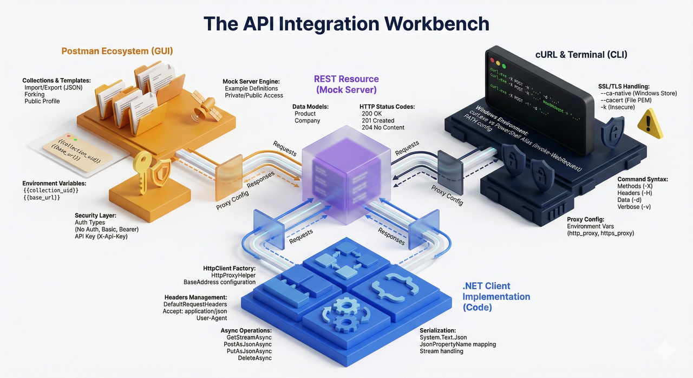

## Postman

Postman è uno strumento per l’invio di richieste HTTP e per il collaudo (testing) di API, utile sia in fase di sviluppo sia in fase di verifica funzionale.

- Sito ufficiale: <https://www.getpostman.com/>
- Postman Agent: <https://www.postman.com/downloads/postman-agent/>
- Learning Center: <https://learning.postman.com/>
- Postman Echo Docs: <https://docs.postman-echo.com/?version=latest>

## Testing di API con Postman

Materiale introduttivo consigliato:

- Introduzione a Postman: <https://learning.postman.com/docs/getting-started/introduction/>
- Invio della prima richiesta: <https://learning.postman.com/docs/getting-started/sending-the-first-request/>
- Modelli (templates) di collection Postman Echo: <https://www.postman.com/postman/workspace/published-postman-templates/documentation/631643-f695cab7-6878-eb55-7943-ad88e1ccfd65?ctx=documentation>

Per utilizzare modelli di richieste già pronti sono disponibili almeno due procedure:

1) esportare il modello in un file locale e successivamente importarlo nel proprio workspace di Postman;
2) effettuare il *fork* di una collection (operazione che richiede un profilo pubblico di Postman).

Di seguito sono illustrate entrambe le procedure.

### Esportazione e importazione di una collection pubblica

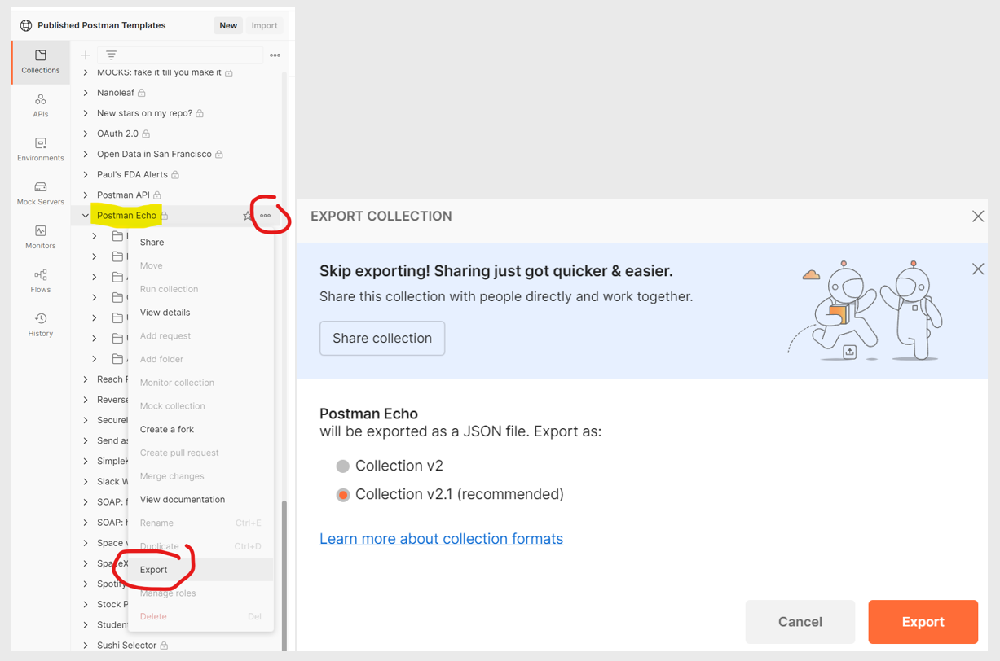

La collection deve essere salvata localmente in formato JSON.

Per importare la collection nel proprio workspace:

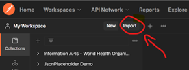

Selezionare “Choose Files” e quindi scegliere il file JSON scaricato tramite l’export. Dopo questa operazione la collection comparirà nel workspace.

### Fork di una collection

Nell’elenco dei modelli disponibili selezionare Postman Echo e quindi “Create a Fork”. In questo modo viene creata una copia della collection nel proprio workspace, con un nome scelto dall’utente, all’interno del proprio account Postman.

Per poter effettuare il fork di una collection pubblica è necessario rendere pubblico il proprio profilo: <https://blog.postman.com/how-to-create-your-postman-public-profile/>


Dopo la creazione del fork, la collection risulterà presente nel workspace dell’account.

Un profilo pubblico Postman consente inoltre di disporre di una pagina di presentazione raggiungibile all’indirizzo <https://www.postman.com/UserName> sulla quale è possibile pubblicare collection (rendendole copiabili da terzi tramite fork o import).

## Utilizzo di Postman con la collection Postman Echo

Riferimento: <https://learning.postman.com/docs/sending-requests/requests/>

Dopo l’importazione della collection di [Postman Echo](https://www.postman.com/postman/workspace/published-postman-templates/collection/631643-f695cab7-6878-eb55-7943-ad88e1ccfd65) (con una delle modalità descritte), è possibile utilizzare le richieste contenute nella collection per familiarizzare con lo strumento.

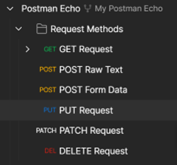

Eseguire le seguenti richieste:

GET <https://postman-echo.com/get?foo1=bar1&foo2=bar2>

POST <https://postman-echo.com/post>

PUT <https://postman-echo.com/put>

PATCH <https://postman-echo.com/patch>

DELETE <https://postman-echo.com/delete>

## Utilizzo della collection Postman API

Dopo aver importato nel proprio workspace la collection di [Postman API](https://www.postman.com/postman/workspace/published-postman-templates/collection/631643-dac5eac9-148d-a32e-b76b-3edee9da28f7), eseguire le seguenti richieste:


GET <https://api.getpostman.com/collections>

GET <https://api.getpostman.com/collections/{{collection_uid}}>

POST <https://api.getpostman.com/collections>

PUT <https://api.getpostman.com/collections/{{collection_uid}}>

DEL <https://api.getpostman.com/collections/{{collection_uid}}>

### API Key per le Postman API

Per effettuare le richieste verso le Postman API è obbligatorio utilizzare una API Key. La documentazione specifica che:

- l’API Key deve essere inviata in ogni richiesta mediante header `X-Api-Key`;
- l’API Key identifica il chiamante e abilita l’accesso a ciò che è visibile nell’account Postman;
- per comodità operativa, la chiave può essere memorizzata in una variabile d’ambiente (environment) e richiamata automaticamente dalle richieste in collection.

Riferimenti utili:

- Dashboard delle integrazioni Postman (per la gestione delle chiavi): <https://go.postman.co/integrations/services/pm_pro_api>
- Variabili d’ambiente in Postman: <https://www.getpostman.com/docs/environments>
- Collections: <https://www.getpostman.com/docs/collections>

Per creare una API Key nel proprio account aprire la pagina:

<https://web.postman.co/settings/me/api-keys>

Selezionare “Generate API Key”, assegnare un nome alla chiave e salvare il valore in modo sicuro.

:::note
La chiave è visibile soltanto al momento della generazione; successivamente non viene più mostrata.
:::

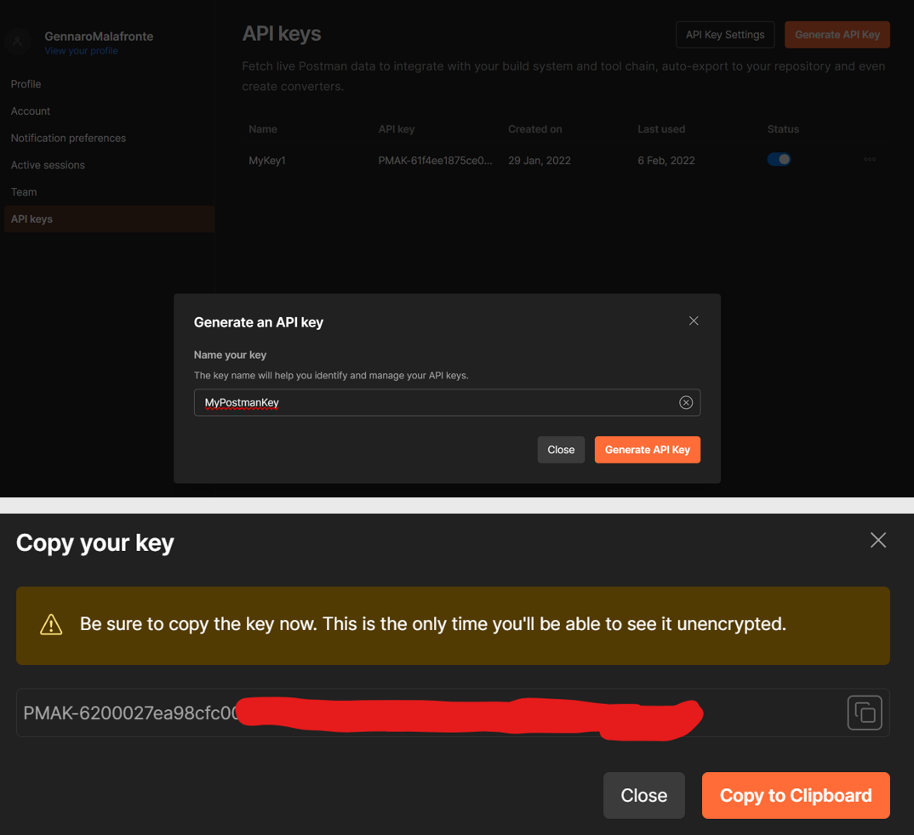

Con il valore generato, creare una variabile d’ambiente per la chiave da utilizzare nelle richieste.


La variabile d’ambiente viene denominata **postman_api_key** e viene richiamata nelle richieste della collection Postman API. Ad esempio:

GET <https://api.getpostman.com/collections>

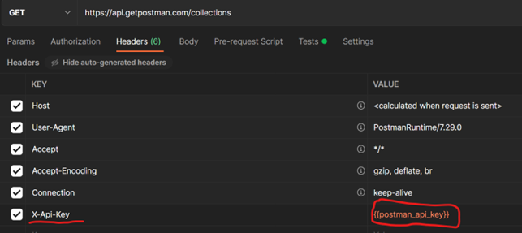

Dalla risposta alla richiesta precedente si ottiene la lista degli id/uid delle collection, ad esempio:

```json
"collections": [
        {
			"id": "196c9bb1-39d7-4724-a769-44a90f858db9",
			"name": "Sample Collection 25",
			"owner": "1643371",
			"createdAt": "2022-02-06T16:17:49.000Z",
			"updatedAt": "2022-02-06T16:45:08.000Z",
			"uid": "1643371-196c9bb1-39d7-4724-a769-44a90f858db9",
			"isPublic": false
		}
```

Con il valore del campo `uid` si può creare un’ulteriore variabile d’ambiente, ad esempio **collection_uid**, utilizzabile per richieste del tipo:

GET <https://api.getpostman.com/collections/{{collection_uid}}>

PUT <https://api.getpostman.com/collections/{{collection_uid}}>

DEL <https://api.getpostman.com/collections/{{collection_uid}}>

## Autorizzazione delle API in Postman

Riferimento principale: <https://learning.postman.com/docs/sending-requests/authorization/>

- No Auth: <https://learning.postman.com/docs/sending-requests/authorization/#no-auth>
- API key: <https://learning.postman.com/docs/sending-requests/authorization/#api-key>
- Basic Authentication: <https://learning.postman.com/docs/sending-requests/authorization/#basic-auth>
- Approfondimento (IT): <https://it.wikipedia.org/wiki/Basic_access_authentication>
- Bearer Token: <https://learning.postman.com/docs/sending-requests/authorization/#bearer-token>

## cURL

Sito ufficiale: <https://curl.se/>

### Versione di cURL preinstallata in Windows

In Windows 10 e Windows 11 `curl.exe` risulta generalmente già disponibile. Tuttavia, come indicato in <https://curl.se/windows/microsoft.html>, la versione distribuita da Microsoft può presentare limitazioni rispetto alle build ufficiali del progetto cURL.

Tra le differenze più comuni (a titolo esemplificativo):

- assenza del supporto alla compressione (l’opzione `--compressed` non funziona);
- assenza del supporto PSL (Public Suffix List), con riduzione di alcune protezioni contro “super cookie”;
- assenza del supporto HTTP/2 e HTTP/3;
- supporto ridotto di protocolli (ad esempio niente SCP/SFTP);
- build gestita e distribuita separatamente da Microsoft, potenzialmente con aggiornamenti meno frequenti rispetto alle release del progetto.

### Alias in PowerShell

Riferimento: <https://curl.se/windows/microsoft.html>

Approfondimento sul tema dell’alias `curl` in Windows PowerShell:

- <https://daniel.haxx.se/blog/2016/08/19/removing-the-powershell-curl-alias/>

In **Windows PowerShell** (ma non più in **PowerShell 7+**) `curl` può essere un alias del cmdlet `Invoke-WebRequest`, la cui sintassi differisce sensibilmente da `curl.exe`.

Documentazione del cmdlet: <https://learn.microsoft.com/en-us/powershell/module/microsoft.powershell.utility/invoke-webrequest>

Una soluzione consiste nell’invocare esplicitamente l’eseguibile con estensione:

- `curl.exe ...`

Approfondimento: <https://stackoverflow.com/a/77305766>

Per verificare gli alias in Windows PowerShell:

- `Get-Alias`

Documentazione: <https://learn.microsoft.com/en-us/powershell/module/microsoft.powershell.utility/get-alias>

Oppure, sfruttando le pipeline per ottenere un risultato analogo a `grep`:

`Get-Alias | Out-String -Stream | Select-String -Pattern 'curl'`

Approfondimenti:

- Pipeline (IT): <https://learn.microsoft.com/it-it/powershell/module/microsoft.powershell.core/about/about_pipelines>
- `Select-String`: <https://learn.microsoft.com/en-us/powershell/module/microsoft.powershell.utility/select-string>

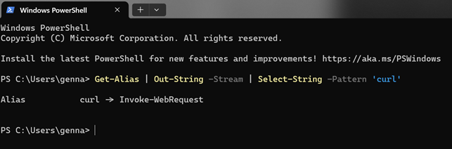

In PowerShell 7+ questo problema non si presenta tipicamente perché l’alias di `curl` è stato rimosso:

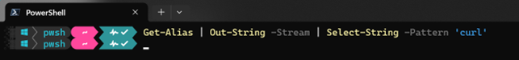

Se in Windows PowerShell si invoca `curl` senza `.exe`, può essere richiamato `Invoke-WebRequest` e le opzioni tipiche di cURL generano errore. In tale caso è necessario utilizzare `curl.exe` oppure usare PowerShell 7+.

#### Osservazione importante

**Windows PowerShell** e **PowerShell** sono prodotti separati.

- **Windows PowerShell** è la versione fornita con Windows, basata su .NET Framework, eseguibile solo su Windows. La versione più recente è Windows PowerShell 5.1; non riceve più nuove funzionalità.
- **PowerShell** (7+) è basato su .NET moderno ed è disponibile su Windows, Linux e macOS. Il supporto dipende dalla versione di .NET utilizzata.

Riferimento al ciclo di vita: <https://learn.microsoft.com/it-it/powershell/scripting/install/powershell-support-lifecycle?view=powershell-7.4>

### Installazione di cURL

Riferimento: <https://curl.se/download.html>

Poiché la versione preinstallata può essere limitata, può essere opportuno installare una build completa e aggiornata.

Opzioni comuni:

- Installazione con `winget`:

`winget install curl.curl`

- Download dell’eseguibile da:

<https://curl.se/windows/>

Si osservi che, anche installando una versione più recente, il comando `curl -V` può continuare a mostrare la versione preinstallata da Microsoft se il PATH di sistema privilegia ancora `C:\Windows\System32`.

Per individuare quale eseguibile viene effettivamente richiamato:

- in CMD: `where curl`
- in PowerShell: `where.exe curl` (poiché `where` senza `.exe` è alias di `Where-Object`)

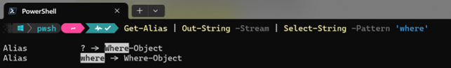

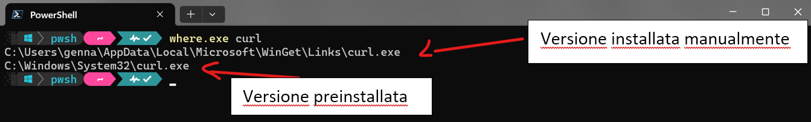

Nel caso mostrato, cURL è richiamato da `%appdata%\Local\Microsoft\WinGet\Links\curl.exe`.

Per usare la versione aggiornata è necessario fare in modo che il percorso sopra riportato compaia prima di `C:\Windows\System32` nel PATH di sistema.

Settings → Environment Variables:


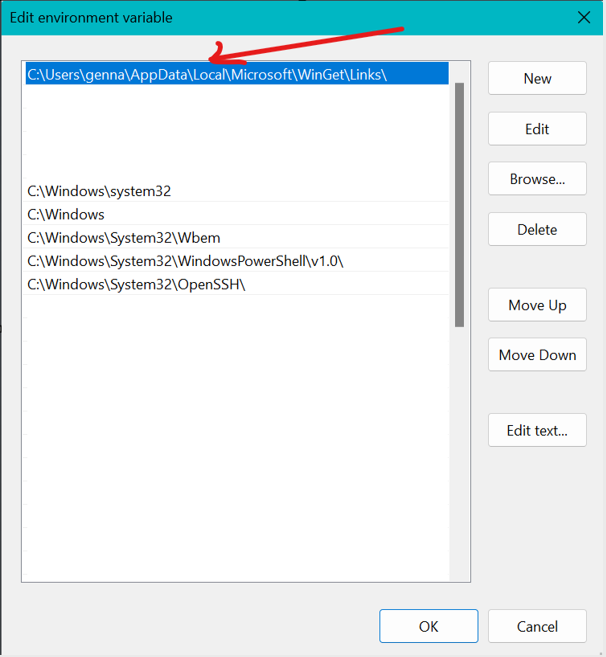

Dopo l’aggiornamento del PATH è opportuno chiudere e riaprire la shell e verificare la versione:

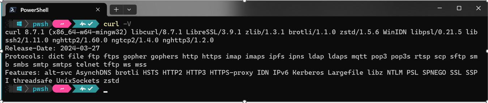

### Verifica dei certificati SSL (HTTPS)

Riferimenti:

- <https://curl.se/docs/sslcerts.html>
- <https://stackoverflow.com/questions/54938026/curl-unknown-error-0x80092012-the-revocation-function-was-unable-to-check-r>

Quando si utilizza cURL per accedere a un sito HTTPS, si pone il problema della **verifica dell’autenticità del server remoto**. Si tratta dello stesso principio adottato dai browser: il client deve disporre dei certificati (o delle chiavi pubbliche) delle Certification Authorities (CA) che consentono di validare il certificato digitale presentato dal server.

Ad esempio, quando un browser si connette al sito <https://www.istitutogreppi.edu.it>, esso verifica il certificato digitale del server:

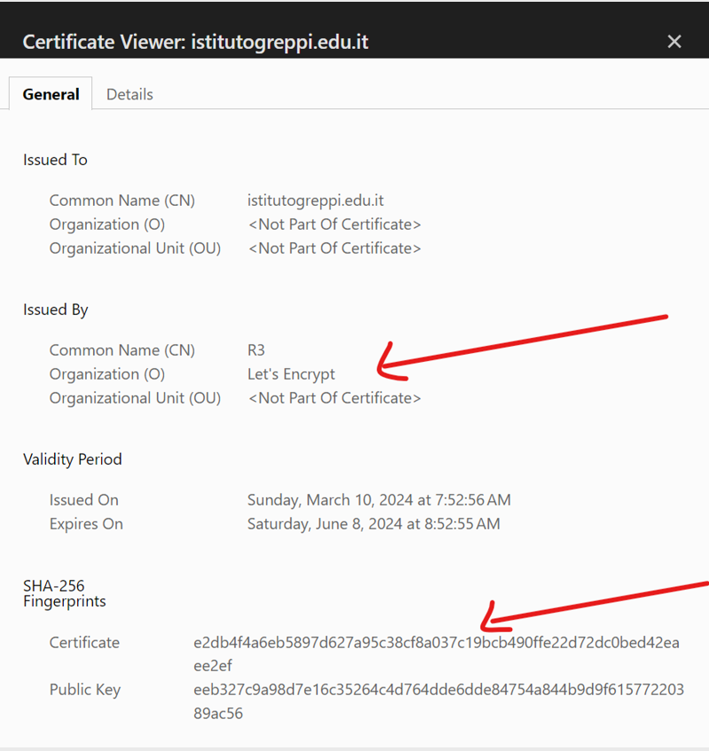

La procedura reale è articolata; per semplicità didattica si può assumere che:

- il browser disponga delle chiavi pubbliche delle Root Certification Authorities che firmano i certificati digitali (nel caso della scuola, ad esempio, Let’s Encrypt);
- la fingerprint del certificato venga prodotta dalla CA emittente tramite hashing dei dati del certificato e successiva firma (crittografia) con la chiave privata della CA;
- per verificare l’autenticità, il client ricalcola l’hash dei dati in chiaro del certificato e confronta il valore con quello ottenuto decifrando la fingerprint con la chiave pubblica della CA. Se coincidono, il client può concludere che:
  - il certificato è integro (non manomesso);
  - l’identità del server è coerente con la catena di trust verificata.

Approfondimenti introduttivi:

- <https://www.ssl.com/article/browsers-and-certificate-validation/>
- <https://proton.me/blog/tls-ssl-certificate>
- <https://proton.me/blog/what-is-a-digital-signature>

Nel caso della versione di cURL preinstallata in Windows (che utilizza [Schannel](https://learn.microsoft.com/en-us/windows/win32/com/schannel)), in genere non si riscontrano problemi di validazione perché viene usato l’elenco delle CA trusted di Windows.

Se invece si utilizza una versione aggiornata di cURL, è necessario configurare opportunamente la sorgente dei certificati, come indicato in <https://curl.se/docs/sslcerts.html>. 

Due alternative comuni sono:

1) utilizzare l’opzione `--ca-native` (disponibile in alcune versioni recenti, ad esempio dalla 8.2.0 in poi) per usare sostanzialmente lo store di Windows: <https://stackoverflow.com/a/37553616>.

    :::note
    L’opzione `-k` disabilita la validazione del certificato e non è raccomandata.
    :::

    Un esempio di POST in questo caso è:

    ```ps1
    curl --ca-native --request POST --location 'https://3ca86ebb-ff5d-4d05-aae4-117d2ea114ed.mock.pstmn.io/products' `
    --header 'Content-Type: application/json' `
    --header 'X-API-Key: chiave_segreta' `
    --data '{
        "name": "Honey - Comb",
        "price": 26.68,
        "company_id": 73
    }'
    ```

    :::note
    Nel caso di bash il carattere per continuare la riga è `\`, a differenza di PowerShell dove si usa il backtick `` ` ``.
    :::

2) utilizzare un file con i certificati delle CA (opzione `--cacert`), ad esempio esportando l’insieme di CA da Mozilla, come indicato in <https://curl.se/docs/caextract.html>. In tal caso:

    ```ps1
    curl --cacert path\to\cert\cacert.pem
    ```

    Ad esempio, ipotizzando che `cacert.pem` sia nella directory corrente:

    ```ps1
    curl --cacert .\cacert.pem --request POST --location 'https://3ca86ebb-ff5d-4d05-aae4-117d2ea114ed.mock.pstmn.io/products' `
     --header 'Content-Type: application/json' `
     --header 'X-API-Key: chiave_segreta' `
     --data '{
         "name": "Honey - Comb",
         "price": 26.68,
         "company_id": 73
     }'
    ```

    ```json
      {
            "id": 4,
            "name": "Honey - Comb",
            "price": 26.68,
            "company_id": 73
        }
    ```

    Risorse aggiuntive su cURL:

    - <https://everything.curl.dev/>
    - <https://dev.to/ritaly/the-simplest-guide-to-curl-for-rest-api-requests-35ii#get-request>

#### Proxy (ambiente scolastico)

In presenza di proxy (scenario frequente in rete scolastica) è necessario configurare le variabili d’ambiente del proxy.

In PowerShell:

`$env:http_proxy="proxy:3128"`

`$env:https_proxy="proxy:3128"`

In CMD:

`set http_proxy=proxy:3128`

`set https_proxy=proxy:3128`

In Linux bash:

`export http_proxy="proxy:3128"`

`export https_proxy="proxy:3128"`

### cURL basics

- Comandi di cURL in Windows: <https://ss64.com/nt/curl.html>
- Comandi di cURL in bash: <https://ss64.com/bash/curl.html>
- Guida generale: <https://everything.curl.dev/cmdline>
- Modifica del metodo HTTP: <https://everything.curl.dev/http/modify/method>
- Esempio (IP pubblico): <https://linuxconfig.org/how-to-use-curl-to-get-public-ip-address>

## Realizzazione di un Mock Server

Approfondimento: <https://it.wikipedia.org/wiki/Mock_object>

Nel contesto della programmazione orientata agli oggetti, un **mock object** (oggetto simulato) riproduce in modo controllato il comportamento di un oggetto reale. Il mock consente di testare componenti che dipendono da risorse non disponibili, inaccessibili oppure non ancora implementate; in tali casi l’oggetto reale viene sostituito dal mock.

## Postman Mock Server

Video introduttivi:

- <https://www.youtube.com/watch?v=n_7UUghLpco>
- <https://www.youtube.com/watch?v=pAD11I3k9q0&t=157s>

Postman può essere utilizzato anche per realizzare un mock di endpoint REST. Il primo passo consiste nel creare un Mock Server:


Per creare un Mock Server è necessario definire almeno una rotta con un esempio. Un esempio descrive una richiesta (con un determinato valore) e la corrispondente risposta attesa.

Nel seguito si realizza un Mock Server ad accesso libero che consente di effettuare una GET per ottenere l’elenco dei prodotti su un endpoint API.

### Creazione del Mock Server

Per creare un mock server è necessario inserire almeno un esempio di richiesta. Ad esempio, si inserisce una **GET /products** che produce come risposta iniziale un oggetto vuoto `{}`. Successivamente si dettagliano meglio richiesta e risposta.

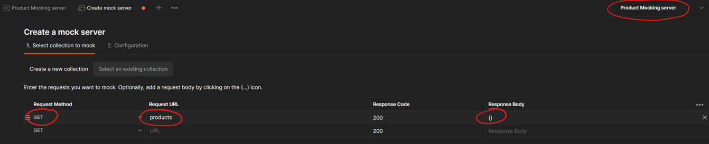

Dopo aver selezionato “Next” si definisce il nome del Mock Server:


Si assegna al server il nome **Product Mocking Server** e si mantiene attiva l’opzione che salva la URL del server in una variabile d’ambiente. Postman crea quindi il Mock Server e mostra la relativa pagina iniziale:

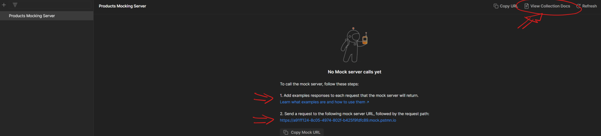

Postman crea automaticamente:

- un ambiente (Environment) con lo stesso nome del Mock Server;
- una collection, anch’essa con lo stesso nome.

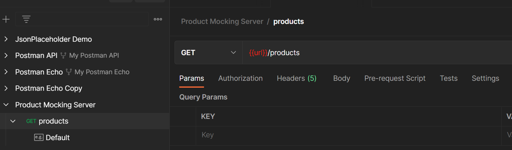
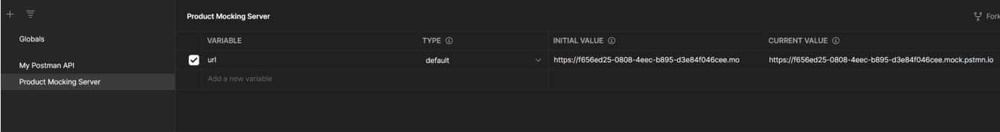

Una volta creato il Mock Server, è possibile modificare l’esempio relativo alla GET **{{url}}/products** e aggiungere ulteriori endpoint con i rispettivi esempi.

### Definizione degli esempi di risposta

Per fare in modo che, quando si effettua una richiesta al Mock Server, si ottenga come risposta un elenco di prodotti in formato JSON, si modifica la risposta dell’esempio “default” incollando dati JSON (ad esempio generati con Mockaroo).

È inoltre necessario configurare l’header di risposta, impostando `Content-Type` a `application/json`.


Selezionare “Save” per salvare l’esempio relativo alla rotta `/products`.

Per testare l’esempio, selezionare la richiesta e usare “Send”: Postman mostrerà la risposta coerente con l’esempio definito.

È possibile aggiungere un secondo esempio sulla rotta `/products` per ottenere un prodotto specifico (ad esempio con rotta `/products/:id`). Procedere con la creazione di ulteriori esempi sulla stessa richiesta:

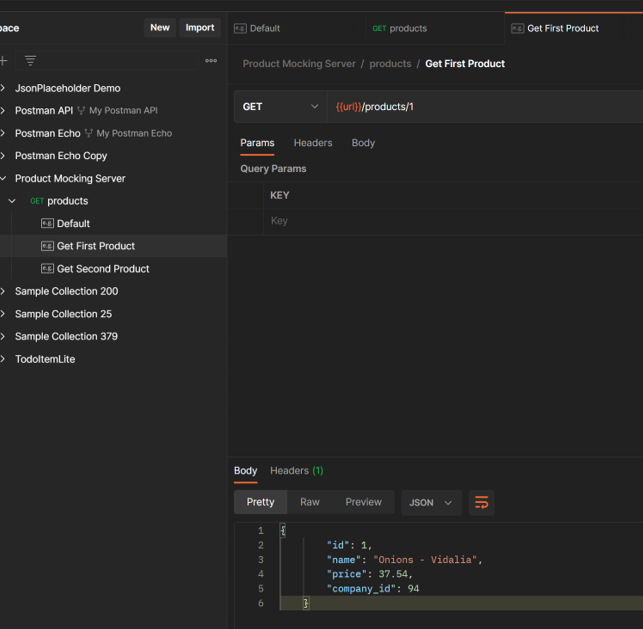


È possibile aggiungere anche la rotta relativa alle aziende, procedendo in modo analogo a quanto fatto per `products`. Si ottiene dunque la rotta `/companies` con dati analogamente generati:

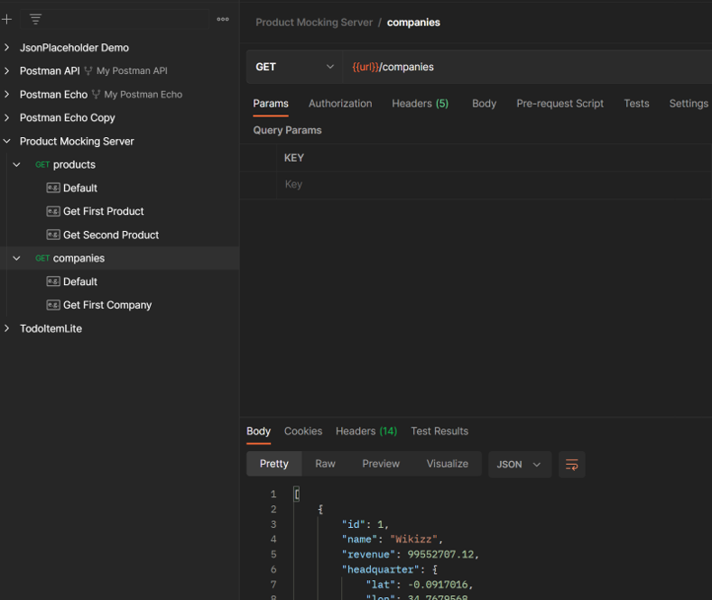

### Utilizzo di un Postman Mock Server per il testing di un’applicazione client

Un Mock Server può essere utilizzato anche al di fuori dell’ambiente Postman, ad esempio per testare un’applicazione client in sviluppo.

Nel caso di un server ad accesso libero, esso può essere interrogato anche da browser. Dalle proprietà del Mock Server, selezionando “View Documentation”, è possibile individuare la URL del server e delle rotte:

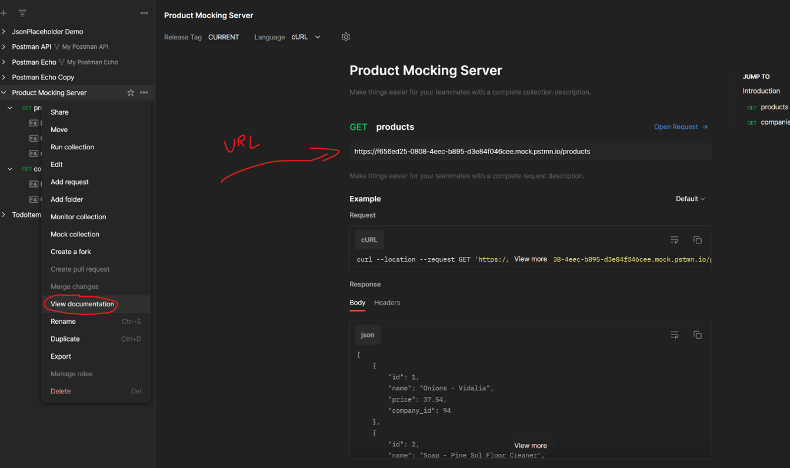

Incollando la URL nel browser si ottiene una risposta dal Mock Server:

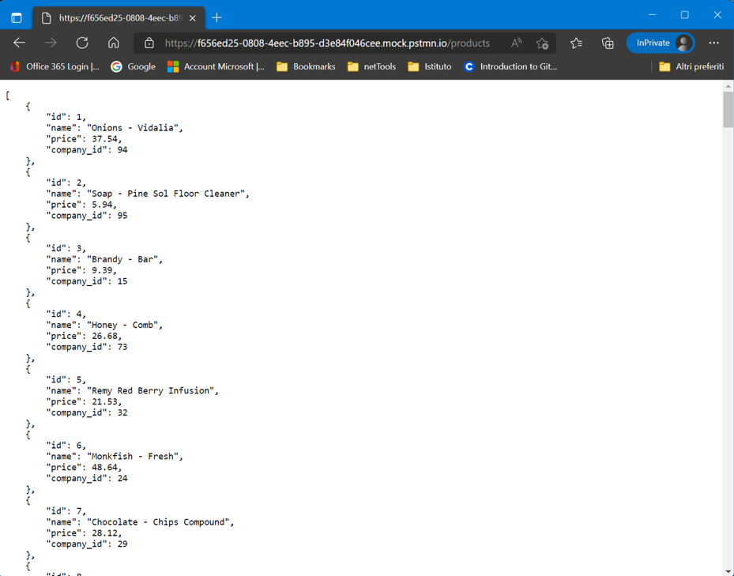

Questo consente di sviluppare un’applicazione client utilizzando il Mock Server prima che sia pronto il server REST reale.

:::note
Un mock server non è destinato all’uso in produzione: simula un comportamento, ma non implementa realmente persistenza e logica applicativa (ad esempio, una POST/PUT può non salvare dati in modo permanente).
:::

### Postman Mock Server privato

Postman consente anche di creare Mock Server privati, accessibili solo tramite autenticazione (ad esempio mediante una chiave).

Per creare un **Product Secure Mocking Server** si può procedere come segue:

1) creare un mock server come nei paragrafi precedenti e, nelle opzioni, selezionare l’opzione di server privato:

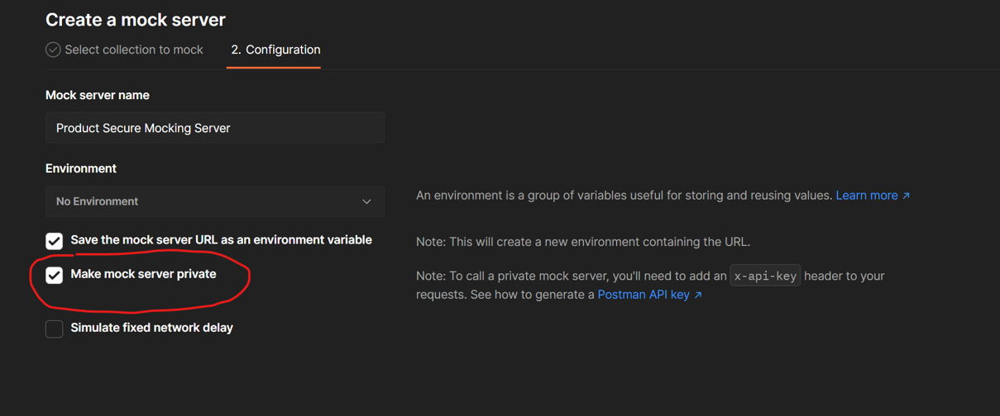

2) inserire una Postman API Key (generata come descritto in precedenza) nell’header delle richieste HTTP, ad esempio come campo `x-api-key`;

3) creare le richieste GET, POST, PUT, DELETE analogamente agli esempi già realizzati.

Esempi:


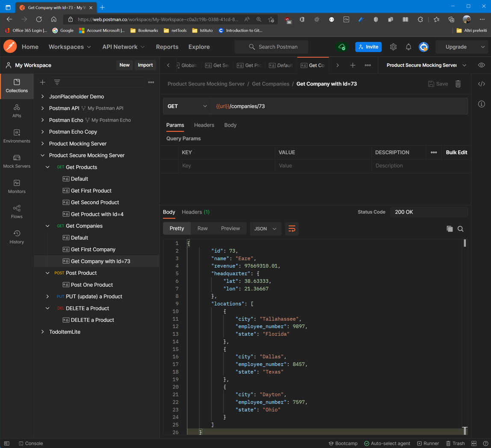

Negli esempi sono stati inseriti:

- la GET di un prodotto con `id = 4`;
- la GET di una compagnia con `id = 73` corrispondente al `company_id` del prodotto con `id = 4`.

### Documentation Page del server Product Secure Mocking Server

<https://documenter.getpostman.com/view/1643371/2s93JnT6Bz>


### Testing di un server API con cURL

Si propone di testare il server privato creato con cURL. Dalla pagina di documentazione del Mock Server è possibile consultare le rotte definite e alcuni esempi di comandi.

Selezionando “cURL” nel menù in alto della pagina di documentazione, Postman propone esempi di comandi per testare le rotte.


Ad esempio, per eseguire la GET su `products` la documentazione suggerisce:

```ps1
curl --location 'https://3ca86ebb-ff5d-4d05-aae4-117d2ea114ed.mock.pstmn.io/products' \
--header 'Accept: application/json'
```

Questo comando, così come riportato, non funziona in PowerShell per diversi motivi:

1) è necessario inserire una chiave privata di Postman;

2) la URL deve essere quella del proprio mock server;

3) in PowerShell il carattere `` (che in bash indica la prosecuzione su riga successiva) non viene interpretato correttamente: in PowerShell il carattere per la prosecuzione è ``` `` (ALT+96). In CMD si usa `^`;

4) il certificato digitale del server potrebbe non risultare valido, a meno di usare la versione di cURL preinstallata in Windows (Schannel) o opzioni adeguate.

Il comando cURL per PowerShell può essere riscritto come segue (a scuola è necessario impostare le variabili d’ambiente della shell per il proxy):

```ps1
curl --ca-native --location 'https://id_proprio_server.mock.pstmn.io/products' `
--header 'Accept: application/json' --header 'X-API-Key: valore_chiave_di_postman'
```

In realtà non è strettamente necessario impostare `--location` (`-L`, follow redirects). L’istruzione può essere:

```ps1
curl 'https://id_proprio_server.mock.pstmn.io/products' `
-H 'Accept: application/json' -H 'X-API-Key: valore_chiave_di_postman'
```

È ammesso anche l’uso dei doppi apici al posto dei singoli apici con cURL.

Per finalità didattiche è utile aggiungere `--verbose` (o `-v`) per visualizzare lo scambio di messaggi tra client e server. I campi preceduti da `>` sono inviati da cURL verso il server; quelli preceduti da `<` provengono dal server.

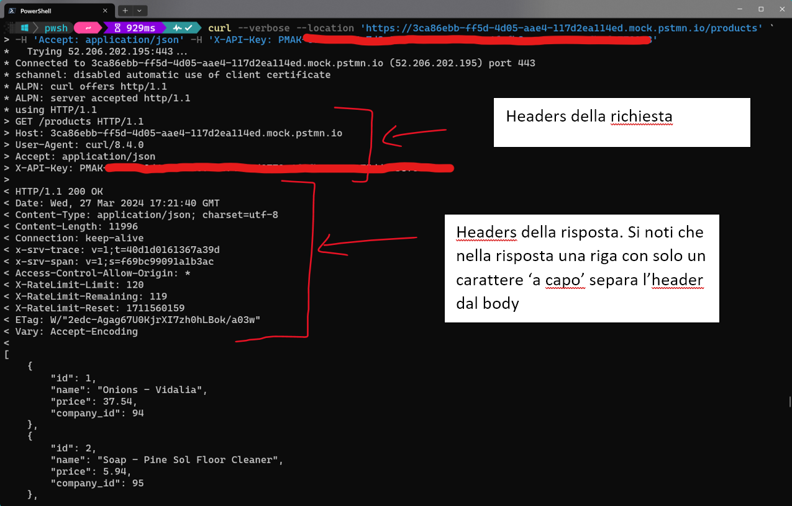

Test di una POST con cURL:

```ps1
curl --ca-native --request POST --location 'https://id_proprio_server.mock.pstmn.io/products' `
--header 'Content-Type: application/json' `
--header 'X-API-Key: valore_chiave_di_postman' `
--data '{
    "name": "Honey - Comb",
    "price": 26.68,
    "company_id": 73
}'
```

Oppure, usando le opzioni in forma abbreviata:

```ps1
curl --ca-native -X POST -L 'https://id_proprio_server.mock.pstmn.io/products' `
-H 'Content-Type: application/json' `
-H 'X-API-Key: valore_chiave_di_postman' `
-d '{
    "name": "Honey - Comb",
    "price": 26.68,
    "company_id": 73
}'
```

Oppure è possibile non specificare il tipo di richiesta e sfruttare i default (GET senza dati, POST con dati):

```ps1
curl --ca-native 'https://id_proprio_server.mock.pstmn.io/products' `
-H 'Content-Type: application/json' `
-H 'X-API-Key: valore_chiave_di_postman' `
-d '{
    "name": "Honey - Comb",
    "price": 26.68,
    "company_id": 73
}'
```

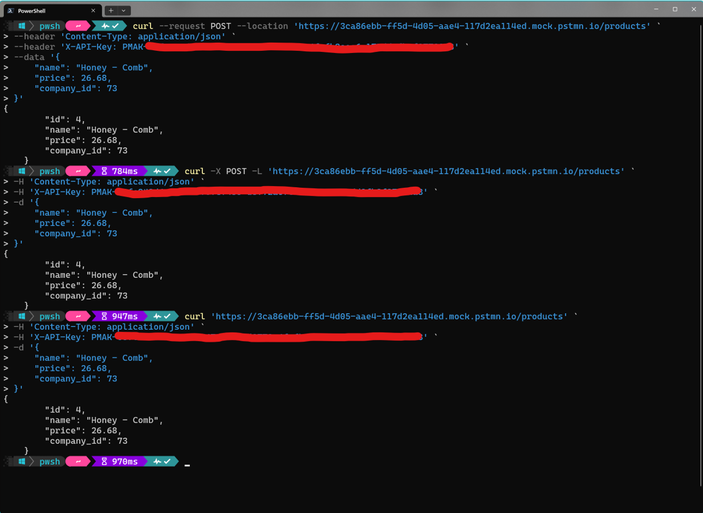

Test di una PUT con cURL (nel caso di PUT occorre specificare l’id):

```ps1
curl --ca-native --request PUT --location 'https://id_proprio_server.mock.pstmn.io/products/4' `
--header 'Content-Type: application/json' `
--header 'X-API-Key: valore_chiave_di_postman' `
--data '{
        "id": 4,
        "name": "Honey - Comb",
        "price": 40.0,
        "company_id": 73
    }'
```

oppure in forma abbreviata:

```ps1
curl --ca-native -X PUT -L 'https://id_proprio_server.mock.pstmn.io/products/4' `
-H 'Content-Type: application/json' `
-H 'X-API-Key: valore_chiave_di_postman' `
-d '{
        "id": 4,
        "name": "Honey - Comb",
        "price": 40.0,
        "company_id": 73
    }'
```

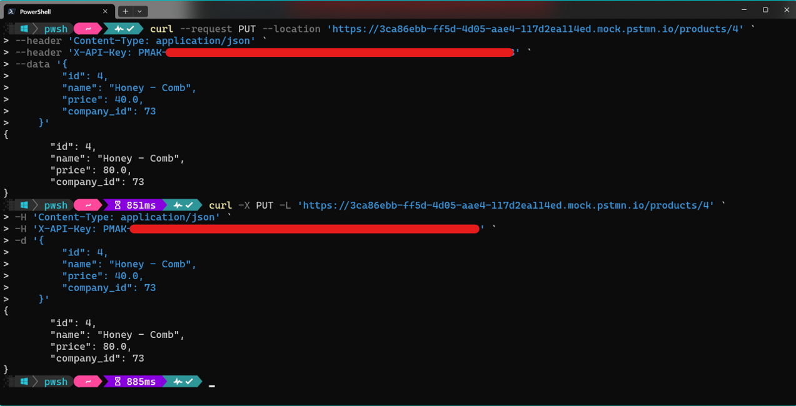

Test di una DELETE con cURL (occorre specificare l’id):

```ps1
curl --ca-native --request DELETE --location 'https://id_proprio_server.mock.pstmn.io/products/4' `
--header 'X-API-Key: valore_chiave_di_postman'
```

oppure in forma abbreviata:

```ps1
curl --ca-native -X DELETE -L 'https://id_proprio_server.mock.pstmn.io/products/4' `
--header 'X-API-Key: valore_chiave_di_postman'
```


In bash (Linux) i comandi rimangono sostanzialmente gli stessi, ma per indicare la prosecuzione su riga successiva si usa ``. Ad esempio:

```ps1
curl --ca-native --location 'https://id_proprio_server.mock.pstmn.io/products/1' \
-H 'Accept: application/json' -H 'X-API-Key: valore_chiave_di_postman'
curl --ca-native -X POST -L 'https://id_proprio_server.mock.pstmn.io/products' \
-H 'Content-Type: application/json' \
-H 'X-API-Key: valore_chiave_di_postman' \
-d '{
    "name": "Honey - Comb",
    "price": 26.68,
    "company_id": 73
}'
curl --ca-native -X PUT -L 'https://id_proprio_server.mock.pstmn.io/products/4' \
-H 'Content-Type: application/json' \
-H 'X-API-Key: valore_chiave_di_postman' \
-d '{
        "id": 4,
        "name": "Honey - Comb",
        "price": 40.0,
        "company_id": 73
    }'
curl --ca-native -X DELETE -L 'https://id_proprio_server.mock.pstmn.io/products/4' \
--header 'X-API-Key: valore_chiave_di_postman'
```

## Scrittura di un client console per le Mock API di Postman

Riferimenti:

- <https://learning.postman.com/docs/designing-and-developing-your-api/mocking-data/setting-up-mock/>
- <https://learning.postman.com/docs/sending-requests/authorization/>
- <https://learning.postman.com/docs/developer/intro-api/>

In questa sezione si definisce un esempio di client console che interroga un mock server Postman, costruendo i model a partire dai dati JSON.

```csharp
//file Company.cs
using System.Text.Json.Serialization;
namespace APIClientForPostmanMockServer.Model
{
     public class Company
     {
         [JsonPropertyName("id")]
         public int Id { get; set; }
         [JsonPropertyName("name")]
         public string? Name { get; set; }
         [JsonPropertyName("revenue")]
         public float Revenue { get; set; }
         [JsonPropertyName("headquarter")]
         public Headquarter? Headquarter { get; set; }
         [JsonPropertyName("locations")]
         public Location[]? Locations { get; set; }
     }
     public class Headquarter
     {
         [JsonPropertyName("lat")]
         public float Lat { get; set; }
         [JsonPropertyName("lon")]
         public float Lon { get; set; }
     }
     public class Location
     {
         [JsonPropertyName("city")]
         public string? City { get; set; }
         [JsonPropertyName("employee_number")]
         public int EmployeeNumber { get; set; }
         [JsonPropertyName("state")]
         public string? State { get; set; }
     }
}
//file Product.cs
using System.Text.Json.Serialization;
namespace APIClientForPostmanMockServer.Model
{
     public class Product
     {
         [JsonPropertyName("id")]
         public int Id { get; set; }
         [JsonPropertyName("name")]
         public string? Name { get; set; }
         [JsonPropertyName("price")]
         public decimal Price { get; set; }
         [JsonPropertyName("company_id")]
         public int CompanyId { get; set; }
     }
}
//file Program.cs
using HttpProxyControl;
using System.Net.Http.Headers;
using System.Net.Http.Json;
using System.Net;
using System.Text;
using System.Text.Json;
using System.Text.Json.Serialization;
using APIClientForPostmanMockServer.Model;
namespace APIClientForPostmanMockServer
{
     public class PostmanStore
     {
         [JsonPropertyName("api_key")]
         public string APIKeyValue { get; set; } = string.Empty;
         [JsonPropertyName("base_address")]
         public string BaseAddress { get; set; } = string.Empty;
     }
     class Program
     {
         const string APIKeyName = "X-API-Key";
         static readonly PostmanStore postmanStore = GetDataFromStore();
         static readonly string APIKeyValue = postmanStore.APIKeyValue;
         static readonly string baseAddress = postmanStore.BaseAddress;
         static readonly string acceptedMediaType = "application/json";
         static readonly HttpClient _client = HttpProxyHelper.CreateHttpClient(setProxy: true);
         /// <summary>
         /// Recupera i secrets da file
         /// </summary>
         /// <returns></returns>
         static PostmanStore GetDataFromStore()
         {
             //il file è nella cartella che contiene la soluzione corrente
             //il file contiene un oggetto JSON del tipo:
             //{
             //    "api_key":"api_key_value",
             //    "base_address": "base_address_value"
             //}
             string keyStorePath = "../../../../../../MyPostmanStore.json";
             string store = File.ReadAllText(keyStorePath);
             PostmanStore? postmanStore = JsonSerializer.Deserialize<PostmanStore>(store);
             return postmanStore ?? new PostmanStore();
         }
         /// <summary>
         /// Configura i parametri dell'header per effettuare le richieste all'endpoint remoto
         /// Il base address del client viene configurato con il base URL del server
         /// https://swagger.io/docs/specification/2-0/api-host-and-base-path/
         /// L'header viene resettato e vengono aggiunti il media type e l'X-API-Key
         /// </summary>
         static void ConfigureHttpClientHeaders()
         {
             _client.BaseAddress = new Uri(baseAddress);
             _client.DefaultRequestHeaders.Accept.Clear();
             _client.DefaultRequestHeaders.Accept.Add(
                 new MediaTypeWithQualityHeaderValue(acceptedMediaType));
             //https://stackoverflow.com/questions/53551361/how-to-add-api-key-in-request-header-using-web-api
             //https://stackoverflow.com/questions/14627399/setting-authorization-header-of-httpclient
             //l'istruzione seguente scrive nello header del messaggio http di richiesta la x-api-key
             _client.DefaultRequestHeaders.Add(APIKeyName, APIKeyValue);
         }
         static async Task Main(string[] args)
         {
             // https://learn.microsoft.com/en-us/dotnet/api/system.threading.tasks.task.getawaiter
             //GetAwaiter is intended for compiler use rather than use directly in code.
             //RunAsync().GetAwaiter().GetResult();
             await RunAsync();
         }
         static async Task RunAsync()
         {
             ConfigureHttpClientHeaders();
             try
             {
                 Console.WriteLine("\n\n****************************************************************");
                 Console.WriteLine("Test di POST");
                 Console.WriteLine("Simuliamo la POST per inserire un prodotto sull'endpoint remoto");
                 // Create a new product
                 Product? product = new()
                 {
                     Name = "Insalata verde",
                     Price = 1.55m,
                     CompanyId = 34
                 };
                 //la POST dovrebbe restituire l'uri dell'oggetto creato e il suo id
                 Uri? url = await PostProductAsync(product, _client);
                 if (url != null)
                 {
                     Console.WriteLine($"Created at {url}");
                     // Get the product
                     //con l'uri della risorsa creata sul server remoto recuperiamo l'oggetto
                     Console.WriteLine("Il prodotto caricato sul server mediante la POST non è realmente salvato, \n" +
                         "quindi quando recuperiamo il valore tramite la sua url otteniamo un valore diverso");
                     product = await GetProductAsync(url.PathAndQuery, _client);
                     if (product != null)
                     {
                         ShowProduct(product);
                         // Update the product
                         Console.WriteLine("\n\n****************************************************************");
                         Console.WriteLine("Test di PUT");
                         Console.WriteLine("Updating price...");
                         product.Price = 80;
                         Product? updatedProduct = await PutProductAsync(product, _client);
                         // Get the updated product
                         //Console.WriteLine("Il prodotto aggiornato");
                         //product = await GetProductAsync(url.PathAndQuery);
                         if (updatedProduct != null)
                         {
                             ShowProduct(updatedProduct);
                         }
                         // Delete the product
                         Console.WriteLine("\n\n****************************************************************");
                         Console.WriteLine("Test di DELETE");
                         Console.WriteLine($"Eliminiamo il prodotto con id = {product.Id}");
                         var statusCode = await DeleteProductAsync(product.Id, _client);
                         Console.WriteLine($"Deleted (HTTP Status = {(int)statusCode})");
                     }
                 }
                 //otteniamo tutti i prodotti
                 Console.WriteLine("\n\n****************************************************************");
                 Console.WriteLine("Test di GET di tutti i prodotti");
                 Console.WriteLine("Elenco dei prodotti");
                 var products = await GetAllProductsAsync("products", _client);
                 if (products != null)
                 {
                     ShowProducts(products);
                 }
                 //dato un prodotto, ottenere i dati dell'azienda che produce tale prodotto
                 Console.WriteLine("\n\n****************************************************************");
                 Console.WriteLine("Dato un prodotto, ottenere i dati dell'azienda che produce tale prodotto");
                 //Console.Write("Inserisci l'id di un prodotto: ");
                 //int productId = int.Parse(Console.ReadLine() ?? "0");
                 int productId = 4;
                 Console.WriteLine($"Recuperiamo il prodotto con id = {productId}: ");
                 string productUri = $"products/{productId}";
                 product = await GetProductAsync(productUri, _client);
                 if (product != null)
                 {
                     JsonSerializerOptions options = new() { WriteIndented = true };
                     Console.WriteLine("il prodotto corrispondente all'id inserito è:");
                     Console.WriteLine(JsonSerializer.Serialize(product, options));
                     //si noti che il prodotto ottenuto non corrisponde a quello riportato con
                     //lo stesso id nell'elenco dei prodotti, poiché viene generato a caso ogni volta
                     string companyUri = $"companies/{product.CompanyId}";
                     Company? company = await GetCompanyAsync(companyUri, _client);
                     if (company != null)
                     {
                         Console.WriteLine("L'azienda che produce il prodotto scelto è:");
                         Console.WriteLine(JsonSerializer.Serialize(company, options));
                     }
                 }
                 Console.WriteLine("\n\n****************************************************************");
                 Console.WriteLine("Elenco di tutte le compagnie");
                 var companies = await GetAllCompaniesAsync("companies", _client);
                 if (companies != null)
                 {
                     JsonSerializerOptions options = new() { WriteIndented = true };
                     companies.ForEach(c => Console.WriteLine(JsonSerializer.Serialize(c, options) + "\n"));
                 }
                 Console.WriteLine("Test completato");
             }
             catch (HttpRequestException e)
             {
                 Console.WriteLine("C'è stato un errore con la richiesta effettuata");
                 Console.WriteLine(e.Message);
             }
             catch (Exception e)
             {
                 Console.WriteLine(e.Message);
             }
             Console.ReadLine();
         }
         static void ShowProduct(Product product)
         {
             Console.WriteLine($"Id: {product.Id} Name: {product.Name,-50} Price: " +
                 $"{product.Price}\tCompanyId: {product.CompanyId}");
         }
         static void ShowProducts(List<Product> products)
         {
             products.ForEach(p => ShowProduct(p));
         }
         #region REST_Methods_Products
         /// <summary>
         /// Effettua la POST di un nuovo prodotto sul server
         /// </summary>
         /// <param name="product">il prodotto da creare sul server</param>
         /// <returns>l'URI della risorsa creata, oppure null se l'uri non è fornito dal server</returns>
         /// <exception cref="HttpRequestException">Se lo status code restituito dall'endpoint corrisponde ad un errore</exception>
         static async Task<Uri?> PostProductAsync(Product product, HttpClient client)
         {
             HttpResponseMessage response = await client.PostAsJsonAsync(
                 "products", product);
             //verifico che l'operazione abbia avuto successo
             response.EnsureSuccessStatusCode();
             //sull'oggetto response posso fare diverse elaborazioni
             //se il server restituisce l'oggetto creato:
             //1)posso recuperarlo dal body della risposta
             Product? prodottoCreato = await response.Content.ReadFromJsonAsync<Product>();
             if (prodottoCreato != null)
             {
                 Console.WriteLine("Prodotto creato:\n" + JsonSerializer.Serialize(prodottoCreato));
             }
             //2)oppure posso leggere il body della risposta come stringa e poi elaborarla
             string responseContentAsstring = await response.Content.ReadAsStringAsync();
             Product? prodotto = JsonSerializer.Deserialize<Product>(responseContentAsstring);
             if (prodotto != null)
             {
                 Console.WriteLine("Prodotto creato come stringa\n" + responseContentAsstring);
             }
             //se il server restituisce l'uri della risorsa
             // return URI of the created resource.
             Uri? resourceUri = response.Headers.Location;
             if (resourceUri != null)
             {
                 Console.WriteLine("Headers location: " + response.Headers.Location);
                 return response.Headers.Location;
             }
             else
             {
                 return null;
             }
         }
         //effettua la POST utilizzando il metodo PostAsync e l'oggetto StringContent
         static async Task<Uri?> PostProductAsync2(Product product, HttpClient client)
         {
             //trasformo l'oggetto in formato JSON
             string data = JsonSerializer.Serialize(product);
             //trasformo il JSON in uno StringContent
             var content = new StringContent(data, Encoding.UTF8, "application/json");
             //faccio la Post asincrona dello StringContent
             var response = await client.PostAsync("products", content);
             //verifico che l'operazione sia andata a buon fine
             response.EnsureSuccessStatusCode();
             //sull'oggetto response posso fare diverse elaborazioni
             //se il server restituisce l'oggetto creato, posso recuperarlo dal body della risposta
             Product? prodottoCreato = await response.Content.ReadFromJsonAsync<Product>();
             Console.WriteLine("Prodotto creato:\n" + JsonSerializer.Serialize(prodottoCreato));
             //oppure posso leggere il body della risposta come stringa e poi elaborarla
             string prodottoCreatoAsString = await response.Content.ReadAsStringAsync();
             Product? prodotto = JsonSerializer.Deserialize<Product>(prodottoCreatoAsString);
             Console.WriteLine("Prodotto creato come stringa\n" + prodottoCreatoAsString);
             // return URI of the created resource.
             Console.WriteLine("Headers location: " + response.Headers.Location);
             return response.Headers.Location;
         }
         /// <summary>
         /// Effettua una GET sul server per recuperare un oggetto di cui è specificato l'id nella rotta
         /// </summary>
         /// <param name="path"></param>
         /// <returns>Il prodotto </returns>
         static async Task<Product?> GetProductAsync(string path, HttpClient client)
         {
             Product? product = null;
             HttpResponseMessage response = await client.GetAsync(path);
             if (response.IsSuccessStatusCode)
             {
                 product = await response.Content.ReadFromJsonAsync<Product?>();
             }
             return product;
         }
         /// <summary>
         /// Effettua una GET sul server per richiedere tutti i prodotti.
         /// In questo caso si utilizza il metodo GetStreamAsync di HttpClient in abbinamento al DeserializeAsync
         /// di JsonSerializer
         /// </summary>
         /// <param name="path"></param>
         /// <returns></returns>
         static async Task<List<Product>?> GetAllProductsAsync(string path, HttpClient client)
         {
             await using Stream stream = await client.GetStreamAsync(path);
             var products = await JsonSerializer.DeserializeAsync<List<Product>>(stream);
             return products;
         }
         static async Task<Product?> PutProductAsync(Product product, HttpClient client)
         {
             HttpResponseMessage response = await client.PutAsJsonAsync(
                 $"products/{product.Id}", product);
             response.EnsureSuccessStatusCode();
             //Console.WriteLine("Aggiornamento effettuato");
             // Deserialize the updated product from the response body.
             Product? updatedProduct = await response.Content.ReadFromJsonAsync<Product?>();
             //Console.WriteLine("Prodotto aggiornato sul server:\n" + JsonSerializer.Serialize(updatedProduct));
             return updatedProduct;
         }
         static async Task<HttpStatusCode> DeleteProductAsync(int id, HttpClient client)
         {
             HttpResponseMessage response = await client.DeleteAsync(
                 $"products/{id}");
             return response.StatusCode;
         }
         #endregion REST_Methods_Products
         #region REST_Methods_Companies
         static async Task<Company?> GetCompanyAsync(string path, HttpClient client)
         {
             return await client.GetFromJsonAsync<Company>(path);
         }
         static async Task<List<Company></Company>?> GetAllCompaniesAsync(string path, HttpClient client)
         {
             await using Stream stream = await client.GetStreamAsync(path);
             var companies = await JsonSerializer.DeserializeAsync<List<Company>>(stream);
             return companies;
         }
         static async Task<List<Company>?> GetAllCompaniesAsync2(string path, HttpClient client)
         {
             HttpResponseMessage response = await client.GetAsync(path);
             string? companies = await response.Content.ReadAsStringAsync();
             return JsonSerializer.Deserialize<List<Company>?>(companies);
         }
         static async Task<List<Company>?> GetAllCompaniesAsync3(string path, HttpClient client) => await client.GetFromJsonAsync<List<Company>>(path);
         #endregion REST_Methods_Companies
     }
}
```