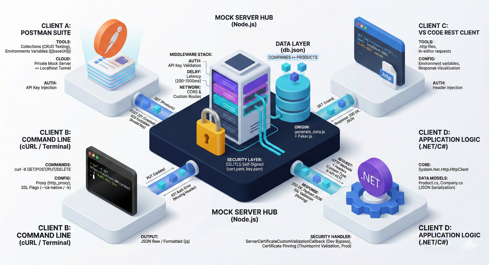

import Accordion from "@components/Accordion.astro";

<style>{`
  img {display: block; margin: 0 auto;}
`}</style>



## Postman

Postman è uno strumento per l'invio di richieste HTTP e per il collaudo (testing) di API, utile sia in fase di sviluppo sia in fase di verifica funzionale.

- Sito ufficiale: [Postman](https://www.getpostman.com/)
- Postman Agent: [Postman Agent](https://www.postman.com/downloads/postman-agent/)
- Learning Center: [Learning Center](https://learning.postman.com/)
- Postman Echo Docs: [Postman Echo Docs](https://docs.postman-echo.com/?version=latest)

## Testing di API con Postman

Materiale introduttivo consigliato:

- Introduzione a Postman: [Introduzione a Postman](https://learning.postman.com/docs/getting-started/introduction/)
- Invio della prima richiesta: [Invio della prima richiesta](https://learning.postman.com/docs/getting-started/sending-the-first-request/)
- Modelli (templates) di collection Postman Echo: [Modelli di collection Postman Echo](https://www.postman.com/postman/workspace/published-postman-templates/documentation/631643-f695cab7-6878-eb55-7943-ad88e1ccfd65?ctx=documentation)

Per utilizzare modelli di richieste già pronti sono disponibili almeno due procedure:

1. esportare il modello in un file locale e successivamente importarlo nel proprio workspace di Postman;
2. effettuare il _fork_ di una collection (operazione che richiede un profilo pubblico di Postman).

Di seguito sono illustrate entrambe le procedure.

### Esportazione e importazione di una collection pubblica


La collection deve essere salvata localmente in formato JSON.

Per importare la collection nel proprio workspace:


Selezionare “Choose Files” e quindi scegliere il file JSON scaricato tramite l'export. Dopo questa operazione la collection comparirà nel workspace.

### Fork di una collection

Nell'elenco dei modelli disponibili selezionare Postman Echo e quindi “Create a Fork”. In questo modo viene creata una copia della collection nel proprio workspace, con un nome scelto dall'utente, all'interno del proprio account Postman.

Per poter effettuare il fork di una collection pubblica è necessario rendere pubblico il proprio profilo: [Come creare un profilo pubblico Postman](https://blog.postman.com/how-to-create-your-postman-public-profile/)


Dopo la creazione del fork, la collection risulterà presente nel workspace dell'account.

Un profilo pubblico Postman consente inoltre di disporre di una pagina di presentazione raggiungibile all'indirizzo [https://www.postman.com/UserName](https://www.postman.com/UserName) sulla quale è possibile pubblicare collection (rendendole copiabili da terzi tramite fork o import).

## Utilizzo di Postman con la collection Postman Echo

Riferimento: [Invio delle richieste](https://learning.postman.com/docs/sending-requests/requests/)

Dopo l'importazione della collection di [Postman Echo](https://www.postman.com/postman/workspace/published-postman-templates/collection/631643-f695cab7-6878-eb55-7943-ad88e1ccfd65) (con una delle modalità descritte), è possibile utilizzare le richieste contenute nella collection per familiarizzare con lo strumento.


Eseguire le seguenti richieste:

GET [https://postman-echo.com/get?foo1=bar1&foo2=bar2](https://postman-echo.com/get?foo1=bar1&foo2=bar2)

POST [https://postman-echo.com/post](https://postman-echo.com/post)

PUT [https://postman-echo.com/put](https://postman-echo.com/put)

PATCH [https://postman-echo.com/patch](https://postman-echo.com/patch)

DELETE [https://postman-echo.com/delete](https://postman-echo.com/delete)

## Utilizzo della collection Postman API

Dopo aver importato nel proprio workspace la collection di [Postman API](https://www.postman.com/postman/workspace/published-postman-templates/collection/631643-dac5eac9-148d-a32e-b76b-3edee9da28f7), eseguire le seguenti richieste:


GET [https://api.getpostman.com/collections](https://api.getpostman.com/collections)

GET `https://api.getpostman.com/collections/{{collection_uid}}`

POST [https://api.getpostman.com/collections](https://api.getpostman.com/collections)

PUT `https://api.getpostman.com/collections/{{collection_uid}}`

DEL `https://api.getpostman.com/collections/{{collection_uid}}`

### API Key per le Postman API

Per effettuare le richieste verso le Postman API è obbligatorio utilizzare una API Key. La documentazione specifica che:

- l'API Key deve essere inviata in ogni richiesta mediante header `X-Api-Key`;
- l'API Key identifica il chiamante e abilita l'accesso a ciò che è visibile nell'account Postman;
- per comodità operativa, la chiave può essere memorizzata in una variabile d'ambiente (environment) e richiamata automaticamente dalle richieste in collection.

Riferimenti utili:

- Dashboard delle integrazioni Postman (per la gestione delle chiavi): [https://go.postman.co/integrations/services/pm_pro_api](https://go.postman.co/integrations/services/pm_pro_api)
- Variabili d'ambiente in Postman: [https://www.getpostman.com/docs/environments](https://www.getpostman.com/docs/environments)
- Collections: [https://www.getpostman.com/docs/collections](https://www.getpostman.com/docs/collections)

Per creare una API Key nel proprio account aprire la pagina:

[https://web.postman.co/settings/me/api-keys](https://web.postman.co/settings/me/api-keys)

Selezionare “Generate API Key”, assegnare un nome alla chiave e salvare il valore in modo sicuro.

:::note
La chiave è visibile soltanto al momento della generazione; successivamente non viene più mostrata.
:::


Con il valore generato, creare una variabile d'ambiente per la chiave da utilizzare nelle richieste.


La variabile d'ambiente viene denominata **postman_api_key** e viene richiamata nelle richieste della collection Postman API. Ad esempio:

GET [https://api.getpostman.com/collections](https://api.getpostman.com/collections)


Dalla risposta alla richiesta precedente si ottiene la lista degli id/uid delle collection, ad esempio:

```json
"collections": [
        {
			"id": "196c9bb1-39d7-4724-a769-44a90f858db9",
			"name": "Sample Collection 25",
			"owner": "1643371",
			"createdAt": "2022-02-06T16:17:49.000Z",
			"updatedAt": "2022-02-06T16:45:08.000Z",
			"uid": "1643371-196c9bb1-39d7-4724-a769-44a90f858db9",
			"isPublic": false
		}
```

Con il valore del campo `uid` si può creare un'ulteriore variabile d'ambiente, ad esempio **collection_uid**, utilizzabile per richieste del tipo:

GET `https://api.getpostman.com/collections/{{collection_uid}}`

PUT `https://api.getpostman.com/collections/{{collection_uid}}`

DEL `https://api.getpostman.com/collections/{{collection_uid}}`

## Autorizzazione delle API in Postman

Riferimento principale: [https://learning.postman.com/docs/sending-requests/authorization/](https://learning.postman.com/docs/sending-requests/authorization/)

- No Auth: [https://learning.postman.com/docs/sending-requests/authorization/#no-auth](https://learning.postman.com/docs/sending-requests/authorization/#no-auth)
- API key: [https://learning.postman.com/docs/sending-requests/authorization/#api-key](https://learning.postman.com/docs/sending-requests/authorization/#api-key)
- API authentication and authorization in Postman: [https://learning.postman.com/docs/sending-requests/authorization/authorization](https://learning.postman.com/docs/sending-requests/authorization/authorization)
- Approfondimento (IT): [https://it.wikipedia.org/wiki/Basic_access_authentication](https://it.wikipedia.org/wiki/Basic_access_authentication)

## cURL

Sito ufficiale: [https://curl.se/](https://curl.se/)

### Versione di cURL preinstallata in Windows

In Windows 10 e Windows 11 `curl.exe` risulta generalmente già disponibile. Tuttavia, come indicato in [https://curl.se/windows/microsoft.html](https://curl.se/windows/microsoft.html), la versione distribuita da Microsoft può presentare limitazioni rispetto alle build ufficiali del progetto cURL.

Tra le differenze più comuni (a titolo esemplificativo):

- assenza del supporto alla compressione (l'opzione `--compressed` non funziona);
- assenza del supporto PSL (Public Suffix List), con riduzione di alcune protezioni contro “super cookie”;
- assenza del supporto HTTP/2 e HTTP/3;
- supporto ridotto di protocolli (ad esempio niente SCP/SFTP);
- build gestita e distribuita separatamente da Microsoft, potenzialmente con aggiornamenti meno frequenti rispetto alle release del progetto.

### Alias in PowerShell

Riferimento: [https://curl.se/windows/microsoft.html](https://curl.se/windows/microsoft.html)

Approfondimento sul tema dell'alias `curl` in Windows PowerShell:

- [Rimozione dell'alias `curl` in PowerShell](https://daniel.haxx.se/blog/2016/08/19/removing-the-powershell-curl-alias/)

In **Windows PowerShell** (ma non più in **PowerShell 7+**) `curl` può essere un alias del cmdlet `Invoke-WebRequest`, la cui sintassi differisce sensibilmente da `curl.exe`.

Documentazione del cmdlet: [Invoke-WebRequest](https://learn.microsoft.com/en-us/powershell/module/microsoft.powershell.utility/invoke-webrequest)

Una soluzione consiste nell'invocare esplicitamente l'eseguibile con estensione:

- `curl.exe ...`

Approfondimento: [https://stackoverflow.com/a/77305766](https://stackoverflow.com/a/77305766)

Per verificare gli alias in Windows PowerShell:

- `Get-Alias`

Documentazione: [https://learn.microsoft.com/en-us/powershell/module/microsoft.powershell.utility/get-alias](https://learn.microsoft.com/en-us/powershell/module/microsoft.powershell.utility/get-alias)

Oppure, sfruttando le pipeline per ottenere un risultato analogo a `grep`:

`Get-Alias | Out-String -Stream | Select-String -Pattern 'curl'`

Approfondimenti:

- Pipeline (IT): [https://learn.microsoft.com/it-it/powershell/module/microsoft.powershell.core/about/about_pipelines](https://learn.microsoft.com/it-it/powershell/module/microsoft.powershell.core/about/about_pipelines)
- `Select-String`: [https://learn.microsoft.com/en-us/powershell/module/microsoft.powershell.utility/select-string](https://learn.microsoft.com/en-us/powershell/module/microsoft.powershell.utility/select-string)


In PowerShell 7+ questo problema non si presenta tipicamente perché l'alias di `curl` è stato rimosso:


Se in Windows PowerShell si invoca `curl` senza `.exe`, può essere richiamato `Invoke-WebRequest` e le opzioni tipiche di cURL generano errore. In tale caso è necessario utilizzare `curl.exe` oppure usare PowerShell 7+.

#### Osservazione importante

**Windows PowerShell** e **PowerShell** sono prodotti separati.

- **Windows PowerShell** è la versione fornita con Windows, basata su .NET Framework, eseguibile solo su Windows. La versione più recente è Windows PowerShell 5.1; non riceve più nuove funzionalità.
- **PowerShell** (7+) è basato su .NET moderno ed è disponibile su Windows, Linux e macOS. Il supporto dipende dalla versione di .NET utilizzata.

Riferimento al ciclo di vita: [https://learn.microsoft.com/it-it/powershell/scripting/install/powershell-support-lifecycle?view=powershell-7.4](https://learn.microsoft.com/it-it/powershell/scripting/install/powershell-support-lifecycle?view=powershell-7.4)

### Installazione di cURL

Riferimento: [https://curl.se/download.html](https://curl.se/download.html)

Poiché la versione preinstallata può essere limitata, può essere opportuno installare una build completa e aggiornata.

Opzioni comuni:

- Installazione con `winget`:

`winget install curl.curl`

- Download dell'eseguibile da:

[https://curl.se/windows/](https://curl.se/windows/)

Si osservi che, anche installando una versione più recente, il comando `curl -V` può continuare a mostrare la versione preinstallata da Microsoft se il PATH di sistema privilegia ancora `C:\Windows\System32`.

Per individuare quale eseguibile viene effettivamente richiamato:

- in CMD: `where curl`
- in PowerShell: `where.exe curl` (poiché `where` senza `.exe` è alias di `Where-Object`)


Nel caso mostrato, cURL è richiamato da `%appdata%\Local\Microsoft\WinGet\Links\curl.exe`.

Per usare la versione aggiornata è necessario fare in modo che il percorso sopra riportato compaia prima di `C:\Windows\System32` nel PATH di sistema.

Settings → Environment Variables:


Dopo l'aggiornamento del PATH è opportuno chiudere e riaprire la shell e verificare la versione:


### Verifica dei certificati SSL (HTTPS)

Riferimenti:

- [Documentazione cURL sui certificati SSL](https://curl.se/docs/sslcerts.html)
- [StackOverflow: Errore cURL 0x80092012](https://stackoverflow.com/questions/54938026/curl-unknown-error-0x80092012-the-revocation-function-was-unable-to-check-r)

Quando si utilizza cURL per accedere a un sito HTTPS, si pone il problema della **verifica dell'autenticità del server remoto**. Si tratta dello stesso principio adottato dai browser: il client deve disporre dei certificati (o delle chiavi pubbliche) delle Certification Authorities (CA) che consentono di validare il certificato digitale presentato dal server.

Ad esempio, quando un browser si connette al sito [https://www.istitutogreppi.edu.it](https://www.istitutogreppi.edu.it), esso verifica il certificato digitale del server:


La procedura reale è articolata; per semplicità didattica si può assumere che:

- il browser disponga delle chiavi pubbliche delle Root Certification Authorities che firmano i certificati digitali (nel caso della scuola, ad esempio, Let's Encrypt);
- la fingerprint del certificato venga prodotta dalla CA emittente tramite hashing dei dati del certificato e successiva firma (crittografia) con la chiave privata della CA;
- per verificare l'autenticità, il client ricalcola l'hash dei dati in chiaro del certificato e confronta il valore con quello ottenuto decifrando la fingerprint con la chiave pubblica della CA. Se coincidono, il client può concludere che:
  - il certificato è integro (non manomesso);
  - l'identità del server è coerente con la catena di trust verificata.

Approfondimenti introduttivi:

- [Browsers and Certificate Validation](https://www.ssl.com/article/browsers-and-certificate-validation/)
- [TLS/SSL Certificate](https://proton.me/blog/tls-ssl-certificate)
- [What is a Digital Signature](https://proton.me/blog/what-is-a-digital-signature)

Nel caso della versione di cURL preinstallata in Windows (che utilizza [Schannel](https://learn.microsoft.com/en-us/windows/win32/com/schannel)), in genere non si riscontrano problemi di validazione perché viene usato l'elenco delle CA trusted di Windows.

Se invece si utilizza una versione aggiornata di cURL, è necessario configurare opportunamente la sorgente dei certificati, come indicato in [https://curl.se/docs/sslcerts.html](https://curl.se/docs/sslcerts.html).

Due alternative comuni sono:

1. utilizzare l'opzione `--ca-native` (disponibile in alcune versioni recenti, ad esempio dalla 8.2.0 in poi) per usare sostanzialmente lo store di Windows: [https://stackoverflow.com/a/37553616](https://stackoverflow.com/a/37553616).

   :::note
   L'opzione `-k` disabilita la validazione del certificato e non è raccomandata.
   :::

   Un esempio di POST in questo caso è:

   ```ps1
   curl --ca-native --request POST --location 'https://3ca86ebb-ff5d-4d05-aae4-117d2ea114ed.mock.pstmn.io/products' `
   --header 'Content-Type: application/json' `
   --header 'X-API-Key: chiave_segreta' `
   --data '{
       "name": "Honey - Comb",
       "price": 26.68,
       "company_id": 73
   }'
   ```

   :::note
   Nel caso di bash il carattere per continuare la riga è `\`, a differenza di PowerShell dove si usa il backtick `` ` ``.
   :::

2. utilizzare un file con i certificati delle CA (opzione `--cacert`), ad esempio esportando l'insieme di CA da Mozilla, come indicato in [https://curl.se/docs/caextract.html](https://curl.se/docs/caextract.html). In tal caso:

   ```ps1
   curl --cacert path\to\cert\cacert.pem
   ```

   Ad esempio, ipotizzando che `cacert.pem` sia nella directory corrente:

   ```ps1
   curl --cacert .\cacert.pem --request POST --location 'https://3ca86ebb-ff5d-4d05-aae4-117d2ea114ed.mock.pstmn.io/products' `
    --header 'Content-Type: application/json' `
    --header 'X-API-Key: chiave_segreta' `
    --data '{
        "name": "Honey - Comb",
        "price": 26.68,
        "company_id": 73
    }'
   ```

   ```json
   {
     "id": 4,
     "name": "Honey - Comb",
     "price": 26.68,
     "company_id": 73
   }
   ```

   Risorse aggiuntive su cURL:
   - [cURL Documentation](https://everything.curl.dev/)
   - [The Simplest Guide to cURL for REST API Requests](https://dev.to/ritaly/the-simplest-guide-to-curl-for-rest-api-requests-35ii#get-request)

#### Proxy (ambiente scolastico)

In presenza di proxy (scenario frequente in rete scolastica) è necessario configurare le variabili d'ambiente del proxy.

In PowerShell:

`$env:http_proxy="proxy:3128"`

`$env:https_proxy="proxy:3128"`

In CMD:

`set http_proxy=proxy:3128`

`set https_proxy=proxy:3128`

In Linux bash:

`export http_proxy="proxy:3128"`

`export https_proxy="proxy:3128"`

### cURL basics

- Comandi di cURL in Windows: [https://ss64.com/nt/curl.html](https://ss64.com/nt/curl.html)
- Comandi di cURL in bash: [https://ss64.com/bash/curl.html](https://ss64.com/bash/curl.html)
- Guida generale: [https://everything.curl.dev/cmdline](https://everything.curl.dev/cmdline)
- Modifica del metodo HTTP: [https://everything.curl.dev/http/modify/method](https://everything.curl.dev/http/modify/method)
- Esempio (IP pubblico): [https://linuxconfig.org/how-to-use-curl-to-get-public-ip-address](https://linuxconfig.org/how-to-use-curl-to-get-public-ip-address)

## Utilizzo di un Mock Server per il testing di applicazioni client

Durante lo sviluppo di applicazioni client che consumano API REST, si presenta spesso la necessità di testare il codice in assenza di un backend reale funzionante. Un **mock server** consente di simulare le risposte di un'API, permettendo lo sviluppo parallelo del frontend senza dipendere dalla disponibilità del backend.

### Avvio Rapido del Mock Server con json-server

Per facilitare l'apprendimento e il testing delle applicazioni client, viene fornita una cartella preconfigurata contenente tutti i file necessari per avviare un mock server REST. La cartella distribuita contiene:

- **`package.json`**: File di configurazione del progetto Node.js con gli script predefiniti
- **`db.json`**: Database JSON contenente i dati mock da esporre tramite API
- **`generate-data.js`**: Script per rigenerare il database con nuovi dati casuali

È importante notare che per iniziare a sviluppare applicazioni client **non è necessario comprendere immediatamente i dettagli implementativi del server**. La configurazione avanzata e la generazione personalizzata dei dati verranno affrontate nelle sezioni successive. In questa fase introduttiva, l'obiettivo è acquisire familiarità con l'installazione e l'utilizzo base del mock server.

### Procedura di Installazione e Configurazione

La procedura seguente guida l'utente attraverso i passaggi necessari per rendere operativo il mock server sul proprio ambiente di sviluppo locale.

#### Verifica dei Prerequisiti

Prima di procedere, è necessario verificare che il sistema disponga di:

- **Node.js** installato (versione LTS raccomandata)
- **npm** (Node Package Manager, installato automaticamente con Node.js)

Per verificare l'installazione, è possibile eseguire in un terminale:

```bash
node --version
npm --version
```

Entrambi i comandi dovrebbero restituire un numero di versione. In caso contrario, sarà necessario installare Node.js dal sito ufficiale: [https://nodejs.org](https://nodejs.org)

#### Apertura della Cartella del Mock Server

Una volta ottenuta la cartella del mock server, occorre:

1. Posizionare la cartella in una location appropriata del file system
2. Aprire un terminale (Command Prompt, PowerShell o terminale integrato di VS Code)
3. Navigare all'interno della cartella utilizzando il comando `cd`

Esempio:

```bash
cd C:\path\to\mock-server
```

In alternativa, con Visual Studio Code:

1. Aprire VS Code
2. Selezionare **File → Apri Cartella**
3. Selezionare la cartella del mock server
4. Aprire il terminale integrato con **Terminale → Nuovo Terminale** (o `Ctrl + ò`)

#### Installazione delle Dipendenze

Il primo passo consiste nell'installare le dipendenze necessarie. Dal terminale, all'interno della cartella del mock server, eseguire:

```bash
npm install json-server@0.17.4 @faker-js/faker --save-dev
```

Questo comando:

- Installa **json-server** (versione 0.17.4), il tool che trasforma un file JSON in un server REST completo
- Installa **@faker-js/faker**, la libreria per generare dati casuali realistici
- Salva le dipendenze nella sezione `devDependencies` del file `package.json`

L'installazione potrebbe richiedere alcuni minuti. Al termine, nella cartella sarà presente una nuova directory `node_modules` contenente tutte le librerie necessarie.

:::note[Output dell'installazione]
Durante l'installazione è normale visualizzare messaggi di avviso (warning). Non costituiscono errori critici e il server risulterà comunque funzionante.
:::

#### (Opzionale) Rigenerazione del Database

Se si desidera rigenerare il database con nuovi dati casuali, è possibile eseguire lo script di generazione:

```bash
npm run generate
```

Questo comando esegue lo script `generate-data.js` che sovrascrive il file `db.json` con nuovi dati generati tramite Faker.js. Questa operazione è completamente opzionale: il file `db.json` fornito contiene già un dataset funzionante.

:::caution[Sovrascrittura dei dati]
Il comando `npm run generate` sovrascrive completamente il contenuto del file `db.json`. Eventuali modifiche manuali ai dati andranno perse. Si consiglia di eseguire questo comando solo quando si desidera un reset completo dei dati.
:::

#### Avvio del Mock Server

Per avviare il mock server ed esporre le API REST, eseguire:

```bash
npm start
```

Se tutto è configurato correttamente, nel terminale apparirà un output simile al seguente:

```
  \{^_^}/ hi!

  Loading db.json
  Done

  Resources
  http://localhost:3000/companies
  http://localhost:3000/products

  Home
  http://localhost:3000

  Type s + enter at any time to create a snapshot of the database
  Watching...
```

Il server è ora in esecuzione sulla porta **3000** del localhost. Le risorse esposte sono accessibili tramite i seguenti endpoint:

- `http://localhost:3000/companies` - Collezione delle aziende
- `http://localhost:3000/products` - Collezione dei prodotti

#### Verifica del Funzionamento

Per verificare che il server risponda correttamente, è possibile:

**Opzione 1: Browser Web**

Aprire un browser e navigare all'indirizzo [http://localhost:3000/products](http://localhost:3000/products). Il browser dovrebbe visualizzare un array JSON contenente i dati dei prodotti.

**Opzione 2: Postman**

Creare una nuova richiesta GET con URL `http://localhost:3000/products` ed eseguirla. La risposta dovrebbe contenere l'elenco dei prodotti in formato JSON.

**Opzione 3: curl (da un altro terminale)**

```bash
curl http://localhost:3000/products
```

### Interruzione del Server

Per arrestare il mock server, è sufficiente tornare al terminale dove è in esecuzione e premere:

- **`Ctrl + C`** (su Windows/Linux)
- **`Cmd + C`** (su macOS)

Il server si arresterà immediatamente e non sarà più possibile accedere alle API fino a un nuovo avvio con `npm start`.

### Riepilogo dei Comandi

| Comando                                                     | Descrizione                                                    |
| ----------------------------------------------------------- | -------------------------------------------------------------- |
| `npm install json-server@0.17.4 @faker-js/faker --save-dev` | Prima installazione delle dipendenze (eseguire una sola volta) |
| `npm run generate`                                          | Rigenera il database con nuovi dati casuali (opzionale)        |
| `npm start`                                                 | Avvia il mock server sulla porta 3000                          |
| `Ctrl + C`                                                  | Arresta il mock server                                         |

### Funzionalità disponibili per il Client

**json-server** non si limita a servire dati statici; offre funzionalità REST complete che il client potrà gestire:

1. **Filtri**: `GET /products?price_gte=10&price_lte=50` (Prodotti con prezzo tra 10 e 50).

2. **Paginazione**: `GET /companies?_page=1&_limit=10` (Recupera le prime 10 aziende).

3. **Ordinamento**:
   1. `GET /products?_sort=price&_order=desc`. (Ordina i prodotti per prezzo in ordine decrescente).
   2. `GET /products?_sort=price&_order=desc&_start=20&_limit=10` (Ordina i prodotti per prezzo in ordine decrescente, a partire dal 21° prodotto, limitando il risultato a 10 prodotti).

4. **Relazioni**: `GET /products?company_id=1` (i prodotti dell'azienda 1).

5. **Full-text Search**: `GET /companies?q=California`.

L'elenco completo delle funzionalità è disponibile nella documentazione ufficiale: [https://github.com/typicode/json-server/tree/v0.17.4](https://github.com/typicode/json-server/tree/v0.17.4)

### Collection di Postman per Testing

Per facilitare il testing di un client, è possibile creare una collection di Postman che include richieste ed endpoint di test.

<Accordion title="Postman Collection - JSON Server Mock API - CRUD Testing" defaultOpen={false}>

```json
{
  "info": {
    "name": "JSON Server Mock API - CRUD Testing",
    "description": "Collection per testare le operazioni CRUD su json-server locale. Tutte le richieste usano la variabile {{baseUrl}}.",
    "schema": "https://schema.getpostman.com/json/collection/v2.1.0/collection.json"
  },
  "item": [
    {
      "name": "Products",
      "description": "Operazioni CRUD sulla collezione Products",
      "item": [
        {
          "name": "Get All Products",
          "request": {
            "method": "GET",
            "header": [],
            "url": {
              "raw": "{{baseUrl}}/products",
              "host": ["{{baseUrl}}"],
              "path": ["products"]
            },
            "description": "Recupera la lista completa dei prodotti (100 elementi generati)"
          }
        },
        {
          "name": "Get Product by ID",
          "request": {
            "method": "GET",
            "header": [],
            "url": {
              "raw": "{{baseUrl}}/products/1",
              "host": ["{{baseUrl}}"],
              "path": ["products", "1"]
            },
            "description": "Recupera il prodotto con ID = 1"
          }
        },
        {
          "name": "Create Product",
          "request": {
            "method": "POST",
            "header": [
              {
                "key": "Content-Type",
                "value": "application/json"
              }
            ],
            "body": {
              "mode": "raw",
              "raw": "{\n  \"name\": \"New Product Sample\",\n  \"price\": 149.99,\n  \"company_id\": 5\n}",
              "options": {
                "raw": {
                  "language": "json"
                }
              }
            },
            "url": {
              "raw": "{{baseUrl}}/products",
              "host": ["{{baseUrl}}"],
              "path": ["products"]
            },
            "description": "Crea un nuovo prodotto. JSON Server assegnerà automaticamente l'ID incrementale."
          }
        },
        {
          "name": "Update Product (PUT)",
          "request": {
            "method": "PUT",
            "header": [
              {
                "key": "Content-Type",
                "value": "application/json"
              }
            ],
            "body": {
              "mode": "raw",
              "raw": "{\n  \"id\": 1,\n  \"name\": \"Updated Product Name\",\n  \"price\": 199.99,\n  \"company_id\": 10\n}",
              "options": {
                "raw": {
                  "language": "json"
                }
              }
            },
            "url": {
              "raw": "{{baseUrl}}/products/1",
              "host": ["{{baseUrl}}"],
              "path": ["products", "1"]
            },
            "description": "Sostituzione completa della risorsa. ATTENZIONE: tutti i campi devono essere inclusi."
          }
        },
        {
          "name": "Update Product (PATCH)",
          "request": {
            "method": "PATCH",
            "header": [
              {
                "key": "Content-Type",
                "value": "application/json"
              }
            ],
            "body": {
              "mode": "raw",
              "raw": "{\n  \"price\": 89.50\n}",
              "options": {
                "raw": {
                  "language": "json"
                }
              }
            },
            "url": {
              "raw": "{{baseUrl}}/products/1",
              "host": ["{{baseUrl}}"],
              "path": ["products", "1"]
            },
            "description": "Aggiornamento parziale: modifica solo il campo price mantenendo gli altri invariati."
          }
        },
        {
          "name": "Delete Product",
          "request": {
            "method": "DELETE",
            "header": [],
            "url": {
              "raw": "{{baseUrl}}/products/101",
              "host": ["{{baseUrl}}"],
              "path": ["products", "101"]
            },
            "description": "Elimina il prodotto con ID 101 (o ultimo creato). Modifica persistente su db.json."
          }
        },
        {
          "name": "Filter Products by Company",
          "request": {
            "method": "GET",
            "header": [],
            "url": {
              "raw": "{{baseUrl}}/products?company_id=5",
              "host": ["{{baseUrl}}"],
              "path": ["products"],
              "query": [
                {
                  "key": "company_id",
                  "value": "5"
                }
              ]
            },
            "description": "Filtra tutti i prodotti appartenenti alla compagnia con ID 5"
          }
        },
        {
          "name": "Filter Products by Price Range",
          "request": {
            "method": "GET",
            "header": [],
            "url": {
              "raw": "{{baseUrl}}/products?price_gte=100&price_lte=500",
              "host": ["{{baseUrl}}"],
              "path": ["products"],
              "query": [
                {
                  "key": "price_gte",
                  "value": "100"
                },
                {
                  "key": "price_lte",
                  "value": "500"
                }
              ]
            },
            "description": "Prodotti con prezzo tra 100 e 500 (operators: gte=greater than equal, lte=less than equal)"
          }
        },
        {
          "name": "Sort Products",
          "request": {
            "method": "GET",
            "header": [],
            "url": {
              "raw": "{{baseUrl}}/products?_sort=price&_order=desc",
              "host": ["{{baseUrl}}"],
              "path": ["products"],
              "query": [
                {
                  "key": "_sort",
                  "value": "price"
                },
                {
                  "key": "_order",
                  "value": "desc"
                }
              ]
            },
            "description": "Ordinamento per prezzo decrescente (asc per crescente)"
          }
        },
        {
          "name": "Paginate Products",
          "request": {
            "method": "GET",
            "header": [],
            "url": {
              "raw": "{{baseUrl}}/products?_page=2&_limit=10",
              "host": ["{{baseUrl}}"],
              "path": ["products"],
              "query": [
                {
                  "key": "_page",
                  "value": "2"
                },
                {
                  "key": "_limit",
                  "value": "10"
                }
              ]
            },
            "description": "Paginazione: pagina 2 con 10 elementi per pagina. Header X-Total-Count indica il totale."
          }
        },
        {
          "name": "Search Products by Name",
          "request": {
            "method": "GET",
            "header": [],
            "url": {
              "raw": "{{baseUrl}}/products?name_like=Soap",
              "host": ["{{baseUrl}}"],
              "path": ["products"],
              "query": [
                {
                  "key": "name_like",
                  "value": "Soap"
                }
              ]
            },
            "description": "Ricerca case-insensitive nel campo name (supporta anche espressioni regolari basiche)"
          }
        }
      ]
    },
    {
      "name": "Companies",
      "description": "Operazioni CRUD sulla collezione Companies con dati annidati",
      "item": [
        {
          "name": "Get All Companies",
          "request": {
            "method": "GET",
            "header": [],
            "url": {
              "raw": "{{baseUrl}}/companies",
              "host": ["{{baseUrl}}"],
              "path": ["companies"]
            }
          }
        },
        {
          "name": "Get Company by ID",
          "request": {
            "method": "GET",
            "header": [],
            "url": {
              "raw": "{{baseUrl}}/companies/1",
              "host": ["{{baseUrl}}"],
              "path": ["companies", "1"]
            }
          }
        },
        {
          "name": "Get Company with Embedded Products",
          "request": {
            "method": "GET",
            "header": [],
            "url": {
              "raw": "{{baseUrl}}/companies/1?_embed=products",
              "host": ["{{baseUrl}}"],
              "path": ["companies", "1"],
              "query": [
                {
                  "key": "_embed",
                  "value": "products"
                }
              ]
            },
            "description": "Recupera la compagnia 1 includendo tutti i prodotti associati (company_id = 1) annidati nell'array 'products'"
          }
        },
        {
          "name": "Get Companies with Locations Filter",
          "request": {
            "method": "GET",
            "header": [],
            "url": {
              "raw": "{{baseUrl}}/companies?locations.city=Jackson",
              "host": ["{{baseUrl}}"],
              "path": ["companies"],
              "query": [
                {
                  "key": "locations.city",
                  "value": "Jackson"
                }
              ]
            },
            "description": "Filtra compagnie che hanno una location nella città 'Jackson' (filtro su campo annidato)"
          }
        },
        {
          "name": "Create Company",
          "request": {
            "method": "POST",
            "header": [
              {
                "key": "Content-Type",
                "value": "application/json"
              }
            ],
            "body": {
              "mode": "raw",
              "raw": "{\n  \"name\": \"NewTech Solutions\",\n  \"revenue\": 125000000.50,\n  \"headquarter\": {\n    \"lat\": 45.4642035,\n    \"lon\": 9.189982\n  },\n  \"locations\": [\n    {\n      \"city\": \"Milano\",\n      \"employee_number\": 450,\n      \"state\": \"Lombardia\"\n    },\n    {\n      \"city\": \"Roma\",\n      \"employee_number\": 230,\n      \"state\": \"Lazio\"\n    }\n  ]\n}",
              "options": {
                "raw": {
                  "language": "json"
                }
              }
            },
            "url": {
              "raw": "{{baseUrl}}/companies",
              "host": ["{{baseUrl}}"],
              "path": ["companies"]
            },
            "description": "Crea una nuova compagnia con struttura complessa annidata (headquarter e locations array)"
          }
        },
        {
          "name": "Update Company Revenue",
          "request": {
            "method": "PATCH",
            "header": [
              {
                "key": "Content-Type",
                "value": "application/json"
              }
            ],
            "body": {
              "mode": "raw",
              "raw": "{\n  \"revenue\": 150000000.00\n}",
              "options": {
                "raw": {
                  "language": "json"
                }
              }
            },
            "url": {
              "raw": "{{baseUrl}}/companies/1",
              "host": ["{{baseUrl}}"],
              "path": ["companies", "1"]
            }
          }
        },
        {
          "name": "Delete Company",
          "request": {
            "method": "DELETE",
            "header": [],
            "url": {
              "raw": "{{baseUrl}}/companies/101",
              "host": ["{{baseUrl}}"],
              "path": ["companies", "101"]
            },
            "description": "Elimina compagnia. ATTENZIONE: non elimina i prodotti associati (operazione manuale richiesta o implementazione cascade custom)"
          }
        }
      ]
    },
    {
      "name": "Advanced Queries & Utilities",
      "description": "Esempi di query complesse e endpoint di sistema",
      "item": [
        {
          "name": "Get Full Database (Snapshot)",
          "request": {
            "method": "GET",
            "header": [],
            "url": {
              "raw": "{{baseUrl}}/db",
              "host": ["{{baseUrl}}"],
              "path": ["db"]
            },
            "description": "Restituisce l'intero database JSON (utile per debug)"
          }
        },
        {
          "name": "Slice Data (Range)",
          "request": {
            "method": "GET",
            "header": [],
            "url": {
              "raw": "{{baseUrl}}/products?_start=20&_end=30",
              "host": ["{{baseUrl}}"],
              "path": ["products"],
              "query": [
                {
                  "key": "_start",
                  "value": "20"
                },
                {
                  "key": "_end",
                  "value": "30"
                }
              ]
            },
            "description": "Restituisce elementi dall'indice 20 al 30 (escluso). Header Content-Range indica la porzione."
          }
        },
        {
          "name": "Full Text Search (All fields)",
          "request": {
            "method": "GET",
            "header": [],
            "url": {
              "raw": "{{baseUrl}}/products?q=Soap",
              "host": ["{{baseUrl}}"],
              "path": ["products"],
              "query": [
                {
                  "key": "q",
                  "value": "Soap"
                }
              ]
            },
            "description": "Ricerca full-text su tutti i campi (operatore 'q')"
          }
        },
        {
          "name": "Get Products with Company Details (Expand)",
          "request": {
            "method": "GET",
            "header": [],
            "url": {
              "raw": "{{baseUrl}}/products/1?_expand=company",
              "host": ["{{baseUrl}}"],
              "path": ["products", "1"],
              "query": [
                {
                  "key": "_expand",
                  "value": "company"
                }
              ]
            },
            "description": "Recupera il prodotto espandendo il riferimento company_id con i dati completi della compagnia (populate/join)"
          }
        }
      ]
    }
  ],
  "variable": [
    {
      "key": "baseUrl",
      "value": "http://localhost:3000",
      "type": "string"
    }
  ]
}
```

</Accordion>

### File HTTP di REST Client per il Testing

Di seguito si riporta il file `mock-api-requests.http` pronto per l'uso con l'estensione **REST Client** di Visual Studio Code. Il formato è puramente testuale, leggibile e permette di eseguire le richieste direttamente dall'editor con il tasto destro → "Send Request" (o shortcut `Ctrl+Alt+R` / `Cmd+Alt+R`).

<Accordion title="REST Client di Visual Studio Code - CRUD Testing" defaultOpen={false}>

```http
# ============================================================
# JSON Server Mock API - REST Client Collection
# Estensione VS Code: REST Client (humao.rest-client)
# ============================================================

# Variabili di ambiente - modificare se il server gira su porta diversa
@baseUrl = http://localhost:3000
@contentType = application/json

# ============================================================
# PRODUCTS - Operazioni CRUD e filtri avanzati
# ============================================================

### 1. Get All Products
# Recupera la lista completa dei prodotti (100 elementi generati)
GET {{baseUrl}}/products

### 2. Get Product by ID
# Recupera il prodotto con ID = 1
GET {{baseUrl}}/products/1

### 3. Create Product
# Crea un nuovo prodotto. JSON Server assegnerà automaticamente l'ID incrementale.
POST {{baseUrl}}/products
Content-Type: {{contentType}}

{
  "name": "New Product Sample",
  "price": 149.99,
  "company_id": 5
}

### 4. Update Product (PUT)
# Sostituzione completa della risorsa. ATTENZIONE: tutti i campi devono essere inclusi.
PUT {{baseUrl}}/products/1
Content-Type: {{contentType}}

{
  "id": 1,
  "name": "Updated Product Name",
  "price": 199.99,
  "company_id": 10
}

### 5. Update Product (PATCH)
# Aggiornamento parziale: modifica solo il campo price mantenendo gli altri invariati.
PATCH {{baseUrl}}/products/1
Content-Type: {{contentType}}

{
  "price": 89.50
}

### 6. Delete Product
# Elimina il prodotto con ID 101 (o ultimo creato). Modifica persistente su db.json.
DELETE {{baseUrl}}/products/101

### 7. Filter Products by Company
# Filtra tutti i prodotti appartenenti alla compagnia con ID 5
GET {{baseUrl}}/products?company_id=5

### 8. Filter Products by Price Range
# Prodotti con prezzo tra 100 e 500
# Operators: gte=greater than equal, lte=less than equal
GET {{baseUrl}}/products?price_gte=100&price_lte=500

### 9. Sort Products
# Ordinamento per prezzo decrescente (usare asc per crescente)
GET {{baseUrl}}/products?_sort=price&_order=desc

### 10. Paginate Products
# Paginazione: pagina 2 con 10 elementi per pagina.
# Header X-Total-Count indica il totale.
GET {{baseUrl}}/products?_page=2&_limit=10

### 11. Search Products by Name
# Ricerca case-insensitive nel campo name (supporta anche espressioni regolari basiche)
GET {{baseUrl}}/products?name_like=Soap

### 12. Full Text Search (All fields)
# Ricerca full-text su tutti i campi (operatore 'q')
GET {{baseUrl}}/products?q=Soap

### 13. Get Products with Company Details (Expand)
# Recupera il prodotto espandendo il riferimento company_id con i dati completi della compagnia
GET {{baseUrl}}/products/1?_expand=company

### 14. Slice Data (Range)
# Restituisce elementi dall'indice 20 al 30 (escluso).
# Header Content-Range indica la porzione.
GET {{baseUrl}}/products?_start=20&_end=30

# ============================================================
# COMPANIES - Operazioni CRUD con dati annidati
# ============================================================

### 15. Get All Companies
# Recupera tutte le compagnie con struttura complessa (headquarter e locations)
GET {{baseUrl}}/companies

### 16. Get Company by ID
# Recupera la compagnia con ID = 1
GET {{baseUrl}}/companies/1

### 17. Get Company with Embedded Products
# Recupera la compagnia 1 includendo tutti i prodotti associati (company_id = 1)
# annidati nell'array 'products'
GET {{baseUrl}}/companies/1?_embed=products

### 18. Get Companies with Locations Filter
# Filtra compagnie che hanno una location nella città 'Jackson'
# (filtro su campo annidato)
GET {{baseUrl}}/companies?locations.city=Jackson

### 19. Create Company
# Crea una nuova compagnia con struttura complessa annidata
# (headquarter e locations array)
POST {{baseUrl}}/companies
Content-Type: {{contentType}}

{
  "name": "NewTech Solutions",
  "revenue": 125000000.50,
  "headquarter": {
    "lat": 45.4642035,
    "lon": 9.189982
  },
  "locations": [
    {
      "city": "Milano",
      "employee_number": 450,
      "state": "Lombardia"
    },
    {
      "city": "Roma",
      "employee_number": 230,
      "state": "Lazio"
    }
  ]
}

### 20. Update Company Revenue (PATCH)
# Aggiornamento parziale del fatturato
PATCH {{baseUrl}}/companies/1
Content-Type: {{contentType}}

{
  "revenue": 150000000.00
}

### 21. Delete Company
# Elimina compagnia. ATTENZIONE: non elimina i prodotti associati
DELETE {{baseUrl}}/companies/101

# ============================================================
# UTILITIES - Endpoint di sistema e debug
# ============================================================

### 22. Get Full Database (Snapshot)
# Restituisce l'intero database JSON (utile per debug e verifica stato)
GET {{baseUrl}}/db

### 23. Health Check (se configurato nelle routes)
# Endpoint di verifica stato server (richiede configurazione custom in routes.json)
# GET {{baseUrl}}/health
```

---

</Accordion>

### Istruzioni per l'uso del file `.http` con REST Client

1. **Installazione**: Installare l'estensione "REST Client" (`humao.rest-client`) da VS Code Marketplace
2. **Configurazione**: Se il server gira su porta diversa dalla 3000, modificare la variabile `@baseUrl` in cima al file
3. **Utilizzo**:
   - Posizionare il cursore sulla richiesta desiderata
   - Click destro → "Send Request" (oppure `Ctrl+Alt+R` / `Cmd+Alt+R`)
   - La risposta appare in una nuova tab a destra con syntax highlighting JSON
4. **Variabili**: Il file usa variabili (`{{baseUrl}}`) per facilitare il cambio di ambiente (es. passare a `http://localhost:3001` modificando una sola riga)

### Vantaggi rispetto a Postman per il contesto didattico

- **Version Control**: Il file `.http` può essere committato in Git insieme al codice sorgente del client C#
- **Leggibilità**: Si può vedere la struttura delle richieste senza navigare UI complesse
- **Integrazione**: Resta dentro l'IDE (VS Code) usato per sviluppare il client C#
- **Curl generation**: L'estensione permette di generare automaticamente il comando `curl` equivalente per ogni richiesta (click su "Copy as cURL")

### Script con `curl` e `jq` per testing da terminale

Di seguito si riporta il file `mock-api-curl.sh` (o `commands.txt`) contenente tutti i comandi `curl` equivalenti, pronti per essere eseguiti nel terminale. I comandi utilizzano la sintassi della versione stabile **0.17.4** (tutte le funzionalità `_sort`, `_order`, `q`, `_embed`, ecc. sono supportate).

#### Istruzioni per l'installazione di `jq`

1. **Pre-requisito**: Installare `jq` per la formattazione JSON colorata (opzionale ma consigliato):

   ```bash
   # Ubuntu/Debian
   sudo apt-get install jq

   # macOS
   brew install jq

   # Windows con winget
   winget install jqlang.jq

   # Windows (con chocolatey)
   choco install jq
   ```

2. **Esecuzione singola**: Copiare il comando desiderato e incollarlo nel terminale.

3. **Senza jq**: Se `jq` non è installato, rimuovere ` | jq .` dalla fine di ogni comando per vedere il JSON "raw".

4. **Visualizzazione headers**: I comandi DELETE e Paginazione usano `-i` per mostrare gli header HTTP (utili per vedere `X-Total-Count` e `Content-Range`).

5. **Windows**: Su PowerShell usare il carattere backtick `` ` `` per il multiline invece di `\`, oppure eseguire i comandi in una singola riga. Su CMD usare `^` per il multiline.

#### Utilizzo di `curl` senza `jq`

Se si preferisce non usare `jq` e si vuole un output compatto:

```bash
curl -s "http://localhost:3000/products?_sort=price&_order=desc"
```

L'opzione `-s` (silent) nasconde la barra di progresso di curl.
Se non si vuole installare nulla, si può semplicemente rimuovere `| jq .` dai comandi curl mostrati precedentemente. Il JSON verrà restituito "sgranato" ma leggibile, oppure si può salvare su file:

```powershell
curl -s "http://localhost:3000/products" > products.json
```

E poi aprire `products.json` con VS Code o qualsiasi editor che supporti la formattazione JSON.

<Accordion title="CRUD Testing con curl e jq" defaultOpen={false}>

```bash
#!/bin/bash
# ============================================================
# JSON Server Mock API - Curl Commands Collection
# Versione: json-server 0.17.x (stabile)
# Esecuzione: copiare e incollare i singoli comandi nel terminale
# ============================================================

# Variabile base URL (opzionale, per comodità)
BASE_URL="http://localhost:3000"

# ============================================================
# PRODUCTS - Operazioni CRUD e filtri avanzati
# ============================================================

# 1. Get All Products
# Recupera la lista completa dei prodotti (100 elementi generati)
curl -X GET "${BASE_URL}/products" -H "Content-Type: application/json" | jq .

# 2. Get Product by ID
# Recupera il prodotto con ID = 1
curl -X GET "${BASE_URL}/products/1" -H "Content-Type: application/json" | jq .

# 3. Create Product
# Crea un nuovo prodotto. JSON Server assegnerà automaticamente l'ID incrementale.
curl -X POST "${BASE_URL}/products" \
  -H "Content-Type: application/json" \
  -d '{
    "name": "New Product Sample",
    "price": 149.99,
    "company_id": 5
  }' | jq .

# 4. Update Product (PUT)
# Sostituzione completa della risorsa. ATTENZIONE: tutti i campi devono essere inclusi.
curl -X PUT "${BASE_URL}/products/1" \
  -H "Content-Type: application/json" \
  -d '{
    "id": 1,
    "name": "Updated Product Name",
    "price": 199.99,
    "company_id": 10
  }' | jq .

# 5. Update Product (PATCH)
# Aggiornamento parziale: modifica solo il campo price mantenendo gli altri invariati.
curl -X PATCH "${BASE_URL}/products/1" \
  -H "Content-Type: application/json" \
  -d '{
    "price": 89.50
  }' | jq .

# 6. Delete Product
# Elimina il prodotto con ID 101 (o ultimo creato). Modifica persistente su db.json.
curl -X DELETE "${BASE_URL}/products/101" -H "Content-Type: application/json" -i

# 7. Filter Products by Company
# Filtra tutti i prodotti appartenenti alla compagnia con ID 5
curl -X GET "${BASE_URL}/products?company_id=5" -H "Content-Type: application/json" | jq .

# 8. Filter Products by Price Range
# Prodotti con prezzo tra 100 e 500 (operators: gte=greater than equal, lte=less than equal)
curl -X GET "${BASE_URL}/products?price_gte=100&price_lte=500" -H "Content-Type: application/json" | jq .

# 9. Sort Products
# Ordinamento per prezzo decrescente (usare asc per crescente)
curl -X GET "${BASE_URL}/products?_sort=price&_order=desc" -H "Content-Type: application/json" | jq .

# 10. Paginate Products
# Paginazione: pagina 2 con 10 elementi per pagina. Header X-Total-Count indica il totale.
curl -X GET "${BASE_URL}/products?_page=2&_limit=10" -H "Content-Type: application/json" -i

# 11. Search Products by Name
# Ricerca case-insensitive nel campo name (supporta anche espressioni regolari basiche)
curl -X GET "${BASE_URL}/products?name_like=Soap" -H "Content-Type: application/json" | jq .

# 12. Full Text Search (All fields)
# Ricerca full-text su tutti i campi (operatore 'q')
curl -X GET "${BASE_URL}/products?q=Soap" -H "Content-Type: application/json" | jq .

# 13. Get Products with Company Details (Expand)
# Recupera il prodotto espandendo il riferimento company_id con i dati completi della compagnia
curl -X GET "${BASE_URL}/products/1?_expand=company" -H "Content-Type: application/json" | jq .

# 14. Slice Data (Range)
# Restituisce elementi dall'indice 20 al 30 (escluso). Header Content-Range indica la porzione.
curl -X GET "${BASE_URL}/products?_start=20&_end=30" -H "Content-Type: application/json" -i

# ============================================================
# COMPANIES - Operazioni CRUD con dati annidati
# ============================================================

# 15. Get All Companies
# Recupera tutte le compagnie con struttura complessa (headquarter e locations)
curl -X GET "${BASE_URL}/companies" -H "Content-Type: application/json" | jq .

# 16. Get Company by ID
# Recupera la compagnia con ID = 1
curl -X GET "${BASE_URL}/companies/1" -H "Content-Type: application/json" | jq .

# 17. Get Company with Embedded Products
# Recupera la compagnia 1 includendo tutti i prodotti associati annidati nell'array 'products'
curl -X GET "${BASE_URL}/companies/1?_embed=products" -H "Content-Type: application/json" | jq .

# 18. Get Companies with Locations Filter
# Filtra compagnie che hanno una location nella città 'Jackson' (filtro su campo annidato)
curl -X GET "${BASE_URL}/companies?locations.city=Jackson" -H "Content-Type: application/json" | jq .

# 19. Create Company
# Crea una nuova compagnia con struttura complessa annidata (headquarter e locations array)
curl -X POST "${BASE_URL}/companies" \
  -H "Content-Type: application/json" \
  -d '{
    "name": "NewTech Solutions",
    "revenue": 125000000.50,
    "headquarter": {
      "lat": 45.4642035,
      "lon": 9.189982
    },
    "locations": [
      {
        "city": "Milano",
        "employee_number": 450,
        "state": "Lombardia"
      },
      {
        "city": "Roma",
        "employee_number": 230,
        "state": "Lazio"
      }
    ]
  }' | jq .

# 20. Update Company Revenue (PATCH)
# Aggiornamento parziale del fatturato
curl -X PATCH "${BASE_URL}/companies/1" \
  -H "Content-Type: application/json" \
  -d '{
    "revenue": 150000000.00
  }' | jq .

# 21. Delete Company
# Elimina compagnia. ATTENZIONE: non elimina i prodotti associati
curl -X DELETE "${BASE_URL}/companies/101" -H "Content-Type: application/json" -i

# ============================================================
# UTILITIES - Endpoint di sistema e debug
# ============================================================

# 22. Get Full Database (Snapshot)
# Restituisce l'intero database JSON (utile per debug e verifica stato)
curl -X GET "${BASE_URL}/db" -H "Content-Type: application/json" | jq .

# 23. Health Check (se configurato nelle routes)
# Endpoint di verifica stato server (richiede configurazione custom in routes.json)
# curl -X GET "${BASE_URL}/health" -H "Content-Type: application/json"
```

---

</Accordion>

### Sviluppo dell'Applicazione Client

Una volta avviato il mock server, è possibile iniziare immediatamente lo sviluppo dell'applicazione client. Gli endpoint REST sono pienamente funzionali e supportano tutte le operazioni CRUD standard:

- **GET** `/products` - Recupera tutti i prodotti
- **GET** `/products/1` - Recupera il prodotto con ID 1
- **POST** `/products` - Crea un nuovo prodotto
- **PUT** `/products/1` - Aggiorna completamente il prodotto con ID 1
- **PATCH** `/products/1` - Aggiorna parzialmente il prodotto con ID 1
- **DELETE** `/products/1` - Elimina il prodotto con ID 1

Lo stesso vale per la risorsa `/companies`.

:::tip[Ambiente di Sviluppo Isolato]
Il mock server opera esclusivamente in locale (localhost) e non è accessibile dall'esterno della propria macchina. Ciò lo rende ideale per lo sviluppo e il testing in sicurezza, senza rischi di esposizione o conflitti con servizi di produzione.
:::

Con il mock server in esecuzione, è ora possibile concentrarsi completamente sull'implementazione della logica client, sulla gestione delle richieste HTTP e sulla manipolazione dei dati ricevuti, senza preoccuparsi dell'infrastruttura backend.

#### Esempio Completo di Client Console in C#

Di seguito viene presentata un'implementazione completa di un'applicazione console C# che interagisce con il mock server tramite `HttpClient`. L'esempio dimostra tutte le operazioni CRUD fondamentali e l'utilizzo di `System.Text.Json` per la serializzazione e deserializzazione degli oggetti.

##### Definizione delle Classi Modello

Le classi modello rappresentano la struttura dei dati esposti dal mock server. È fondamentale che i nomi delle proprietà corrispondano esattamente ai campi JSON (o utilizzare attributi `[JsonPropertyName]` per il mapping).

```csharp
//file DataModels.cs
namespace RestApiClient;

using System.Text.Json.Serialization;

// Classe che rappresenta un prodotto
public class Product
{
    [JsonPropertyName("id")]
    public int Id { get; set; }

    [JsonPropertyName("name")]
    public string Name { get; set; } = string.Empty;

    [JsonPropertyName("price")]
    public decimal Price { get; set; }

    [JsonPropertyName("company_id")]
    public int CompanyId { get; set; }

    public override string ToString()
    {
        return $"[{Id}] {Name} - €{Price:F2} (Company: {CompanyId})";
    }
}

// Classe che rappresenta le coordinate geografiche della sede principale
public class Headquarter
{
    [JsonPropertyName("lat")]
    public double Lat { get; set; }

    [JsonPropertyName("lon")]
    public double Lon { get; set; }

    public override string ToString()
    {
        return $"Lat: {Lat:F6}, Lon: {Lon:F6}";
    }
}

// Classe che rappresenta una location/filiale
public class Location
{
    [JsonPropertyName("city")]
    public string City { get; set; } = string.Empty;

    [JsonPropertyName("employee_number")]
    public int EmployeeNumber { get; set; }

    [JsonPropertyName("state")]
    public string State { get; set; } = string.Empty;

    public override string ToString()
    {
        return $"{City}, {State} ({EmployeeNumber} dipendenti)";
    }
}

// Classe che rappresenta un'azienda
public class Company
{
    [JsonPropertyName("id")]
    public int Id { get; set; }

    [JsonPropertyName("name")]
    public string Name { get; set; } = string.Empty;

    [JsonPropertyName("revenue")]
    public decimal Revenue { get; set; }

    [JsonPropertyName("headquarter")]
    public Headquarter Headquarter { get; set; } = new();

    [JsonPropertyName("locations")]
    public List<Location> Locations { get; set; } = new();

    public override string ToString()
    {
        return $"[{Id}] {Name} - Revenue: €{Revenue:N2}";
    }
}
```

##### Implementazione del Client REST

La classe `ApiClient` incapsula la logica di comunicazione con il mock server, fornendo metodi asincroni per tutte le operazioni CRUD.

```csharp
//file ApiClient.cs
using System.Net.Http.Json;
using System.Text;
using System.Text.Json;

namespace RestApiClient;

public class ApiClient
{
    private readonly HttpClient _httpClient;
    private readonly string _baseUrl;
    private readonly JsonSerializerOptions _jsonOptions;

    public ApiClient(string baseUrl = "http://localhost:3000")
    {
        _baseUrl = baseUrl;
        _httpClient = new HttpClient { BaseAddress = new Uri(_baseUrl) };

        // Configurazione opzioni JSON con formattazione leggibile
        _jsonOptions = new JsonSerializerOptions
        {
            PropertyNameCaseInsensitive = true,
            WriteIndented = true
        };
    }

    // ==================== OPERAZIONI SUI PRODOTTI ====================

    /// <summary>
    /// Recupera tutti i prodotti dal server
    /// </summary>
    public async Task<List<Product>?> GetAllProductsAsync()
    {
        try
        {
            var response = await _httpClient.GetAsync("/products");
            response.EnsureSuccessStatusCode();
            return await response.Content.ReadFromJsonAsync<List<Product>>(_jsonOptions);
        }
        catch (HttpRequestException ex)
        {
            Console.WriteLine($"Errore HTTP: {ex.Message}");
            return null;
        }
    }

    /// <summary>
    /// Recupera un prodotto specifico tramite ID
    /// </summary>
    public async Task<Product?> GetProductByIdAsync(int id)
    {
        try
        {
            return await _httpClient.GetFromJsonAsync<Product>($"/products/{id}", _jsonOptions);
        }
        catch (HttpRequestException ex)
        {
            Console.WriteLine($"Errore durante il recupero del prodotto {id}: {ex.Message}");
            return null;
        }
    }

    /// <summary>
    /// Crea un nuovo prodotto sul server
    /// </summary>
    public async Task<Product?> CreateProductAsync(Product product)
    {
        try
        {
            var response = await _httpClient.PostAsJsonAsync("/products", product, _jsonOptions);
            response.EnsureSuccessStatusCode();
            return await response.Content.ReadFromJsonAsync<Product>(_jsonOptions);
        }
        catch (HttpRequestException ex)
        {
            Console.WriteLine($"Errore durante la creazione del prodotto: {ex.Message}");
            return null;
        }
    }

    /// <summary>
    /// Aggiorna completamente un prodotto esistente (PUT)
    /// </summary>
    public async Task<Product?> UpdateProductAsync(int id, Product product)
    {
        try
        {
            var response = await _httpClient.PutAsJsonAsync($"/products/{id}", product, _jsonOptions);
            response.EnsureSuccessStatusCode();
            return await response.Content.ReadFromJsonAsync<Product>(_jsonOptions);
        }
        catch (HttpRequestException ex)
        {
            Console.WriteLine($"Errore durante l'aggiornamento del prodotto {id}: {ex.Message}");
            return null;
        }
    }

    /// <summary>
    /// Aggiorna parzialmente un prodotto (PATCH)
    /// </summary>
    public async Task<Product?> PatchProductAsync(int id, object partialUpdate)
    {
        try
        {
            var json = JsonSerializer.Serialize(partialUpdate, _jsonOptions);
            var content = new StringContent(json, Encoding.UTF8, "application/json");

            var response = await _httpClient.PatchAsync($"/products/{id}", content);
            response.EnsureSuccessStatusCode();
            return await response.Content.ReadFromJsonAsync<Product>(_jsonOptions);
        }
        catch (HttpRequestException ex)
        {
            Console.WriteLine($"Errore durante l'aggiornamento parziale del prodotto {id}: {ex.Message}");
            return null;
        }
    }

    /// <summary>
    /// Elimina un prodotto dal server
    /// </summary>
    public async Task<bool> DeleteProductAsync(int id)
    {
        try
        {
            var response = await _httpClient.DeleteAsync($"/products/{id}");
            return response.IsSuccessStatusCode;
        }
        catch (HttpRequestException ex)
        {
            Console.WriteLine($"Errore durante l'eliminazione del prodotto {id}: {ex.Message}");
            return false;
        }
    }

    // ==================== OPERAZIONI SULLE COMPAGNIE ====================

    /// <summary>
    /// Recupera tutte le compagnie dal server
    /// </summary>
    public async Task<List<Company>?> GetAllCompaniesAsync()
    {
        try
        {
            var response = await _httpClient.GetAsync("/companies");
            response.EnsureSuccessStatusCode();
            return await response.Content.ReadFromJsonAsync<List<Company>>(_jsonOptions);
        }
        catch (HttpRequestException ex)
        {
            Console.WriteLine($"Errore HTTP: {ex.Message}");
            return null;
        }
    }

    /// <summary>
    /// Recupera una compagnia specifica tramite ID
    /// </summary>
    public async Task<Company?> GetCompanyByIdAsync(int id)
    {
        try
        {
            return await _httpClient.GetFromJsonAsync<Company>($"/companies/{id}", _jsonOptions);
        }
        catch (HttpRequestException ex)
        {
            Console.WriteLine($"Errore durante il recupero della compagnia {id}: {ex.Message}");
            return null;
        }
    }

    /// <summary>
    /// Recupera i prodotti filtrati per compagnia
    /// </summary>
    public async Task<List<Product>?> GetProductsByCompanyAsync(int companyId)
    {
        try
        {
            var response = await _httpClient.GetAsync($"/products?company_id={companyId}");
            response.EnsureSuccessStatusCode();
            return await response.Content.ReadFromJsonAsync<List<Product>>(_jsonOptions);
        }
        catch (HttpRequestException ex)
        {
            Console.WriteLine($"Errore durante il recupero dei prodotti della compagnia {companyId}: {ex.Message}");
            return null;
        }
    }

    // ==================== OPERAZIONI AVANZATE ====================

    /// <summary>
    /// Ricerca prodotti per nome (full-text search)
    /// </summary>
    public async Task<List<Product>?> SearchProductsAsync(string searchTerm)
    {
        try
        {
            var response = await _httpClient.GetAsync($"/products?q={Uri.EscapeDataString(searchTerm)}");
            response.EnsureSuccessStatusCode();
            return await response.Content.ReadFromJsonAsync<List<Product>>(_jsonOptions);
        }
        catch (HttpRequestException ex)
        {
            Console.WriteLine($"Errore durante la ricerca: {ex.Message}");
            return null;
        }
    }

    /// <summary>
    /// Recupera prodotti con paginazione
    /// </summary>
    public async Task<List<Product>?> GetProductsPaginatedAsync(int page, int limit)
    {
        try
        {
            var response = await _httpClient.GetAsync($"/products?_page={page}&_limit={limit}");
            response.EnsureSuccessStatusCode();

            // L'header X-Total-Count contiene il numero totale di elementi
            if (response.Headers.TryGetValues("X-Total-Count", out var values))
            {
                Console.WriteLine($"Totale prodotti disponibili: {values.First()}");
            }

            return await response.Content.ReadFromJsonAsync<List<Product>>(_jsonOptions);
        }
        catch (HttpRequestException ex)
        {
            Console.WriteLine($"Errore durante il recupero paginato: {ex.Message}");
            return null;
        }
    }
}

```

##### Programma di Esempio con Utilizzo del Client

Il seguente programma principale dimostra l'utilizzo pratico di tutte le funzionalità del client REST.

```csharp
//file Program.cs
using System.Text;
using RestApiClient;
class Program
{
    static async Task Main(string[] args)
    {
        Console.OutputEncoding= Encoding.UTF8;
        Console.WriteLine("=== Client REST per Mock Server JSON-Server ===\n");

        var client = new ApiClient();

        // ========== GET: Recupera tutti i prodotti ==========
        Console.WriteLine("1. RECUPERO DI TUTTI I PRODOTTI");
        Console.WriteLine("".PadRight(50, '-'));
        var products = await client.GetAllProductsAsync();
        if (products != null && products.Count != 0)
        {
            Console.WriteLine($"Recuperati {products.Count} prodotti:");
            foreach (var product in products.Take(5)) // Mostra solo i primi 5
            {
                Console.WriteLine($"  {product}");
            }
            Console.WriteLine($"  ... (altri {products.Count - 5} prodotti omessi)\n");
        }

        // ========== GET by ID: Recupera un prodotto specifico ==========
        Console.WriteLine("2. RECUPERO PRODOTTO SPECIFICO (ID=1)");
        Console.WriteLine("".PadRight(50, '-'));
        var product1 = await client.GetProductByIdAsync(1);
        if (product1 != null)
        {
            Console.WriteLine($"  {product1}\n");
        }

        // ========== POST: Crea un nuovo prodotto ==========
        Console.WriteLine("3. CREAZIONE DI UN NUOVO PRODOTTO");
        Console.WriteLine("".PadRight(50, '-'));
        var newProduct = new Product
        {
            Name = "Tastiera Meccanica RGB",
            Price = 129.99m,
            CompanyId = 5
        };
        var createdProduct = await client.CreateProductAsync(newProduct);
        if (createdProduct != null)
        {
            Console.WriteLine($"  Prodotto creato: {createdProduct}\n");
        }

        // ========== PUT: Aggiorna completamente un prodotto ==========
        Console.WriteLine("4. AGGIORNAMENTO COMPLETO PRODOTTO (PUT)");
        Console.WriteLine("".PadRight(50, '-'));
        if (createdProduct != null)
        {
            createdProduct.Name = "Tastiera Meccanica RGB Pro";
            createdProduct.Price = 159.99m;
            var updatedProduct = await client.UpdateProductAsync(createdProduct.Id, createdProduct);
            if (updatedProduct != null)
            {
                Console.WriteLine($"  Prodotto aggiornato: {updatedProduct}\n");
            }
        }

        // ========== PATCH: Aggiorna parzialmente un prodotto ==========
        Console.WriteLine("5. AGGIORNAMENTO PARZIALE PRODOTTO (PATCH)");
        Console.WriteLine("".PadRight(50, '-'));
        if (createdProduct != null)
        {
            var partialUpdate = new { price = 139.99m };
            var patchedProduct = await client.PatchProductAsync(createdProduct.Id, partialUpdate);
            if (patchedProduct != null)
            {
                Console.WriteLine($"  Prodotto aggiornato (PATCH): {patchedProduct}\n");
            }
        }

        // ========== GET: Recupera compagnie ==========
        Console.WriteLine("6. RECUPERO DELLE COMPAGNIE");
        Console.WriteLine("".PadRight(50, '-'));
        var companies = await client.GetAllCompaniesAsync();
        if (companies != null && companies.Any())
        {
            Console.WriteLine($"Recuperate {companies.Count} compagnie:");
            foreach (var company in companies.Take(3))
            {
                Console.WriteLine($"  {company}");
                Console.WriteLine($"    Sede: {company.Headquarter}");
                Console.WriteLine($"    Locations: {company.Locations.Count}");
            }
            Console.WriteLine();
        }

        // ========== GET: Recupera prodotti per compagnia ==========
        Console.WriteLine("7. PRODOTTI DELLA COMPAGNIA ID=5");
        Console.WriteLine("".PadRight(50, '-'));
        var companyProducts = await client.GetProductsByCompanyAsync(5);
        if (companyProducts != null)
        {
            Console.WriteLine($"Trovati {companyProducts.Count} prodotti:");
            foreach (var prod in companyProducts.Take(3))
            {
                Console.WriteLine($"  {prod}");
            }
            Console.WriteLine();
        }

        // ========== SEARCH: Ricerca full-text ==========
        Console.WriteLine("8. RICERCA PRODOTTI (full-text: 'Soap')");
        Console.WriteLine("".PadRight(50, '-'));
        var searchResults = await client.SearchProductsAsync("Soap");
        if (searchResults != null)
        {
            Console.WriteLine($"Trovati {searchResults.Count} risultati:");
            foreach (var prod in searchResults.Take(3))
            {
                Console.WriteLine($"  {prod}");
            }
            Console.WriteLine();
        }

        // ========== PAGINATION: Recupera con paginazione ==========
        Console.WriteLine("9. PAGINAZIONE (Pagina 2, 10 elementi)");
        Console.WriteLine("".PadRight(50, '-'));
        var paginatedProducts = await client.GetProductsPaginatedAsync(2, 10);
        if (paginatedProducts != null)
        {
            Console.WriteLine($"Prodotti della pagina 2:");
            foreach (var prod in paginatedProducts)
            {
                Console.WriteLine($"  {prod}");
            }
            Console.WriteLine();
        }

        // ========== DELETE: Elimina il prodotto creato ==========
        Console.WriteLine("10. ELIMINAZIONE PRODOTTO CREATO");
        Console.WriteLine("".PadRight(50, '-'));
        if (createdProduct != null)
        {
            var deleted = await client.DeleteProductAsync(createdProduct.Id);
            Console.WriteLine(deleted
                ? $"  Prodotto {createdProduct.Id} eliminato con successo\n"
                : $"  Errore nell'eliminazione del prodotto {createdProduct.Id}\n");
        }

        Console.WriteLine("=== Test completato ===");
        Console.WriteLine("\nPremere un tasto per terminare...");
        Console.ReadKey();
    }
}
```

##### Note Implementative

**Gestione degli Errori**: Il client implementa una gestione base delle eccezioni HTTP. In un contesto di produzione, sarebbe opportuno implementare:

- Retry policies con Polly
- Circuit breaker per resilienza
- Logging strutturato

**Serializzazione JSON**: L'utilizzo di `System.Text.Json` garantisce prestazioni ottimali e integrazione nativa con .NET moderno. Gli attributi `[JsonPropertyName]` permettono il mapping tra la convenzione snake_case di JSON e PascalCase di C#.

**Pattern Asincrono**: Tutte le operazioni di I/O sono asincrone (`async`/`await`), rispettando le best practices per applicazioni scalabili e responsive.

**HttpClient**: L'istanza di `HttpClient` viene riutilizzata per tutte le richieste, evitando l'esaurimento delle socket (socket exhaustion) che si verificherebbe creando un nuovo client per ogni richiesta.

:::tip[Esecuzione del Programma]
Prima di eseguire il client C#, assicurarsi che il mock server sia in esecuzione con `npm start`. Il client tenterà di connettersi a `http://localhost:3000` per impostazione predefinita.
:::

##### Configurazione Avanzata degli Header HTTP

Nella sezione precedente, l'implementazione del client REST non include una configurazione esplicita degli header HTTP personalizzati. Questa scelta è stata adottata intenzionalmente per motivi didattici e per la natura permissiva del mock server `json-server`. Tuttavia, quando si interagisce con API reali pubbliche o aziendali, la **corretta configurazione degli header HTTP diventa fondamentale** e spesso obbligatoria per il funzionamento dell'applicazione.

###### Perché l'Esempio Base Funziona Senza Header Personalizzati

Il mock server `json-server` è stato progettato per facilitare lo sviluppo e il testing, pertanto accetta richieste HTTP anche senza header specifici. Quando non vengono configurati esplicitamente, `HttpClient` utilizza i seguenti **valori predefiniti**:

```
GET /products HTTP/1.1
Host: localhost:3000
Connection: keep-alive
```

Questi header minimi sono sufficienti per `json-server`, che:

- Non richiede autenticazione
- Non verifica l'header `Accept` per il content negotiation
- Non richiede identificazione del client tramite `User-Agent`
- Risponde sempre con `application/json` indipendentemente dalla richiesta

Questa permissività è ideale per l'apprendimento iniziale, consentendo di concentrarsi sulla logica HTTP (GET, POST, PUT, DELETE) senza la complessità aggiuntiva della gestione degli header.

###### Quando È Necessario Configurare Gli Header

Quasi tutte le API pubbliche moderne richiedono header aggiuntivi per motivi di sicurezza, versioning, identificazione e ottimizzazione. Ecco i casi più comuni:

| Scenario                   | Header Richiesto              | Esempio Pratico                                                                     |
| -------------------------- | ----------------------------- | ----------------------------------------------------------------------------------- |
| **Autenticazione**         | `Authorization` o `X-API-Key` | GitHub API, OpenWeather, Google Maps API                                            |
| **Content Negotiation**    | `Accept`                      | API che supportano XML e JSON, versionamento (es. `application/vnd.github.v3+json`) |
| **Identificazione Client** | `User-Agent`                  | GitHub API (rifiuta richieste senza `User-Agent`)                                   |
| **CORS e sicurezza**       | `Origin`, `Referer`           | API chiamate da browser web                                                         |
| **Rate Limiting**          | `X-RateLimit-*`               | Molte API restituiscono questi header per informare sui limiti                      |
| **Compressione**           | `Accept-Encoding`             | Riduce il traffico di rete (gzip, deflate, br)                                      |

###### Tipi di Header in HttpClient

`HttpClient` permette di configurare gli header in due modalità distinte:

**1. DefaultRequestHeaders - Header Globali**

Gli header configurati in `DefaultRequestHeaders` vengono **automaticamente aggiunti a tutte le richieste** effettuate da quell'istanza di `HttpClient`. Sono ideali per:

- Token di autenticazione utilizzati in tutte le chiamate
- User-Agent costante per l'applicazione
- Accept header che non varia tra le richieste

**2. Header Per Singola Richiesta**

È possibile aggiungere header specifici a una singola richiesta HTTP, utile quando:

- Solo alcune chiamate richiedono autenticazione speciale
- Si vuole sovrascrivere temporaneamente un header globale
- Ogni richiesta necessita di un timestamp o token univoco

###### Esempio 1: Configurazione Base con GitHub API

L'API di GitHub rappresenta un esempio reale che **richiede obbligatoriamente** header specifici. Senza di essi, le richieste vengono rifiutate con errore 403 Forbidden.

```csharp
using System.Net.Http.Headers;

public class GitHubApiClient
{
    private readonly HttpClient _httpClient;

    public GitHubApiClient()
    {
        _httpClient = new HttpClient
        {
            BaseAddress = new Uri("https://api.github.com")
        };

        // 1. Header Accept per specificare la versione API e il formato
        _httpClient.DefaultRequestHeaders.Accept.Clear();
        _httpClient.DefaultRequestHeaders.Accept.Add(
            new MediaTypeWithQualityHeaderValue("application/vnd.github.v3+json"));

        // 2. User-Agent è OBBLIGATORIO per GitHub API
        // Formato raccomandato: NomeApp/Versione
        _httpClient.DefaultRequestHeaders.Add("User-Agent", "MyApp/1.0");

        // 3. (Opzionale) Token di autenticazione per accesso autenticato
        // Aumenta il rate limit da 60 a 5000 richieste/ora
        // _httpClient.DefaultRequestHeaders.Authorization =
        //     new AuthenticationHeaderValue("Bearer", "YOUR_GITHUB_TOKEN");
    }

    public async Task<string?> GetUserProfileAsync(string username)
    {
        try
        {
            var response = await _httpClient.GetAsync($"/users/{username}");
            response.EnsureSuccessStatusCode();
            return await response.Content.ReadAsStringAsync();
        }
        catch (HttpRequestException ex)
        {
            Console.WriteLine($"Errore: {ex.Message}");
            return null;
        }
    }
}
```

**Spiegazione degli Header GitHub:**

- **`Accept: application/vnd.github.v3+json`**: Indica al server di utilizzare la versione 3 dell'API GitHub e di rispondere con JSON. Il prefisso `vnd.` (vendor) identifica un media type proprietario.

- **`User-Agent: MyApp/1.0`**: Identifica l'applicazione client. GitHub traccia l'utilizzo delle API tramite questo header e **rifiuta richieste senza User-Agent** per prevenire abusi.

- **`Authorization: Bearer TOKEN`**: Opzionale per endpoint pubblici, obbligatorio per operazioni autenticate (es. creazione repository, accesso a dati privati).

###### Esempio 2: API con Chiave Personalizzata (Custom API Key)

Molte API commerciali utilizzano header personalizzati per l'autenticazione invece dello standard `Authorization`. Questo pattern è comune in servizi come OpenWeather, Postman Mock API, e molti servizi enterprise.

```csharp
public class CustomApiClient
{
    private readonly HttpClient _httpClient;
    private readonly string _apiKey;

    public CustomApiClient(string baseUrl, string apiKey)
    {
        _apiKey = apiKey;
        _httpClient = new HttpClient
        {
            BaseAddress = new Uri(baseUrl)
        };

        // Header personalizzato per API Key
        _httpClient.DefaultRequestHeaders.Add("X-API-Key", _apiKey);

        // Accept standard per JSON
        _httpClient.DefaultRequestHeaders.Accept.Add(
            new MediaTypeWithQualityHeaderValue("application/json"));

        // User-Agent per identificazione
        _httpClient.DefaultRequestHeaders.Add("User-Agent", "CustomApiClient/2.0");
    }

    public async Task<T?> GetAsync<T>(string endpoint)
    {
        try
        {
            var response = await _httpClient.GetAsync(endpoint);
            response.EnsureSuccessStatusCode();
            return await response.Content.ReadFromJsonAsync<T>();
        }
        catch (HttpRequestException ex)
        {
            Console.WriteLine($"Errore: {ex.Message}");
            return default;
        }
    }
}

// Utilizzo
var client = new CustomApiClient(
    "https://api.example.com",
    "your-secret-api-key-here"
);
```

###### Esempio 3: Header Per Singola Richiesta

In alcuni scenari è necessario aggiungere o sovrascrivere header solo per una specifica chiamata, ad esempio quando si caricano file o si invia un formato diverso.

```csharp
public class FlexibleApiClient
{
    private readonly HttpClient _httpClient;

    public FlexibleApiClient(string baseUrl)
    {
        _httpClient = new HttpClient { BaseAddress = new Uri(baseUrl) };

        // Configurazione base per JSON
        _httpClient.DefaultRequestHeaders.Accept.Add(
            new MediaTypeWithQualityHeaderValue("application/json"));
    }

    /// <summary>
    /// POST standard con JSON
    /// </summary>
    public async Task<Product?> CreateProductAsync(Product product)
    {
        var response = await _httpClient.PostAsJsonAsync("/products", product);
        response.EnsureSuccessStatusCode();
        return await response.Content.ReadFromJsonAsync<Product>();
    }

    /// <summary>
    /// POST con XML (header specifico per questa richiesta)
    /// </summary>
    public async Task<string?> SendXmlDataAsync(string xmlContent)
    {
        var content = new StringContent(xmlContent, Encoding.UTF8, "application/xml");

        // Crea una richiesta con header personalizzato
        var request = new HttpRequestMessage(HttpMethod.Post, "/data")
        {
            Content = content
        };

        // Aggiunge header specifico solo per questa richiesta
        request.Headers.Add("X-Custom-Header", "special-value");

        var response = await _httpClient.SendAsync(request);
        response.EnsureSuccessStatusCode();
        return await response.Content.ReadAsStringAsync();
    }

    /// <summary>
    /// Richiesta con token temporaneo (non salvato in DefaultRequestHeaders)
    /// </summary>
    public async Task<string?> GetSecureDataAsync(string temporaryToken)
    {
        var request = new HttpRequestMessage(HttpMethod.Get, "/secure/data");
        request.Headers.Authorization = new AuthenticationHeaderValue("Bearer", temporaryToken);

        var response = await _httpClient.SendAsync(request);
        response.EnsureSuccessStatusCode();
        return await response.Content.ReadAsStringAsync();
    }
}
```

###### Esempio 4: Integrazione con Mock Server e Header Personalizzati

Per preparare il client all'integrazione con API reali mantenendo la compatibilità con `json-server`, è possibile adottare un approccio ibrido:

```csharp
public class ProductionReadyApiClient
{
    private readonly HttpClient _httpClient;
    private readonly bool _isProduction;

    public ProductionReadyApiClient(string baseUrl, string? apiKey = null, bool isProduction = false)
    {
        _isProduction = isProduction;
        _httpClient = new HttpClient { BaseAddress = new Uri(baseUrl) };

        // Header comuni sempre presenti
        _httpClient.DefaultRequestHeaders.Accept.Clear();
        _httpClient.DefaultRequestHeaders.Accept.Add(
            new MediaTypeWithQualityHeaderValue("application/json"));

        _httpClient.DefaultRequestHeaders.Add(
            "User-Agent", "ProductApiClient/1.0");

        // Header di autenticazione solo in produzione
        if (_isProduction && !string.IsNullOrEmpty(apiKey))
        {
            _httpClient.DefaultRequestHeaders.Add("X-API-Key", apiKey);
            Console.WriteLine("Client configurato per ambiente di PRODUZIONE");
        }
        else
        {
            Console.WriteLine("Client configurato per ambiente di SVILUPPO (Mock Server)");
        }
    }

    public async Task<List<Product>?> GetProductsAsync()
    {
        try
        {
            var response = await _httpClient.GetAsync("/products");

            // Log degli header di risposta (utile per debugging)
            if (_isProduction)
            {
                LogResponseHeaders(response);
            }

            response.EnsureSuccessStatusCode();
            return await response.Content.ReadFromJsonAsync<List<Product>>();
        }
        catch (HttpRequestException ex)
        {
            Console.WriteLine($"Errore HTTP: {ex.Message}");
            return null;
        }
    }

    private void LogResponseHeaders(HttpResponseMessage response)
    {
        Console.WriteLine("\n--- Response Headers ---");
        foreach (var header in response.Headers)
        {
            Console.WriteLine($"{header.Key}: {string.Join(", ", header.Value)}");
        }

        // Header comuni per rate limiting
        if (response.Headers.TryGetValues("X-RateLimit-Remaining", out var remaining))
        {
            Console.WriteLine($"Rate Limit Remaining: {remaining.First()}");
        }
    }
}

// Utilizzo in sviluppo (con json-server locale)
var devClient = new ProductionReadyApiClient("http://localhost:3000");

// Utilizzo in produzione (con API reale)
var prodClient = new ProductionReadyApiClient(
    "https://api.production.com",
    apiKey: "your-production-key",
    isProduction: true
);
```

###### Best Practices per la Gestione degli Header

1. **Non codificare mai API Key nel codice sorgente**: Utilizzare variabili d'ambiente, file di configurazione esterni o Azure Key Vault.

   ```csharp
   var apiKey = Environment.GetEnvironmentVariable("API_KEY")
                ?? throw new InvalidOperationException("API_KEY non configurata");
   ```

2. **Riutilizzare l'istanza di HttpClient**: Come già implementato negli esempi, una singola istanza va riutilizzata per tutta l'applicazione.

3. **Verificare sempre gli header di risposta**: Molte API forniscono informazioni utili negli header di risposta (rate limiting, pagination, deprecation warnings).

4. **Documentare gli header obbligatori**: Quando si sviluppa un client per API di terze parti, documentare quali header sono obbligatori e quali opzionali.

5. **Testare con e senza autenticazione**: Verificare che l'applicazione gestisca correttamente errori 401 (Unauthorized) e 403 (Forbidden).

###### Confronto: Mock Server vs API Reali

| Aspetto               | json-server (Mock)              | API Reali                                         |
| --------------------- | ------------------------------- | ------------------------------------------------- |
| **Header Accept**     | Opzionale, risponde sempre JSON | Spesso obbligatorio per versioning                |
| **User-Agent**        | Ignorato                        | Spesso obbligatorio (GitHub, molte API pubbliche) |
| **Autenticazione**    | Non richiesta                   | Quasi sempre obbligatoria (API Key, OAuth, JWT)   |
| **Rate Limiting**     | Assente                         | Presente con header `X-RateLimit-*`               |
| **CORS**              | Permissivo                      | Restrittivo per sicurezza                         |
| **Certificati HTTPS** | Non necessari (HTTP)            | Obbligatori, validazione del certificato          |

:::note[Transizione Mock → Produzione]
Una strategia consigliata è sviluppare inizialmente contro il mock server senza header complessi, poi introdurre gradualmente la configurazione degli header quando si passa a testare contro un ambiente di staging o produzione. Questo approccio incrementale facilita il debugging e la comprensione dei requisiti specifici dell'API target.
:::

###### Risorse per Approfondimento

- **Documentazione Microsoft HttpClient**: [HttpClient Class](https://learn.microsoft.com/en-us/dotnet/api/system.net.http.httpclient)
- **HTTP Headers Reference**: [MDN Web Docs - HTTP Headers](https://developer.mozilla.org/en-US/docs/Web/HTTP/Headers)
- **GitHub API Documentation**: [GitHub REST API](https://docs.github.com/en/rest)
- **Best Practices HttpClient**: [HttpClient Guidelines](https://learn.microsoft.com/en-us/dotnet/fundamentals/networking/http/httpclient-guidelines)

Con questa comprensione della configurazione degli header HTTP, il client REST diventa pronto per interagire con qualsiasi API professionale, mantenendo al contempo la flessibilità necessaria per ambienti di sviluppo e testing.

## Realizzazione di un Mock Server

Approfondimento: [https://it.wikipedia.org/wiki/Mock_object](https://it.wikipedia.org/wiki/Mock_object)

Nel contesto della programmazione orientata agli oggetti, un **mock object** (oggetto simulato) riproduce in modo controllato il comportamento di un oggetto reale. Il mock consente di testare componenti che dipendono da risorse non disponibili, inaccessibili oppure non ancora implementate; in tali casi l'oggetto reale viene sostituito dal mock.

## Creazione di Mock Server REST con `json-server` e `faker.js`

### Introduzione e Contesto Operativo

Nell'ambito dello sviluppo software moderno, la separazione tra lo sviluppo del backend e del frontend rende necessaria l'adozione di strategie di mocking per permettere ai team di lavorare in parallelo senza dipendenze bloccanti. Il tool [`json-server`](https://github.com/typicode/json-server) rappresenta una soluzione elegante e immediata per la prototipazione rapida di API RESTful, permettendo di simulare un server backend completo a partire da un semplice file JSON. Il software [`Faker.js`](https://github.com/faker-js/faker) consente invece di generare dati realistici e variabili, arricchendo l'esperienza di testing e sviluppo con dataset che riflettono scenari reali.
Questa guida illustra il processo di installazione, configurazione e popolamento dati di un mock server, con particolare attenzione alla generazione di dataset realistici mediante la libreria Faker.js. Verrà inoltre presentato un esempio completo di client C# per l'interazione con le risorse esposte.

### Prerequisiti

Prima di iniziare, è necessario assicurarsi che l'ambiente di sviluppo soddisfi i seguenti requisiti:

- [Node.js](https://nodejs.org/en): È richiesto il runtime Node.js (versione raccomandata LTS) per eseguire il server e gli script di generazione dati.
- npm (Node Package Manager): Viene installato automaticamente insieme a Node.js.
- Un editor di codice (si consiglia Visual Studio Code).

### Configurazione del Progetto

Per mantenere ordine nel lavoro, si consiglia di creare una cartella dedicata al progetto di mock server.

1. Creare una nuova cartella denominata `mock-server-tutorial`.
2. Aprire il terminale e posizionarsi all'interno della cartella.
3. Inizializzare un nuovo progetto `Node.js` per gestire le dipendenze:

```bash
mkdir mock-server-tutorial
cd mock-server-tutorial
npm init -y
```

Questo comando genererà un file `package.json` di base.

### Installazione delle Dipendenze

Per questo ambiente di test sono necessari due pacchetti npm:

1. **json-server**: Il motore che trasformerà un file JSON in un server REST completo.

2. **@faker-js/faker**: La libreria utilizzata per generare dati casuali ma verosimili (nomi di aziende, prezzi, coordinate geografiche, ecc.).

Eseguire il seguente comando nella cartella del progetto per installarli:

```bash
npm install json-server@0.17.4 @faker-js/faker --save-dev

```

:::note
La versione `0.17.x` rappresenta il ramo stabile più documentato. La versione `1.0.0-beta` introduce modifiche architetturali significative (middleware-based) che, sebbene promettenti, possono risultare destabilizzanti in un contesto educativo.

È fondamentale utilizzare il pacchetto `@faker-js/faker` e non il deprecato `faker`.\*
:::

#### Uso di `--save-dev`

L'opzione `--save-dev` (o la sua forma abbreviata `-D`) è un parametro fondamentale del comando `npm install` e serve a categorizzare le dipendenze del proprio progetto. Aggiunge i pacchetti installati alla sezione `"devDependencies"` del file `package.json`, invece che alla sezione standard `"dependencies"`. Serve a distinguere tra le librerie necessarie per far **funzionare** l'applicazione in produzione e quelle necessarie solo durante la fase di **sviluppo**.

- **Dependencies (senza flag):** Librerie essenziali per l'esecuzione del programma (es. React, Angular, o driver di database).

- **DevDependencies (`--save-dev`):** Strumenti usati dagli sviluppatori ma non necessari all'utente finale (es. strumenti di test, compilatori, linter, e nel nostro caso **generatori di dati mock** e **server di sviluppo**).

Si usa `--save-dev` perché `json-server` e `faker` sono strumenti di supporto per il testing; non fanno parte del codice che verrà distribuito ai clienti finali.

#### Installazione globale (opzionale e sconsigliata)

È anche possibile installare `json-server` globalmente sulla propria macchina per utilizzarlo rapidamente in qualsiasi cartella senza dover configurare un progetto `npm`.

Il comando è:

```bash
npm install -g json-server

```

Se si sceglie questa strada, per avviare il server basterà digitare nel terminale:

```bash
json-server --watch db.json

```

Tuttavia in un contesto didattico **si consiglia l'installazione locale** e l'utilizzo dell'opzione `--save-dev` descritta sopra. Questo garantisce che tutti gli studenti utilizzino la stessa versione del server e che il progetto sia auto-contenuto e facilmente condivisibile.

### Generazione Automatica dei Dati (Data Seeding)

Invece di scrivere manualmente migliaia di righe di JSON, si creerà uno script per generare tali dati con l'uso della libreria [@faker-js/faker](https://www.npmjs.com/package/@faker-js/faker). Si crei un file denominato `generate-database.js` con il contenuto specificato di seguito. Lo script implementa la logica di generazione per le due collezioni, una di `companies` e una di `products`, garantendo la coerenza referenziale tra prodotti e compagnie (il campo `company_id` nei prodotti referenzierà sempre `ID` esistenti nella collezione `companies`).

Creare un file denominato `generate_data.js` nella radice del progetto. Questo script avrà il compito di creare due collezioni:

- **Companies**: 100 aziende con dettagli su fatturato, sede centrale e filiali.

- **Products**: 100 prodotti, ciascuno collegato a un'azienda tramite `company_id`.

```javascript
const fs = require("fs");
const { faker } = require("@faker-js/faker");

// Configurazione
const PRODUCTS_COUNT = 100;
const COMPANIES_COUNT = 100;

console.log("Inizio generazione dati mock...");

// Funzione helper per generare Locations
const generateLocations = () => {
  const locationsCount = faker.number.int({ min: 1, max: 5 });
  const locations = [];

  for (let i = 0; i < locationsCount; i++) {
    locations.push({
      city: faker.location.city(),
      employee_number: faker.number.int({ min: 10, max: 10000 }),
      state: faker.location.state(),
    });
  }
  return locations;
};

// 1. Generazione Companies
const companies = [];
for (let i = 1; i <= COMPANIES_COUNT; i++) {
  const company = {
    id: i,
    name: faker.company.name(),
    revenue: parseFloat(
      faker.finance.amount({ min: 1000000, max: 100000000, dec: 2 }),
    ),
    headquarter: {
      lat: faker.location.latitude(),
      lon: faker.location.longitude(),
    },
    locations: generateLocations(),
  };
  companies.push(company);
}

// 2. Generazione Products
const products = [];
for (let i = 1; i <= PRODUCTS_COUNT; i++) {
  const product = {
    id: i,
    name: faker.commerce.productName(),
    price: parseFloat(faker.commerce.price({ min: 1, max: 1000, dec: 2 })),
    // Assegna casualmente un company_id esistente (da 1 a 100)
    company_id: faker.number.int({ min: 1, max: COMPANIES_COUNT }),
  };
  products.push(product);
}

// Struttura finale del DB
const database = {
  products: products,
  companies: companies,
};

// Scrittura su file db.json
const jsonString = JSON.stringify(database, null, 2);
fs.writeFileSync("db.json", jsonString);

console.log(`Generazione completata!`);
console.log(`- Creati ${products.length} prodotti.`);
console.log(`- Create ${companies.length} compagnie.`);
console.log(`Il file 'db.json' è pronto per essere servito.`);

```

Per eseguire lo script e generare il database, modificare il file `package.json`, nella sezione "scripts" come riportato di seguito:

```json showLineNumbers {6-9}
{
  "name": "mock-server-tutorial",
  "version": "1.0.0",
  "description": "",
  "main": "index.js",
  "scripts": {
    "generate": "node generate_data.js",
    "start": "json-server --watch db.json --port 3000",
    "start:alt": "json-server --watch db.json --port 3001"
  },
  "keywords": [],
  "author": "",
  "license": "ISC",
  "type": "commonjs",
  "devDependencies": {
    "@faker-js/faker": "^10.3.0",
    "json-server": "0.17.4"
  }
}
```

:::note

Se si preferisce non modificare il file `package.json`, è possibile eseguire i comandi direttamente da terminale:

1. **Per generare i dati:** Eseguire `node generate_data.js`.

2. **Per avviare il server:** Poiché `json-server` è installato come dipendenza locale (e non globale), il terminale non troverà il comando diretto `json-server`. È necessario utilizzare **`npx`** (Node Package Execute), uno strumento incluso in Node.js che cerca ed esegue i binari presenti nella cartella locale `node_modules` senza richiedere installazioni globali:

   ```bash
   npx json-server db.json --port 3000

   ```

:::

Tornando al metodo principale, ora è possibile generare i dati eseguendo:

```bash
npm run generate

```

Questo comando creerà un file `db.json` contenente 100 prodotti e 100 aziende con dati coerenti.

### Avvio del Server e Analisi degli Endpoint

Una volta generato il file `db.json`, il server è pronto per essere avviato. Utilizzare il comando configurato precedentemente:

```bash
npm start

```

Il terminale mostrerà un output simile al seguente:

```bash
$ npm start

> mock-server-tutorial@1.0.0 start
> json-server --watch db.json --port 3000


  \{^_^}/ hi!

  Loading db.json
  Done

  Resources
  http://localhost:3000/products
  http://localhost:3000/companies

  Home
  http://localhost:3000

  Type s + enter at any time to create a snapshot of the database
  Watching...
```

#### Troubleshooting: Errore "Port 3000 already in use"

Se all'avvio compare l'errore `Error: listen EADDRINUSE: address already in use :::3000`, significa che un altro programma sta usando la porta 3000. Hai due opzioni:

1. **Identificare e chiudere il processo:**
   - **Windows:** `netstat -ano | findstr :3000` per trovare il PID, poi `taskkill /PID <PID> /F`.

   - **Mac/Linux:** `lsof -i :3000` per trovare il PID, poi `kill -9 <PID>`.

2. **Cambiare porta:** Abbiamo predisposto uno script alternativo che usa la porta 3001. Eseguire:

   ```bash
   npm run start:alt

   ```


### Configurazione avanzata di `json-server`: architettura e implementazione

La configurazione avanzata si avvale di tre file distinti che operano a livelli diversi dell'architettura:

1. **`json-server.json`**: Configurazione runtime del server

2. **`routes.json`**: Riscrittura e mapping delle URL (URL rewriting)

3. **Middleware personalizzati**: Interceptors per logica di business (auth, CORS, delay)

#### File di Configurazione Principale (`json-server.json`)

Questo file JSON centrale consente di sostituire la maggior parte dei flag da riga di comando con una configurazione dichiarativa persistente. Deve essere posizionato nella root del progetto.

```json
{
  "port": 3000,
  "host": "localhost",
  "watch": true,
  "quiet": false,
  "no-cors": false,
  "no-gzip": false,
  "snapshots": "./snapshots",
  "routes": "./routes.json",
  "middlewares": [
    "./middleware/cors.js",
    "./middleware/auth.js",
    "./middleware/delay.js"
  ],
  "id": "id",
  "foreignKeySuffix": "_id",
  "bodyParser": true
}
```

#### Analisi dei Parametri Critici

| Parametro          | Valore Default | Descrizione Tecnica                                                                                                                                    |
| :----------------- | :------------- | :----------------------------------------------------------------------------------------------------------------------------------------------------- |
| `host`             | `"localhost"`  | Per permettere l'accesso da altre macchine nella rete locale (utile per testare client C# su dispositivi mobili o VM), impostare `"0.0.0.0"`.          |
| `snapshots`        | `null`         | Directory dove salvare lo stato del database via endpoint POST `/__snapshots__`. Utile per catturare stati specifici durante il testing del client C#. |
| `id`               | `"id"`         | Nome della chiave primaria. Se un client C# si aspetta `"Id"` (PascalCase per convenzione .NET), modificare questo valore.                             |
| `foreignKeySuffix` | `"Id"`         | Suffisso per le chiavi esterne. Standardizza la convenzione nominale tra collezioni.                                                                   |

#### Routing Avanzato (`routes.json`)

Il file di routing permette di definire endpoint personalizzati che non corrispondono direttamente alle chiavi del file JSON, implementando pattern RESTful complessi richiesti dal client C#.

```json
{
  "/api/v1/*": "/$1",
  "/api/products/search/:term": "/products?name_like=:term",
  "/api/companies/:id/full": "/companies/:id?_embed=products",
  "/api/dashboard/stats": "/stats",
  "/health": "/health-check"
}
```

#### Pattern di riscrittura implementati

1. **Namespace Versioning**: Il pattern `/api/v1/*` rimappa tutte le chiamate da `/api/v1/products` a `/products`, permettendo al client di implementare versionamento API senza modificare la struttura del mock.

2. **Query Semplificate**: L'endpoint `/api/companies/:id/full` espande automaticamente la relazione, restituendo la compagnia con i prodotti annidati (operazione che altrimenti richiederebbe due chiamate HTTP dal client).

3. **Endpoint Sintetici**: È possibile creare risorse virtuali come `/stats` che aggregano dati da multiple collezioni mediante middleware (vedi sezione successiva).

#### Middleware Personalizzati

I middleware sono funzioni JavaScript che intercettano la richiesta prima che raggiunga il router di `json-server`. Per il client sono essenziali tre middleware: CORS, Autenticazione simulata, e Latenza di rete.

##### Middleware CORS per Client (`middleware/cors.js`)

Quando il client (specialmente se eseguito in un browser) tenta di contattare `localhost:3000`, il browser blocca le richieste per violazione della Same-Origin Policy. Questo middleware risolve il problema:

```javascript
module.exports = (req, res, next) => {
  // Header necessari per CORS preflight
  res.header("Access-Control-Allow-Origin", "*");
  res.header(
    "Access-Control-Allow-Methods",
    "GET, POST, PUT, DELETE, PATCH, OPTIONS",
  );
  res.header(
    "Access-Control-Allow-Headers",
    "Origin, X-Requested-With, Content-Type, Accept, Authorization",
  );

  // Gestione esplicita delle richieste OPTIONS (preflight)
  if (req.method === "OPTIONS") {
    res.sendStatus(200);
  } else {
    next();
  }
};
```

##### Middleware di Autenticazione Simulata (`middleware/auth.js`)

Per testare il client in scenari dove le API richiedono autenticazione JWT:

```javascript
module.exports = (req, res, next) => {
  // Esclude le rotte pubbliche
  const publicPaths = ["/auth/login", "/health"];
  if (publicPaths.includes(req.path)) return next();

  const authHeader = req.headers.authorization;

  if (!authHeader || !authHeader.startsWith("Bearer ")) {
    return res.status(401).json({
      error: "Missing or invalid authorization header",
      code: "AUTH_REQUIRED",
    });
  }

  const token = authHeader.split(" ")[1];

  // Validazione fittizia: il token deve essere "fake-jwt-token"
  if (token !== "fake-jwt-token") {
    return res.status(403).json({
      error: "Invalid token",
      code: "AUTH_FORBIDDEN",
    });
  }

  // Aggiunge info utente alla request per uso nei controller
  req.user = { id: 1, role: "admin" };
  next();
};
```

##### Middleware di Simulazione Rete (`middleware/delay.js`)

Fondamentale per testare la responsiveness del client in condizioni di rete reali:

```javascript
module.exports = (req, res, next) => {
  // Simula latenza variabile tra 200ms e 1500ms
  const delay = Math.floor(Math.random() * 1300) + 200;

  // Aggiunge header di diagnostica visibile dal client
  res.header("X-Simulated-Delay", `${delay}ms`);
  res.header("X-Server-Time", new Date().toISOString());

  setTimeout(next, delay);
};
```

##### Middleware di Logging Avanzato (`middleware/logger.js`)

Utile per il debugging durante lo sviluppo del client:

```javascript
module.exports = (req, res, next) => {
  const timestamp = new Date().toISOString();
  console.log(`[${timestamp}] ${req.method}${req.path}`);

  if (Object.keys(req.body).length > 0) {
    console.log("  Body:", JSON.stringify(req.body, null, 2));
  }

  // Intercetta la risposta per loggare lo status
  const originalSend = res.send;
  res.send = function (body) {
    console.log(`  Response Status: ${res.statusCode}`);
    originalSend.call(this, body);
  };

  next();
};
```

#### Configurazione HTTPS per Client sicuri

Se il client richiede endpoint HTTPS, è necessario generare certificati self-signed:

```javascript
// https-config.js
const fs = require("fs");
const path = require("path");

module.exports = {
  cert: fs.readFileSync(path.join(__dirname, "ssl", "cert.pem")),
  key: fs.readFileSync(path.join(__dirname, "ssl", "key.pem")),
};
```

E aggiornare `json-server.json`:

```javascript
{
  "port": 3001,
  "https": true,
  "ssl": {
    "cert": "./ssl/cert.pem",
    "key": "./ssl/key.pem"
  }
}
```

#### Esempio di Setup Completo

Struttura directory raccomandata:

```text
mock-server/
├── package.json
├── json-server.json
├── db.json (generato)
├── routes.json
└── middleware/
    ├── 01-cors.js      (prefisso numerico per ordinamento)
    ├── 02-delay.js
    ├── 03-auth.js
    └── 04-logger.js
```

**package.json** configurato per la didattica:

```json
{
  "name": "mock-api-for-csharp-client",
  "version": "1.0.0",
  "scripts": {
    "start": "json-server --config json-server.json",
    "start:secure": "json-server --config json-server.json --https true",
    "generate": "node generate-database.js",
    "reset": "npm run generate && npm start"
  },
  "devDependencies": {
    "@faker-js/faker": "^10.3.0",
    "json-server": "0.17.4"
  }
}
```

### Endpoint Speciali di Amministrazione

`json-server` espone automaticamente endpoint utili per il debugging del client:

- `GET /__rules` - Visualizza tutte le regole di routing attive

- `GET /db` - Restituisce l'intero database (utile per verificare stato)

- `POST /__snapshots__` - Salva lo stato attuale in un file timestampato

- `PUT /__snapshots__/:id` - Ripristina uno stato precedente

L'adozione di questa configurazione avanzata trasforma il mock server in un ambiente di testing realistico, permettendo agli studenti di affrontare problematiche tipiche dello sviluppo professionale: gestione dei token JWT, handling di timeout di rete, parsing di header custom, e versionamento delle API, il tutto prima ancora che il backend reale sia disponibile.

### Implementazione dell'Autenticazione X-API-KEY

#### Architettura del Middleware di Autenticazione

La soluzione prevede l'implementazione di un middleware Node.js che intercetti ogni richiesta HTTP in ingresso, estragga l'header `X-API-KEY` e ne verifichi la validità contro un elenco di chiavi autorizzate. In caso di esito negativo, il middleware restituirà un errore HTTP 401 (Unauthorized) o 403 (Forbidden) senza propagare la richiesta al router di `json-server`.
Si crei il file `middleware/api-key-auth.js`:

```javascript
/**
 * Middleware per autenticazione via X-API-KEY
 * Supporta multiple API keys e rotte pubbliche escluse
 */
module.exports = (req, res, next) => {
  // Definizione delle chiavi API valide (in produzione usare variabili d'ambiente)
  const validApiKeys = [
    "dev-key-12345-students",
    "test-key-67890-demo",
    "csharp-client-key-2024",
  ];

  // Rotte pubbliche che non richiedono autenticazione
  const publicRoutes = ["/health", "/auth/login", "/public/products"];

  // Verifica se la rotta corrente è pubblica
  const isPublic = publicRoutes.some(
    (route) => req.path === route || req.path.startsWith(route + "/"),
  );

  if (isPublic) {
    return next();
  }

  // Estrazione dell'header X-API-KEY (case-insensitive per RFC 2616)
  const apiKey = req.headers["x-api-key"] || req.headers["X-API-KEY"];

  // Validazione presenza
  if (!apiKey) {
    return res.status(401).json({
      error: "Authentication required",
      message: "Missing X-API-KEY header",
      code: "API_KEY_MISSING",
      timestamp: new Date().toISOString(),
    });
  }

  // Validazione formato (opzionale: regex per validazione struttura)
  const apiKeyPattern = /^[a-zA-Z0-9-]{10,50}$/;
  if (!apiKeyPattern.test(apiKey)) {
    return res.status(400).json({
      error: "Bad Request",
      message: "Invalid API key format",
      code: "API_KEY_MALFORMED",
    });
  }

  // Verifica validità
  if (!validApiKeys.includes(apiKey)) {
    // Logging per audit (visibile solo nel terminale del server)
    console.warn(
      `[AUTH] Tentativo accesso con API key invalida: ${apiKey.substring(0, 5)}... da IP ${req.ip}`,
    );

    return res.status(403).json({
      error: "Forbidden",
      message: "Invalid API key provided",
      code: "API_KEY_INVALID",
    });
  }

  // Autenticazione riuscita: arricchimento della request con metadata
  req.authenticated = true;
  req.apiKeyId = apiKey.substring(0, 8) + "..."; // Identificativo parziale per logging
  req.clientType = apiKey.startsWith("csharp") ? "dotnet-client" : "generic";

  // Header di risposta informativi (utile per debug client C#)
  res.setHeader("X-RateLimit-Limit", "1000");
  res.setHeader("X-RateLimit-Remaining", "999"); // Placeholder per futura implementazione rate limiting
  res.setHeader("X-Authenticated-Client", req.clientType);

  console.log(
    `[AUTH] Accesso autorizzato: ${req.method}${req.path} - Client: ${req.clientType}`,
  );

  next();
};
```

#### Configurazione del Server

Aggiornare il file `json-server.json` per includere il middleware nell'array di elaborazione:

```json
{
  "port": 3000,
  "watch": true,
  "routes": "./routes.json",
  "middlewares": [
    "./middleware/api-key-auth.js",
    "./middleware/cors.js",
    "./middleware/delay.js"
  ],
  "no-cors": false
}
```

:::note
L'ordine dei middleware è significativo. Il middleware di autenticazione deve essere posizionato **prima** di quello CORS se si desidera che la verifica dell'API key avvenga prima della gestione delle richieste preflight `OPTIONS`.
:::

#### Implementazione di un Client C\#

Di seguito l'implementazione C# completa che gestisce l'iniezione dell'header `X-API-KEY` in tutte le richieste HTTP, con gestione degli errori di autenticazione:

```csharp
using System;
using System.Net.Http;
using System.Net.Http.Json;
using System.Net.Http.Headers;
using System.Collections.Generic;
using System.Threading.Tasks;

namespace SecureMockApiClient
{
    public class ApiClient
    {
        private readonly HttpClient _httpClient;
        private const string API_KEY = "csharp-client-key-2024";
        private const string BASE_URL = "http://localhost:3000/";

        public ApiClient()
        {
            _httpClient = new HttpClient
            {
                BaseAddress = new Uri(BASE_URL),
                Timeout = TimeSpan.FromSeconds(30)
            };

            // Configurazione header di default per tutte le richieste
            _httpClient.DefaultRequestHeaders.Add("X-API-KEY", API_KEY);
            _httpClient.DefaultRequestHeaders.Add("Accept", "application/json");

            // Header custom opzionali per tracciamento
            _httpClient.DefaultRequestHeaders.Add("X-Client-Version", "1.0.0");
        }

        public async Task<List<Product>> GetProductsAsync()
        {
            try
            {
                var response = await _httpClient.GetAsync("products");

                if (response.StatusCode == System.Net.HttpStatusCode.Unauthorized)
                {
                    var error = await response.Content.ReadFromJsonAsync<ApiError>();
                    Console.WriteLine($"Errore di autenticazione: {error?.message}");
                    return null;
                }

                if (response.StatusCode == System.Net.HttpStatusCode.Forbidden)
                {
                    Console.WriteLine("API Key invalida o scaduta. Verificare le credenziali.");
                    return null;
                }

                response.EnsureSuccessStatusCode();
                return await response.Content.ReadFromJsonAsync<List<Product>>();
            }
            catch (HttpRequestException ex)
            {
                Console.WriteLine($"Errore di connessione: {ex.Message}");
                throw;
            }
        }

        public async Task<Company> GetCompanyAsync(int id)
        {
            // Esempio con espansione relazione (include prodotti)
            var response = await _httpClient.GetAsync($"companies/{id}?_embed=products");
            return await response.Content.ReadFromJsonAsync<Company>();
        }
    }

    // Modello per deserializzazione errori
    public class ApiError
    {
        public string error { get; set; }
        public string message { get; set; }
        public string code { get; set; }
        public string timestamp { get; set; }
    }

    // Programma di test
    class Program
    {
        static async Task Main(string[] args)
        {
            var client = new ApiClient();

            Console.WriteLine("=== Test Accesso Autenticato ===\n");

            // Test 1: Accesso autorizzato
            var products = await client.GetProductsAsync();
            Console.WriteLine($"Prodotti recuperati: {products?.Count ?? 0}");

            // Test 2: Verifica header di risposta
            using (var httpClient = new HttpClient())
            {
                httpClient.DefaultRequestHeaders.Add("X-API-KEY", "csharp-client-key-2024");
                var response = await httpClient.GetAsync("http://localhost:3000/products/1");

                Console.WriteLine("\nHeader di risposta:");
                if (response.Headers.Contains("X-Authenticated-Client"))
                {
                    var clientType = response.Headers.GetValues("X-Authenticated-Client");
                    Console.WriteLine($"  Client Type: {string.Join(", ", clientType)}");
                }
            }
        }
    }
}
```

#### Testing e Verifica tramite CLI

Prima di eseguire il client, si consiglia di verificare il comportamento del middleware tramite strumenti da riga di comando:

#### Richiesta senza API Key (deve fallire con 401)

```bash
curl -i http://localhost:3000/products
```

Output atteso:

```http
HTTP/1.1 401 Unauthorized
Content-Type: application/json
{
  "error": "Authentication required",
  "message": "Missing X-API-KEY header",
  "code": "API_KEY_MISSING",
  "timestamp": "2024-01-15T10:30:00.000Z"
}
```

#### Richiesta con API Key valida

```bash
curl -i -H "X-API-KEY: csharp-client-key-2024" http://localhost:3000/products/1
```

Output atteso:

```http
HTTP/1.1 200 OK
X-Authenticated-Client: dotnet-client
X-RateLimit-Limit: 1000
Content-Type: application/json
{
  "id": 1,
  "name": "Onions - Vidalia",
  "price": 37.54,
  "company_id": 94
}
```

#### Richiesta con API Key invalida (deve fallire con 403)

```bash
curl -i -H "X-API-KEY: chiave-sbagliata" http://localhost:3000/products

```

### Pattern Avanzati per Contesti Educativi

#### Rotte con Livelli di Autorizzazione Differenziati

Per simulare un sistema RBAC (Role-Based Access Control), si può estendere il middleware per verificare permessi specifici:

```javascript
// Estensione del middleware per ruoli
const keyPermissions = {
  "dev-key-12345-students": ["read", "write"],
  "csharp-client-key-2024": ["read"], // Solo lettura per il client C# esercitazione
};

// Nel middleware, dopo la validazione:
const permissions = keyPermissions[apiKey];
if (req.method !== "GET" && !permissions.includes("write")) {
  return res.status(403).json({
    error: "Insufficient permissions",
    message: "API key valida ma senza permessi di scrittura",
    code: "FORBIDDEN_WRITE",
  });
}
```

#### Simulazione di Rate Limiting per API Key

Per testare la robustezza del client C# in scenari di throttling:

```javascript
const requestCounts = new Map();

module.exports = (req, res, next) => {
  const apiKey = req.headers["x-api-key"];

  // ... validazione chiave ...

  // Rate limiting semplice (10 req/min per chiave)
  const now = Date.now();
  const windowStart = now - 60000;
  const requests = requestCounts.get(apiKey) || [];
  const recentRequests = requests.filter((t) => t > windowStart);

  if (recentRequests.length >= 10) {
    res.setHeader("Retry-After", "60");
    return res.status(429).json({
      error: "Too Many Requests",
      message: "Rate limit exceeded: 10 requests per minute",
      code: "RATE_LIMIT_EXCEEDED",
    });
  }

  recentRequests.push(now);
  requestCounts.set(apiKey, recentRequests);
  res.setHeader("X-RateLimit-Remaining", 10 - recentRequests.length);

  next();
};
```

### Considerazioni sulla Sicurezza

Quando si utilizza questo pattern in ambiente didattico, è opportuno evidenziare alcune best practice di sicurezza che si dovrebbero adottare quando si implementa l'autenticazione basata su API key in scenari reali:

1. **Trasporto Sicuro**: In produzione, l'header `X-API-KEY` deve transitare esclusivamente su connessioni HTTPS. Il client C# deve validare il certificato SSL/TLS del server.

2. **Storage della Chiave**: Nel codice C# esemplificativo, la chiave è hardcoded per semplicità didattica. In applicazioni reali, la chiave deve essere archiviata in:
   - `appsettings.json` con sezione `User Secrets` (sviluppo locale)

   - Variabili d'ambiente

   - Azure Key Vault / AWS Secrets Manager (produzione)

3. **Header vs Query String**: Si sconsiglia di passare l'API key come query parameter (es. `?api_key=xyz`) poiché i parametri URL vengono loggati da proxy e server web, esponendo potenzialmente le credenziali.

4. **Revoca**: Il sistema implementato è stateless. Per permettere la revoca di una chiave compromessa senza riavviare il server, sarebbe necessario implementare un meccanismo di blacklist in memoria o su file esterno controllato periodicamente.

### Funzionalità avanzate - uso di certificati SSL self-signed

Ecco la procedura completa per generare certificati SSL self-signed su Windows e configurare `json-server` 0.17.4 in modalità HTTPS, inclusa la configurazione del client C# per l'ambiente di sviluppo.

---

#### Prerequisiti: OpenSSL su Windows

Poiché OpenSSL non è incluso nativamente in Windows, installarlo tramite uno dei seguenti metodi:

**Opzione A - Git Bash (Consigliata):**
Se si ha Git per Windows installato, Git Bash include già OpenSSL. aprire **Git Bash** nella cartella del progetto.

**Opzione B - WSL (Windows Subsystem for Linux):**

```powershell
wsl --install
# Poi da terminale WSL Ubuntu procedere con i comandi Linux
```

**Opzione C - Download manuale:**
Scarica OpenSSL per Windows da [https://slproweb.com/products/Win32OpenSSL.html](https://slproweb.com/products/Win32OpenSSL.html) (versione "Win64 OpenSSL v3.x").

---

#### Generazione dei Certificati

Dalla root del progetto `mock-server-tutorial`, eseguire:

```bash
# Crea la directory per i certificati
mkdir ssl

# Genera la chiave privata (2048 bit)
openssl genrsa -out ssl/key.pem 2048

# Genera il certificato self-signed valido 365 giorni
openssl req -new -x509 -sha256 -key ssl/key.pem -out ssl/cert.pem -days 365 -subj "/C=IT/ST=Lombardia/L=Milano/O=DevLocal/CN=localhost"
```

**Output atteso:**

- `ssl/key.pem` - Chiave privata del server
- `ssl/cert.pem` - Certificato pubblico autofirmato

---

#### Configurazione di JSON Server (Versione 0.17.4)

##### Metodo A: Avvio via CLI (Più rapido)

Modificare lo script nel `package.json`:

```json
{
  "scripts": {
    "generate": "node generate_data.js",
    "start": "json-server db.json --port 3000",
    "start:secure": "json-server db.json --port 3001 --ssl --cert ./ssl/cert.pem --key ./ssl/key.pem"
  }
}
```

Avvio:

```bash
npm run start:secure
```

##### Metodo B: Configurazione programmatica con `https-config.js`

Se si preferisce il controllo programmatico (per aggiungere middleware custom), creare il file `server.js`:

```javascript
const jsonServer = require("json-server");
const https = require("https");
const fs = require("fs");
const path = require("path");

// Import della configurazione SSL separata
const sslOptions = {
  key: fs.readFileSync(path.join(__dirname, "ssl", "key.pem")),
  cert: fs.readFileSync(path.join(__dirname, "ssl", "cert.pem")),
};

const server = jsonServer.create();
const router = jsonServer.router("db.json");
const middlewares = jsonServer.defaults();

server.use(middlewares);
server.use(router);

https.createServer(sslOptions, server).listen(3001, () => {
  console.log("✓ JSON Server HTTPS running at https://localhost:3001");
  console.log(
    "  ⚠️  Il certificato è self-signed: accettare l'eccezione nel browser",
  );
});
```

E aggiornare `package.json`:

```json
{
  "scripts": {
    "start:secure": "node server.js"
  }
}
```

---

#### Configurazione del Client C\#

Quando il client C# tenta di connettersi a `https://localhost:3001`, riceverà un errore di certificato non attendibile. Per l'ambiente di sviluppo, configurare `HttpClient` per bypassare la validazione:

```csharp
using System;
using System.Net.Http;
using System.Net.Security;
using System.Security.Cryptography.X509Certificates;

public class SecureApiClient
{
    private readonly HttpClient _httpClient;
    private const string BaseUrl = "https://localhost:3001/";

    public SecureApiClient()
    {
        // Handler che accetta qualsiasi certificato (SOLO per sviluppo locale!)
        var handler = new HttpClientHandler
        {
            ServerCertificateCustomValidationCallback =
                (message, cert, chain, errors) =>
                {
                    // In produzione: validare thumbprint o issuer
                    // In sviluppo: accettare tutto
                    return true;
                }
        };

        _httpClient = new HttpClient(handler)
        {
            BaseAddress = new Uri(BaseUrl)
        };

        _httpClient.DefaultRequestHeaders.Add("Accept", "application/json");
    }

    // ... metodi CRUD come in precedenza
}
```

:::caution
**⚠️ Avviso di sicurezza:** Il callback `return true` disabilita completamente la validazione SSL. Utilizzare **esclusivamente** in ambiente di sviluppo locale mai in produzione.
:::

---

#### Verifica e Test

##### Test via curl (ignorando certificato)

```bash
curl -k https://localhost:3001/products
# oppure
curl --insecure https://localhost:3001/products
```

##### Test via browser

1. Aprire `https://localhost:3001/products`
2. Il browser mostrerà un avviso "La connessione non è privata" (Chrome) o "Warning: Potential Security Risk" (Firefox)
3. Cliccare su "Avanzate" → "Procedi su localhost (non sicuro)"

#### Importazione certificato (Opzionale - per eliminare warning)

Per aggiungere il certificato ai "Trusted Root" di Windows (utile per test con browser):

```powershell
# Da PowerShell come Amministratore
certutil -addstore -f "ROOT" .\ssl\cert.pem
```

---

#### Riepilogo struttura files

```text
mock-server-tutorial/
├── ssl/
│   ├── key.pem          # Chiave privata (NON committare in git!)
│   └── cert.pem         # Certificato pubblico
├── db.json              # Database generato
├── server.js            # (Opzionale) Server HTTPS programmatico
├── https-config.js      # Modulo config SSL richiesto dall'utente
└── package.json
```

:::note
**Nota:** Aggiungere la cartella `ssl/` al `.gitignore` per evitare di committare chiavi private:

```
# .gitignore
ssl/
*.pem
```

:::

### Funzionalità avanzate - Validazione del certificato self signed

Per far sì che il client C# consideri attendibile esclusivamente il certificato `cert.pem` generato localmente, si implementa una tecnica di **Certificate Pinning** (o "fingerprint validation"). Invece di disabilitare la validazione SSL, il client verifica che l'impronta digitale (_thumbprint_) del certificato ricevuto corrisponda esattamente a quella del file locale.

Di seguito la procedura completa.

---

#### Estrazione dell'impronta digitale (Thumbprint)

Dalla directory del progetto, si esegue il comando OpenSSL per ottenere l'hash SHA-1 (o SHA-256) del certificato:

```bash
openssl x509 -in ssl/cert.pem -noout -fingerprint -sha1
```

Output esempio:

```
SHA1 Fingerprint=A1:B2:C3:D4:E5:F6:...
```

Si copia la stringa esadecimale **rimuovendo i due punti** (`:`). Il valore da inserire nel codice C# sarà:

```
A1B2C3D4E5F6...
```

_Nota:_ Se si preferisce SHA-256, sostituire `-sha1` con `-sha256` nel comando OpenSSL.

---

#### Implementazione del Client C# con Validazione

Il `HttpClientHandler` viene configurato per confrontare l'impronta del certificato server con quella attesa. Se non coincidono, la connessione viene rifiutata.

```csharp
using System;
using System.Net.Http;
using System.Net.Security;
using System.Security.Cryptography.X509Certificates;
using System.Threading.Tasks;

public class SecurePinnedApiClient
{
    private readonly HttpClient _httpClient;
    private const string BaseUrl = "https://localhost:3001/";

    // Impronta del certificato self-signed (senza due punti, maiuscole o minuscole indifferenti)
    private const string ExpectedCertificateThumbprint = "A1B2C3D4E5F678..."; // <-- Inserire qui il valore

    public SecurePinnedApiClient()
    {
        var handler = new HttpClientHandler
        {
            // Validazione custom: accetta SOLO il certificato con thumbprint specifico
            ServerCertificateCustomValidationCallback = ValidateCertificate
        };

        _httpClient = new HttpClient(handler)
        {
            BaseAddress = new Uri(BaseUrl),
            Timeout = TimeSpan.FromSeconds(30)
        };

        _httpClient.DefaultRequestHeaders.Add("Accept", "application/json");
    }

    /// <summary>
    /// Valida che il certificato presentato dal server sia esattamente quello generato localmente.
    /// </summary>
    private bool ValidateCertificate(
        HttpRequestMessage request,
        X509Certificate2 certificate,
        X509Chain chain,
        SslPolicyErrors sslPolicyErrors)
    {
        if (certificate == null)
        {
            Console.WriteLine("Errore: Nessun certificato presentato dal server.");
            return false;
        }

        // Ottiene l'impronta SHA-1 del certificato ricevuto
        string actualThumbprint = certificate.Thumbprint;

        // Confronto case-insensitive
        bool isValid = actualThumbprint.Equals(
            ExpectedCertificateThumbprint,
            StringComparison.OrdinalIgnoreCase);

        if (!isValid)
        {
            Console.WriteLine($"ATTENZIONE: Tentativo di connessione con certificato non autorizzato.");
            Console.WriteLine($"  Atteso: {ExpectedCertificateThumbprint}");
            Console.WriteLine($"  Ricevuto: {actualThumbprint}");
            return false;
        }

        Console.WriteLine("Certificato validato con successo (pinning corretto).");
        return true;
    }

    public async Task<string> GetProductsAsync()
    {
        try
        {
            var response = await _httpClient.GetAsync("products");
            response.EnsureSuccessStatusCode();
            return await response.Content.ReadAsStringAsync();
        }
        catch (HttpRequestException ex)
        {
            Console.WriteLine($"Errore richiesta: {ex.Message}");
            throw;
        }
    }
}
```

---

#### Alternativa: Caricamento del file `.pem` nel Client

Un approccio più manutenibile consiste nel copiare il file `cert.pem` nel progetto C# (cartella `Assets/` o radice) e validare confrontando direttamente i byte del certificato, senza dover copiare manualmente l'hash.

**Configurazione progetto C#:**

1. Aggiungere `cert.pem` al progetto in Visual Studio.
2. Impostare **Proprietà → Copia nella directory di output** = _Copia sempre_ (o _Copia se più recente_).

```csharp
using System.IO;
using System.Reflection;

public class PinnedCertFromFileClient
{
    private readonly string _expectedThumbprint;

    public PinnedCertFromFileClient()
    {
        // Carica il certificato embedded o da file
        var assembly = Assembly.GetExecutingAssembly();
        var certPath = Path.Combine(
            Path.GetDirectoryName(assembly.Location)!,
            "cert.pem"); // Assicurarsi che cert.pem sia in output dir

        if (!File.Exists(certPath))
            throw new FileNotFoundException("Certificato non trovato", certPath);

        var localCert = new X509Certificate2(certPath);
        _expectedThumbprint = localCert.Thumbprint;

        Console.WriteLine($"Certificato locale caricato. Thumbprint: {_expectedThumbprint}");
    }

    // Usare _expectedThumbprint nel callback ValidateCertificate
    // come mostrato nella sezione precedente
}
```

---

#### Considerazioni di Sicurezza

- **Man-in-the-Middle (MITM):** Questa tecnica previene attacchi MITM anche con certificati self-signed, poiché un eventuale attaccante dovrebbe possedere esattamente la coppia di chiavi generata localmente, non un qualsiasi altro certificato.
- **Rinnovo/Rigenerazione:** Se si rigenera il certificato (`openssl req` nuovo), il thumbprint cambia. È necessario aggiornare la costante `ExpectedCertificateThumbprint` nel codice C# e ridistribuire il client (o il file `cert.pem`).
- **Produzione:** In ambiente di produzione non si utilizzano certificati self-signed. Si utilizza invece un certificato rilasciato da una CA pubblica (Let's Encrypt, etc.) e si rimuove il callback custom, lasciando che il sistema operativo validi la catena di fiducia (`SslPolicyErrors.None`).

## Postman Mock Server

Video introduttivi:

- [https://www.youtube.com/watch?v=n_7UUghLpco](https://www.youtube.com/watch?v=n_7UUghLpco)
- [https://www.youtube.com/watch?v=pAD11I3k9q0&t=157s](https://www.youtube.com/watch?v=pAD11I3k9q0&t=157s)

Postman può essere utilizzato anche per realizzare un mock di endpoint REST. Il primo passo consiste nel creare un Mock Server:


Per creare un Mock Server è necessario definire almeno una rotta con un esempio. Un esempio descrive una richiesta (con un determinato valore) e la corrispondente risposta attesa.

Nel seguito si realizza un Mock Server ad accesso libero che consente di effettuare una GET per ottenere l'elenco dei prodotti su un endpoint API.

### Creazione del Mock Server

Per creare un mock server è necessario inserire almeno un esempio di richiesta. Ad esempio, si inserisce una **GET /products** che produce come risposta iniziale un oggetto vuoto `{}`. Successivamente si dettagliano meglio richiesta e risposta.


Dopo aver selezionato “Next” si definisce il nome del Mock Server:


Si assegna al server il nome **Product Mocking Server** e si mantiene attiva l'opzione che salva la URL del server in una variabile d'ambiente. Postman crea quindi il Mock Server e mostra la relativa pagina iniziale:


Postman crea automaticamente:

- un ambiente (Environment) con lo stesso nome del Mock Server;
- una collection, anch'essa con lo stesso nome.


Una volta creato il Mock Server, è possibile modificare l'esempio relativo alla GET **{{url}}/products** e aggiungere ulteriori endpoint con i rispettivi esempi.

### Definizione degli esempi di risposta

Per fare in modo che, quando si effettua una richiesta al Mock Server, si ottenga come risposta un elenco di prodotti in formato JSON, si modifica la risposta dell'esempio “default” incollando dati JSON (ad esempio generati con Mockaroo).

È inoltre necessario configurare l'header di risposta, impostando `Content-Type` a `application/json`.


Selezionare “Save” per salvare l'esempio relativo alla rotta `/products`.

Per testare l'esempio, selezionare la richiesta e usare “Send”: Postman mostrerà la risposta coerente con l'esempio definito.

È possibile aggiungere un secondo esempio sulla rotta `/products` per ottenere un prodotto specifico (ad esempio con rotta `/products/:id`). Procedere con la creazione di ulteriori esempi sulla stessa richiesta:


È possibile aggiungere anche la rotta relativa alle aziende, procedendo in modo analogo a quanto fatto per `products`. Si ottiene dunque la rotta `/companies` con dati analogamente generati:


### Utilizzo di un Postman Mock Server per il testing di un'applicazione client

Un Mock Server può essere utilizzato anche al di fuori dell'ambiente Postman, ad esempio per testare un'applicazione client in sviluppo.

Nel caso di un server ad accesso libero, esso può essere interrogato anche da browser. Dalle proprietà del Mock Server, selezionando “View Documentation”, è possibile individuare la URL del server e delle rotte:


Incollando la URL nel browser si ottiene una risposta dal Mock Server:


Questo consente di sviluppare un'applicazione client utilizzando il Mock Server prima che sia pronto il server REST reale.

:::note
Un mock server non è destinato all'uso in produzione: simula un comportamento, ma non implementa realmente persistenza e logica applicativa (ad esempio, una POST/PUT può non salvare dati in modo permanente).
:::

### Postman Mock Server privato

Postman consente anche di creare Mock Server privati, accessibili solo tramite autenticazione (ad esempio mediante una chiave).

Per creare un **Product Secure Mocking Server** si può procedere come segue:

1. creare un mock server come nei paragrafi precedenti e, nelle opzioni, selezionare l'opzione di server privato:


2. inserire una Postman API Key (generata come descritto in precedenza) nell'header delle richieste HTTP, ad esempio come campo `x-api-key`;

3. creare le richieste GET, POST, PUT, DELETE analogamente agli esempi già realizzati.

Esempi:


Negli esempi sono stati inseriti:

- la GET di un prodotto con `id = 4`;
- la GET di una compagnia con `id = 73` corrispondente al `company_id` del prodotto con `id = 4`.

### Documentation Page del server Product Secure Mocking Server

[https://documenter.getpostman.com/view/1643371/2s93JnT6Bz](https://documenter.getpostman.com/view/1643371/2s93JnT6Bz)


### Testing di un server API con cURL

Si propone di testare il server privato creato con cURL. Dalla pagina di documentazione del Mock Server è possibile consultare le rotte definite e alcuni esempi di comandi.

Selezionando “cURL” nel menù in alto della pagina di documentazione, Postman propone esempi di comandi per testare le rotte.


Ad esempio, per eseguire la GET su `products` la documentazione suggerisce:

```ps1
curl --location 'https://3ca86ebb-ff5d-4d05-aae4-117d2ea114ed.mock.pstmn.io/products' \
--header 'Accept: application/json'
```

Questo comando, così come riportato, non funziona in PowerShell per diversi motivi:

1. è necessario inserire una chiave privata di Postman;

2. la URL deve essere quella del proprio mock server;

3. in PowerShell il carattere ` (che in bash indica la prosecuzione su riga successiva) non viene interpretato correttamente: in PowerShell il carattere per la prosecuzione è ``` ` (ALT+96). In CMD si usa `^`;

4. il certificato digitale del server potrebbe non risultare valido, a meno di usare la versione di cURL preinstallata in Windows (Schannel) o opzioni adeguate.

Il comando cURL per PowerShell può essere riscritto come segue (a scuola è necessario impostare le variabili d'ambiente della shell per il proxy):

```ps1
curl --ca-native --location 'https://id_proprio_server.mock.pstmn.io/products' `
--header 'Accept: application/json' --header 'X-API-Key: valore_chiave_di_postman'
```

In realtà non è strettamente necessario impostare `--location` (`-L`, follow redirects). L'istruzione può essere:

```ps1
curl 'https://id_proprio_server.mock.pstmn.io/products' `
-H 'Accept: application/json' -H 'X-API-Key: valore_chiave_di_postman'
```

È ammesso anche l'uso dei doppi apici al posto dei singoli apici con cURL.

Per finalità didattiche è utile aggiungere `--verbose` (o `-v`) per visualizzare lo scambio di messaggi tra client e server. I campi preceduti da `>` sono inviati da cURL verso il server; quelli preceduti da `<` provengono dal server.


Test di una POST con cURL:

```ps1
curl --ca-native --request POST --location 'https://id_proprio_server.mock.pstmn.io/products' `
--header 'Content-Type: application/json' `
--header 'X-API-Key: valore_chiave_di_postman' `
--data '{
    "name": "Honey - Comb",
    "price": 26.68,
    "company_id": 73
}'
```

Oppure, usando le opzioni in forma abbreviata:

```ps1
curl --ca-native -X POST -L 'https://id_proprio_server.mock.pstmn.io/products' `
-H 'Content-Type: application/json' `
-H 'X-API-Key: valore_chiave_di_postman' `
-d '{
    "name": "Honey - Comb",
    "price": 26.68,
    "company_id": 73
}'
```

Oppure è possibile non specificare il tipo di richiesta e sfruttare i default (GET senza dati, POST con dati):

```ps1
curl --ca-native 'https://id_proprio_server.mock.pstmn.io/products' `
-H 'Content-Type: application/json' `
-H 'X-API-Key: valore_chiave_di_postman' `
-d '{
    "name": "Honey - Comb",
    "price": 26.68,
    "company_id": 73
}'
```


Test di una PUT con cURL (nel caso di PUT occorre specificare l'id):

```ps1
curl --ca-native --request PUT --location 'https://id_proprio_server.mock.pstmn.io/products/4' `
--header 'Content-Type: application/json' `
--header 'X-API-Key: valore_chiave_di_postman' `
--data '{
        "id": 4,
        "name": "Honey - Comb",
        "price": 40.0,
        "company_id": 73
    }'
```

oppure in forma abbreviata:

```ps1
curl --ca-native -X PUT -L 'https://id_proprio_server.mock.pstmn.io/products/4' `
-H 'Content-Type: application/json' `
-H 'X-API-Key: valore_chiave_di_postman' `
-d '{
        "id": 4,
        "name": "Honey - Comb",
        "price": 40.0,
        "company_id": 73
    }'
```


Test di una DELETE con cURL (occorre specificare l'id):

```ps1
curl --ca-native --request DELETE --location 'https://id_proprio_server.mock.pstmn.io/products/4' `
--header 'X-API-Key: valore_chiave_di_postman'
```

oppure in forma abbreviata:

```ps1
curl --ca-native -X DELETE -L 'https://id_proprio_server.mock.pstmn.io/products/4' `
--header 'X-API-Key: valore_chiave_di_postman'
```


In bash (Linux) i comandi rimangono sostanzialmente gli stessi, ma per indicare la prosecuzione su riga successiva si usa ``. Ad esempio:

```ps1
curl --ca-native --location 'https://id_proprio_server.mock.pstmn.io/products/1' \
-H 'Accept: application/json' -H 'X-API-Key: valore_chiave_di_postman'
curl --ca-native -X POST -L 'https://id_proprio_server.mock.pstmn.io/products' \
-H 'Content-Type: application/json' \
-H 'X-API-Key: valore_chiave_di_postman' \
-d '{
    "name": "Honey - Comb",
    "price": 26.68,
    "company_id": 73
}'
curl --ca-native -X PUT -L 'https://id_proprio_server.mock.pstmn.io/products/4' \
-H 'Content-Type: application/json' \
-H 'X-API-Key: valore_chiave_di_postman' \
-d '{
        "id": 4,
        "name": "Honey - Comb",
        "price": 40.0,
        "company_id": 73
    }'
curl --ca-native -X DELETE -L 'https://id_proprio_server.mock.pstmn.io/products/4' \
--header 'X-API-Key: valore_chiave_di_postman'
```

## Scrittura di un client console per le Mock API di Postman

Riferimenti:

- [Setting Up Mock Servers](https://learning.postman.com/docs/designing-and-developing-your-api/mocking-data/setting-up-mock/)
- [Authorization](https://learning.postman.com/docs/sending-requests/authorization/)
- [Postman API Introduction](https://learning.postman.com/docs/developer/intro-api/)

In questa sezione si definisce un esempio di client console che interroga un mock server Postman, costruendo i model a partire dai dati JSON.

L'esempio seguente mostra un client console che interroga un mock server Postman, con autenticazione tramite chiave API e gestione di GET e POST. I model `Company` e `Product` sono definiti in base alla struttura dei dati JSON restituiti dal mock server. Per poter interrogare il mock server, è necessario inserire la chiave API e la URL del server in un file JSON (ad esempio `MyPostmanStore.json`) che viene letto all'avvio del client.
Se si vuole testare un mock server privato, è necessario inserire la chiave API e la URL del server nel file `MyPostmanStore.json` e assicurarsi che il client C# legga correttamente questi dati per configurare l'header delle richieste HTTP.
Se si vuole testare il client senza una chiave API, è possibile creare un mock server ad accesso libero e inserire la URL del server nel file `MyPostmanStore.json`, lasciando vuoto il campo della chiave API. In questo modo, il client C# non invierà l'header `X-API-Key` nelle richieste HTTP, e il mock server ad accesso libero risponderà comunque alle richieste.

Pet l'esempio di codice seguente è possibile usare il Mock Server:

- URL: `https://f656ed25-0808-4eec-b895-d3e84f046cee.mock.pstmn.io`
- GET `/products` restituisce un elenco di prodotti in formato JSON
- GET `/companies` restituisce un elenco di aziende in formato JSON

```csharp
//file Company.cs
using System.Text.Json.Serialization;
namespace APIClientForPostmanMockServer.Model
{
     public class Company
     {
         [JsonPropertyName("id")]
         public int Id { get; set; }
         [JsonPropertyName("name")]
         public string? Name { get; set; }
         [JsonPropertyName("revenue")]
         public float Revenue { get; set; }
         [JsonPropertyName("headquarter")]
         public Headquarter? Headquarter { get; set; }
         [JsonPropertyName("locations")]
         public Location[]? Locations { get; set; }
     }
     public class Headquarter
     {
         [JsonPropertyName("lat")]
         public float Lat { get; set; }
         [JsonPropertyName("lon")]
         public float Lon { get; set; }
     }
     public class Location
     {
         [JsonPropertyName("city")]
         public string? City { get; set; }
         [JsonPropertyName("employee_number")]
         public int EmployeeNumber { get; set; }
         [JsonPropertyName("state")]
         public string? State { get; set; }
     }
}
//file Product.cs
using System.Text.Json.Serialization;
namespace APIClientForPostmanMockServer.Model
{
     public class Product
     {
         [JsonPropertyName("id")]
         public int Id { get; set; }
         [JsonPropertyName("name")]
         public string? Name { get; set; }
         [JsonPropertyName("price")]
         public decimal Price { get; set; }
         [JsonPropertyName("company_id")]
         public int CompanyId { get; set; }
     }
}
//file Program.cs
using HttpProxyControl;
using System.Net.Http.Headers;
using System.Net.Http.Json;
using System.Net;
using System.Text;
using System.Text.Json;
using System.Text.Json.Serialization;
using APIClientForPostmanMockServer.Model;
namespace APIClientForPostmanMockServer
{
     public class PostmanStore
     {
         [JsonPropertyName("api_key")]
         public string APIKeyValue { get; set; } = string.Empty;
         [JsonPropertyName("base_address")]
         public string BaseAddress { get; set; } = string.Empty;
     }
     class Program
     {
         const string APIKeyName = "X-API-Key";
         static readonly PostmanStore postmanStore = GetDataFromStore();
         static readonly string APIKeyValue = postmanStore.APIKeyValue;
         static readonly string baseAddress = postmanStore.BaseAddress;
         static readonly string acceptedMediaType = "application/json";
         static readonly HttpClient _client = HttpProxyHelper.CreateHttpClient(setProxy: true);
         /// <summary>
         /// Recupera i secrets da file
         /// </summary>
         /// <returns></returns>
         static PostmanStore GetDataFromStore()
         {
             //il file è nella cartella che contiene la soluzione corrente
             //il file contiene un oggetto JSON del tipo:
             //{
             //    "api_key":"api_key_value",
             //    "base_address": "base_address_value"
             //}
             string keyStorePath = "../../../../../../MyPostmanStore.json";
             string store = File.ReadAllText(keyStorePath);
             PostmanStore? postmanStore = JsonSerializer.Deserialize<PostmanStore>(store);
             return postmanStore ?? new PostmanStore();
         }
         /// <summary>
         /// Configura i parametri dell'header per effettuare le richieste all'endpoint remoto
         /// Il base address del client viene configurato con il base URL del server
         /// https://swagger.io/docs/specification/2-0/api-host-and-base-path/
         /// L'header viene resettato e vengono aggiunti il media type e l'X-API-Key
         /// </summary>
         static void ConfigureHttpClientHeaders()
         {
             _client.BaseAddress = new Uri(baseAddress);
             _client.DefaultRequestHeaders.Accept.Clear();
             _client.DefaultRequestHeaders.Accept.Add(
                 new MediaTypeWithQualityHeaderValue(acceptedMediaType));
             //https://stackoverflow.com/questions/53551361/how-to-add-api-key-in-request-header-using-web-api
             //https://stackoverflow.com/questions/14627399/setting-authorization-header-of-httpclient
             //l'istruzione seguente scrive nello header del messaggio http di richiesta la x-api-key
             _client.DefaultRequestHeaders.Add(APIKeyName, APIKeyValue);
         }
         static async Task Main(string[] args)
         {
             // https://learn.microsoft.com/en-us/dotnet/api/system.threading.tasks.task.getawaiter
             //GetAwaiter is intended for compiler use rather than use directly in code.
             //RunAsync().GetAwaiter().GetResult();
             await RunAsync();
         }
         static async Task RunAsync()
         {
             ConfigureHttpClientHeaders();
             try
             {
                 Console.WriteLine("\n\n****************************************************************");
                 Console.WriteLine("Test di POST");
                 Console.WriteLine("Simuliamo la POST per inserire un prodotto sull'endpoint remoto");
                 // Create a new product
                 Product? product = new()
                 {
                     Name = "Insalata verde",
                     Price = 1.55m,
                     CompanyId = 34
                 };
                 //la POST dovrebbe restituire l'uri dell'oggetto creato e il suo id
                 Uri? url = await PostProductAsync(product, _client);
                 if (url != null)
                 {
                     Console.WriteLine($"Created at {url}");
                     // Get the product
                     //con l'uri della risorsa creata sul server remoto recuperiamo l'oggetto
                     Console.WriteLine("Il prodotto caricato sul server mediante la POST non è realmente salvato, \n" +
                         "quindi quando recuperiamo il valore tramite la sua url otteniamo un valore diverso");
                     product = await GetProductAsync(url.PathAndQuery, _client);
                     if (product != null)
                     {
                         ShowProduct(product);
                         // Update the product
                         Console.WriteLine("\n\n****************************************************************");
                         Console.WriteLine("Test di PUT");
                         Console.WriteLine("Updating price...");
                         product.Price = 80;
                         Product? updatedProduct = await PutProductAsync(product, _client);
                         // Get the updated product
                         //Console.WriteLine("Il prodotto aggiornato");
                         //product = await GetProductAsync(url.PathAndQuery);
                         if (updatedProduct != null)
                         {
                             ShowProduct(updatedProduct);
                         }
                         // Delete the product
                         Console.WriteLine("\n\n****************************************************************");
                         Console.WriteLine("Test di DELETE");
                         Console.WriteLine($"Eliminiamo il prodotto con id = {product.Id}");
                         var statusCode = await DeleteProductAsync(product.Id, _client);
                         Console.WriteLine($"Deleted (HTTP Status = {(int)statusCode})");
                     }
                 }
                 //otteniamo tutti i prodotti
                 Console.WriteLine("\n\n****************************************************************");
                 Console.WriteLine("Test di GET di tutti i prodotti");
                 Console.WriteLine("Elenco dei prodotti");
                 var products = await GetAllProductsAsync("products", _client);
                 if (products != null)
                 {
                     ShowProducts(products);
                 }
                 //dato un prodotto, ottenere i dati dell'azienda che produce tale prodotto
                 Console.WriteLine("\n\n****************************************************************");
                 Console.WriteLine("Dato un prodotto, ottenere i dati dell'azienda che produce tale prodotto");
                 //Console.Write("Inserisci l'id di un prodotto: ");
                 //int productId = int.Parse(Console.ReadLine() ?? "0");
                 int productId = 4;
                 Console.WriteLine($"Recuperiamo il prodotto con id = {productId}: ");
                 string productUri = $"products/{productId}";
                 product = await GetProductAsync(productUri, _client);
                 if (product != null)
                 {
                     JsonSerializerOptions options = new() { WriteIndented = true };
                     Console.WriteLine("il prodotto corrispondente all'id inserito è:");
                     Console.WriteLine(JsonSerializer.Serialize(product, options));
                     //si noti che il prodotto ottenuto non corrisponde a quello riportato con
                     //lo stesso id nell'elenco dei prodotti, poiché viene generato a caso ogni volta
                     string companyUri = $"companies/{product.CompanyId}";
                     Company? company = await GetCompanyAsync(companyUri, _client);
                     if (company != null)
                     {
                         Console.WriteLine("L'azienda che produce il prodotto scelto è:");
                         Console.WriteLine(JsonSerializer.Serialize(company, options));
                     }
                 }
                 Console.WriteLine("\n\n****************************************************************");
                 Console.WriteLine("Elenco di tutte le compagnie");
                 var companies = await GetAllCompaniesAsync("companies", _client);
                 if (companies != null)
                 {
                     JsonSerializerOptions options = new() { WriteIndented = true };
                     companies.ForEach(c => Console.WriteLine(JsonSerializer.Serialize(c, options) + "\n"));
                 }
                 Console.WriteLine("Test completato");
             }
             catch (HttpRequestException e)
             {
                 Console.WriteLine("C'è stato un errore con la richiesta effettuata");
                 Console.WriteLine(e.Message);
             }
             catch (Exception e)
             {
                 Console.WriteLine(e.Message);
             }
             Console.ReadLine();
         }
         static void ShowProduct(Product product)
         {
             Console.WriteLine($"Id: {product.Id} Name: {product.Name,-50} Price: " +
                 $"{product.Price}\tCompanyId: {product.CompanyId}");
         }
         static void ShowProducts(List<Product> products)
         {
             products.ForEach(p => ShowProduct(p));
         }
         #region REST_Methods_Products
         /// <summary>
         /// Effettua la POST di un nuovo prodotto sul server
         /// </summary>
         /// <param name="product">il prodotto da creare sul server</param>
         /// <returns>l'URI della risorsa creata, oppure null se l'uri non è fornito dal server</returns>
         /// <exception cref="HttpRequestException">Se lo status code restituito dall'endpoint corrisponde ad un errore</exception>
         static async Task<Uri?> PostProductAsync(Product product, HttpClient client)
         {
             HttpResponseMessage response = await client.PostAsJsonAsync(
                 "products", product);
             //verifico che l'operazione abbia avuto successo
             response.EnsureSuccessStatusCode();
             //sull'oggetto response posso fare diverse elaborazioni
             //se il server restituisce l'oggetto creato:
             //1)posso recuperarlo dal body della risposta
             Product? prodottoCreato = await response.Content.ReadFromJsonAsync<Product>();
             if (prodottoCreato != null)
             {
                 Console.WriteLine("Prodotto creato:\n" + JsonSerializer.Serialize(prodottoCreato));
             }
             //2)oppure posso leggere il body della risposta come stringa e poi elaborarla
             string responseContentAsstring = await response.Content.ReadAsStringAsync();
             Product? prodotto = JsonSerializer.Deserialize<Product>(responseContentAsstring);
             if (prodotto != null)
             {
                 Console.WriteLine("Prodotto creato come stringa\n" + responseContentAsstring);
             }
             //se il server restituisce l'uri della risorsa
             // return URI of the created resource.
             Uri? resourceUri = response.Headers.Location;
             if (resourceUri != null)
             {
                 Console.WriteLine("Headers location: " + response.Headers.Location);
                 return response.Headers.Location;
             }
             else
             {
                 return null;
             }
         }
         //effettua la POST utilizzando il metodo PostAsync e l'oggetto StringContent
         static async Task<Uri?> PostProductAsync2(Product product, HttpClient client)
         {
             //trasformo l'oggetto in formato JSON
             string data = JsonSerializer.Serialize(product);
             //trasformo il JSON in uno StringContent
             var content = new StringContent(data, Encoding.UTF8, "application/json");
             //faccio la Post asincrona dello StringContent
             var response = await client.PostAsync("products", content);
             //verifico che l'operazione sia andata a buon fine
             response.EnsureSuccessStatusCode();
             //sull'oggetto response posso fare diverse elaborazioni
             //se il server restituisce l'oggetto creato, posso recuperarlo dal body della risposta
             Product? prodottoCreato = await response.Content.ReadFromJsonAsync<Product>();
             Console.WriteLine("Prodotto creato:\n" + JsonSerializer.Serialize(prodottoCreato));
             //oppure posso leggere il body della risposta come stringa e poi elaborarla
             string prodottoCreatoAsString = await response.Content.ReadAsStringAsync();
             Product? prodotto = JsonSerializer.Deserialize<Product>(prodottoCreatoAsString);
             Console.WriteLine("Prodotto creato come stringa\n" + prodottoCreatoAsString);
             // return URI of the created resource.
             Console.WriteLine("Headers location: " + response.Headers.Location);
             return response.Headers.Location;
         }
         /// <summary>
         /// Effettua una GET sul server per recuperare un oggetto di cui è specificato l'id nella rotta
         /// </summary>
         /// <param name="path"></param>
         /// <returns>Il prodotto </returns>
         static async Task<Product?> GetProductAsync(string path, HttpClient client)
         {
             Product? product = null;
             HttpResponseMessage response = await client.GetAsync(path);
             if (response.IsSuccessStatusCode)
             {
                 product = await response.Content.ReadFromJsonAsync<Product?>();
             }
             return product;
         }
         /// <summary>
         /// Effettua una GET sul server per richiedere tutti i prodotti.
         /// In questo caso si utilizza il metodo GetStreamAsync di HttpClient in abbinamento al DeserializeAsync
         /// di JsonSerializer
         /// </summary>
         /// <param name="path"></param>
         /// <returns></returns>
         static async Task<List<Product>?> GetAllProductsAsync(string path, HttpClient client)
         {
             await using Stream stream = await client.GetStreamAsync(path);
             var products = await JsonSerializer.DeserializeAsync<List<Product>>(stream);
             return products;
         }
         static async Task<Product?> PutProductAsync(Product product, HttpClient client)
         {
             HttpResponseMessage response = await client.PutAsJsonAsync(
                 $"products/{product.Id}", product);
             response.EnsureSuccessStatusCode();
             //Console.WriteLine("Aggiornamento effettuato");
             // Deserialize the updated product from the response body.
             Product? updatedProduct = await response.Content.ReadFromJsonAsync<Product?>();
             //Console.WriteLine("Prodotto aggiornato sul server:\n" + JsonSerializer.Serialize(updatedProduct));
             return updatedProduct;
         }
         static async Task<HttpStatusCode> DeleteProductAsync(int id, HttpClient client)
         {
             HttpResponseMessage response = await client.DeleteAsync(
                 $"products/{id}");
             return response.StatusCode;
         }
         #endregion REST_Methods_Products
         #region REST_Methods_Companies
         static async Task<Company?> GetCompanyAsync(string path, HttpClient client)
         {
             return await client.GetFromJsonAsync<Company>(path);
         }
         static async Task<List<Company></Company>?> GetAllCompaniesAsync(string path, HttpClient client)
         {
             await using Stream stream = await client.GetStreamAsync(path);
             var companies = await JsonSerializer.DeserializeAsync<List<Company>>(stream);
             return companies;
         }
         static async Task<List<Company>?> GetAllCompaniesAsync2(string path, HttpClient client)
         {
             HttpResponseMessage response = await client.GetAsync(path);
             string? companies = await response.Content.ReadAsStringAsync();
             return JsonSerializer.Deserialize<List<Company>?>(companies);
         }
         static async Task<List<Company>?> GetAllCompaniesAsync3(string path, HttpClient client) => await client.GetFromJsonAsync<List<Company>>(path);
         #endregion REST_Methods_Companies
     }
}
```
