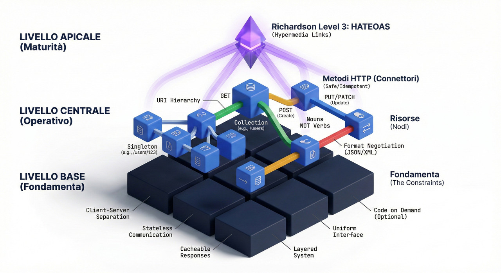

<style>
img {display: block; margin: 0 auto;}
</style>



## REST API

### REST 101

REST è l’acronimo di REpresentational State Transfer ed è uno stile architetturale per sistemi distribuiti basati su ipermedia. Roy Fielding lo ha presentato nel 2000 nella sua nota [dissertazione](https://roy.gbiv.com/pubs/dissertation/fielding_dissertation.pdf). Da allora è diventato uno degli approcci più diffusi per la costruzione di API web (Application Programming Interfaces).

**REST non è un protocollo né uno standard; è uno stile architetturale**. Durante lo sviluppo, i progettisti di API possono implementare REST in molteplici modi. **Come ogni stile architetturale, REST definisce principi guida e vincoli. Tali principi devono essere soddisfatti affinché un’interfaccia di servizio possa essere definita RESTful**. Una Web API (o Web Service) conforme allo stile architetturale REST è chiamata REST API (o RESTful API). REST dunque definisce un insieme di principi architetturali per la progettazione di un sistema. Rappresenta uno stile, dunque non si riferisce a un sistema concreto e normato da un ente di standardizzazione.

La definizione compare per la prima volta nel 2000 nella tesi di Roy Fielding, ["Architectural Styles and the Design of Network-based Software Architectures"](https://roy.gbiv.com/pubs/dissertation/fielding_dissertation.pdf), presentata presso l’Università della California a Irvine. In essa si analizzano i principi alla base di diverse architetture software, inclusi quelli che consentono di considerare il Web come una piattaforma per l’elaborazione distribuita.

È opportuno precisare che i principi REST non sono necessariamente legati al Web; si tratta di principi astratti di cui il World Wide Web è un esempio concreto.

#### Principi

REST prevede che la scalabilità del Web e la sua crescita siano il risultato di alcuni principi chiave di progettazione:

- Lo stato dell’applicazione e le funzionalità sono suddivisi in risorse web.
- Ogni risorsa è univoca e indirizzabile tramite una sintassi universale, usata nei collegamenti ipertestuali.
- Tutte le risorse condividono un’interfaccia uniforme per il trasferimento di stato tra client e risorse, che include:
  - un insieme vincolato di operazioni ben definite;
  - un insieme vincolato di contenuti, opzionalmente supportato da codice a richiesta;
  - un protocollo che è: client-server, privo di stato (stateless), cacheable e a livelli (layered).

In breve, REST non è un’architettura né uno standard, ma un insieme di linee guida per la realizzazione di un’architettura di sistema. I principi che rendono il Web adatto alla realizzazione di Web Service secondo l’approccio REST possono essere sintetizzati nei seguenti punti:

- Identificazione delle risorse
- Utilizzo esplicito dei metodi HTTP
- Risorse autodescrittive
- Collegamenti tra risorse
- Comunicazione senza stato

#### Vincoli

L’approccio architetturale REST è definito dai seguenti vincoli (l’implementazione dei singoli componenti resta libera):

- **Client–server**: un insieme di interfacce uniformi separa client e server. Il client non si occupa della persistenza; i server non gestiscono UI o stato utente. Ciò favorisce portabilità e scalabilità.
- **Stateless**: la comunicazione client–server è priva di stato lato server. Ogni richiesta contiene tutte le informazioni necessarie. Lo stato di sessione risiede nel client (o in un archivio esterno esplicito).
- **Cacheable**: le risposte indicano esplicitamente se sono cacheable. Una corretta gestione della cache riduce le comunicazioni migliorando scalabilità e prestazioni.
- **Layered system**: l’architettura può essere organizzata a strati (API gateway, backend dati, servizi di autenticazione, ecc.). Il client non deve conoscere la topologia interna.
- **Code on demand (opzionale)**: il server può estendere temporaneamente le funzionalità del client trasferendo codice eseguibile (es. script JavaScript).
- **Uniform interface**: un’interfaccia omogenea tra client e server semplifica e disaccoppia l’architettura.

#### Il principio fondamentale: le risorse

Elemento centrale in REST è la risorsa, accessibile tramite un identificatore globale (URI). Le componenti della rete (client e server) comunicano attraverso un’interfaccia standard (es. HTTP) per scambiarsi rappresentazioni di tali risorse (il documento che trasmette le informazioni). Una medesima risorsa può avere più rappresentazioni (per esempio SVG o CSV nel caso di un cerchio), selezionate tramite negoziazione di contenuto.

La natura stateless comporta che ciascun connettore (client, server, cache, tunnel) intervenga sulle singole richieste senza memoria delle precedenti: per interagire con una risorsa servono l’identificatore della risorsa e l’azione richiesta. Il formato della rappresentazione (HTML, XML, JSON, immagini, ecc.) deve essere noto al client.

### REST Resource Naming Guide

[Resource Naming](https://restfulapi.net/resource-naming/)

#### Che cos’è una risorsa

Nello stile REST, la rappresentazione primaria dei dati è la risorsa. Una strategia coerente e robusta di denominazione delle risorse è una delle decisioni progettuali più importanti nel lungo periodo.

Secondo Fielding, qualunque informazione nominabile può essere una risorsa: un documento o un’immagine, un servizio temporale (ad es. “meteo di oggi a Los Angeles”), una collezione di risorse, un oggetto non virtuale (ad es. una persona), e così via. Una risorsa è una mappatura concettuale su un insieme di entità, non l’entità concreta in un dato istante.

#### Risorse singleton e collection

Una risorsa può essere una singola entità (singleton) oppure una collezione. Esempio in dominio bancario: "customers" è una collezione e "customer" è un singleton. Le rispettive URI possono essere, ad esempio, "/customers" e "/customers/{customerId}".

#### Collection e sub-collection

Una risorsa può contenere sub-collection. Ad esempio, gli "accounts" di un particolare cliente: `/customers/{customerId}/accounts`; il singolo "account" nella sub-collection: `/customers/{customerId}/accounts/{accountId}`.

#### URI

Le REST API usano gli URI per indirizzare le risorse. È buona pratica progettare URI che riflettano il modello delle risorse esposto ai client. Quando le risorse sono denominate bene, l’API risulta più intuitiva.

### Best Practices

#### Usare sostantivi per rappresentare le risorse

Le URI RESTful dovrebbero riferirsi a "cose" (sostantivi) e non ad azioni (verbi). Alcuni esempi: utenti del sistema, account utente, dispositivi di rete. Esempi di URI:

```text
http://api.example.com/device-management/managed-devices
```

```text
http://api.example.com/device-management/managed-devices/{device-id}
```

```text
http://api.example.com/user-management/users
```

```text
http://api.example.com/user-management/users/{id}
```

Per chiarezza, si distinguano i seguenti **archetipi di risorsa** e si adotti con coerenza la relativa convenzione di naming:

#### Document

Una risorsa documento rappresenta un concetto singolare, analogo a un record o a un’istanza di oggetto. È tipicamente un elemento all’interno di una collezione e la sua rappresentazione include campi e link ad altre risorse. Usare nomi al singolare:

```text
http://api.example.com/device-management/managed-devices/{device-id}
```

```text
http://api.example.com/user-management/users/{id}
```

```text
http://api.example.com/user-management/users/admin
```

#### Collection

Una collezione è una directory di risorse gestita dal server. Il client può proporre nuove risorse, ma è la collezione che decide se e come crearle e con quali URI. Usare nomi al plurale:

```text
http://api.example.com/device-management/managed-devices
```

```text
http://api.example.com/user-management/users
```

```text
http://api.example.com/user-management/users/{id}/accounts
```

#### Store

Uno store è un repository gestito dal client: consente di inserire, recuperare e cancellare risorse. Le URI sono scelte dal client al momento dell’inserimento. Usare nomi al plurale:

```text
`http://api.example.com/song-management/users/{id}/playlists`
```

#### Controller

Un controller modella un concetto procedurale (funzione eseguibile, con parametri e ritorni). Usare verbi:

```text
http://api.example.com/cart-management/users/{id}/cart/checkout
 
http://api.example.com/song-management/users/{id}/playlist/play
```

#### Coerenza prima di tutto

Adottare convenzioni coerenti per denominazione e formattazione delle URI. Suggerimenti:

##### Usare lo slash (/) per relazioni gerarchiche

```text
http://api.example.com/device-management
```

```text
http://api.example.com/device-management/managed-devices
```

```text
http://api.example.com/device-management/managed-devices/{id}
```

```text
http://api.example.com/device-management/managed-devices/{id}/scripts
```

```text
`http://api.example.com/device-management/managed-devices/{id}/scripts/{id}`
```

##### Evitare lo slash finale (/)

Siccome lo slash finale nel percorso non aggiunge semantica e può confondere è meglio ometterlo.

```text
http://api.example.com/device-management/managed-devices/
 
http://api.example.com/device-management/managed-devices 
/*Questa versione è molto migliore*/
```

##### Usare i trattini (-) per la leggibilità

I trattini migliorano la leggibilità dei segmenti lunghi del percorso.

```text
http://api.example.com/device-management/managed-devices/
```

```text
http://api.example.com/device-management/managed-devices 
/*Questa versione è molto migliore*/
```

##### Evitare gli underscore (_)

Gli underscore possono risultare poco visibili a seconda dei font. Preferire i trattini.

```text
http://api.example.com/inventory-management/managed-entities/{id}/install-script-location
//più leggibile
```

```text
http://api.example.com/inventory-management/managedEntities/{id}/installScriptLocation
//meno leggibile
```

##### Usare minuscole nelle URI

Quando possibile, preferire lettere minuscole nei percorsi.

```text
http://api.example.org/my-folder/my-doc/1
```

```text
HTTP://API.EXAMPLE.ORG/my-folder/my-doc/2
```

```text
http://api.example.org/My-Folder/my-doc/3
```

Negli esempi, 1 e 2 sono equivalenti; 3 no (per la diversa capitalizzazione di My-Folder).

##### Non usare estensioni file

Le estensioni aumentano la lunghezza e non apportano vantaggi. Il tipo di media si comunica con l’header `Content-Type`.

```text
http://api.example.com/device-management/managed-devices.xml
/*Do not use it*/
```

```text
`http://api.example.com/device-management/managed-devices 
/*This is correct URI*/`
```

##### Non usare funzioni CRUD nelle URI

Le **URI identificano risorse, non azioni; usare i metodi HTTP per indicare l’operazione**.

```text
HTTP GET http://api.example.com/device-management/managed-devices
//ottiene l’elenco dei device
```

```text
HTTP POST http://api.example.com/device-management/managed-devices
//Crea un nuovo device
```

```text
HTTP GET http://api.example.com/device-management/managed-devices/{id}
//ottiene il device con l’ID specificato
```

```text
HTTP PUT http://api.example.com/device-management/managed-devices/{id}
//Aggiorna il device con l’ID specificato
```

```text
HTTP DELETE http://api.example.com/device-management/managed-devices/{id}
//elimina il device con l’ID specificato
```

##### Usare la query per filtrare collezioni

Per ordinamento, filtro e paginazione, abilitare parametri in query string invece di definire nuove API:

```text
http://api.example.com/device-management/managed-devices
```

```text
http://api.example.com/device-management/managed-devices?region=USA
```

```text
http://api.example.com/device-management/managed-devices?region=USA&brand=XYZ
```

```text
http://api.example.com/device-management/managed-devices?region=USA&brand=XYZ&sort=installation-date
```

### HTTP Methods

[Http Methods](https://restfulapi.net/http-methods/)

Le API RESTful consentono di sviluppare applicazioni che coprono tutte le operazioni CRUD. Le linee guida suggeriscono di usare metodi HTTP specifici per ciascun tipo di chiamata al server.

- **HTTP GET**

Usare le richieste GET esclusivamente per recuperare la rappresentazione/le informazioni della risorsa — e non per modificarla in alcun modo. Poiché le richieste GET non cambiano lo stato della risorsa, sono considerate metodi sicuri (safe). Inoltre, le API GET dovrebbero essere idempotenti: ripetere la stessa richiesta non deve produrre effetti collaterali e deve restituire lo stesso risultato.

Se la Request-URI si riferisce a un processo che produce dati, devono essere restituiti i dati prodotti.

Per risorse trovate, restituire 200 (OK) con corpo (tipicamente XML o JSON). Se la risorsa non è trovata, 404 (NOT FOUND). Se la richiesta è malformata, 400 (BAD REQUEST).

Esempi:

```text
HTTP GET http://www.appdomain.com/users

HTTP GET http://www.appdomain.com/users?size=20&page=5

HTTP GET http://www.appdomain.com/users/123

HTTP GET http://www.appdomain.com/users/123/address
```

- **HTTP POST**

Usare le API POST per creare nuove risorse subordinate alla risorsa di destinazione. In caso di creazione, restituire 201 (Created) con header Location. Se non viene creata una risorsa individuabile da URI, restituire 200 (OK) o 204 (No Content). Le risposte non sono **cacheable** salvo presenza di header appropriati. POST non è né sicuro (safe) né idempotente.

Esempi:

```text
HTTP POST http://www.appdomain.com/users

HTTP POST http://www.appdomain.com/users/123/accounts
```

- **HTTP PUT**

Usare le API PUT principalmente **per aggiornare risorse esistenti** (se la risorsa non esiste, l’API può decidere se crearla). In caso di creazione, 201 (Created); in caso di modifica, 200 (OK) o 204 (No Content). Le risposte non sono cacheable. Differenza con POST: POST su collezioni, PUT su risorsa individuale.

Esempi:

```text
HTTP PUT http://www.appdomain.com/users/123

HTTP PUT http://www.appdomain.com/users/123/accounts/456
```

- **HTTP DELETE**

DELETE rimuove risorse identificate dalla Request-URI. Risposta di successo: 200 (OK) con eventuale corpo, 202 (Accepted) se accodato, 204 (No Content) se senza corpo. DELETE è idempotente (ripetere la chiamata non cambia l’esito; una seconda chiamata può restituire 404 poiché la risorsa è già stata rimossa). Le risposte non sono cacheable.

Esempi:

```text
HTTP DELETE http://www.appdomain.com/users/123

HTTP DELETE http://www.appdomain.com/users/123/accounts/456
```

- **HTTP PATCH**

PATCH effettua aggiornamenti parziali. PUT sostituisce l’intera risorsa; PATCH applica un delta. Esistono sfide pratiche (supporto parziale in browser/server/framework; payload più complesso, ad es. JSON Patch).

Esempio:

```text
HTTP GET /users/1

{id: 1, username: 'admin', email: 'email@example.org'}

HTTP PATCH /users/1

[
{ "op": "replace", "path": "/email", "value": "new.email@example.org" }
]
```

Operazioni possibili secondo specifica:

```text
[
{ "op": "test", "path": "/a/b/c", "value": "foo" },
{ "op": "remove", "path": "/a/b/c" },
{ "op": "add", "path": "/a/b/c", "value": [ "foo", "bar" ] },
{ "op": "replace", "path": "/a/b/c", "value": 42 },
{ "op": "move", "from": "/a/b/c", "path": "/a/b/d" },
{ "op": "copy", "from": "/a/b/d", "path": "/a/b/e" }
]
```

Riepilogo (CRUD vs metodi):

| HTTP METHOD | CRUD | INTERA COLLEZIONE (es. /users) | ELEMENTO SPECIFICO (es. /users/123) |
| --- | --- | --- | --- |
| POST | Create | 201 (Created), Location a /users/{id} | Evitare POST su risorsa singola |
| GET | Read | 200 (OK), lista con paginazione/ordinamento/filtro | 200 (OK) oppure 404 (Not Found) |
| PUT | Update/Replace | 404 (Not Found) salvo update massivo | 200 (OK) o 204 (No Content); 404 se ID non valido |
| PATCH | Partial Update | 404 (Not Found) salvo modifica collezione | 200 (OK) o 204 (No Content); 404 se ID non valido |
| DELETE | Delete | 404 (Not Found) salvo eliminazione dell’intera collezione (attenzione) | 200 (OK) o 404 (Not Found) |

### HATEOAS Driven REST APIs

[HATEOAS](https://restfulapi.net/hateoas/)

**HATEOAS (Hypermedia as the Engine of Application State)** è un vincolo dell’architettura REST che la differenzia da altre architetture per applicazioni distribuite. **L’idea è di includere nella rappresentazione della risorsa collegamenti ipertestuali verso risorse correlate, consentendo al client di navigare dinamicamente lo spazio delle risorse**.

Esempio (risposta JSON di una richiesta)

```text
HTTP GET http://api.domain.com/management/departments/10
```

```json
{
    "departmentId": 10,
    "departmentName": "Administration",
    "locationId": 1700,
    "managerId": 200,
    "links": [
        {
            "href": "10/employees",
            "rel": "employees",
            "type" : "GET"
        }
    ]
}
```

Il vantaggio è che lo stato applicativo è "guidato" dai link forniti dal server, e non codificato rigidamente nel client.

### Richardson Maturity Model

[Richardson Maturity Model](https://restfulapi.net/richardson-maturity-model/)

**Leonard Richardson ha classificato i servizi web in quattro categorie, in funzione della loro aderenza ai principi REST, considerando tre dimensioni: URI, metodi HTTP e HATEOAS**.


Descrizione dei livelli:

- **Level Zero**: un solo endpoint e un solo metodo (tipicamente POST); nessun uso di URI, metodi o HATEOAS.
- **Level One**: uso di molteplici URI per identificare risorse, ma un solo verbo (generalmente POST).
- **Level Two**: uso di URI e molti metodi HTTP (CRUD su risorse esposte).
- **Level Three**: uso combinato di URI, metodi e HATEOAS; il livello più maturo per rilevabilità (discoverability) e auto-descrittività (self-descriptiveness).

### Stateless, auto-definizione e collegamenti tra risorse

Riferimento: https://www.html.it/pag/19598/stateless-autodefinizione-e-collegamenti-tra-risorse/

#### Risorse auto-descrittive

Le risorse sono concettualmente separate dalle loro rappresentazioni. Il servizio non invia "record" del database, ma rappresentazioni in formati appropriati (scelti tramite negoziazione di contenuto). È opportuno offrire formati standard e, quando utile, multiple rappresentazioni (HTML, XML, JSON) per soddisfare client differenti. Il tipo è indicato via MIME nella risposta (Content-Type). Il client può specificare il formato desiderato con l’header `Accept`.

Esempio di richiesta:

```text
GET /clienti/1234

HTTP/1.1

Host: www.myapp.com

Accept: application/vnd.myapp.cliente+xml
```

#### Collegamenti tra risorse

Le rappresentazioni dovrebbero includere link ipertestuali a risorse correlate (HATEOAS). Esempio XML semplificato:

```xml
<ordine>
  <numero>12345678</numero>
  <data>01/07/2011</data>
  <cliente rif="http://www.myapp.com/clienti/1234" />
  <articoli>
    <articolo rif="http://www.myapp.com/prodotti/98765" />
    <articolo rif="http://www.myapp.com/prodotti/43210" />
  </articoli>
```

#### Comunicazione senza stato

Le interazioni tra client e server devono essere stateless. Ciò non implica l’assenza di stato applicativo, ma sposta la responsabilità della gestione dello stato sul client (o su meccanismi condivisi espliciti), migliorando la scalabilità e consentendo architetture a cluster senza vincoli di sessione.

## Consumare REST API mediante `HttpClient`

Riferimenti:

- [Tutorial: Make HTTP requests in a .NET console app using C#](https://docs.microsoft.com/en-us/dotnet/csharp/tutorials/console-webapiclient)
- [https://zetcode.com/csharp/httpclient/](https://zetcode.com/csharp/httpclient/)

### Un esempio di programma che utilizza le API di GitHub

Per i Media-Type si veda la [documentazione ufficiale](https://docs.github.com/en/rest/using-the-rest-api/getting-started-with-the-rest-api#media-types).

Questo progetto utilizza la libreria `HttpProxyControl`.

```csharp
//file Repository.cs
using System.Text.Json.Serialization;

namespace GithubAPIClient
{
    public class Repository
    {
        [JsonPropertyName("name")]
        public string Name { get; set; } = null!;
        [JsonPropertyName("description")]
        public string Description { get; set; } = null!;
        [JsonPropertyName("html_url")]
        public Uri GitHubHomeUrl { get; set; } = null!;
        [JsonPropertyName("homepage")]
        public Uri Homepage { get; set; } = null!;
        [JsonPropertyName("watchers")]
        public int Watchers { get; set; }
        [JsonPropertyName("pushed_at")]
        public DateTime LastPushUtc { get; set; }
        public DateTime LastPush => LastPushUtc.ToLocalTime();
    }
}

//file Program.cs
using System.Net.Http.Headers;
using System.Text.Json;
using HttpProxyControl;

namespace GithubAPIClient
{
    internal class Program
    {
        static async Task Main(string[] args)
        {
            using HttpClient client = HttpProxyHelper.CreateHttpClient(true);
            client.DefaultRequestHeaders.Accept.Clear();
            client.DefaultRequestHeaders.Accept.Add(
                new MediaTypeWithQualityHeaderValue("application/vnd.github.v3+json"));
            client.DefaultRequestHeaders.Add("User-Agent", ".NET Foundation Repository Reporter");
            var repositories = await ProcessRepositoriesAsync(client);
            foreach (var repo in repositories)
            {
                Console.WriteLine($"Name: {repo.Name}");
                Console.WriteLine($"Homepage: {repo.Homepage}");
                Console.WriteLine($"GitHub: {repo.GitHubHomeUrl}");
                Console.WriteLine($"Description: {repo.Description}");
                Console.WriteLine($"Watchers: {repo.Watchers:#,0}");
                Console.WriteLine($"{repo.LastPush}");
                Console.WriteLine();
            }
            static async Task<List<Repository></Repository>> ProcessRepositoriesAsync(HttpClient client)
            {
                //https://stackoverflow.com/a/58792016
                await using Stream stream =
                    await client.GetStreamAsync("https://api.github.com/orgs/dotnet/repos");
                var repositories =
                    await JsonSerializer.DeserializeAsync<List<Repository>>(stream);
                return repositories ?? new();
            }
        }
    }
```

### Principali classi di riferimento per la gestione delle richieste HTTP

- [Classe HttpClient](https://docs.microsoft.com/en-us/dotnet/api/system.net.http.httpclient)
- [Classe HttpClientHandler](https://docs.microsoft.com/en-us/dotnet/api/system.net.http.httpclienthandler)
- [Classe HttpContent](https://docs.microsoft.com/en-us/dotnet/api/system.net.http.httpcontent)
- [Classe StringContet](https://docs.microsoft.com/en-us/dotnet/api/system.net.http.stringcontent)
- [Classe HttpClientJsonExtensions](https://docs.microsoft.com/en-us/dotnet/api/system.net.http.json.httpclientjsonextensions)

### Riferimenti Bibliografici Essenziali

Per un approfondimento accademico e tecnico, si consiglia la consultazione delle seguenti risorse:

- [Dissertazione originale di Roy Fielding](https://roy.gbiv.com/pubs/dissertation/fielding_dissertation.pdf)

- [RESTful Web Services - HTML.it](https://www.html.it/guide/restful-web-services-la-guida/)

- [Microsoft REST API Guidelines](https://github.com/microsoft/api-guidelines)

- [RestfulAPI.net](https://restfulapi.net/)

- [https://it.wikipedia.org/wiki/Representational_state_transfer](https://it.wikipedia.org/wiki/Representational_state_transfer)
- [https://blog.postman.com/rest-api-definition/](https://blog.postman.com/rest-api-definition/)
