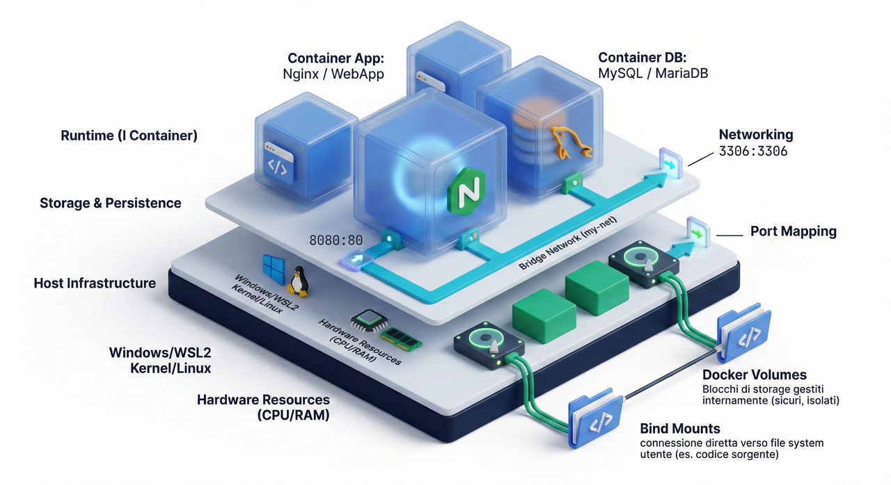

<style>
img {display: block; margin: 0 auto;}
</style>



## Riferimenti alla documentazione di Docker

I riferimenti alla documentazione di Docker sono:

- [Il sito ufficiale della documentazione Docker](https://docs.docker.com/)
- [Le pagine della documentazione relative alla CLI di Docker](https://docs.docker.com/reference/cli/docker/)

## Guida all'Installazione di Docker Desktop con WSL 2 su Windows

### Il Ruolo di Hyper-V: Serve Ancora?

In passato, Docker Desktop per Windows si basava esclusivamente su **Hyper-V**, la tecnologia di virtualizzazione di Microsoft. Con l'introduzione di WSL 2, lo scenario è cambiato. WSL 2 utilizza una versione ottimizzata di Hyper-V sotto il cofano, nota come **Piattaforma macchina virtuale** (Virtual Machine Platform). Quando si installa Docker Desktop con il backend WSL 2 (l'opzione predefinita e consigliata), non è più necessario abilitare manualmente l'intera funzionalità di Hyper-V. È sufficiente che la Piattaforma macchina virtuale sia attiva.

#### **Verifica dei Prerequisiti di Virtualizzazione**

Prima di iniziare, è fondamentale assicurarsi che la virtualizzazione hardware sia abilitata nel BIOS/UEFI del computer. Per verificarlo rapidamente da Windows:

1. Aprire il **Task Manager** (Gestione attività) premendo `Ctrl + Maiusc + Esc`.

2. Andare alla scheda **Prestazioni**.

3. Selezionare la **CPU**.

4. Controllare la voce **Virtualizzazione**: deve essere **Abilitato**.

Se la virtualizzazione non fosse abilitata, è necessario riavviare il computer ed entrare nel BIOS/UEFI (solitamente premendo tasti come `F2`, `F10`, o `Canc` all'avvio) per attivarla. Le opzioni si trovano spesso sotto le sezioni relative a "CPU Configuration" o "Advanced" e possono avere nomi come "Intel VT-x" o "AMD-V".

### Installazione di WSL 2 e Ubuntu 24.04 LTS

WSL 2 permette di eseguire un kernel Linux reale direttamente su Windows. Questo garantisce prestazioni elevate e piena compatibilità con strumenti come Docker.

#### **Passo 1: Installazione di WSL**

Per installare WSL e la sua distribuzione Linux predefinita (che è solitamente l'ultima versione LTS di Ubuntu), basta aprire un terminale come **PowerShell** o il **Prompt dei comandi** con privilegi di amministratore e digitare un singolo comando:

```sh
wsl --install
```

Questo comando si occupa di:

- Abilitare le funzionalità necessarie di Windows, inclusa la **Piattaforma macchina virtuale**.

- Scaricare e installare l'ultima versione del kernel Linux.

- Impostare WSL 2 come versione predefinita.

- Scaricare e installare la distribuzione **Ubuntu LTS**.

Al termine dell'installazione, sarà necessario **riavviare il computer**.

#### **Passo 2: Configurazione Iniziale di Ubuntu**

Dopo il riavvio, l'installazione di Ubuntu si avvierà automaticamente. Verrà richiesto di creare un **nome utente** e una **password**. Queste credenziali sono specifiche per l'ambiente Linux e non sono collegate all'account di Windows.

Se si desidera installare specificamente **Ubuntu 24.04 LTS**, è possibile cercarla nel **Microsoft Store** e installarla da lì, oppure usare il seguente comando da PowerShell (come amministratore) dopo aver eseguito `wsl --install`:

```sh
wsl --install -d Ubuntu-24.04
```

Per verificare le distribuzioni installate e la versione di WSL in uso, si può usare il comando:

```sh
wsl -l -v
```

L'output dovrebbe mostrare la distribuzione Ubuntu con la `VERSION` impostata a `2`.

### Installazione di Docker Desktop e Integrazione con WSL 2

Ora che WSL 2 è pronto, si può procedere con l'installazione di Docker Desktop.

#### **Passo 1: Download e Installazione**

1. Andare alla pagina di download ufficiale di **Docker Desktop**: [Docker Desktop](https://www.docker.com/products/docker-desktop).

2. Scaricare il file di installazione per Windows.

3. Eseguire l'installer. Durante la configurazione, assicurarsi che l'opzione **"Use WSL 2 instead of Hyper-V"** sia selezionata. Questa è l'impostazione predefinita e raccomandata.

4. Seguire le istruzioni a schermo e riavviare il computer quando richiesto.

#### **Passo 2: Abilitazione dell'Integrazione WSL**

Dopo l'installazione, Docker Desktop si avvierà automaticamente. L'icona della balena di Docker apparirà nell'area di notifica. Per assicurarsi che Docker sia utilizzabile dalla distribuzione Ubuntu:

1. Fare clic con il tasto destro sull'icona di Docker e seleziona **"Settings"** (Impostazioni).

2. Andare su **"Resources" > "WSL Integration"**.

3. Assicurarsi che l'opzione **"Enable integration with my default WSL distro"** sia attiva.

4. Nella lista sottostante, abilitare l'integrazione per la distribuzione Ubuntu (es. `Ubuntu-24.04`).

5. Cliccare su **"Apply & Restart"**.

A questo punto, l'integrazione è completa. I comandi `docker` e `docker-compose` saranno disponibili e funzionanti direttamente dal terminale di Ubuntu in WSL 2.

Per verificarlo, aprire il terminale di Ubuntu e digita:

```sh
docker --version
```

Si dovrebbe vedere la versione di Docker Engine installata, a conferma che tutto funziona correttamente.

## Comandi di base di Docker

```sh
## Primo esempio
# https://docs.docker.com/reference/cli/docker/container/run/
# Usage:	docker container run [OPTIONS] IMAGE [COMMAND] [ARG...]
# Aliases: docker run

docker run hello-world

## Vedere i container attivi (running)
# https://docs.docker.com/reference/cli/docker/container/ls/
# Usage:	docker container ls [OPTIONS]
# Aliases:  docker container list <-> docker container ps <-> docker ps
docker ps

# vedere i container attivi (running) e non attivi (stopped)
docker ps -a

## Terminare un container - docker stop
# https://docs.docker.com/reference/cli/docker/container/stop/
# Usage:    docker container stop [OPTIONS] CONTAINER [CONTAINER...]
# Aliases:  docker stop
docker stop container_id
# oppure
docker stop container_name
```

Si provi a lanciare un container con l'immagine di `Ubuntu`:

```sh
docker run ubuntu
```
:::caution
Nell'esempio precedente viene creato e lanciato un container con Ubuntu che si ferma istantaneamente, perché il comando predefinito è `/bin/bash` e siccome non c'è nessuno script passato alla bash il processo del container viene subito terminato.
:::

Si provi a lanciare un container di Ubuntu in modo che venga eseguita un'azione per alcuni secondi:

```sh
docker run ubuntu sleep 20
```

Il comando precedente lancia un container in `foreground` con la shell collegata. Per avviare un container in `background`, senza collegarlo alla shell corrente occorre utilizzare il parametro `-d`

### Avviare un container in modalità `detached`

```sh
# https://docs.docker.com/reference/cli/docker/container/run/#detach
# The --detach (or -d) flag starts a container as a background process that doesn't occupy
# your terminal window. By design, containers started in detached mode exit when the root
# process used to run the container exits, unless you also specify the --rm option.
# If you use -d with --rm, the container is removed when it exits or when the daemon exits,
# whichever happens first.

docker run -d ubuntu sleep 200
# si verifichi che il container sia attivo
docker ps
```

### Eseguire un nuovo comando in un container attivo (running)

```sh
# https://docs.docker.com/reference/cli/docker/container/exec/
# Usage:	docker container exec [OPTIONS] CONTAINER COMMAND [ARG...]
# Aliases:  docker exec
# Ad esempio, se un container di Ubuntu è running, si può eseguire su di esso un comando con la sintassi:
docker exec container_id comando
# oppure
docker exec container_name comando
# ad esempio, supponendo che il container_name con l'immagine di Ubuntu sia stoic_mayer e che il comando sia cat /etc/hosts si può eseguire il comando
docker exec stoic_mayer cat /etc/hosts

# un esempio che mostra come far partire un container che rimane attivo dopo averlo lanciato
# si lanci nginx (web server e reverse proxy) con l'opzione detach
docker run -d nginx
# si verifichi che il container sia attivo
docker ps
# per terminare il container si può usare il comando
docker stop container_id
# oppure
docker stop container_name
```

## Rimuovere un container

```sh
# https://docs.docker.com/reference/cli/docker/container/rm/
# Usage:    docker container rm [OPTIONS] CONTAINER [CONTAINER...]
# Alias:    docker container remove <-> docker rm

# per rimuovere un container (sintassi abbreviata)
docker rm container_id
# oppure
docker rm container_name

# per rimuovere un container (sintassi estesa)
docker container remove
```

È anche possibile rimuovere più container contemporaneamente mettendo più identificativi/nomi separati da spazi. Per gli identificativi è anche possibile specificare solo le prime tre o quattro cifre esadecimali.

:::caution
attenzione! per rimuovere un container bisogna che questo sia stato precedentemente fermato (stopped) altrimenti si ottiene un errore.
:::

## Eseguire un container con l'opzione di rimozione automatica all'uscita del processo `--rm`

```sh
# https://docs.docker.com/reference/cli/docker/container/run/#rm
# By default, a container's file system persists even after the container exits. This makes debugging a lot easier,since you can inspect the container's final state and you retain all your data. If you'd like Docker to automatically clean up the container and remove the file system when the container exits, use the --rm flag

# Si esegua un task con un container Ubuntu che poi verrà automaticamente rimosso
docker run -d --rm ubuntu sleep 20
docker ps
# passati i 20 secondi si verifichi che il container sia stato rimosso
docker ps -a
```

## Elenco delle immagini locali sul Docker host

```sh
# https://docs.docker.com/reference/cli/docker/image/ls/
# Usage:	docker image ls [OPTIONS] [REPOSITORY[:TAG]]
# Aliases:  docker image list <-> docker images

# Elenco delle immagini docker (sintassi abbreviata)
docker images
# Elenco delle immagini docker (sintassi estesa)
docker image ls
```

## Rimozione di immagini Docker

```sh
# https://docs.docker.com/reference/cli/docker/image/rm/
# Usage:	docker image rm [OPTIONS] IMAGE [IMAGE...]
# Aliases:  docker image remove <-> docker rmi

# Rimozione di una immagine docker (sintassi abbreviata)
docker rmi image_id
# oppure
docker rmi image_name

# Rimozione di una immagine docker (sintassi estesa)
docker image rm image_id
# oppure
docker image rm image_name
```

## Esempio di un container che ospita una web app

Si provi a lanciare un container a partire dall'immagine `kodekloud/simple-webapp`. Il container in questione fa partire una web application che mostra una pagina di un colore random, oppure di un colore che viene impostato attraverso una variabile d'ambiente.

Se si provasse a lanciare il container con il comando `docker run kodekloud/simple-webapp` la shell rimarrebbe collegata al container, ma anche cambiando shell e provando ad aprire il browser all'indirizzo indicato nella shell del container non si vedrebbe nulla. L'output a console è:

```sh
# This is a sample web application that displays a colored background.
#  A color can be specified in two ways.

#  1. As a command line argument with --color as the argument. Accepts one of red,green,blue,blue2,pink,darkblue
#  2. As an Environment variable APP_COLOR. Accepts one of red,green,blue,blue2,pink,darkblue
#  3. If none of the above then a random color is picked from the above list.
#  Note: Command line argument precedes over environment variable.

# No command line argument or environment variable. Picking a Random Color =blue
#  * Serving Flask app "app" (lazy loading)
#  * Environment: production
#    WARNING: Do not use the development server in a production environment.
#    Use a production WSGI server instead.
#  * Debug mode: off
#  * Running on http://0.0.0.0:8080/ (Press CTRL+C to quit)
```

Per terminare il container a cui si è collegati basta digitare `CTRL+C`

Se si provasse ad eseguire il comando `docker run -d kodekloud/simple-webapp`
non si vedrebbe comunque la pagina colorata perché il container non è collegato all'interfaccia di rete del computer (vedremo meglio i dettagli nella sezione networking).

Dopo aver fermato il container lanciato con il comando precedente con i comandi:

```sh
docker ps
docker stop container_id
```

Il modo corretto di eseguire l'avvio del container è:

```sh
docker run -d -p 8080:8080 kodekloud/simple-webapp
# aprire il browser all'indirizzo localhost:8080
# verificare che il container è in esecuzione
docker ps
# aprire un altro container della stessa immagine su un'altra porta
docker run -d -p 8081:8080 kodekloud/simple-webapp
# aprire il browser all'indirizzo localhost:8081
# verificare che entrambi i container sono in esecuzione
docker ps
# è anche possibile passare un parametro corrispondente al colore
docker run -d -p 8082:8080 -e APP_COLOR=green kodekloud/simple-webapp
# con l'esempio appena visto sono stati lanciati tre container della stessa immagine.
```

La cosa più importante di questo esempio è l'utilizzo del parametro `-p` che permette di effettuare il port mapping tra il container docker e il Docker Host (il computer).
Il parametro `-p host_post:container_port` permette di associare una porta sul computer host con la porta su cui è in ascolto il web server all'interno del container.

Si fermino i container associati all'immagine `kodekloud/simple-webapp`

```sh
docker ps
docker stop container_id1 container_id2 container_id3
# si rimuovano i container
docker rm container_id1 container_id2 container_id3
```

## Un esempio di sito web statico servito all'interno di un container Docker di Nginx

Si consideri il seguente [esempio di sito statico](https://github.com/cloudacademy/static-website-example) (pagine web con solo HTML, CSS, JavaScript). Per lanciare un container Docker che serve il sito web è sufficiente:

1. Scaricare localmente il repository del progetto

    ```sh
    git clone https://github.com/cloudacademy/static-website-example.git
    ```

2. Lanciare il container Docker con il comando

    ```sh
    docker run --name some-nginx -v 'C:\Users\path\to\static-website-example:/usr/share/nginx/html:ro' -d -p 8080:80 nginx
    ```

3. Aprire il browser all'indirizzo `http://localhost:8080/`

4. Terminare l'esecuzione del container con:

   ```sh
    docker stop some-nginx
   ```

5. Il container potrà essere fatto ripartire con `docker start some-nginx` oppure rimosso con `docker rm some-nginx`

Alcuni dei comandi visti in questo esempio verranno ripresi e spiegati in dettaglio negli esempi successivi.

## Lanciare un container in modalità interattiva

```sh
# https://docs.docker.com/reference/cli/docker/container/run/#interactive
# The --interactive (or -i) flag keeps the container's STDIN open, and lets you send input
# to the container through standard input.
# Ad esempio
echo "ciao mondo" | docker run --rm -i ubuntu cat
```

L'opzione `-i` permette solo di avere accesso allo standard input del container, ma per poter interagire con esso occorre di solito abilitare anche l'opzione `-t` per abilitare anche lo pseudo-terminale.

## Abilitare uno pseudo-terminale (pseudo-TTY) sul container

```sh
# https://docs.docker.com/reference/cli/docker/container/run/#tty
# The --tty (or -t) flag attaches a pseudo-TTY to the container, connecting your terminal
# to the I/O streams of the container. Allocating a pseudo-TTY to the container means that
# you get access to input and output feature that TTY devices provide.
# Ad esempio, lanciamo un container ubuntu con le opzioni -it (abbreviazione di -i -t)

docker run -it --rm ubuntu

# É anche possibile lanciare un container in modalità detached con le opzioni -it

docker run -itd ubuntu

# In questo modo il container viene lanciato con le opzioni -i e -t abilitate, ma la shell corrente non è collegata ad esso. Sarà possibile collegarsi al container successivamente con un comando come docker attach, oppure sarà possibile eseguire un comando con docker exec

docker run -itd --rm ubuntu

# oppure

docker run -i -t -d --rm ubuntu
```

Si noti che, nell'esempio precedente, con l'opzione `-it` il container non viene chiuso immediatamente poiché il comando predefinito è `/bin/bash` e il container ha lo `STDIN` aperto. In questo caso il container è in attesa che venga impartito un input sullo ``STDIN`. Per chiudere il container in questo caso esistono alcune opzioni mostrate negli esempi successivi.

 Se si prova ad eseguire il comando seguente, si vedrà che il comando eseguito dal container è `sleep 30` e non `/bin/bash` e allo scadere del tempo stabilito il container va nello stato `stopped` e quindi viene automaticamente rimosso grazie all'opzione `--rm`

```sh
docker run -itd --rm ubuntu sleep 30
docker ps
```

## Uscita da un container

Si supponga di far partire un container con l'opzione `-it`. Inoltre, per distinguere il container appena lanciato dagli altri eventualmente attivi, si utilizzi il parametro `--name` prima del nome dell'immagine.

```sh
# https://phoenixnap.com/kb/exit-docker-container

docker run -it --name my_server ubuntu
```

Con il comando precedente ci si ritrova, come utenti `root`, all'interno di un container di Ubuntu.

```sh
# Alcuni comandi di prova all'interno del container:
ls -al
pwd
whoami
cat /etc/*release*
```

Per uscire dal container esistono due possibilità:

 1) uscire in maniera definitiva, chiudendo anche il container (che verrà posto nello stato stopped)
 2) uscire senza chiudere il container

### Uscita dal container e relativa chiusura dello stesso

Per uscire in maniera definitiva da un container e porlo nello stato `stopped` basta inserire la sequenza `CTRL+D`.

Se il container sta eseguendo un processo, ad esempio sta eseguendo un `ping`, si deve prima inserire `CTRL+C` per inviare il segnale `SIGINT`, per fermare il processo e poi `CTRL+D` per uscire.

In alternativa, è anche possibile digitare `exit` per uscire dal container e porlo nello stato `stopped`.

```sh
docker run -it --name my_server2 ubuntu
```

### Uscita dal container senza chiuderlo

Per uscire da un container senza chiuderlo si utilizza la combinazione di tasti `CTRL+P` seguito da `CTRL+Q`. Dopo questa sequenza il container continua la sua esecuzione in background.

:::caution
**ATTENZIONE!** se si utilizza il terminale di VS Code è possibile che le combinazioni di tasti `CTRL+P` e `CTRL+Q` siano già associate a scorciatoie di VS Code. In questo caso sarà opportuno connettersi al container con un terminale esterno a VS Code, utilizzando il comando `docker attach`.
:::

## Attach a un container

```sh
# https://docs.docker.com/reference/cli/docker/container/attach/
# Usage:	docker container attach [OPTIONS] CONTAINER
# Aliases:  docker attach
```

Alcuni esempi:

- Eseguire il comando `docker ps` per vedere i container attivi
- Eseguire il comando `docker attach my_server2` per connettersi al container.
- Eseguire qualche comando nella shell del container e poi digitare `CTRL+P` seguito da `CTRL+Q` per uscire

## Opzione `--detach-keys`

Sia il comando `docker run` che il comando `docker attach` hanno anche un'opzione che consente di effettuare l'override della sequenza di tasti per effettuare il detach dal container. Ad esempio:

```sh
# https://docs.docker.com/reference/cli/docker/container/run/#detach-keys
docker run -it --detach-keys=ctrl-u,ctrl-u --name my_server5 ubuntu
docker ps
# https://docs.docker.com/reference/cli/docker/container/attach/#detach-keys
docker attach --detach-keys=ctrl-u,ctrl-u my_server5
docker ps
```

## Rimozione di tutti i container nello stato `stopped`

```sh
# https://docs.docker.com/reference/cli/docker/container/prune/

docker container prune
# oppure, se si vuole il comando che non richiede conferma (utile negli script), si utilizza la versione con l'opzione -f
# https://docs.docker.com/reference/cli/docker/container/prune/#filter
docker container prune -f
```

## Docker networking - primi elementi

Come visto nelle slide del corso su Docker, se si utilizzano le impostazioni di default di Docker,i container vengono creati all'interno di una network con driver di tipo `bridge`. In una network di tipo bridge, i container sono all'interno di una rete isolata nella quale possono comunicare tra di loro mediante i loro indirizzi ip privati, ma non possono comunicare direttamente con gli host esterni alla sottorete nella quale si trovano.

*In terms of Docker, a bridge network uses a software bridge which lets containers connected to the same bridge network communicate, while providing isolation from containers that aren't connected to that bridge network. The Docker bridge driver automatically installs rules in the host machine so that containers on different bridge networks can't communicate directly with each other.*

*When you start Docker, a default bridge network (also called bridge) is created automatically, and newly-started containers connect to it unless otherwise specified. You can also create user-defined custom bridge networks.*

*Important! -->User-defined bridge networks are superior to the default bridge network.*

### Differenze tra `default bridge` e `user defined bridge`

Per capire le differenze tra il default bridge e le user defined bridge si veda la documentazione di Docker su [questa pagina](https://docs.docker.com/engine/network/drivers/bridge/#differences-between-user-defined-bridges-and-the-default-bridge):

### Quali sono le famiglie di indirizzi privati?

Una semplice trattazione degli indirizzi privati è riportata su [questo sito]( https://whatismyipaddress.com/private-ip).

La comunicazione dei container con gli host esterni alla sottorete bridge avviene tramite `NAT` (Network Address Translation) effettuata dal Docker Host. Un'analisi di questi aspetti è riportata [qui](https://k21academy.com/docker-kubernetes/docker-networking-different-types-of-networking-overview-for-beginners/)

### Riferimenti alla documentazione relativa al networking di Docker

[Docker network](https://docs.docker.com/engine/network/)

[Docker network drivers](https://docs.docker.com/engine/network/drivers/)

[Docker network driver di tipo `bridge`](https://docs.docker.com/engine/network/drivers/bridge/)

### Esercitazione

Svolgimento della prima parte del [tutorial](https://docs.docker.com/engine/network/tutorials/standalone/#use-the-default-bridge-network)

### Docker networking - port mapping

Come riportato nella [documentazione ufficiale di Docker relativa al networking](https://docs.docker.com/engine/network/#published-ports): *By default, when you create or run a container using docker create or docker run,
containers on bridge networks don't expose any ports to the outside world.
Use the `--publish` or `-p` flag to make a port available to services outside the bridge network. This creates a firewall rule in the host, mapping a container port to a port on the Docker host to the outside world. Here are some examples:*

| Flag value | Description |
| --- |  --- |
| `-p 8080:80` | Map port `8080` on the Docker host to TCP port `80` in the container. |
| `-p 192.168.1.100:8080:80` | Map port `8080` on the Docker host IP `192.168.1.100` to TCP port `80` in the container. |
| `-p 8080:80/udp` | Map port `8080` on the Docker host to UDP port `80` in the container. |
| `-p 8080:80/tcp -p 8080:80/udp` | Map TCP port `8080` on the Docker host to TCP port `80` in the container, and map UDP port `8080` on the Docker host to UDP port `80` in the container. |

:::caution
**Warning! when you publish a container's ports it becomes available not only to the Docker host,but to the outside world as well.**
:::

If you include the localhost IP address (127.0.0.1, or ::1) with the publish flag, only the Docker host and its containers can access the published container port.

### Ip address and hostname

*[By default](https://docs.docker.com/engine/network/#ip-address-and-hostname), the container gets an IP address for every Docker network it attaches to. A container receives an IP address out of the IP subnet of the network.
The Docker daemon performs dynamic subnetting and IP address allocation for containers. Each network also has a default subnet mask and gateway.*

### DNS service

*Containers use the same [DNS servers as the host](https://docs.docker.com/engine/network/#dns-services), but you can override this with --dns.
By default, containers inherit the DNS settings as defined in the /etc/resolv.conf configuration file.
Containers that attach to the default bridge network receive a copy of this file.
Containers that attach to a custom network use Docker's embedded DNS server.
The embedded DNS server forwards external DNS lookups to the DNS servers configured on the host.
I dettagli sulle user defined bridge network verranno analizzati [più avanti](https://docs.docker.com/engine/network/tutorials/standalone/#use-user-defined-bridge-networks)*

### Esempi di container con port mapping

Si lanci `Nginx` nella sua configurazione di default, in modo che mostri solo la pagina di benvenuto:

```sh
docker run --name my_web_server --rm -d -p 8080:80 nginx
```

Se si apre il browser all'indirizzo `localhost:8080` si vedrà la pagina di benvenuto di `Nginx`.

Si lanci un container a partire dall'immagine `kodekloud/simple-webapp`:

```sh
docker run --name my_web_app --rm -d -p 8081:8080 kodekloud/simple-webapp
```

## Docker storage - primi elementi

Come descritto nella [documentazione di Docker](https://docs.docker.com/engine/storage/): *By default all files created inside a container are stored on a writable container layer.*

This means that:

- The data doesn't persist when that container no longer exists, and it can be difficult to get
the data out of the container if another process needs it.
- A container's writable layer is tightly coupled to the host machine where the container is running. You can't easily move the data somewhere else.

Docker has two options for containers to store files on the host machine, so that the files are
persisted even after the container stops:

- volumes
- bind mounts

Docker also supports containers storing files in-memory on the host machine. Such files are not persisted.

### Opzioni di storage scegliere per i container Docker

#### Volumes

Volumes are stored in a part of the host filesystem which is managed by Docker
(`/var/lib/docker/volumes/` on Linux). Non-Docker processes should not modify this part
of the filesystem. **Volumes are the best way to persist data in Docker**

#### Bind mounts

Bind mounts may be stored anywhere on the host system. They may even be important system
files or directories. Non-Docker processes on the Docker host or a Docker container can
modify them at any time

#### tmpfs

tmpfs mounts are stored in the host system's memory only, and are never written to the
host system's filesystem

### Dove sono memorizzati i volumi di Docker?

[In linux](https://forums.docker.com/t/how-can-i-find-my-volumes-in-windows-11/136934) sono nella cartella: `/var/lib/docker/volumes/`

[In Windows](https://superuser.com/questions/1726309/convert-wsl-path-to-uri-compliant-wsl-localhost) sono nella cartella `\\wsl.localhost\docker-desktop\mnt\docker-desktop-disk\data\docker\volumes`

Lo stesso percorso si può scrivere anche come: `\\wsl$\docker-desktop-data\data\docker\volumes`

:::caution
**Attenzione!** la sintassi per il montaggio dei volumi e delle cartelle (bind mount) è cambiata nel tempo e, per compatibilità con i primi comandi docker, esistono più modi per connettere uno spazio di storage ad un container.
:::

Bind mounts and volumes can both be mounted into containers using the `-v` or `--volume` flag,
but the syntax for each is slightly different. For tmpfs mounts, you can use the `--tmpfs` flag. We recommend using the `--mount` flag for both containers and services, for bind mounts, volumes,
or tmpfs mounts, as the syntax is more clear.

### Bind mounts overview

- [overview](https://docs.docker.com/engine/storage/#bind-mounts)
- [documentazione dettagliata](https://docs.docker.com/engine/storage/bind-mounts/)

Bind mounts have limited functionality compared to volumes. When you use a bind mount, a file
or directory on the host machine is mounted into a container. The file or directory is referenced
by its full path on the host machine. The file or directory doesn't need to exist on the Docker
host already. It is created on demand if it doesn't yet exist. Bind mounts are fast, but they rely
on the host machine's filesystem having a specific directory structure available. If you are
developing new Docker applications, consider using named volumes instead. You can't use Docker CLI
commands to directly manage bind mounts.

:::note

**Bind mounts allow write access to files on the host by default.**
:::

- [Good use cases for volumes](https://docs.docker.com/engine/storage/#good-use-cases-for-volumes)
- [Good use cases for bind mounts](https://docs.docker.com/engine/storage/#good-use-cases-for-bind-mounts)

Si veda anche [questo articolo](https://phoenixnap.com/kb/how-to-ssh-into-docker-container) per un approfondimento.

### Esempi di container che utilizzano il bind mount

[Pagina di documentazione dell'immagine di Nginx](https://hub.docker.com/_/nginx)

#### Esempio con bind mount e port mapping - setup di Nginx con un sito web

Si supponga di avere le pagine web in una cartella nella wsl: `~/my-dev/static-sites/site-demo`. Si può prendere come esempio il sito condiviso su Team.

Il primo esempio della documentazione di Nginx sulla pagina ufficiale di Docker Hub è:

```sh
docker run --name some-nginx -v /some/content:/usr/share/nginx/html:ro -d nginx
```

L'esempio mostrato è un bind mount perché viene associata la cartella `/some/content`
all'interno del Docker Host (il computer utilizzato) alla cartella `/usr/share/nginx/html`
all'interno del container di Nginx. L'opzione `:ro` serve nel caso in cui si voglia montare
lo spazio di storage in sola lettura (read only).

Si modifichi l'esempio riportato su Docker Hub per adattarlo a questo esempio (da eseguire nella WSL):

```sh
docker run --name my_nginx -d --rm -v ~/my-dev/static-sites/site-demo:/usr/share/nginx/html:ro -p 8080:80 nginx
```

Se docker venisse lanciato da PowerShell il bind mount andrebbe scritto usando la notazione PowerShell
per il percorso che punta alla cartella del sito web. Supponendo di creare una cartella in Windows (e non in WSL questa volta) in

```ps1
$env:USERPROFILE\source\repos\my-dev\static-files\site-demo
```

Il seguente è un comando per PowerShell o CMD:

```ps1
docker run --name my_nginx2 -d --rm -v "$env:USERPROFILE\source\repos\my-dev\static-files\site-demo:/usr/share/nginx/html:ro" -p 8082:80 nginx
```

:::tip

Quando si scrive il percorso per il bind mount occorre tener presente che
con l'opzione `-v` oppure `--volume` il percorso è scritto nella forma:

`-v host_path:container_path` dove:

- il percorso nella parte di sinistra del `:` è il percorso alla cartella sul Docker host (il computer utilizzato)
- il precorso nella parte destra del `:` è il percorso all'interno del container docker.

:::

:::note
**Ogni percorso va scritto secondo le convenzioni specifiche dell'OS a cui si riferisce.** Quindi, ad esempio, se il percorso al docker host è per Windows deve essere scritto usando il formalismo di Windows;
se il percorso all'interno del container docker è riferito a un sistema Linux, va scritto secondo il
formalismo di Linux. **Nel caso di Powershell è importante mettere tutta la stringa che rappresenta il mapping tra doppi apici.**

In PowerShell, oltre alla variabile d'ambiente `$env:USERPROFILE` (che punta alla home dell'utente corrente)
è possibile usare anche `$PWD`, oppure `${PDW}` (che punta alla working directory).

In Powershell, `PWD` è l'alias del comando `Get-Location`

In PowerShell basta scrivere `Get-Alias -Name pwd` e vedere che è in realtà è `Get-Location`
:::

:::note
Per questioni   di ottimizzazione delle prestazioni è raccomandato di non creare container con bind mount direttamente in cartelle di Windows, ma di fare il bind mount su cartelle della `wsl2`. Questo è dovuto al fatto che con un bind mount tra due sistemi operativi diversi l'accesso ai file è più lento. Si vedano a tal proposito gli articoli:

- [Docker desktop best practices](https://www.docker.com/blog/docker-desktop-wsl-2-best-practices/)
- [Visual Studio Code: improve containers performances](https://code.visualstudio.com/remote/advancedcontainers/improve-performance)
:::

:::tip
Per accedere all'interno del container di `nginx` dopo che è stato lanciato si potrebbe utilizzare l'istruzione `docker attach` che, come riportato dalla documentazione, *"Attach local standard input,output, and error streams to a running container".*

Se eseguissimo il comando `docker attach` sul container di `nginx` non riusciremmo a fare molto perché il
container viene eseguito con lo script `docker-entrypoint.sh` e non vedremmo nulla.

Se avessimo fatto partire il container con anche le opzioni `-it`, facendo l'attach vedremmo i messaggi di log, ma non potremmo eseguire comandi...

Il modo migliore per entrare nel container di `nginx` dopo che è stato avviato, indipendentemente dal fatto che sia stata utilizzata l'opzione `-it`, è quella di eseguire il comando:

```sh
docker exec -it container_id /bin/bash
#oppure
docker exec -it container_name /bin/bash
```

:::

#### Esempio con bind mount e port mapping - setup del database MySQL con bind mount e port mapping

L'immagine ufficiale docker di MySQL si trova su [Docker hub](https://hub.docker.com/_/mysql). La documentazione sul deployment di MySQL attraverso Docker si trova nelle guide [*"Docker installation in Linux"*](https://dev.mysql.com/doc/refman/9.0/en/linux-installation-docker.html) e [*"Docker MySQL getting started"*](https://dev.mysql.com/doc/refman/9.0/en/docker-mysql-getting-started.html).

Dalla pagina di Docker hub di MySQL:

*What is MySQL?*

*MySQL is the world's most popular open source database. With its proven performance, reliability and
ease-of-use, MySQL has become the leading database choice for web-based applications, covering the
entire range from personal projects and websites, via e-commerce and information services, all the
way to high profile web properties including Facebook, Twitter, YouTube, Yahoo! and many more.*

Per far partire un container con MySQL si può lanciare un comando come il seguente:

```sh
docker run --name mysql-server1 -e MYSQL_ROOT_PASSWORD=my-secret-pw -d -p 3306:3306 mysql:latest
# ad esempio
docker run --name mysql-server1 -e MYSQL_ROOT_PASSWORD=root -d -p 3306:3306 mysql:latest
# oppure
docker run --name mysql-server1 -e MYSQL_ROOT_PASSWORD=my-secret-pw -d -p 3306:3306 mysql
# oppure per far partire una specifica versione
docker run --name mysql-server1 -e MYSQL_ROOT_PASSWORD=my-secret-pw -d -p 3306:3306 mysql:9.0.1
```

Per connettersi a MySQL si può procedere in diversi modi:

1) si lancia una shell bash direttamente sul container del server di MySQL:
si apre un'altra finestra del terminale su WSL (Ubuntu) e si digita il comando seguente:

    ```sh
    docker exec -it mysql-server1 /bin/bash
    ```

    nella shell del container di mysql si posso eseguire i comandi:

    ```sh
    pwd
    cat /etc/*release*
    # per effettuare la connessione al server di mysql, utilizzando il programma client di mysql
    mysql -u root -p
    # il comando precedente può anche essere scritto come
    mysql -uroot -p
    # ossia mettendo il nome utente direttamente attaccato a -u
    # se si volesse inserire subito la password (ad esempio root) si potrebbe scrivere
    mysql -uroot -proot
    # questo modo di accedere è considerato insicuro se si accede direttamente sulla
    # command line, ma può essere utilizzato quando si esegue uno script
    ```

    Per verificare che il database dia funzionante si esegue la seguente query SQL:

    ```sql
    select user, host from mysql.user;
    -- Si esce dalla sessione interattiva con `mysql`, digitando il comando:
    exit
    ```

    Per uscire dal container si può digitare `exit`

2) Si effettua la connessione da un applicativo client del Docker Host (il PC utilizzato)

    1) Si utilizza VS Code con il plugin per MySQL chiamato MySQL con ID = `cweijan.vscode-mysql-client2` e si effettua la connessione specificando i seguenti parametri:

        ```text
        host --> 127.0.0.1 oppure localhost
        port --> 3306 (è la porta utilizzata per il docker host e che è stata mappata sulla 3306 del container)
        username --> root
        password --> quella usata all'atto della creazione del container
        ```

    2) Si effettua la connessione utilizzando `mysql client` della distribuzione Linux della WSL. Ad esempio, per Ubuntu 24.04 è possibile installare `mysql-client-core` con il comando `sudo apt install mysql-client-core-8.0`.

        ```sh
        sudo apt install mysql-client-core-8.0
        ```

        Dopo aver installato il pacchetto suddetto, la connessione può avvenire direttamente dalla shell della
        distribuzione Linux della WSL con il comando:

        ```sh
        mysql -uroot -h 127.0.0.1 -p
        ```

        In questo caso occorre inserire l'indirizzo IP del server e non il nome DNS (localhost) altrimenti la connessione
        non avrà successo.

        :::note
        :memo: **Importante**: quando si utilizza una distribuzione WSL a scuola e si vuole accedere a internet dalla `shell`, ad esempio per eseguire il comando `curl`, oppure per scaricare o aggiornare un pacchetto tramite `apt`, oppure `apt-get`, occorre configurare il proxy e alcune applicazioni di Linux hanno una configurazione specifica per il proxy.

        ```sh
        # impostare il proxy per apt

        sudo tee -a /etc/apt/apt.conf.d/proxy.conf <<EOF
        Acquire::http::Proxy "http://proxy.intranet:3128";
        EOF
        
        # verificare se il proxy per apt-get è stato configurato correttamente:
        cat /etc/apt/apt.conf.d/proxy.conf

        # rimozione del proxy per apt
        sudo sed -i '/Acquire::http::Proxy/d' /etc/apt/apt.conf.d/proxy.conf
        ```
        :::

        :::note
        :memo: **Importante**: quando si utilizza una distribuzione WSL a scuola e si vuole accedere a internet dalla `shell`, ad esempio per eseguire il comando `curl`, oppure per scaricare o aggiornare un pacchetto tramite `apt`, oppure `apt-get`, occorre configurare il proxy e alcune applicazioni di Linux hanno una configurazione specifica per il proxy.

        ```sh
        # impostare il proxy per apt

        sudo tee -a /etc/apt/apt.conf.d/proxy.conf <<EOF
        Acquire::http::Proxy "http://proxy.intranet:3128";
        EOF
        
        # verificare se il proxy per apt-get è stato configurato correttamente:
        cat /etc/apt/apt.conf.d/proxy.conf

        # rimozione del proxy per apt
        sudo sed -i '/Acquire::http::Proxy/d' /etc/apt/apt.conf.d/proxy.conf
        ```
        :::

        :::note
        :memo: **Importante**: quando si utilizza una distribuzione WSL a scuola e si vuole accedere a internet dalla `shell`, ad esempio per eseguire il comando `curl`, oppure per scaricare o aggiornare un pacchetto tramite `apt`, oppure `apt-get`, occorre configurare il proxy e alcune applicazioni di Linux hanno una configurazione specifica per il proxy.

        ```sh
        # impostare il proxy per apt

        sudo tee -a /etc/apt/apt.conf.d/proxy.conf <<EOF
        Acquire::http::Proxy "http://proxy.intranet:3128";
        EOF
        
        # verificare se il proxy per apt-get è stato configurato correttamente:
        cat /etc/apt/apt.conf.d/proxy.conf

        # rimozione del proxy per apt
        sudo sed -i '/Acquire::http::Proxy/d' /etc/apt/apt.conf.d/proxy.conf
        ```
        :::
        
        :::note
        :memo: **Importante**: prima di installare i pacchetti nella distribuzione di Ubuntu, conviene effettuare un aggiornamento degli elenchi dei pacchetti nei repository

        ```sh
        sudo apt update -y
        # oppure
        sudo apt-get update -y
        ```
        :::

       1) Si utilizza l'applicativo `MySQL Workbench` installato sul computer (se disponibile) e si fa la connessione con i parametri richiesti (username e password), specificando come host l'indirizzo `127.0.0.1`. MySQL Workbench può essere scaricato da [questa pagina](https://dev.mysql.com/downloads/workbench/). Si potrebbe utilizzare anche il programma `mysql.exe` per Windows che viene distribuito nella versione di MySQL per Windows, ma in tal caso, occorrerebbe utilizzare una versione del client che supporta il plugin per la sicurezza `caching_sha2_password`, oppure bisogna procedere come descritto in questa [pagina](https://chrisshennan.com/blog/fixing-authentication-plugin-cachingsha2password-cannot-be-loaded-errors)

       2) Si effettua la connessione da un altro container docker. In questo caso si può scegliere tra diverse
opzioni:

       1) Usare la stessa immagine di `mysql` per connettersi al server, come indicato nella [documentazione
    di MySQL su Docker Hub](https://hub.docker.com/_/mysql)

        ```sh
        docker run -it --network some-network --rm mysql mysql -hsome-mysql -uexample-user -p
        ```

        Nell'istruzione precedente, l'ultima parte del comando docker è mysql `-hsome-mysql -uexample-user -p` ed è usata per lanciare il client di mysql verso un altro container dove è in esecuzione il server di mysql (mysqld). **L'esempio precedente assume che sia stata creata una user-defined network per i container in modo che sia abilitata la risoluzione DNS dei nomi dei container e che il nome del container del server di MySQL abbia il nome `some-mysql`**. In alternativa, si può:

       2) Utilizzare l'indirizzo privato del server al posto del nome host (`some-host`). Questo indirizzo privato può
   essere recuperato eseguendo il comando `docker container inspect` sul container su cui è in esecuzione il server di
   MySQL.

        ```sh
        docker inspect mysql-server1
        ```

        L'estrazione dell'indirizzo ip può essere ottenuta con la sintassi del linguaggio `Go` (con cui è scritto Docker)

        ```sh
        docker inspect -f '{{range .NetworkSettings.Networks}}{{.IPAddress}}{{end}}' mysql-server1
        container_ip=$(docker inspect -f '{{range .NetworkSettings.Networks}}{{.IPAddress}}{{end}}' mysql-server1)
        docker run -it --name my-client --rm mysql:latest mysql -h"$container_ip" -uroot -p
        ```

        dove:

        `-f '{{...}}'`:

         - l'opzione `-f` specifica un formato personalizzato per l'output di docker inspect.
            La stringa tra apici singoli è una template string che indica come estrarre i dati dal `JSON` restituito da `docker inspect`.

        `'{{range .NetworkSettings.Networks}}{{.IPAddress}}{{end}}'`:

        - Questa espressione è una `Go template syntax` utilizzata per navigare nel `JSON` e ottenere valori specifici.

        `{{range ...}}`:

        - Inizia un ciclo per iterare su un array o una mappa. Qui si sta iterando su `.NetworkSettings.Networks`, che contiene formazioni sulle reti del container.

        `{{.IPAddress}}`:

        - All'interno del ciclo, `.` rappresenta l'elemento corrente (una rete), e `.IPAddress` estrae l'indirizzo IP di quella rete.

        `{{end}}`:

         - Termina il ciclo range. Se ci sono più reti, il ciclo itera su ciascuna di esse

        In alternativa, mediante il comando `jq` - [commandline JSON processor](https://jqlang.github.io/jq/manual/)

        - Installazione di jq, se non già presente sulla propria distribuzione
        - Estrazione dell'indirizzo ip del server con il comando `jq -r '.[0].NetworkSettings.Networks[].IPAddress'`

        ```sh
            sudo apt-get install jq
            container_ip=$(docker inspect mysql-server1 | jq -r '.[0].NetworkSettings.Networks[].IPAddress')
            docker run -it --name my-client --rm mysql:latest mysql -h"$container_ip" -uroot -p
        ```

   3) Lanciare il container con la bash ed eseguire altri comandi prima di
   lanciare il client `mysql`:

        ```sh
        docker run -it --name my-client --rm -v ~/my-dev/sql-stuff:/sql-stuff mysql:latest /bin/bash
        ```

   4) Lanciare il container docker per il client di MySQL con l'opzione `--link` (legacy e possibilmente da evitare), come descritto nella pagina della documentazione docker:

        - [Links](    https://docs.docker.com/engine/network/links/)
        - [Links- communication across links](    https://docs.docker.com/engine/network/links/#communication-across-links)
        - [Links - environment variables](    https://docs.docker.com/engine/network/links/#environment-variables)

   5) usare un container con l'immagine di [MySQL Workbench](https://hub.docker.com/r/linuxserver/mysql-workbench).

        :::note
        :memo: :warning: **Attenzione**: l'immagine da scaricare è abbastanza grande (dell'ordine di un paio di GB)
        :::

        Scaricare *a casa* l'immagine di My workbench con il comando

        ```sh
        docker pull lscr.io/linuxserver/mysql-workbench:latest
        ```

        Si può far partire il container con l'istruzione seguente:

        ```sh
        docker run -d \
            --name=mysql-workbench \
            -e PUID=1000 \
            -e PGID=1000 \
            -e TZ=Etc/UTC \
            -p 3000:3000 \
            -p 3001:3001 \
            -v ~/my-dev/mysql-workbench-config:/config \
            --cap-add="IPC_LOCK" \
            --restart unless-stopped \
            lscr.io/linuxserver/mysql-workbench:latest
        ```

        Nell'istruzione precedente si è creata la cartella `~/my-dev/`config` nella distribuzione Linux della WSL per consentire il salvataggio delle impostazioni dell'applicazione MySQL Workbench.

        Per utilizzare l'applicazione si apre il browser all'indirizzo `http://localhost:3000` per connessioni `http`, oppure all'indirizzo `https://localhost:3001` per connessioni `https` (in questo caso occorre accettare il certificato privato del server)

        Per effettuare le connessioni al server di MySQL con questo container occorre fare le stesse considerazioni fatte per le altre modalità di accesso tra container docker. In questo caso la connessione può essere stabilita utilizzando l'`indirizzo privato` del container docker di MySQL server, oppure creando una `user-define custom network` e usare il nome
        del container come nome host a cui connettersi.

        Per ottenere l'indirizzo privato del container a cui ci si vuole connettere si può utilizzare il comando:

        ```sh
        docker container inspect container_id
        # oppure
        docker container inspect container_name
        ```

   6) usare un container con l'immagine di [`phpMyAdmin`](https://hub.docker.com/_/phpmyadmin).

        Scaricare *a casa* l'immagine di `phpMyAdmin` con il comando:

        ```sh
        docker pull phpmyadmin
        # https://hub.docker.com/_/phpmyadmin
        docker run --name phpmyadmin -d --link mysql-server1:db -p 8080:80 phpmyadmin
        ```

### Volumes overview

- [overview](https://docs.docker.com/engine/storage/#volumes)
- [documentazione dettagliata](https://docs.docker.com/engine/storage/volumes/)

Volumes are created and managed by Docker. You can create a volume explicitly using the docker
volume create command, or Docker can create a volume during container or service creation.

When you create a volume, it's stored within a directory on the Docker host. When you mount
the volume into a container, this directory is what's mounted into the container. This is similar
to the way that bind mounts work, except that volumes are managed by Docker and are isolated from
the core functionality of the host machine.

A given volume can be mounted into multiple containers simultaneously. When no running container
is using a volume, the volume is still available to Docker and isn't removed automatically.

You can remove unused volumes using `docker volume prune`.

When you mount a volume, it may be named or anonymous. Anonymous volumes are given a random name
that's guaranteed to be unique within a given Docker host. Just like named volumes, anonymous volumes
persist even if you remove the container that uses them, except if you use the `--rm` flag when creating
the container, in which case the anonymous volume is destroyed.

If you create multiple containers after each other that use anonymous volumes, each container creates
its own volume. Anonymous volumes aren't reused or shared between containers automatically. To share an anonymous volume between two or more containers, you must mount the anonymous volume using the
random volume ID.

#### Creazione di un volume

Seguendo la [guida di Docker relativa alla gestione dei volumi](https://docs.docker.com/engine/storage/volumes/#create-and-manage-volumes), si scopre che la creazione e la gestione di un volume è molto semplice:

```sh
# creazione del volume di nome mysql-server1-vol
docker volume create mysql-server1-vol

# elenco dei volumi sul docker host
docker volume ls

# ispezione delle caratteristiche di un volume
docker volume inspect mysql-server1-vol
```

#### Eliminazione di un volume

```sh
# https://docs.docker.com/reference/cli/docker/volume/rm/
# Usage: docker volume rm [OPTIONS] VOLUME [VOLUME...]
# Aliases: docker volume remove
# Nel caso di volumi indicati tramite id, occorre specificare tutto l'identificativo e non solo le prime cifre
docker volume remove volume_id
```

#### Avvio di un container con un volume collegato

Dalla [guida di Docker sui volumi](https://docs.docker.com/engine/storage/volumes/#start-a-container-with-a-volume): *"If you start a container with a volume that doesn't yet exist, Docker creates the volume for you. The following example mounts the volume `myvol2` into `/app/` in the container."*

```sh
docker run -d \
  --name devtest \
  -v myvol2:/app \
  nginx:latest
```

#### Creazione automatica di volumi in container Docker

Cosa succederebbe se si lanciasse un container con la notazione `-v /dbdata`? In questo caso non essendo specificato il volume da associare alla cartella `/dbdata` all'interno del container, verrebbe creato un volume anonimo associato alla cartella `/dbdata`

```sh
docker run -v /dbdata --name dbstore ubuntu /bin/bash
```

Provare a lanciare il container `dbstore` e poi eseguire i comandi seguenti (uno alla volta)

```sh
docker ps
docker container inspect dbstore
docker volume ls
docker rm -v dbstore
```

È possibile lanciare un container con un volume che non esiste ancora. In tal caso il volume verrà
creato nel momento in cui viene lanciato il container. Ad esempio, lanciando i comandi:

```sh
docker run -itd -v dbstore_volume:/dbdata --name dbstore ubuntu /bin/bash
docker attach dbstore
```

Provare successivamente a:

1) creare alcuni file nella cartella dbdata
2) uscire dal container
3) eventualmente si può provare a fermare (stop) e poi far ripartire (start) lo stesso container `dbstore`

## Docker Networking - User defined networks (importante!)

Nella [guida di Docker relativa al networking](https://docs.docker.com/engine/network/#user-defined-networks) si legge: *"You can create custom, user-defined networks, and connect multiple containers to the same network. Once connected to a user-defined network, containers can communicate with each other using container IP addresses or **container names**".*

Si crei la rete `my-net` con l'istruzione seguente:

```sh
docker network create -d bridge my-net

# si verifichi che la rete sia stata creata con il comando
docker network ls

# si analizzino le proprietà della rete creata con il comando:
docker network inspect my-net

# si fermi e si rimuovano i container precedentemente creati per MySQL e per le relative applicazioni client.
docker ps

# id1, id2, id3, etc. siano rispettivamente gli id dei container precedentemente creati
docker stop id1 id2 id3

# si rimuovano tutti i container non in esecuzione
docker container prune -f

# si verifichi che il volume anonimo creato per MySQL sia ancora presente:
docker volume ls
```

### Creazione di container Docker con volumi, collegati alla stessa sottorete (importante)

#### Creazione del container di MySQL con volumi e sottorete

Si ricrei nuovamente nuovamente un container per `MySQL server`, questa volta usando la sottorete `my-net` e utilizzando i volumi con nome:

```sh
# https://docs.docker.com/engine/storage/volumes/#create-and-manage-volumes
docker volume create mysql-server1-vol
docker volume ls
docker volume inspect mysql-server1-vol

# si crei il container per MySQL:
docker run -d \
    --name mysql-server1 \
    --network my-net \
    --restart unless-stopped \
    -v mysql-server1-vol:/var/lib/mysql \
    -e MYSQL_ROOT_PASSWORD=root \
    -p 3306:3306 mysql:latest
```

Si analizzino le caratteristiche del container creato, in particolare i volumi, la rete, l'indirizzo ip e i nomi dns che sono stati utilizzati per il container:

```sh
docker container inspect mysql-server1
```

Si verifichi che anche la rete `my-net` sia stata aggiornata

```sh
docker network inspect my-net
```

#### Creazione del container di `phpMyAdmin` con sottorete

Si lanci un container docker di `phpMyAdmin` che si connette al database:

```sh
docker run -d \
    --name phpmyadmin \
    --network my-net \
    -e PMA_HOST=mysql-server1 \
    -p 8080:80 phpmyadmin
```

#### Creazione del container di `MySQL Workbench` con volumi e sottorete

Si lanci un container docker di `MySQL Workbench` nella network `my-net`:

```sh
docker run -d \
    --name=mysql-workbench \
    --network my-net \
    -e PUID=1000 \
    -e PGID=1000 \
    -e TZ=Etc/UTC \
    -p 3000:3000 \
    -p 3001:3001 \
    -v ~/my-dev/mysql-workbench-config:/config \
    -v ~/my-dev/sql-stuff:/sql-stuff \
    --cap-add="IPC_LOCK" \
    --restart unless-stopped \
    lscr.io/linuxserver/mysql-workbench
```

Con la sottorete `my-net` è possibile usare i nomi dei container come nomi host al posto degli indirizzi ip. Dopo aver aperto MySQL Workbench, nel pannello di configurazione della connessione al server di MySQL `mysql-server1` è possibile specificare come `host` proprio il nome del container `mysql-server1`. Questo è dovuto al fatto che nelle user-defined custom network docker abilita il servizio DNS che risolve i nomi dei container con i rispettivi indirizzi ip all'interno della sottorete.**Questa funzionalità non è disponibile se si utilizza la sottorete di default di docker**.

#### Connessione al database server di MySQL tramite container come applicativo client

In questo caso si crei un container a partire dall'immagine di `mysql` con il solo scopo di utilizzare l'applicativo client `mysql` presente nel container:

```sh
docker run -it \
    --name my-client \
    --network my-net \
    --rm \
    -v ~/my-dev/sql-stuff:/sql-stuff \
    mysql:latest /bin/bash
```

Dopo aver creato il container si può far partire l'applicativo client utilizzando come nome host
del server direttamente il nome del container `mysql-server1`. In questo caso si utilizza il
meccanismo di risoluzione dei nomi dei container in indirizzi IP fornito da Docker quando si impiega una "user defined network" (`my-net` in questo caso). Per la connessione al database server l'istruzione da eseguire è:

```sh
mysql -u root -h mysql-server1 -p
```

Una volta connessi al server che si trova nell'altro container (`mysql-server1`) è, ad esempio,
possibile eseguire gli script contenuti nella cartella `/sql-stuff` con il comando `source`, come
mostrato nel tutorial [*"execute sql file in mysql"*](https://www.mysqltutorial.org/mysql-administration/execute-sql-file-in-mysql/):

Supponendo di avere lo script con le query SQL nel file all'indirizzo: `/sql-stuff/path/to/scripts/script.sql` il comando di `mysql` per importare un database è:

```sh
source /sql-stuff/path/to/scripts/script.sql
```

Ad esempio, supponendo di avere lo script per la creazione del database `classicmodels` nel percorso: `/sql-stuff/mysqlsampledatabase/mysqlsampledatabase.sql`, il comando diventa:

```sh
source /sql-stuff/mysqlsampledatabase/mysqlsampledatabase.sql
```

#### Creazione di un container di MariaDB

Come riportato nella [pagina di MariaDB su Docker Hub](https://hub.docker.com/_/mariadb): *"MariaDB Server is one of the most popular database servers in the world. It's made by the original developers of MySQL and guaranteed to stay open source. Notable users include Wikipedia, DBS Bank, and ServiceNow. The intent is also to maintain high compatibility with MySQL, ensuring a library binary equivalency and exact matching with MySQL APIs and commands. MariaDB developers continue to develop new features and improve performance to better serve its users"*

##### Perché MariaDB?

- [Mariadb vs. MySQL](https://www.cloudways.com/blog/mariadb-vs-mysql/)
- [Differenze tra MariaDB e MySQL](https://aws.amazon.com/compare/the-difference-between-mariadb-vs-mysql/)
- Documentazione ufficiale di MariaDB
  - [Knowledge base](https://mariadb.com/kb/en/)
  - [Sito del progetto Open Source di MariaDB](https://mariadb.org/)
  - [Sito della versione Enterprise di MariaDB](https://mariadb.com/)
  - [Container Docker di MariaDB](https://mariadb.com/kb/en/docker-and-mariadb/)
  - [Installazione e utilizzo di container docker di MariaDB](https://mariadb.com/kb/en/installing-and-using-mariadb-via-docker/)
  - [Pagina di MariaDB su Docker Hub](https://hub.docker.com/_/mariadb)

```sh
# si scarichi l'immagine di `MariaDB` nella versione LTS (Long Term Support)
docker pull mariadb:lts

# creazione di un volume per lo storage dei dati
docker volume create mariadb-server1-vol
# si verifichi che il volume sia stato creato correttamente
docker volume ls
docker volume inspect mariadb-server1-vol
```

##### Creazione e avvio di un container di MariaDB con configurazione minimale

È possibile anche configurare il riavvio automatico come descritto in nella [documentazione di MariaDB](https://mariadb.com/kb/en/installing-and-using-mariadb-via-docker/):

```sh
docker run -d \
    --name mariadb-server1 \
    --network my-net \
    --restart unless-stopped \
    -p 3306:3306 \
    -v mariadb-server1-vol:/var/lib/mysql \
    --env MARIADB_ROOT_PASSWORD=root \
    mariadb:lts
```

È anche possibile usare le variabili della shell. Ad esempio, la password può essere letta da una variabile:

```sh
root_password="root"
docker run -d \
    --name mariadb-server1 \
    --network my-net \
    --restart unless-stopped \
    -p 3306:3306 \
    -v mariadb-server1-vol:/var/lib/mysql \
    --env MARIADB_ROOT_PASSWORD="$root_password" \
    mariadb:lts
```

Si verifichi che il container sia partito:

```sh
docker ps
```

##### Accesso a MariaDB dall'interno del container con il comando `exec`

Il comando `exec` permette di accedere come se si avesse il server installato localmente.

:::note
:memo: :warning: **Importante**: si utilizzi una shell esterna a VS Code, oppure si utilizzi l'opzione `--detach-keys=ctrl-u,ctrl-u`:
:::

```sh
docker exec -it mariadb-server1 /bin/bash

# localmente nella shell del container:
mariadb -uroot -p

# oppure usando una shell del Docker Host (il PC utilizzato)
mariadb -hlocalhost -uroot -p
```

##### Creazione di un container client per MariaDB

Come applicativo client per il database server di ``MariaDB` è anche possibile utilizzare un altro container di `MariaDB` collegato alla stessa subnet. In questo container verrà lanciata solo l'applicazione client e non anche il server.

```sh
docker run -it --rm \
    --name mariadb-client \
    --network my-net \
    mariadb:lts \
    mariadb -hmariadb-server1 -uroot -proot
# oppure
docker run -it --rm \
    --name mariadb-client \
    --network my-net \
    -v ~/my-dev/sql-stuff:/sql-stuff \
    mariadb:lts \
    mariadb -hmariadb-server1 -uroot -p$root_password
```

È anche possibile lanciare un container a partire dall'immagine di MariaDB e utilizzare la shell Bash. In questo caso l'accesso al server verrà eseguito con un successivo comando interno al container. Questa configurazione è utile quando si vuole prima operare con la Bash e poi successivamente collegarsi al server. Nel comando di avvio del container mostrato sotto è anche stato fatto un `bind mount` su una
cartella contenente alcuni script SQL.

```sh
docker run -it --rm \
    --name mariadb-client \
    --network my-net \
    -v ~/my-dev/sql-stuff:/sql-stuff \
    mariadb:lts \
    /bin/bash
```

Oppure, si può accedere al server di MariaDB con il comando:

```sh
mariadb -u root -h mariadb-server1 -p
```

Per connettersi direttamente dentro al container di MariaDB

```sh
docker exec -it mariadb-server1 /bin/bash
```

Stop del container

```sh
docker stop mariadb-server1
```

Esecuzione di un container già creato in precedenza

```sh
docker start mariadb-server1
```

Riavvio del container

```sh
docker restart mariadb-server1
```

Rimozione del container

```sh
docker rm mariadb-server1
```

Rimozione del container e dei volumi anonimi collegati

```sh
docker rm -v mariadb-server1
```

#### Connessione su una porta diversa da quella di default per MySQL e MariaDB

Lanciare un server di MySQL su una porta diversa da quella standard. Nell'esempio seguente viene lanciato un container di MySQL con un port mapping 3307:3306

```sh
docker run -d \
    --name mysql-server2 \
    --network my-net \
    --restart unless-stopped \
    -v mysql-server2-vol:/var/lib/mysql \
    -e MYSQL_ROOT_PASSWORD=root \
    -p 3307:3306 \
    mysql:latest
```

Per connettersi con l'applicativo MySQL Monitor (dalla shell) occorre specificare anche il parametro
`-P port_number`, come nell'esempio seguente (dalla WSL):

```sh
mysql -u root -h 127.0.0.1 -P 3307 -p
```

Nota: il parametro `-P` permette di specificare la porta di connessione. Nel caso di connessione da un altro container:

```sh
mysql -u root -h mysql-server2 -P 3307 -p
```

Lanciare un server di MariaDB su una porta diversa da quella standard. Nell'esempio seguente viene lanciato un container di MariaDB con un port mapping 3308:3306

```sh
docker run -d \
    --name mariadb-server2 \
    --network my-net \
    --restart unless-stopped \
    -p 3308:3306 \
    -v mariadb-server2-vol:/var/lib/mysql \
    --env MARIADB_ROOT_PASSWORD=root \
    mariadb:lts
```

Per connettersi con l'applicativo MySQL Monitor (dalla shell) occorre specificare anche il parametro
`-P port_number`, come nell'esempio seguente (dalla WSL):

```sh
mariadb -u root -h 127.0.0.1 -P 3308 -p
```

Nel caso di connessione da un altro container:

```sh
mariadb -u root -h mariadb-server2 -P 3308 -p
```

## Backup, restore, or migrate data volumes

[Guida generale a backup, restore e migrazione di volumi Docker](https://docs.docker.com/engine/storage/volumes/#back-up-restore-or-migrate-data-volumes)

### Backup di un volume

[Guida al backup di un volume Docker](https://docs.docker.com/engine/storage/volumes/#back-up-a-volume)

Per effettuare il backup di un volume si può procedere come indicato dalla [documentazione di Docker](https://docs.docker.com/engine/storage/volumes/#back-up-a-volume). Ad esempio, si riprenda il container [`dbstore`](#creazione-automatica-di-volumi-in-container-docker) creato in precedenza e si supponga di voler effettuare il backup dei suoi volumi. Per ottenere il backup dei volumi del container `dbstore` si crei un altro container con una immagine di Linux (ad esempio Ubuntu) che monti i volumi del container `dbstore` e, in aggiunta, abbia un bind mount con una cartella del Docker Host dove si vuole mettere il backup di `dbdata`. Questo container è usato per lanciare il comando [tar](https://ss64.com/bash/tar.html) per creare una cartella compressa di tutto il contenuto della cartella `dbdata` del container `dbstore`. Il file compresso viene creato nella cartella `/backup` del container che è mappato sulla working directory:

```sh
docker run --rm --volumes-from dbstore -v $(pwd):/backup ubuntu tar cvf /backup/backup.tar /dbdata
```

## Configurazioni del DBMS

### Lettura delle impostazioni del DBMS Server - MariaDB

Riferimenti nella documentazione:

- [server system variables](https://mariadb.com/kb/en/server-system-variables/)
- [configurazione di MariaDB con file](https://mariadb.com/kb/en/configuring-mariadb-with-option-files/)

Le impostazioni del server, descritte nella documentazione ufficiale di MariaDB possono essere consultate in diversi modi:

1. dal client di MariaDB

    ```sql
    SHOW VARIABLES \G
    oppure:
    SELECT * FROM INFORMATION_SCHEMA.GLOBAL_VARIABLES \G
    ```

2. dalla shell del sistema operativo (dall'interno del container Docker) si potrà, ad esempio, vedere la configurazione del server, con il comando:

    ```sh
    mariadbd --verbose --help | grep time_zone
    ```

3. dall'[applicazione client](https://stackoverflow.com/questions/930900/how-do-i-set-the-time-zone-of-mysql) (`mariadb` monitor)

    ```sql
    SELECT @@global.time_zone;
    ```

### Configurazione delle impostazioni del DBMS - MariaDB

Le impostazioni del DBMS possono essere eseguite in diversi modi:

1. alla [partenza del server](https://mariadb.com/kb/en/server-system-variables/#setting-server-system-variables) (`mariadbd`) come command line argument. Ad esempio, dalla shell del container di MariaDB si può eseguire il comando seguente per impostare il `time zone` del server:

    ```sh
    mariadbd --default-time-zone="+02:00"
    ```

    Se si utilizza un container Docker, si può, ad esempio, lanciare il container di prova come mostrato di seguito (questo container verrà rimosso automaticamente quando verrà fermato):

    ```sh
    docker run -d --rm \
        --name mariadb-server-test \
        --network my-net \
        -p 3309:3306 \
        --env MARIADB_ROOT_PASSWORD=root \
        mariadb:lts --default-time-zone "+02:00"
    ```

2. Utilizzando un file di configurazione `.cnf`, come mostrato nel paragrafo seguente

#### Creazione di un container di MariaDB con configurazione diversa da quella minimale - uso di file `.cnf`

In alcune circostanze occorre creare un container di MariaDB con configurazioni diverse da quelle predefinite. MariaDB ha un sistema di configurazioni che permettono di definire il comportamento del DBMS in base alle proprie esigenze.

La configurazione di MariaDB può essere cambiata, seguendo la documentazione ufficiale:

- [server system variables](https://mariadb.com/kb/en/server-system-variables/)
- [configurazione di MariaDB con file](https://mariadb.com/kb/en/configuring-mariadb-with-option-files/)
- [default option file locations on Linux and Mac](https://mariadb.com/kb/en/configuring-mariadb-with-option-files/#default-option-file-locations-on-linux-unix-mac)

Alla partenza, MariaDB legge una serie di configurazioni da alcuni file che sono specificati nella documentazione. Seguendo le indicazioni riportate nella documentazione dell'[immagine Docker di MariaDB](https://hub.docker.com/_/mariadb)
nella sezione *"Using a custom MariaDB configuration file"*, si deduce che è possibile impostare parametri specifici di configurazione scrivendo, un file con estensione `.cnf` che deve essere montato in sola lettura nella cartella `/etc/mysql/conf.d`. Infatti, i file di configurazione messi nella cartella `/etc/mysql/conf.d` vengono incorporati nella configurazione generale di MariaDB richiamata dal file `/etc/mysql/my.cnf`.

Come esempio di configurazione del DBMS si crei un file di testo chiamato `my-config.cnf` in una cartella della WSL Ubuntu,
ad esempio `~/my-dev/mariadb-config/mariadb-server1`. La cartella `~/my-dev/mariadb-config/mariadb-server1` verrà collegata in bind mount con la cartella `/etc/mysql/conf.d`. Siccome il file `/etc/mysql/my.cnf` richiama eventuali file di configurazioni presenti nella cartella `/etc/mysql/conf.d`, l'effetto complessivo sarà quello di applicare le configurazioni del file `my-config.cnf`, assieme alle altre configurazioni del DBMS.

Nel file `my-config.cnf` si inserisca il seguente contenuto:

```text
[server]
default-time-zone=+02:00
```

L'impostazione inserita consente di aver il time zone di MariaDB impostato sull'ora di Roma. Si può verificare che, senza questa configurazione, il server è impostato su UTC 00:00. Come verifica si può eseguire l'istruzione `SELECT NOW();`  e vedere il risultato.

```sh
# si fermi il server di mariadb (nel caso fosse in esecuzione)
docker stop mariadb-server1
# si rimuova il container
docker rm mariadb-server1
# si faccia partire ripartire un nuovo container con le impostazioni inserite nel file my-config.cnf con il seguente comando:
docker run -d \
    --name mariadb-server1 \
    --network my-net \
    --restart unless-stopped \
    -p 3306:3306 \
    -v mariadb-server1-vol:/var/lib/mysql \
    -v ~/my-dev/mariadb-config/mariadb-server1:/etc/mysql/conf.d:ro \
    --env MARIADB_ROOT_PASSWORD=root \
    mariadb:lts
```

#### Configurazione di MariaDB - uso dell'applicazione client

Utilizzando l'applicazione client mariadb (come utente amministrativo) è possibile configurare il server su diversi parametri. Ad esempio per configurare il `time_zone` è possibile eseguire il comando:

```sql
-- https://stackoverflow.com/questions/930900/how-do-i-set-the-time-zone-of-mysql
SET GLOBAL time_zone='+02:00';
```

### Lettura delle impostazioni del DBMS Server - MySQL

Le impostazioni del server sono descritte nella documentazione ufficiale di MySQL:

- [server configuration](https://dev.mysql.com/doc/refman/9.0/en/server-configuration.html)
- [server options](https://dev.mysql.com/doc/refman/9.0/en/server-options.html)
- [server system variables](https://dev.mysql.com/doc/refman/9.0/en/server-system-variables.html)

Le impostazioni del server di MySQL possono essere consultate in due modi:

1. dal client di MySQL

    ```sql
    SHOW VARIABLES \G
    ```

2. dalla shell del sistema operativo (dall'interno del container Docker), ad esempio, con il comando:

    ```sh
    mysqld --verbose --help
    ```

### Configurazione delle impostazioni del DBMS - MySQL

Le impostazioni del DBMS possono essere configurate in diversi modi:

1. [alla partenza del server](https://dev.mysql.com/doc/refman/9.0/en/server-options.html) (mysqld) come command line argument. Ad esempio, dalla shell del container di MySQL si può eseguire il comando `mysqld --default-time-zone="+02:00"`

    Se si utilizza un container Docker, si può, ad esempio, lanciare un container di prova come mostrato di seguito (questo container verrà rimosso automaticamente quando verrà fermato):

    ```sh
    docker run -d --rm \
        --name mysql-server-test \
        --network my-net \
        -e MYSQL_ROOT_PASSWORD=root \
        -p 3307:3306 \
        mysql:latest --default-time-zone "+02:00"
    ```

2. Utilizzando un file di configurazione .cnf, come mostrato nel paragrafo seguente.

#### Creazione di un container di MySQL con configurazione diversa da quella minimale - uso del file `.cnf`

La configurazione di MySQL può essere cambiata, seguendo la documentazione ufficiale:

- [server configuration](https://dev.mysql.com/doc/refman/9.0/en/server-configuration.html)
- [server options](https://dev.mysql.com/doc/refman/9.0/en/server-options.html)
- [server system variables](https://dev.mysql.com/doc/refman/9.0/en/server-system-variables.html)
- [pagina di Docker Hub di MySQL](https://hub.docker.com/_/mysql)

Infatti, i file di configurazione messi nella cartella `/etc/mysql/conf.d` vengono incorporati nella configurazione generale di MySQL richiamata dal file `/etc/mysql/my.cnf`

Come esempio di configurazione del DBMS si crei un file di testo chiamato `my-config.cnf` in una cartella della WSL Ubuntu,
ad esempio `~/my-dev/mysql-config/mysql-server1`. La cartella `~/my-dev/mariadb-config/mariadb-server1` verrà collegata in bind mount con la cartella `/etc/mysql/conf.d`. Siccome il file `/etc/mysql/my.cnf` richiama eventuali file di configurazioni presenti nella cartella `/etc/mysql/conf.d`, l'effetto complessivo sarà quello di applicare le configurazioni del file `my-config.cnf`, assieme alle altre configurazioni del DBMS.

Nel file my-config.cnf si inserisca il seguente contenuto:

```text
[server]
default-time-zone=+02:00
```

L'impostazione inserita consente di aver il time zone di MySQL impostato sull'ora di Roma. Si può verificare che, senza questa configurazione, il server è impostato su UTC 00:00. Come verifica si può eseguire l'istruzione `SELECT NOW();` e vedere il risultato.

Per applicare le impostazioni si fermino i server che fossero eventualmente in ascolto sulla stessa porta del Docker host (nel caso fosse in esecuzione).

Si lanci il server di MySQL e si verifichi che l'impostazione inserita nel file di configurazione sia stata accettata correttamente:

```sh
docker run -d \
    --name mysql-server1 \
    --network my-net \
    --restart unless-stopped \
    -v mysql-server1-vol:/var/lib/mysql \
    -v ~/my-dev/mysql-config/mysql-server1:/etc/mysql/conf.d:ro \
    -e MYSQL_ROOT_PASSWORD=root \
    -p 3306:3306 \
    mysql:latest
```

#### Configurazione di MySQL - uso dell'applicazione client

Utilizzando l'applicazione client mariadb (come utente amministrativo) è possibile configurare il server su diversi parametri. Ad esempio per configurare il `time_zone` è possibile eseguire il comando:

```sql
-- https://stackoverflow.com/questions/930900/how-do-i-set-the-time-zone-of-mysql
SET GLOBAL time_zone='+02:00';
```
