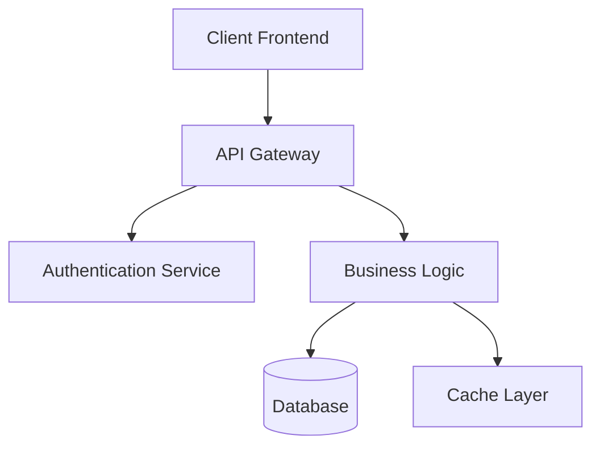
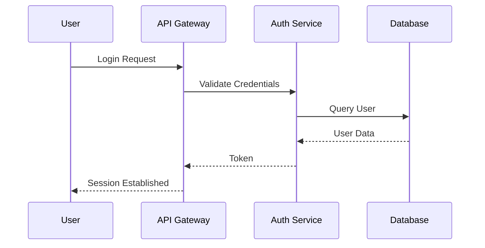

<style>
img {display: block; margin: 0 auto;}
</style>

## Introduzione a Markdown

### La Filosofia di Markdown

Markdown rappresenta una rivoluzione nel modo in cui concepiamo la scrittura digitale, fondandosi su un principio apparentemente semplice ma profondamente trasformativo: la leggibilità come obiettivo primario. Ideato da John Gruber nel 2004 con il supporto di Aaron Swartz per l'implementazione, Markdown nasce dalla frustrazione verso i linguaggi di markup complessi come HTML, che rendono il testo sorgente difficilmente leggibile nella sua forma grezza. La filosofia che sottende questo linguaggio è che un documento dovrebbe essere comprensibile anche senza essere renderizzato: il codice sorgente stesso deve apparire il più possibile simile al risultato finale.

Questa filosofia si manifesta concretamente nella scelta dei marcatori sintattici, che derivano dalle convenzioni tipografiche già diffuse nelle comunicazioni via email e nei newsgroup. L'asterisco per il corsivo, il doppio asterisco per il grassetto, il cancelletto per i titoli: tutti elementi che un lettore abituale delle prime comunicazioni digitali riconosce istintivamente. Markdown non impone una nuova sintassi da imparare, ma codifica e formalizza pratiche già esistenti, rendendole utilizzabili in modo consistente e prevedibile. Questo approccio minimalista riflette un'etica del design centrata sull'utente: non richiedere strumenti specializzati per leggere o scrivere, ma rendi il testo universalmente accessibile.

La filosofia di Markdown abbraccia anche il concetto di portabilità e longevità del contenuto. Un file Markdown è, nella sua essenza, puro testo: può essere aperto da qualsiasi editor, su qualsiasi sistema operativo, senza necessità di software proprietario. Questa caratteristica garantisce che il contenuto rimanga accessibile nel tempo, indipendentemente dall'evoluzione tecnologica. In un'epoca in cui formati proprietari diventano obsoleti e inleggibili, Markdown rappresenta un impegno verso la preservazione del sapere digitale.

### Storia ed Evoluzione

La genesi di Markdown risale al 2004, quando John Gruber, sviluppatore e blogger americano, pubblicò le prime specifiche del linguaggio sul suo sito Daring Fireball. L'idea nacque dall'esigenza pratica di creare un sistema che permettesse di scrivere per il web senza dover combattere con la verbosità dell'HTML, mantenendo però la capacità di generare codice semanticamente corretto. Gruber sviluppò anche il primo convertitore, uno script Perl che trasforma il testo Markdown in HTML, dando vita a un ecosistema che si sarebbe espanso enormemente negli anni successivi.

L'evoluzione di Markdown non si è fermata alla versione originale, ma ha generato una molteplicità di varianti e estensioni che ne hanno ampliato le capacità mantenendo intatta la filosofia fondante. Nel 2012, GitHub introdusse GitHub Flavored Markdown (GFM), una variante che aggiungeva supporto per tabelle, liste di task, e altre funzionalità specifiche per sviluppatori. Questa estensione divenne talmente popolare da diventare di fatto uno standard de facto, successivamente formalizzato in una specifica indipendente. Altre varianti significative includono MultiMarkdown, che aggiunge supporto per note a piè di pagina, tabelle avanzate e metadata, e CommonMark, uno sforzo comunitario per creare una specifica univoca e testabile che risolvesse le ambiguità dell'originale.

L'adozione di Markdown ha superato ogni aspettativa iniziale, estendendosi ben oltre il blogging per diventare lo standard di fatto per la documentazione tecnica, i file README nei repository software, i sistemi di note-taking come Obsidian e Notion, e persino per la stesura di libri e articoli accademici. Piattaforme come Stack Overflow, Reddit e GitLab hanno adottato Markdown come linguaggio primario per la formattazione del testo, mentre generatori di siti statici come Jekyll, Hugo e Hexo hanno costruito interi ecosistemi attorno a questo formato. Questa diffusione capillare testimonia la validità dell'intuizione originale: la semplicità, quando ben concepita, genera adozione universale.

---

## Sintassi di Base

### Intestazioni

Le intestazioni rappresentano la struttura portante di qualsiasi documento ben organizzato, consentendo di creare una gerarchia visiva che guida il lettore attraverso il contenuto. Markdown supporta sei livelli di intestazione, corrispondenti ai tag HTML `<h1>` attraverso `<h6>`, e offre due stili sintattici alternativi per crearle. Il primo stile, chiamato "ATX style" dal nome del software che lo ha reso popolare, utilizza il simbolo del cancelletto (#) seguito da uno spazio prima del testo dell'intestazione. Il numero di cancelletti determina il livello dell'intestazione: un singolo cancelletto per il livello più alto, sei cancelletti per il livello più basso.

Il secondo stile, noto come "Setext style", è disponibile solo per i primi due livelli di intestazione e utilizza linee di sottolineatura sotto il testo. Questo stile storico deriva dalle convenzioni tipografiche tradizionali e può risultare più leggibile in documenti con molte sezioni, sebbene sia meno diffuso nella pratica moderna. È importante notare che il cancelletto deve essere seguito da uno spazio affinché l'intestazione sia riconosciuta correttamente; scrivere `#Intestazione` senza spazio non produrrà l'effetto desiderato. La scelta del livello appropriato per ciascuna intestazione dovrebbe riflettere la struttura logica del documento, non considerazioni puramente estetiche, poiché i motori di ricerca e gli screen reader utilizzano questa gerarchia per comprendere l'organizzazione del contenuto.

**Esempio pratico - Codice sorgente:**

```markdown
# Intestazione di Primo Livello

## Intestazione di Secondo Livello

### Intestazione di Terzo Livello

#### Intestazione di Quarto Livello

##### Intestazione di Quinto Livello

###### Intestazione di Sesto Livello

Stile alternativo per il primo livello
======================================

Stile alternativo per il secondo livello
----------------------------------------
```

**Output renderizzato:**

# Intestazione di Primo Livello

## Intestazione di Secondo Livello

### Intestazione di Terzo Livello

#### Intestazione di Quarto Livello

##### Intestazione di Quinto Livello

###### Intestazione di Sesto Livello

Stile alternativo per il primo livello
======================================

Stile alternativo per il secondo livello
----------------------------------------

### Paragrafi e Interruzioni di Riga

La gestione di paragrafi e interruzioni di riga in Markdown segue un approccio intuitivo che riflette le convenzioni della scrittura tradizionale, pur presentando alcune particolarità tecniche importanti da comprendere per evitare risultati inattesi. Un paragrafo in Markdown viene creato semplicemente lasciando una o più righe vuote prima e dopo il testo desiderato, e questo viene renderizzato come un blocco di testo separato con spaziatura appropriata. Non sono necessari tag di apertura o chiusura: la struttura visiva del testo sorgente corrisponde direttamente alla struttura del documento finale.

Le interruzioni di riga all'interno dello stesso paragrafo richiedono invece un'attenzione particolare. Per creare un'interruzione di riga (il tag HTML `<br>`) senza iniziare un nuovo paragrafo, è necessario terminare la riga con due o più spazi seguiti da un ritorno a capo. Questa convenzione, sebbene non immediatamente visibile nel testo sorgente, è fondamentale per la poesia, gli indirizzi e altri contenuti che richiedono interruzioni specifiche senza separazione paragrafica. In alternativa, è possibile utilizzare il tag HTML `<br>` direttamente, che offre un controllo più esplicito sebbene meno elegante.

È importante comprendere che una singola interruzione di riga senza spazi finali viene ignorata dal parser Markdown, che concatena le righe consecutive in un unico flusso di testo. Questo comportamento permette di scrivere paragrafi lunghi su più righe nel file sorgente mantenendo la leggibilità durante l'editing, senza preoccuparsi che ogni ritorno a capo diventi un'interruzione nel documento finale. Questa caratteristica riflette la filosofia di Markdown: il testo sorgente dovrebbe essere formattato per la massima leggibilità durante la scrittura, non per imitare il risultato finale.

**Esempio pratico - Codice sorgente:**

```markdown
Questo è il primo paragrafo. Può estendersi su diverse righe nel file sorgente
e verrà comunque renderizzato come un unico paragrafo continuo, perché
le interruzioni di riga singole vengono ignorate dal parser.

Questo è il secondo paragrafo, separato dal precedente da una riga vuota.

Questa riga termina con due spazi  
E questa appare sulla riga successiva, ma fa parte dello stesso paragrafo.

Per un'interruzione più esplicita:<br>
Questa riga segue un tag HTML br.
```

**Output renderizzato:**

Questo è il primo paragrafo. Può estendersi su diverse righe nel file sorgente e verrà comunque renderizzato come un unico paragrafo continuo, perché le interruzioni di riga singole vengono ignorate dal parser.

Questo è il secondo paragrafo, separato dal precedente da una riga vuota.

Questa riga termina con due spazi  
E questa appare sulla riga successiva, ma fa parte dello stesso paragrafo.

Per un'interruzione più esplicita:<br>
Questa riga segue un tag HTML br.

### Formattazione del Testo

La formattazione del testo costituisce uno degli aspetti più immediatamente visibili e utilizzati di Markdown, permettendo di applicare enfasi, distinzione e gerarchia visiva al contenuto testuale. Markdown offre tre stili di formattazione fondamentali: il corsivo per l'enfasi leggera, il grassetto per l'enfasi forte, e la combinazione corsivo-grassetto per la massima enfasi. Questi stili vengono applicati utilizzando asterischi (*) o underscore (_) come marcatori, con la possibilità di scegliere tra i due stili secondo preferenza personale, sebbene gli asterischi siano più diffusi e universalmente supportati.

La sintassi per il corsivo richiede un singolo marcatore prima e dopo il testo da formattare: `*testo*` o `_testo_` producono entrambi lo stesso risultato. Per il grassetto, si raddoppia il marcatore: `**testo**` o `__testo__` rendono il testo in grassetto. La combinazione di corsivo e grassetto si ottiene triplicando il marcatore: `***testo***` produce testo sia corsivo che grassetto. È importante notare che i marcatori devono essere posizionati direttamente adiacenti al testo, senza spazi intermedi, affinché la formattazione venga applicata correttamente.

Markdown supporta inoltre la formattazione per barrato, sebbene questa non faccia parte della specifica originale ma sia inclusa in GFM e altre varianti. Il testo barrato si ottiene con doppio tilde: `~~testo~~`. Per contenuti tecnici, è disponibile anche il formato `codice inline`, racchiuso tra backtick singoli (`), che renderizza il testo con un font monospaziato all'interno di un blocco visivamente distinto. Questa formattazione è ideale per nomi di variabili, comandi brevi, e altri elementi di codice integrati nel testo. Infine, l'HTML fornisce opzioni aggiuntive come `<sub>` e `<sup>` per pedici e apici, non supportati nativamente da Markdown ma utilizzabili direttamente.

**Esempio pratico - Codice sorgente:**

```markdown
Il testo *corsivo* o _corsivo_ aggiunge enfasi leggera.

Il testo **grassetto** o __grassetto__ aggiunge enfasi forte.

Il testo ***corsivo e grassetto*** o ___corsivo e grassetto___ combina entrambi.

Il testo ~~barrato~~ indica contenuto eliminato o non più valido.

Il `codice inline` è utile per comandi come `npm install` o variabili.

Ecco una formula chimica: H<sub>2</sub>O e un apice matematico: E=mc<sup>2</sup>.
```

**Output renderizzato:**

Il testo *corsivo* o _corsivo_ aggiunge enfasi leggera.

Il testo **grassetto** o __grassetto__ aggiunge enfasi forte.

Il testo ***corsivo e grassetto*** o ___corsivo e grassetto___ combina entrambi.

Il testo ~~barrato~~ indica contenuto eliminato o non più valido.

Il `codice inline` è utile per comandi come `npm install` o variabili.

Ecco una formula chimica: H<sub>2</sub>O e un apice matematico: E=mc<sup>2</sup>.

### Liste

Le liste rappresentano uno strumento fondamentale per organizzare informazioni in modo strutturato e facilmente scansionabile, e Markdown offre supporto nativo sia per liste ordinate che non ordinate, con possibilità di annidamento per creare strutture gerarchiche complesse. La creazione di liste in Markdown è intenzionalmente semplice e flessibile, permettendo di concentrarsi sul contenuto piuttosto che sulla formattazione, pur mantenendo la capacità di produrre output semanticamente corretto.

Le liste non ordinate, dette anche liste puntate, utilizzano asterischi (*), trattini (-), o segni più (+) come marcatori, seguiti da uno spazio prima del contenuto. Tutti e tre i marcatori producono lo stesso risultato, offrendo flessibilità stilistica al momento della scrittura. Le liste ordinate utilizzano numeri seguiti da un punto e uno spazio, e interessantemente, i numeri effettivi nel sorgente non devono essere sequenziali: il renderer si occuperà di generare la numerazione corretta. Questo permette di riordinare gli elementi o inserirne di nuovi senza dover rinumerare l'intera lista.

L'annidamento delle liste si ottiene tramite indentazione, tipicamente quattro spazi o una tabulazione, e permette di creare sottoliste di qualsiasi tipo combinato. Una lista non ordinata può contenere sottoliste ordinate e viceversa, permettendo la massima flessibilità nell'organizzazione del contenuto. È importante mantenere l'indentazione consistente all'interno di ciascun livello per garantire un rendering corretto, e alcuni parser richiedono che la spaziatura sia esattamente di quattro spazi per riconoscere l'annidamento.

**Esempio pratico - Codice sorgente:**

```markdown
Lista non ordinata con asterischi:
* Primo elemento
* Secondo elemento
* Terzo elemento

Lista non ordinata con trattini:
- Elemento A
- Elemento B
- Elemento C

Lista ordinata:
1. Passo iniziale
2. Passo intermedio
3. Passo finale

Lista annidata:
1. Elemento principale
   - Sottolista non ordinata
   - Secondo elemento annidato
     * Terzo livello di annidamento
2. Altro elemento principale
   1. Sottolista ordinata
   2. Secondo elemento numerato
```

**Output renderizzato:**

Lista non ordinata con asterischi:
* Primo elemento
* Secondo elemento
* Terzo elemento

Lista non ordinata con trattini:
- Elemento A
- Elemento B
- Elemento C

Lista ordinata:
1. Passo iniziale
2. Passo intermedio
3. Passo finale

Lista annidata:
1. Elemento principale
   - Sottolista non ordinata
   - Secondo elemento annidato
     * Terzo livello di annidamento
2. Altro elemento principale
   1. Sottolista ordinata
   2. Secondo elemento numerato

### Link

I collegamenti ipertestuali rappresentano il cuore del web, e Markdown offre una sintassi elegante e flessibile per crearli senza la verbosità del tag HTML `<a>`. I link in Markdown possono essere creati in tre stili principali: inline, di riferimento e automatici, ciascuno ottimizzato per diversi contesti d'uso. La scelta dello stile appropriato può migliorare significativamente la leggibilità del documento sorgente, specialmente in testi con molti collegamenti o link ripetuti.

I link inline rappresentano lo stile più immediato e diffuso: il testo visibile del link viene racchiuso tra parentesi quadre, seguito immediatamente dall'URL tra parentesi tonde. È possibile aggiungere un titolo opzionale che appare come tooltip al passaggio del mouse, inserendolo tra virgolette dopo l'URL. Questa sintassi mantiene il link visivamente integrato nel testo sorgente, rendendo immediata l'associazione tra testo e destinazione, ideale per documenti con pochi collegamenti o dove la chiarezza immediata è prioritaria.

I link di riferimento separano la definizione dell'URL dal punto di utilizzo, migliorando la leggibilità in documenti densi di collegamenti. Il testo del link è seguito da un'etichetta di riferimento tra parentesi quadre, e la definizione dell'URL può apparire in qualsiasi punto del documento, tipicamente raggruppata alla fine. Questa separazione permette di modificare gli URL in un'unica posizione centralizzata e mantiene il flusso del testo pulito. I link automatici, infine, convertono automaticamente URL e indirizzi email in link cliccabili quando racchiusi tra parentesi angolari `< >`.

**Esempio pratico - Codice sorgente:**

```markdown
Link inline classico:
Visita [Markdown Guide](https://www.markdownguide.org/) per saperne di più.

Link inline con titolo:
Leggi le [specifiche originali](https://daringfireball.net/projects/markdown/ "Specifiche Markdown di John Gruber") su Daring Fireball.

Link di riferimento:
Per maggiori informazioni, consulta la [documentazione ufficiale][docs] o il [tutorial base][tutorial].

[docs]: https://www.markdownguide.org/getting-started/
[tutorial]: https://www.markdownguide.org/basic-syntax/

Link automatico:
<https://www.example.com>
<indirizzo@esempio.com>
```

**Output renderizzato:**

Link inline classico:
Visita [Markdown Guide](https://www.markdownguide.org/) per saperne di più.

Link inline con titolo:
Leggi le [specifiche originali](https://daringfireball.net/projects/markdown/ "Specifiche Markdown di John Gruber") su Daring Fireball.

Link di riferimento:
Per maggiori informazioni, consulta la [documentazione ufficiale][docs] o il [tutorial base][tutorial].

[docs]: https://www.markdownguide.org/getting-started/
[tutorial]: https://www.markdownguide.org/basic-syntax/

Link automatico:
<https://www.example.com>
<indirizzo@esempio.com>

### Immagini

Le immagini seguono una sintassi molto simile a quella dei link, differenziandosi per l'aggiunta di un punto esclamativo iniziale che segnala al parser di trattare il riferimento come risorsa visiva. L'inclusione di immagini è fondamentale per documentazione tecnica, tutorial e qualsiasi contenuto che tragga beneficio da supporti visivi, e Markdown gestisce questo elemento con la stessa eleganza minimalista delle altre funzionalità. La sintassi base richiede il testo alternativo tra parentesi quadre, che serve sia per l'accessibilità che per i motori di ricerca, seguito dal percorso dell'immagine tra parentesi tonde.

Il percorso dell'immagine può essere un URL assoluto che punta a una risorsa esterna, un URL relativo che riferisce a file locali nel progetto, o anche un data URI che incorpora direttamente l'immagine nel documento. Per le immagini ospitate localmente, è pratica comune organizzare i file in una cartella dedicata come `/images/` o `/assets/` e utilizzare percorsi relativi per mantenere la portabilità del progetto. Come per i link, anche le immagini supportano un titolo opzionale che appare come tooltip e può fornire contesto aggiuntivo.

La sintassi per le immagini di riferimento segue lo stesso principio dei link di riferimento, separando la definizione del percorso dal punto di utilizzo. Questa separazione è particolarmente utile quando la stessa immagine viene utilizzata più volte nel documento o quando si desidera mantenere il testo sorgente pulito da URL lunghi. È importante notare che Markdown nativo non supporta la specifica delle dimensioni dell'immagine; per questo controllo avanzato è necessario utilizzare HTML inline con il tag `` e i relativi attributi di larghezza e altezza.

**Esempio pratico - Codice sorgente:**

```markdown
Immagine inline:


Immagine con titolo:


Immagine con riferimento:
![Logo del progetto][logo]

[logo]: https://markdown-here.com/img/icon256.png "Logo referenziato"

Immagine con dimensioni personalizzate (HTML):

```

**Output renderizzato:**

Immagine inline:


Immagine con titolo:


Immagine con riferimento:
![Logo del progetto][logo]

[logo]: https://markdown-here.com/img/icon256.png "Logo referenziato"

Immagine con dimensioni personalizzate (HTML):


---

## Estensioni Avanzate: GitHub Flavored Markdown (GFM)

GitHub Flavored Markdown rappresenta l'estensione più significativa e diffusamente adottata del Markdown originale, sviluppata da GitHub per rispondere alle esigenze specifiche della comunità di sviluppatori. GFM aggiunge diverse funzionalità critiche che mancano nella specifica originale, rendendo Markdown adatto a contesti professionali e tecnici senza comprometterne la leggibilità. La specifica GFM è ora mantenuta come progetto indipendente ed è stata formalmente standardizzata, garantendo un comportamento coerente tra diverse implementazioni.

Le estensioni introdotte da GFM non sono mere aggiunte superficiali, ma rispondono a reali necessità pratiche emerse dall'uso intensivo di Markdown in contesti collaborativi. Le tabelle permettono di presentare dati strutturati in modo chiaro e professionale, le liste di task facilitano il tracciamento del lavoro nei progetti, i blocchi di codice con syntax highlighting migliorano drammaticamente la leggibilità della documentazione tecnica, e varie estensioni per la sicurezza e l'auto-linking semplificano la creazione di contenuti ricchi. Queste funzionalità hanno contribuito a fare di GFM lo standard de facto per la documentazione software moderna.

### Tabelle

Le tabelle rappresentano una delle aggiunte più richieste e utilizzate di GFM, permettendo di strutturare dati tabulari con una sintassi che, sebbene più complessa del Markdown base, rimane sorprendentemente leggibile nel testo sorgente. La creazione di una tabella inizia con una riga di intestazione, seguita da una riga di separatori che definisce l'allineamento delle colonne, e infine le righe di dati. I separatori utilizzano trattini per indicare le colonne, con la possibilità di aggiungere due punti per specificare l'allineamento: a sinistra per l'allineamento a sinistra, a destra per l'allineamento a destra, o su entrambi i lati per il centrato.

La sintassi delle tabelle GFM è intenzionalmente permissiva riguardo alla spaziatura: non è necessario che i separatori e il contenuto siano perfettamente allineati verticalmente nel testo sorgente, poiché il parser determina la struttura in base ai caratteri pipe (|). Questa flessibilità permette di mantenere il testo sorgente leggibile durante l'editing senza sacrificare il risultato finale. Le celle possono contenere formattazione inline come grassetto, corsivo, codice e link, permettendo di arricchire il contenuto tabellare con enfasi e collegamenti appropriati.

È importante notare che le tabelle GFM non supportano celle unite verticalmente o orizzontalmente, né l'inserimento di blocchi complessi come liste o paragrafi multipli all'interno delle celle. Per strutture tabulari più complesse, è necessario ricorrere a HTML puro con i tag `<table>`, `<tr>`, `<td>` e relativi attributi. Questa limitazione riflette la filosofia di Markdown di mantenere la sintassi semplice e il testo sorgente leggibile, sacrificando funzionalità avanzate che complicherebbero eccessivamente il formato.

**Esempio pratico - Codice sorgente:**

```markdown
| Linguaggio | Paradigma | Anno | Popolarità |
|------------|:----------|:----:|-----------:|
| Python     | Multi-paradigma | 1991 | Alta |
| JavaScript | Multi-paradigma | 1995 | Molto Alta |
| Rust       | Multi-paradigma | 2010 | Crescente |
| Go         | Imperativo | 2009 | Media-Alta |

Tabella con formattazione inline:

| Comando | Descrizione | Esempio |
|---------|-------------|---------|
| `npm install` | Installa dipendenze | `npm install lodash` |
| `git clone` | Clona repository | `git clone url` |
| **`docker run`** | Esegue container | `docker run -it ubuntu` |
```

**Output renderizzato:**

| Linguaggio | Paradigma | Anno | Popolarità |
|------------|:----------|:----:|-----------:|
| Python     | Multi-paradigma | 1991 | Alta |
| JavaScript | Multi-paradigma | 1995 | Molto Alta |
| Rust       | Multi-paradigma | 2010 | Crescente |
| Go         | Imperativo | 2009 | Media-Alta |

Tabella con formattazione inline:

| Comando | Descrizione | Esempio |
|---------|-------------|---------|
| `npm install` | Installa dipendenze | `npm install lodash` |
| `git clone` | Clona repository | `git clone url` |
| **`docker run`** | Esegue container | `docker run -it ubuntu` |

### Liste di Task

Le liste di task (o task lists) sono una funzionalità specifica di GFM che trasforma semplici liste in elementi interattivi per il tracciamento del lavoro, particolarmente utili nei file README, nelle issue e nei commenti su GitHub. La sintassi estende le liste non ordinate standard aggiungendo parentesi quadre all'inizio di ciascun elemento, contenenti uno spazio per i task incompleti o una x per quelli completati. Questa rappresentazione visiva immediata dello stato di avanzamento rende le liste di task uno strumento prezioso per la gestione progetti leggera.

L'aspetto più potente delle liste di task in GitHub è la loro interattività: nelle issue, pull request e commenti, gli utenti possono cliccare direttamente sulle caselle di controllo per cambiare lo stato del task, e questa modifica viene riflesta automaticamente nel testo del commento o della issue. Questo comportamento trasforma documenti statici in strumenti dinamici di gestione del lavoro, permettendo ai team di tracciare il progresso direttamente all'interno della documentazione senza strumenti aggiuntivi. Al di fuori di GitHub, la maggior parte dei renderer visualizza le liste di task come caselle di controllo statiche ma visivamente distinte.

La combinazione di liste di task con altre funzionalità di Markdown aumenta ulteriormente la loro utilità: è possibile aggiungere formattazione, link e riferimenti all'interno di ciascun task, creare liste annidate di sottotask, e organizzare i task in sezioni con intestazioni appropriate. Nei file README di progetti software, le liste di task sono comunemente utilizzate per mostrare lo stato di implementazione delle funzionalità, elencare i passaggi necessari per completare un'attività, o documentare il progresso di milestone specifiche.

**Esempio pratico - Codice sorgente:**

```markdown
## Stato del Progetto

- [x] Configurazione ambiente di sviluppo
- [x] Creazione struttura base del progetto
- [ ] Implementazione API REST
  - [x] Endpoint GET /users
  - [x] Endpoint POST /users
  - [ ] Endpoint PUT /users/:id
  - [ ] Endpoint DELETE /users/:id
- [ ] Scrittura test unitari
- [ ] Documentazione
- [ ] Deploy in produzione
```

**Output renderizzato:**

## Stato del Progetto

- [x] Configurazione ambiente di sviluppo
- [x] Creazione struttura base del progetto
- [ ] Implementazione API REST
  - [x] Endpoint GET /users
  - [x] Endpoint POST /users
  - [ ] Endpoint PUT /users/:id
  - [ ] Endpoint DELETE /users/:id
- [ ] Scrittura test unitari
- [ ] Documentazione
- [ ] Deploy in produzione

### Blocchi di Codice con Syntax Highlighting

I blocchi di codice rappresentano un elemento essenziale per qualsiasi documentazione tecnica, e GFM offre due modalità per delimitarli: l'indentazione di quattro spazi (stile originale) e le recinzioni con backtick tripli (fenced code blocks), che è diventato lo standard preferito. I fenced code blocks non solo rendono il codice più evidente nel testo sorgente, ma permettono anche di specificare il linguaggio di programmazione per attivare il syntax highlighting automatico, trasformando blocchi di testo monocromatici in rappresentazioni colorate e molto più leggibili.

La specifica del linguaggio avviene aggiungendo il nome del linguaggio immediatamente dopo i backtick di apertura, senza spazi intermedi. I renderer supportano centinaia di linguaggi, dai più comuni come JavaScript, Python, Java e CSS, a linguaggi più oscuri e formati di configurazione come YAML, JSON, TOML e Dockerfile. Il syntax highlighting non è parte integrante di Markdown ma viene applicato da librerie esterne come highlight.js, Prism o Rouge, che i renderer integrano per produrre output visivamente arricchito.

Oltre al syntax highlighting, i fenced code blocks supportano anche la numerazione delle righe, l'evidenziazione di righe specifiche e altre funzionalità avanzate a seconda del renderer utilizzato. Alcune implementazioni permettono di specificare righe da evidenziare dopo il nome del linguaggio con sintassi come `{2,4-6}`, mentre altre supportano attributi aggiuntivi per il controllo fine del rendering. Per codice che deve essere copiato frequentemente, molti renderer aggiungono automaticamente un pulsante di copia negli angoli dei blocchi di codice.

**Esempio pratico - Codice sorgente:**

```markdown
Codice senza syntax highlighting:

```
function greet(name) {
  return `Hello, ${name}!`;
}
```

Codice JavaScript con highlighting:

```javascript
function fibonacci(n) {
  if (n <= 1) return n;
  return fibonacci(n - 1) + fibonacci(n - 2);
}

// Esempio di utilizzo
console.log(fibonacci(10)); // Output: 55
```

Codice Python:

```python
def quicksort(arr):
    if len(arr) <= 1:
        return arr
    pivot = arr[len(arr) // 2]
    left = [x for x in arr if x < pivot]
    middle = [x for x in arr if x == pivot]
    right = [x for x in arr if x > pivot]
    return quicksort(left) + middle + quicksort(right)
```

Configurazione YAML:

```yaml
server:
  port: 3000
  host: localhost
database:
  type: postgresql
  name: myapp_dev
```
```

**Output renderizzato:**

Codice senza syntax highlighting:

```
function greet(name) {
  return `Hello, ${name}!`;
}
```

Codice JavaScript con highlighting:

```javascript
function fibonacci(n) {
  if (n <= 1) return n;
  return fibonacci(n - 1) + fibonacci(n - 2);
}

// Esempio di utilizzo
console.log(fibonacci(10)); // Output: 55
```

Codice Python:

```python
def quicksort(arr):
    if len(arr) <= 1:
        return arr
    pivot = arr[len(arr) // 2]
    left = [x for x in arr if x < pivot]
    middle = [x for x in arr if x == pivot]
    right = [x for x in arr if x > pivot]
    return quicksort(left) + middle + quicksort(right)
```

Configurazione YAML:

```yaml
server:
  port: 3000
  host: localhost
database:
  type: postgresql
  name: myapp_dev
```

### Note a Piè di Pagina

Le note a piè di pagina permettono di arricchire il documento con riferimenti, citazioni e informazioni supplementari senza interrompere il flusso della lettura principale. Questa funzionalità, derivata da MultiMarkdown e successivamente adottata in molte varianti tra cui alcune implementazioni GFM, segue una sintassi elegante che separa il marcatore di riferimento dal contenuto della nota. Nel testo, un riferimento appare come un identificatore preceduto da un accento circonflesso e racchiuso tra parentesi quadre, mentre la definizione della nota appare altrove nel documento con la stessa etichetta seguita da due punti e dal contenuto.

Gli identificatori delle note possono essere numerici o testuali, e non devono essere necessariamente sequenziali nel testo sorgente. Durante il rendering, le note vengono automaticamente numerate e collegate ai riferimenti corrispondenti, permettendo ai lettori di navigare agevolmente tra il testo principale e le annotazioni. Questa numerazione automatica elimina la necessità di rinumerare manualmente le note quando se ne aggiungono o rimuovono, semplificando notevolmente la manutenzione di documenti accademici o riccamente annotati.

Il contenuto delle note può estendersi su più righe e può includere formattazione Markdown completa, inclusi link, enfasi e persino blocchi di codice. Le note vengono tipicamente renderizzate alla fine del documento o della sezione, con link bidirezionali che permettono di saltare dal riferimento alla nota e viceversa. Questa organizzazione mantiene il corpo del testo pulito e focalizzato mentre rende le informazioni supplementari facilmente accessibili a chi desidera approfondire.

**Esempio pratico - Codice sorgente:**

```markdown
Markdown è stato creato da John Gruber nel 2004[^1], con il contributo di Aaron Swartz per l'implementazione iniziale[^gruber-swartz]. La filosofia alla base del linguaggio enfatizza la leggibilità del testo sorgente[^leggibilita].

In anni recenti, CommonMark[^commonmark] ha tentato di standardizzare le varie implementazioni.

[^1]: John Gruber è uno sviluppatore e blogger americano, creatore del sito Daring Fireball.
[^gruber-swartz]: Aaron Swartz (1986-2013) è stato un programmatore, scrittore e attivista internet, co-autore della specifica Markdown.
[^leggibilita]: "Il più grande obiettivo di Markdown è la leggibilità. La cosa più importante è che un documento in formato Markdown sia pubblicabile così com'è, come testo puro." — John Gruber
[^commonmark]: CommonMark è uno sforzo comunitario per specificare una versione di Markdown ambiguità e testabile. Vedi https://commonmark.org/
```

**Output renderizzato:**

Markdown è stato creato da John Gruber nel 2004[^1], con il contributo di Aaron Swartz per l'implementazione iniziale[^gruber-swartz]. La filosofia alla base del linguaggio enfatizza la leggibilità del testo sorgente[^leggibilita].

In anni recenti, CommonMark[^commonmark] ha tentato di standardizzare le varie implementazioni.

[^1]: John Gruber è uno sviluppatore e blogger americano, creatore del sito Daring Fireball.
[^gruber-swartz]: Aaron Swartz (1986-2013) è stato un programmatore, scrittore e attivista internet, co-autore della specifica Markdown.
[^leggibilita]: "Il più grande obiettivo di Markdown è la leggibilità. La cosa più importante è che un documento in formato Markdown sia pubblicabile così com'è, come testo puro." — John Gruber
[^commonmark]: CommonMark è uno sforzo comunitario per specificare una versione di Markdown ambiguità e testabile. Vedi https://commonmark.org/

---

## Strumenti per Lavorare con Markdown

L'ecosistema di strumenti per Markdown si è espanso enormemente dalla sua creazione, offrendo soluzioni per ogni esigenza, dalla semplice modifica occasionale all'integrazione in workflow professionali complessi. La scelta degli strumenti appropriati dipende dal contesto d'uso: un blogger occasionale avrà esigenze diverse da un team di sviluppatori che documenta un'API o uno scrittore che produce un libro tecnico. Questa sezione esplora le categorie principali di strumenti disponibili, evidenziando le caratteristiche distintive di ciascuna opzione.

### Editor Dedicati

Gli editor dedicati a Markdown sono applicazioni progettate specificamente per la scrittura in questo formato, offrendo funzionalità avanzate come l'anteprima in tempo reale, la gestione di file multipli, e l'esportazione in vari formati. Tra i più apprezzati, **Typora** si distingue per il suo approccio "WYSIWYG" che rimuove la distinzione tra modalità editing e anteprima, mostrando il rendering del Markdown direttamente mentre si scrive. Questo approccio ibrido offre un'esperienza di scrittura fluida che molti trovano più naturale del tradizionale split-pane con codice da un lato e anteprima dall'altro.

**Obsidian** ha rivoluzionato il panorama degli appunti Markdown introducendo il concetto di "second brain" o knowledge base personale. Oltre alla modifica di file Markdown, Obsidian offre linking tra note, grafi di connessione, plugin estensibili e funzionalità avanzate per la gestione della conoscenza. La sua architettura basata su file locali garantisce il controllo completo sui dati, rendendolo ideale per chi desidera un sistema di note-taking potente ma non proprietario. La comunità di plugin ha ampliato enormemente le capacità base, aggiungendo supporto per diagrammi, calcoli, e integrazioni con servizi esterni.

Altri editor degni di nota includono **iA Writer**, apprezzato per il suo design minimalista e funzionalità come la modalità focus che evidenzia solo la frase o il paragrafo corrente, riducendo le distrazioni durante la scrittura; **MarkText**, un editor open-source con caratteristiche simili a Typora ma completamente gratuito; e **Bear** per l'ecosistema Apple, che combina un'interfaccia elegante con potenti funzionalità di organizzazione tramite tag. La scelta tra questi editor dipende dalle preferenze personali riguardo l'interfaccia, dal sistema operativo utilizzato, e dalle funzionalità specifiche richieste.

### Plugin per IDE

Per sviluppatori e professionisti che lavorano principalmente in ambienti di sviluppo integrati, i plugin Markdown offrono la comodità di rimanere nell'ambiente familiare dell'IDE senza sacrificare le funzionalità di editing. **Visual Studio Code** dispone di un ecosistema particolarmente ricco di estensioni per Markdown, tra cui "Markdown All in One" che aggiunge scorciatoie da tastiera, anteprima, completamento automatico e molto altro. L'estensione "Markdown Preview Enhanced" estende ulteriormente le capacità con supporto per diagrammi Mermaid, formule matematiche, e esportazione in PDF e HTML.

Gli IDE basati su IntelliJ come **IntelliJ IDEA**, **PyCharm** e **WebStorm** includono supporto Markdown integrato con anteprima e formattazione base, estendibile tramite plugin per funzionalità aggiuntive. **Sublime Text**, storico editor preferito da molti sviluppatori per la sua velocità, può essere potenziato con pacchetti come "MarkdownEditing" e "OmniMarkupPreviewer" per un'esperienza Markdown completa. **Vim** e **Neovim** offrono plugin come "vim-markdown" e previsioni integrate che permettono di lavorare con Markdown senza abbandonare l'efficienza caratteristica di questi editor.

La scelta di lavorare con Markdown direttamente nell'IDE offre vantaggi significativi per chi sviluppa software: integrazione con il controllo versione, possibilità di utilizzare snippet e macro familiari, e il contesto immediato del codice che si sta documentando. Molti sviluppatori trovano questo workflow più efficiente rispetto al passaggio continuo tra editor dedicati e ambiente di sviluppo, specialmente per progetti dove documentazione e codice devono evolvere insieme.

### Visual Studio Code: Estensioni Markdown Essenziali

Visual Studio Code rappresenta l'editor di riferimento per un numero crescente di sviluppatori, e il suo ecosistema di estensioni per Markdown è particolarmente ricco e maturo. Tra le numerose estensioni disponibili, due si distinguono per completezza e diffusione: **Markdown All in One** e **Markdown Preview Enhanced**. Queste estensioni, utilizzate singolarmente o in combinazione, trasformano VS Code in un ambiente di scrittura Markdown professionale, capace di competere con editor dedicati pur mantenendo i vantaggi dell'integrazione in un IDE completo.

#### Markdown All in One

Markdown All in One è un'estensione che porta le scorciatoie da tastiera, il completamento automatico e altre funzionalità di produttività direttamente nell'editor VS Code. L'obiettivo principale dell'estensione è rendere la scrittura di Markdown fluida e rapida, eliminando la necessità di digitare manualmente i marcatori sintattici più comuni. Questa sezione esplora le funzionalità principali dell'estensione e fornisce esempi pratici di utilizzo.

**Funzionalità principali:**

1. **Scorciatoie da tastiera per la formattazione**: L'estensione introduce scorciatoie intuitive per applicare la formattazione più comune. Premendo `Ctrl+B` si applica il grassetto al testo selezionato, `Ctrl+I` il corsivo, `Ctrl+Shift+]` si aumenta il livello dell'intestazione, mentre `Ctrl+Shift+[` lo diminuisce. Queste scorciatoie seguono le convenzioni dei word processor più diffusi, rendendo la transizione a Markdown naturale per chi proviene da ambienti come Microsoft Word.

2. **Completamento automatico**: L'estensione offre IntelliSense per elementi Markdown, suggerendo automaticamente link, immagini e altri elementi mentre si digita. Quando si inizia a digitare un link con `[`, l'estensione suggerisce automaticamente i file del progetto e i link precedentemente utilizzati.

3. **Generazione automatica dell'indice (Table of Contents)**: Una delle funzionalità più apprezzate è la generazione automatica dell'indice. Premendo `Ctrl+Shift+P` e digitando "Markdown: Create Table of Contents", l'estensione analizza il documento e genera un indice formattato con link alle sezioni corrispondenti. L'indice può essere configurato per aggiornarsi automaticamente quando si salvano le modifiche.

4. **Liste intelligenti**: Premendo `Enter` alla fine di un elemento di lista, l'estensione crea automaticamente il nuovo elemento con il marcatore appropriato. Per le liste ordinate, numera automaticamente gli elementi successivi. Premendo `Tab` su un elemento di lista, questo viene indentato correttamente per creare sottoliste.

5. **Anteprima integrata**: L'estensione include un'anteprima sincronizzata che mostra il rendering del documento in tempo reale. L'anteprima può essere aperta premendo `Ctrl+Shift+V` o affiancata all'editor con `Ctrl+K V`.

6. **Conversione da HTML e documenti Office**: Una funzionalità particolarmente utile è la conversione automatica di testo copiato da fonti esterne. Quando si incolla testo copiato da una pagina web o da un documento Word, l'estensione può convertirlo automaticamente in Markdown.

**Esempio pratico di utilizzo:**

Immaginiamo di dover creare rapidamente un file README per un progetto. Con Markdown All in One, il processo diventa estremamente efficiente:

1. Creare un nuovo file `README.md`
2. Digitare `readme` e premere `Tab` per espandere lo snippet predefinito che genera la struttura base
3. Digitare il titolo del progetto e premere `Ctrl+Enter` per passare alla riga successiva
4. Per aggiungere una sezione, digitare `##`, seguito da uno spazio e il titolo della sezione
5. Selezionare una parola importante e premere `Ctrl+B` per metterla in grassetto
6. Per creare una lista, digitare `-` seguito da uno spazio; l'estensione continuerà automaticamente la lista premendo `Enter`
7. Per generare l'indice, posizionarsi all'inizio del documento, premere `Ctrl+Shift+P` e selezionare "Markdown: Create Table of Contents"

**Impostazioni per la conversione da HTML e documenti Office:**

Markdown All in One offre diverse impostazioni per controllare come il testo copiato viene convertito in Markdown. Queste impostazioni sono particolarmente utili quando si deve migrare documentazione da fonti esterne o quando si riutilizza contenuto da pagine web.

Le impostazioni principali sono accessibili tramite il file `settings.json` di VS Code:

```json
{
  // Abilita la conversione automatica quando si incolla
  "markdown.extension.pasteUrlAsLink": true,
  
  // Controlla come vengono convertiti i paragrafi
  "markdown.extension.pasteAsMarkdown.preserveNewlines": false,
  
  // Converte gli stili di testo (bold, italic, etc.)
  "markdown.extension.pasteAsMarkdown.convertTextStyle": true,
  
  // Gestisce la conversione delle liste
  "markdown.extension.pasteAsMarkdown.convertList": true,
  
  // Converte i link in formato Markdown
  "markdown.extension.pasteAsMarkdown.convertLink": true,
  
  // Gestisce le immagini durante la conversione
  "markdown.extension.pasteAsMarkdown.convertImage": true
}
```

Per la conversione specifica di paragrafi da HTML o documenti Office, l'estensione utilizza regole interne che possono essere influenzate dalle seguenti considerazioni:

- **Paragrafi multipli**: Quando si incolla testo con più paragrafi, l'estensione li separa con righe vuote, rispettando la convenzione Markdown standard
- **Interruzioni di riga**: Le interruzioni di riga singole (`<br>` in HTML) vengono convertite in base all'impostazione `preserveNewlines`. Se impostato su `true`, vengono mantenute come doppio spazio seguito da newline; se `false`, vengono eliminate
- **Stili di paragrafo**: Gli stili applicati a interi paragrafi in Word (come intestazioni) vengono convertiti nei corrispondenti marcatori Markdown (`#`, `##`, ecc.)

Per un controllo più granulare della conversione, è possibile utilizzare il comando "Paste as Markdown" dal command palette (`Ctrl+Shift+P`), che applica la conversione solo quando esplicitamente richiesto, invece della conversione automatica all'incolla.

#### Markdown Preview Enhanced

Markdown Preview Enhanced rappresenta un'estensione significativamente più avanzata, che trasforma l'anteprima di VS Code in un potente strumento di visualizzazione e esportazione. Sviluppata da Yiyi Wang, questa estensione supporta funzionalità che vanno ben oltre il Markdown standard, includendo diagrammi, formule matematiche, e integrazione con strumenti di produzione professionale.

**Funzionalità principali:**

1. **Supporto per diagrammi Mermaid**: L'estensione renderizza nativamente i diagrammi Mermaid direttamente nell'anteprima. Questo permette di creare flowchart, sequence diagram, Gantt chart e altri tipi di diagrammi utilizzando una sintassi testuale semplice. I diagrammi vengono renderizzati come immagini vettoriali, mantenendo la qualità a qualsiasi risoluzione.

2. **Formule matematiche LaTeX**: Il supporto per MathJax permette di includere formule matematiche complesse utilizzando la sintassi LaTeX. Le formule inline vengono delimitate da `$...$`, mentre i blocchi di formule utilizzano `$$...$$`. Questa funzionalità è essenziale per documentazione scientifica, articoli accademici e materiale didattico.

3. **Diagrammi PlantUML e Graphviz**: Oltre a Mermaid, l'estensione supporta PlantUML e Graphviz per la creazione di diagrammi più complessi, inclusi diagrammi UML completi, diagrammi di classe e mappe mentali.

4. **Visualizzazione di dati CSV e tabelle**: L'estensione può renderizzare file CSV e tabelle dati in formati visualmente accattivanti, con supporto per ordinamento e filtraggio.

5. **Code chunk e esecuzione di codice**: Una funzionalità avanzata permette di includere "code chunk" che possono essere eseguiti direttamente nell'anteprima, con il risultato visualizzato in tempo reale. Questo supporta linguaggi come Python, R, JavaScript e altri.

6. **Anteprima sincronizzata bidirezionale**: L'estensione offre sincronizzazione bidirezionale tra l'editor e l'anteprima: cliccando su un elemento nell'anteprima, l'editor salta alla posizione corrispondente, e viceversa.

**Esempio pratico di utilizzo:**

Creiamo un documento tecnico che combina testo, diagrammi e formule matematiche:

```markdown
# Architettura del Sistema

## Panoramica dei Componenti

Il sistema è composto da tre moduli principali che comunicano tramite API REST.



## Formula di Calcolo

Il tempo di risposta del sistema è calcolato secondo la formula:

$$T_{response} = T_{processing} + T_{network} + T_{queue}$$

Dove:
- $T_{processing}$ rappresenta il tempo di elaborazione del server
- $T_{network}$ rappresenta la latenza di rete
- $T_{queue}$ rappresenta il tempo di attesa in coda

## Sequence Diagram


```

Questo documento, quando visualizzato con Markdown Preview Enhanced, mostrerà i diagrammi renderizzati e le formule matematiche correttamente formattate.

**Funzionalità di esportazione e integrazione con strumenti di produzione:**

Markdown Preview Enhanced offre potenti funzionalità di esportazione che lo rendono adatto a workflow professionali. L'estensione si integra con strumenti esterni come Pandoc, LaTeX e Prince per produrre output di alta qualità in diversi formati.

Per una guida completa alle funzionalità di esportazione, inclusa la configurazione di Pandoc, MiKTeX, Puppeteer e WeasyPrint, si rimanda alla pagina dedicata [Convertire Markdown in altri formati](/dev-tools/markdown/convert-to-everything), che descrive in dettaglio:

- Installazione e configurazione degli strumenti di sistema necessari
- Configurazione dell'estensione per l'esportazione in PDF, DOCX, EPUB e altri formati
- Personalizzazione del layout tramite CSS e variabili Pandoc
- Gestione dei segnalibri PDF
- Workflow consigliati per diversi scenari di produzione

Per esportare un documento dall'anteprima di Markdown Preview Enhanced:

1. Aprire l'anteprima premendo `Ctrl+Shift+V` o cliccando sull'icona in alto a destra
2. Cliccare con il tasto destro sull'anteprima
3. Selezionare "Export" dal menu contestuale
4. Scegliere il formato desiderato (PDF, HTML, DOCX, ecc.)

In alternativa, è possibile configurare il frontmatter del documento per specificare il formato di output:

```yaml
---
output: pdf_document
---
```

Oppure con opzioni più dettagliate:

```yaml
---
output:
  pdf_document:
    toc: true
    number_sections: true
    pandoc_args: ["--pdf-engine=xelatex"]
---
```

**Configurazione dell'estensione:**

Per un funzionamento ottimale, è consigliabile configurare i percorsi degli eseguibili nel file `settings.json` del progetto o nelle impostazioni utente:

```json
{
  "markdown-preview-enhanced.pandocPath": "pandoc",
  "markdown-preview-enhanced.latexEngine": "pdflatex",
  "markdown-preview-enhanced.mathRenderingOption": "KaTeX",
  "markdown-preview-enhanced.enableScriptExecution": true
}
```

La combinazione di Markdown All in One per la produttività nell'editing e Markdown Preview Enhanced per la visualizzazione avanzata e l'esportazione costituisce una soluzione completa per chi lavora con Markdown in Visual Studio Code, soddisfacendo sia le esigenze della scrittura quotidiana che quelle della produzione di documentazione professionale.

### Convertitori e Generatori Statici

I convertitori Markdown permettono di trasformare documenti in formati come HTML, PDF, DOCX e molti altri, mentre i generatori di siti statici utilizzano Markdown come formato primario per i contenuti, trasformandolo automaticamente in siti web completi. **Pandoc** è universalmente riconosciuto come il convertitore più potente e flessibile, capace di gestire conversioni tra decine di formati con controllo granulare sullo stile e la struttura dell'output. La sua capacità di produrre PDF di alta qualità attraverso LaTeX lo rende ideale per documenti accademici e pubblicazioni professionali.

Tra i generatori di siti statici, **Jekyll** mantiene una posizione prominente come il motore dietro GitHub Pages, offrendo un'esperienza seamless per pubblicare siti direttamente da repository GitHub. **Hugo** si distingue per la sua velocità di build eccezionale, rendendolo ideale per siti con migliaia di pagine. **Hexo** è particolarmente popolare nella comunità Node.js, mentre **Eleventy** offre flessibilità superiore con supporto per molteplici motori di template. Questi strumenti permettono di mantenere i contenuti in Markdown puro, garantendo portabilità e versionabilità, mentre producono output web ottimizzato con templating, asset management e funzionalità avanzate.

Per conversioni più semplici o integrate in applicazioni web, librerie come **marked** e **markdown-it** per JavaScript, **CommonMark** per Python, e **flexmark** per Java offrono API programmatiche per trasformare Markdown in HTML con opzioni di configurazione per estensioni e personalizzazioni. La scelta del convertitore o generatore dipende dalle esigenze specifiche: Pandoc per documenti complessi e pubblicazioni, generatori statici per siti web e blog, e librerie programmatiche per integrazione in applicazioni custom.

---

## Best Practices

La scrittura efficace di documenti Markdown trascende la semplice conoscenza della sintassi e abbraccia un insieme di pratiche che migliorano la leggibilità, la manutenibilità e l'accessibilità del contenuto. Queste best practices derivano dall'esperienza accumulata dalla comunità nel corso di quasi due decadi di utilizzo intensivo del formato, e la loro applicazione consistente produce documenti che sono non solo ben formattati ma anche professionali e facili da mantenere nel tempo.

### Organizzazione e Struttura

Un documento Markdown ben strutturato inizia da una gerarchia di intestazioni logica e consistente, dove il livello di ciascuna intestazione riflette la sua posizione nella struttura del documento e non considerazioni puramente estetiche. Si dovrebbe iniziare sempre con un singolo heading di primo livello che definisce il titolo del documento, seguito da heading di secondo livello per le sezioni principali, terzo livello per sottosezioni, e così via. Evitare di saltare livelli: non passare direttamente da H1 a H3, poiché questo confonde i lettori e viola le aspettative degli screen reader e dei motori di ricerca.

L'inclusione di un indice o table of contents è consigliata per documenti lunghi, e può essere generata automaticamente da molti strumenti sulla base della struttura degli heading. Organizzare il documento in sezioni logiche con intestazioni descrittive permette ai lettori di navigare rapidamente al contenuto di interesse e facilita la manutenzione quando il documento cresce. Una regola pratica è limitare ciascuna sezione a un argomento ben definito, creando nuove sezioni quando l'argomento cambia significativamente.

### Leggibilità del Codice Sorgente

La leggibilità del testo sorgente è fondamentale in Markdown, e diverse pratiche contribuiscono a mantenerla alta. Limitare la lunghezza delle righe a circa 80 caratteri migliora la leggibilità quando si visualizza il file in editor o terminali, e facilita le revisioni nei sistemi di controllo versione che mostrano diff riga per riga. Questa limitazione non influisce sul rendering finale, poiché Markdown ignora le interruzioni di riga singole all'interno dei paragrafi, permettendo di formattare il sorgente per la massima leggibilità umana.

Utilizzare marcatori consistenti aumenta l'uniformità del documento: se si inizia una lista con asterischi, continuare con asterischi anziché mescolare con trattini o segni più. Analogamente, scegliere uno stile per gli emphasis (asterischi o underscore) e mantenerlo throughout il documento. Questa consistenza riduce il carico cognitivo per chi legge e modifica il documento e riflette un approccio professionale alla scrittura.

### Gestione dei Link e delle Immagini

Per documenti con molti link, preferire i link di riferimento ai link inline mantiene il testo sorgente pulito e leggibile, permettendo di raggruppare tutte le definizioni alla fine del documento o della sezione. Questa organizzazione semplifica anche la manutenzione quando gli URL cambiano, poiché le modifiche sono centralizzate in un'unica posizione. I link dovrebbero sempre avere testo descrittivo che ha senso fuori contesto: evitare "clicca qui" in favore di descrizioni come "consulta la documentazione API".

Per le immagini, fornire sempre testo alternativo significativo che descrive il contenuto visivo per i lettori che non possono visualizzare l'immagine, inclusi gli utenti di screen reader. Organizzare le immagini in una struttura di cartelle logica e utilizzare percorsi relativi quando possibile per mantenere la portabilità del progetto. Documentare le dimensioni desiderate o includere versioni ottimizzate delle immagini per evitare problemi di layout e tempi di caricamento lenti.

### Controllo di Versione e Collaborazione

Markdown eccelle nei contesti di collaborazione e controllo di versione grazie alla sua natura testuale. Per massimizzare questi vantaggi, evitare di commitare file con modifiche puramente formattative mescolate a cambiamenti sostanziali del contenuto. Formattare il documento in modo consistente prima di iniziare a lavorare sul contenuto, o effettuare un commit separato per le modifiche formattative, per mantenere la storia delle modifiche pulita e significativa.

Quando si collabora su documenti Markdown, stabilire convenzioni di stile condivise e documentarle, possibilmente includendo un file di configurazione per linter come markdownlint che possono verificare automaticamente la conformità. Questa disciplina evita la proliferazione di stili inconsistenti che degradano la qualità del documento nel tempo e genera attrito nei team. Tool di formattazione automatica come Prettier possono standardizzare la formattazione, permettendo ai collaboratori di concentrarsi sul contenuto piuttosto che sullo stile.

---

## Risorse per l'Approfondimento

La padronanza di Markdown si sviluppa attraverso la pratica e l'esplorazione delle risorse disponibili, che spaziano dalle specifiche ufficiali ai tutorial interattivi e agli strumenti di validazione. Le seguenti risorse rappresentano i punti di riferimento autorevoli per chi desidera approfondire la conoscenza di Markdown e delle sue varianti, mantenendosi aggiornati sulle evoluzioni del formato.

### Specifiche e Documentazione Ufficiale

- **[Markdown Guide](https://www.markdownguide.org/)** — La risorsa più completa e accessibile per imparare Markdown, con tutorial dettagliati, esempi pratici e un riferimento completo della sintassi. Copre Markdown base, GitHub Flavored Markdown e altre varianti, con visualizzazioni affiancate di codice sorgente e output renderizzato.

- **[Daring Fireball: Markdown](https://daringfireball.net/projects/markdown/)** — Le specifiche originali di Markdown pubblicate da John Gruber, il creatore del linguaggio. Questa risorsa storica contiene la documentazione originale, la sintassi completa e il convertitore Perl originale. Fondamentale per comprendere la filosofia e le intenzioni originali del formato.

- **[GitHub Flavored Markdown Spec](https://github.github.com/gfm/)** — La specifica formale di GitHub Flavored Markdown, sviluppata da GitHub e ora mantenuta come standard indipendente. Documenta con precisione tutte le estensioni rispetto al Markdown originale, incluse tabelle, liste di task, e le regole di parsing dettagliate.

- **[CommonMark Spec](https://commonmark.org/)** — Lo sforzo comunitario di standardizzare Markdown con una specifica non ambigua e testabile. CommonMark risolve molte delle inconsistenze tra implementazioni diverse e fornisce un test suite completo per verificare la conformità dei parser.

### Tutorial e Strumenti Interattivi

- **[Learn Markdown in Y Minutes](https://learnxinyminutes.com/docs/markdown/)** — Un tutorial compatto che copre la sintassi essenziale in forma di reference rapido, ideale per chi desidera un'introduzione concisa.

- **[Markdown Tutorial](https://www.markdowntutorial.com/)** — Un tutorial interattivo che insegna Markdown attraverso esercizi pratici con feedback immediato, perfetto per principianti che imparano facendo.

- **[Stack Edit](https://stackedit.io/)** — Un editor Markdown nel browser con anteprima in tempo reale, sincronizzazione con cloud storage e supporto per varie estensioni, utile per provare la sintassi senza installare software.

- **[Markdownlint](https://github.com/DavidAnson/markdownlint)** — Uno strumento di linting per Markdown che verifica la conformità a regole di stile configurabili, disponibile come tool da riga di comando, plugin per editor e integrazione CI/CD.

---

*Guida creata per fornire una panoramica completa e professionale di Markdown, dalle basi alle best practices. Per domande, suggerimenti o contributi, consultare le risorse elencate sopra.*
