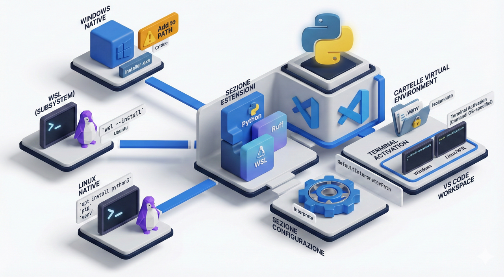

<style>
img {display: block; margin: 0 auto;}
</style>



## Installazione di Python (Windows, WSL, Linux) e configurazione di VS Code

### 1. Introduzione

Il presente documento ha lo scopo di fornire istruzioni dettagliate e rigorose per la predisposizione di un ambiente di sviluppo Python professionale. Verranno analizzate tre metodologie di installazione: l'esecuzione nativa su sistema operativo Windows, l'utilizzo del sottosistema Windows per Linux (WSL) e l'installazione su ambiente Linux nativo. Infine, verrà trattata la configurazione dell'IDE Visual Studio Code.

### 2. Installazione Nativa su Windows

L'installazione nativa è consigliata per lo sviluppo di script di automazione locale o applicazioni che necessitano di interagire direttamente con le API di Windows.

#### 2.1 Download dell'Eseguibile

Si proceda visitando il sito ufficiale della Python Software Foundation:

- **URL:** <https://www.python.org/downloads/>

Si deve scaricare l'ultima versione stabile disponibile (attualmente Python 3.x). Si consiglia di selezionare l'installer per "Windows installer (64-bit)".

#### 2.2 Procedura di Installazione

Una volta avviato l'eseguibile `.exe`, è **imperativo** seguire i seguenti passaggi con estrema attenzione:

1. Nella prima schermata, si deve selezionare la casella **"Add python.exe to PATH"**.

    :::note
    La mancata selezione di questa opzione impedirà l'esecuzione di Python da riga di comando (PowerShell/CMD), causando errori frequenti in fase di compilazione.
    :::

2. Si selezioni **"Customize installation"** per avere controllo sui componenti.

3. Si verifichi che tutte le "Optional Features" (in particolare **pip**, **tcl/tk** e **IDLE**) siano selezionate. Premere "Next".

4. Nelle "Advanced Options", si consiglia di selezionare **"Install for all users"** (se si dispone di privilegi di amministratore) per installare Python in una directory di sistema (es. `C:\Program Files\Python3x`), evitando problemi con percorsi troppo lunghi.

5. Cliccare su **"Install"** e attendere il termine della procedura.

#### 2.3 Verifica tramite PowerShell

Per confermare la corretta installazione, si apra **PowerShell** e si digitino i seguenti comandi:

```bash
python --version
pip --version

```

Se il sistema restituisce il numero di versione (es. `Python 3.12.x`), l'installazione è avvenuta con successo.

### 3. Installazione su Windows Subsystem for Linux (WSL)

Questa metodologia è lo standard industriale per lo sviluppo web e backend, permettendo di utilizzare un ambiente Linux completo integrato in Windows.

#### 3.1 Abilitazione di WSL

Se WSL non è mai stato attivato sulla macchina, si apra **PowerShell come Amministratore** ed si esegua il comando:

```bash
wsl --install

```

Al termine, sarà richiesto un riavvio del computer. Per impostazione predefinita, verrà installata la distribuzione **Ubuntu**.

#### 3.2 Configurazione dell'Ambiente Linux

Dopo il riavvio, aprendo l'applicazione "Ubuntu" dal menu Start, verrà richiesto di creare un username e una password UNIX.

Le distribuzioni Linux solitamente includono Python preinstallato, ma è prassi aggiornarlo e installare i gestori di pacchetti. Si eseguano i seguenti comandi nel terminale Linux:

```bash
# Aggiornamento dei repository
sudo apt update && sudo apt upgrade -y

# Verifica della versione installata
python3 --version

# Installazione del gestore pacchetti pip e del modulo venv (essenziale per ambienti virtuali)
sudo apt install python3-pip python3-venv -y

```

Per confermare la corretta installazione, dal terminale si digitino i seguenti comandi:

```bash
python --version
pip --version

```

### 4. Installazione su Linux Nativo (Debian/Ubuntu based)

Per completezza didattica, si riporta la procedura per sistemi operativi Linux nativi. La procedura è analoga a quella per WSL, data la natura condivisa dei comandi.

#### 4.1 Utilizzo del Package Manager

Si apra il terminale ed si eseguano i seguenti comandi per garantire l'installazione dell'interprete e degli strumenti di sviluppo essenziali:

```bash
# Aggiornamento liste pacchetti
sudo apt update

# Installazione di Python 3 (se non presente)
sudo apt install python3

# Installazione strumenti aggiuntivi
sudo apt install python3-pip python3-venv build-essential libssl-dev libffi-dev python3-dev

```

*Nota:* I pacchetti `build-essential` e le librerie `dev` sono cruciali per compilare estensioni C di Python che potrebbero essere richieste da librerie avanzate come Pandas o NumPy.

### 5. Configurazione dell'IDE: Visual Studio Code

Visual Studio Code (VS Code) è l'editor raccomandato per la sua versatilità e l'ampio ecosistema di estensioni.

#### 5.1 Installazione del Software

Scaricare l'installer appropriato per il proprio sistema operativo (Windows o Linux) dal sito ufficiale:

- **URL:** <https://code.visualstudio.com/>

#### 5.2 Installazione delle Estensioni Fondamentali

Aprire VS Code e recarsi nella sezione **Extensions** (icona con quattro quadrati nella barra laterale sinistra o `Ctrl+Shift+X`). Si proceda all'installazione delle seguenti estensioni:

1. **Python (Microsoft):** Fornisce IntelliSense (autocompletamento), debugging e navigazione del codice. È l'estensione fondamentale.

2. **Ruff (Astral Software):** Un linter e formatter di nuova generazione scritto in Rust. Sostituisce integralmente strumenti precedenti come Flake8, Black, Pylint e isort, offrendo prestazioni nettamente superiori (fino a 100x più veloce) e una configurazione centralizzata.

3. **WSL (Microsoft):** *Obbligatoria se si utilizza WSL*. Permette a VS Code installato su Windows di "entrare" nel sistema Linux e utilizzare i suoi strumenti come se fossero locali.

#### 5.3 Configurazione di Ruff (Linting e Formatting)

Per garantire la conformità agli standard PEP 8 e l'ordine degli import, è necessario configurare Ruff come strumento predefinito per il linguaggio Python. Per una configurazione completa di Ruff, si veda [Configurazione VS Code con Ruff](/info-quarta/dev-tools/python/tools-and-workflows/#3-configurazione-vs-code-settingsjson).

#### 5.4 Selezione dell'Interprete (Best Practice)

È necessario impostare in VS Code il default path dell'interprete Python da utilizzare quando si avvia un progetto (*Path to default Python to use when extension loads up for the first time, no longer used once an interpreter is selected for the workspace.*). L'impostazione può essere fatta in `settings.json` (premere `ctrl+shift+P` e poi cercare `Preferences: Open Settings (JSON)`, oppure premere `Ctrl+,` e cercare la voce `Python: Default Interpreter Path`). Questo percorso varia a seconda del metodo di installazione adottato:

- **Scenario Windows:** Il percorso da impostare dovrà essere simile a `C:\Program Files\Python3x\python.exe`.

- **Scenario WSL:** Il percorso da impostare dovrà essere simile a `/usr/bin/python3`.

Nel caso di configurazione manuale del file `settings.json`, si aggiunga la seguente riga seguente per il caso Windows:

```json
 "python.defaultInterpreterPath": "c:\\Program Files\\Python313\\python.exe",
```

Per il caso WSL si aggiunga invece:

```json
 "python.defaultInterpreterPath": "/usr/bin/python3",
```

In alternativa si può selezionare l'interprete direttamente dal Command Palette di VS Code:

1. Aprire un file con estensione `.py` o una cartella di progetto.

2. Premere `F1` o `Ctrl+Shift+P` per aprire la Command Palette.

3. Digitare e selezionare: **"Python: Select Interpreter"**.

Qui si presenteranno due scenari:

- **Scenario Windows:** Selezionare il percorso simile a `C:\Program Files\Python3x\python.exe`.

- **Scenario WSL:** Se si è aperto il progetto tramite terminale WSL (digitando `code .`), VS Code rileverà automaticamente l'interprete Linux (`/usr/bin/python3`).

#### 5.5 Creazione di un Ambiente Virtuale

**Si raccomanda vivamente di non installare mai librerie globalmente**. Per ogni progetto, si crei un ambiente isolato:

1. Aprire il terminale integrato in VS Code (`Ctrl + j` oppure `Terminal > New Terminal`).

2. Eseguire il comando per creare l'ambiente:

    - **Windows:** `python -m venv .venv`

    - **Linux/WSL:** `python3 -m venv .venv`

3. VS Code rileverà la nuova cartella `.venv` e chiederà se utilizzarla per il workspace. Rispondere **Sì**. Se Vs Code non dovesse rilevare automaticamente l'ambiente virtuale, si può procedere all'attivazione manuale dell'ambiente virtuale seguendo il passo successivo.

4. L'attivazione dell'ambiente virtuale python varia a seconda del sistema operativo e del terminale in uso. Per attivare l'ambiente virtuale, si esegua il comando appropriato:

    - **Windows (PowerShell):** `.venv\Scripts\Activate.ps1`
  
    - **Windows (CMD):** `.venv\Scripts\activate.bat`

    - **Windows (Git Bash):** `source .venv/Scripts/activate`

    - **Linux/WSL:** `source .venv/bin/activate`

## 6. Conclusione

L'ambiente è ora correttamente configurato. Si ricorda che la padronanza degli strumenti è propedeutica alla scrittura di codice di qualità. Si consiglia di verificare regolarmente gli aggiornamenti sia dell'interprete Python che delle estensioni di Visual Studio Code per garantire stabilità e sicurezza.
