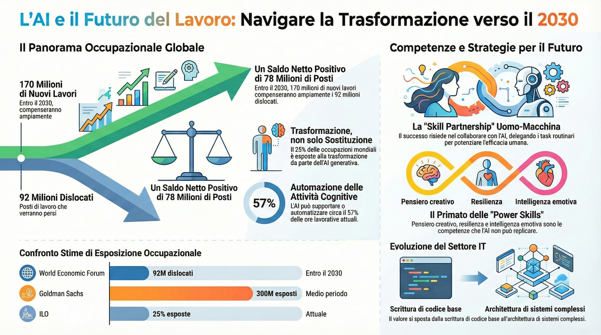
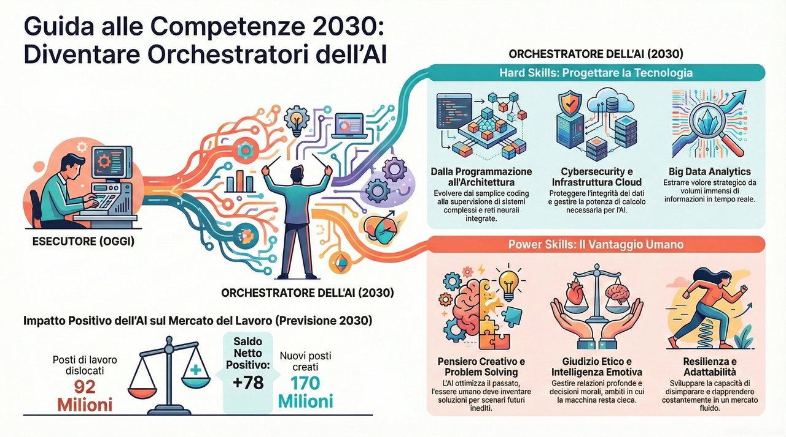
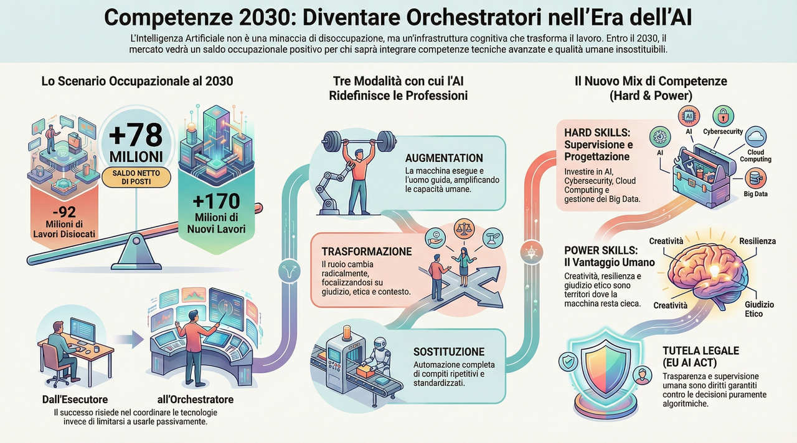

## Affrontare la rivoluzione dell'intelligenza artificiale: un'analisi completa dell'impatto sul mercato del lavoro e sulle professioni del futuro

L'intelligenza artificiale rappresenta una delle trasformazioni tecnologiche più significative nella storia dell'umanità, con implicazioni profonde e durature sul mercato del lavoro globale. A differenza delle precedenti rivoluzioni industriali, che hanno interessato principalmente attività fisiche e manuali, l'AI sta investendo direttamente le capacità cognitive, creative e decisionali che tradizionalmente hanno distinto il lavoro umano da quello automatizzato. Questa caratteristica fondamentale rende l'attuale transizione tecnologica unica nel suo genere, ponendo sfide e opportunità completamente inedite per lavoratori, imprese e istituzioni educative.

**Il World Economic Forum, nel suo rapporto *Future of Jobs Report 2025*, ha evidenziato come** l'impatto dell'AI sul mercato del lavoro sia destinato a essere strutturale e non transitorio.[^wef2025] Secondo le stime dell'organizzazione internazionale, **entro il 2030 verranno eliminati circa 92 milioni di posti di lavoro a livello globale, ma contemporaneamente ne verranno creati circa 170 milioni di nuovi**.[^wef2025] Questo dato, apparentemente rassicurante, nasconde però una realtà più complessa: la transizione richiederà una profonda riqualificazione delle competenze, con conseguenze significative sulla distribuzione delle opportunità lavorative e sui meccanismi di accesso al mercato del lavoro.

**L'International Labour Organization (ILO), l'agenzia specializzata delle Nazioni Unite per le questioni lavorative**, ha elaborato metodologie sofisticate per misurare l'esposizione occupazionale all'AI generativa. I risultati di queste analisi indicano che **circa un quarto delle occupazioni a livello mondiale è potenzialmente esposto alla trasformazione da parte delle tecnologie di intelligenza artificiale generativa.**[^ilo-gaijobs] Tuttavia, il termine 'trasformazione' è fondamentale: l'ILO sottolinea che non si tratta necessariamente di sostituzione, quanto piuttosto di una riconfigurazione sostanziale delle attività e delle competenze richieste.

In questo articolo, partendo da un'analisi approfondita delle principali ricerche internazionali sull'impatto dell'AI sul mercato del lavoro, si cerca di fornire una panoramica completa e articolata delle dinamiche in corso e delle prospettive future, con particolare attenzione agli studenti degli istituti tecnici informatici. In particolare, gli obiettivi specifici di questa analisi sono:

1. Fornire una panoramica completa e aggiornata delle principali ricerche internazionali sull'impatto dell'AI sul mercato del lavoro, con particolare attenzione ai report del **World Economic Forum**, **McKinsey Global Institute**, **International Labour Organization** e **Goldman Sachs**.

2. Analizzare le tre dimensioni fondamentali dell'impatto dell'AI: l'aumento delle capacità umane (**augmentation**), la **trasformazione dei ruoli professionali** e la potenziale **sostituzione** di alcune attività lavorative.

3. Identificare i settori economici maggiormente esposti alla trasformazione tecnologica e le relative implicazioni per le figure professionali coinvolte.

4. Definire le competenze chiave per il futuro del lavoro, distinguendo tra competenze tecniche specifiche e competenze trasversali di carattere umano e sociale.

5. Fornire indicazioni pratiche e strategie concrete per prepararsi al cambiamento, con particolare riferimento al percorso formativo degli studenti degli istituti tecnici informatici.

## L'evoluzione dell'intelligenza artificiale e il mercato del lavoro

Per comprendere appieno l'impatto dell'intelligenza artificiale sulle professioni del futuro, è necessario innanzitutto analizzare l'evoluzione storica di questa tecnologia e il contesto in cui si colloca la sua attuale diffusione. L'AI non è una tecnologia recente: le sue origini risalgono agli anni Cinquanta del Novecento, quando pionieri come **Alan Turing** si ponevano la domanda fondamentale se le macchine potessero pensare. Tuttavia, è solo nell'ultimo decennio che l'intelligenza artificiale ha raggiunto un livello di maturità e capacità applicativa tale da influenzare significativamente il mercato del lavoro su scala globale.

L'introduzione dell'AI generativa, in particolare i modelli linguistici di grandi dimensioni (Large Language Models o LLM), ha rappresentato un punto di svolta fondamentale. A differenza delle precedenti applicazioni di AI, focalizzate su attività specifiche e ben delimitate come il riconoscimento di immagini o l'analisi di dati strutturati, l'AI generativa è in grado di produrre contenuti originali, dialogare in linguaggio naturale e svolgere compiti che fino a poco tempo fa erano considerati esclusivamente umani. Questa capacità ha espanso enormemente il campo di applicazione dell'AI, investendo settori professionali tradizionalmente considerati al riparo dall'automazione.

### Le ondate di automazione nella storia

La storia dell'automazione e delle sue conseguenze sul mercato del lavoro offre importanti elementi di riflessione per comprendere le trasformazioni attuali. **La prima rivoluzione industriale**, tra la fine del XVIII e l'inizio del XIX secolo, ha visto la meccanizzazione progressiva della produzione manifatturiera, con la sostituzione del lavoro artigianale da parte delle fabbriche. **La seconda rivoluzione industriale**, tra la fine del XIX e l'inizio del XX secolo, ha introdotto la produzione di massa e l'elettrificazione. **La terza rivoluzione industriale, o rivoluzione digitale,** nella seconda metà del XX secolo, ha portato all'automazione dei processi amministrativi e alla nascita dell'industria informatica.

**L'attuale quarta rivoluzione industriale**, spesso definita Industria 4.0, è caratterizzata dalla convergenza di tecnologie fisiche, digitali e biologiche. L'intelligenza artificiale, insieme a Internet delle Cose (IoT), robotica avanzata, biotecnologie e nanotecnologie, costituisce uno dei pilastri fondamentali di questa trasformazione. **A differenza delle precedenti ondate di automazione, che hanno interessato prevalentemente il lavoro manuale e ripetitivo, l'AI sta trasformando in misura crescente attività cognitive, creative e decisionali, ampliando significativamente la gamma di professioni potenzialmente interessate dal cambiamento**.[^mckinsey2025]

### Dall'AI tradizionale all'AI generativa

L'AI tradizionale, spesso definita *narrow AI* o AI debole, era progettata per svolgere compiti specifici e ben definiti. Esempi tipici includevano i sistemi di raccomandazione, i filtri antispam, i software di riconoscimento ottico dei caratteri e i sistemi di diagnostica medica basati su regole predefinite. Queste applicazioni, pur essendo estremamente utili, avevano un ambito di applicazione limitato e richiedevano un notevole intervento umano per la programmazione e il mantenimento.

L'AI generativa rappresenta un salto qualitativo fondamentale. Questi sistemi, basati su reti neurali profonde addestrate su enormi quantità di dati, sono in grado di generare contenuti originali, comprendere e produrre linguaggio naturale, ragionare su problemi complessi e adattarsi a contesti diversi senza una programmazione specifica. I modelli come GPT-4, Claude e altri LLM dimostrano capacità che fino a pochi anni fa erano considerate esclusive dell'intelligenza umana: scrivere testi articolati, produrre codice informatico funzionante, analizzare documenti complessi e persino svolgere attività creative come la composizione musicale o la creazione di opere d'arte.

**Il McKinsey Global Institute, nel rapporto *Agents, robots, and us: Skill partnerships in the age of AI* (2025), stima che le tecnologie attualmente disponibili potrebbero teoricamente automatizzare circa il 57% delle ore di lavoro attualmente svolte negli Stati Uniti**.[^mckinsey2025] Questo dato non significa che il 57% dei posti di lavoro sarà eliminato, ma piuttosto che una quota significativa delle attività attualmente svolte dai lavoratori potrà essere supportata o sostituita da sistemi di AI. La distinzione tra attività e professione è fondamentale: la maggior parte delle professioni è composta da un mix di attività, alcune delle quali più esposte all'automazione di altre.

## Le tre dimensioni dell'impatto: aumento, trasformazione e sostituzione

L'analisi dell'impatto dell'AI sul mercato del lavoro richiede una comprensione articolata delle diverse modalità con cui la tecnologia interagisce con il lavoro umano. La letteratura scientifica e i rapporti istituzionali concordano nell'identificare tre dimensioni principali: **l'aumento delle capacità (augmentation), la trasformazione dei ruoli e la sostituzione di alcune attività**. Queste tre dimensioni non sono mutuamente esclusive ma coesistono in proporzioni variabili nelle diverse professioni e settori economici.

### L'aumento delle capacità umane (Augmentation)

L'augmentation, o aumento delle capacità, rappresenta la dimensione più promettente dell'impatto dell'AI sul lavoro. In questa prospettiva, **l'AI funge da strumento che amplifica le capacità umane, permettendo ai lavoratori di svolgere le proprie attività con maggiore efficacia, velocità e precisione. L'AI non sostituisce il lavoratore ma lo affianca, gestendo le attività più routinarie e lasciando allo svolgimento umano quelle che richiedono giudizio, creatività e competenze relazionali**.

Un esempio paradigmatico di augmentation è rappresentato dall'utilizzo dell'AI nel campo medico. I sistemi di diagnostica assistita possono analizzare immagini radiologiche con un livello di precisione comparabile o superiore a quello dei radiologi umani, segnalando potenziali anomalie e supportando il processo di diagnosi. Tuttavia, il medico mantiene il ruolo centrale: interpreta i risultati nel contesto clinico del paziente, comunica con lui e con i familiari, prende decisioni terapeutiche complesse che tengono conto di fattori non riducibili a dati. L'AI aumenta la capacità del medico di identificare patologie, ma non sostituisce le competenze umane fondamentali della professione.

**Nel settore informatico, l'augmentation si manifesta attraverso gli strumenti di assistenza alla programmazione (coding assistants)**. Piattaforme come GitHub Copilot o Amazon CodeWhisperer suggeriscono porzioni di codice, completano funzioni, identificano potenziali bug e propongono ottimizzazioni. **Il programmatore non è sostituito ma potenziato: può concentrarsi sull'architettura del software, sulla risoluzione di problemi complessi e sull'innovazione, delegando all'AI le parti più routinarie della scrittura del codice**. Secondo il rapporto McKinsey 'AI in the workplace: A report for 2025', quasi tutte le aziende investono in AI, ma solo l'1% ritiene di aver raggiunto la maturità nell'utilizzo di queste tecnologie, indicando un enorme potenziale di sviluppo ancora inesplorato.

### La trasformazione dei ruoli professionali

La seconda dimensione dell'impatto dell'AI è la trasformazione dei ruoli professionali. A differenza dell'augmentation, che mantiene sostanzialmente invariata la natura del lavoro amplificandone le capacità, **la trasformazione comporta una riconfigurazione sostanziale delle attività, delle competenze richieste e delle responsabilità associate a una professione. Il lavoratore continua a svolgere la propria attività, ma il contenuto del lavoro cambia significativamente.**

L'ILO, nel rapporto 'Generative AI and Jobs: A Refined Global Index of Occupational Exposure', evidenzia come circa un quarto delle occupazioni a livello mondiale sia potenzialmente esposto alla trasformazione da parte dell'AI generativa. Questa percentuale varia significativamente tra Paesi sviluppati e in via di sviluppo, tra settori economici e tra livelli di istruzione. Le professioni del terziario avanzato, che implicano elaborazione di informazioni, comunicazione e attività cognitive complesse, sono quelle maggiormente esposte alla trasformazione.

Un esempio significativo di trasformazione è rappresentato dalla professione del giornalista. Tradizionalmente, il giornalista svolgeva un insieme di attività che includevano la ricerca delle notizie, la verifica delle fonti, la stesura degli articoli e la revisione editoriale. L'AI generativa può supportare o automatizzare diverse di queste attività: la ricerca di informazioni può essere accelerata da sistemi di analisi automatica di grandi volumi di documenti, la stesura di articoli informativi di base può essere delegata a sistemi automatizzati, la correzione delle bozze può essere gestita da strumenti intelligenti. Tuttavia, il giornalista non scompare: il suo ruolo si trasforma, concentrandosi maggiormente sull'interpretazione, sull'approfondimento, sull'inchiesta investigativa e sul giudizio editoriale che richiede sensibilità etica e comprensione del contesto sociale.

### La sostituzione di attività e professioni

La terza dimensione, quella della sostituzione, è la più temuta e controversa. **Si riferisce alla possibilità che alcune attività lavorative, o intere professioni, vengano completamente svolte da sistemi di AI senza necessità di intervento umano significativo**. È importante distinguere tra la sostituzione di singole attività all'interno di una professione e la sostituzione dell'intera professione: mentre la prima è già ampiamente in corso, la seconda riguarda un numero limitato di professioni caratterizzate da alta standardizzazione e bassa complessità decisionale.

Goldman Sachs, in un celebre rapporto del 2023, ha stimato che fino a 300 milioni di posti di lavoro a livello globale potrebbero essere esposti all'automazione tramite AI generativa.[^gs2023] L'istituto finanziario prevede che l'automazione potrebbe interessare fino al 50% dei posti di lavoro entro il 2045, considerando sia l'AI generativa che la robotica avanzata. Tuttavia, lo stesso rapporto sottolinea che l'esposizione all'automazione non equivale alla perdita del posto di lavoro: molti lavori verranno trasformati piuttosto che eliminati, e nuove professioni emergeranno per soddisfare esigenze oggi inesistenti.

**Le professioni maggiormente a rischio di sostituzione sono quelle caratterizzate da elevata ripetitività, procedure standardizzate e limitata richiesta di giudizio discrezionale. Esempi includono gli addetti all'inserimento dati, alcuni tipi di lavori amministrativi di routine, i centralinisti e, in parte, i lavori di traduzione di testi tecnici standardizzati**. È fondamentale notare che spesso la sostituzione riguarda singole attività piuttosto che intere professioni: un commercialista non verrà sostituito, ma molte delle attività contabili di routine potranno essere automatizzate, lasciando al professionista le attività di consulenza, pianificazione fiscale e relazione con il cliente.

## Dati e statistiche dai principali report internazionali

La comprensione dell'impatto dell'AI sul mercato del lavoro richiede un'analisi attenta dei dati quantitativi prodotti dalle principali istituzioni di ricerca internazionali. I rapporti del World Economic Forum, McKinsey Global Institute, International Labour Organization e Goldman Sachs offrono prospettive complementari e stime che, pur differendo nei dettagli, convergono nel delineare uno scenario di profonda trasformazione.

### World Economic Forum: Future of Jobs Report 2025

Il **'Future of Jobs Report 2025'** del **World Economic Forum** rappresenta una delle analisi più complete sull'evoluzione del mercato del lavoro. Il rapporto si basa sulla prospettiva di oltre 1.000 datori di lavoro globali, collettivamente rappresentanti più di 14 milioni di lavoratori in 22 settori industriali e 55 economie mondiali. I risultati offrono una visione articolata delle tendenze in corso e delle previsioni per il prossimo decennio.

I dati principali emersi dal rapporto includono:

- Entro il 2030, circa 92 milioni di posti di lavoro verranno eliminati a livello globale, mentre circa 170 milioni di nuovi posti verranno creati, per un saldo netto positivo di 78 milioni di occupazioni.

- Circa il 54% dei rispondenti prevede che l'AI dislocherà posti di lavoro esistenti, mentre il 24% prevede che creerà nuove opportunità.

- Le competenze più richieste nel 2030 saranno: **AI e big data**, **reti e cybersecurity**, **literacy tecnologica**, **pensiero creativo**, **resilienza e adattabilità**.

- Il 59% dei lavoratori necessiterà di formazione per l'aggiornamento delle competenze entro il 2030.

**Tabella 1: Sintesi delle principali stime sui posti di lavoro:**

| **Fonte** | **Posti trasformati/esposti** | **Orizzonte temporale** |
| --- | --- | --- |
| World Economic Forum | 92 milioni eliminati | 2030 |
| McKinsey Global Institute | 57% ore lavorative | Attuale |
| Goldman Sachs | 300 milioni esposti | Medio periodo |
| International Labour Organization | 25% occupazioni | Attuale |

### McKinsey Global Institute: analisi quantitative

Il **McKinsey Global Institute** ha prodotto una serie di rapporti sull'impatto dell'automazione e dell'AI sul lavoro, caratterizzati da un approccio quantitativo rigoroso. Il rapporto ***A new future of work: The race to deploy AI and raise skills in Europe and beyond* (2024)** analizza specificamente il contesto europeo, evidenziando come la corsa all'adozione dell'AI sia accompagnata dalla necessità di elevare le competenze della forza lavoro.

**Secondo McKinsey, entro il 2030 circa il 30% dei posti di lavoro attuali negli Stati Uniti potrebbe essere automatizzato, con il 60% significativamente alterato dagli strumenti di AI**.[^mckinsey2024] Il rapporto sottolinea come il potenziale di automazione vari significativamente tra settori: le attività finanziarie e assicurative presentano il più alto potenziale di automazione (fino al 66% delle attività), seguite dal settore manifatturiero e da quello dei servizi professionali. Al contrario, settori come l'istruzione, la sanità e i servizi sociali presentano un potenziale di automazione inferiore, data la prevalenza di attività che richiedono interazione umana e competenze relazionali.

### International Labour Organization: prospettiva globale

L'International Labour Organization offre una prospettiva peculiare, concentrandosi sulle implicazioni dell'AI per il lavoro a livello globale e con particolare attenzione alle diseguaglianze tra Paesi sviluppati e in via di sviluppo. **Il rapporto *Mind the AI Divide: Shaping a Global Perspective on the Future of Work* (2024) evidenzia come l'adozione dell'AI sia fortemente disomogenea a livello mondiale, con il rischio di ampliare il divario tra economie avanzate e quelle emergenti**.[^ilo-mind]

L'ILO ha sviluppato una metodologia sofisticata per misurare l'esposizione occupazionale all'AI generativa, combinando dati a livello di attività (task-level data), input esperti e valutazioni dei modelli di AI. I risultati mostrano che l'esposizione varia non solo tra settori, ma anche tra Paesi in base alla struttura occupazionale. I Paesi con una maggiore quota di occupazione nel terziario avanzato presentano un'esposizione più alta, ma anche maggiori opportunità di sfruttare i benefici dell'augmentation. Al contrario, i Paesi in cui prevale l'occupazione agricola e manifatturiera potrebbero vedere un impatto minore diretto dall'AI generativa, ma rischiare di perdere opportunità di sviluppo economico legate alla nuova rivoluzione tecnologica.

## I settori economici maggiormente esposti all'AI

L'impatto dell'AI non è uniforme tra i diversi settori economici. Alcune industrie sono particolarmente esposte alla trasformazione tecnologica, mentre altre risultano relativamente meno interessate. La comprensione di queste differenze è fondamentale per orientare le scelte formative e professionali degli studenti e per supportare le strategie di transizione delle imprese e delle istituzioni.

### Servizi finanziari e assicurativi

Il settore finanziario e assicurativo rappresenta uno dei campi di applicazione più promettenti per l'AI, ma anche uno dei più esposti alla trasformazione. Le attività di analisi dei rischi, valutazione del merito creditizio, gestione degli investimenti e rilevamento delle frodi sono già ampiamente supportate da sistemi di AI. I robot-advisor, i sistemi di trading algoritmico e le piattaforme di insurtech stanno ridefinendo il modo in cui i servizi finanziari vengono erogati.

Secondo McKinsey, fino al 66% delle attività nel settore finanziario potrebbero essere automatizzate. Tuttavia, questo non significa la scomparsa del settore, ma la sua profonda riconfigurazione. I professionisti finanziari vedranno ridursi le attività di elaborazione dati e reporting, mentre aumenterà il valore delle competenze consulenziali, relazionali e strategiche. L'interpretazione di scenari complessi, la gestione delle relazioni con i clienti ad alto valore aggiunto e la supervisione etica degli algoritmi diventeranno competenze centrali.

### Tecnologia dell'informazione e sviluppo software

Paradossalmente, il settore tecnologico è uno dei più investiti dalla trasformazione indotta dall'AI. Gli sviluppatori software, i data analyst e i professionisti IT in generale si trovano a operare con strumenti che trasformano radicalmente il loro lavoro. Gli assistenti alla programmazione basati su AI possono generare codice, identificare bug, proporre ottimizzazioni e persino tradurre codice tra linguaggi diversi.

Per gli studenti degli istituti tecnici informatici, questo scenario offre opportunità e sfide. Da un lato, la produttività individuale può aumentare enormemente grazie agli strumenti di AI; dall'altro, le competenze puramente esecutive (scrivere codice di base, configurare sistemi standard) perderanno valore. **Le competenze che diventeranno più preziose includono l'architettura dei sistemi, la progettazione di soluzioni innovative, la comprensione profonda dei principi informatici, la gestione di progetti complessi e la capacità di integrare diverse tecnologie**. Chi saprà utilizzare l'AI come strumento di potenziamento delle proprie capacità avrà un vantaggio competitivo significativo.

### Sanità e servizi sociali

Il settore sanitario presenta un quadro complesso, con aree di forte impatto dell'AI accanto ad altre relativamente meno toccate. La diagnostica per immagini, l'analisi di dati clinici, la farmacologia computazionale e la gestione amministrativa sono ambiti in cui l'AI sta già avendo un impatto significativo. I sistemi di diagnostica assistita possono identificare patologie in immagini radiologiche con precisione superiore a quella umana in specifici contesti.

Tuttavia, la medicina e la cura non si riducono alla diagnosi. La relazione medico-paziente, la comunicazione di notizie difficili, il supporto emotivo, la presa in carico globale della persona sono dimensioni che l'AI non può replicare. I professionisti sanitari vedranno trasformarsi il loro lavoro, con una riduzione delle attività diagnostico-strumentali e un aumento del valore attribuito alle competenze relazionali, etiche e di giudizio clinico complesso. I servizi sociali, caratterizzati da un'intensa componente relazionale, risultano ancora meno esposti all'automazione diretta.

### Istruzione e formazione

Il settore dell'istruzione sta vivendo una trasformazione significativa, accelerata dalla pandemia e dall'introduzione dell'AI generativa. I sistemi di tutoraggio intelligente, la personalizzazione dell'apprendimento, la generazione automatica di contenuti didattici e la valutazione assistita sono applicazioni che stanno entrando nelle scuole e nelle università. Tuttavia, il ruolo del docente rimane centrale: l'AI può supportare l'insegnamento, ma non può sostituire la guida pedagogica, il mentoring, l'esempio personale e la capacità di ispirare e motivare gli studenti.

Il World Economic Forum sottolinea come l'istruzione e la formazione continua diventino sempre più centrali in un contesto di rapida obsolescenza delle competenze. Il 59% dei lavoratori necessiterà di aggiornamento professionale entro il 2030, creando domanda per formatori, progettisti di percorsi formativi ed esperti di apprendimento continuo. Gli studenti di oggi saranno chiamati non solo ad apprendere competenze nuove, ma a sviluppare la capacità di apprendere continuamente lungo tutto l'arco della vita lavorativa.

## Le competenze del futuro: cosa serve per prosperare nell'era dell'AI

La definizione delle competenze necessarie per prosperare nell'era dell'AI rappresenta uno dei temi centrali del dibattito sul futuro del lavoro. Il World Economic Forum, nel Future of Jobs Report 2025, identifica un set di competenze chiave che saranno sempre più richieste nel prossimo decennio. Queste competenze possono essere raggruppate in due grandi categorie: le competenze tecniche specifiche e le competenze trasversali di carattere umano e sociale.

### Competenze tecniche

Le competenze tecniche richieste dal mercato del lavoro stanno evolvendo rapidamente. Al primo posto nella classifica del World Economic Forum trovano l'AI e i big data: la capacità di comprendere, utilizzare e sviluppare sistemi di intelligenza artificiale e di analizzare grandi volumi di dati diventa una competenza trasversale, rilevante non solo per i professionisti IT ma per un'ampia gamma di ruoli professionali. Seguono le competenze in materia di reti e cybersecurity: la crescente digitalizzazione e interconnessione dei sistemi richiede professionisti capaci di proteggere le infrastrutture digitali e i dati sensibili.

Le principali competenze tecniche individuate includono:

1. **AI e machine learning**: comprensione dei principi fondamentali, capacità di interagire con sistemi di AI, sviluppo di applicazioni basate su AI.

2. **Big data e data analytics**: raccolta, elaborazione, analisi e visualizzazione di grandi volumi di dati per supportare decisioni strategiche.

3. **Cybersecurity**: protezione dei sistemi informatici, gestione dei rischi digitali, risposta agli incidenti di sicurezza.

4. **Cloud computing**: progettazione, implementazione e gestione di infrastrutture cloud.

5. **Programmazione e sviluppo software**: competenze di coding che si evolvono verso la progettazione di sistemi e l'integrazione di tecnologie.

### Competenze trasversali e soft skills

Paradossalmente, mentre l'automazione investe le competenze tecniche, **le competenze umane e sociali acquisiscono un valore crescente**. Queste competenze, spesso definite *soft skills* o *power skills*, sono quelle che l'AI fatica maggiormente a replicare e che diventano pertanto il fattore differenziale dei professionisti di successo. **Il pensiero creativo, la risoluzione di problemi complessi, l'intelligenza emotiva, la comunicazione efficace e la capacità di lavorare in team sono competenze che i sistemi di AI non possono sostituire**.

Le competenze trasversali più richieste secondo il World Economic Forum sono:

1. **Pensiero analitico e creativo**: capacità di analizzare problemi complessi, identificare soluzioni innovative e generare idee originali.

2. **Resilienza e adattabilità**: predisposizione al cambiamento, capacità di gestire l'incertezza e di apprendere continuamente.

3. **Leadership e influenza sociale**: capacità di guidare team, motivare le persone, negoziare e costruire consenso.

4. **Comunicazione efficace**: capacità di esprimersi chiaramente, ascoltare attivamente e adattare la comunicazione a contesti e interlocutori diversi.

5. **Collaborazione e lavoro di team**: capacità di lavorare efficacemente con persone diverse, in contesti multiculturali e spesso a distanza.

### Il concetto di skill partnership

Il McKinsey Global Institute introduce il concetto fondamentale di **skill partnership**, ovvero la capacità di combinare efficacemente le competenze umane con quelle delle macchine. **Nell'era dell'AI, il lavoratore di successo non è colui che compete con la macchina, ma colui che sa collaborare con essa, integrando le proprie capacità con quelle degli strumenti tecnologici a disposizione**.

La skill partnership implica la capacità di identificare quali attività delegare all'AI e quali mantenere sotto il proprio controllo, di verificare criticamente i risultati prodotti dai sistemi automatizzati, di integrare informazioni provenienti da fonti diverse (umane e artificiali) e di assumersi la responsabilità delle decisioni finali. Questa capacità di orchestrazione diventa una meta-competenza trasversale, applicabile in contesti professionali molto diversi tra loro.

## Prepararsi al cambiamento: strategie per studenti e futuri professionisti

Di fronte alla trasformazione indotta dall'AI, gli studenti degli istituti tecnici informatici si trovano in una posizione privilegiata: sono già immersi in un percorso di formazione che sviluppa competenze tecniche richieste dal mercato, ma devono anche prepararsi ad affrontare un contesto lavorativo radicalmente diverso da quello delle generazioni precedenti. Le strategie di preparazione devono essere multidimensionali, investendo sia lo sviluppo di competenze specifiche sia la costruzione di un atteggiamento mentale orientato all'apprendimento continuo.

### Sviluppare una mentalità di apprendimento continuo

La caratteristica più distintiva del mercato del lavoro contemporaneo è l'accelerazione del tasso di obsolescenza delle competenze. Quello che si apprende oggi potrà essere superato o integrato da nuove conoscenze nel giro di pochi anni, se non mesi. La competenza fondamentale diventa pertanto la capacità di apprendere rapidamente, di disimparare ciò che non è più utile e di riapprendere nuove competenze in modo efficiente.

Gli studenti dovrebbero sviluppare fin da ora abitudini di apprendimento autonomo, imparando a utilizzare le risorse online (corsi, tutorial, documentazione tecnica) per integrare e approfondire quanto appreso a scuola. L'uso stesso dell'AI come strumento di apprendimento - chiedere a un chatbot di spiegare un concetto complesso, di proporre esercizi, di verificare il proprio lavoro - diventa una competenza utile che anticipa le modalità di lavoro del futuro.

### Costruire progetti concreti e portfolio

Nel mercato del lavoro del futuro, la dimostrazione delle competenze acquisirà un valore superiore alle credenziali formali. Un portfolio di progetti concreti, sviluppati autonomamente o in contesti collaborativi, diventerà un elemento distintivo nel processo di selezione. Gli studenti dovrebbero iniziare a costruire il proprio portfolio fin dai primi anni di studi, documentando i progetti svolti, le competenze applicate, le difficoltà incontrate e le soluzioni trovate.

La partecipazione a hackathon, concorsi, progetti open source e attività di volontariato digitale offre opportunità di applicare le competenze acquisite in contesti reali, di sviluppare capacità di lavoro in team e di costruire una rete di contatti professionali. Queste esperienze hanno un duplice valore: da un lato, consentono di sviluppare competenze pratiche; dall'altro, costruiscono un capitale sociale e professionale che potrà essere prezioso nella fase di transizione al mercato del lavoro.

### Coltivare competenze umane e sociali

Mentre gli istituti tecnici tendono a concentrarsi sulle competenze tecniche, è fondamentale non trascurare lo sviluppo delle competenze umane e sociali. Partecipare ad attività extrascolastiche, sportive, artistiche o di volontariato contribuisce a sviluppare capacità di leadership, lavoro in team, gestione dello stress e comunicazione. Queste competenze, spesso sottovalutate nel percorso tecnico, diventeranno il fattore differenziale nel mercato del lavoro dominato dall'AI.

Gli studenti dovrebbero cercare attivamente opportunità di collaborazione con persone diverse, di gestione di responsabilità, di esposizione pubblica. La capacità di presentare il proprio lavoro, di argomentare le proprie scelte, di gestire conflitti e divergenze sono competenze che si sviluppano con la pratica e che aumentano progressivamente il proprio valore professionale.

### Comprendere l'etica dell'AI

Un aspetto spesso trascurato ma di crescente rilevanza è la comprensione delle implicazioni etiche dell'AI. I professionisti del futuro saranno chiamati a prendere decisioni che coinvolgono sistemi di AI, a valutarne l'affidabilità e i bias, a gestire situazioni in cui le raccomandazioni dell'AI potrebbero essere in conflitto con valori etici o normativi. Una formazione che includa elementi di etica dell'AI, comprensione dei bias algoritmici, consapevolezza dei rischi di discriminazione e delle questioni di privacy diventerà sempre più importante.

## Il contesto normativo europeo: l'AI Act e i diritti dei lavoratori

L'Unione Europea ha svolto un ruolo pionieristico nella definizione di un quadro normativo per l'intelligenza artificiale, approvando nel 2024 l'AI Act, il primo regolamento al mondo che disciplina in modo sistematico l'utilizzo dell'AI.[^ai-act] Questo strumento normativo ha implicazioni significative per il mercato del lavoro europeo, stabilendo principi e requisiti che imprese e lavoratori dovrebbero conoscere.

### I principi fondamentali dell'AI Act

L'AI Act adotta un approccio basato sul rischio, distinguendo tra sistemi di AI a rischio inaccettabile (proibiti), ad alto rischio (soggetti a requisiti stringenti), a rischio limitato (soggetti a obblighi di trasparenza) e a rischio minimo (non soggetti a regolamentazione specifica). Questa classificazione ha implicazioni dirette per l'utilizzo dell'AI nel contesto lavorativo: i sistemi di AI utilizzati per il reclutamento, la gestione delle risorse umane, la valutazione delle prestazioni e il monitoraggio dei lavoratori sono generalmente classificati come ad alto rischio.

Per i sistemi ad alto rischio, l'AI Act prevede una serie di requisiti che includono: adeguate procedure di valutazione del rischio, documentazione tecnica completa, registrazione automatica degli eventi, trasparenza e disponibilità di informazioni agli utenti, supervisione umana appropriata, accuratezza e robustezza. Questi requisiti mirano a garantire che l'AI sia utilizzata in modo sicuro e rispettoso dei diritti fondamentali, inclusi i diritti dei lavoratori.

### Implicazioni per il mercato del lavoro

L'AI Act introduce importanti tutele per i lavoratori. I sistemi di AI utilizzati nelle decisioni relative all'impiego (reclutamento, selezione, valutazione, promozione, licenziamento) devono garantire trasparenza e supervisione umana. I lavoratori hanno diritto a sapere quando stanno interagendo con un sistema di AI e a ricevere informazioni su come le decisioni che li riguardano vengono prese. Questo approccio mira a prevenire discriminazioni algoritmiche e a garantire che l'automazione delle decisioni relative al lavoro non comprometta i diritti fondamentali delle persone.

Per i professionisti IT, l'AI Act crea nuove responsabilità e opportunità. La progettazione, l'implementazione e la gestione di sistemi di AI conformi al regolamento richiedono competenze specifiche che diventeranno sempre più richieste. La comprensione del quadro normativo, la capacità di valutare il rischio dei sistemi di AI, di documentare adeguatamente i processi e di garantire la conformità sono competenze che integrano quelle tecniche e che avranno un valore crescente nel mercato del lavoro europeo.

## Conclusioni: orientarsi nel futuro del lavoro

L'analisi condotta in questo documento evidenzia come l'intelligenza artificiale stia trasformando profondamente il mercato del lavoro, con effetti che si manifestano in tutte le dimensioni dell'attività professionale: dall'aumento delle capacità individuali alla trasformazione dei ruoli lavorativi, fino alla potenziale sostituzione di alcune attività. I dati presentati dai principali report internazionali convergono nel dipingere uno scenario di cambiamento strutturale, che interesserà milioni di lavoratori a livello globale nel prossimo decennio.

Tuttavia, il messaggio fondamentale che emerge dall'analisi non è di pessimismo o di rassegnazione, ma di opportunità e responsabilità. Il World Economic Forum stima che, mentre 92 milioni di posti di lavoro verranno eliminati entro il 2030, circa 170 milioni di nuovi posti verranno creati. La sfida non è la scarsità di opportunità, ma la capacità di prepararsi ad afferrarle. Per gli studenti degli istituti tecnici informatici, che già sviluppano competenze fondamentali per l'economia digitale, le prospettive sono particolarmente favorevoli, a patto di saper integrare le competenze tecniche con quelle umane e sociali che l'AI non può replicare.

Il concetto di **skill partnership**, introdotto dal McKinsey Global Institute, rappresenta la chiave di lettura più utile per orientarsi nel futuro del lavoro. Non si tratta di competere con l'AI, ma di collaborare con essa, integrando le proprie capacità con quelle degli strumenti tecnologici. Chi saprà utilizzare l'AI come leva di potenziamento delle proprie competenze, chi svilupperà la capacità di apprendimento continuo, chi coltiverà le competenze umane e sociali che la tecnologia non può sostituire, sarà nella posizione migliore per prosperare nel mercato del lavoro del futuro.

Il quadro normativo europeo, con l'AI Act, fornisce un importante elemento di tutela e orientamento, stabilendo principi di trasparenza, supervisione umana e rispetto dei diritti fondamentali che devono guidare l'utilizzo dell'AI nel contesto lavorativo. La conoscenza di questo quadro normativo diventa essa stessa una competenza professionale, sempre più richiesta in un contesto in cui la conformità etica e legale dell'AI è un requisito non opzionale.

In definitiva, l'impatto dell'AI sulle professioni del futuro non è un destino ineluttabile, ma un processo che possiamo influenzare attraverso le nostre scelte formative, professionali e di vita. Gli studenti di oggi hanno l'opportunità di prepararsi consapevolmente a questo cambiamento, sviluppando le competenze, gli atteggiamenti e le reti che consentiranno loro di costruire un futuro professionale gratificante e significativo nell'era dell'intelligenza artificiale.

## Fonti

- [World Economic Forum (2025), The Future of Jobs Report 2025][^wef2025]
- [McKinsey Global Institute (2025), Agents, robots, and us: Skill partnerships in the age of AI][^mckinsey2025]
- [McKinsey Global Institute (2024), A new future of work: The race to deploy AI and raise skills in Europe and beyond][^mckinsey2024]
- [International Labour Organization (2024), Generative AI and Jobs: A Refined Global Index of Occupational Exposure][^ilo-gaijobs]
- [European Commission (2024), AI Act][^ai-act]
- [Goldman Sachs Research (2023), How Will AI Affect the Global Workforce?][^gs2023]
- [International Labour Organization (2024), Mind the AI Divide: Shaping a Global Perspective on the Future of Work][^ilo-mind]
- [Regolamento (UE) 2024/1689 del Parlamento europeo e del Consiglio del 13 giugno 2024 (AI Act)][^ai-act]

### Fonti aggiuntive

[Malafronte, corso AI per Docenti - AI e lavoro](https://malafronte.github.io/corso-ai-docenti/ai-compass/impact-on-job-market/)

[Malafronte, corso AI per Docenti - L'impatto dell'AI nel mercato del lavoro](https://malafronte.github.io/corso-ai-docenti/corso/impact-of-ai-on-job-market/)

[World Economic Forum (2025), The jobs of the future - and the skills you need to get them](https://www.weforum.org/stories/2025/01/future-of-jobs-report-2025-jobs-of-the-future-and-the-skills-you-need-to-get-them)

[^wef2025]: World Economic Forum (2025), *The Future of Jobs Report 2025*. https://www.weforum.org/publications/the-future-of-jobs-report-2025
[^mckinsey2025]: McKinsey Global Institute (2025), *Agents, robots, and us: Skill partnerships in the age of AI*. https://www.mckinsey.com/mgi/our-research/agents-robots-and-us-skill-partnerships-in-the-age-of-ai
[^mckinsey2024]: McKinsey Global Institute (2024), *A new future of work: The race to deploy AI and raise skills in Europe and beyond*. https://www.mckinsey.com/featured-insights/future-of-work
[^ilo-gaijobs]: International Labour Organization (2024), *Generative AI and Jobs: A Refined Global Index of Occupational Exposure*. https://www.ilo.org/publications/generative-ai-and-jobs-refined-global-index-occupational-exposure
[^ilo-mind]: International Labour Organization (2024), *Mind the AI Divide: Shaping a Global Perspective on the Future of Work*. https://www.ilo.org/publications/major-publications/mind-ai-divide-shaping-global-perspective-future-work
[^gs2023]: Goldman Sachs Research (2023), *How Will AI Affect the Global Workforce?*. https://www.goldmansachs.com/insights/articles/how-will-ai-affect-the-global-workforce
[^ai-act]: Regolamento (UE) 2024/1689 del Parlamento europeo e del Consiglio del 13 giugno 2024 (AI Act). https://eur-lex.europa.eu/eli/reg/2024/1689/oj
